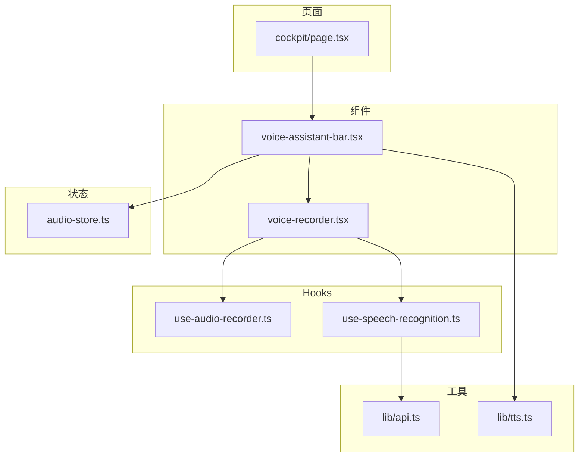
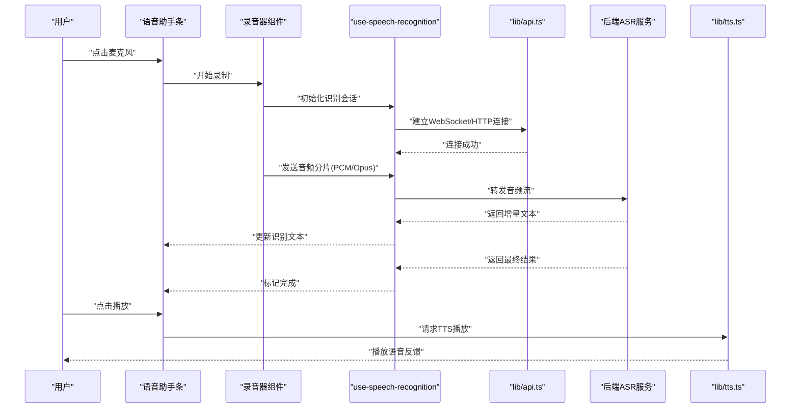
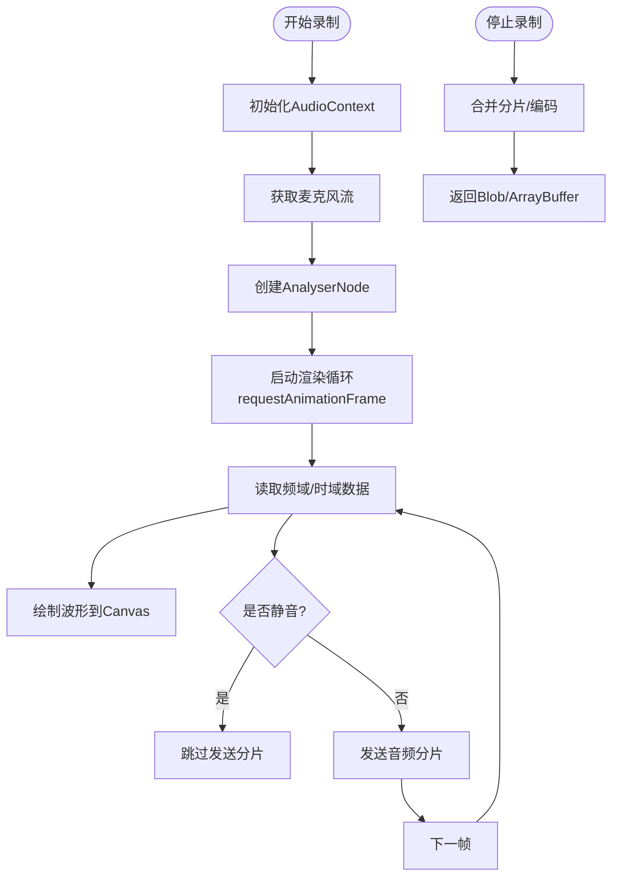
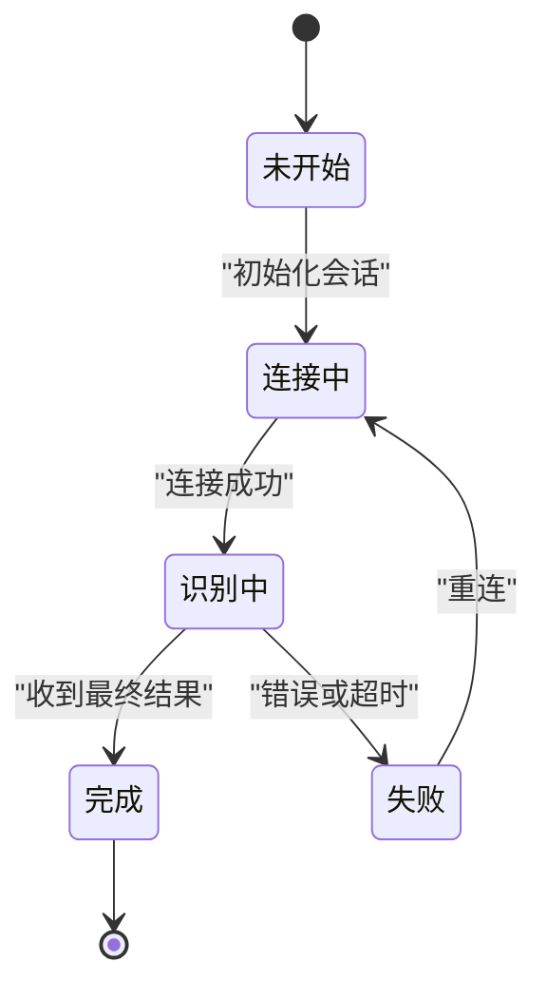
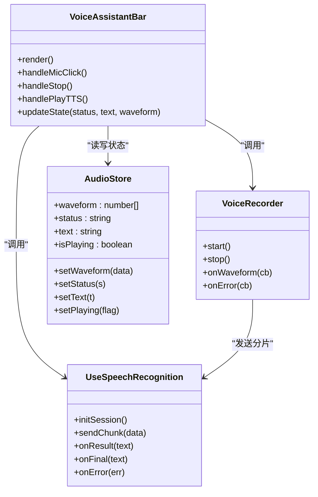
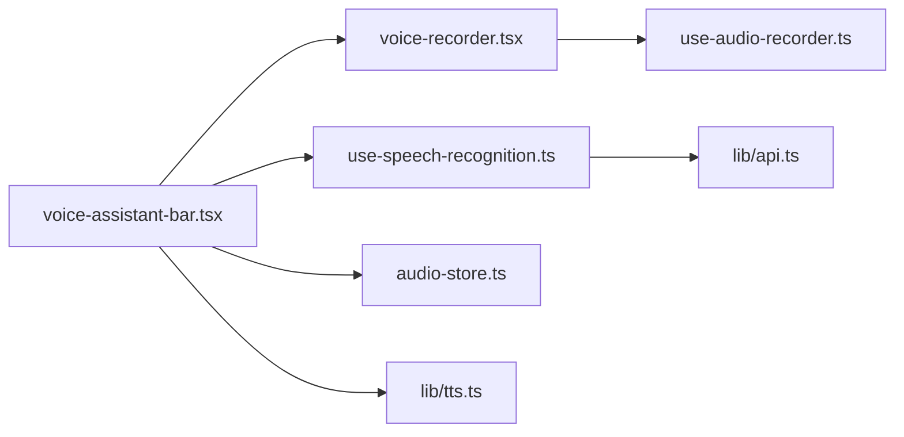

# 语音助手界面

<cite>
**本文引用的文件**   
- [voice-assistant-bar.tsx](file://frontend_design/src/components/vehicle/voice-assistant-bar.tsx)
- [voice-recorder.tsx](file://frontend_design/src/components/voice-recorder.tsx)
- [use-audio-recorder.ts](file://frontend_design/src/hooks/use-audio-recorder.ts)
- [use-speech-recognition.ts](file://frontend_design/src/hooks/use-speech-recognition.ts)
- [audio-store.ts](file://frontend_design/src/stores/audio-store.ts)
- [api.ts](file://frontend_design/src/lib/api.ts)
- [tts.ts](file://frontend_design/src/lib/tts.ts)
- [page.tsx](file://frontend_design/src/app/cockpit/page.tsx)
</cite>

## 目录
1. [简介](#简介)
2. [项目结构](#项目结构)
3. [核心组件](#核心组件)
4. [架构总览](#架构总览)
5. [详细组件分析](#详细组件分析)
6. [依赖关系分析](#依赖关系分析)
7. [性能考虑](#性能考虑)
8. [故障排查指南](#故障排查指南)
9. [结论](#结论)
10. [附录：集成与使用示例](#附录集成与使用示例)

## 简介
本文件面向NexusCockpit前端应用中的“语音助手”界面，系统性梳理其组件设计与实现，覆盖唤醒词检测、录音采集、波形可视化、识别结果展示、错误提示、TTS播放以及与后端ASR/TTS服务的通信机制。文档同时提供用户体验优化建议与集成指南，帮助开发者快速理解并扩展该功能。

## 项目结构
语音助手相关的前端代码主要分布在以下位置：
- 页面入口：cockpit页面中集成语音助手条
- 组件层：语音助手条、录音器组件
- Hooks层：音频录制Hook、语音识别Hook
- 状态层：全局音频状态Store
- 工具层：API封装、TTS封装

图表来源
- [page.tsx:1-200](file://frontend_design/src/app/cockpit/page.tsx#L1-L200)
- [voice-assistant-bar.tsx:1-200](file://frontend_design/src/components/vehicle/voice-assistant-bar.tsx#L1-L200)
- [voice-recorder.tsx:1-200](file://frontend_design/src/components/voice-recorder.tsx#L1-L200)
- [use-audio-recorder.ts:1-200](file://frontend_design/src/hooks/use-audio-recorder.ts#L1-L200)
- [use-speech-recognition.ts:1-200](file://frontend_design/src/hooks/use-speech-recognition.ts#L1-L200)
- [audio-store.ts:1-200](file://frontend_design/src/stores/audio-store.ts#L1-L200)
- [api.ts:1-200](file://frontend_design/src/lib/api.ts#L1-L200)
- [tts.ts:1-200](file://frontend_design/src/lib/tts.ts#L1-L200)

章节来源
- [page.tsx:1-200](file://frontend_design/src/app/cockpit/page.tsx#L1-L200)
- [voice-assistant-bar.tsx:1-200](file://frontend_design/src/components/vehicle/voice-assistant-bar.tsx#L1-L200)
- [voice-recorder.tsx:1-200](file://frontend_design/src/components/voice-recorder.tsx#L1-L200)
- [use-audio-recorder.ts:1-200](file://frontend_design/src/hooks/use-audio-recorder.ts#L1-L200)
- [use-speech-recognition.ts:1-200](file://frontend_design/src/hooks/use-speech-recognition.ts#L1-L200)
- [audio-store.ts:1-200](file://frontend_design/src/stores/audio-store.ts#L1-L200)
- [api.ts:1-200](file://frontend_design/src/lib/api.ts#L1-L200)
- [tts.ts:1-200](file://frontend_design/src/lib/tts.ts#L1-L200)

## 核心组件
- 语音助手条（Voice Assistant Bar）
  - 负责整体交互入口：显示麦克风按钮、实时状态（空闲/监听/说话中/处理中）、波形区域、识别文本与操作（重录、播放TTS）。
  - 管理唤醒词检测开关、静音检测阈值等配置项。
  - 与全局音频状态Store同步，驱动UI更新。
- 录音器组件（Voice Recorder）
  - 封装Web Audio API的媒体流获取、PCM数据分片、实时FFT计算与Canvas绘制。
  - 提供开始/停止录制接口，输出音频片段或完整Blob供识别服务使用。
- 音频录制Hook（use-audio-recorder）
  - 暴露录制生命周期控制、音量/波形数据订阅、错误事件回调。
- 语音识别Hook（use-speech-recognition）
  - 封装与后端ASR的通信（HTTP/WebSocket），支持流式增量结果与最终结果。
  - 维护识别状态机（未开始/连接中/识别中/完成/失败）。
- 音频状态Store（audio-store）
  - 集中管理当前录音状态、波形数据、识别结果、TTS播放状态等。
- 工具库
  - API封装：统一请求头、鉴权、重试、超时、错误映射。
  - TTS封装：播放控制、进度回调、错误处理。

章节来源
- [voice-assistant-bar.tsx:1-200](file://frontend_design/src/components/vehicle/voice-assistant-bar.tsx#L1-L200)
- [voice-recorder.tsx:1-200](file://frontend_design/src/components/voice-recorder.tsx#L1-L200)
- [use-audio-recorder.ts:1-200](file://frontend_design/src/hooks/use-audio-recorder.ts#L1-L200)
- [use-speech-recognition.ts:1-200](file://frontend_design/src/hooks/use-speech-recognition.ts#L1-L200)
- [audio-store.ts:1-200](file://frontend_design/src/stores/audio-store.ts#L1-L200)
- [api.ts:1-200](file://frontend_design/src/lib/api.ts#L1-L200)
- [tts.ts:1-200](file://frontend_design/src/lib/tts.ts#L1-L200)

## 架构总览
语音助手在前端的整体流程如下：用户点击麦克风后，录音器通过Web Audio API捕获设备音频，进行静音检测与分段；识别Hook建立与后端ASR的连接，将音频片段以流式方式发送；后端返回增量文本与最终结果；前端在UI上实时更新波形与文本，并提供TTS播放能力。

图表来源
- [voice-assistant-bar.tsx:1-200](file://frontend_design/src/components/vehicle/voice-assistant-bar.tsx#L1-L200)
- [voice-recorder.tsx:1-200](file://frontend_design/src/components/voice-recorder.tsx#L1-L200)
- [use-speech-recognition.ts:1-200](file://frontend_design/src/hooks/use-speech-recognition.ts#L1-L200)
- [api.ts:1-200](file://frontend_design/src/lib/api.ts#L1-L200)
- [tts.ts:1-200](file://frontend_design/src/lib/tts.ts#L1-L200)

## 详细组件分析

### 录音器组件（Voice Recorder）
- 技术要点
  - 使用MediaDevices.getUserMedia获取麦克风流。
  - 通过AudioContext与AnalyserNode进行FFT分析，得到时域/频域数据用于波形绘制。
  - 使用ScriptProcessorNode或AudioWorklet对PCM数据进行分片与降噪预处理。
  - 支持静音检测（能量阈值+VAD启发式）以减少无效上传。
  - 输出格式：优先PCM 16kHz单声道；若浏览器支持，可编码为Opus以降低带宽。
- 关键接口
  - start(): Promise<void>
  - stop(): Promise<Blob|ArrayBuffer>
  - onWaveform(callback): void
  - onError(callback): void
- 复杂度与性能
  - 波形渲染采用requestAnimationFrame节流，避免主线程阻塞。
  - 分片大小与采样率权衡：较高分辨率提升识别精度但增加CPU与网络开销。
- 错误处理
  - 权限拒绝、设备不可用、上下文创建失败等场景均给出明确提示与恢复路径。

图表来源
- [voice-recorder.tsx:1-200](file://frontend_design/src/components/voice-recorder.tsx#L1-L200)
- [use-audio-recorder.ts:1-200](file://frontend_design/src/hooks/use-audio-recorder.ts#L1-L200)

章节来源
- [voice-recorder.tsx:1-200](file://frontend_design/src/components/voice-recorder.tsx#L1-L200)
- [use-audio-recorder.ts:1-200](file://frontend_design/src/hooks/use-audio-recorder.ts#L1-L200)

### 语音识别Hook（use-speech-recognition）
- 通信机制
  - 首选WebSocket：低延迟、双向传输，适合流式识别。
  - 备选HTTP长轮询/分块上传：兼容不支持WS的环境。
  - 消息协议：包含会话ID、分片索引、音频数据、语言参数、静音结束标志等。
- 状态机
  - 未开始 -> 连接中 -> 识别中 -> 完成/失败
  - 支持断线重连与指数退避。
- 结果处理
  - 增量文本：逐字/逐句追加，带时间戳与置信度。
  - 最终结果：去重、标点恢复、语义修正（可选本地规则）。
- 错误策略
  - 网络异常：自动重连、降级为HTTP。
  - 服务端错误：映射为用户友好提示，支持重试。

图表来源
- [use-speech-recognition.ts:1-200](file://frontend_design/src/hooks/use-speech-recognition.ts#L1-L200)
- [api.ts:1-200](file://frontend_design/src/lib/api.ts#L1-L200)

章节来源
- [use-speech-recognition.ts:1-200](file://frontend_design/src/hooks/use-speech-recognition.ts#L1-L200)
- [api.ts:1-200](file://frontend_design/src/lib/api.ts#L1-L200)

### 语音助手条（Voice Assistant Bar）
- UI职责
  - 展示状态指示器（空闲/监听/说话中/处理中）。
  - 波形区域与文本结果面板。
  - 操作按钮：开始/停止、重录、播放TTS、关闭。
- 交互逻辑
  - 点击麦克风触发录音器start()，同时开启识别会话。
  - 根据静音检测与VAD自动结束录音并发送最终标记。
  - 识别完成后，提供一键播放TTS与复制文本。
- 与Store联动
  - 通过audio-store同步波形、识别文本、播放状态，确保跨组件一致性。

图表来源
- [voice-assistant-bar.tsx:1-200](file://frontend_design/src/components/vehicle/voice-assistant-bar.tsx#L1-L200)
- [voice-recorder.tsx:1-200](file://frontend_design/src/components/voice-recorder.tsx#L1-L200)
- [use-speech-recognition.ts:1-200](file://frontend_design/src/hooks/use-speech-recognition.ts#L1-L200)
- [audio-store.ts:1-200](file://frontend_design/src/stores/audio-store.ts#L1-L200)

章节来源
- [voice-assistant-bar.tsx:1-200](file://frontend_design/src/components/vehicle/voice-assistant-bar.tsx#L1-L200)
- [audio-store.ts:1-200](file://frontend_design/src/stores/audio-store.ts#L1-L200)

### TTS播放（lib/tts.ts）
- 功能
  - 基于后端TTS服务生成语音，支持流式播放与进度回调。
  - 提供暂停/继续/停止控制。
- 错误处理
  - 网络中断、解码失败、权限问题均有兜底提示。
- 与识别结果联动
  - 识别完成后，默认提供“朗读结果”按钮，支持多语言切换。

章节来源
- [tts.ts:1-200](file://frontend_design/src/lib/tts.ts#L1-L200)

## 依赖关系分析
- 组件耦合
  - 语音助手条强依赖录音器与识别Hook，弱依赖TTS与Store。
  - 录音器与识别Hook通过事件与回调解耦，便于替换实现。
- 外部依赖
  - Web Audio API、Canvas、WebSocket/HTTP。
  - 后端ASR/TTS服务（由api.ts统一封装）。
- 潜在循环依赖
  - 通过Store与事件总线避免直接相互引用，保持单向数据流。

图表来源
- [voice-assistant-bar.tsx:1-200](file://frontend_design/src/components/vehicle/voice-assistant-bar.tsx#L1-L200)
- [voice-recorder.tsx:1-200](file://frontend_design/src/components/voice-recorder.tsx#L1-L200)
- [use-audio-recorder.ts:1-200](file://frontend_design/src/hooks/use-audio-recorder.ts#L1-L200)
- [use-speech-recognition.ts:1-200](file://frontend_design/src/hooks/use-speech-recognition.ts#L1-L200)
- [audio-store.ts:1-200](file://frontend_design/src/stores/audio-store.ts#L1-L200)
- [api.ts:1-200](file://frontend_design/src/lib/api.ts#L1-L200)
- [tts.ts:1-200](file://frontend_design/src/lib/tts.ts#L1-L200)

章节来源
- [voice-assistant-bar.tsx:1-200](file://frontend_design/src/components/vehicle/voice-assistant-bar.tsx#L1-L200)
- [voice-recorder.tsx:1-200](file://frontend_design/src/components/voice-recorder.tsx#L1-L200)
- [use-audio-recorder.ts:1-200](file://frontend_design/src/hooks/use-audio-recorder.ts#L1-L200)
- [use-speech-recognition.ts:1-200](file://frontend_design/src/hooks/use-speech-recognition.ts#L1-L200)
- [audio-store.ts:1-200](file://frontend_design/src/stores/audio-store.ts#L1-L200)
- [api.ts:1-200](file://frontend_design/src/lib/api.ts#L1-L200)
- [tts.ts:1-200](file://frontend_design/src/lib/tts.ts#L1-L200)

## 性能考虑
- 音频处理
  - 使用OffscreenCanvas或Web Worker执行FFT与绘制，降低主线程压力。
  - 合理设置分片时长（如100-200ms）与采样率（16kHz），平衡延迟与带宽。
- 网络传输
  - WebSocket优先，启用二进制传输；必要时启用压缩（Gzip/Brotli）。
  - 实现背压与丢帧策略，避免队列堆积导致卡顿。
- UI渲染
  - 波形更新节流至60fps，文本增量渲染避免全量重绘。
- 资源管理
  - 及时释放AudioContext与MediaStream，避免内存泄漏。
  - 错误边界包裹关键组件，防止崩溃扩散。

[本节为通用指导，不直接分析具体文件]

## 故障排查指南
- 常见问题
  - 无法访问麦克风：检查浏览器权限与HTTPS环境。
  - 无波形显示：确认AnalyserNode已正确连接且Canvas尺寸有效。
  - 识别结果为空：检查静音阈值与VAD参数，确认分片发送成功。
  - WebSocket断开：查看重连日志与退避策略，必要时降级HTTP。
  - TTS无法播放：检查音频解码与播放权限。
- 定位方法
  - 在录音器与识别Hook中添加结构化日志（时间戳、事件类型、错误码）。
  - 使用浏览器开发者工具的Network与Performance面板分析耗时与瓶颈。
  - 通过Store快照对比状态变化，定位不一致点。

章节来源
- [use-audio-recorder.ts:1-200](file://frontend_design/src/hooks/use-audio-recorder.ts#L1-L200)
- [use-speech-recognition.ts:1-200](file://frontend_design/src/hooks/use-speech-recognition.ts#L1-L200)
- [api.ts:1-200](file://frontend_design/src/lib/api.ts#L1-L200)
- [tts.ts:1-200](file://frontend_design/src/lib/tts.ts#L1-L200)

## 结论
语音助手界面通过清晰的组件分层与事件驱动的数据流，实现了从录音、识别到TTS播放的完整闭环。借助Web Audio API与WebSocket，系统在延迟与体验之间取得良好平衡。后续可在VAD算法、噪声抑制、多语言模型与离线模式等方面持续优化，进一步提升鲁棒性与可用性。

[本节为总结性内容，不直接分析具体文件]

## 附录：集成与使用示例
- 在cockpit页面中引入语音助手条
  - 导入组件并在页面布局中挂载。
  - 根据需要传入主题、语言、唤醒词开关等配置。
- 自定义录音器行为
  - 通过use-audio-recorder Hook扩展静音检测阈值、分片大小与编码格式。
  - 接入自有VAD或降噪模块，提升识别准确率。
- 对接后端ASR/TTS
  - 在api.ts中配置WebSocket地址与鉴权头。
  - 在tts.ts中调整播放策略与错误重试次数。
- 用户体验增强
  - 添加加载骨架屏与渐进式文本显示。
  - 提供误识别纠正入口（编辑文本后重新提交）。
  - 多语言切换与发音人选择。

章节来源
- [page.tsx:1-200](file://frontend_design/src/app/cockpit/page.tsx#L1-L200)
- [voice-assistant-bar.tsx:1-200](file://frontend_design/src/components/vehicle/voice-assistant-bar.tsx#L1-L200)
- [use-audio-recorder.ts:1-200](file://frontend_design/src/hooks/use-audio-recorder.ts#L1-L200)
- [api.ts:1-200](file://frontend_design/src/lib/api.ts#L1-L200)
- [tts.ts:1-200](file://frontend_design/src/lib/tts.ts#L1-L200)