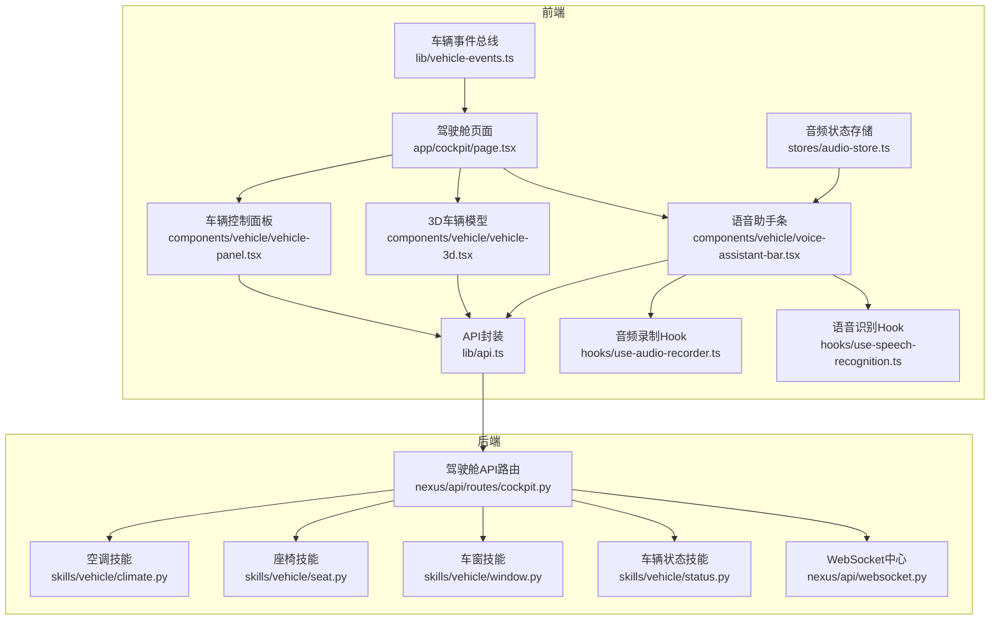
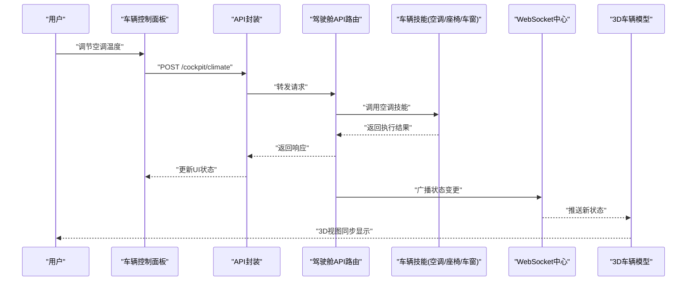
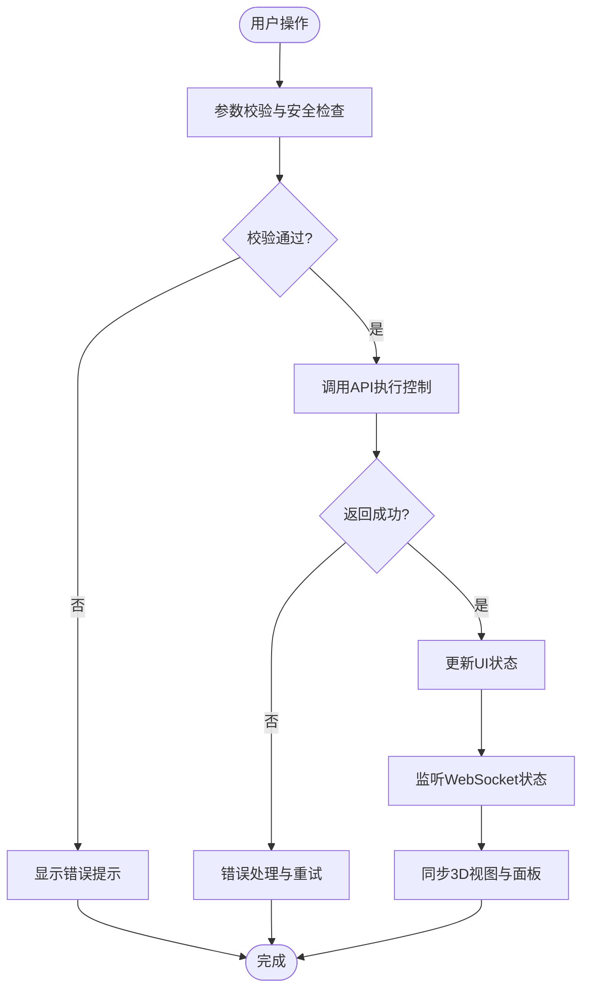
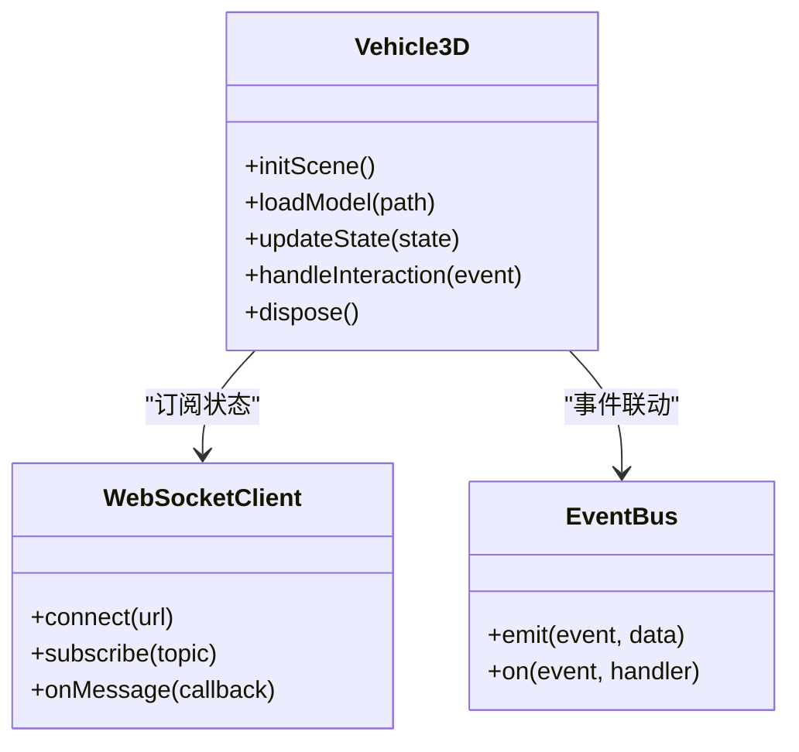
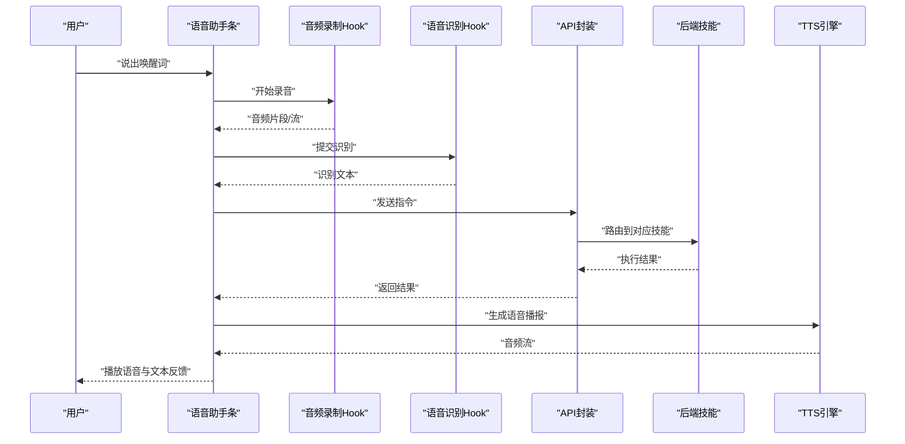
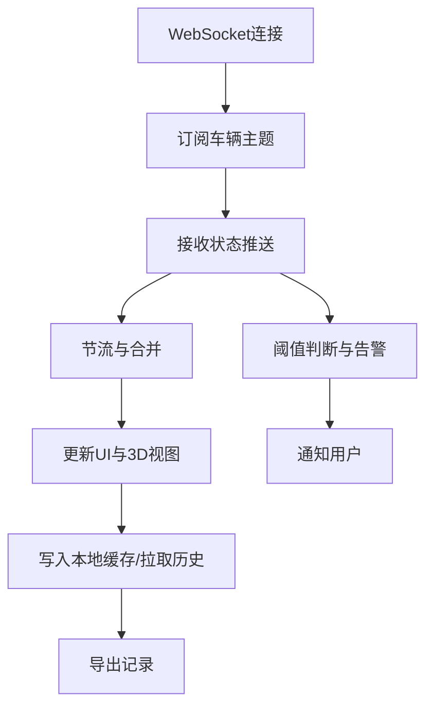
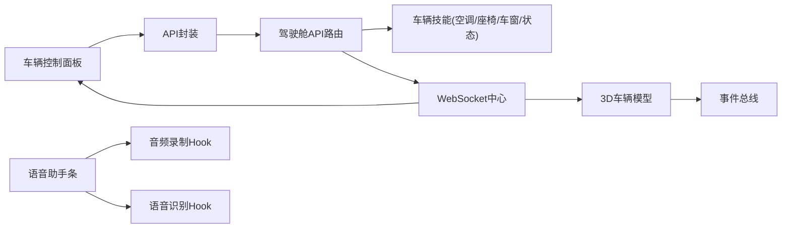

# 车辆交互界面

<cite>
**本文引用的文件**   
- [frontend_design/src/app/cockpit/page.tsx](file://frontend_design/src/app/cockpit/page.tsx)
- [frontend_design/src/components/vehicle/vehicle-panel.tsx](file://frontend_design/src/components/vehicle/vehicle-panel.tsx)
- [frontend_design/src/components/vehicle/vehicle-3d.tsx](file://frontend_design/src/components/vehicle/vehicle-3d.tsx)
- [frontend_design/src/components/vehicle/voice-assistant-bar.tsx](file://frontend_design/src/components/vehicle/voice-assistant-bar.tsx)
- [frontend_design/src/hooks/use-audio-recorder.ts](file://frontend_design/src/hooks/use-audio-recorder.ts)
- [frontend_design/src/hooks/use-speech-recognition.ts](file://frontend_design/src/hooks/use-speech-recognition.ts)
- [frontend_design/src/lib/api.ts](file://frontend_design/src/lib/api.ts)
- [frontend_design/src/lib/vehicle-events.ts](file://frontend_design/src/lib/vehicle-events.ts)
- [frontend_design/src/stores/audio-store.ts](file://frontend_design/src/stores/audio-store.ts)
- [backend_design/nexus/api/routes/cockpit.py](file://backend_design/nexus/api/routes/cockpit.py)
- [backend_design/nexus/api/websocket.py](file://backend_design/nexus/api/websocket.py)
- [backend_design/nexus/skills/vehicle/climate.py](file://backend_design/nexus/skills/vehicle/climate.py)
- [backend_design/nexus/skills/vehicle/seat.py](file://backend_design/nexus/skills/vehicle/seat.py)
- [backend_design/nexus/skills/vehicle/window.py](file://backend_design/nexus/skills/vehicle/window.py)
- [backend_design/nexus/skills/vehicle/status.py](file://backend_design/nexus/skills/vehicle/status.py)
</cite>

## 目录
1. [简介](#简介)
2. [项目结构](#项目结构)
3. [核心组件](#核心组件)
4. [架构总览](#架构总览)
5. [详细组件分析](#详细组件分析)
6. [依赖关系分析](#依赖关系分析)
7. [性能与体验优化](#性能与体验优化)
8. [故障排查指南](#故障排查指南)
9. [结论](#结论)
10. [附录：集成与使用示例](#附录集成与使用示例)

## 简介
本文件面向NexusCockpit前端应用，聚焦“车辆交互界面”的设计与实现。内容覆盖：
- 车辆控制面板（空调、座椅、车窗等）的UI组件设计与交互流程
- 3D车辆模型的展示与交互（渲染、状态可视化、用户操作反馈）
- 语音助手界面（唤醒词检测、语音输入、结果展示）
- 车辆状态实时监控（数据刷新、异常告警、历史记录）
- 用户体验优化建议与性能调优方案
- 组件使用示例与前后端集成指南

## 项目结构
前端采用Next.js组织页面与组件，关键目录与职责如下：
- app/cockpit：驾驶舱主页面入口，组合面板、3D模型与语音助手
- components/vehicle：车辆相关UI组件（面板、3D视图、语音条）
- hooks：音频录制与语音识别自定义Hook
- lib：API封装、车辆事件总线
- stores：全局状态（如音频状态）
- backend_design/nexus：后端API与WebSocket、技能模块（空调/座椅/车窗/状态）

图表来源
- [frontend_design/src/app/cockpit/page.tsx](file://frontend_design/src/app/cockpit/page.tsx)
- [frontend_design/src/components/vehicle/vehicle-panel.tsx](file://frontend_design/src/components/vehicle/vehicle-panel.tsx)
- [frontend_design/src/components/vehicle/vehicle-3d.tsx](file://frontend_design/src/components/vehicle/vehicle-3d.tsx)
- [frontend_design/src/components/vehicle/voice-assistant-bar.tsx](file://frontend_design/src/components/vehicle/voice-assistant-bar.tsx)
- [frontend_design/src/hooks/use-audio-recorder.ts](file://frontend_design/src/hooks/use-audio-recorder.ts)
- [frontend_design/src/hooks/use-speech-recognition.ts](file://frontend_design/src/hooks/use-speech-recognition.ts)
- [frontend_design/src/lib/api.ts](file://frontend_design/src/lib/api.ts)
- [frontend_design/src/lib/vehicle-events.ts](file://frontend_design/src/lib/vehicle-events.ts)
- [frontend_design/src/stores/audio-store.ts](file://frontend_design/src/stores/audio-store.ts)
- [backend_design/nexus/api/routes/cockpit.py](file://backend_design/nexus/api/routes/cockpit.py)
- [backend_design/nexus/api/websocket.py](file://backend_design/nexus/api/websocket.py)
- [backend_design/nexus/skills/vehicle/climate.py](file://backend_design/nexus/skills/vehicle/climate.py)
- [backend_design/nexus/skills/vehicle/seat.py](file://backend_design/nexus/skills/vehicle/seat.py)
- [backend_design/nexus/skills/vehicle/window.py](file://backend_design/nexus/skills/vehicle/window.py)
- [backend_design/nexus/skills/vehicle/status.py](file://backend_design/nexus/skills/vehicle/status.py)

章节来源
- [frontend_design/src/app/cockpit/page.tsx](file://frontend_design/src/app/cockpit/page.tsx)
- [frontend_design/src/components/vehicle/vehicle-panel.tsx](file://frontend_design/src/components/vehicle/vehicle-panel.tsx)
- [frontend_design/src/components/vehicle/vehicle-3d.tsx](file://frontend_design/src/components/vehicle/vehicle-3d.tsx)
- [frontend_design/src/components/vehicle/voice-assistant-bar.tsx](file://frontend_design/src/components/vehicle/voice-assistant-bar.tsx)
- [frontend_design/src/hooks/use-audio-recorder.ts](file://frontend_design/src/hooks/use-audio-recorder.ts)
- [frontend_design/src/hooks/use-speech-recognition.ts](file://frontend_design/src/hooks/use-speech-recognition.ts)
- [frontend_design/src/lib/api.ts](file://frontend_design/src/lib/api.ts)
- [frontend_design/src/lib/vehicle-events.ts](file://frontend_design/src/lib/vehicle-events.ts)
- [frontend_design/src/stores/audio-store.ts](file://frontend_design/src/stores/audio-store.ts)
- [backend_design/nexus/api/routes/cockpit.py](file://backend_design/nexus/api/routes/cockpit.py)
- [backend_design/nexus/api/websocket.py](file://backend_design/nexus/api/websocket.py)
- [backend_design/nexus/skills/vehicle/climate.py](file://backend_design/nexus/skills/vehicle/climate.py)
- [backend_design/nexus/skills/vehicle/seat.py](file://backend_design/nexus/skills/vehicle/seat.py)
- [backend_design/nexus/skills/vehicle/window.py](file://backend_design/nexus/skills/vehicle/window.py)
- [backend_design/nexus/skills/vehicle/status.py](file://backend_design/nexus/skills/vehicle/status.py)

## 核心组件
本节概述各核心组件的职责与交互要点。

- 车辆控制面板（vehicle-panel）
  - 提供空调、座椅、车窗等控制项的UI控件
  - 通过API调用触发后端技能执行，并订阅WebSocket更新以同步状态
  - 支持本地校验、加载态与错误提示

- 3D车辆模型（vehicle-3d）
  - 负责3D场景初始化、模型加载、材质与光照配置
  - 将车辆状态映射为可视化标记（如车门开闭、车窗升降、温度指示）
  - 响应点击/拖拽等交互，触发对应控制或详情弹窗

- 语音助手条（voice-assistant-bar）
  - 集成唤醒词检测、录音、语音转文本、结果展示
  - 与音频录制Hook和语音识别Hook协作，管理麦克风权限与流式处理
  - 通过API发送指令，接收TTS播放或文本回复

- 音频录制Hook（use-audio-recorder）
  - 封装浏览器媒体流获取、录音开始/停止、分段上传
  - 暴露状态（是否录音中、时长、错误信息）供上层组件消费

- 语音识别Hook（use-speech-recognition）
  - 封装ASR接口调用、流式识别、结果回调
  - 管理识别状态、重试与超时策略

- API封装（api.ts）
  - 统一HTTP请求封装、鉴权头注入、错误码处理
  - 提供车辆控制、状态查询、会话管理等方法

- 车辆事件总线（vehicle-events.ts）
  - 基于发布/订阅模式，在组件间传递车辆状态变更与用户操作事件
  - 用于3D视图与面板的状态联动

- 音频状态存储（audio-store.ts）
  - 全局维护音频播放/录制状态，避免多组件重复创建实例

章节来源
- [frontend_design/src/components/vehicle/vehicle-panel.tsx](file://frontend_design/src/components/vehicle/vehicle-panel.tsx)
- [frontend_design/src/components/vehicle/vehicle-3d.tsx](file://frontend_design/src/components/vehicle/vehicle-3d.tsx)
- [frontend_design/src/components/vehicle/voice-assistant-bar.tsx](file://frontend_design/src/components/vehicle/voice-assistant-bar.tsx)
- [frontend_design/src/hooks/use-audio-recorder.ts](file://frontend_design/src/hooks/use-audio-recorder.ts)
- [frontend_design/src/hooks/use-speech-recognition.ts](file://frontend_design/src/hooks/use-speech-recognition.ts)
- [frontend_design/src/lib/api.ts](file://frontend_design/src/lib/api.ts)
- [frontend_design/src/lib/vehicle-events.ts](file://frontend_design/src/lib/vehicle-events.ts)
- [frontend_design/src/stores/audio-store.ts](file://frontend_design/src/stores/audio-store.ts)

## 架构总览
前端通过页面组合多个组件，调用API与WebSocket与后端通信；后端根据意图路由到具体技能执行，并通过WebSocket推送实时状态。

图表来源
- [frontend_design/src/components/vehicle/vehicle-panel.tsx](file://frontend_design/src/components/vehicle/vehicle-panel.tsx)
- [frontend_design/src/lib/api.ts](file://frontend_design/src/lib/api.ts)
- [backend_design/nexus/api/routes/cockpit.py](file://backend_design/nexus/api/routes/cockpit.py)
- [backend_design/nexus/skills/vehicle/climate.py](file://backend_design/nexus/skills/vehicle/climate.py)
- [backend_design/nexus/api/websocket.py](file://backend_design/nexus/api/websocket.py)
- [frontend_design/src/components/vehicle/vehicle-3d.tsx](file://frontend_design/src/components/vehicle/vehicle-3d.tsx)

## 详细组件分析

### 车辆控制面板（vehicle-panel）
- 功能范围
  - 空调控制：温度设定、风量档位、出风模式、自动/手动切换
  - 座椅调节：前后移动、靠背角度、加热/通风开关
  - 车窗控制：单窗/全窗升降、防夹保护状态显示
- 交互流程
  - 用户操作触发本地校验（如温度区间、安全限制）
  - 调用API执行控制，成功后进入加载态并显示成功反馈
  - 订阅WebSocket状态推送，回写UI至真实设备状态
- 错误处理
  - 网络异常：重试与降级提示
  - 业务异常：根据错误码给出明确提示（如设备离线、权限不足）

图表来源
- [frontend_design/src/components/vehicle/vehicle-panel.tsx](file://frontend_design/src/components/vehicle/vehicle-panel.tsx)
- [frontend_design/src/lib/api.ts](file://frontend_design/src/lib/api.ts)
- [backend_design/nexus/api/routes/cockpit.py](file://backend_design/nexus/api/routes/cockpit.py)
- [backend_design/nexus/api/websocket.py](file://backend_design/nexus/api/websocket.py)

章节来源
- [frontend_design/src/components/vehicle/vehicle-panel.tsx](file://frontend_design/src/components/vehicle/vehicle-panel.tsx)
- [frontend_design/src/lib/api.ts](file://frontend_design/src/lib/api.ts)
- [backend_design/nexus/api/routes/cockpit.py](file://backend_design/nexus/api/routes/cockpit.py)
- [backend_design/nexus/api/websocket.py](file://backend_design/nexus/api/websocket.py)

### 3D车辆模型（vehicle-3d）
- 渲染与场景
  - 初始化场景、相机、灯光与控制器
  - 加载车辆模型资源，设置材质与贴图
- 状态可视化
  - 将车辆状态映射为视觉元素（高亮、动画、标签）
  - 实时更新：订阅WebSocket事件，驱动局部重绘而非整帧重建
- 用户交互
  - 点击部件触发详情或快捷控制
  - 拖拽旋转视角，滚轮缩放，双击复位

图表来源
- [frontend_design/src/components/vehicle/vehicle-3d.tsx](file://frontend_design/src/components/vehicle/vehicle-3d.tsx)
- [frontend_design/src/lib/vehicle-events.ts](file://frontend_design/src/lib/vehicle-events.ts)
- [backend_design/nexus/api/websocket.py](file://backend_design/nexus/api/websocket.py)

章节来源
- [frontend_design/src/components/vehicle/vehicle-3d.tsx](file://frontend_design/src/components/vehicle/vehicle-3d.tsx)
- [frontend_design/src/lib/vehicle-events.ts](file://frontend_design/src/lib/vehicle-events.ts)
- [backend_design/nexus/api/websocket.py](file://backend_design/nexus/api/websocket.py)

### 语音助手界面（voice-assistant-bar）
- 唤醒词检测
  - 本地关键词检测或云端唤醒，触发录音与识别流程
- 语音输入
  - 使用音频录制Hook采集音频流，分片上传或流式传输
  - 语音识别Hook对接ASR服务，返回文本与置信度
- 结果展示
  - 显示识别文本、执行状态、TTS播放进度
  - 失败时提供重试与人工确认入口

图表来源
- [frontend_design/src/components/vehicle/voice-assistant-bar.tsx](file://frontend_design/src/components/vehicle/voice-assistant-bar.tsx)
- [frontend_design/src/hooks/use-audio-recorder.ts](file://frontend_design/src/hooks/use-audio-recorder.ts)
- [frontend_design/src/hooks/use-speech-recognition.ts](file://frontend_design/src/hooks/use-speech-recognition.ts)
- [frontend_design/src/lib/api.ts](file://frontend_design/src/lib/api.ts)
- [backend_design/nexus/api/routes/cockpit.py](file://backend_design/nexus/api/routes/cockpit.py)

章节来源
- [frontend_design/src/components/vehicle/voice-assistant-bar.tsx](file://frontend_design/src/components/vehicle/voice-assistant-bar.tsx)
- [frontend_design/src/hooks/use-audio-recorder.ts](file://frontend_design/src/hooks/use-audio-recorder.ts)
- [frontend_design/src/hooks/use-speech-recognition.ts](file://frontend_design/src/hooks/use-speech-recognition.ts)
- [frontend_design/src/lib/api.ts](file://frontend_design/src/lib/api.ts)
- [backend_design/nexus/api/routes/cockpit.py](file://backend_design/nexus/api/routes/cockpit.py)

### 车辆状态实时监控
- 数据刷新
  - 通过WebSocket订阅车辆主题，增量更新面板与3D视图
  - 对高频指标进行节流与合并，降低渲染压力
- 异常告警
  - 阈值判断与规则引擎结合，触发告警卡片与声音提示
  - 支持一键跳转历史与诊断页
- 历史记录
  - 分页拉取历史状态与操作日志
  - 导出CSV/JSON，便于问题回溯

图表来源
- [frontend_design/src/lib/vehicle-events.ts](file://frontend_design/src/lib/vehicle-events.ts)
- [backend_design/nexus/api/websocket.py](file://backend_design/nexus/api/websocket.py)
- [frontend_design/src/components/vehicle/vehicle-panel.tsx](file://frontend_design/src/components/vehicle/vehicle-panel.tsx)
- [frontend_design/src/components/vehicle/vehicle-3d.tsx](file://frontend_design/src/components/vehicle/vehicle-3d.tsx)

章节来源
- [frontend_design/src/lib/vehicle-events.ts](file://frontend_design/src/lib/vehicle-events.ts)
- [backend_design/nexus/api/websocket.py](file://backend_design/nexus/api/websocket.py)
- [frontend_design/src/components/vehicle/vehicle-panel.tsx](file://frontend_design/src/components/vehicle/vehicle-panel.tsx)
- [frontend_design/src/components/vehicle/vehicle-3d.tsx](file://frontend_design/src/components/vehicle/vehicle-3d.tsx)

## 依赖关系分析
- 组件耦合
  - 面板与3D视图通过事件总线解耦，降低直接依赖
  - 语音助手条依赖音频与识别Hook，保持单一职责
- 外部依赖
  - API封装统一处理鉴权与错误
  - WebSocket中心负责长连接管理与消息分发
- 潜在循环依赖
  - 事件总线作为中介，避免组件间互相引用

图表来源
- [frontend_design/src/components/vehicle/vehicle-panel.tsx](file://frontend_design/src/components/vehicle/vehicle-panel.tsx)
- [frontend_design/src/components/vehicle/vehicle-3d.tsx](file://frontend_design/src/components/vehicle/vehicle-3d.tsx)
- [frontend_design/src/components/vehicle/voice-assistant-bar.tsx](file://frontend_design/src/components/vehicle/voice-assistant-bar.tsx)
- [frontend_design/src/hooks/use-audio-recorder.ts](file://frontend_design/src/hooks/use-audio-recorder.ts)
- [frontend_design/src/hooks/use-speech-recognition.ts](file://frontend_design/src/hooks/use-speech-recognition.ts)
- [frontend_design/src/lib/api.ts](file://frontend_design/src/lib/api.ts)
- [frontend_design/src/lib/vehicle-events.ts](file://frontend_design/src/lib/vehicle-events.ts)
- [backend_design/nexus/api/routes/cockpit.py](file://backend_design/nexus/api/routes/cockpit.py)
- [backend_design/nexus/api/websocket.py](file://backend_design/nexus/api/websocket.py)

章节来源
- [frontend_design/src/components/vehicle/vehicle-panel.tsx](file://frontend_design/src/components/vehicle/vehicle-panel.tsx)
- [frontend_design/src/components/vehicle/vehicle-3d.tsx](file://frontend_design/src/components/vehicle/vehicle-3d.tsx)
- [frontend_design/src/components/vehicle/voice-assistant-bar.tsx](file://frontend_design/src/components/vehicle/voice-assistant-bar.tsx)
- [frontend_design/src/hooks/use-audio-recorder.ts](file://frontend_design/src/hooks/use-audio-recorder.ts)
- [frontend_design/src/hooks/use-speech-recognition.ts](file://frontend_design/src/hooks/use-speech-recognition.ts)
- [frontend_design/src/lib/api.ts](file://frontend_design/src/lib/api.ts)
- [frontend_design/src/lib/vehicle-events.ts](file://frontend_design/src/lib/vehicle-events.ts)
- [backend_design/nexus/api/routes/cockpit.py](file://backend_design/nexus/api/routes/cockpit.py)
- [backend_design/nexus/api/websocket.py](file://backend_design/nexus/api/websocket.py)

## 性能与体验优化
- 渲染优化
  - 3D视图按需更新：仅重绘变化区域，减少整体重建
  - 纹理与模型压缩，懒加载非首屏资源
- 网络优化
  - WebSocket批量推送与去抖，避免频繁更新
  - HTTP请求缓存与幂等设计，减少重复调用
- 交互优化
  - 操作即时反馈（乐观更新），失败再回滚
  - 语音识别流式输出，提升感知速度
- 可访问性
  - 键盘导航、屏幕阅读器兼容
  - 对比度与字体大小可调

[本节为通用指导，不直接分析具体文件]

## 故障排查指南
- 常见问题
  - 3D模型加载失败：检查资源路径与跨域策略
  - WebSocket断连：查看心跳与重连逻辑，确认网关健康
  - 语音识别失败：确认麦克风权限、网络连通性与ASR服务状态
- 定位手段
  - 打开控制台日志，关注错误堆栈与时间戳
  - 使用事件总线追踪状态变更链路
  - 回放WebSocket消息，核对前后端协议一致性

章节来源
- [frontend_design/src/lib/vehicle-events.ts](file://frontend_design/src/lib/vehicle-events.ts)
- [backend_design/nexus/api/websocket.py](file://backend_design/nexus/api/websocket.py)
- [frontend_design/src/hooks/use-audio-recorder.ts](file://frontend_design/src/hooks/use-audio-recorder.ts)
- [frontend_design/src/hooks/use-speech-recognition.ts](file://frontend_design/src/hooks/use-speech-recognition.ts)

## 结论
本文件系统梳理了NexusCockpit前端“车辆交互界面”的核心组件与架构，涵盖控制面板、3D模型、语音助手与实时监控的实现要点，并提供性能优化与故障排查建议。通过事件总线与WebSocket的解耦设计，系统在可扩展性与实时性方面具备良好基础。

[本节为总结，不直接分析具体文件]

## 附录：集成与使用示例
- 在驾驶舱页面引入组件
  - 导入车辆控制面板、3D模型与语音助手条
  - 在布局中合理排布，确保移动端适配
- 接入API
  - 使用API封装调用车辆控制与状态查询接口
  - 统一处理鉴权、错误码与重试策略
- 订阅WebSocket
  - 连接WebSocket中心，订阅车辆主题
  - 在组件内监听事件并更新UI
- 语音助手集成
  - 初始化音频录制与语音识别Hook
  - 绑定唤醒词与按钮事件，展示识别结果与TTS播放

章节来源
- [frontend_design/src/app/cockpit/page.tsx](file://frontend_design/src/app/cockpit/page.tsx)
- [frontend_design/src/lib/api.ts](file://frontend_design/src/lib/api.ts)
- [frontend_design/src/hooks/use-audio-recorder.ts](file://frontend_design/src/hooks/use-audio-recorder.ts)
- [frontend_design/src/hooks/use-speech-recognition.ts](file://frontend_design/src/hooks/use-speech-recognition.ts)
- [backend_design/nexus/api/routes/cockpit.py](file://backend_design/nexus/api/routes/cockpit.py)
- [backend_design/nexus/api/websocket.py](file://backend_design/nexus/api/websocket.py)