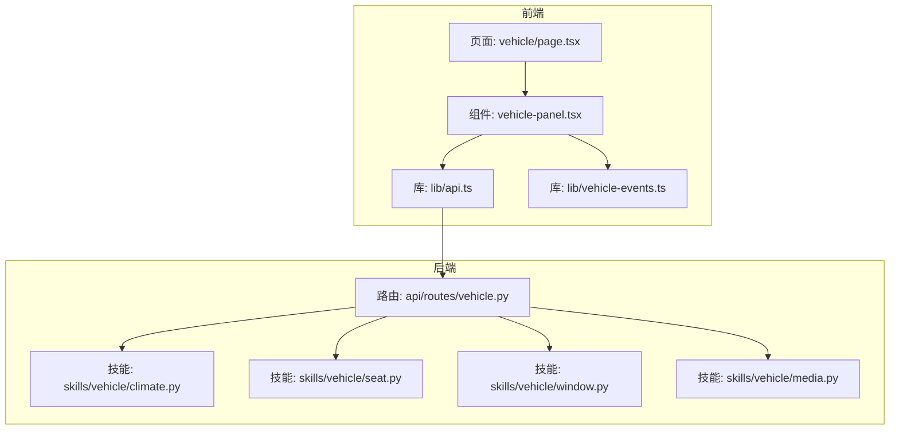
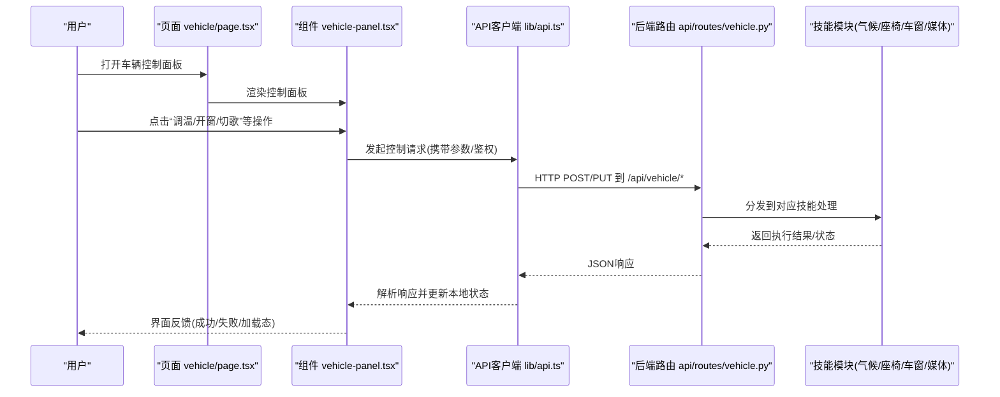
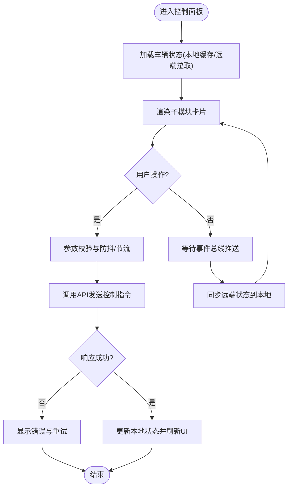
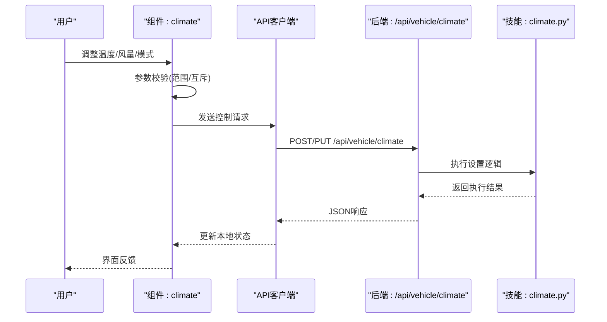
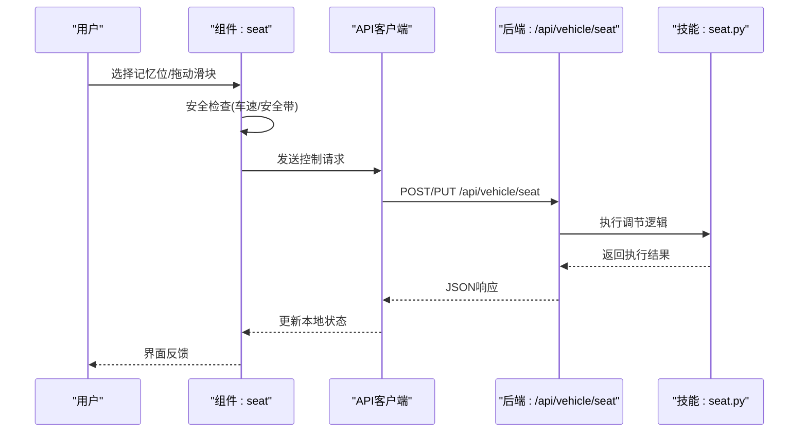
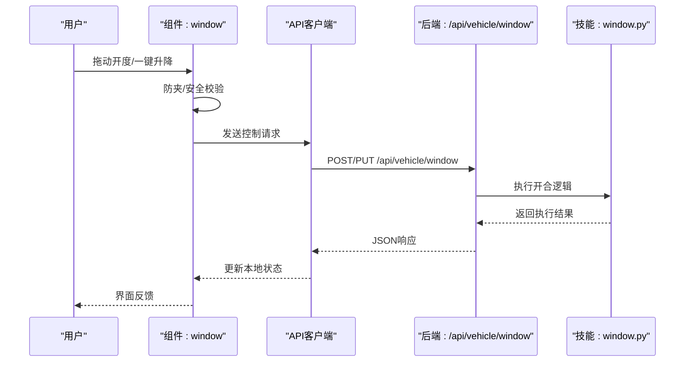
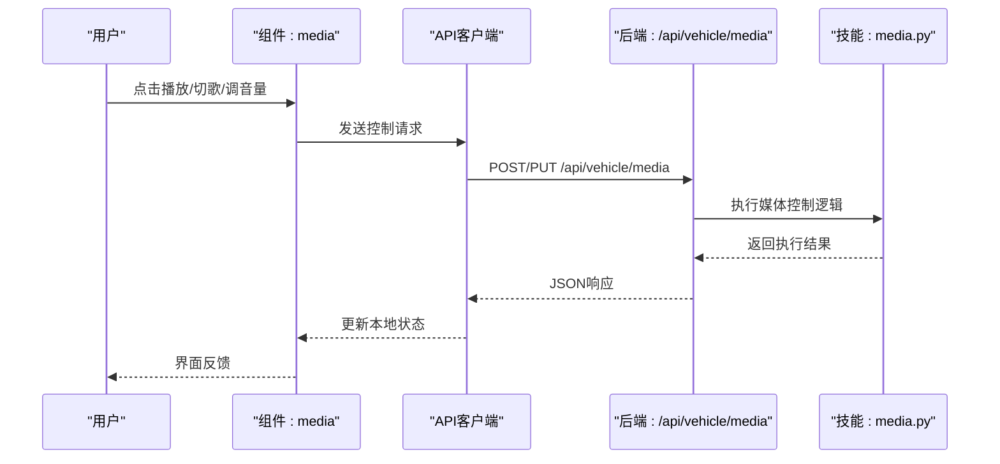
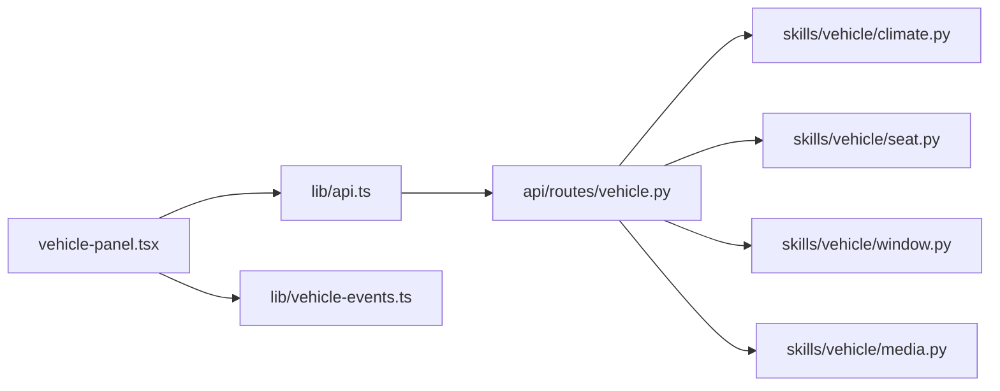

# 车辆控制面板

<cite>
**本文引用的文件**   
- [frontend_design/src/app/vehicle/page.tsx](file://frontend_design/src/app/vehicle/page.tsx)
- [frontend_design/src/components/vehicle/vehicle-panel.tsx](file://frontend_design/src/components/vehicle/vehicle-panel.tsx)
- [frontend_design/src/lib/api.ts](file://frontend_design/src/lib/api.ts)
- [frontend_design/src/lib/vehicle-events.ts](file://frontend_design/src/lib/vehicle-events.ts)
- [backend_design/nexus/api/routes/vehicle.py](file://backend_design/nexus/api/routes/vehicle.py)
- [backend_design/nexus/skills/vehicle/climate.py](file://backend_design/nexus/skills/vehicle/climate.py)
- [backend_design/nexus/skills/vehicle/seat.py](file://backend_design/nexus/skills/vehicle/seat.py)
- [backend_design/nexus/skills/vehicle/window.py](file://backend_design/nexus/skills/vehicle/window.py)
- [backend_design/nexus/skills/vehicle/media.py](file://backend_design/nexus/skills/vehicle/media.py)
</cite>

## 目录
1. [简介](#简介)
2. [项目结构](#项目结构)
3. [核心组件](#核心组件)
4. [架构总览](#架构总览)
5. [详细组件分析](#详细组件分析)
6. [依赖分析](#依赖分析)
7. [性能考虑](#性能考虑)
8. [故障排查指南](#故障排查指南)
9. [结论](#结论)
10. [附录](#附录)

## 简介
本文件面向NexusCockpit前端应用，聚焦“车辆控制面板”的组件设计与实现。内容覆盖空调控制、座椅调节、车窗控制、媒体播放等功能的UI组件设计、状态管理、用户交互逻辑与API调用方式；同时给出响应式与移动端适配方案、组件使用示例（属性配置、事件处理、状态同步）、与后端车辆控制服务的通信机制和数据格式说明，以及性能优化与用户体验改进建议。

## 项目结构
车辆控制面板位于前端应用的页面与组件层，通过API模块与后端服务交互，并通过事件总线进行跨组件状态同步。

图表来源
- [frontend_design/src/app/vehicle/page.tsx](file://frontend_design/src/app/vehicle/page.tsx)
- [frontend_design/src/components/vehicle/vehicle-panel.tsx](file://frontend_design/src/components/vehicle/vehicle-panel.tsx)
- [frontend_design/src/lib/api.ts](file://frontend_design/src/lib/api.ts)
- [frontend_design/src/lib/vehicle-events.ts](file://frontend_design/src/lib/vehicle-events.ts)
- [backend_design/nexus/api/routes/vehicle.py](file://backend_design/nexus/api/routes/vehicle.py)
- [backend_design/nexus/skills/vehicle/climate.py](file://backend_design/nexus/skills/vehicle/climate.py)
- [backend_design/nexus/skills/vehicle/seat.py](file://backend_design/nexus/skills/vehicle/seat.py)
- [backend_design/nexus/skills/vehicle/window.py](file://backend_design/nexus/skills/vehicle/window.py)
- [backend_design/nexus/skills/vehicle/media.py](file://backend_design/nexus/skills/vehicle/media.py)

章节来源
- [frontend_design/src/app/vehicle/page.tsx](file://frontend_design/src/app/vehicle/page.tsx)
- [frontend_design/src/components/vehicle/vehicle-panel.tsx](file://frontend_design/src/components/vehicle/vehicle-panel.tsx)
- [frontend_design/src/lib/api.ts](file://frontend_design/src/lib/api.ts)
- [frontend_design/src/lib/vehicle-events.ts](file://frontend_design/src/lib/vehicle-events.ts)
- [backend_design/nexus/api/routes/vehicle.py](file://backend_design/nexus/api/routes/vehicle.py)
- [backend_design/nexus/skills/vehicle/climate.py](file://backend_design/nexus/skills/vehicle/climate.py)
- [backend_design/nexus/skills/vehicle/seat.py](file://backend_design/nexus/skills/vehicle/seat.py)
- [backend_design/nexus/skills/vehicle/window.py](file://backend_design/nexus/skills/vehicle/window.py)
- [backend_design/nexus/skills/vehicle/media.py](file://backend_design/nexus/skills/vehicle/media.py)

## 核心组件
- 页面容器：负责挂载控制面板、提供布局与全局上下文（如主题、语言、设备类型）。
- 控制面板面板：聚合各子模块（空调、座椅、车窗、媒体），统一展示当前状态并接收用户操作。
- API客户端：封装HTTP请求、错误重试、超时与鉴权头注入。
- 事件总线：用于跨组件的状态同步与实时通知（例如车辆状态变更推送）。

章节来源
- [frontend_design/src/app/vehicle/page.tsx](file://frontend_design/src/app/vehicle/page.tsx)
- [frontend_design/src/components/vehicle/vehicle-panel.tsx](file://frontend_design/src/components/vehicle/vehicle-panel.tsx)
- [frontend_design/src/lib/api.ts](file://frontend_design/src/lib/api.ts)
- [frontend_design/src/lib/vehicle-events.ts](file://frontend_design/src/lib/vehicle-events.ts)

## 架构总览
前端以“页面-组件-库”分层组织，页面承载布局与初始化，组件负责具体控制逻辑与渲染，库层提供网络与事件能力。后端以REST路由为入口，按功能域拆分到不同技能模块，形成清晰的职责边界。

图表来源
- [frontend_design/src/app/vehicle/page.tsx](file://frontend_design/src/app/vehicle/page.tsx)
- [frontend_design/src/components/vehicle/vehicle-panel.tsx](file://frontend_design/src/components/vehicle/vehicle-panel.tsx)
- [frontend_design/src/lib/api.ts](file://frontend_design/src/lib/api.ts)
- [backend_design/nexus/api/routes/vehicle.py](file://backend_design/nexus/api/routes/vehicle.py)
- [backend_design/nexus/skills/vehicle/climate.py](file://backend_design/nexus/skills/vehicle/climate.py)
- [backend_design/nexus/skills/vehicle/seat.py](file://backend_design/nexus/skills/vehicle/seat.py)
- [backend_design/nexus/skills/vehicle/window.py](file://backend_design/nexus/skills/vehicle/window.py)
- [backend_design/nexus/skills/vehicle/media.py](file://backend_design/nexus/skills/vehicle/media.py)

## 详细组件分析

### 控制面板主组件（vehicle-panel）
- 职责
  - 聚合空调、座椅、车窗、媒体四个子模块。
  - 维护统一的车辆状态视图，并在用户操作后触发API调用。
  - 监听事件总线，将后端推送的状态变更反映到UI。
- 状态管理
  - 本地状态：缓存当前显示值（温度、风量、座椅位置、车窗开度、媒体信息）。
  - 远端状态：通过API或事件总线同步最新数据。
  - 冲突处理：当本地与远端不一致时，优先采用远端状态，并提供“撤销/恢复”提示。
- 用户交互
  - 滑块/步进器：用于温度、风量、座椅位置、车窗开度等连续值控制。
  - 开关/按钮：用于媒体播放控制、车窗一键升降等离散操作。
  - 长按/双击：用于快捷模式（如快速降温、记忆位切换）。
- 错误与边界
  - 网络异常：显示重试按钮与降级提示。
  - 参数越界：在提交前做范围校验，避免无效请求。
  - 并发操作：对同一设备的多次操作进行节流与去抖。

图表来源
- [frontend_design/src/components/vehicle/vehicle-panel.tsx](file://frontend_design/src/components/vehicle/vehicle-panel.tsx)
- [frontend_design/src/lib/api.ts](file://frontend_design/src/lib/api.ts)
- [frontend_design/src/lib/vehicle-events.ts](file://frontend_design/src/lib/vehicle-events.ts)

章节来源
- [frontend_design/src/components/vehicle/vehicle-panel.tsx](file://frontend_design/src/components/vehicle/vehicle-panel.tsx)
- [frontend_design/src/lib/api.ts](file://frontend_design/src/lib/api.ts)
- [frontend_design/src/lib/vehicle-events.ts](file://frontend_design/src/lib/vehicle-events.ts)

### 空调控制模块（Climate）
- 功能点
  - 温度设定、风量档位、出风模式、自动/手动切换、分区控制（前排/后排）。
- 状态字段
  - 目标温度、当前温度、风量等级、模式枚举、分区开关。
- 交互流程
  - 拖动温度条/点击步进器 → 校验范围 → 调用设置接口 → 成功后更新UI。
- 典型API路径
  - 设置温度/风量/模式：POST/PUT /api/vehicle/climate
  - 查询状态：GET /api/vehicle/climate/status
- 错误处理
  - 超出允许范围：前端拦截并提示。
  - 设备离线：提示稍后再试，支持队列化重试。

图表来源
- [frontend_design/src/components/vehicle/vehicle-panel.tsx](file://frontend_design/src/components/vehicle/vehicle-panel.tsx)
- [frontend_design/src/lib/api.ts](file://frontend_design/src/lib/api.ts)
- [backend_design/nexus/api/routes/vehicle.py](file://backend_design/nexus/api/routes/vehicle.py)
- [backend_design/nexus/skills/vehicle/climate.py](file://backend_design/nexus/skills/vehicle/climate.py)

章节来源
- [frontend_design/src/components/vehicle/vehicle-panel.tsx](file://frontend_design/src/components/vehicle/vehicle-panel.tsx)
- [frontend_design/src/lib/api.ts](file://frontend_design/src/lib/api.ts)
- [backend_design/nexus/api/routes/vehicle.py](file://backend_design/nexus/api/routes/vehicle.py)
- [backend_design/nexus/skills/vehicle/climate.py](file://backend_design/nexus/skills/vehicle/climate.py)

### 座椅调节模块（Seat）
- 功能点
  - 前后移动、靠背角度、腰部支撑、加热/通风、记忆位。
- 状态字段
  - 位置坐标、角度、加热/通风档位、记忆位列表。
- 交互流程
  - 拖拽滑块/点击预设位 → 校验安全限制（行驶中限制）→ 调用设置接口 → 同步状态。
- 典型API路径
  - 设置位置/角度/档位：POST/PUT /api/vehicle/seat
  - 查询状态：GET /api/vehicle/seat/status
  - 记忆位：POST /api/vehicle/seat/memory

图表来源
- [frontend_design/src/components/vehicle/vehicle-panel.tsx](file://frontend_design/src/components/vehicle/vehicle-panel.tsx)
- [frontend_design/src/lib/api.ts](file://frontend_design/src/lib/api.ts)
- [backend_design/nexus/api/routes/vehicle.py](file://backend_design/nexus/api/routes/vehicle.py)
- [backend_design/nexus/skills/vehicle/seat.py](file://backend_design/nexus/skills/vehicle/seat.py)

章节来源
- [frontend_design/src/components/vehicle/vehicle-panel.tsx](file://frontend_design/src/components/vehicle/vehicle-panel.tsx)
- [frontend_design/src/lib/api.ts](file://frontend_design/src/lib/api.ts)
- [backend_design/nexus/api/routes/vehicle.py](file://backend_design/nexus/api/routes/vehicle.py)
- [backend_design/nexus/skills/vehicle/seat.py](file://backend_design/nexus/skills/vehicle/seat.py)

### 车窗控制模块（Window）
- 功能点
  - 单窗/全窗开合、一键升降、防夹保护、半开比例控制。
- 状态字段
  - 开度百分比、运行状态、防夹标志。
- 交互流程
  - 滑动条/一键按钮 → 校验防夹与安全条件 → 调用设置接口 → 轮询/事件回写状态。
- 典型API路径
  - 设置开度/一键升降：POST/PUT /api/vehicle/window
  - 查询状态：GET /api/vehicle/window/status

图表来源
- [frontend_design/src/components/vehicle/vehicle-panel.tsx](file://frontend_design/src/components/vehicle/vehicle-panel.tsx)
- [frontend_design/src/lib/api.ts](file://frontend_design/src/lib/api.ts)
- [backend_design/nexus/api/routes/vehicle.py](file://backend_design/nexus/api/routes/vehicle.py)
- [backend_design/nexus/skills/vehicle/window.py](file://backend_design/nexus/skills/vehicle/window.py)

章节来源
- [frontend_design/src/components/vehicle/vehicle-panel.tsx](file://frontend_design/src/components/vehicle/vehicle-panel.tsx)
- [frontend_design/src/lib/api.ts](file://frontend_design/src/lib/api.ts)
- [backend_design/nexus/api/routes/vehicle.py](file://backend_design/nexus/api/routes/vehicle.py)
- [backend_design/nexus/skills/vehicle/window.py](file://backend_design/nexus/skills/vehicle/window.py)

### 媒体播放模块（Media）
- 功能点
  - 播放/暂停、上一首/下一首、音量调节、源切换（蓝牙/USB/在线）。
- 状态字段
  - 播放状态、当前曲目、音量、音源、播放列表索引。
- 交互流程
  - 点击控制按钮/拖动音量条 → 调用媒体接口 → 同步播放状态。
- 典型API路径
  - 播放控制/音量/源切换：POST/PUT /api/vehicle/media
  - 查询状态：GET /api/vehicle/media/status

图表来源
- [frontend_design/src/components/vehicle/vehicle-panel.tsx](file://frontend_design/src/components/vehicle/vehicle-panel.tsx)
- [frontend_design/src/lib/api.ts](file://frontend_design/src/lib/api.ts)
- [backend_design/nexus/api/routes/vehicle.py](file://backend_design/nexus/api/routes/vehicle.py)
- [backend_design/nexus/skills/vehicle/media.py](file://backend_design/nexus/skills/vehicle/media.py)

章节来源
- [frontend_design/src/components/vehicle/vehicle-panel.tsx](file://frontend_design/src/components/vehicle/vehicle-panel.tsx)
- [frontend_design/src/lib/api.ts](file://frontend_design/src/lib/api.ts)
- [backend_design/nexus/api/routes/vehicle.py](file://backend_design/nexus/api/routes/vehicle.py)
- [backend_design/nexus/skills/vehicle/media.py](file://backend_design/nexus/skills/vehicle/media.py)

### 响应式与移动端适配
- 布局策略
  - 网格/栅格系统：大屏多列，小屏单列堆叠。
  - 卡片尺寸自适应：根据屏幕宽度动态调整卡片宽高与内边距。
- 交互适配
  - 触摸友好：增大点击区域、增加滑动手势（左右滑动切歌、上下滑动调温）。
  - 键盘无障碍：Tab导航、焦点可见、ARIA标签完善。
- 字体与图标
  - 相对单位（rem/vw）保证缩放一致性。
  - 矢量图标确保清晰度。
- 性能与体验
  - 懒加载非关键资源（图片、音频元数据）。
  - 骨架屏占位提升感知速度。

[本节为通用设计建议，不直接分析具体文件]

## 依赖分析
- 组件耦合
  - 控制面板与子模块松耦合：通过props与事件回调通信。
  - API客户端集中管理：所有HTTP请求统一封装，便于鉴权、重试与监控。
  - 事件总线解耦：状态变更通过事件发布订阅，降低组件间直接依赖。
- 外部依赖
  - 后端REST API：按功能域划分路由，清晰可维护。
  - 可选WebSocket：用于实时状态推送（若启用）。

图表来源
- [frontend_design/src/components/vehicle/vehicle-panel.tsx](file://frontend_design/src/components/vehicle/vehicle-panel.tsx)
- [frontend_design/src/lib/api.ts](file://frontend_design/src/lib/api.ts)
- [frontend_design/src/lib/vehicle-events.ts](file://frontend_design/src/lib/vehicle-events.ts)
- [backend_design/nexus/api/routes/vehicle.py](file://backend_design/nexus/api/routes/vehicle.py)
- [backend_design/nexus/skills/vehicle/climate.py](file://backend_design/nexus/skills/vehicle/climate.py)
- [backend_design/nexus/skills/vehicle/seat.py](file://backend_design/nexus/skills/vehicle/seat.py)
- [backend_design/nexus/skills/vehicle/window.py](file://backend_design/nexus/skills/vehicle/window.py)
- [backend_design/nexus/skills/vehicle/media.py](file://backend_design/nexus/skills/vehicle/media.py)

章节来源
- [frontend_design/src/components/vehicle/vehicle-panel.tsx](file://frontend_design/src/components/vehicle/vehicle-panel.tsx)
- [frontend_design/src/lib/api.ts](file://frontend_design/src/lib/api.ts)
- [frontend_design/src/lib/vehicle-events.ts](file://frontend_design/src/lib/vehicle-events.ts)
- [backend_design/nexus/api/routes/vehicle.py](file://backend_design/nexus/api/routes/vehicle.py)
- [backend_design/nexus/skills/vehicle/climate.py](file://backend_design/nexus/skills/vehicle/climate.py)
- [backend_design/nexus/skills/vehicle/seat.py](file://backend_design/nexus/skills/vehicle/seat.py)
- [backend_design/nexus/skills/vehicle/window.py](file://backend_design/nexus/skills/vehicle/window.py)
- [backend_design/nexus/skills/vehicle/media.py](file://backend_design/nexus/skills/vehicle/media.py)

## 性能考虑
- 前端
  - 请求合并与去抖：对频繁操作（如音量、温度微调）进行节流。
  - 状态缓存：本地缓存最近一次状态，减少重复拉取。
  - 虚拟滚动：长列表（如媒体播放列表）按需渲染。
  - 资源压缩：图片与音频元数据懒加载，按需预取。
- 后端
  - 幂等性：控制接口支持幂等，避免重复执行导致副作用。
  - 限流与熔断：防止恶意或异常流量影响稳定性。
  - 异步任务：耗时操作（如复杂计算）放入队列，立即返回ACK。

[本节为通用性能建议，不直接分析具体文件]

## 故障排查指南
- 常见问题
  - 无响应：检查网络连接、鉴权令牌是否过期、后端服务健康状态。
  - 状态不同步：确认事件总线是否正常订阅，必要时主动拉取状态。
  - 参数错误：核对输入范围与必填项，查看后端返回的错误码与消息。
- 调试建议
  - 前端：开启控制台日志与网络抓包，记录请求/响应体。
  - 后端：查看路由日志与技能模块日志，定位异常堆栈。
  - 端到端：构造最小复现用例，逐步隔离问题域。

章节来源
- [frontend_design/src/lib/api.ts](file://frontend_design/src/lib/api.ts)
- [frontend_design/src/lib/vehicle-events.ts](file://frontend_design/src/lib/vehicle-events.ts)
- [backend_design/nexus/api/routes/vehicle.py](file://backend_design/nexus/api/routes/vehicle.py)

## 结论
车辆控制面板通过清晰的组件分层与API封装，实现了空调、座椅、车窗、媒体等核心功能的稳定交互。借助事件总线与状态缓存，提升了用户体验与系统性能。后续可在实时推送、个性化推荐与无障碍方面持续优化。

[本节为总结性内容，不直接分析具体文件]

## 附录
- 组件使用示例（概念性）
  - 属性配置：传入初始状态、回调函数、样式主题等。
  - 事件处理：绑定点击、滑动、长按等事件，统一转发至API客户端。
  - 状态同步：监听事件总线，自动刷新UI；必要时主动拉取远端状态。
- 数据格式约定（概念性）
  - 请求体：包含设备标识、控制参数、时间戳、签名等。
  - 响应体：包含执行结果、新状态、错误码与消息。
  - 事件体：包含事件类型、目标设备、变更字段与版本。

[本节为通用约定说明，不直接分析具体文件]