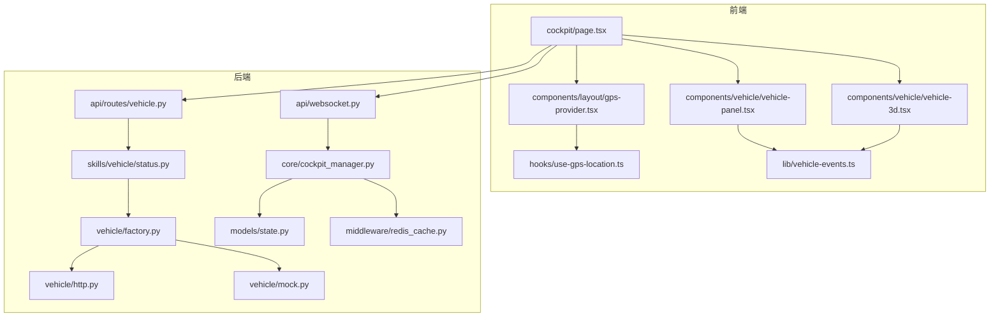
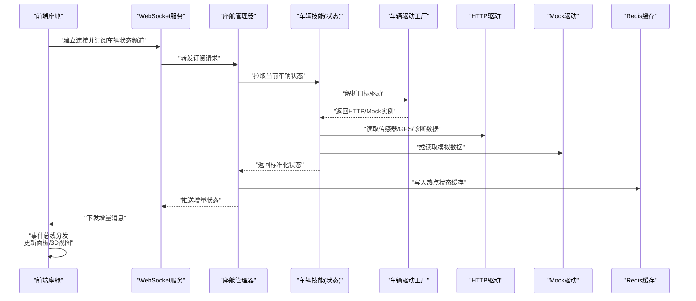
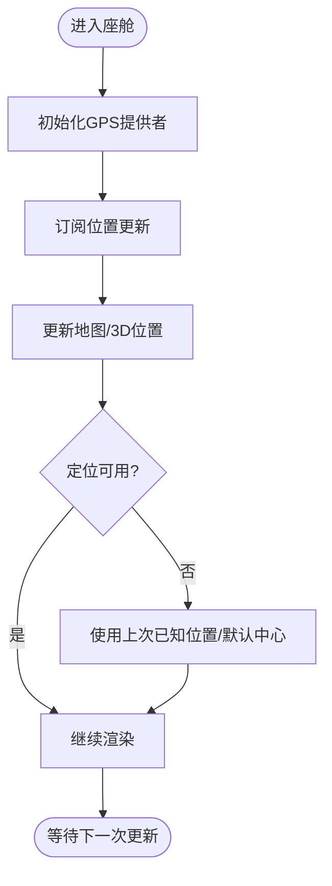
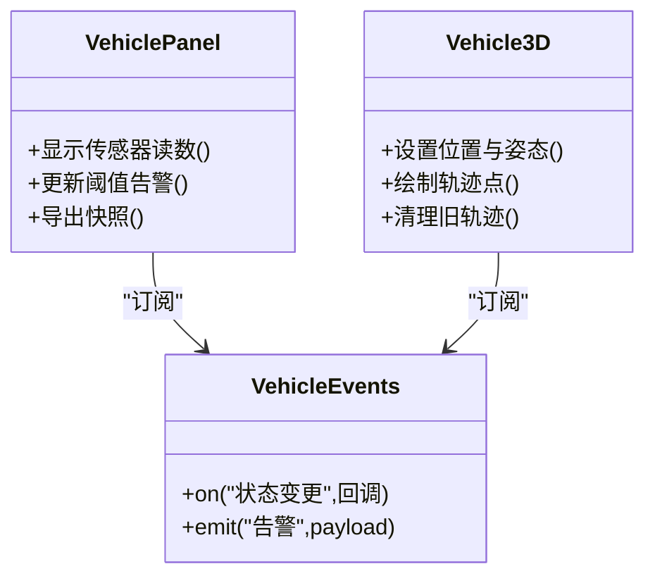
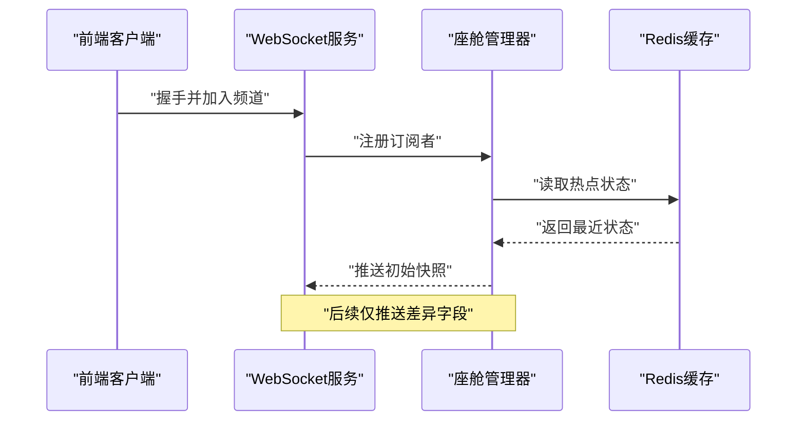
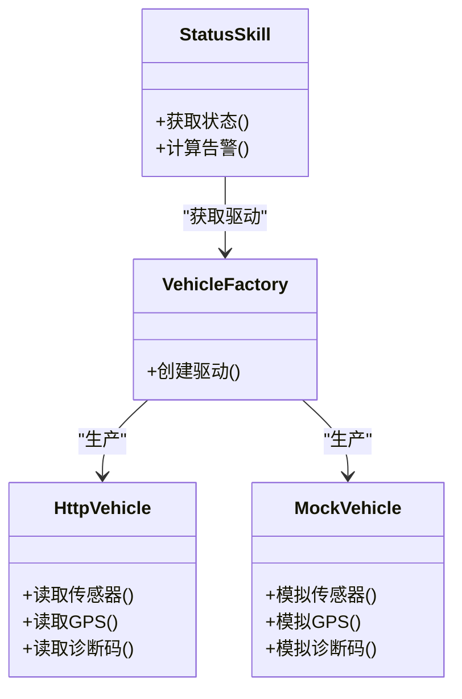
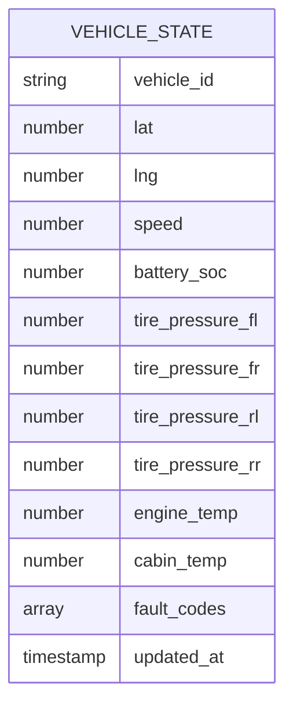
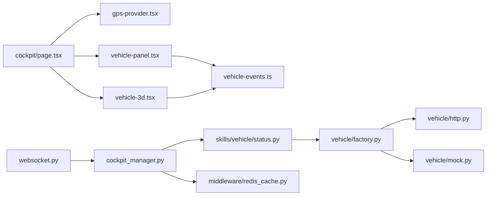

# 车辆状态监控

<cite>
**本文引用的文件**   
- [frontend_design/src/app/cockpit/page.tsx](file://frontend_design/src/app/cockpit/page.tsx)
- [frontend_design/src/components/layout/gps-provider.tsx](file://frontend_design/src/components/layout/gps-provider.tsx)
- [frontend_design/src/hooks/use-gps-location.ts](file://frontend_design/src/hooks/use-gps-location.ts)
- [frontend_design/src/lib/vehicle-events.ts](file://frontend_design/src/lib/vehicle-events.ts)
- [frontend_design/src/components/vehicle/vehicle-panel.tsx](file://frontend_design/src/components/vehicle/vehicle-panel.tsx)
- [frontend_design/src/components/vehicle/vehicle-3d.tsx](file://frontend_design/src/components/vehicle/vehicle-3d.tsx)
- [backend_design/nexus/api/websocket.py](file://backend_design/nexus/api/websocket.py)
- [backend_design/nexus/api/routes/vehicle.py](file://backend_design/nexus/api/routes/vehicle.py)
- [backend_design/nexus/skills/vehicle/status.py](file://backend_design/nexus/skills/vehicle/status.py)
- [backend_design/nexus/vehicle/factory.py](file://backend_design/nexus/vehicle/factory.py)
- [backend_design/nexus/vehicle/http.py](file://backend_design/nexus/vehicle/http.py)
- [backend_design/nexus/vehicle/mock.py](file://backend_design/nexus/vehicle/mock.py)
- [backend_design/nexus/core/cockpit_manager.py](file://backend_design/nexus/core/cockpit_manager.py)
- [backend_design/nexus/models/state.py](file://backend_design/nexus/models/state.py)
- [backend_design/nexus/middleware/redis_cache.py](file://backend_design/nexus/middleware/redis_cache.py)
</cite>

## 目录
1. [简介](#简介)
2. [项目结构](#项目结构)
3. [核心组件](#核心组件)
4. [架构总览](#架构总览)
5. [详细组件分析](#详细组件分析)
6. [依赖关系分析](#依赖关系分析)
7. [性能考虑](#性能考虑)
8. [故障排查指南](#故障排查指南)
9. [结论](#结论)
10. [附录](#附录)

## 简介
本文件面向NexusCockpit前端应用，系统化阐述“车辆状态监控”的实时实现与最佳实践。内容覆盖：
- 实时监控数据：GPS位置跟踪、车辆传感器数据、故障诊断信息
- 实时更新机制：WebSocket连接管理、增量更新、数据缓存策略
- 异常告警系统：视觉提示、声音提醒、推送通知等多渠道告警
- 历史数据存储与查询：本地缓存、云端同步、数据导出
- 性能优化：大数据量处理、内存管理、网络请求优化
- 实现示例与最佳实践：结合仓库现有代码路径进行说明

## 项目结构
与车辆状态监控相关的前端与后端关键位置如下：
- 前端页面与组件
  - 座舱主入口：cockpit页面
  - GPS能力提供：gps-provider与use-gps-location钩子
  - 车辆面板与3D展示：vehicle-panel、vehicle-3d
  - 事件总线：vehicle-events
- 后端服务
  - WebSocket网关：websocket路由
  - 车辆API：vehicle路由
  - 车辆技能（状态）：skills/vehicle/status
  - 车辆驱动抽象与工厂：vehicle/factory、http、mock
  - 座舱管理器：core/cockpit_manager
  - 状态模型：models/state
  - 缓存中间件：middleware/redis_cache

图表来源
- [frontend_design/src/app/cockpit/page.tsx](file://frontend_design/src/app/cockpit/page.tsx)
- [frontend_design/src/components/layout/gps-provider.tsx](file://frontend_design/src/components/layout/gps-provider.tsx)
- [frontend_design/src/hooks/use-gps-location.ts](file://frontend_design/src/hooks/use-gps-location.ts)
- [frontend_design/src/components/vehicle/vehicle-panel.tsx](file://frontend_design/src/components/vehicle/vehicle-panel.tsx)
- [frontend_design/src/components/vehicle/vehicle-3d.tsx](file://frontend_design/src/components/vehicle/vehicle-3d.tsx)
- [frontend_design/src/lib/vehicle-events.ts](file://frontend_design/src/lib/vehicle-events.ts)
- [backend_design/nexus/api/websocket.py](file://backend_design/nexus/api/websocket.py)
- [backend_design/nexus/api/routes/vehicle.py](file://backend_design/nexus/api/routes/vehicle.py)
- [backend_design/nexus/skills/vehicle/status.py](file://backend_design/nexus/skills/vehicle/status.py)
- [backend_design/nexus/vehicle/factory.py](file://backend_design/nexus/vehicle/factory.py)
- [backend_design/nexus/vehicle/http.py](file://backend_design/nexus/vehicle/http.py)
- [backend_design/nexus/vehicle/mock.py](file://backend_design/nexus/vehicle/mock.py)
- [backend_design/nexus/core/cockpit_manager.py](file://backend_design/nexus/core/cockpit_manager.py)
- [backend_design/nexus/models/state.py](file://backend_design/nexus/models/state.py)
- [backend_design/nexus/middleware/redis_cache.py](file://backend_design/nexus/middleware/redis_cache.py)

章节来源
- [frontend_design/src/app/cockpit/page.tsx](file://frontend_design/src/app/cockpit/page.tsx)
- [frontend_design/src/components/layout/gps-provider.tsx](file://frontend_design/src/components/layout/gps-provider.tsx)
- [frontend_design/src/hooks/use-gps-location.ts](file://frontend_design/src/hooks/use-gps-location.ts)
- [frontend_design/src/components/vehicle/vehicle-panel.tsx](file://frontend_design/src/components/vehicle/vehicle-panel.tsx)
- [frontend_design/src/components/vehicle/vehicle-3d.tsx](file://frontend_design/src/components/vehicle/vehicle-3d.tsx)
- [frontend_design/src/lib/vehicle-events.ts](file://frontend_design/src/lib/vehicle-events.ts)
- [backend_design/nexus/api/websocket.py](file://backend_design/nexus/api/websocket.py)
- [backend_design/nexus/api/routes/vehicle.py](file://backend_design/nexus/api/routes/vehicle.py)
- [backend_design/nexus/skills/vehicle/status.py](file://backend_design/nexus/skills/vehicle/status.py)
- [backend_design/nexus/vehicle/factory.py](file://backend_design/nexus/vehicle/factory.py)
- [backend_design/nexus/vehicle/http.py](file://backend_design/nexus/vehicle/http.py)
- [backend_design/nexus/vehicle/mock.py](file://backend_design/nexus/vehicle/mock.py)
- [backend_design/nexus/core/cockpit_manager.py](file://backend_design/nexus/core/cockpit_manager.py)
- [backend_design/nexus/models/state.py](file://backend_design/nexus/models/state.py)
- [backend_design/nexus/middleware/redis_cache.py](file://backend_design/nexus/middleware/redis_cache.py)

## 核心组件
- 前端座舱页面：聚合GPS、车辆面板与3D视图，订阅实时事件并渲染
- GPS提供者与钩子：封装浏览器定位能力，提供最新经纬度与精度等字段
- 车辆面板：展示传感器读数、能耗、胎压、温度等指标
- 3D车辆视图：可视化车辆姿态、位置与轨迹
- 事件总线：统一分发车辆状态变更、告警事件
- 后端WebSocket：维护长连接，将车辆状态增量推送到前端
- 车辆API：提供一次性查询与配置接口
- 车辆技能（状态）：聚合多源数据，生成标准化状态对象
- 车辆驱动工厂：根据环境选择HTTP或Mock驱动
- 座舱管理器：协调WebSocket、缓存与状态分发
- Redis缓存：热点状态与历史片段缓存

章节来源
- [frontend_design/src/app/cockpit/page.tsx](file://frontend_design/src/app/cockpit/page.tsx)
- [frontend_design/src/components/layout/gps-provider.tsx](file://frontend_design/src/components/layout/gps-provider.tsx)
- [frontend_design/src/hooks/use-gps-location.ts](file://frontend_design/src/hooks/use-gps-location.ts)
- [frontend_design/src/components/vehicle/vehicle-panel.tsx](file://frontend_design/src/components/vehicle/vehicle-panel.tsx)
- [frontend_design/src/components/vehicle/vehicle-3d.tsx](file://frontend_design/src/components/vehicle/vehicle-3d.tsx)
- [frontend_design/src/lib/vehicle-events.ts](file://frontend_design/src/lib/vehicle-events.ts)
- [backend_design/nexus/api/websocket.py](file://backend_design/nexus/api/websocket.py)
- [backend_design/nexus/api/routes/vehicle.py](file://backend_design/nexus/api/routes/vehicle.py)
- [backend_design/nexus/skills/vehicle/status.py](file://backend_design/nexus/skills/vehicle/status.py)
- [backend_design/nexus/vehicle/factory.py](file://backend_design/nexus/vehicle/factory.py)
- [backend_design/nexus/vehicle/http.py](file://backend_design/nexus/vehicle/http.py)
- [backend_design/nexus/vehicle/mock.py](file://backend_design/nexus/vehicle/mock.py)
- [backend_design/nexus/core/cockpit_manager.py](file://backend_design/nexus/core/cockpit_manager.py)
- [backend_design/nexus/models/state.py](file://backend_design/nexus/models/state.py)
- [backend_design/nexus/middleware/redis_cache.py](file://backend_design/nexus/middleware/redis_cache.py)

## 架构总览
整体采用前后端分离架构：前端通过WebSocket订阅车辆状态增量，配合本地事件总线与组件状态完成UI实时更新；后端由座舱管理器统一调度，从车辆驱动获取数据，经Redis缓存后推送至客户端。

图表来源
- [backend_design/nexus/api/websocket.py](file://backend_design/nexus/api/websocket.py)
- [backend_design/nexus/core/cockpit_manager.py](file://backend_design/nexus/core/cockpit_manager.py)
- [backend_design/nexus/skills/vehicle/status.py](file://backend_design/nexus/skills/vehicle/status.py)
- [backend_design/nexus/vehicle/factory.py](file://backend_design/nexus/vehicle/factory.py)
- [backend_design/nexus/vehicle/http.py](file://backend_design/nexus/vehicle/http.py)
- [backend_design/nexus/vehicle/mock.py](file://backend_design/nexus/vehicle/mock.py)
- [backend_design/nexus/middleware/redis_cache.py](file://backend_design/nexus/middleware/redis_cache.py)

## 详细组件分析

### 前端座舱与GPS集成
- 座舱页面负责组合GPS、车辆面板与3D视图，并在挂载时初始化GPS与事件监听
- GPS提供者封装定位生命周期，暴露最新坐标、精度、更新时间戳等
- use-gps-location钩子为组件提供响应式位置数据，支持失败重试与降级

图表来源
- [frontend_design/src/app/cockpit/page.tsx](file://frontend_design/src/app/cockpit/page.tsx)
- [frontend_design/src/components/layout/gps-provider.tsx](file://frontend_design/src/components/layout/gps-provider.tsx)
- [frontend_design/src/hooks/use-gps-location.ts](file://frontend_design/src/hooks/use-gps-location.ts)

章节来源
- [frontend_design/src/app/cockpit/page.tsx](file://frontend_design/src/app/cockpit/page.tsx)
- [frontend_design/src/components/layout/gps-provider.tsx](file://frontend_design/src/components/layout/gps-provider.tsx)
- [frontend_design/src/hooks/use-gps-location.ts](file://frontend_design/src/hooks/use-gps-location.ts)

### 车辆面板与3D视图
- 车辆面板展示传感器读数、能耗、胎压、温度等，基于事件总线接收增量更新
- 3D视图根据最新位置与姿态渲染车辆模型与轨迹，避免每帧全量重绘

图表来源
- [frontend_design/src/components/vehicle/vehicle-panel.tsx](file://frontend_design/src/components/vehicle/vehicle-panel.tsx)
- [frontend_design/src/components/vehicle/vehicle-3d.tsx](file://frontend_design/src/components/vehicle/vehicle-3d.tsx)
- [frontend_design/src/lib/vehicle-events.ts](file://frontend_design/src/lib/vehicle-events.ts)

章节来源
- [frontend_design/src/components/vehicle/vehicle-panel.tsx](file://frontend_design/src/components/vehicle/vehicle-panel.tsx)
- [frontend_design/src/components/vehicle/vehicle-3d.tsx](file://frontend_design/src/components/vehicle/vehicle-3d.tsx)
- [frontend_design/src/lib/vehicle-events.ts](file://frontend_design/src/lib/vehicle-events.ts)

### 后端WebSocket与座舱管理器
- WebSocket层负责连接管理、鉴权与会话绑定，按频道分发消息
- 座舱管理器协调状态拉取、缓存写入与增量推送，确保低延迟与一致性

图表来源
- [backend_design/nexus/api/websocket.py](file://backend_design/nexus/api/websocket.py)
- [backend_design/nexus/core/cockpit_manager.py](file://backend_design/nexus/core/cockpit_manager.py)
- [backend_design/nexus/middleware/redis_cache.py](file://backend_design/nexus/middleware/redis_cache.py)

章节来源
- [backend_design/nexus/api/websocket.py](file://backend_design/nexus/api/websocket.py)
- [backend_design/nexus/core/cockpit_manager.py](file://backend_design/nexus/core/cockpit_manager.py)
- [backend_design/nexus/middleware/redis_cache.py](file://backend_design/nexus/middleware/redis_cache.py)

### 车辆技能与驱动抽象
- 车辆技能（状态）聚合多源数据，输出标准化状态对象
- 驱动工厂根据配置选择HTTP或Mock驱动，屏蔽底层差异
- HTTP驱动调用真实车辆接口，Mock驱动用于开发调试

图表来源
- [backend_design/nexus/skills/vehicle/status.py](file://backend_design/nexus/skills/vehicle/status.py)
- [backend_design/nexus/vehicle/factory.py](file://backend_design/nexus/vehicle/factory.py)
- [backend_design/nexus/vehicle/http.py](file://backend_design/nexus/vehicle/http.py)
- [backend_design/nexus/vehicle/mock.py](file://backend_design/nexus/vehicle/mock.py)

章节来源
- [backend_design/nexus/skills/vehicle/status.py](file://backend_design/nexus/skills/vehicle/status.py)
- [backend_design/nexus/vehicle/factory.py](file://backend_design/nexus/vehicle/factory.py)
- [backend_design/nexus/vehicle/http.py](file://backend_design/nexus/vehicle/http.py)
- [backend_design/nexus/vehicle/mock.py](file://backend_design/nexus/vehicle/mock.py)

### 状态模型与数据结构
- 状态模型定义车辆状态的字段集合，包括位置、传感器、诊断信息等
- 前后端围绕该模型进行序列化与增量对比

图表来源
- [backend_design/nexus/models/state.py](file://backend_design/nexus/models/state.py)

章节来源
- [backend_design/nexus/models/state.py](file://backend_design/nexus/models/state.py)

## 依赖关系分析
- 前端依赖
  - cockpit页面依赖GPS提供者与车辆组件
  - 车辆组件依赖事件总线进行解耦通信
- 后端依赖
  - WebSocket依赖座舱管理器进行业务编排
  - 座舱管理器依赖车辆技能与缓存中间件
  - 车辆技能依赖驱动工厂与具体驱动实现

图表来源
- [frontend_design/src/app/cockpit/page.tsx](file://frontend_design/src/app/cockpit/page.tsx)
- [frontend_design/src/components/layout/gps-provider.tsx](file://frontend_design/src/components/layout/gps-provider.tsx)
- [frontend_design/src/components/vehicle/vehicle-panel.tsx](file://frontend_design/src/components/vehicle/vehicle-panel.tsx)
- [frontend_design/src/components/vehicle/vehicle-3d.tsx](file://frontend_design/src/components/vehicle/vehicle-3d.tsx)
- [frontend_design/src/lib/vehicle-events.ts](file://frontend_design/src/lib/vehicle-events.ts)
- [backend_design/nexus/api/websocket.py](file://backend_design/nexus/api/websocket.py)
- [backend_design/nexus/core/cockpit_manager.py](file://backend_design/nexus/core/cockpit_manager.py)
- [backend_design/nexus/skills/vehicle/status.py](file://backend_design/nexus/skills/vehicle/status.py)
- [backend_design/nexus/vehicle/factory.py](file://backend_design/nexus/vehicle/factory.py)
- [backend_design/nexus/vehicle/http.py](file://backend_design/nexus/vehicle/http.py)
- [backend_design/nexus/vehicle/mock.py](file://backend_design/nexus/vehicle/mock.py)
- [backend_design/nexus/middleware/redis_cache.py](file://backend_design/nexus/middleware/redis_cache.py)

章节来源
- [frontend_design/src/app/cockpit/page.tsx](file://frontend_design/src/app/cockpit/page.tsx)
- [frontend_design/src/components/layout/gps-provider.tsx](file://frontend_design/src/components/layout/gps-provider.tsx)
- [frontend_design/src/components/vehicle/vehicle-panel.tsx](file://frontend_design/src/components/vehicle/vehicle-panel.tsx)
- [frontend_design/src/components/vehicle/vehicle-3d.tsx](file://frontend_design/src/components/vehicle/vehicle-3d.tsx)
- [frontend_design/src/lib/vehicle-events.ts](file://frontend_design/src/lib/vehicle-events.ts)
- [backend_design/nexus/api/websocket.py](file://backend_design/nexus/api/websocket.py)
- [backend_design/nexus/core/cockpit_manager.py](file://backend_design/nexus/core/cockpit_manager.py)
- [backend_design/nexus/skills/vehicle/status.py](file://backend_design/nexus/skills/vehicle/status.py)
- [backend_design/nexus/vehicle/factory.py](file://backend_design/nexus/vehicle/factory.py)
- [backend_design/nexus/vehicle/http.py](file://backend_design/nexus/vehicle/http.py)
- [backend_design/nexus/vehicle/mock.py](file://backend_design/nexus/vehicle/mock.py)
- [backend_design/nexus/middleware/redis_cache.py](file://backend_design/nexus/middleware/redis_cache.py)

## 性能考虑
- 大数据量处理
  - 增量推送：仅传输变化字段，降低带宽与渲染压力
  - 轨迹采样：对历史轨迹点进行降采样，减少3D场景节点数量
  - 批处理合并：在高频更新场景下合并多次状态变更再渲染
- 内存管理
  - 及时释放旧轨迹与纹理资源
  - 限制事件队列长度，避免内存泄漏
- 网络请求优化
  - 连接复用与心跳保活
  - 断线自动重连与退避策略
  - 首屏快照与后续增量相结合

[本节为通用指导，不直接分析具体文件]

## 故障排查指南
- 常见问题
  - 定位不可用：检查浏览器权限与降级逻辑
  - 连接中断：查看WebSocket重连日志与错误码
  - 数据不同步：核对增量字段是否完整、时间戳是否单调递增
- 定位步骤
  - 前端：打开控制台观察事件总线日志与组件更新频率
  - 后端：检查座舱管理器日志、Redis命中率与驱动调用耗时
- 恢复建议
  - 重置WebSocket会话
  - 清空本地缓存并重新拉取快照
  - 切换Mock驱动验证链路

章节来源
- [frontend_design/src/lib/vehicle-events.ts](file://frontend_design/src/lib/vehicle-events.ts)
- [backend_design/nexus/core/cockpit_manager.py](file://backend_design/nexus/core/cockpit_manager.py)
- [backend_design/nexus/middleware/redis_cache.py](file://backend_design/nexus/middleware/redis_cache.py)

## 结论
通过WebSocket增量推送、事件总线解耦与分层驱动抽象，NexusCockpit实现了稳定高效的车辆状态实时监控。结合缓存与降级策略，系统在弱网与高负载环境下仍能提供流畅体验。建议持续完善告警通道与历史数据导出能力，以满足更丰富的运营与运维需求。

[本节为总结性内容，不直接分析具体文件]

## 附录
- 实现示例参考路径
  - 前端座舱与GPS集成：[cockpit/page.tsx](file://frontend_design/src/app/cockpit/page.tsx)、[gps-provider.tsx](file://frontend_design/src/components/layout/gps-provider.tsx)、[use-gps-location.ts](file://frontend_design/src/hooks/use-gps-location.ts)
  - 车辆面板与3D视图：[vehicle-panel.tsx](file://frontend_design/src/components/vehicle/vehicle-panel.tsx)、[vehicle-3d.tsx](file://frontend_design/src/components/vehicle/vehicle-3d.tsx)
  - 事件总线：[vehicle-events.ts](file://frontend_design/src/lib/vehicle-events.ts)
  - 后端WebSocket与座舱管理器：[websocket.py](file://backend_design/nexus/api/websocket.py)、[cockpit_manager.py](file://backend_design/nexus/core/cockpit_manager.py)
  - 车辆技能与驱动：[status.py](file://backend_design/nexus/skills/vehicle/status.py)、[factory.py](file://backend_design/nexus/vehicle/factory.py)、[http.py](file://backend_design/nexus/vehicle/http.py)、[mock.py](file://backend_design/nexus/vehicle/mock.py)
  - 状态模型与缓存：[state.py](file://backend_design/nexus/models/state.py)、[redis_cache.py](file://backend_design/nexus/middleware/redis_cache.py)

[本节为索引性内容，不直接分析具体文件]