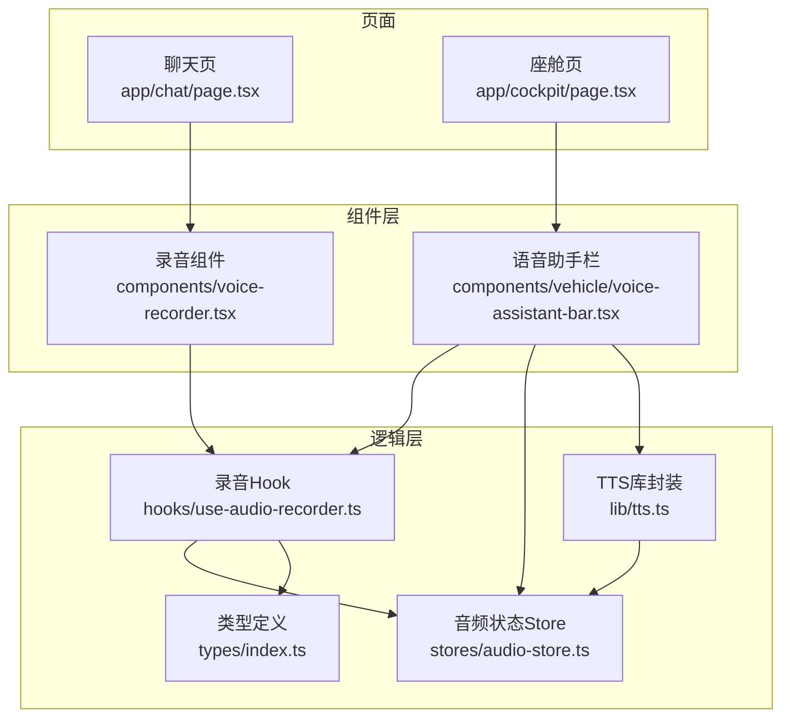
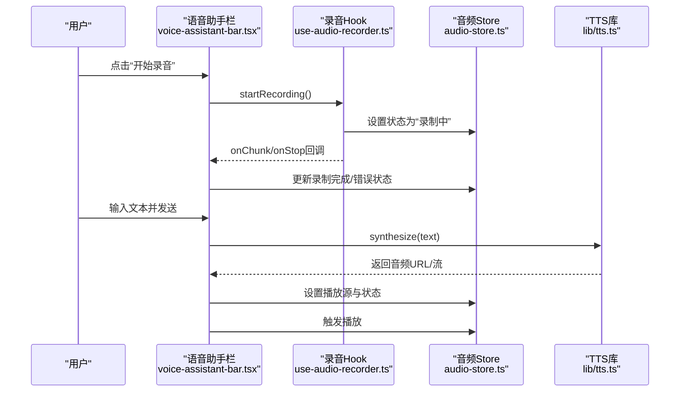
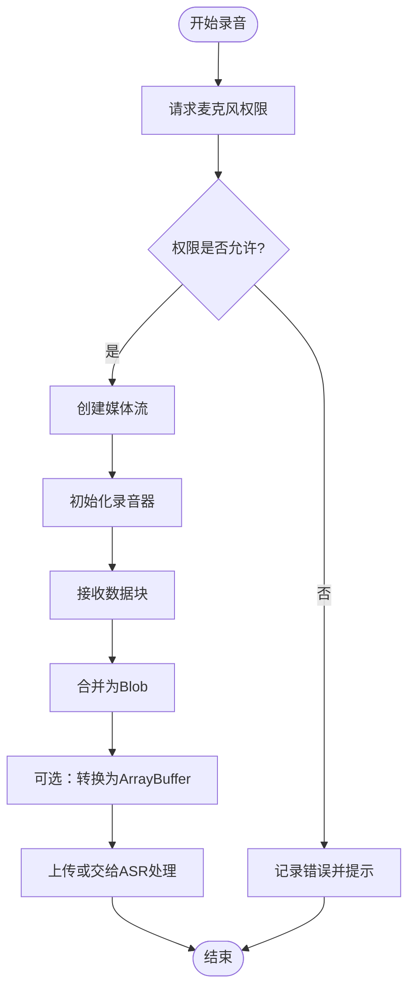
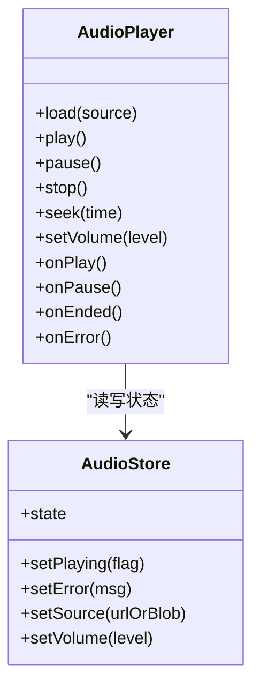
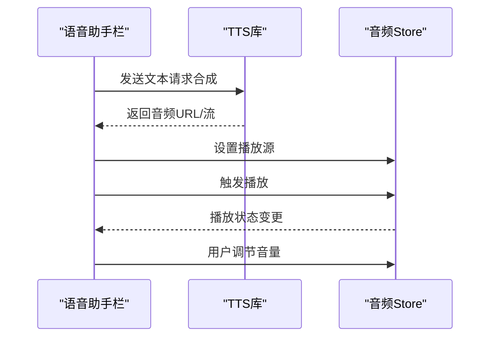
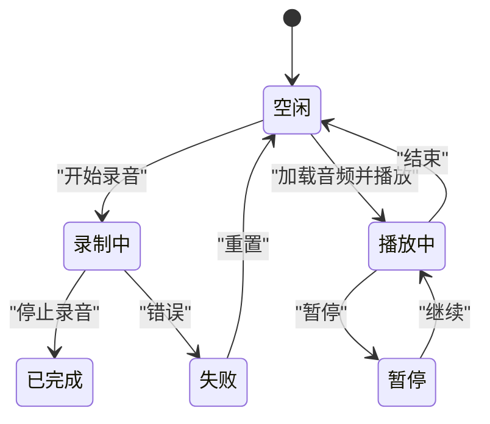
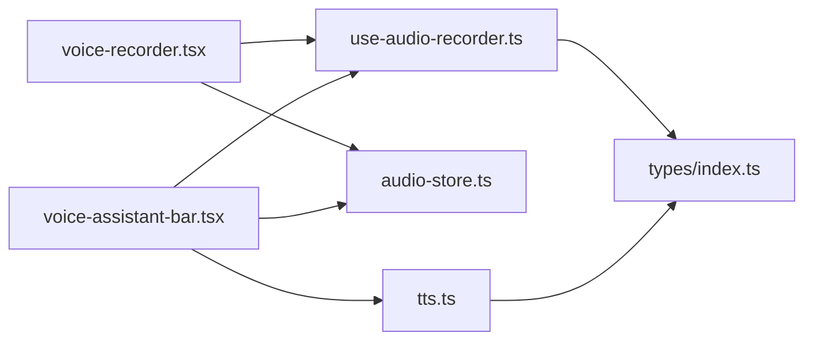

# 音频处理功能

<cite>
**本文引用的文件**   
- [frontend_design/src/hooks/use-audio-recorder.ts](file://frontend_design/src/hooks/use-audio-recorder.ts)
- [frontend_design/src/components/voice-recorder.tsx](file://frontend_design/src/components/voice-recorder.tsx)
- [frontend_design/src/stores/audio-store.ts](file://frontend_design/src/stores/audio-store.ts)
- [frontend_design/src/lib/tts.ts](file://frontend_design/src/lib/tts.ts)
- [frontend_design/src/components/vehicle/voice-assistant-bar.tsx](file://frontend_design/src/components/vehicle/voice-assistant-bar.tsx)
- [frontend_design/src/types/index.ts](file://frontend_design/src/types/index.ts)
- [frontend_design/src/app/chat/page.tsx](file://frontend_design/src/app/chat/page.tsx)
- [frontend_design/src/app/cockpit/page.tsx](file://frontend_design/src/app/cockpit/page.tsx)
</cite>

## 目录
1. [简介](#简介)
2. [项目结构](#项目结构)
3. [核心组件](#核心组件)
4. [架构总览](#架构总览)
5. [详细组件分析](#详细组件分析)
6. [依赖关系分析](#依赖关系分析)
7. [性能考虑](#性能考虑)
8. [故障排查指南](#故障排查指南)
9. [结论](#结论)
10. [附录](#附录)

## 简介
本文件面向NexusCockpit前端应用，系统化梳理音频处理相关能力与实现，包括：
- 录音功能：麦克风权限获取、实时音频流捕获、格式转换与上传
- 语音播放器：音频加载、播放控制、进度显示与交互
- TTS集成：文本转语音调用、播放控制、音量调节
- 状态管理：统一的播放/录制/错误状态
- 性能优化：内存管理、压缩编码、缓存策略
- 使用场景与示例：结合页面与组件的端到端流程

## 项目结构
前端音频相关代码主要分布在以下位置：
- hooks：use-audio-recorder.ts（录音Hook）
- components：voice-recorder.tsx（录音UI）、voice-assistant-bar.tsx（语音助手栏）
- stores：audio-store.ts（全局音频状态）
- lib：tts.ts（TTS客户端封装）
- types：index.ts（类型定义）
- app：chat/page.tsx、cockpit/page.tsx（集成入口）

图表来源
- [frontend_design/src/app/chat/page.tsx](file://frontend_design/src/app/chat/page.tsx)
- [frontend_design/src/app/cockpit/page.tsx](file://frontend_design/src/app/cockpit/page.tsx)
- [frontend_design/src/components/voice-recorder.tsx](file://frontend_design/src/components/voice-recorder.tsx)
- [frontend_design/src/components/vehicle/voice-assistant-bar.tsx](file://frontend_design/src/components/vehicle/voice-assistant-bar.tsx)
- [frontend_design/src/hooks/use-audio-recorder.ts](file://frontend_design/src/hooks/use-audio-recorder.ts)
- [frontend_design/src/stores/audio-store.ts](file://frontend_design/src/stores/audio-store.ts)
- [frontend_design/src/lib/tts.ts](file://frontend_design/src/lib/tts.ts)
- [frontend_design/src/types/index.ts](file://frontend_design/src/types/index.ts)

章节来源
- [frontend_design/src/hooks/use-audio-recorder.ts](file://frontend_design/src/hooks/use-audio-recorder.ts)
- [frontend_design/src/components/voice-recorder.tsx](file://frontend_design/src/components/voice-recorder.tsx)
- [frontend_design/src/stores/audio-store.ts](file://frontend_design/src/stores/audio-store.ts)
- [frontend_design/src/lib/tts.ts](file://frontend_design/src/lib/tts.ts)
- [frontend_design/src/components/vehicle/voice-assistant-bar.tsx](file://frontend_design/src/components/vehicle/voice-assistant-bar.tsx)
- [frontend_design/src/types/index.ts](file://frontend_design/src/types/index.ts)
- [frontend_design/src/app/chat/page.tsx](file://frontend_design/src/app/chat/page.tsx)
- [frontend_design/src/app/cockpit/page.tsx](file://frontend_design/src/app/cockpit/page.tsx)

## 核心组件
- 录音Hook（use-audio-recorder）
  - 职责：封装浏览器媒体设备访问、MediaRecorder创建、数据块收集、格式转换与回调
  - 关键能力：请求麦克风权限、开始/停止录制、生成Blob/ArrayBuffer、触发事件
- 录音组件（voice-recorder）
  - 职责：提供用户交互（开始/停止/取消）、展示录制时长与波形提示、错误提示
  - 集成：调用录音Hook，将录制结果提交到后端或交由其他模块处理
- 音频状态Store（audio-store）
  - 职责：集中管理播放状态、录制状态、错误信息、当前音频源、音量等
  - 特性：跨组件共享、响应式更新、避免重复实例化
- TTS库（tts）
  - 职责：封装TTS服务端调用、返回音频流或URL、错误重试与降级
  - 集成：在语音助手栏中根据文本内容发起合成并自动播放
- 语音助手栏（voice-assistant-bar）
  - 职责：聚合录音与TTS播放、统一状态展示、提供音量控制与进度条
  - 集成：读取Store状态，驱动播放/暂停/停止，联动录音Hook

章节来源
- [frontend_design/src/hooks/use-audio-recorder.ts](file://frontend_design/src/hooks/use-audio-recorder.ts)
- [frontend_design/src/components/voice-recorder.tsx](file://frontend_design/src/components/voice-recorder.tsx)
- [frontend_design/src/stores/audio-store.ts](file://frontend_design/src/stores/audio-store.ts)
- [frontend_design/src/lib/tts.ts](file://frontend_design/src/lib/tts.ts)
- [frontend_design/src/components/vehicle/voice-assistant-bar.tsx](file://frontend_design/src/components/vehicle/voice-assistant-bar.tsx)

## 架构总览
整体采用“组件→Hook/Store→服务”的分层设计：
- 页面层仅负责布局与路由，不直接持有音频逻辑
- 组件层通过Hook和Store进行交互，保持UI与逻辑解耦
- 服务层（TTS）通过HTTP/WebSocket与后端通信，返回可播放音频

图表来源
- [frontend_design/src/components/vehicle/voice-assistant-bar.tsx](file://frontend_design/src/components/vehicle/voice-assistant-bar.tsx)
- [frontend_design/src/hooks/use-audio-recorder.ts](file://frontend_design/src/hooks/use-audio-recorder.ts)
- [frontend_design/src/stores/audio-store.ts](file://frontend_design/src/stores/audio-store.ts)
- [frontend_design/src/lib/tts.ts](file://frontend_design/src/lib/tts.ts)

## 详细组件分析

### 录音功能（麦克风权限、流捕获、格式转换）
- 权限获取
  - 使用浏览器媒体API请求麦克风权限
  - 失败时给出明确错误提示与引导
- 流捕获
  - 创建MediaStream并初始化MediaRecorder
  - 按时间片收集数据块，支持导出完整音频
- 格式转换
  - 将数据块合并为Blob，必要时转换为ArrayBuffer供后续处理
  - 根据目标平台选择合适MIME类型（如webm/mp4等）

图表来源
- [frontend_design/src/hooks/use-audio-recorder.ts](file://frontend_design/src/hooks/use-audio-recorder.ts)
- [frontend_design/src/components/voice-recorder.tsx](file://frontend_design/src/components/voice-recorder.tsx)

章节来源
- [frontend_design/src/hooks/use-audio-recorder.ts](file://frontend_design/src/hooks/use-audio-recorder.ts)
- [frontend_design/src/components/voice-recorder.tsx](file://frontend_design/src/components/voice-recorder.tsx)

### 语音播放器（加载、控制、进度）
- 音频加载
  - 支持从URL或Blob加载，自动检测格式
  - 预加载策略：按需加载，避免阻塞首屏
- 播放控制
  - 播放/暂停/停止、跳转至指定时间点
  - 循环播放与静音切换
- 进度显示
  - 实时更新播放进度与剩余时间
  - 支持拖拽跳转

图表来源
- [frontend_design/src/stores/audio-store.ts](file://frontend_design/src/stores/audio-store.ts)
- [frontend_design/src/components/vehicle/voice-assistant-bar.tsx](file://frontend_design/src/components/vehicle/voice-assistant-bar.tsx)

章节来源
- [frontend_design/src/stores/audio-store.ts](file://frontend_design/src/stores/audio-store.ts)
- [frontend_design/src/components/vehicle/voice-assistant-bar.tsx](file://frontend_design/src/components/vehicle/voice-assistant-bar.tsx)

### TTS语音合成（调用、播放、音量）
- 文本转语音调用
  - 向TTS服务发送文本，等待返回音频资源（URL或流）
  - 支持重试与超时控制
- 播放控制
  - 收到音频后自动加载并播放
  - 与Store联动，更新播放状态与错误信息
- 音量调节
  - 提供音量滑块，实时调整输出音量

图表来源
- [frontend_design/src/lib/tts.ts](file://frontend_design/src/lib/tts.ts)
- [frontend_design/src/stores/audio-store.ts](file://frontend_design/src/stores/audio-store.ts)
- [frontend_design/src/components/vehicle/voice-assistant-bar.tsx](file://frontend_design/src/components/vehicle/voice-assistant-bar.tsx)

章节来源
- [frontend_design/src/lib/tts.ts](file://frontend_design/src/lib/tts.ts)
- [frontend_design/src/stores/audio-store.ts](file://frontend_design/src/stores/audio-store.ts)
- [frontend_design/src/components/vehicle/voice-assistant-bar.tsx](file://frontend_design/src/components/vehicle/voice-assistant-bar.tsx)

### 音频状态统一管理
- 状态维度
  - 播放状态：空闲/播放中/暂停/结束
  - 录制状态：未开始/录制中/已完成/失败
  - 错误信息：权限拒绝、网络异常、解码失败等
  - 当前源：音频URL/Blob、时长、格式
  - 音量：0~1范围
- 更新策略
  - 所有变更通过Store集中派发，组件订阅更新
  - 避免多处重复维护状态，降低不一致风险

图表来源
- [frontend_design/src/stores/audio-store.ts](file://frontend_design/src/stores/audio-store.ts)

章节来源
- [frontend_design/src/stores/audio-store.ts](file://frontend_design/src/stores/audio-store.ts)

### 使用场景与示例
- 聊天页集成录音
  - 在聊天输入区旁放置录音按钮，点击后进入录制状态
  - 录制完成后自动上传并触发ASR，将结果插入对话
- 座舱页语音助手
  - 常驻底部栏，支持一键录音与TTS播报
  - 显示播放进度与音量控制，便于驾驶场景操作

章节来源
- [frontend_design/src/app/chat/page.tsx](file://frontend_design/src/app/chat/page.tsx)
- [frontend_design/src/app/cockpit/page.tsx](file://frontend_design/src/app/cockpit/page.tsx)
- [frontend_design/src/components/voice-recorder.tsx](file://frontend_design/src/components/voice-recorder.tsx)
- [frontend_design/src/components/vehicle/voice-assistant-bar.tsx](file://frontend_design/src/components/vehicle/voice-assistant-bar.tsx)

## 依赖关系分析
- 组件依赖
  - voice-recorder.tsx 依赖 use-audio-recorder.ts 与 audio-store.ts
  - voice-assistant-bar.tsx 依赖 use-audio-recorder.ts、audio-store.ts 与 tts.ts
- 类型依赖
  - 各模块共用 types/index.ts 中的接口定义，确保一致性与可维护性

图表来源
- [frontend_design/src/components/voice-recorder.tsx](file://frontend_design/src/components/voice-recorder.tsx)
- [frontend_design/src/hooks/use-audio-recorder.ts](file://frontend_design/src/hooks/use-audio-recorder.ts)
- [frontend_design/src/stores/audio-store.ts](file://frontend_design/src/stores/audio-store.ts)
- [frontend_design/src/lib/tts.ts](file://frontend_design/src/lib/tts.ts)
- [frontend_design/src/types/index.ts](file://frontend_design/src/types/index.ts)

章节来源
- [frontend_design/src/components/voice-recorder.tsx](file://frontend_design/src/components/voice-recorder.tsx)
- [frontend_design/src/hooks/use-audio-recorder.ts](file://frontend_design/src/hooks/use-audio-recorder.ts)
- [frontend_design/src/stores/audio-store.ts](file://frontend_design/src/stores/audio-store.ts)
- [frontend_design/src/lib/tts.ts](file://frontend_design/src/lib/tts.ts)
- [frontend_design/src/types/index.ts](file://frontend_design/src/types/index.ts)

## 性能考虑
- 内存管理
  - 及时释放MediaStream与Audio对象引用，避免泄漏
  - 大音频文件采用分块加载与流式播放
- 压缩编码
  - 录制阶段选择合适的MIME类型与采样率，平衡质量与体积
  - 对长音频进行分段压缩后再上传
- 缓存策略
  - 对常用TTS结果进行本地缓存（IndexedDB），减少重复请求
  - 播放列表预加载下一段音频，提升用户体验
- 并发控制
  - 限制同时进行的录音与TTS任务数量，避免资源争用
- 错误恢复
  - 网络抖动时自动重试与降级（如回退到较低码率）

[本节为通用指导，无需具体文件来源]

## 故障排查指南
- 常见问题
  - 麦克风权限被拒绝：检查浏览器安全上下文（HTTPS）与用户授权
  - 无法播放音频：确认MIME类型与浏览器兼容性
  - TTS调用失败：检查网络连通性与后端服务状态
- 定位方法
  - 在Store中查看错误信息与状态流转
  - 在组件中打印关键生命周期与回调
  - 使用浏览器开发者工具监控网络与媒体流

章节来源
- [frontend_design/src/stores/audio-store.ts](file://frontend_design/src/stores/audio-store.ts)
- [frontend_design/src/components/voice-recorder.tsx](file://frontend_design/src/components/voice-recorder.tsx)
- [frontend_design/src/lib/tts.ts](file://frontend_design/src/lib/tts.ts)

## 结论
通过将录音、播放与TTS能力抽象为独立Hook、Store与库，NexusCockpit前端实现了高内聚、低耦合的音频处理体系。配合统一的状态管理与完善的错误处理机制，可在多页面复用并保持良好性能与用户体验。建议持续优化编码参数、缓存策略与并发控制，以适配更复杂的业务场景。

[本节为总结，无需具体文件来源]

## 附录
- 类型参考
  - 音频状态、错误码、TTS请求/响应结构等定义位于类型文件中，便于扩展与维护

章节来源
- [frontend_design/src/types/index.ts](file://frontend_design/src/types/index.ts)