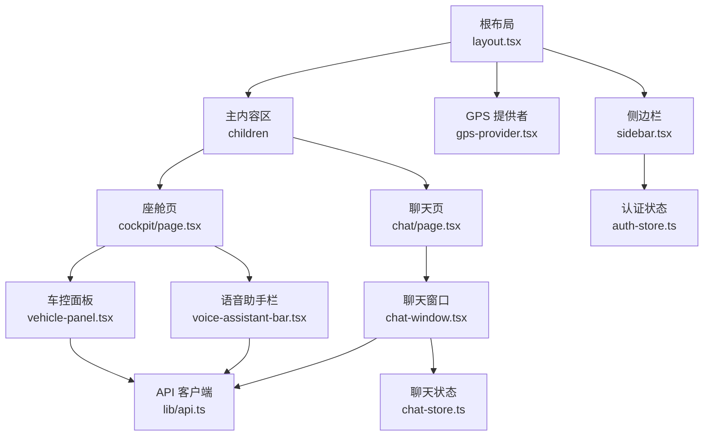
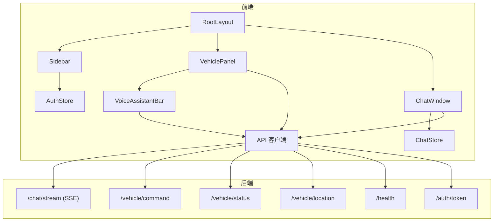
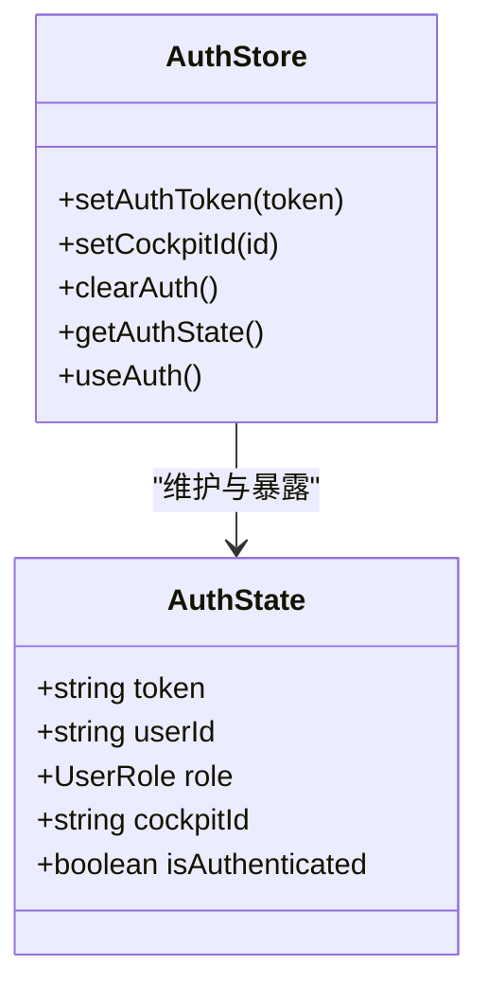
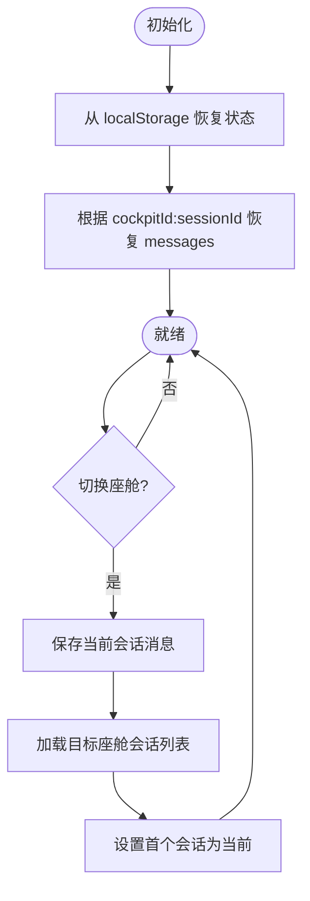
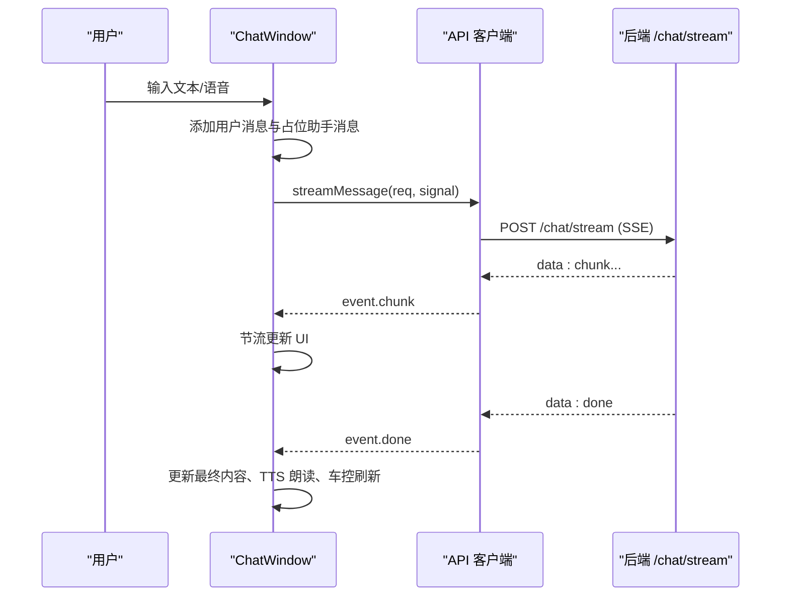
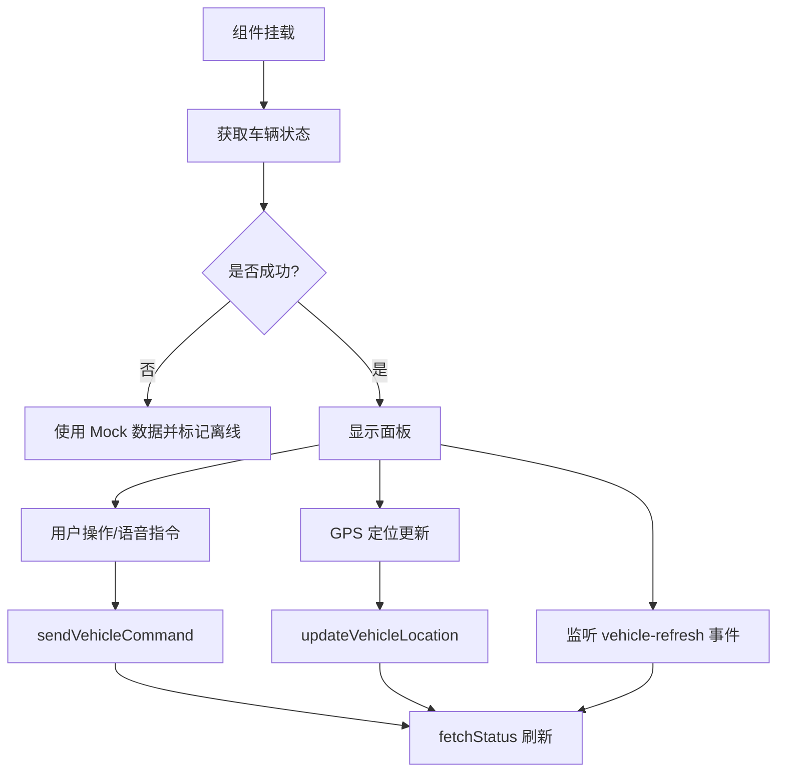
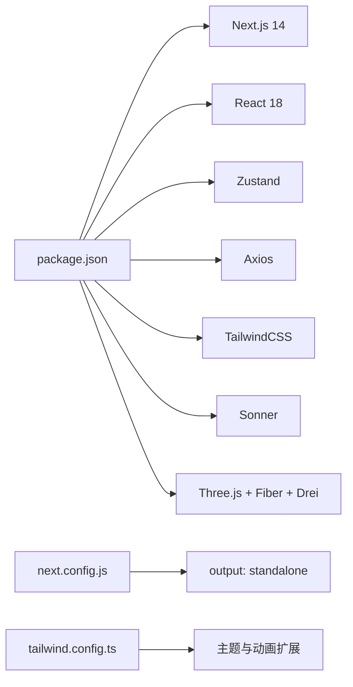

# 前端架构

<cite>
**本文引用的文件**   
- [frontend_design/src/app/layout.tsx](file://frontend_design/src/app/layout.tsx)
- [frontend_design/src/app/page.tsx](file://frontend_design/src/app/page.tsx)
- [frontend_design/src/app/cockpit/page.tsx](file://frontend_design/src/app/cockpit/page.tsx)
- [frontend_design/src/app/chat/page.tsx](file://frontend_design/src/app/chat/page.tsx)
- [frontend_design/src/app/vehicle/page.tsx](file://frontend_design/src/app/vehicle/page.tsx)
- [frontend_design/src/components/layout/sidebar.tsx](file://frontend_design/src/components/layout/sidebar.tsx)
- [frontend_design/src/components/layout/gps-provider.tsx](file://frontend_design/src/components/layout/gps-provider.tsx)
- [frontend_design/src/components/vehicle/vehicle-panel.tsx](file://frontend_design/src/components/vehicle/vehicle-panel.tsx)
- [frontend_design/src/components/vehicle/voice-assistant-bar.tsx](file://frontend_design/src/components/vehicle/voice-assistant-bar.tsx)
- [frontend_design/src/components/chat/chat-window.tsx](file://frontend_design/src/components/chat/chat-window.tsx)
- [frontend_design/src/stores/auth-store.ts](file://frontend_design/src/stores/auth-store.ts)
- [frontend_design/src/stores/chat-store.ts](file://frontend_design/src/stores/chat-store.ts)
- [frontend_design/src/lib/api.ts](file://frontend_design/src/lib/api.ts)
- [frontend_design/package.json](file://frontend_design/package.json)
- [frontend_design/next.config.js](file://frontend_design/next.config.js)
- [frontend_design/tailwind.config.ts](file://frontend_design/tailwind.config.ts)
</cite>

## 目录
1. [简介](#简介)
2. [项目结构](#项目结构)
3. [核心组件](#核心组件)
4. [架构总览](#架构总览)
5. [详细组件分析](#详细组件分析)
6. [依赖关系分析](#依赖关系分析)
7. [性能与体验优化](#性能与体验优化)
8. [故障排查指南](#故障排查指南)
9. [结论](#结论)

## 简介
本文件面向 NexusCockpit 前端（Next.js 14）的架构与技术实现，聚焦以下目标：
- App Router 路由与页面组织、布局嵌套机制
- 核心组件职责与交互：座舱控制台、聊天界面、车控面板、语音助手栏、3D可视化（预留）
- Zustand 状态管理：认证状态、聊天状态、车辆状态的持久化与跨组件共享
- 实时通信：SSE 流式响应处理、WebSocket 连接管理（当前以 SSE 为主）
- 响应式设计、无障碍访问与性能优化的最佳实践

## 项目结构
前端采用 Next.js 14 App Router 的组织方式：
- 根布局 layout.tsx 提供全局 HTML 骨架、侧边导航、GPS 定位提供者与 Toast 容器
- 页面按功能划分在 app 目录下，如 cockpit、chat、dashboard、admin 等
- 组件按领域拆分到 components 下：layout、ui、vehicle、chat
- 状态集中在 stores：auth-store（认证与 RBAC）、chat-store（会话与消息）
- API 统一封装在 lib/api.ts，包含 axios 实例、SSE 流式读取、错误重试与鉴权注入

图表来源
- [frontend_design/src/app/layout.tsx:1-55](file://frontend_design/src/app/layout.tsx#L1-L55)
- [frontend_design/src/components/layout/sidebar.tsx:1-402](file://frontend_design/src/components/layout/sidebar.tsx#L1-L402)
- [frontend_design/src/components/layout/gps-provider.tsx:1-21](file://frontend_design/src/components/layout/gps-provider.tsx#L1-L21)
- [frontend_design/src/app/cockpit/page.tsx:1-41](file://frontend_design/src/app/cockpit/page.tsx#L1-L41)
- [frontend_design/src/app/chat/page.tsx:1-22](file://frontend_design/src/app/chat/page.tsx#L1-L22)
- [frontend_design/src/components/vehicle/vehicle-panel.tsx:1-717](file://frontend_design/src/components/vehicle/vehicle-panel.tsx#L1-L717)
- [frontend_design/src/components/vehicle/voice-assistant-bar.tsx:1-430](file://frontend_design/src/components/vehicle/voice-assistant-bar.tsx#L1-L430)
- [frontend_design/src/components/chat/chat-window.tsx:1-572](file://frontend_design/src/components/chat/chat-window.tsx#L1-L572)
- [frontend_design/src/stores/auth-store.ts:1-223](file://frontend_design/src/stores/auth-store.ts#L1-L223)
- [frontend_design/src/stores/chat-store.ts:1-286](file://frontend_design/src/stores/chat-store.ts#L1-L286)
- [frontend_design/src/lib/api.ts:1-745](file://frontend_design/src/lib/api.ts#L1-L745)

章节来源
- [frontend_design/src/app/layout.tsx:1-55](file://frontend_design/src/app/layout.tsx#L1-L55)
- [frontend_design/src/app/page.tsx:1-18](file://frontend_design/src/app/page.tsx#L1-L18)
- [frontend_design/src/app/cockpit/page.tsx:1-41](file://frontend_design/src/app/cockpit/page.tsx#L1-L41)
- [frontend_design/src/app/chat/page.tsx:1-22](file://frontend_design/src/app/chat/page.tsx#L1-L22)
- [frontend_design/src/app/vehicle/page.tsx:1-13](file://frontend_design/src/app/vehicle/page.tsx#L1-L13)
- [frontend_design/src/components/layout/sidebar.tsx:1-402](file://frontend_design/src/components/layout/sidebar.tsx#L1-L402)
- [frontend_design/src/components/layout/gps-provider.tsx:1-21](file://frontend_design/src/components/layout/gps-provider.tsx#L1-L21)
- [frontend_design/src/components/vehicle/vehicle-panel.tsx:1-717](file://frontend_design/src/components/vehicle/vehicle-panel.tsx#L1-L717)
- [frontend_design/src/components/vehicle/voice-assistant-bar.tsx:1-430](file://frontend_design/src/components/vehicle/voice-assistant-bar.tsx#L1-L430)
- [frontend_design/src/components/chat/chat-window.tsx:1-572](file://frontend_design/src/components/chat/chat-window.tsx#L1-L572)
- [frontend_design/src/stores/auth-store.ts:1-223](file://frontend_design/src/stores/auth-store.ts#L1-L223)
- [frontend_design/src/stores/chat-store.ts:1-286](file://frontend_design/src/stores/chat-store.ts#L1-L286)
- [frontend_design/src/lib/api.ts:1-745](file://frontend_design/src/lib/api.ts#L1-L745)
- [frontend_design/package.json:1-45](file://frontend_design/package.json#L1-L45)
- [frontend_design/next.config.js:1-21](file://frontend_design/next.config.js#L1-L21)
- [frontend_design/tailwind.config.ts:1-55](file://frontend_design/tailwind.config.ts#L1-L55)

## 核心组件
- 根布局 RootLayout
  - 负责全局 HTML 骨架、主题样式、侧边栏挂载、GPS 定位提供者、Toast 通知容器
  - 通过 children 注入各页面内容，形成统一的布局嵌套
- 侧边栏 Sidebar
  - 用户视角导航：座舱控制、语音助手、个人设置；管理员可见运营总览、系统监控、管理设置
  - 会话列表管理：新建/切换/删除对话，按座舱维度分组
  - 健康检查与座舱选择器联动
- 座舱控制台 CockpitPage
  - 顶层聚合 VoiceAssistantBar 与 VehiclePanel，面向终端用户的操作入口
- 聊天界面 ChatWindow
  - 文本输入 + SSE 流式接收 AI 回复，支持浏览器语音识别与本地 ASR 录音
  - 多会话管理与历史消息加载，TTS 朗读与车控联动刷新
- 车控面板 VehiclePanel
  - 空调、座椅、媒体、导航、车窗、车辆状态概览
  - 命令执行并行控制、离线降级 Mock、GPS 位置更新与后端同步
- 语音助手栏 VoiceAssistantBar
  - 集成在车控面板顶部，快捷语音/文字输入，流式展示与 TTS 朗读
  - 自动触发车控刷新事件，支持 AbortController 中断旧请求
- 认证与聊天状态
  - auth-store：JWT 解析、RBAC 权限、座舱切换、Token 过期检测
  - chat-store：Zustand persist 持久化，按座舱+会话分组的消息与会话元数据

章节来源
- [frontend_design/src/app/layout.tsx:1-55](file://frontend_design/src/app/layout.tsx#L1-L55)
- [frontend_design/src/components/layout/sidebar.tsx:1-402](file://frontend_design/src/components/layout/sidebar.tsx#L1-L402)
- [frontend_design/src/app/cockpit/page.tsx:1-41](file://frontend_design/src/app/cockpit/page.tsx#L1-L41)
- [frontend_design/src/components/chat/chat-window.tsx:1-572](file://frontend_design/src/components/chat/chat-window.tsx#L1-L572)
- [frontend_design/src/components/vehicle/vehicle-panel.tsx:1-717](file://frontend_design/src/components/vehicle/vehicle-panel.tsx#L1-L717)
- [frontend_design/src/components/vehicle/voice-assistant-bar.tsx:1-430](file://frontend_design/src/components/vehicle/voice-assistant-bar.tsx#L1-L430)
- [frontend_design/src/stores/auth-store.ts:1-223](file://frontend_design/src/stores/auth-store.ts#L1-L223)
- [frontend_design/src/stores/chat-store.ts:1-286](file://frontend_design/src/stores/chat-store.ts#L1-L286)

## 架构总览
整体前后端交互与内部模块关系如下：

图表来源
- [frontend_design/src/app/layout.tsx:1-55](file://frontend_design/src/app/layout.tsx#L1-L55)
- [frontend_design/src/components/layout/sidebar.tsx:1-402](file://frontend_design/src/components/layout/sidebar.tsx#L1-L402)
- [frontend_design/src/components/vehicle/vehicle-panel.tsx:1-717](file://frontend_design/src/components/vehicle/vehicle-panel.tsx#L1-L717)
- [frontend_design/src/components/vehicle/voice-assistant-bar.tsx:1-430](file://frontend_design/src/components/vehicle/voice-assistant-bar.tsx#L1-L430)
- [frontend_design/src/components/chat/chat-window.tsx:1-572](file://frontend_design/src/components/chat/chat-window.tsx#L1-L572)
- [frontend_design/src/stores/auth-store.ts:1-223](file://frontend_design/src/stores/auth-store.ts#L1-L223)
- [frontend_design/src/stores/chat-store.ts:1-286](file://frontend_design/src/stores/chat-store.ts#L1-L286)
- [frontend_design/src/lib/api.ts:1-745](file://frontend_design/src/lib/api.ts#L1-L745)

## 详细组件分析

### 认证与权限（auth-store）
- JWT Token 解析与持久化：从 localStorage 读取并校验 exp，未登录或过期则重置状态
- RBAC 角色层级：super_admin > cockpit_admin > cockpit_user > cockpit_viewer
- 座舱隔离：维护 cockpitId，写入请求头 X-Cockpit-Id，配合后端多租户
- 监听与订阅：模块级单例 + 监听器集合，useAuth hook 订阅变化并定时检查过期

图表来源
- [frontend_design/src/stores/auth-store.ts:1-223](file://frontend_design/src/stores/auth-store.ts#L1-L223)

章节来源
- [frontend_design/src/stores/auth-store.ts:1-223](file://frontend_design/src/stores/auth-store.ts#L1-L223)

### 聊天状态与会话（chat-store）
- 多会话支持：按 cockpitId + sessionId 分组存储 messagesByKey 与 sessionsByCockpit
- 持久化：使用 zustand/middleware persist，仅持久化必要字段，onRehydrateStorage 恢复时间戳与 loading 状态
- 会话切换：保存当前会话消息，加载目标会话消息，若无则创建默认会话
- 流式状态：isStreaming 标记，避免并发冲突

图表来源
- [frontend_design/src/stores/chat-store.ts:1-286](file://frontend_design/src/stores/chat-store.ts#L1-L286)

章节来源
- [frontend_design/src/stores/chat-store.ts:1-286](file://frontend_design/src/stores/chat-store.ts#L1-L286)

### 聊天窗口与流式响应（chat-window）
- 发送流程：用户消息入队 → 占位助手消息 → SSE 流式接收 → 节流渲染 → done 后 TTS 朗读与车控联动
- 降级策略：若流式失败（404/501），回退为非流式 sendMessage
- 语音输入：浏览器 Web Speech API 与本地 ASR 录音上传后端 SenseVoice 模型识别
- 取消机制：AbortController 中断旧请求，避免阻塞

图表来源
- [frontend_design/src/components/chat/chat-window.tsx:1-572](file://frontend_design/src/components/chat/chat-window.tsx#L1-L572)
- [frontend_design/src/lib/api.ts:1-745](file://frontend_design/src/lib/api.ts#L1-L745)

章节来源
- [frontend_design/src/components/chat/chat-window.tsx:1-572](file://frontend_design/src/components/chat/chat-window.tsx#L1-L572)
- [frontend_design/src/lib/api.ts:1-745](file://frontend_design/src/lib/api.ts#L1-L745)

### 车控面板与语音助手栏（vehicle-panel & voice-assistant-bar）
- 车控面板
  - 初始化拉取车辆状态，失败时降级到 Mock 数据
  - 命令并行控制：基于 command_args 组合键，避免按钮互相阻塞
  - GPS 定位：每 5 分钟更新坐标缓存，成功后刷新状态
  - 语音助手联动：收到 vehicle-refresh 事件后延迟刷新
- 语音助手栏
  - 集成麦克风与本地 ASR，流式展示与 TTS 朗读
  - 快捷指令一键发送，AbortController 中断旧请求
  - 检测到车控意图时触发 emitVehicleRefresh

图表来源
- [frontend_design/src/components/vehicle/vehicle-panel.tsx:1-717](file://frontend_design/src/components/vehicle/vehicle-panel.tsx#L1-L717)
- [frontend_design/src/components/vehicle/voice-assistant-bar.tsx:1-430](file://frontend_design/src/components/vehicle/voice-assistant-bar.tsx#L1-L430)
- [frontend_design/src/lib/api.ts:1-745](file://frontend_design/src/lib/api.ts#L1-L745)

章节来源
- [frontend_design/src/components/vehicle/vehicle-panel.tsx:1-717](file://frontend_design/src/components/vehicle/vehicle-panel.tsx#L1-L717)
- [frontend_design/src/components/vehicle/voice-assistant-bar.tsx:1-430](file://frontend_design/src/components/vehicle/voice-assistant-bar.tsx#L1-L430)
- [frontend_design/src/lib/api.ts:1-745](file://frontend_design/src/lib/api.ts#L1-L745)

### 侧边栏与会话管理（sidebar）
- 导航菜单按角色分区：普通用户与管理员菜单动态显示
- 会话列表：新建/切换/删除，按座舱维度分组
- 健康检查：每 30 秒轮询 /health，底部状态栏展示系统运行状态
- 座舱选择器：下拉切换 cockpitId，同步到 chat-store 与 API 请求头

章节来源
- [frontend_design/src/components/layout/sidebar.tsx:1-402](file://frontend_design/src/components/layout/sidebar.tsx#L1-L402)

### 3D 可视化（预留）
- 当前代码库中已引入 three、@react-three/fiber、@react-three/drei 依赖，但未见具体 3D 组件实现
- 建议后续在 components/vehicle 下新增 Vehicle3D 组件，与 VehiclePanel 共享车辆状态并通过事件总线联动

章节来源
- [frontend_design/package.json:1-45](file://frontend_design/package.json#L1-L45)

## 依赖关系分析
- 构建与运行时
  - Next.js 14、React 18、TailwindCSS、Zustand、Axios、Sonner、Three.js 生态
- 配置要点
  - next.config.output=standalone 用于 Docker 独立镜像
  - Tailwind 自定义颜色、圆角、动画 keyframes
  - 环境变量 NEXT_PUBLIC_API_URL 控制后端地址

图表来源
- [frontend_design/package.json:1-45](file://frontend_design/package.json#L1-L45)
- [frontend_design/next.config.js:1-21](file://frontend_design/next.config.js#L1-L21)
- [frontend_design/tailwind.config.ts:1-55](file://frontend_design/tailwind.config.ts#L1-L55)

章节来源
- [frontend_design/package.json:1-45](file://frontend_design/package.json#L1-L45)
- [frontend_design/next.config.js:1-21](file://frontend_design/next.config.js#L1-L21)
- [frontend_design/tailwind.config.ts:1-55](file://frontend_design/tailwind.config.ts#L1-L55)

## 性能与体验优化
- 流式渲染节流
  - 使用 requestAnimationFrame 合并高频 chunk 更新，避免频繁 setState 导致卡顿
- 请求取消与并发控制
  - AbortController 中断旧流式请求；车控命令基于唯一键并行执行，互不阻塞
- 降级与容错
  - 车控面板网络失败时使用 Mock 数据；聊天流式失败自动回退非流式接口
- 资源与构建
  - output: standalone 减小镜像体积；按需引入 Three.js 生态，避免不必要的包体积
- 响应式与可访问性
  - Tailwind 栅格与断点适配移动端；语义化标签与 aria 属性建议在 UI 组件层补充
  - 键盘交互：Enter 发送、Shift+Enter 换行；焦点管理与提示文案完善

[本节为通用指导，无需源码引用]

## 故障排查指南
- 鉴权问题
  - 现象：401 错误或无法访问受保护页面
  - 排查：确认 ensureAuthToken 是否成功获取 Token；检查 localStorage 中的 nexus_token 与 exp；查看 auth-store 的 setAuthToken 调用链路
- 流式请求异常
  - 现象：SSE 无响应或中断
  - 排查：检查 StreamError 的状态码；确认 AbortSignal 是否正确传递；验证后端 /chat/stream 可用性
- 车控命令无效
  - 现象：按钮点击无反馈或状态不刷新
  - 排查：查看 isCmdLoading 状态；确认 sendVehicleCommand 返回；检查 vehicle-refresh 事件是否触发
- 会话丢失
  - 现象：切换座舱或刷新后消息为空
  - 排查：检查 persist 的 partialize 字段；确认 onRehydrateStorage 恢复逻辑；核对 cockpitId:sessionId 键生成

章节来源
- [frontend_design/src/lib/api.ts:1-745](file://frontend_design/src/lib/api.ts#L1-L745)
- [frontend_design/src/stores/auth-store.ts:1-223](file://frontend_design/src/stores/auth-store.ts#L1-L223)
- [frontend_design/src/stores/chat-store.ts:1-286](file://frontend_design/src/stores/chat-store.ts#L1-L286)
- [frontend_design/src/components/vehicle/vehicle-panel.tsx:1-717](file://frontend_design/src/components/vehicle/vehicle-panel.tsx#L1-L717)
- [frontend_design/src/components/chat/chat-window.tsx:1-572](file://frontend_design/src/components/chat/chat-window.tsx#L1-L572)

## 结论
NexusCockpit 前端基于 Next.js 14 的 App Router 实现了清晰的路由与布局分层，核心组件围绕“座舱控制台—聊天—车控”展开，通过 Zustand 进行跨组件状态共享与持久化。实时通信以 SSE 为主，具备完善的降级与容错策略。结合 rAF 节流、AbortController 取消、Mock 降级与 standalone 构建，系统在交互流畅度与部署效率上取得良好平衡。后续可在 3D 可视化与无障碍增强方面继续完善。