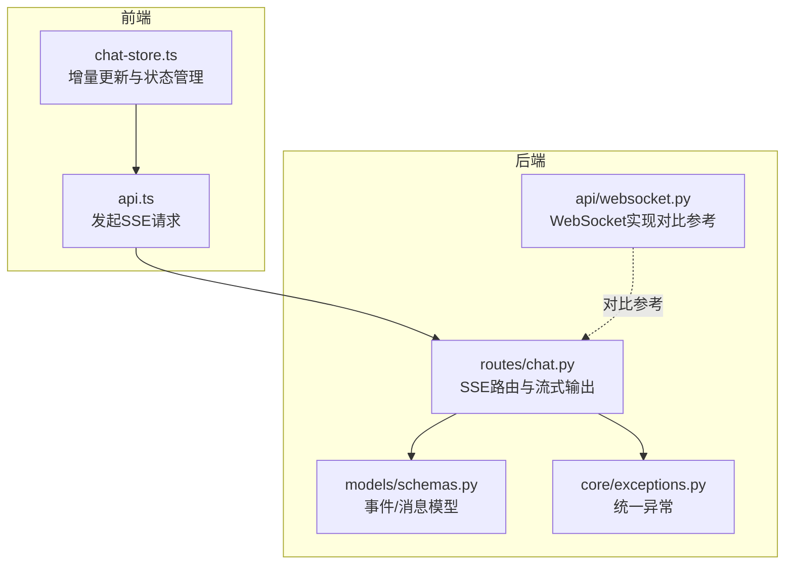
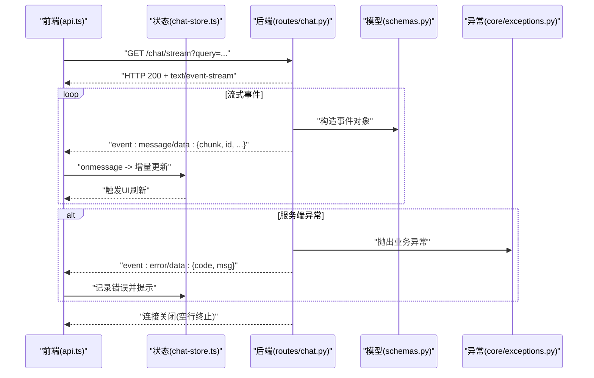
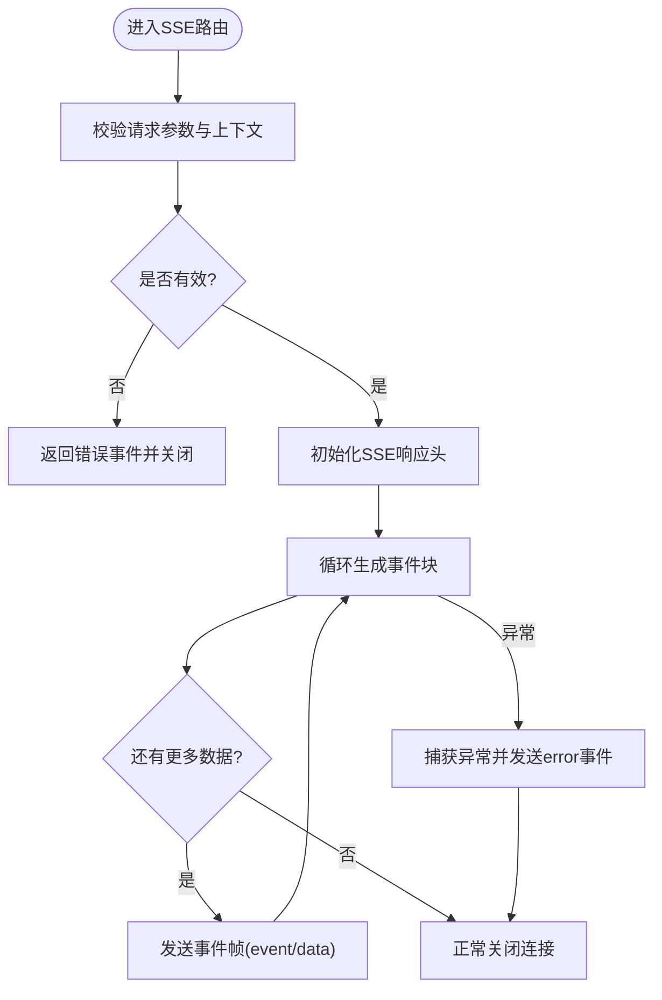
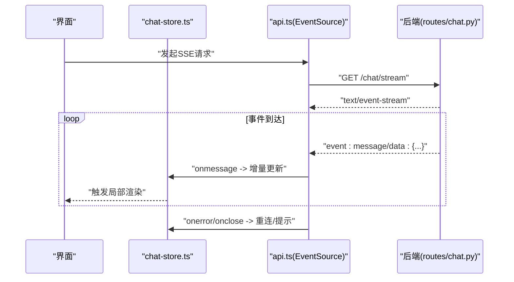
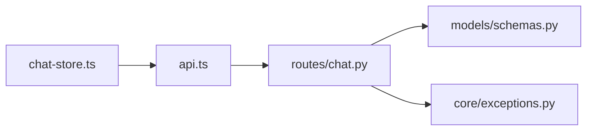

# SSE流式响应

<cite>
**本文引用的文件**   
- [backend_design/nexus/api/routes/chat.py](file://backend_design/nexus/api/routes/chat.py)
- [backend_design/nexus/api/websocket.py](file://backend_design/nexus/api/websocket.py)
- [backend_design/nexus/core/exceptions.py](file://backend_design/nexus/core/exceptions.py)
- [backend_design/nexus/models/schemas.py](file://backend_design/nexus/models/schemas.py)
- [frontend_design/src/lib/api.ts](file://frontend_design/src/lib/api.ts)
- [frontend_design/src/stores/chat-store.ts](file://frontend_design/src/stores/chat-store.ts)
</cite>

## 目录
1. [简介](#简介)
2. [项目结构](#项目结构)
3. [核心组件](#核心组件)
4. [架构总览](#架构总览)
5. [详细组件分析](#详细组件分析)
6. [依赖分析](#依赖分析)
7. [性能考虑](#性能考虑)
8. [故障排查指南](#故障排查指南)
9. [结论](#结论)
10. [附录](#附录)

## 简介
本技术文档围绕SSE（Server-Sent Events）流式响应，结合仓库中后端与前端实现，系统阐述连接生命周期、事件监听与数据解析、增量更新与内存优化、错误处理与重连机制，以及与WebSocket的对比与选型建议。文档同时给出事件类型定义、数据格式规范、最佳实践、调试技巧与性能优化方案，帮助读者在真实工程中稳定落地SSE流式能力。

## 项目结构
本项目采用前后端分离架构：
- 后端基于Python服务，提供REST与实时通信接口；其中聊天相关路由位于API层，模型与异常定义位于core与models层。
- 前端基于Next.js，使用TypeScript与状态管理库维护会话与UI增量更新。

图表来源
- [backend_design/nexus/api/routes/chat.py](file://backend_design/nexus/api/routes/chat.py)
- [backend_design/nexus/api/websocket.py](file://backend_design/nexus/api/websocket.py)
- [backend_design/nexus/models/schemas.py](file://backend_design/nexus/models/schemas.py)
- [backend_design/nexus/core/exceptions.py](file://backend_design/nexus/core/exceptions.py)
- [frontend_design/src/lib/api.ts](file://frontend_design/src/lib/api.ts)
- [frontend_design/src/stores/chat-store.ts](file://frontend_design/src/stores/chat-store.ts)

章节来源
- [backend_design/nexus/api/routes/chat.py](file://backend_design/nexus/api/routes/chat.py)
- [backend_design/nexus/api/websocket.py](file://backend_design/nexus/api/websocket.py)
- [backend_design/nexus/models/schemas.py](file://backend_design/nexus/models/schemas.py)
- [backend_design/nexus/core/exceptions.py](file://backend_design/nexus/core/exceptions.py)
- [frontend_design/src/lib/api.ts](file://frontend_design/src/lib/api.ts)
- [frontend_design/src/stores/chat-store.ts](file://frontend_design/src/stores/chat-store.ts)

## 核心组件
- 后端SSE路由：负责建立SSE连接、按块推送文本片段、携带事件类型与元信息、处理异常并安全关闭连接。
- 前端SSE客户端：负责创建EventSource、订阅事件、增量拼接内容、更新UI状态、处理断线重连与错误提示。
- 数据模型与异常：定义事件结构、字段约束与错误码，保证前后端契约一致。

章节来源
- [backend_design/nexus/api/routes/chat.py](file://backend_design/nexus/api/routes/chat.py)
- [frontend_design/src/lib/api.ts](file://frontend_design/src/lib/api.ts)
- [frontend_design/src/stores/chat-store.ts](file://frontend_design/src/stores/chat-store.ts)
- [backend_design/nexus/models/schemas.py](file://backend_design/nexus/models/schemas.py)
- [backend_design/nexus/core/exceptions.py](file://backend_design/nexus/core/exceptions.py)

## 架构总览
下图展示一次典型SSE流式对话的生命周期：从前端发起请求到后端逐步推送事件，再到前端增量渲染与状态同步。

图表来源
- [backend_design/nexus/api/routes/chat.py](file://backend_design/nexus/api/routes/chat.py)
- [backend_design/nexus/models/schemas.py](file://backend_design/nexus/models/schemas.py)
- [backend_design/nexus/core/exceptions.py](file://backend_design/nexus/core/exceptions.py)
- [frontend_design/src/lib/api.ts](file://frontend_design/src/lib/api.ts)
- [frontend_design/src/stores/chat-store.ts](file://frontend_design/src/stores/chat-store.ts)

## 详细组件分析

### 后端SSE路由与流式输出
- 职责
  - 接收前端请求，校验参数与鉴权上下文。
  - 初始化流式响应头，设置正确的MIME类型与缓存控制。
  - 循环生成事件，按块推送文本片段，附带事件类型与可选元数据。
  - 捕获异常，转换为标准错误事件，确保连接可恢复或优雅关闭。
- 关键流程
  - 建立连接：返回text/event-stream，保持长连接。
  - 事件发送：逐块写入事件帧，包含事件名与数据体。
  - 结束条件：任务完成或发生不可恢复错误时关闭连接。
- 错误处理
  - 网络异常：记录日志并返回error事件，前端据此触发重连策略。
  - 业务异常：映射为统一错误码与消息，便于前端展示。
  - 资源清理：确保中间件与数据库连接释放。

图表来源
- [backend_design/nexus/api/routes/chat.py](file://backend_design/nexus/api/routes/chat.py)
- [backend_design/nexus/core/exceptions.py](file://backend_design/nexus/core/exceptions.py)

章节来源
- [backend_design/nexus/api/routes/chat.py](file://backend_design/nexus/api/routes/chat.py)
- [backend_design/nexus/core/exceptions.py](file://backend_design/nexus/core/exceptions.py)

### 前端SSE客户端与增量更新
- 职责
  - 创建EventSource，订阅指定事件类型。
  - 在onmessage回调中解析事件数据，增量拼接内容。
  - 将增量结果写入状态存储，触发UI局部更新。
  - 处理onerror与close事件，执行指数退避重连与失败降级。
- 关键流程
  - 连接建立：成功打开后开始监听事件。
  - 增量更新：每收到一个事件，追加到当前会话内容，避免全量重建。
  - 错误与重连：根据错误码与重试次数决定等待时间与是否放弃。
  - 连接关闭：任务完成后主动断开，释放资源。
- 内存优化
  - 仅保留必要字段，及时丢弃已渲染的中间态。
  - 对超长文本进行分片与懒加载，避免一次性构建大字符串。

图表来源
- [frontend_design/src/lib/api.ts](file://frontend_design/src/lib/api.ts)
- [frontend_design/src/stores/chat-store.ts](file://frontend_design/src/stores/chat-store.ts)
- [backend_design/nexus/api/routes/chat.py](file://backend_design/nexus/api/routes/chat.py)

章节来源
- [frontend_design/src/lib/api.ts](file://frontend_design/src/lib/api.ts)
- [frontend_design/src/stores/chat-store.ts](file://frontend_design/src/stores/chat-store.ts)

### 事件类型与数据格式规范
- 事件类型
  - message：常规文本片段，用于增量拼接。
  - done：流结束标志，表示本次会话完成。
  - error：错误事件，携带错误码与消息，用于前端提示与重连决策。
- 数据体字段（示例）
  - chunk：文本片段内容。
  - id：事件唯一标识，便于去重与定位。
  - meta：可选扩展字段，如来源、时间戳等。
- 传输格式
  - 遵循text/event-stream协议，每个事件以空行分隔。
  - 事件名通过event字段声明，数据通过data字段承载，支持多行数据以换行符续行。

章节来源
- [backend_design/nexus/models/schemas.py](file://backend_design/nexus/models/schemas.py)

### 与WebSocket的区别与选择场景
- 通信方向
  - SSE：单向（服务器→客户端），适合流式输出、实时通知。
  - WebSocket：双向，适合即时聊天、协同编辑等需要频繁上行数据的场景。
- 浏览器兼容性
  - SSE：广泛支持，无需额外协议握手。
  - WebSocket：现代浏览器普遍支持，但需关注代理与防火墙穿透。
- 性能特点
  - SSE：开销较低，易于缓存与复用HTTP基础设施。
  - WebSocket：低延迟、高吞吐，但连接管理与心跳更复杂。
- 选型建议
  - 优先使用SSE：当仅需服务端推送、增量渲染、简单可靠即可。
  - 选择WebSocket：当需要双向交互、强一致性、低延迟双向通信。

[本节为概念性说明，不直接分析具体文件]

## 依赖分析
- 模块耦合
  - 后端SSE路由依赖模型定义与异常处理，形成清晰的边界。
  - 前端SSE客户端依赖状态存储，解耦UI与数据逻辑。
- 外部依赖
  - HTTP/HTTPS代理与负载均衡需正确转发text/event-stream。
  - 浏览器EventSource API与网络栈。

图表来源
- [backend_design/nexus/api/routes/chat.py](file://backend_design/nexus/api/routes/chat.py)
- [backend_design/nexus/models/schemas.py](file://backend_design/nexus/models/schemas.py)
- [backend_design/nexus/core/exceptions.py](file://backend_design/nexus/core/exceptions.py)
- [frontend_design/src/lib/api.ts](file://frontend_design/src/lib/api.ts)
- [frontend_design/src/stores/chat-store.ts](file://frontend_design/src/stores/chat-store.ts)

章节来源
- [backend_design/nexus/api/routes/chat.py](file://backend_design/nexus/api/routes/chat.py)
- [backend_design/nexus/models/schemas.py](file://backend_design/nexus/models/schemas.py)
- [backend_design/nexus/core/exceptions.py](file://backend_design/nexus/core/exceptions.py)
- [frontend_design/src/lib/api.ts](file://frontend_design/src/lib/api.ts)
- [frontend_design/src/stores/chat-store.ts](file://frontend_design/src/stores/chat-store.ts)

## 性能考虑
- 服务端
  - 合理分块大小：平衡延迟与CPU开销，避免过大导致阻塞。
  - 异步生成：使用异步迭代器或协程减少线程占用。
  - 资源回收：及时释放数据库连接、临时缓冲区。
- 客户端
  - 增量渲染：只更新变更部分，避免整页重建。
  - 文本拼接优化：使用高效数据结构，限制历史长度。
  - 节流与防抖：对高频事件合并更新，降低UI压力。
- 网络与代理
  - 配置Nginx/网关保持长连接，禁用不必要的缓冲。
  - 启用Keep-Alive，减少握手开销。

[本节为通用指导，不直接分析具体文件]

## 故障排查指南
- 常见问题
  - 连接无法建立：检查路由路径、鉴权中间件、代理转发规则。
  - 事件未到达：确认后端是否正确发送event/data帧，代理是否拦截。
  - 重连风暴：调整指数退避上限与最大重试次数。
- 诊断步骤
  - 查看后端日志：定位异常堆栈与错误码。
  - 抓包分析：验证SSE帧结构与间隔。
  - 前端控制台：观察onerror与onclose回调，记录重连次数。
- 恢复策略
  - 短暂中断：自动重连，带指数退避。
  - 持续错误：降级为轮询或提示用户重试。
  - 数据不一致：基于事件id去重与幂等更新。

章节来源
- [backend_design/nexus/core/exceptions.py](file://backend_design/nexus/core/exceptions.py)
- [frontend_design/src/lib/api.ts](file://frontend_design/src/lib/api.ts)

## 结论
SSE适用于服务端向客户端推送增量数据的场景，具备实现简单、兼容性好、性能稳定的优势。在本项目中，后端通过SSE路由按块推送事件，前端通过EventSource增量更新状态，配合统一的模型与异常定义，形成了可靠的流式响应链路。建议在需要双向通信或极低延迟交互的场景下选择WebSocket，其余情况优先采用SSE以获得更好的工程效率与可维护性。

[本节为总结性内容，不直接分析具体文件]

## 附录
- 最佳实践清单
  - 明确事件类型与数据字段，保持前后端契约稳定。
  - 为每个事件分配唯一id，支持去重与断点续传。
  - 设计合理的错误码体系，便于前端差异化处理。
  - 在代理层配置长连接与无缓冲转发。
  - 前端实现指数退避重连与最大重试限制。
- 调试技巧
  - 使用浏览器开发者工具的网络面板查看SSE帧。
  - 在后端增加结构化日志，记录事件id与耗时。
  - 编写端到端测试用例，覆盖正常、异常与重连路径。

[本节为补充性内容，不直接分析具体文件]