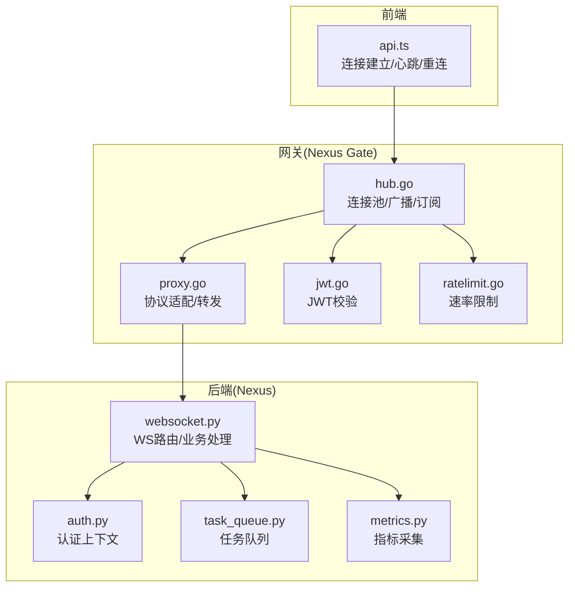
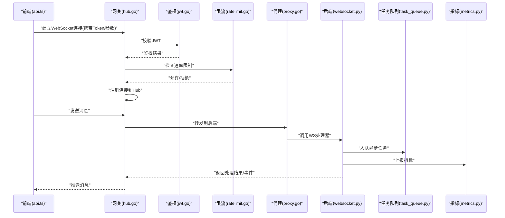
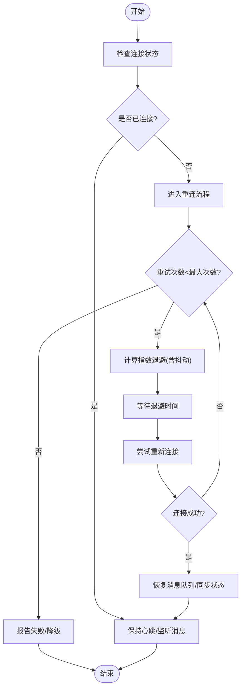
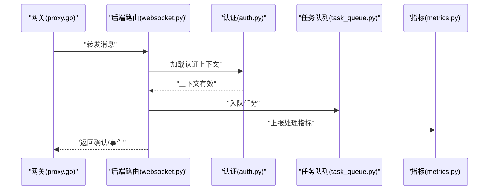
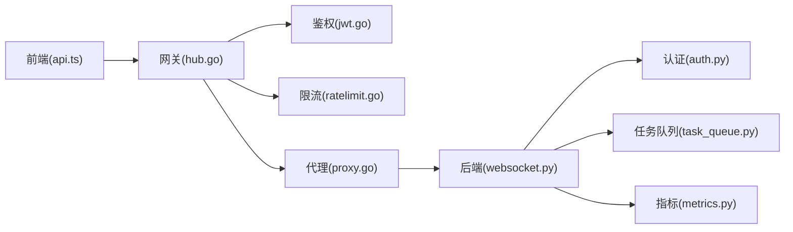

# WebSocket连接管理

<cite>
**本文引用的文件**   
- [backend_design/nexus/api/websocket.py](file://backend_design/nexus/api/websocket.py)
- [backend_design/nexus/core/auth.py](file://backend_design/nexus/core/auth.py)
- [backend_design/nexus/middleware/task_queue.py](file://backend_design/nexus/middleware/task_queue.py)
- [backend_design/nexus/observability/metrics.py](file://backend_design/nexus/observability/metrics.py)
- [backend_design/nexus_gate/internal/ws/hub.go](file://backend_design/nexus_gate/internal/ws/hub.go)
- [backend_design/nexus_gate/internal/proxy/proxy.go](file://backend_design/nexus_gate/internal/proxy/proxy.go)
- [backend_design/nexus_gate/internal/ratelimit/ratelimit.go](file://backend_design/nexus_gate/internal/ratelimit/ratelimit.go)
- [backend_design/nexus_gate/internal/auth/jwt.go](file://backend_design/nexus_gate/internal/auth/jwt.go)
- [frontend_design/src/lib/api.ts](file://frontend_design/src/lib/api.ts)
</cite>

## 目录
1. [简介](#简介)
2. [项目结构](#项目结构)
3. [核心组件](#核心组件)
4. [架构总览](#架构总览)
5. [详细组件分析](#详细组件分析)
6. [依赖关系分析](#依赖关系分析)
7. [性能考量](#性能考量)
8. [故障排查指南](#故障排查指南)
9. [结论](#结论)
10. [附录](#附录)

## 简介
本技术文档聚焦于WebSocket连接管理，覆盖前端连接的建立、认证、状态管理、心跳检测、断线重连、消息队列与序列化、错误处理与异常恢复、以及性能监控指标。文档同时给出最佳实践与常见问题解决方案，帮助读者在前后端协同场景下构建高可用、可观测的实时通信链路。

## 项目结构
本项目包含后端Python服务（Nexus）、Go网关（Nexus Gate）以及Next.js前端。WebSocket相关能力主要分布在：
- 后端API层：提供WebSocket路由与业务处理
- 网关层：负责鉴权、限流、代理转发与连接管理
- 前端：负责连接建立、心跳、重连与消息收发

图表来源
- [frontend_design/src/lib/api.ts](file://frontend_design/src/lib/api.ts)
- [backend_design/nexus_gate/internal/ws/hub.go](file://backend_design/nexus_gate/internal/ws/hub.go)
- [backend_design/nexus_gate/internal/proxy/proxy.go](file://backend_design/nexus_gate/internal/proxy/proxy.go)
- [backend_design/nexus_gate/internal/auth/jwt.go](file://backend_design/nexus_gate/internal/auth/jwt.go)
- [backend_design/nexus_gate/internal/ratelimit/ratelimit.go](file://backend_design/nexus_gate/internal/ratelimit/ratelimit.go)
- [backend_design/nexus/api/websocket.py](file://backend_design/nexus/api/websocket.py)
- [backend_design/nexus/core/auth.py](file://backend_design/nexus/core/auth.py)
- [backend_design/nexus/middleware/task_queue.py](file://backend_design/nexus/middleware/task_queue.py)
- [backend_design/nexus/observability/metrics.py](file://backend_design/nexus/observability/metrics.py)

章节来源
- [frontend_design/src/lib/api.ts](file://frontend_design/src/lib/api.ts)
- [backend_design/nexus/api/websocket.py](file://backend_design/nexus/api/websocket.py)
- [backend_design/nexus_gate/internal/ws/hub.go](file://backend_design/nexus_gate/internal/ws/hub.go)
- [backend_design/nexus_gate/internal/proxy/proxy.go](file://backend_design/nexus_gate/internal/proxy/proxy.go)
- [backend_design/nexus_gate/internal/auth/jwt.go](file://backend_design/nexus_gate/internal/auth/jwt.go)
- [backend_design/nexus_gate/internal/ratelimit/ratelimit.go](file://backend_design/nexus_gate/internal/ratelimit/ratelimit.go)
- [backend_design/nexus/core/auth.py](file://backend_design/nexus/core/auth.py)
- [backend_design/nexus/middleware/task_queue.py](file://backend_design/nexus/middleware/task_queue.py)
- [backend_design/nexus/observability/metrics.py](file://backend_design/nexus/observability/metrics.py)

## 核心组件
- 前端连接管理器：封装连接参数、认证头、心跳与重连策略，维护连接状态机与消息队列。
- 网关连接中心（Hub）：维护活跃连接、订阅/发布模型、广播与路由。
- 网关鉴权与限流：基于JWT的鉴权与请求速率控制，保障接入安全与稳定性。
- 后端WebSocket路由：接收消息、执行业务逻辑、写入任务队列、上报指标。
- 任务队列：异步处理耗时操作，解耦实时通道与后台计算。
- 指标与可观测性：采集连接数、消息吞吐、延迟、错误率等关键指标。

章节来源
- [frontend_design/src/lib/api.ts](file://frontend_design/src/lib/api.ts)
- [backend_design/nexus_gate/internal/ws/hub.go](file://backend_design/nexus_gate/internal/ws/hub.go)
- [backend_design/nexus_gate/internal/auth/jwt.go](file://backend_design/nexus_gate/internal/auth/jwt.go)
- [backend_design/nexus_gate/internal/ratelimit/ratelimit.go](file://backend_design/nexus_gate/internal/ratelimit/ratelimit.go)
- [backend_design/nexus/api/websocket.py](file://backend_design/nexus/api/websocket.py)
- [backend_design/nexus/middleware/task_queue.py](file://backend_design/nexus/middleware/task_queue.py)
- [backend_design/nexus/observability/metrics.py](file://backend_design/nexus/observability/metrics.py)

## 架构总览
整体流程包括：前端发起WebSocket握手并携带认证信息；网关进行鉴权与限流后，将连接注册到Hub；Hub根据消息类型路由至后端业务或执行本地广播；后端执行业务逻辑并通过任务队列异步处理，同时将结果通过Hub推送给前端。

图表来源
- [frontend_design/src/lib/api.ts](file://frontend_design/src/lib/api.ts)
- [backend_design/nexus_gate/internal/ws/hub.go](file://backend_design/nexus_gate/internal/ws/hub.go)
- [backend_design/nexus_gate/internal/auth/jwt.go](file://backend_design/nexus_gate/internal/auth/jwt.go)
- [backend_design/nexus_gate/internal/ratelimit/ratelimit.go](file://backend_design/nexus_gate/internal/ratelimit/ratelimit.go)
- [backend_design/nexus_gate/internal/proxy/proxy.go](file://backend_design/nexus_gate/internal/proxy/proxy.go)
- [backend_design/nexus/api/websocket.py](file://backend_design/nexus/api/websocket.py)
- [backend_design/nexus/middleware/task_queue.py](file://backend_design/nexus/middleware/task_queue.py)
- [backend_design/nexus/observability/metrics.py](file://backend_design/nexus/observability/metrics.py)

## 详细组件分析

### 前端连接管理（api.ts）
- 连接参数配置：支持URL、协议选择、查询参数与自定义头部注入。
- 认证机制：在握手前附加JWT令牌，必要时支持刷新令牌与重试。
- 连接状态管理：维护“空闲/连接中/已连接/断开/重连中”等状态，触发UI与业务回调。
- 心跳检测：周期性发送心跳包，超时未收到响应则判定为断线并进入重连流程。
- 自动重连策略：指数退避、最大重试次数、抖动随机化，避免雪崩。
- 消息队列：按优先级排序，支持持久化与丢失恢复（如离线缓存+补发）。
- 错误处理：区分网络错误、鉴权失败、服务端错误，采取不同恢复策略。
- 性能监控：上报连接时长、消息往返时延、丢包率、重连次数等指标。

章节来源
- [frontend_design/src/lib/api.ts](file://frontend_design/src/lib/api.ts)

#### 前端重连算法流程图

[此图为概念流程，不直接映射具体源码文件]

### 网关连接中心（hub.go）
- 连接池管理：维护活跃连接集合，支持按用户/会话维度分组。
- 订阅/发布：实现主题式消息分发，减少广播开销。
- 心跳与保活：对长时间无活动的连接进行清理。
- 错误隔离：单个连接异常不影响其他连接。
- 指标上报：统计在线连接数、消息吞吐、错误计数。

章节来源
- [backend_design/nexus_gate/internal/ws/hub.go](file://backend_design/nexus_gate/internal/ws/hub.go)

### 网关鉴权与限流（jwt.go, ratelimit.go）
- JWT校验：解析并验证签名、过期时间、权限范围。
- 限流策略：基于IP/用户维度的速率限制，防止滥用。
- 失败处理：鉴权失败立即关闭连接；限流超限返回错误码。

章节来源
- [backend_design/nexus_gate/internal/auth/jwt.go](file://backend_design/nexus_gate/internal/auth/jwt.go)
- [backend_design/nexus_gate/internal/ratelimit/ratelimit.go](file://backend_design/nexus_gate/internal/ratelimit/ratelimit.go)

### 代理转发（proxy.go）
- 协议适配：统一网关内部消息格式与后端协议。
- 转发与回写：将前端消息转发至后端，并将后端响应写回对应连接。
- 超时控制：设置读写超时，避免资源泄露。

章节来源
- [backend_design/nexus_gate/internal/proxy/proxy.go](file://backend_design/nexus_gate/internal/proxy/proxy.go)

### 后端WebSocket路由（websocket.py）
- 路由处理：解析消息类型、提取上下文、路由到具体处理器。
- 认证上下文：复用核心认证模块，确保会话一致性。
- 任务队列：将耗时任务入队，快速返回确认消息。
- 指标采集：记录处理耗时、错误率、队列长度等。

章节来源
- [backend_design/nexus/api/websocket.py](file://backend_design/nexus/api/websocket.py)
- [backend_design/nexus/core/auth.py](file://backend_design/nexus/core/auth.py)
- [backend_design/nexus/middleware/task_queue.py](file://backend_design/nexus/middleware/task_queue.py)
- [backend_design/nexus/observability/metrics.py](file://backend_design/nexus/observability/metrics.py)

#### 后端消息处理序列图

图表来源
- [backend_design/nexus_gate/internal/proxy/proxy.go](file://backend_design/nexus_gate/internal/proxy/proxy.go)
- [backend_design/nexus/api/websocket.py](file://backend_design/nexus/api/websocket.py)
- [backend_design/nexus/core/auth.py](file://backend_design/nexus/core/auth.py)
- [backend_design/nexus/middleware/task_queue.py](file://backend_design/nexus/middleware/task_queue.py)
- [backend_design/nexus/observability/metrics.py](file://backend_design/nexus/observability/metrics.py)

## 依赖关系分析
- 前端依赖网关接口，间接依赖后端业务。
- 网关依赖鉴权与限流组件，并对后端进行透明转发。
- 后端依赖认证上下文、任务队列与指标采集。

图表来源
- [frontend_design/src/lib/api.ts](file://frontend_design/src/lib/api.ts)
- [backend_design/nexus_gate/internal/ws/hub.go](file://backend_design/nexus_gate/internal/ws/hub.go)
- [backend_design/nexus_gate/internal/auth/jwt.go](file://backend_design/nexus_gate/internal/auth/jwt.go)
- [backend_design/nexus_gate/internal/ratelimit/ratelimit.go](file://backend_design/nexus_gate/internal/ratelimit/ratelimit.go)
- [backend_design/nexus_gate/internal/proxy/proxy.go](file://backend_design/nexus_gate/internal/proxy/proxy.go)
- [backend_design/nexus/api/websocket.py](file://backend_design/nexus/api/websocket.py)
- [backend_design/nexus/core/auth.py](file://backend_design/nexus/core/auth.py)
- [backend_design/nexus/middleware/task_queue.py](file://backend_design/nexus/middleware/task_queue.py)
- [backend_design/nexus/observability/metrics.py](file://backend_design/nexus/observability/metrics.py)

章节来源
- [frontend_design/src/lib/api.ts](file://frontend_design/src/lib/api.ts)
- [backend_design/nexus_gate/internal/ws/hub.go](file://backend_design/nexus_gate/internal/ws/hub.go)
- [backend_design/nexus_gate/internal/auth/jwt.go](file://backend_design/nexus_gate/internal/auth/jwt.go)
- [backend_design/nexus_gate/internal/ratelimit/ratelimit.go](file://backend_design/nexus_gate/internal/ratelimit/ratelimit.go)
- [backend_design/nexus_gate/internal/proxy/proxy.go](file://backend_design/nexus_gate/internal/proxy/proxy.go)
- [backend_design/nexus/api/websocket.py](file://backend_design/nexus/api/websocket.py)
- [backend_design/nexus/core/auth.py](file://backend_design/nexus/core/auth.py)
- [backend_design/nexus/middleware/task_queue.py](file://backend_design/nexus/middleware/task_queue.py)
- [backend_design/nexus/observability/metrics.py](file://backend_design/nexus/observability/metrics.py)

## 性能考量
- 心跳间隔与超时：合理设置心跳周期与超时阈值，平衡实时性与资源消耗。
- 指数退避与抖动：避免集中重连导致网关拥塞。
- 消息批处理与压缩：在高吞吐场景下合并小消息或使用压缩。
- 连接池与分片：按用户/租户维度分片，降低单点压力。
- 指标采样：对高频指标采用采样或聚合，降低监控开销。

[本节为通用指导，不直接分析具体文件]

## 故障排查指南
- 连接建立失败：检查JWT有效性、域名与端口、防火墙与代理配置。
- 频繁断线：查看心跳超时、网络抖动、服务端负载与连接池上限。
- 消息丢失：确认消息队列持久化与补偿机制，核对前端重连后的状态同步。
- 鉴权失败：核对令牌签发方、有效期、权限范围与刷新流程。
- 限流触发：调整限流阈值或扩容网关实例，定位热点用户/IP。
- 指标异常：检查指标上报链路、采样策略与存储容量。

章节来源
- [backend_design/nexus_gate/internal/auth/jwt.go](file://backend_design/nexus_gate/internal/auth/jwt.go)
- [backend_design/nexus_gate/internal/ratelimit/ratelimit.go](file://backend_design/nexus_gate/internal/ratelimit/ratelimit.go)
- [backend_design/nexus/middleware/task_queue.py](file://backend_design/nexus/middleware/task_queue.py)
- [backend_design/nexus/observability/metrics.py](file://backend_design/nexus/observability/metrics.py)

## 结论
通过前端稳健的连接管理与重连策略、网关的高可用连接中心与鉴权限流、后端的异步任务与指标采集，系统实现了可靠的WebSocket实时通信链路。建议在生产环境持续优化心跳与重连参数、完善消息持久化与补偿机制，并加强监控告警以保障用户体验与服务稳定性。

[本节为总结，不直接分析具体文件]

## 附录
- 最佳实践
  - 使用短生命周期JWT并结合刷新令牌，提升安全性与可用性。
  - 心跳包最小化，避免占用过多带宽。
  - 重连策略加入抖动，避免雪崩效应。
  - 消息队列具备幂等与去重能力，防止重复处理。
  - 对关键路径埋点，建立端到端追踪。
- 常见问题
  - 跨域问题：正确配置CORS与子协议。
  - 浏览器限制：注意并发连接数与内存占用。
  - 移动端省电策略：合理延长心跳间隔，利用后台任务唤醒。

[本节为通用指导，不直接分析具体文件]