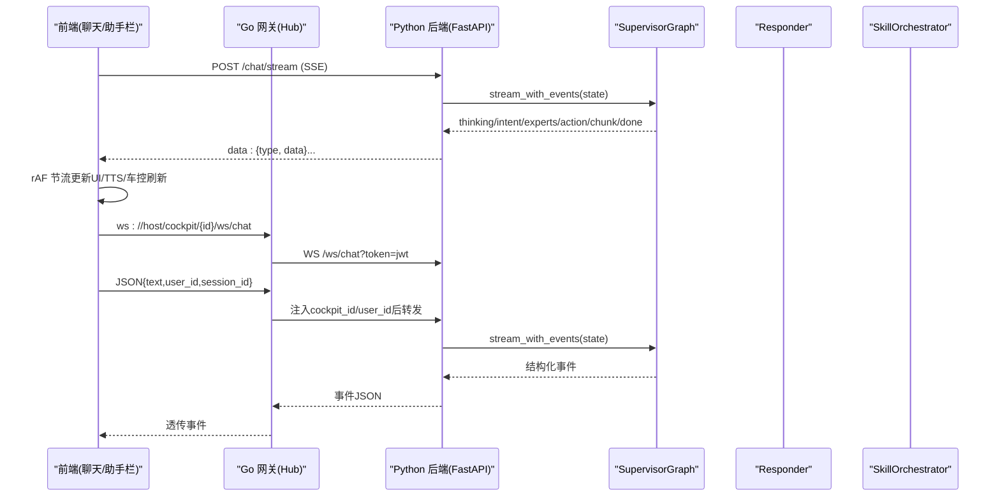
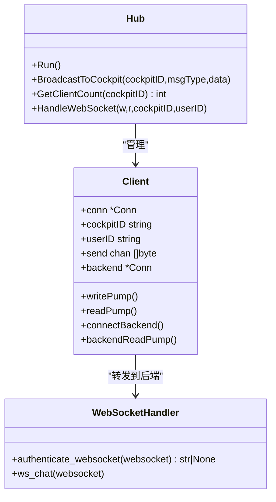
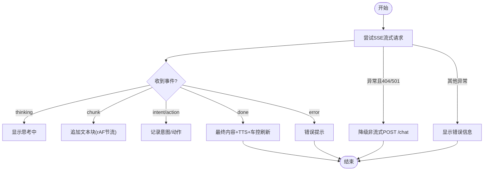
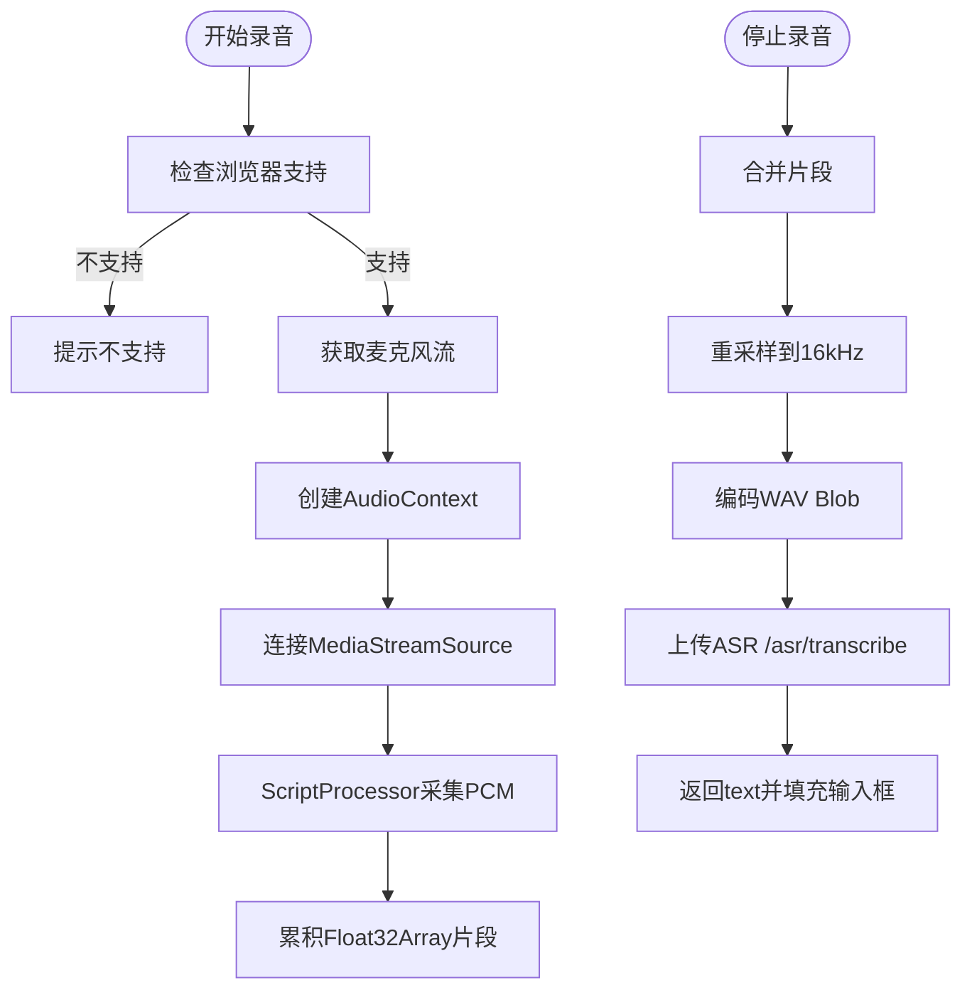
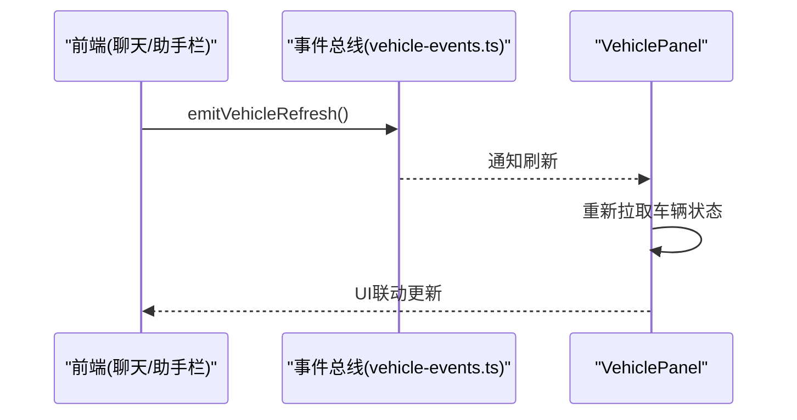
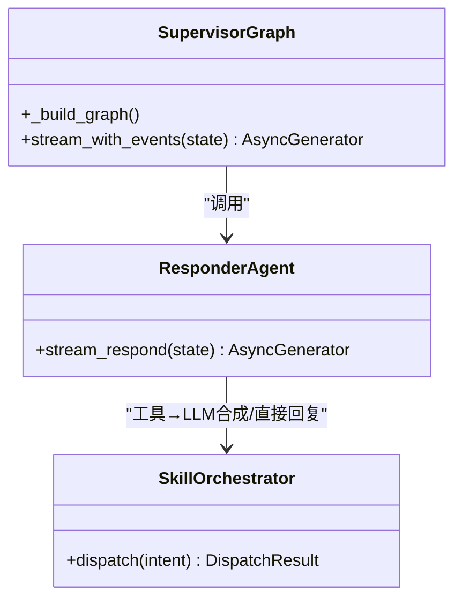
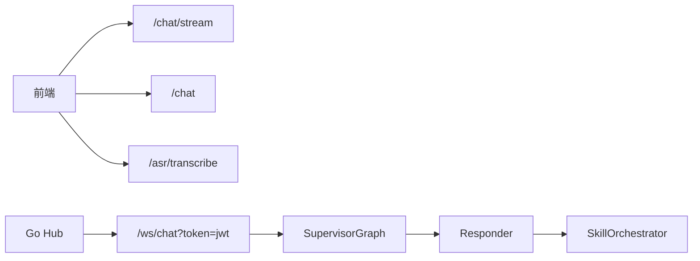

# 实时通信

<cite>
**本文引用的文件**
- [backend_design/nexus/api/websocket.py](file://backend_design/nexus/api/websocket.py)
- [backend_design/nexus_gate/internal/ws/hub.go](file://backend_design/nexus_gate/internal/ws/hub.go)
- [backend_design/nexus/api/routes/chat.py](file://backend_design/nexus/api/routes/chat.py)
- [frontend_design/src/components/chat/chat-window.tsx](file://frontend_design/src/components/chat/chat-window.tsx)
- [frontend_design/src/components/vehicle/voice-assistant-bar.tsx](file://frontend_design/src/components/vehicle/voice-assistant-bar.tsx)
- [frontend_design/src/hooks/use-audio-recorder.ts](file://frontend_design/src/hooks/use-audio-recorder.ts)
- [frontend_design/src/hooks/use-speech-recognition.ts](file://frontend_design/src/hooks/use-speech-recognition.ts)
- [frontend_design/src/lib/vehicle-events.ts](file://frontend_design/src/lib/vehicle-events.ts)
- [backend_design/nexus/agent/supervisor_graph.py](file://backend_design/nexus/agent/supervisor_graph.py)
- [backend_design/nexus/agent/responder.py](file://backend_design/nexus/agent/responder.py)
- [backend_design/nexus/skills/orchestrator.py](file://backend_design/nexus/skills/orchestrator.py)
</cite>

## 目录
1. [简介](#简介)
2. [项目结构](#项目结构)
3. [核心组件](#核心组件)
4. [架构总览](#架构总览)
5. [详细组件分析](#详细组件分析)
6. [依赖关系分析](#依赖关系分析)
7. [性能与优化](#性能与优化)
8. [故障排查指南](#故障排查指南)
9. [结论](#结论)
10. [附录](#附录)

## 简介
本技术文档聚焦 NexusCockpit 的实时通信子系统，覆盖以下关键能力：
- WebSocket 连接管理：连接建立、心跳检测、断线重连、消息队列机制
- SSE（Server-Sent Events）流式响应：事件监听、数据解析、错误处理与降级策略
- 音频录制 Hook：麦克风权限处理、音频格式转换、上传识别流程
- 语音识别 Hook：Web Speech API 使用、识别结果处理、多语言支持
- 车辆事件订阅机制：事件分发模式、状态同步策略
- 性能优化技巧、内存泄漏防护、跨浏览器兼容性方案

## 项目结构
实时通信涉及前后端多个模块：
- Go 网关层：WebSocket Hub 负责连接管理与转发
- Python 后端：FastAPI 提供 WebSocket 与 SSE 接口，Agent 工作流输出结构化事件
- 前端：聊天窗口与语音助手栏实现 SSE 消费、本地录音与 Web Speech API 集成、车控事件联动刷新

```mermaid
graph TB
subgraph "前端"
CW["聊天窗口<br/>chat-window.tsx"]
VAB["语音助手栏<br/>voice-assistant-bar.tsx"]
AR["音频录制Hook<br/>use-audio-recorder.ts"]
SR["语音识别Hook<br/>use-speech-recognition.ts"]
VE["车控事件总线<br/>vehicle-events.ts"]
end
subgraph "Go 网关"
HUB["WebSocket Hub<br/>hub.go"]
end
subgraph "Python 后端"
WS["WebSocket 接口<br/>websocket.py"]
SSE["SSE 接口<br/>routes/chat.py"]
AG["SupervisorGraph<br/>supervisor_graph.py"]
RESP["Responder<br/>responder.py"]
ORCH["技能编排器<br/>orchestrator.py"]
end
CW --> |SSE| SSE
VAB --> |SSE| SSE
CW --> |WS(可选)| HUB
VAB --> |WS(可选)| HUB
HUB --> |WS 转发| WS
SSE --> AG
WS --> AG
AG --> RESP
RESP --> ORCH
CW --> VE
VAB --> VE
```

**图表来源**
- [backend_design/nexus/api/websocket.py:70-196](file://backend_design/nexus/api/websocket.py#L70-L196)
- [backend_design/nexus_gate/internal/ws/hub.go:137-336](file://backend_design/nexus_gate/internal/ws/hub.go#L137-L336)
- [backend_design/nexus/api/routes/chat.py:296-391](file://backend_design/nexus/api/routes/chat.py#L296-L391)
- [backend_design/nexus/agent/supervisor_graph.py:127-173](file://backend_design/nexus/agent/supervisor_graph.py#L127-L173)
- [backend_design/nexus/agent/responder.py:111-140](file://backend_design/nexus/agent/responder.py#L111-L140)
- [backend_design/nexus/skills/orchestrator.py:61-131](file://backend_design/nexus/skills/orchestrator.py#L61-L131)
- [frontend_design/src/components/chat/chat-window.tsx:197-343](file://frontend_design/src/components/chat/chat-window.tsx#L197-L343)
- [frontend_design/src/components/vehicle/voice-assistant-bar.tsx:132-229](file://frontend_design/src/components/vehicle/voice-assistant-bar.tsx#L132-L229)
- [frontend_design/src/hooks/use-audio-recorder.ts:100-301](file://frontend_design/src/hooks/use-audio-recorder.ts#L100-L301)
- [frontend_design/src/hooks/use-speech-recognition.ts:19-112](file://frontend_design/src/hooks/use-speech-recognition.ts#L19-L112)
- [frontend_design/src/lib/vehicle-events.ts:1-33](file://frontend_design/src/lib/vehicle-events.ts#L1-L33)

**章节来源**
- [backend_design/nexus/api/websocket.py:1-196](file://backend_design/nexus/api/websocket.py#L1-L196)
- [backend_design/nexus_gate/internal/ws/hub.go:1-337](file://backend_design/nexus_gate/internal/ws/hub.go#L1-L337)
- [backend_design/nexus/api/routes/chat.py:1-392](file://backend_design/nexus/api/routes/chat.py#L1-L392)
- [frontend_design/src/components/chat/chat-window.tsx:1-572](file://frontend_design/src/components/chat/chat-window.tsx#L1-L572)
- [frontend_design/src/components/vehicle/voice-assistant-bar.tsx:1-430](file://frontend_design/src/components/vehicle/voice-assistant-bar.tsx#L1-L430)
- [frontend_design/src/hooks/use-audio-recorder.ts:1-302](file://frontend_design/src/hooks/use-audio-recorder.ts#L1-L302)
- [frontend_design/src/hooks/use-speech-recognition.ts:1-113](file://frontend_design/src/hooks/use-speech-recognition.ts#L1-L113)
- [frontend_design/src/lib/vehicle-events.ts:1-34](file://frontend_design/src/lib/vehicle-events.ts#L1-L34)
- [backend_design/nexus/agent/supervisor_graph.py:1-800](file://backend_design/nexus/agent/supervisor_graph.py#L1-L800)
- [backend_design/nexus/agent/responder.py:104-140](file://backend_design/nexus/agent/responder.py#L104-L140)
- [backend_design/nexus/skills/orchestrator.py:1-131](file://backend_design/nexus/skills/orchestrator.py#L1-L131)

## 核心组件
- WebSocket 服务端（Python FastAPI）：提供 /ws/chat 双向通道，JWT 认证、心跳 ping/pong、限流、会话历史加载、结构化事件流式输出
- WebSocket Hub（Go）：连接注册/注销、广播、写泵/读泵、后端转发、心跳 PingMessage、PongHandler、发送缓冲满保护
- SSE 接口（Python FastAPI）：/chat/stream 返回 text/event-stream，逐块输出结构化事件，异常时返回 error 事件
- 前端聊天窗口与语音助手栏：SSE 消费、AbortController 中断、rAF 节流渲染、TTS 朗读、车控事件触发
- 音频录制 Hook：AudioContext + ScriptProcessorNode 采集 PCM，重采样到 16kHz，编码为 WAV Blob，上传 ASR
- 语音识别 Hook：Web Speech API 封装，实时转写、错误处理、停止/重置
- 车控事件总线：emitVehicleRefresh/onVehicleRefresh 发布-订阅，驱动面板刷新

**章节来源**
- [backend_design/nexus/api/websocket.py:47-196](file://backend_design/nexus/api/websocket.py#L47-L196)
- [backend_design/nexus_gate/internal/ws/hub.go:137-336](file://backend_design/nexus_gate/internal/ws/hub.go#L137-L336)
- [backend_design/nexus/api/routes/chat.py:296-391](file://backend_design/nexus/api/routes/chat.py#L296-L391)
- [frontend_design/src/components/chat/chat-window.tsx:197-343](file://frontend_design/src/components/chat/chat-window.tsx#L197-L343)
- [frontend_design/src/components/vehicle/voice-assistant-bar.tsx:132-229](file://frontend_design/src/components/vehicle/voice-assistant-bar.tsx#L132-L229)
- [frontend_design/src/hooks/use-audio-recorder.ts:100-301](file://frontend_design/src/hooks/use-audio-recorder.ts#L100-L301)
- [frontend_design/src/hooks/use-speech-recognition.ts:19-112](file://frontend_design/src/hooks/use-speech-recognition.ts#L19-L112)
- [frontend_design/src/lib/vehicle-events.ts:1-33](file://frontend_design/src/lib/vehicle-events.ts#L1-L33)

## 架构总览
整体实时通信链路如下：
- 文本对话：前端通过 SSE 请求 /chat/stream，后端 SupervisorGraph 产出结构化事件（thinking/intent/experts/action/chunk/done/error），前端按类型更新 UI 并触发 TTS 或车控刷新
- 语音对话：前端可通过 Go 网关的 WebSocket Hub 连接到 Python /ws/chat，Hub 将客户端消息注入 cockpit_id/user_id 后转发至后端，后端以相同事件模型回传
- 音频输入：本地录音生成 WAV Blob 上传 /asr/transcribe；或使用浏览器 Web Speech API 实时转写



**图表来源**
- [backend_design/nexus/api/routes/chat.py:319-391](file://backend_design/nexus/api/routes/chat.py#L319-L391)
- [backend_design/nexus/agent/supervisor_graph.py:1216-1246](file://backend_design/nexus/agent/supervisor_graph.py#L1216-L1246)
- [backend_design/nexus/agent/responder.py:111-140](file://backend_design/nexus/agent/responder.py#L111-L140)
- [backend_design/nexus/skills/orchestrator.py:61-131](file://backend_design/nexus/skills/orchestrator.py#L61-L131)
- [backend_design/nexus/api/websocket.py:70-196](file://backend_design/nexus/api/websocket.py#L70-L196)
- [backend_design/nexus_gate/internal/ws/hub.go:137-336](file://backend_design/nexus_gate/internal/ws/hub.go#L137-L336)

## 详细组件分析

### WebSocket 连接管理（Python + Go）
- 连接建立
  - Go Hub 升级 HTTP 到 WebSocket，从 Authorization 或 query 参数提取 JWT token，尝试连接 Python /ws/chat?token=jwt
  - Python 端 authenticate_websocket 校验 token，失败则关闭连接
- 心跳检测
  - Go writePump 每 30s 发送 PingMessage；readPump 设置 PongHandler 重置读取超时
  - Python heartbeat_loop 每 30s 发送 {"type":"ping"}，客户端需回复 {"type":"pong"}
- 断线重连
  - Go readPump 在写入后端失败时自动 connectBackend() 并重试发送
  - 前端可基于 onclose/onerror 自行重连（当前示例未内置重连逻辑）
- 消息队列机制
  - Go Client.send chan 作为发送缓冲，满则关闭连接避免阻塞
  - Python 侧直接 await websocket.send_json(event)，无额外队列



**图表来源**
- [backend_design/nexus_gate/internal/ws/hub.go:38-136](file://backend_design/nexus_gate/internal/ws/hub.go#L38-L136)
- [backend_design/nexus_gate/internal/ws/hub.go:137-336](file://backend_design/nexus_gate/internal/ws/hub.go#L137-L336)
- [backend_design/nexus/api/websocket.py:47-196](file://backend_design/nexus/api/websocket.py#L47-L196)

**章节来源**
- [backend_design/nexus_gate/internal/ws/hub.go:137-336](file://backend_design/nexus_gate/internal/ws/hub.go#L137-L336)
- [backend_design/nexus/api/websocket.py:70-196](file://backend_design/nexus/api/websocket.py#L70-L196)

### SSE 流式响应（/chat/stream）
- 事件模型
  - thinking：提示“正在思考”
  - intent：意图路由结果
  - experts：分派专家列表
  - action：执行技能动作
  - chunk：流式文本块
  - done：完成事件，包含 response、latency_ms、intent、action
  - error：错误事件
- 前端消费
  - chat-window.tsx 与 voice-assistant-bar.tsx 均使用 for await 遍历事件，rAF 节流更新 UI，done 后触发 TTS 与车控刷新
- 错误处理与降级
  - 捕获 AbortError 忽略中断
  - 若后端不支持 SSE（404/501），自动降级为非流式 POST /chat
  - 鉴权失败（401）、服务异常（>=500）、网络异常分别给出用户提示



**图表来源**
- [backend_design/nexus/api/routes/chat.py:319-391](file://backend_design/nexus/api/routes/chat.py#L319-L391)
- [frontend_design/src/components/chat/chat-window.tsx:245-343](file://frontend_design/src/components/chat/chat-window.tsx#L245-L343)
- [frontend_design/src/components/vehicle/voice-assistant-bar.tsx:159-229](file://frontend_design/src/components/vehicle/voice-assistant-bar.tsx#L159-L229)

**章节来源**
- [backend_design/nexus/api/routes/chat.py:296-391](file://backend_design/nexus/api/routes/chat.py#L296-L391)
- [frontend_design/src/components/chat/chat-window.tsx:197-343](file://frontend_design/src/components/chat/chat-window.tsx#L197-L343)
- [frontend_design/src/components/vehicle/voice-assistant-bar.tsx:132-229](file://frontend_design/src/components/vehicle/voice-assistant-bar.tsx#L132-L229)

### 音频录制 Hook（use-audio-recorder）
- 权限与兼容性
  - 检查 navigator.mediaDevices 与 AudioContext/webkitAudioContext
  - 捕获 NotAllowedError/NotFoundError 并提示用户
- 数据采集与格式转换
  - 使用 ScriptProcessorNode 采集 PCM Float32Array
  - 线性插值重采样到 16kHz，转换为 16-bit PCM
  - 构建 WAV 头，生成 audio/wav Blob
- 资源清理
  - stopRecording/cancelRecording 断开节点、停止音轨、关闭 AudioContext、清除定时器
- 上传识别
  - 调用 /asr/transcribe 上传 WAV，返回 text 填充输入框



**图表来源**
- [frontend_design/src/hooks/use-audio-recorder.ts:100-301](file://frontend_design/src/hooks/use-audio-recorder.ts#L100-L301)
- [frontend_design/src/lib/api.ts:592-600](file://frontend_design/src/lib/api.ts#L592-L600)

**章节来源**
- [frontend_design/src/hooks/use-audio-recorder.ts:1-302](file://frontend_design/src/hooks/use-audio-recorder.ts#L1-L302)
- [frontend_design/src/lib/api.ts:592-600](file://frontend_design/src/lib/api.ts#L592-L600)

### 语音识别 Hook（use-speech-recognition）
- 使用 Web Speech API（SpeechRecognition/webkitSpeechRecognition）
- 配置 continuous=false、interimResults=true、lang="zh-CN"
- onresult 聚合结果，onerror 过滤 no-speech/aborted，onend 重置状态
- 提供 startListening/stopListening/resetTranscript 方法

**章节来源**
- [frontend_design/src/hooks/use-speech-recognition.ts:1-113](file://frontend_design/src/hooks/use-speech-recognition.ts#L1-L113)

### 车辆事件订阅机制
- 事件总线
  - emitVehicleRefresh：触发所有订阅者
  - onVehicleRefresh：添加监听并返回取消订阅函数
- 触发时机
  - 聊天窗口与语音助手栏在收到 done 事件后，根据 action/intent 关键字判断是否涉及车控，调用 emitVehicleRefresh
- 状态同步
  - VehiclePanel 订阅刷新事件后拉取最新车辆状态，实现 UI 联动



**图表来源**
- [frontend_design/src/lib/vehicle-events.ts:1-33](file://frontend_design/src/lib/vehicle-events.ts#L1-L33)
- [frontend_design/src/components/chat/chat-window.tsx:274-283](file://frontend_design/src/components/chat/chat-window.tsx#L274-L283)
- [frontend_design/src/components/vehicle/voice-assistant-bar.tsx:181-189](file://frontend_design/src/components/vehicle/voice-assistant-bar.tsx#L181-L189)

**章节来源**
- [frontend_design/src/lib/vehicle-events.ts:1-33](file://frontend_design/src/lib/vehicle-events.ts#L1-L33)
- [frontend_design/src/components/chat/chat-window.tsx:274-283](file://frontend_design/src/components/chat/chat-window.tsx#L274-L283)
- [frontend_design/src/components/vehicle/voice-assistant-bar.tsx:181-189](file://frontend_design/src/components/vehicle/voice-assistant-bar.tsx#L181-L189)

### Agent 工作流与事件模型
- SupervisorGraph 定义图结构：supervisor → dispatch → responder → reflection → reviewer → END
- stream_with_events 输出结构化事件：thinking/intent/experts/action/chunk/done
- Responder 分支处理：澄清、工具合成、LLM 闲聊兜底
- SkillOrchestrator 根据意图分发到具体技能（车控/导航/搜索/点餐/声纹注册）



**图表来源**
- [backend_design/nexus/agent/supervisor_graph.py:127-173](file://backend_design/nexus/agent/supervisor_graph.py#L127-L173)
- [backend_design/nexus/agent/responder.py:111-140](file://backend_design/nexus/agent/responder.py#L111-L140)
- [backend_design/nexus/skills/orchestrator.py:61-131](file://backend_design/nexus/skills/orchestrator.py#L61-L131)

**章节来源**
- [backend_design/nexus/agent/supervisor_graph.py:1216-1246](file://backend_design/nexus/agent/supervisor_graph.py#L1216-L1246)
- [backend_design/nexus/agent/responder.py:104-140](file://backend_design/nexus/agent/responder.py#L104-L140)
- [backend_design/nexus/skills/orchestrator.py:1-131](file://backend_design/nexus/skills/orchestrator.py#L1-L131)

## 依赖关系分析
- 前端对后端依赖
  - SSE：/chat/stream（结构化事件）
  - REST：/chat（非流式降级）
  - ASR：/asr/transcribe（multipart/form-data）
- 网关与后端依赖
  - Go Hub 通过 WS 连接 Python /ws/chat?token=jwt
  - 消息注入 cockpit_id/user_id 后转发
- Agent 内部依赖
  - SupervisorGraph 依赖 IntentRouterService、MemoryManager、SkillRegistry、LLM 客户端
  - Responder 依赖 LLM 客户端进行流式生成
  - SkillOrchestrator 依赖 SkillRegistry 执行具体工具



**图表来源**
- [backend_design/nexus/api/routes/chat.py:296-391](file://backend_design/nexus/api/routes/chat.py#L296-L391)
- [backend_design/nexus/api/websocket.py:70-196](file://backend_design/nexus/api/websocket.py#L70-L196)
- [backend_design/nexus_gate/internal/ws/hub.go:137-336](file://backend_design/nexus_gate/internal/ws/hub.go#L137-L336)
- [backend_design/nexus/agent/supervisor_graph.py:127-173](file://backend_design/nexus/agent/supervisor_graph.py#L127-L173)
- [backend_design/nexus/agent/responder.py:111-140](file://backend_design/nexus/agent/responder.py#L111-L140)
- [backend_design/nexus/skills/orchestrator.py:61-131](file://backend_design/nexus/skills/orchestrator.py#L61-L131)

**章节来源**
- [backend_design/nexus/api/routes/chat.py:1-392](file://backend_design/nexus/api/routes/chat.py#L1-L392)
- [backend_design/nexus/api/websocket.py:1-196](file://backend_design/nexus/api/websocket.py#L1-L196)
- [backend_design/nexus_gate/internal/ws/hub.go:1-337](file://backend_design/nexus_gate/internal/ws/hub.go#L1-L337)
- [backend_design/nexus/agent/supervisor_graph.py:1-800](file://backend_design/nexus/agent/supervisor_graph.py#L1-L800)
- [backend_design/nexus/agent/responder.py:104-140](file://backend_design/nexus/agent/responder.py#L104-L140)
- [backend_design/nexus/skills/orchestrator.py:1-131](file://backend_design/nexus/skills/orchestrator.py#L1-L131)

## 性能与优化
- 前端渲染优化
  - rAF 节流：将高频 chunk 合并为一次渲染，保持 60fps
  - useRef 缓存流式内容，避免每次 setState 导致全量重渲染
- 并发控制
  - AbortController 中断旧请求，新请求无需等待
  - 同一 session 并发锁防止历史交叉污染（后端）
- 内存泄漏防护
  - 清理 MediaStream 轨道、断开 AudioContext、关闭处理器节点
  - 清理定时器、释放引用
- 跨浏览器兼容
  - 检测 SpeechRecognition/webkitSpeechRecognition
  - 检测 AudioContext/webkitAudioContext 与 mediaDevices
- 传输优化
  - Go Hub 发送缓冲满时关闭连接，避免阻塞
  - SSE 设置 no-cache、keep-alive、X-Accel-Buffering=no

[本节为通用指导，不直接分析具体文件]

## 故障排查指南
- WebSocket 连接失败
  - 检查 JWT token 是否正确传递（Authorization 或 query 参数）
  - 查看 Go Hub 日志中的 upgrade/connect 错误
- 心跳超时
  - 确认客户端是否回复 pong（Python 侧）或浏览器是否响应 PingMessage（Go 侧）
- SSE 流中断
  - 捕获 AbortError 忽略中断
  - 若 404/501 自动降级非流式请求
- 语音识别错误
  - 浏览器不支持：提示使用 Chrome
  - 权限拒绝：引导用户开启麦克风权限
- 车控刷新无效
  - 检查 done 事件中 action/intent 是否命中关键字
  - 确认 VehiclePanel 已订阅 onVehicleRefresh

**章节来源**
- [backend_design/nexus/api/websocket.py:70-196](file://backend_design/nexus/api/websocket.py#L70-L196)
- [backend_design/nexus_gate/internal/ws/hub.go:137-336](file://backend_design/nexus_gate/internal/ws/hub.go#L137-L336)
- [frontend_design/src/components/chat/chat-window.tsx:292-343](file://frontend_design/src/components/chat/chat-window.tsx#L292-L343)
- [frontend_design/src/hooks/use-speech-recognition.ts:53-74](file://frontend_design/src/hooks/use-speech-recognition.ts#L53-L74)
- [frontend_design/src/hooks/use-audio-recorder.ts:181-190](file://frontend_design/src/hooks/use-audio-recorder.ts#L181-L190)

## 结论
NexusCockpit 的实时通信体系以 SSE 为主、WebSocket 为辅，结合 Go 高并发网关与 Python 异步后端，实现了低延迟、可扩展的车载语音交互体验。前端通过 rAF 节流与 AbortController 保障流畅性与可控性，音频录制与 Web Speech API 双路径满足多样化输入需求，车控事件总线确保 UI 状态一致。整体设计兼顾性能、可靠性与可观测性，适合车载场景的高可用要求。

[本节为总结，不直接分析具体文件]

## 附录
- 事件格式参考
  - thinking/intent/experts/action/chunk/done/error/ping/pong
- 关键路径
  - SSE：/chat/stream
  - WebSocket：/ws/chat?token=jwt
  - ASR：/asr/transcribe

[本节为补充说明，不直接分析具体文件]