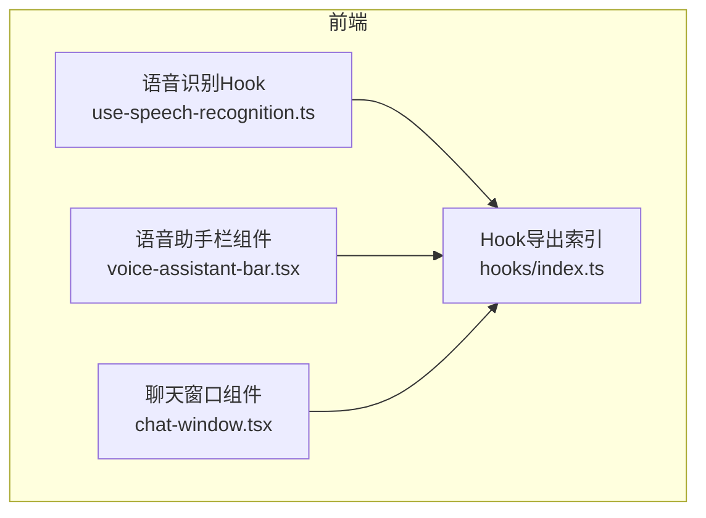
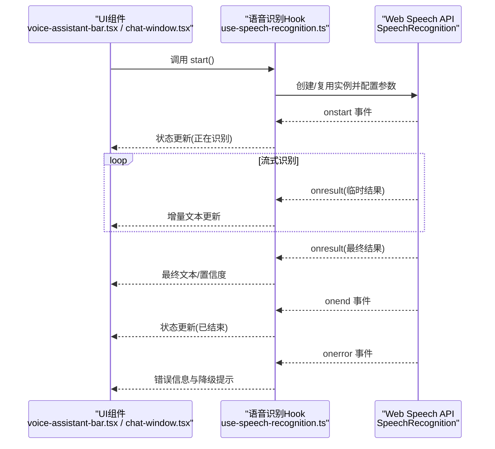
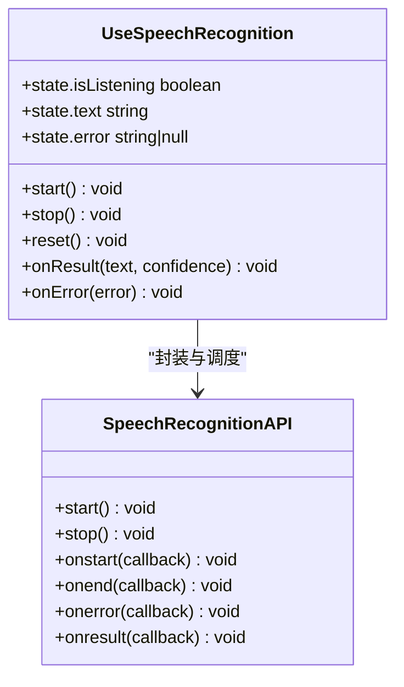
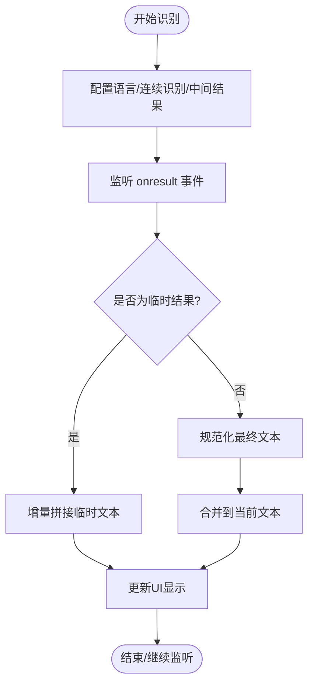
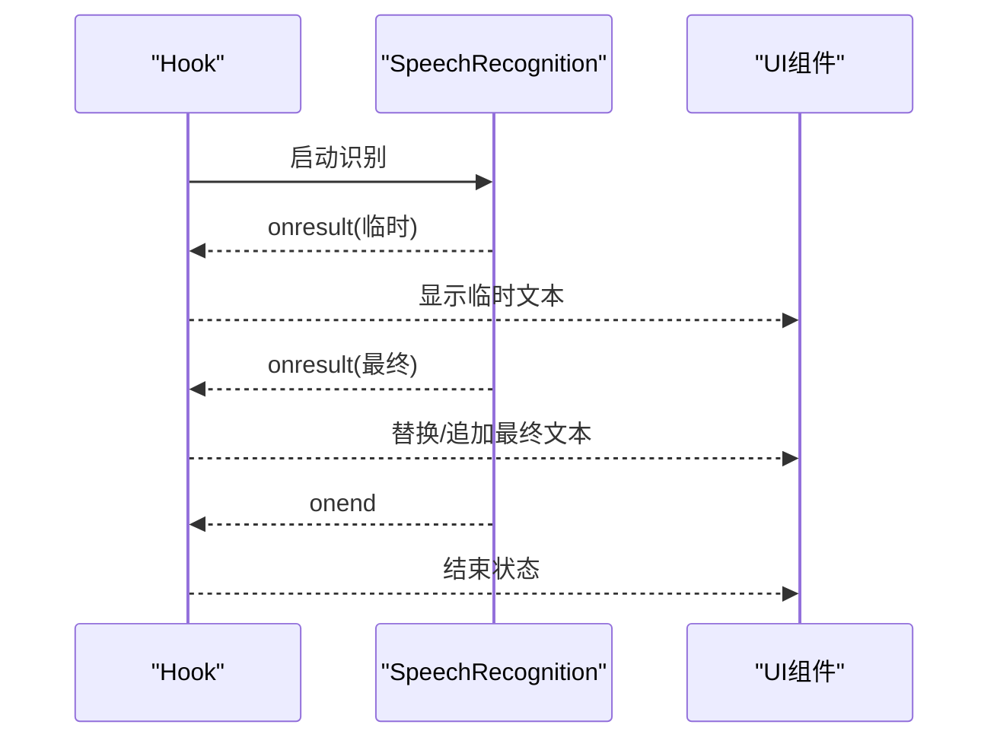
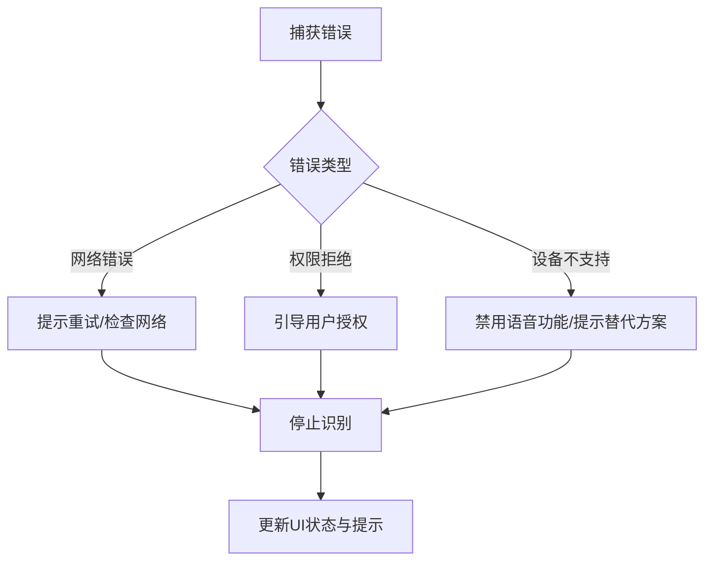
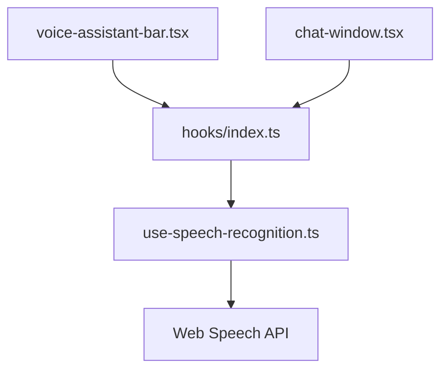

# 语音识别Hook

<cite>
**本文引用的文件**   
- [use-speech-recognition.ts](file://frontend_design/src/hooks/use-speech-recognition.ts)
- [index.ts](file://frontend_design/src/hooks/index.ts)
- [voice-assistant-bar.tsx](file://frontend_design/src/components/vehicle/voice-assistant-bar.tsx)
- [chat-window.tsx](file://frontend_design/src/components/chat/chat-window.tsx)
</cite>

## 目录
1. [简介](#简介)
2. [项目结构](#项目结构)
3. [核心组件](#核心组件)
4. [架构总览](#架构总览)
5. [详细组件分析](#详细组件分析)
6. [依赖分析](#依赖分析)
7. [性能考虑](#性能考虑)
8. [故障排查指南](#故障排查指南)
9. [结论](#结论)
10. [附录](#附录)

## 简介
本技术文档聚焦于前端语音识别 Hook 的实现与使用，围绕 Web Speech API 的集成展开，涵盖以下主题：
- SpeechRecognition 对象创建、事件监听与配置参数设置
- 识别结果处理流程：临时结果、最终结果、置信度评分、多语言支持
- 实时语音转文字：流式识别、增量更新、结果合并策略
- 错误处理机制：网络错误、权限拒绝、设备不支持的降级方案
- 性能优化：识别引擎选择、缓存策略、内存控制
- 多浏览器兼容性、移动端适配与用户体验优化建议

## 项目结构
本项目为前后端分离架构，语音识别 Hook 位于前端设计目录下的 hooks 模块中，并在 UI 组件中被消费。关键路径如下：
- 语音识别 Hook：frontend_design/src/hooks/use-speech-recognition.ts
- Hook 导出索引：frontend_design/src/hooks/index.ts
- 语音助手栏（示例消费方）：frontend_design/src/components/vehicle/voice-assistant-bar.tsx
- 聊天窗口（示例消费方）：frontend_design/src/components/chat/chat-window.tsx

图表来源
- [use-speech-recognition.ts](file://frontend_design/src/hooks/use-speech-recognition.ts)
- [index.ts](file://frontend_design/src/hooks/index.ts)
- [voice-assistant-bar.tsx](file://frontend_design/src/components/vehicle/voice-assistant-bar.tsx)
- [chat-window.tsx](file://frontend_design/src/components/chat/chat-window.tsx)

章节来源
- [use-speech-recognition.ts](file://frontend_design/src/hooks/use-speech-recognition.ts)
- [index.ts](file://frontend_design/src/hooks/index.ts)
- [voice-assistant-bar.tsx](file://frontend_design/src/components/vehicle/voice-assistant-bar.tsx)
- [chat-window.tsx](file://frontend_design/src/components/chat/chat-window.tsx)

## 核心组件
- 语音识别 Hook（use-speech-recognition）
  - 职责：封装 Web Speech API 的 SpeechRecognition 生命周期管理，提供统一的启动/停止、状态与结果回调接口，屏蔽浏览器差异与错误处理细节。
  - 主要能力：
    - 创建并维护 SpeechRecognition 实例
    - 配置语言、连续识别、中间结果等参数
    - 监听开始、结束、错误、结果事件
    - 聚合临时结果与最终结果，输出稳定文本
    - 暴露状态（如是否正在识别、当前文本、错误信息）
- Hook 导出索引（hooks/index.ts）
  - 职责：统一导出 Hook，便于上层组件按需引入。
- 语音助手栏（voice-assistant-bar.tsx）
  - 职责：作为典型消费方，展示识别状态、实时文本、错误提示，并提供交互按钮触发识别。
- 聊天窗口（chat-window.tsx）
  - 职责：在对话场景中消费识别结果，将最终文本插入消息列表或提交到后端。

章节来源
- [use-speech-recognition.ts](file://frontend_design/src/hooks/use-speech-recognition.ts)
- [index.ts](file://frontend_design/src/hooks/index.ts)
- [voice-assistant-bar.tsx](file://frontend_design/src/components/vehicle/voice-assistant-bar.tsx)
- [chat-window.tsx](file://frontend_design/src/components/chat/chat-window.tsx)

## 架构总览
下图展示了语音识别 Hook 与 UI 组件之间的交互关系以及数据流向。

图表来源
- [use-speech-recognition.ts](file://frontend_design/src/hooks/use-speech-recognition.ts)
- [voice-assistant-bar.tsx](file://frontend_design/src/components/vehicle/voice-assistant-bar.tsx)
- [chat-window.tsx](file://frontend_design/src/components/chat/chat-window.tsx)

## 详细组件分析

### 语音识别 Hook 分析
该 Hook 负责封装 Web Speech API 的核心逻辑，包括：
- 实例化与配置
  - 根据浏览器环境选择可用的 SpeechRecognition 实现
  - 设置语言、连续识别、中间结果等参数
- 事件监听与状态管理
  - 监听开始、结束、错误、结果事件
  - 维护“是否正在识别”、“当前文本”、“错误信息”等状态
- 结果处理与合并
  - 区分临时结果与最终结果
  - 对临时结果进行增量拼接，避免重复与抖动
  - 对最终结果进行去重与规范化
- 错误处理与降级
  - 捕获网络错误、权限拒绝、设备不支持等异常
  - 提供降级提示与回退路径（如禁用语音输入、引导用户授权）

图表来源
- [use-speech-recognition.ts](file://frontend_design/src/hooks/use-speech-recognition.ts)

章节来源
- [use-speech-recognition.ts](file://frontend_design/src/hooks/use-speech-recognition.ts)

### 结果处理流程（临时结果、最终结果、置信度、多语言）
- 临时结果（interim results）
  - 用于实时更新，提升交互体验
  - 采用增量拼接策略，避免重复片段与乱序
- 最终结果（final results）
  - 代表一次完整句段的识别结果
  - 用于替换或追加到当前文本，并进行规范化（去除多余空格、标点校正等）
- 置信度评分
  - 若返回置信度，可用于过滤低质量结果或提示用户复述
- 多语言支持
  - 通过配置语言代码切换识别语言
  - 针对混合语言场景，可结合业务规则进行后处理

图表来源
- [use-speech-recognition.ts](file://frontend_design/src/hooks/use-speech-recognition.ts)

章节来源
- [use-speech-recognition.ts](file://frontend_design/src/hooks/use-speech-recognition.ts)

### 实时语音转文字（流式识别、增量更新、结果合并）
- 流式识别
  - 启用连续识别与中间结果，降低延迟
- 增量更新
  - 对临时结果进行去重与顺序校验，避免抖动
- 结果合并
  - 当收到最终结果时，以最终结果为准覆盖或追加临时文本
  - 对多次最终结果进行合并与去重，保证文本一致性

图表来源
- [use-speech-recognition.ts](file://frontend_design/src/hooks/use-speech-recognition.ts)
- [voice-assistant-bar.tsx](file://frontend_design/src/components/vehicle/voice-assistant-bar.tsx)
- [chat-window.tsx](file://frontend_design/src/components/chat/chat-window.tsx)

章节来源
- [use-speech-recognition.ts](file://frontend_design/src/hooks/use-speech-recognition.ts)
- [voice-assistant-bar.tsx](file://frontend_design/src/components/vehicle/voice-assistant-bar.tsx)
- [chat-window.tsx](file://frontend_design/src/components/chat/chat-window.tsx)

### 错误处理机制与降级方案
- 常见错误类型
  - 网络错误：无法连接识别服务
  - 权限拒绝：麦克风访问被拒绝或未授权
  - 设备不支持：浏览器未实现 SpeechRecognition
- 处理策略
  - 捕获错误并转换为友好提示
  - 自动停止识别，释放资源
  - 提供降级路径：禁用语音输入、引导用户开启权限、切换到文本输入
- 用户体验优化
  - 首次使用时明确说明需要麦克风权限
  - 错误状态下提供重试与帮助入口

图表来源
- [use-speech-recognition.ts](file://frontend_design/src/hooks/use-speech-recognition.ts)

章节来源
- [use-speech-recognition.ts](file://frontend_design/src/hooks/use-speech-recognition.ts)

### 多浏览器兼容性与移动端适配
- 兼容性
  - 检测浏览器是否支持 SpeechRecognition
  - 针对不同前缀实现做兼容处理
- 移动端适配
  - 注意移动端权限弹窗时机与用户交互要求
  - 在页面可见性变化时暂停/恢复识别，减少后台消耗
- 用户体验
  - 提供清晰的开始/停止按钮与状态反馈
  - 在弱网环境下给出提示与降级选项

章节来源
- [use-speech-recognition.ts](file://frontend_design/src/hooks/use-speech-recognition.ts)
- [voice-assistant-bar.tsx](file://frontend_design/src/components/vehicle/voice-assistant-bar.tsx)
- [chat-window.tsx](file://frontend_design/src/components/chat/chat-window.tsx)

## 依赖分析
- 内部依赖
  - Hook 由 UI 组件通过索引文件导入并使用
- 外部依赖
  - 依赖浏览器提供的 Web Speech API（SpeechRecognition）
- 耦合与内聚
  - Hook 高内聚地封装了识别逻辑，UI 组件仅关注状态展示与交互，耦合度较低

图表来源
- [index.ts](file://frontend_design/src/hooks/index.ts)
- [use-speech-recognition.ts](file://frontend_design/src/hooks/use-speech-recognition.ts)
- [voice-assistant-bar.tsx](file://frontend_design/src/components/vehicle/voice-assistant-bar.tsx)
- [chat-window.tsx](file://frontend_design/src/components/chat/chat-window.tsx)

章节来源
- [index.ts](file://frontend_design/src/hooks/index.ts)
- [use-speech-recognition.ts](file://frontend_design/src/hooks/use-speech-recognition.ts)
- [voice-assistant-bar.tsx](file://frontend_design/src/components/vehicle/voice-assistant-bar.tsx)
- [chat-window.tsx](file://frontend_design/src/components/chat/chat-window.tsx)

## 性能考虑
- 识别引擎选择
  - 优先使用浏览器默认引擎；必要时根据语言与平台特性选择更合适的实现
- 缓存策略
  - 对常用短语或历史结果进行轻量缓存，减少重复识别开销
- 内存控制
  - 及时释放 SpeechRecognition 实例与事件监听器
  - 限制临时文本长度，避免长时间运行导致内存增长
- 节流与防抖
  - 对高频的 onresult 事件进行节流，降低 UI 渲染压力
- 资源回收
  - 在页面卸载或组件销毁时确保停止识别并清理资源

[本节为通用性能指导，不直接分析具体文件]

## 故障排查指南
- 常见问题定位
  - 无法开始识别：检查浏览器支持与权限状态
  - 无结果或结果不稳定：确认网络状况与语言配置
  - 内存占用过高：检查是否存在未释放的事件监听或过长文本累积
- 调试建议
  - 在 onerror 事件中记录错误码与上下文信息
  - 在 onresult 中打印临时与最终结果的差异，辅助定位合并问题
- 回退方案
  - 当识别不可用时，自动切换到文本输入模式
  - 提供手动重试与帮助链接

章节来源
- [use-speech-recognition.ts](file://frontend_design/src/hooks/use-speech-recognition.ts)

## 结论
本 Hook 通过封装 Web Speech API，提供了稳定的语音识别能力与良好的用户体验。其模块化设计与完善的错误处理、性能优化策略，使其能够在多浏览器与移动设备上可靠运行。建议在业务中结合具体场景进一步细化语言配置、结果后处理与监控指标，以获得更佳的效果。

[本节为总结性内容，不直接分析具体文件]

## 附录
- 使用建议
  - 在用户首次进入语音功能时，明确说明权限需求
  - 在弱网或高延迟环境下，提供明确的进度提示与降级选项
  - 对长对话场景，定期清理历史文本与缓存，控制内存占用

[本节为补充建议，不直接分析具体文件]