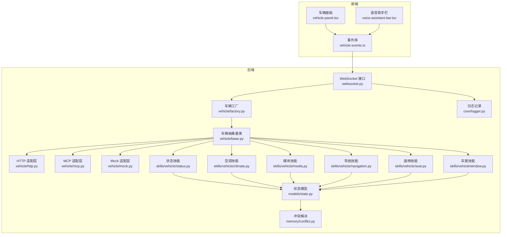
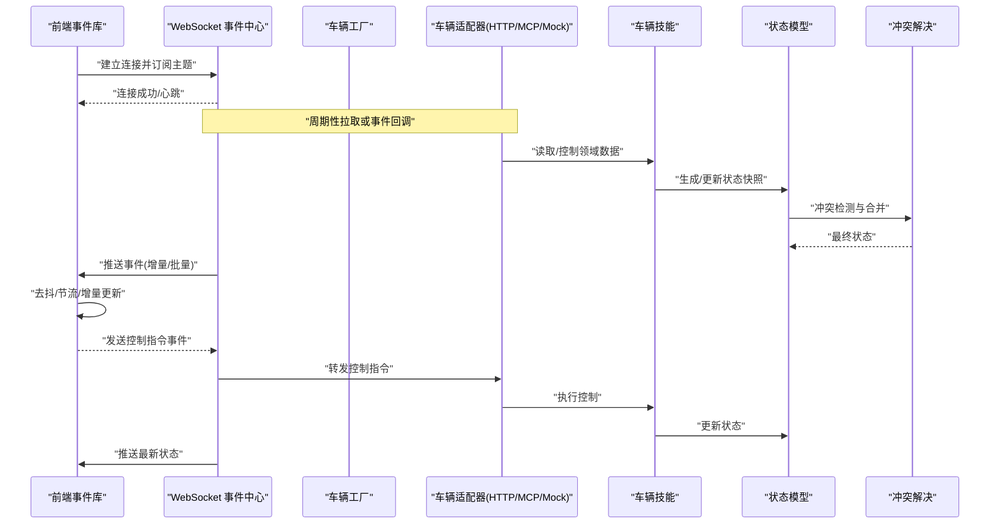
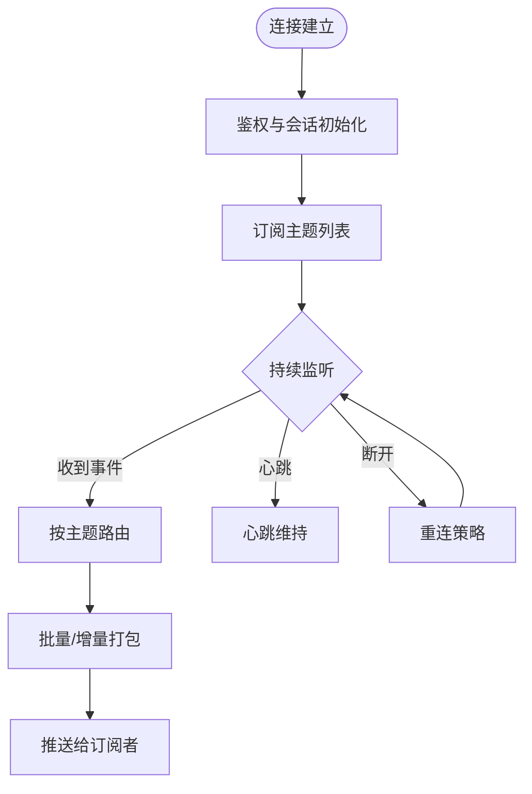
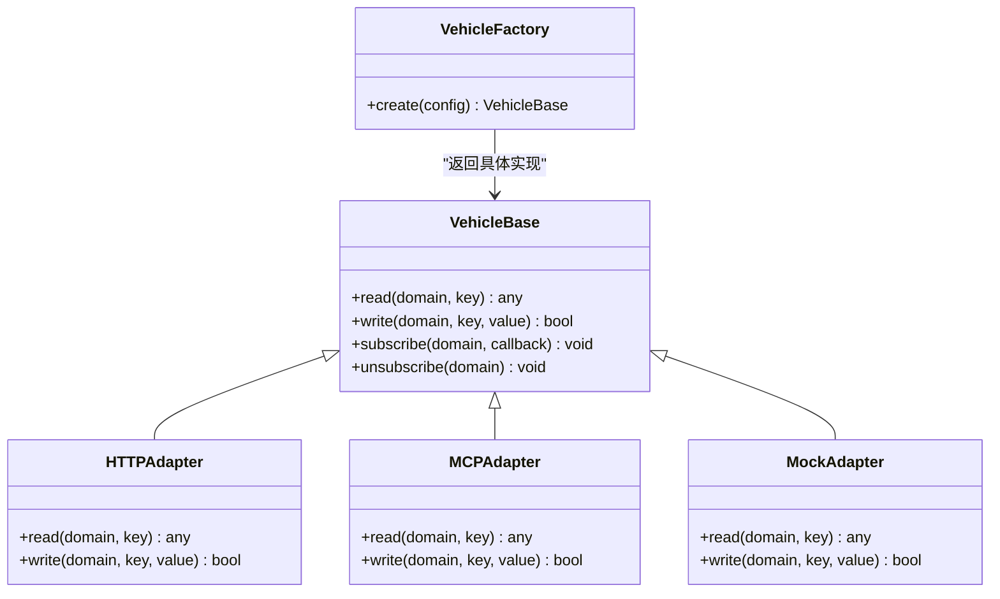
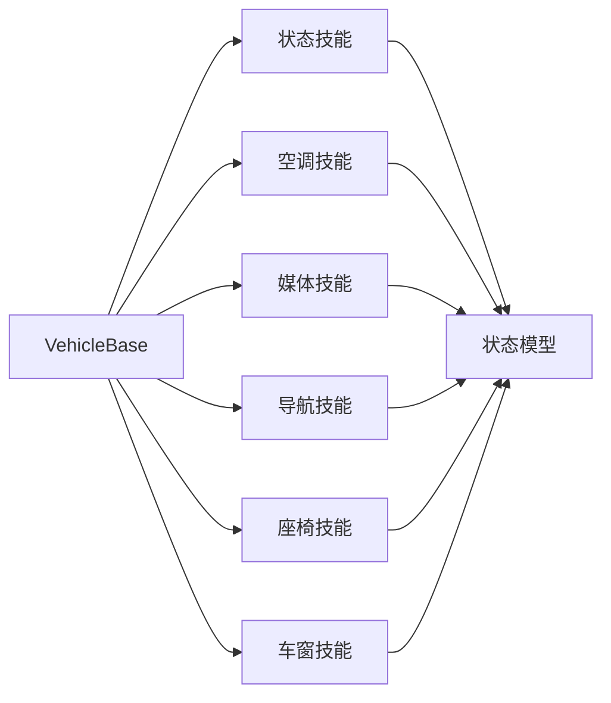
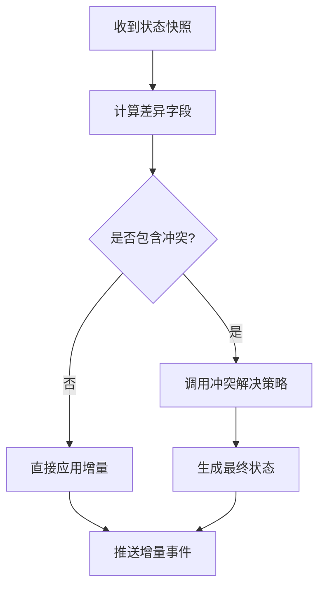
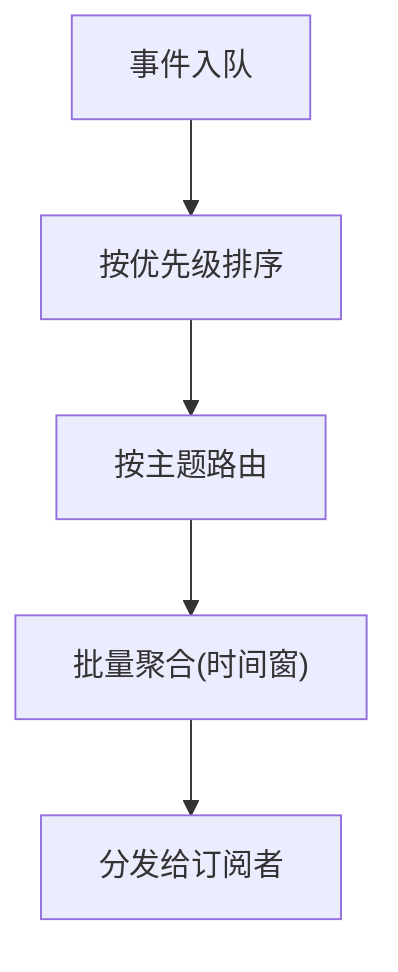
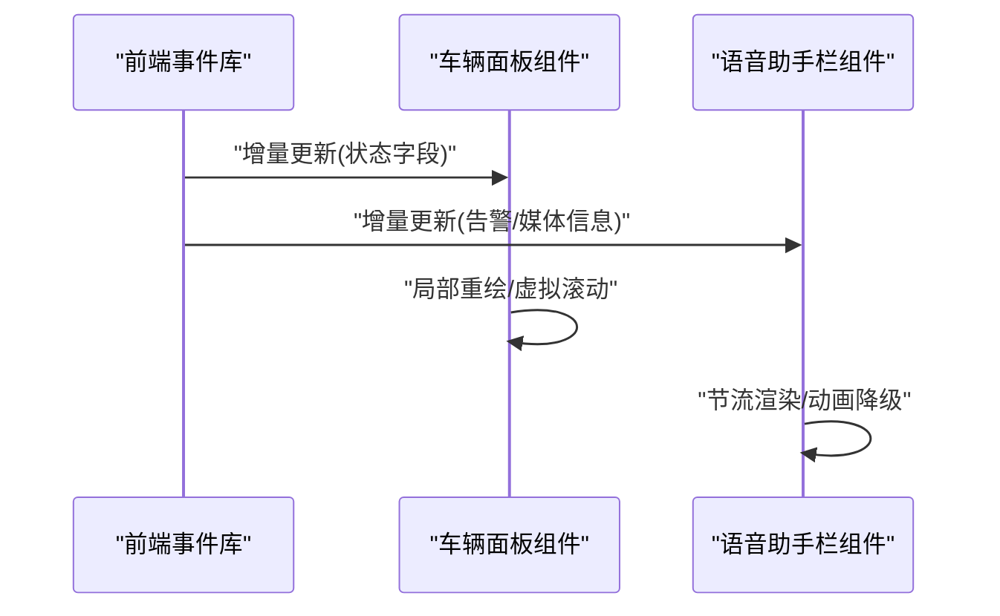
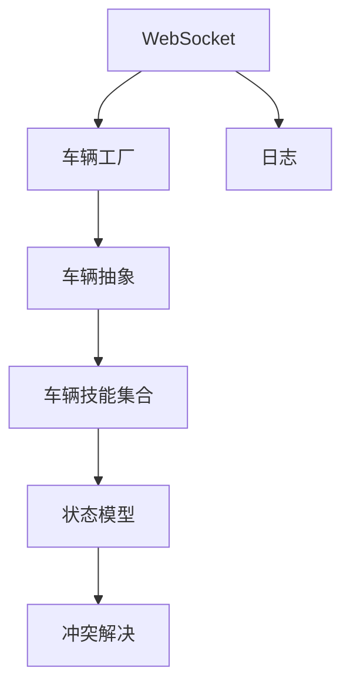

# 车辆事件订阅

<cite>
**本文引用的文件**   
- [backend_design/nexus/api/websocket.py](file://backend_design/nexus/api/websocket.py)
- [backend_design/nexus/vehicle/base.py](file://backend_design/nexus/vehicle/base.py)
- [backend_design/nexus/vehicle/factory.py](file://backend_design/nexus/vehicle/factory.py)
- [backend_design/nexus/vehicle/http.py](file://backend_design/nexus/vehicle/http.py)
- [backend_design/nexus/vehicle/mcp.py](file://backend_design/nexus/vehicle/mcp.py)
- [backend_design/nexus/vehicle/mock.py](file://backend_design/nexus/vehicle/mock.py)
- [backend_design/nexus/skills/vehicle/status.py](file://backend_design/nexus/skills/vehicle/status.py)
- [backend_design/nexus/skills/vehicle/climate.py](file://backend_design/nexus/skills/vehicle/climate.py)
- [backend_design/nexus/skills/vehicle/media.py](file://backend_design/nexus/skills/vehicle/media.py)
- [backend_design/nexus/skills/vehicle/navigation.py](file://backend_design/nexus/skills/vehicle/navigation.py)
- [backend_design/nexus/skills/vehicle/seat.py](file://backend_design/nexus/skills/vehicle/seat.py)
- [backend_design/nexus/skills/vehicle/window.py](file://backend_design/nexus/skills/vehicle/window.py)
- [backend_design/nexus/models/state.py](file://backend_design/nexus/models/state.py)
- [backend_design/nexus/memory/conflict.py](file://backend_design/nexus/memory/conflict.py)
- [backend_design/nexus/core/logger.py](file://backend_design/nexus/core/logger.py)
- [frontend_design/src/lib/vehicle-events.ts](file://frontend_design/src/lib/vehicle-events.ts)
- [frontend_design/src/components/vehicle/vehicle-panel.tsx](file://frontend_design/src/components/vehicle/vehicle-panel.tsx)
- [frontend_design/src/components/vehicle/voice-assistant-bar.tsx](file://frontend_design/src/components/vehicle/voice-assistant-bar.tsx)
</cite>

## 目录
1. [简介](#简介)
2. [项目结构](#项目结构)
3. [核心组件](#核心组件)
4. [架构总览](#架构总览)
5. [详细组件分析](#详细组件分析)
6. [依赖关系分析](#依赖关系分析)
7. [性能考虑](#性能考虑)
8. [故障排查指南](#故障排查指南)
9. [结论](#结论)
10. [附录](#附录)

## 简介
本技术文档围绕“车辆事件订阅系统”展开，聚焦于事件发布/订阅模式在车机与后端服务之间的落地实现。内容涵盖：
- 事件中心设计、订阅者管理、发布者注册
- 车辆状态同步机制（变更检测、增量更新、冲突解决）
- 事件分发策略（路由、优先级、批量更新）
- 实时状态更新的UI渲染（组件状态同步、性能优化、防抖节流）
- 事件类型定义（车辆状态事件、控制指令事件、告警通知事件）
- 扩展机制、错误处理策略、调试工具使用方法

## 项目结构
本项目采用前后端分离架构，后端以Python为主，提供WebSocket能力与车辆技能模块；前端基于Next.js，通过事件库与组件进行状态同步与渲染。

图表来源
- [backend_design/nexus/api/websocket.py](file://backend_design/nexus/api/websocket.py)
- [backend_design/nexus/vehicle/base.py](file://backend_design/nexus/vehicle/base.py)
- [backend_design/nexus/vehicle/factory.py](file://backend_design/nexus/vehicle/factory.py)
- [backend_design/nexus/vehicle/http.py](file://backend_design/nexus/vehicle/http.py)
- [backend_design/nexus/vehicle/mcp.py](file://backend_design/nexus/vehicle/mcp.py)
- [backend_design/nexus/vehicle/mock.py](file://backend_design/nexus/vehicle/mock.py)
- [backend_design/nexus/skills/vehicle/status.py](file://backend_design/nexus/skills/vehicle/status.py)
- [backend_design/nexus/skills/vehicle/climate.py](file://backend_design/nexus/skills/vehicle/climate.py)
- [backend_design/nexus/skills/vehicle/media.py](file://backend_design/nexus/skills/vehicle/media.py)
- [backend_design/nexus/skills/vehicle/navigation.py](file://backend_design/nexus/skills/vehicle/navigation.py)
- [backend_design/nexus/skills/vehicle/seat.py](file://backend_design/nexus/skills/vehicle/seat.py)
- [backend_design/nexus/skills/vehicle/window.py](file://backend_design/nexus/skills/vehicle/window.py)
- [backend_design/nexus/models/state.py](file://backend_design/nexus/models/state.py)
- [backend_design/nexus/memory/conflict.py](file://backend_design/nexus/memory/conflict.py)
- [backend_design/nexus/core/logger.py](file://backend_design/nexus/core/logger.py)
- [frontend_design/src/lib/vehicle-events.ts](file://frontend_design/src/lib/vehicle-events.ts)
- [frontend_design/src/components/vehicle/vehicle-panel.tsx](file://frontend_design/src/components/vehicle/vehicle-panel.tsx)
- [frontend_design/src/components/vehicle/voice-assistant-bar.tsx](file://frontend_design/src/components/vehicle/voice-assistant-bar.tsx)

章节来源
- [backend_design/nexus/api/websocket.py](file://backend_design/nexus/api/websocket.py)
- [backend_design/nexus/vehicle/base.py](file://backend_design/nexus/vehicle/base.py)
- [backend_design/nexus/vehicle/factory.py](file://backend_design/nexus/vehicle/factory.py)
- [backend_design/nexus/vehicle/http.py](file://backend_design/nexus/vehicle/http.py)
- [backend_design/nexus/vehicle/mcp.py](file://backend_design/nexus/vehicle/mcp.py)
- [backend_design/nexus/vehicle/mock.py](file://backend_design/nexus/vehicle/mock.py)
- [backend_design/nexus/skills/vehicle/status.py](file://backend_design/nexus/skills/vehicle/status.py)
- [backend_design/nexus/skills/vehicle/climate.py](file://backend_design/nexus/skills/vehicle/climate.py)
- [backend_design/nexus/skills/vehicle/media.py](file://backend_design/nexus/skills/vehicle/media.py)
- [backend_design/nexus/skills/vehicle/navigation.py](file://backend_design/nexus/skills/vehicle/navigation.py)
- [backend_design/nexus/skills/vehicle/seat.py](file://backend_design/nexus/skills/vehicle/seat.py)
- [backend_design/nexus/skills/vehicle/window.py](file://backend_design/nexus/skills/vehicle/window.py)
- [backend_design/nexus/models/state.py](file://backend_design/nexus/models/state.py)
- [backend_design/nexus/memory/conflict.py](file://backend_design/nexus/memory/conflict.py)
- [backend_design/nexus/core/logger.py](file://backend_design/nexus/core/logger.py)
- [frontend_design/src/lib/vehicle-events.ts](file://frontend_design/src/lib/vehicle-events.ts)
- [frontend_design/src/components/vehicle/vehicle-panel.tsx](file://frontend_design/src/components/vehicle/vehicle-panel.tsx)
- [frontend_design/src/components/vehicle/voice-assistant-bar.tsx](file://frontend_design/src/components/vehicle/voice-assistant-bar.tsx)

## 核心组件
- 事件中心（WebSocket）
  - 负责建立连接、鉴权与会话上下文、订阅主题、广播消息、心跳保活、断线重连提示等。
  - 作为事件总线承载所有车辆相关事件的发布与分发。
- 车辆抽象与适配层
  - 统一抽象出车辆能力接口，屏蔽底层差异（HTTP/MCP/Mock）。
  - 工厂根据配置选择具体适配器实例。
- 车辆技能（Skills）
  - 按领域拆分：状态、空调、媒体、导航、座椅、车窗等。
  - 每个技能负责读取/写入对应领域的数据，并触发事件。
- 状态模型与冲突解决
  - 定义统一的车辆状态数据结构。
  - 提供冲突检测与合并策略，保证多源数据一致性。
- 前端事件库与组件
  - 封装WebSocket连接、事件订阅、去抖节流、增量更新。
  - 组件消费事件，驱动UI渲染。

章节来源
- [backend_design/nexus/api/websocket.py](file://backend_design/nexus/api/websocket.py)
- [backend_design/nexus/vehicle/base.py](file://backend_design/nexus/vehicle/base.py)
- [backend_design/nexus/vehicle/factory.py](file://backend_design/nexus/vehicle/factory.py)
- [backend_design/nexus/vehicle/http.py](file://backend_design/nexus/vehicle/http.py)
- [backend_design/nexus/vehicle/mcp.py](file://backend_design/nexus/vehicle/mcp.py)
- [backend_design/nexus/vehicle/mock.py](file://backend_design/nexus/vehicle/mock.py)
- [backend_design/nexus/skills/vehicle/status.py](file://backend_design/nexus/skills/vehicle/status.py)
- [backend_design/nexus/skills/vehicle/climate.py](file://backend_design/nexus/skills/vehicle/climate.py)
- [backend_design/nexus/skills/vehicle/media.py](file://backend_design/nexus/skills/vehicle/media.py)
- [backend_design/nexus/skills/vehicle/navigation.py](file://backend_design/nexus/skills/vehicle/navigation.py)
- [backend_design/nexus/skills/vehicle/seat.py](file://backend_design/nexus/skills/vehicle/seat.py)
- [backend_design/nexus/skills/vehicle/window.py](file://backend_design/nexus/skills/vehicle/window.py)
- [backend_design/nexus/models/state.py](file://backend_design/nexus/models/state.py)
- [backend_design/nexus/memory/conflict.py](file://backend_design/nexus/memory/conflict.py)
- [frontend_design/src/lib/vehicle-events.ts](file://frontend_design/src/lib/vehicle-events.ts)
- [frontend_design/src/components/vehicle/vehicle-panel.tsx](file://frontend_design/src/components/vehicle/vehicle-panel.tsx)
- [frontend_design/src/components/vehicle/voice-assistant-bar.tsx](file://frontend_design/src/components/vehicle/voice-assistant-bar.tsx)

## 架构总览
整体流程：前端通过事件库连接WebSocket，订阅车辆主题；后端事件中心接收订阅请求，将订阅者加入相应主题；车辆技能或外部源产生事件后，经事件中心路由到订阅者；前端收到事件后进行增量更新与渲染。

图表来源
- [backend_design/nexus/api/websocket.py](file://backend_design/nexus/api/websocket.py)
- [backend_design/nexus/vehicle/base.py](file://backend_design/nexus/vehicle/base.py)
- [backend_design/nexus/vehicle/factory.py](file://backend_design/nexus/vehicle/factory.py)
- [backend_design/nexus/vehicle/http.py](file://backend_design/nexus/vehicle/http.py)
- [backend_design/nexus/vehicle/mcp.py](file://backend_design/nexus/vehicle/mcp.py)
- [backend_design/nexus/vehicle/mock.py](file://backend_design/nexus/vehicle/mock.py)
- [backend_design/nexus/skills/vehicle/status.py](file://backend_design/nexus/skills/vehicle/status.py)
- [backend_design/nexus/models/state.py](file://backend_design/nexus/models/state.py)
- [backend_design/nexus/memory/conflict.py](file://backend_design/nexus/memory/conflict.py)
- [frontend_design/src/lib/vehicle-events.ts](file://frontend_design/src/lib/vehicle-events.ts)

## 详细组件分析

### 事件中心（WebSocket）
职责
- 连接管理与会话上下文
- 订阅/退订主题
- 事件路由与广播
- 心跳与断线重连提示
- 鉴权与权限控制（可选）

关键流程
- 客户端连接后，携带用户/租户上下文，完成鉴权。
- 客户端订阅主题（如 vehicle.status.*、vehicle.control.*、vehicle.alert.*）。
- 事件生产者（技能/外部源）发布事件，事件中心按主题路由至订阅者。
- 支持批量推送与增量字段，减少带宽占用。

图表来源
- [backend_design/nexus/api/websocket.py](file://backend_design/nexus/api/websocket.py)

章节来源
- [backend_design/nexus/api/websocket.py](file://backend_design/nexus/api/websocket.py)

### 车辆抽象与适配层
职责
- 定义统一的车辆能力接口（读/写/订阅）。
- 提供多种适配器：HTTP、MCP、Mock。
- 工厂根据配置创建具体适配器实例。

图表来源
- [backend_design/nexus/vehicle/base.py](file://backend_design/nexus/vehicle/base.py)
- [backend_design/nexus/vehicle/http.py](file://backend_design/nexus/vehicle/http.py)
- [backend_design/nexus/vehicle/mcp.py](file://backend_design/nexus/vehicle/mcp.py)
- [backend_design/nexus/vehicle/mock.py](file://backend_design/nexus/vehicle/mock.py)
- [backend_design/nexus/vehicle/factory.py](file://backend_design/nexus/vehicle/factory.py)

章节来源
- [backend_design/nexus/vehicle/base.py](file://backend_design/nexus/vehicle/base.py)
- [backend_design/nexus/vehicle/factory.py](file://backend_design/nexus/vehicle/factory.py)
- [backend_design/nexus/vehicle/http.py](file://backend_design/nexus/vehicle/http.py)
- [backend_design/nexus/vehicle/mcp.py](file://backend_design/nexus/vehicle/mcp.py)
- [backend_design/nexus/vehicle/mock.py](file://backend_design/nexus/vehicle/mock.py)

### 车辆技能（Skills）
职责
- 按领域组织业务逻辑：状态、空调、媒体、导航、座椅、车窗。
- 从适配器读取/写入数据，生成领域事件。
- 与状态模型交互，确保数据一致性与可观测性。

图表来源
- [backend_design/nexus/vehicle/base.py](file://backend_design/nexus/vehicle/base.py)
- [backend_design/nexus/skills/vehicle/status.py](file://backend_design/nexus/skills/vehicle/status.py)
- [backend_design/nexus/skills/vehicle/climate.py](file://backend_design/nexus/skills/vehicle/climate.py)
- [backend_design/nexus/skills/vehicle/media.py](file://backend_design/nexus/skills/vehicle/media.py)
- [backend_design/nexus/skills/vehicle/navigation.py](file://backend_design/nexus/skills/vehicle/navigation.py)
- [backend_design/nexus/skills/vehicle/seat.py](file://backend_design/nexus/skills/vehicle/seat.py)
- [backend_design/nexus/skills/vehicle/window.py](file://backend_design/nexus/skills/vehicle/window.py)
- [backend_design/nexus/models/state.py](file://backend_design/nexus/models/state.py)

章节来源
- [backend_design/nexus/skills/vehicle/status.py](file://backend_design/nexus/skills/vehicle/status.py)
- [backend_design/nexus/skills/vehicle/climate.py](file://backend_design/nexus/skills/vehicle/climate.py)
- [backend_design/nexus/skills/vehicle/media.py](file://backend_design/nexus/skills/vehicle/media.py)
- [backend_design/nexus/skills/vehicle/navigation.py](file://backend_design/nexus/skills/vehicle/navigation.py)
- [backend_design/nexus/skills/vehicle/seat.py](file://backend_design/nexus/skills/vehicle/seat.py)
- [backend_design/nexus/skills/vehicle/window.py](file://backend_design/nexus/skills/vehicle/window.py)
- [backend_design/nexus/models/state.py](file://backend_design/nexus/models/state.py)

### 状态同步机制（变更检测、增量更新、冲突解决）
- 变更检测
  - 对比新旧状态快照，识别差异字段。
  - 仅推送差异字段，降低网络开销。
- 增量更新
  - 前端对收到的增量字段进行原地更新，避免全量替换导致的闪烁。
- 冲突解决
  - 使用版本戳或时间戳判定新值。
  - 多源并发时采用“最后写入胜出”或“领域特定合并策略”。

图表来源
- [backend_design/nexus/models/state.py](file://backend_design/nexus/models/state.py)
- [backend_design/nexus/memory/conflict.py](file://backend_design/nexus/memory/conflict.py)

章节来源
- [backend_design/nexus/models/state.py](file://backend_design/nexus/models/state.py)
- [backend_design/nexus/memory/conflict.py](file://backend_design/nexus/memory/conflict.py)

### 事件分发策略（路由、优先级、批量更新）
- 事件路由
  - 基于主题前缀匹配（如 vehicle.status.*、vehicle.control.*、vehicle.alert.*）。
  - 支持通配符订阅与精确订阅。
- 优先级处理
  - 告警事件优先于普通状态事件。
  - 控制指令事件具备最高优先级，确保及时响应。
- 批量更新
  - 短时间窗口内聚合多个事件，合并为一次推送。
  - 前端侧配合增量更新，提升渲染效率。

图表来源
- [backend_design/nexus/api/websocket.py](file://backend_design/nexus/api/websocket.py)

章节来源
- [backend_design/nexus/api/websocket.py](file://backend_design/nexus/api/websocket.py)

### 实时状态更新的UI渲染（组件状态同步、性能优化、防抖节流）
- 组件状态同步
  - 前端事件库维护全局状态树，组件按需订阅。
  - 增量更新避免整树重建，减少重绘。
- 性能优化
  - 列表/网格虚拟化渲染。
  - 大对象深比较改为浅比较+差异字段。
- 防抖节流
  - 高频事件（如位置、速度）使用节流。
  - 用户输入或批量操作使用防抖。

图表来源
- [frontend_design/src/lib/vehicle-events.ts](file://frontend_design/src/lib/vehicle-events.ts)
- [frontend_design/src/components/vehicle/vehicle-panel.tsx](file://frontend_design/src/components/vehicle/vehicle-panel.tsx)
- [frontend_design/src/components/vehicle/voice-assistant-bar.tsx](file://frontend_design/src/components/vehicle/voice-assistant-bar.tsx)

章节来源
- [frontend_design/src/lib/vehicle-events.ts](file://frontend_design/src/lib/vehicle-events.ts)
- [frontend_design/src/components/vehicle/vehicle-panel.tsx](file://frontend_design/src/components/vehicle/vehicle-panel.tsx)
- [frontend_design/src/components/vehicle/voice-assistant-bar.tsx](file://frontend_design/src/components/vehicle/voice-assistant-bar.tsx)

### 事件类型定义
- 车辆状态事件
  - 主题示例：vehicle.status.*
  - 典型字段：电量、里程、车门状态、车窗状态、空调温度、媒体播放状态、导航目的地等。
- 控制指令事件
  - 主题示例：vehicle.control.*
  - 典型动作：开关空调、调节音量、设置导航、打开/关闭车窗、调整座椅位置等。
- 告警通知事件
  - 主题示例：vehicle.alert.*
  - 典型内容：胎压异常、电池过热、保养提醒、安全警告等。

章节来源
- [backend_design/nexus/skills/vehicle/status.py](file://backend_design/nexus/skills/vehicle/status.py)
- [backend_design/nexus/skills/vehicle/climate.py](file://backend_design/nexus/skills/vehicle/climate.py)
- [backend_design/nexus/skills/vehicle/media.py](file://backend_design/nexus/skills/vehicle/media.py)
- [backend_design/nexus/skills/vehicle/navigation.py](file://backend_design/nexus/skills/vehicle/navigation.py)
- [backend_design/nexus/skills/vehicle/seat.py](file://backend_design/nexus/skills/vehicle/seat.py)
- [backend_design/nexus/skills/vehicle/window.py](file://backend_design/nexus/skills/vehicle/window.py)
- [backend_design/nexus/models/state.py](file://backend_design/nexus/models/state.py)

### 扩展机制
- 新增技能
  - 在 skills/vehicle 下新增领域模块，实现读写接口并发布事件。
  - 在状态模型中扩展字段，并在冲突解决策略中声明合并规则。
- 新增适配器
  - 继承车辆抽象基类，实现具体协议（HTTP/MCP/Mock）。
  - 在工厂中注册新适配器，通过配置切换。
- 事件主题扩展
  - 遵循命名规范（domain.action.resource），保持路由清晰。

章节来源
- [backend_design/nexus/vehicle/base.py](file://backend_design/nexus/vehicle/base.py)
- [backend_design/nexus/vehicle/factory.py](file://backend_design/nexus/vehicle/factory.py)
- [backend_design/nexus/models/state.py](file://backend_design/nexus/models/state.py)
- [backend_design/nexus/memory/conflict.py](file://backend_design/nexus/memory/conflict.py)

### 错误处理策略
- 连接层
  - 断线自动重连、指数退避、最大重试次数限制。
  - 心跳超时检测与清理无效订阅。
- 业务层
  - 控制指令失败回滚或提示用户重试。
  - 状态不一致时触发冲突解决流程。
- 日志与可观测性
  - 关键路径打点记录，便于问题定位。

章节来源
- [backend_design/nexus/api/websocket.py](file://backend_design/nexus/api/websocket.py)
- [backend_design/nexus/core/logger.py](file://backend_design/nexus/core/logger.py)

### 调试工具使用方法
- 后端
  - 启用详细日志级别，观察事件路由与推送过程。
  - 使用测试脚本模拟事件源，验证订阅与批量聚合。
- 前端
  - 在浏览器控制台查看事件库的订阅与增量更新日志。
  - 使用网络面板检查WebSocket帧内容与频率。

章节来源
- [backend_design/nexus/core/logger.py](file://backend_design/nexus/core/logger.py)
- [frontend_design/src/lib/vehicle-events.ts](file://frontend_design/src/lib/vehicle-events.ts)

## 依赖关系分析
- 耦合与内聚
  - 事件中心与适配器解耦，通过主题路由与标准化事件结构降低耦合度。
  - 技能模块高内聚，按领域划分职责，易于扩展与维护。
- 外部依赖
  - WebSocket通信、HTTP/MCP协议、状态持久化（可选）、日志系统。
- 潜在循环依赖
  - 通过抽象基类与工厂模式避免直接循环引用。

图表来源
- [backend_design/nexus/api/websocket.py](file://backend_design/nexus/api/websocket.py)
- [backend_design/nexus/vehicle/base.py](file://backend_design/nexus/vehicle/base.py)
- [backend_design/nexus/vehicle/factory.py](file://backend_design/nexus/vehicle/factory.py)
- [backend_design/nexus/models/state.py](file://backend_design/nexus/models/state.py)
- [backend_design/nexus/memory/conflict.py](file://backend_design/nexus/memory/conflict.py)
- [backend_design/nexus/core/logger.py](file://backend_design/nexus/core/logger.py)

章节来源
- [backend_design/nexus/api/websocket.py](file://backend_design/nexus/api/websocket.py)
- [backend_design/nexus/vehicle/base.py](file://backend_design/nexus/vehicle/base.py)
- [backend_design/nexus/vehicle/factory.py](file://backend_design/nexus/vehicle/factory.py)
- [backend_design/nexus/models/state.py](file://backend_design/nexus/models/state.py)
- [backend_design/nexus/memory/conflict.py](file://backend_design/nexus/memory/conflict.py)
- [backend_design/nexus/core/logger.py](file://backend_design/nexus/core/logger.py)

## 性能考虑
- 事件压缩与增量传输
  - 仅推送差异字段，减少带宽占用。
- 批量聚合
  - 短窗口内合并事件，降低推送频率。
- 前端渲染优化
  - 虚拟列表、局部更新、节流/防抖。
- 资源回收
  - 订阅者退出时及时释放资源，避免内存泄漏。

[本节为通用指导，不直接分析具体文件]

## 故障排查指南
- 常见问题
  - 连接频繁断开：检查心跳配置与网络稳定性。
  - 事件延迟：确认批量聚合窗口与优先级队列。
  - 状态不一致：查看冲突解决日志与版本戳。
- 定位步骤
  - 后端：开启详细日志，过滤事件主题与错误码。
  - 前端：监控事件库订阅数量与增量更新频率。
  - 适配器：验证HTTP/MCP接口可用性与响应时间。

章节来源
- [backend_design/nexus/api/websocket.py](file://backend_design/nexus/api/websocket.py)
- [backend_design/nexus/core/logger.py](file://backend_design/nexus/core/logger.py)
- [backend_design/nexus/vehicle/http.py](file://backend_design/nexus/vehicle/http.py)
- [backend_design/nexus/vehicle/mcp.py](file://backend_design/nexus/vehicle/mcp.py)

## 结论
本系统通过事件中心、车辆抽象与技能化设计，实现了高内聚、低耦合的车辆事件订阅方案。结合增量更新、批量聚合与冲突解决策略，保障了实时性与一致性。前端通过事件库与组件优化，提升了用户体验与性能。未来可扩展更多领域技能与适配器，满足多样化场景需求。

[本节为总结，不直接分析具体文件]

## 附录
- 事件主题命名规范
  - 格式：vehicle.<domain>.<action>.<resource>
  - 示例：vehicle.status.door、vehicle.control.ac、vehicle.alert.tire_pressure
- 最佳实践
  - 控制指令需幂等与回滚。
  - 告警事件应具备严重等级与消音策略。
  - 状态字段应明确语义与单位。

[本节为概念性说明，不直接分析具体文件]