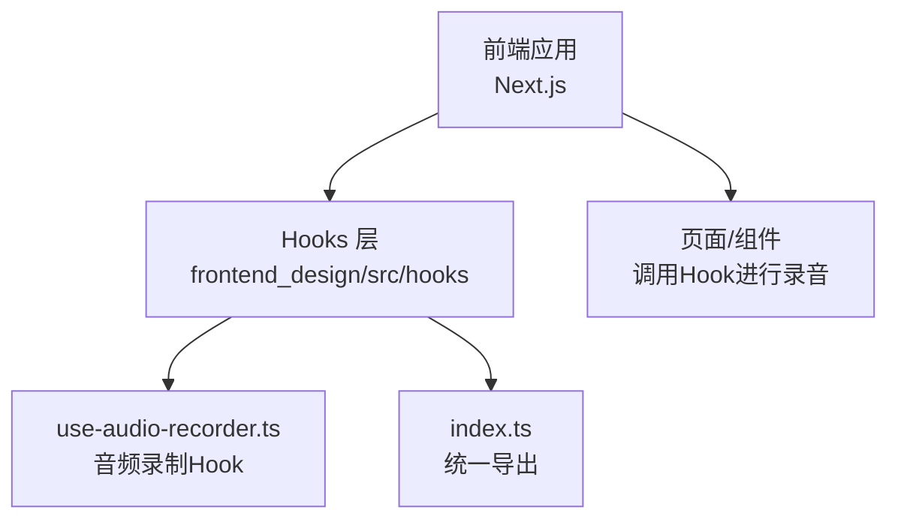
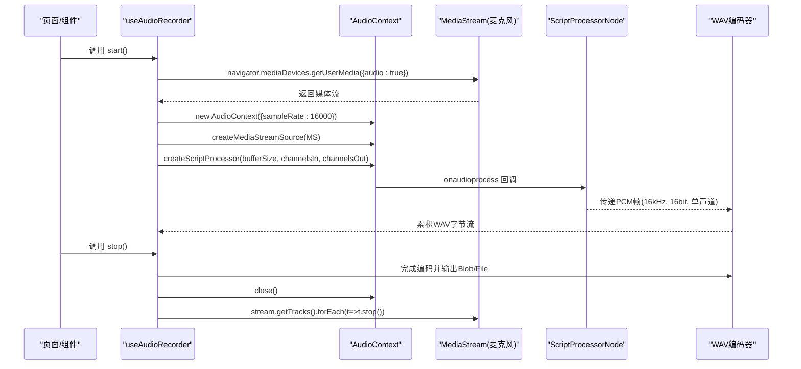
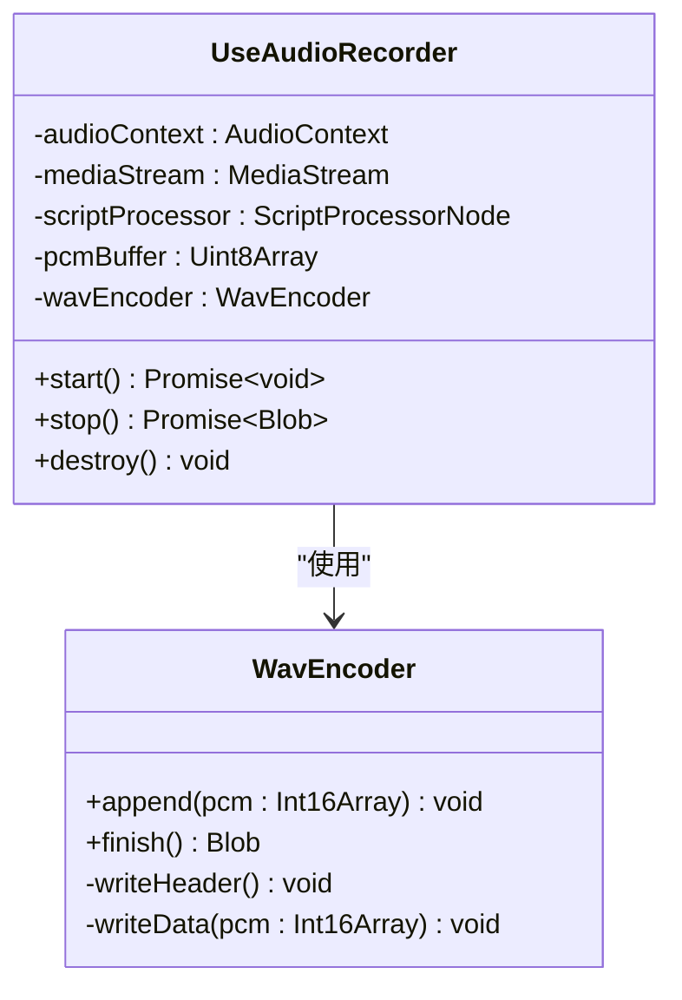
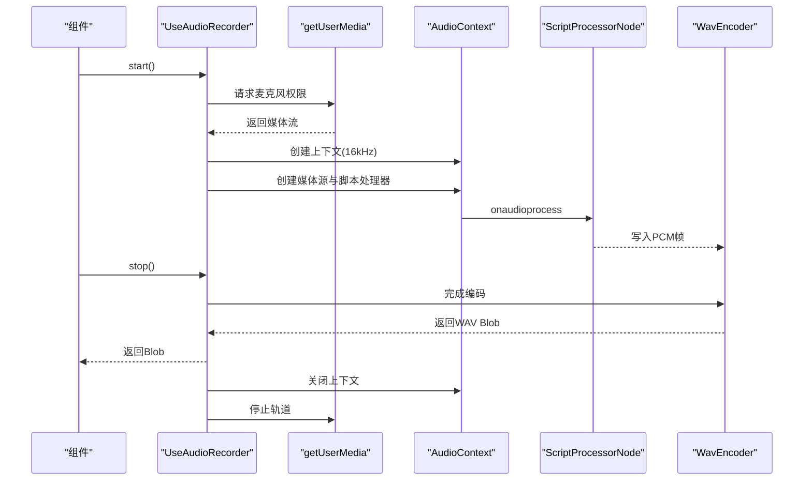
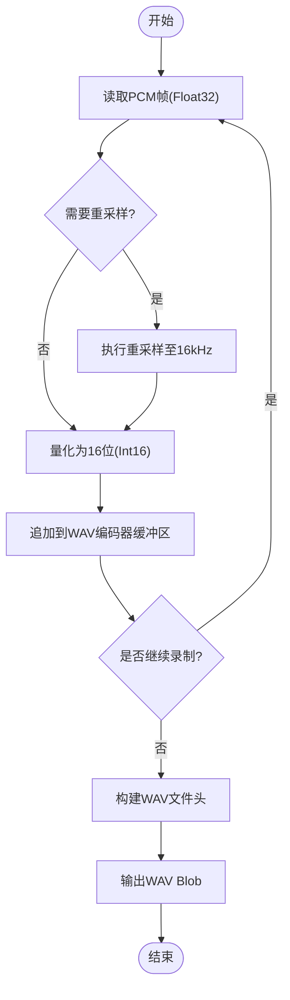
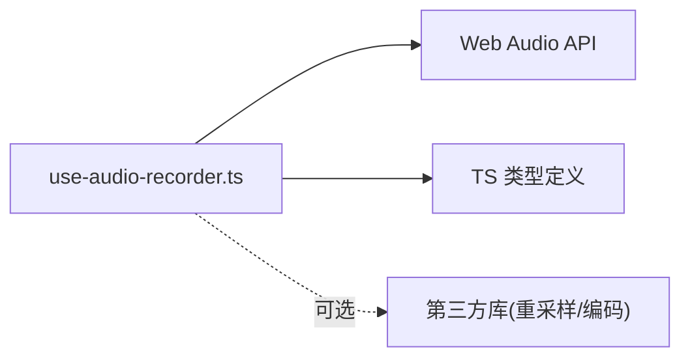

# 音频录制Hook

<cite>
**本文引用的文件**   
- [use-audio-recorder.ts](file://frontend_design/src/hooks/use-audio-recorder.ts)
- [index.ts](file://frontend_design/src/hooks/index.ts)
</cite>

## 目录
1. [简介](#简介)
2. [项目结构](#项目结构)
3. [核心组件](#核心组件)
4. [架构总览](#架构总览)
5. [详细组件分析](#详细组件分析)
6. [依赖关系分析](#依赖关系分析)
7. [性能考虑](#性能考虑)
8. [故障排查指南](#故障排查指南)
9. [结论](#结论)
10. [附录](#附录)

## 简介
本技术文档聚焦于前端音频录制 Hook 的实现与使用，围绕以下目标展开：
- 深入解释 AudioContext 的使用：上下文创建、媒体流获取、音频节点连接。
- 详细说明 WAV 格式编码实现：PCM 数据转换、采样率重采样、WAV 文件头构建。
- 描述 ScriptProcessorNode 的数据采集机制：音频缓冲区处理、实时数据处理、内存管理。
- 解释麦克风权限处理：权限请求、错误处理、用户提示。
- 提供音频格式优化建议：16kHz 采样率、16位深度、单声道压缩。
- 给出性能优化技巧、跨浏览器兼容性处理、内存泄漏防护方案。

## 项目结构
本项目为前后端混合工程，音频录制 Hook 位于前端 Next.js 应用中，具体路径如下：
- 前端源码根目录：frontend_design/src
- 自定义 Hooks 目录：frontend_design/src/hooks
- 音频录制 Hook 文件：frontend_design/src/hooks/use-audio-recorder.ts
- Hooks 统一导出入口：frontend_design/src/hooks/index.ts

图表来源
- [use-audio-recorder.ts](file://frontend_design/src/hooks/use-audio-recorder.ts)
- [index.ts](file://frontend_design/src/hooks/index.ts)

章节来源
- [use-audio-recorder.ts](file://frontend_design/src/hooks/use-audio-recorder.ts)
- [index.ts](file://frontend_design/src/hooks/index.ts)

## 核心组件
- useAudioRecorder Hook：封装完整的录音生命周期（初始化、开始、停止、销毁），对外暴露状态与方法，供页面或组件消费。
- 内部模块职责：
  - 音频上下文与媒体流管理：负责创建 AudioContext、获取麦克风流、建立音频图。
  - 数据采集与处理：通过 ScriptProcessorNode 回调获取 PCM 帧，执行重采样与格式转换。
  - WAV 编码与打包：将 PCM 数据转换为 WAV 二进制并生成标准文件头。
  - 权限与错误处理：捕获 getUserMedia 失败、权限拒绝等异常，向上抛出可识别的错误信息。
  - 资源清理：在停止或卸载时释放 MediaStream、AudioContext、ScriptProcessorNode 引用，避免内存泄漏。

章节来源
- [use-audio-recorder.ts](file://frontend_design/src/hooks/use-audio-recorder.ts)
- [index.ts](file://frontend_design/src/hooks/index.ts)

## 架构总览
下图展示了从页面调用到音频数据落盘的整体流程，包括权限请求、上下文创建、节点连接、数据处理与编码。

图表来源
- [use-audio-recorder.ts](file://frontend_design/src/hooks/use-audio-recorder.ts)

## 详细组件分析

### AudioContext 使用详解
- 上下文创建
  - 使用 AudioContext 构造函数并指定 sampleRate 为 16000，以满足 ASR 模型对采样率的常见要求。
  - 注意不同浏览器的默认采样率差异，显式设置可保证一致性。
- 媒体流获取
  - 通过 navigator.mediaDevices.getUserMedia 请求麦克风权限，配置 { audio: true }。
  - 若权限被拒绝或设备不可用，应捕获错误并向上抛出明确的用户提示。
- 音频节点连接
  - 使用 createMediaStreamSource 将媒体流接入音频图。
  - 使用 createScriptProcessor 创建脚本处理器节点，用于逐块回调处理 PCM 数据。
  - 将源节点连接到脚本处理器节点，形成完整的数据通路。

章节来源
- [use-audio-recorder.ts](file://frontend_design/src/hooks/use-audio-recorder.ts)

### WAV 格式编码实现
- PCM 数据转换
  - 从 ScriptProcessorNode 的 onaudioprocess 回调中读取 Float32Array 帧。
  - 将浮点范围 [-1,1] 线性映射到 16位有符号整型范围 [-32768,32767]，得到 Int16Array。
- 采样率重采样
  - 若媒体流原始采样率不为 16kHz，需在上游进行重采样。
  - 可使用 AudioContext.createGain + OfflineAudioContext 或第三方库实现高质量重采样；简单场景可用线性插值近似。
- WAV 文件头构建
  - 构造 RIFF/WAVE 容器头部，包含 ChunkID、ChunkSize、Format、Subchunk1ID、Subchunk1Size、AudioFormat、NumChannels、SampleRate、ByteRate、BlockAlign、BitsPerSample 等字段。
  - 追加 Subchunk2ID、Subchunk2Size 及 PCM 数据体。
  - 确保字节序为大端（Big-Endian）以符合 WAV 规范。

章节来源
- [use-audio-recorder.ts](file://frontend_design/src/hooks/use-audio-recorder.ts)

### ScriptProcessorNode 数据采集机制
- 音频缓冲区处理
  - onaudioprocess 事件触发时，输入缓冲区的每个通道均为 Float32Array。
  - 按块大小（bufferSize）循环处理，避免单次回调过大导致卡顿。
- 实时数据处理
  - 在回调内执行重采样与量化（Float32→Int16）。
  - 将处理后的 PCM 帧写入编码器缓冲区，必要时做节流或批处理以减少主线程压力。
- 内存管理
  - 避免在回调中频繁分配大对象，尽量复用 TypedArray 缓冲区。
  - 及时清空已编码的中间数据，防止 Blob 无限增长。
  - 停止录音后关闭 AudioContext 并释放 MediaStream 轨道引用。

章节来源
- [use-audio-recorder.ts](file://frontend_design/src/hooks/use-audio-recorder.ts)

### 麦克风权限处理
- 权限请求
  - 首次调用 getUserMedia 会触发浏览器权限弹窗。
  - 若用户允许，返回媒体流；否则进入错误分支。
- 错误处理
  - 捕获 PermissionDeniedError、NotFoundError、NotReadableError 等，分别提示“权限被拒绝”、“未找到麦克风设备”、“设备被占用”。
- 用户提示
  - 在 UI 层展示友好提示，引导用户开启权限或切换设备。
  - 提供重试按钮，支持重新发起权限请求。

章节来源
- [use-audio-recorder.ts](file://frontend_design/src/hooks/use-audio-recorder.ts)

### 音频格式优化
- 采样率
  - 采用 16kHz，兼顾语音清晰度与带宽/存储成本。
- 位深
  - 采用 16位深度，满足大多数 ASR 引擎需求。
- 声道
  - 采用单声道（Mono），减少数据量且不影响语音识别效果。
- 压缩
  - WAV 为无损格式，体积较大；如需传输优化，可在服务端转码为 Opus/MP3/AAC 等压缩格式。

章节来源
- [use-audio-recorder.ts](file://frontend_design/src/hooks/use-audio-recorder.ts)

### 类图（代码级关系）

图表来源
- [use-audio-recorder.ts](file://frontend_design/src/hooks/use-audio-recorder.ts)

### 序列图（API 工作流）

图表来源
- [use-audio-recorder.ts](file://frontend_design/src/hooks/use-audio-recorder.ts)

### 流程图（WAV 编码算法）

图表来源
- [use-audio-recorder.ts](file://frontend_design/src/hooks/use-audio-recorder.ts)

## 依赖关系分析
- 直接依赖
  - Web API：AudioContext、MediaStream、ScriptProcessorNode、navigator.mediaDevices.getUserMedia。
  - 类型系统：TypeScript 类型定义（如 AudioBuffer、Float32Array、Int16Array）。
- 间接依赖
  - 浏览器兼容性：部分旧版浏览器可能不支持 ScriptProcessorNode 或特定采样率设置。
  - 第三方库（可选）：用于高质量重采样或更高效的二进制操作。

图表来源
- [use-audio-recorder.ts](file://frontend_design/src/hooks/use-audio-recorder.ts)

章节来源
- [use-audio-recorder.ts](file://frontend_design/src/hooks/use-audio-recorder.ts)

## 性能考虑
- 降低主线程压力
  - 合理设置 ScriptProcessorNode 的 buffer size，平衡延迟与 CPU 占用。
  - 在回调中避免复杂计算，优先使用 TypedArray 批量操作。
- 内存管理
  - 复用缓冲区对象，避免频繁 GC。
  - 停止录音后立即释放 MediaStream 和 AudioContext，断开节点引用。
- 网络与存储
  - 本地暂存 WAV 后再上传，避免边录边传造成抖动。
  - 长录音分段保存，限制单个 Blob 大小。
- 跨浏览器兼容
  - 检测并降级：在不支持 ScriptProcessorNode 的环境中使用 MediaRecorder 作为备选方案（牺牲实时性换取兼容性）。
  - 针对 iOS Safari 的特殊处理：确保在用户手势后启动录音，避免自动播放策略限制。

[本节为通用指导，不直接分析具体文件]

## 故障排查指南
- 常见问题
  - 权限被拒绝：检查 HTTPS 环境、用户授权、设备可用性。
  - 无声音或静音：确认麦克风未被系统或其他应用占用。
  - 音质差或卡顿：调整 buffer size、检查重采样质量、评估主线程负载。
  - 内存泄漏：确认停止后关闭 AudioContext、释放 MediaStream、清除定时器与事件监听。
- 定位方法
  - 在浏览器开发者工具中查看 Web Audio 节点图，验证连接是否正确。
  - 监控控制台错误日志，捕获并打印 getUserMedia 与 onaudioprocess 异常。
  - 使用 Performance 面板分析回调耗时与内存峰值。

章节来源
- [use-audio-recorder.ts](file://frontend_design/src/hooks/use-audio-recorder.ts)

## 结论
本 Hook 基于 Web Audio API 实现了稳定、可控的前端录音能力，涵盖权限处理、上下文与节点管理、实时 PCM 采集、WAV 编码与资源清理。通过合理的采样率、位深与声道配置，可满足多数语音识别场景的需求。结合性能优化与兼容性策略，可在多浏览器环境下获得一致体验。

[本节为总结，不直接分析具体文件]

## 附录
- 最佳实践清单
  - 始终显式设置 AudioContext.sampleRate 为 16000。
  - 在用户交互事件中启动录音，避免自动策略拦截。
  - 使用 try/catch 包裹权限请求与关键步骤，向上抛出结构化错误。
  - 停止录音后务必关闭上下文与释放媒体轨道。
- 参考实现位置
  - 音频录制 Hook 实现：[use-audio-recorder.ts](file://frontend_design/src/hooks/use-audio-recorder.ts)
  - Hooks 统一导出入口：[index.ts](file://frontend_design/src/hooks/index.ts)

章节来源
- [use-audio-recorder.ts](file://frontend_design/src/hooks/use-audio-recorder.ts)
- [index.ts](file://frontend_design/src/hooks/index.ts)