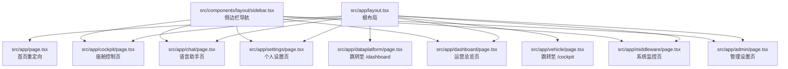
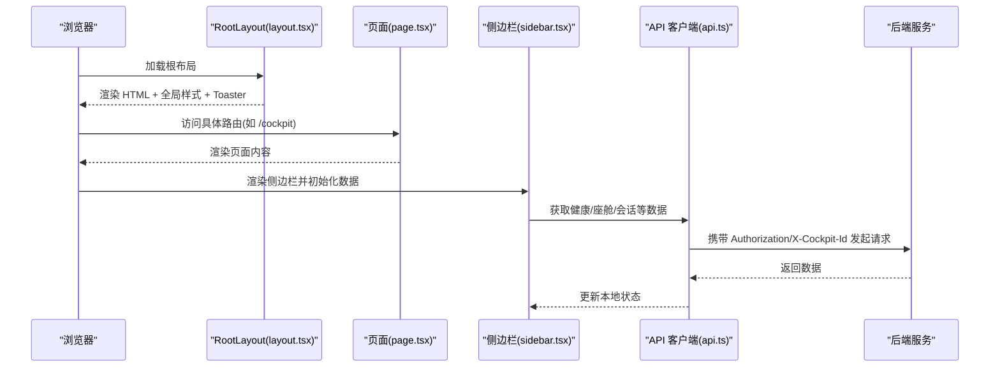
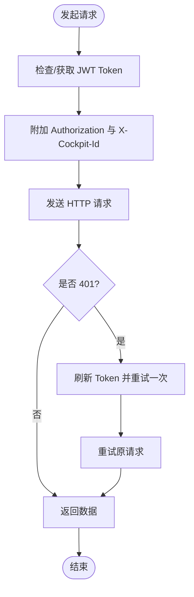
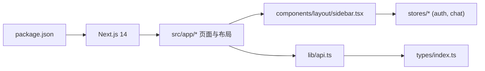

# 应用结构设计

<cite>
**本文引用的文件**   
- [frontend_design/next.config.js](file://frontend_design/next.config.js)
- [frontend_design/tailwind.config.ts](file://frontend_design/tailwind.config.ts)
- [frontend_design/src/app/layout.tsx](file://frontend_design/src/app/layout.tsx)
- [frontend_design/src/app/page.tsx](file://frontend_design/src/app/page.tsx)
- [frontend_design/src/app/globals.css](file://frontend_design/src/app/globals.css)
- [frontend_design/tsconfig.json](file://frontend_design/tsconfig.json)
- [frontend_design/package.json](file://frontend_design/package.json)
- [frontend_design/src/app/cockpit/page.tsx](file://frontend_design/src/app/cockpit/page.tsx)
- [frontend_design/src/app/admin/page.tsx](file://frontend_design/src/app/admin/page.tsx)
- [frontend_design/src/app/dashboard/page.tsx](file://frontend_design/src/app/dashboard/page.tsx)
- [frontend_design/src/app/chat/page.tsx](file://frontend_design/src/app/chat/page.tsx)
- [frontend_design/src/app/settings/page.tsx](file://frontend_design/src/app/settings/page.tsx)
- [frontend_design/src/app/dataplatform/page.tsx](file://frontend_design/src/app/dataplatform/page.tsx)
- [frontend_design/src/app/middleware/page.tsx](file://frontend_design/src/app/middleware/page.tsx)
- [frontend_design/src/app/vehicle/page.tsx](file://frontend_design/src/app/vehicle/page.tsx)
- [frontend_design/src/components/layout/sidebar.tsx](file://frontend_design/src/components/layout/sidebar.tsx)
- [frontend_design/src/types/index.ts](file://frontend_design/src/types/index.ts)
- [frontend_design/src/lib/api.ts](file://frontend_design/src/lib/api.ts)
</cite>

## 目录
1. [简介](#简介)
2. [项目结构](#项目结构)
3. [核心组件](#核心组件)
4. [架构总览](#架构总览)
5. [详细组件分析](#详细组件分析)
6. [依赖关系分析](#依赖关系分析)
7. [性能与构建优化](#性能与构建优化)
8. [故障排查指南](#故障排查指南)
9. [结论](#结论)
10. [附录：实践示例](#附录实践示例)

## 简介
本文件面向 NexusCockpit 前端工程，系统性阐述基于 Next.js 14 App Router 的前端应用结构设计。内容覆盖路由组织、布局嵌套、页面与参数处理、构建与代理配置、Tailwind CSS 主题与全局样式、TypeScript 类型组织与模块导入规范，并提供可操作的实践示例路径，帮助读者快速上手与扩展。

## 项目结构
前端采用 Next.js 14 App Router 的目录约定：src/app 下按功能域划分路由，每个路由由 page.tsx 提供页面，layout.tsx 提供布局；公共 UI 与业务逻辑分别位于 components、hooks、stores、lib、types 等目录。

图表来源
- [frontend_design/src/app/layout.tsx:1-55](file://frontend_design/src/app/layout.tsx#L1-L55)
- [frontend_design/src/app/page.tsx:1-18](file://frontend_design/src/app/page.tsx#L1-L18)
- [frontend_design/src/app/cockpit/page.tsx:1-41](file://frontend_design/src/app/cockpit/page.tsx#L1-L41)
- [frontend_design/src/app/chat/page.tsx:1-22](file://frontend_design/src/app/chat/page.tsx#L1-L22)
- [frontend_design/src/app/settings/page.tsx:1-557](file://frontend_design/src/app/settings/page.tsx#L1-L557)
- [frontend_design/src/app/dashboard/page.tsx:1-602](file://frontend_design/src/app/dashboard/page.tsx#L1-L602)
- [frontend_design/src/app/middleware/page.tsx:1-295](file://frontend_design/src/app/middleware/page.tsx#L1-L295)
- [frontend_design/src/app/admin/page.tsx:1-498](file://frontend_design/src/app/admin/page.tsx#L1-L498)
- [frontend_design/src/app/dataplatform/page.tsx:1-13](file://frontend_design/src/app/dataplatform/page.tsx#L1-L13)
- [frontend_design/src/app/vehicle/page.tsx:1-13](file://frontend_design/src/app/vehicle/page.tsx#L1-L13)
- [frontend_design/src/components/layout/sidebar.tsx:1-402](file://frontend_design/src/components/layout/sidebar.tsx#L1-L402)

章节来源
- [frontend_design/src/app/layout.tsx:1-55](file://frontend_design/src/app/layout.tsx#L1-L55)
- [frontend_design/src/app/page.tsx:1-18](file://frontend_design/src/app/page.tsx#L1-L18)
- [frontend_design/src/components/layout/sidebar.tsx:1-402](file://frontend_design/src/components/layout/sidebar.tsx#L1-L402)

## 核心组件
- 根布局（RootLayout）
  - 负责 HTML 骨架、全局样式注入、侧边栏容器、主内容区与全局通知容器。
  - 通过 metadata 定义站点标题与描述。
- 侧边栏（Sidebar）
  - 根据用户角色动态展示“座舱功能”和“管理功能”菜单项。
  - 集成健康检查轮询、座舱切换、会话列表（聊天页专用）。
- 页面入口与重定向
  - 根页面统一跳转到座舱控制页，简化首次访问流程。
  - 历史路由 /dataplatform 与 /vehicle 自动重定向到 /dashboard 与 /cockpit。

章节来源
- [frontend_design/src/app/layout.tsx:1-55](file://frontend_design/src/app/layout.tsx#L1-L55)
- [frontend_design/src/components/layout/sidebar.tsx:1-402](file://frontend_design/src/components/layout/sidebar.tsx#L1-L402)
- [frontend_design/src/app/page.tsx:1-18](file://frontend_design/src/app/page.tsx#L1-L18)
- [frontend_design/src/app/dataplatform/page.tsx:1-13](file://frontend_design/src/app/dataplatform/page.tsx#L1-L13)
- [frontend_design/src/app/vehicle/page.tsx:1-13](file://frontend_design/src/app/vehicle/page.tsx#L1-L13)

## 架构总览
Next.js 14 App Router 以文件系统驱动路由，配合 layout.tsx 实现布局嵌套与共享状态；页面组件通过客户端指令 "use client" 启用交互能力；API 请求通过统一的 axios 实例封装，自动附加 JWT 与租户隔离头。

图表来源
- [frontend_design/src/app/layout.tsx:1-55](file://frontend_design/src/app/layout.tsx#L1-L55)
- [frontend_design/src/app/cockpit/page.tsx:1-41](file://frontend_design/src/app/cockpit/page.tsx#L1-L41)
- [frontend_design/src/components/layout/sidebar.tsx:1-402](file://frontend_design/src/components/layout/sidebar.tsx#L1-L402)
- [frontend_design/src/lib/api.ts:1-745](file://frontend_design/src/lib/api.ts#L1-L745)

## 详细组件分析

### 路由与布局机制（App Router）
- 路由映射
  - / → src/app/page.tsx（重定向到 /cockpit）
  - /cockpit → src/app/cockpit/page.tsx
  - /chat → src/app/chat/page.tsx
  - /settings → src/app/settings/page.tsx
  - /dashboard → src/app/dashboard/page.tsx
  - /middleware → src/app/middleware/page.tsx
  - /admin → src/app/admin/page.tsx
  - /dataplatform → src/app/dataplatform/page.tsx（重定向到 /dashboard）
  - /vehicle → src/app/vehicle/page.tsx（重定向到 /cockpit）
- 布局嵌套
  - 根布局 src/app/layout.tsx 为所有页面共享的外壳，包含侧边栏、主内容区与全局通知。
  - 可在子目录新增 layout.tsx 实现局部布局（当前未使用多级布局）。
- 路由参数
  - 当前路由均为静态路径，无动态段或查询参数处理。如需支持动态路由，可在 src/app 下创建带方括号的目录（例如 [id]/page.tsx），并通过 useSearchParams/useParams 读取参数。

章节来源
- [frontend_design/src/app/page.tsx:1-18](file://frontend_design/src/app/page.tsx#L1-L18)
- [frontend_design/src/app/cockpit/page.tsx:1-41](file://frontend_design/src/app/cockpit/page.tsx#L1-L41)
- [frontend_design/src/app/chat/page.tsx:1-22](file://frontend_design/src/app/chat/page.tsx#L1-L22)
- [frontend_design/src/app/settings/page.tsx:1-557](file://frontend_design/src/app/settings/page.tsx#L1-L557)
- [frontend_design/src/app/dashboard/page.tsx:1-602](file://frontend_design/src/app/dashboard/page.tsx#L1-L602)
- [frontend_design/src/app/middleware/page.tsx:1-295](file://frontend_design/src/app/middleware/page.tsx#L1-L295)
- [frontend_design/src/app/admin/page.tsx:1-498](file://frontend_design/src/app/admin/page.tsx#L1-L498)
- [frontend_design/src/app/dataplatform/page.tsx:1-13](file://frontend_design/src/app/dataplatform/page.tsx#L1-L13)
- [frontend_design/src/app/vehicle/page.tsx:1-13](file://frontend_design/src/app/vehicle/page.tsx#L1-L13)
- [frontend_design/src/app/layout.tsx:1-55](file://frontend_design/src/app/layout.tsx#L1-L55)

### 应用配置（构建、代理、环境变量）
- 构建输出
  - output: standalone，生成独立运行包，减小镜像体积。
- 代理与重写
  - 默认不启用 rewrites，前端直连后端地址（可通过环境变量 NEXT_PUBLIC_API_URL 指定）。
  - 若需避免跨域，可将 baseURL 改为 "/api" 并启用注释中的 rewrites 规则。
- 环境变量
  - NEXT_PUBLIC_API_URL：前端运行时可见的后端基础地址。
  - 其他变量在 api.ts 中通过 process.env.NEXT_PUBLIC_API_URL 读取。

章节来源
- [frontend_design/next.config.js:1-21](file://frontend_design/next.config.js#L1-L21)
- [frontend_design/src/lib/api.ts:1-745](file://frontend_design/src/lib/api.ts#L1-L745)

### Tailwind CSS 样式系统与主题
- 扫描范围
  - content 覆盖 pages、components、app 下的 TS/JS/TSX/JSX/MDX 文件。
- 主题扩展
  - 颜色、圆角、动画与关键帧均在 theme.extend 中扩展，使用 CSS 变量驱动深色主题。
- 全局样式
  - globals.css 引入 Tailwind 层，定义 :root 变量、基础样式、滚动条、玻璃态与渐变文本等。

章节来源
- [frontend_design/tailwind.config.ts:1-55](file://frontend_design/tailwind.config.ts#L1-L55)
- [frontend_design/src/app/globals.css:1-74](file://frontend_design/src/app/globals.css#L1-L74)

### TypeScript 类型与全局样式管理
- 类型组织
  - types/index.ts 集中导出跨模块复用的接口与联合类型，涵盖对话、车控、健康、中间件、用户、声纹等。
- 全局样式
  - 通过 @layer base 定义全局基础样式与 CSS 变量，确保主题一致性。
- 模块导入
  - tsconfig.json 配置 @/* 路径别名指向 src/*，便于统一导入。

章节来源
- [frontend_design/src/types/index.ts:1-264](file://frontend_design/src/types/index.ts#L1-L264)
- [frontend_design/src/app/globals.css:1-74](file://frontend_design/src/app/globals.css#L1-L74)
- [frontend_design/tsconfig.json:1-24](file://frontend_design/tsconfig.json#L1-L24)

### 页面与组件职责
- 座舱控制（/cockpit）
  - 面向终端用户的操作界面，聚合语音助手栏与车控面板。
- 语音助手（/chat）
  - 承载聊天窗口组件，结合侧边栏会话列表进行多会话管理。
- 个人设置（/settings）
  - 个人信息、登录/退出、声纹注册/验证、密码修改。
- 运营总览（/dashboard）
  - 管理员视角的全景看板，聚合健康、缓存趋势、引擎状态、告警与活动记录。
- 系统监控（/middleware）
  - 中间件健康状态一览，兼容不同后端响应格式并做归一化。
- 管理设置（/admin）
  - 座舱管理、用户管理、系统配置热更新。

章节来源
- [frontend_design/src/app/cockpit/page.tsx:1-41](file://frontend_design/src/app/cockpit/page.tsx#L1-L41)
- [frontend_design/src/app/chat/page.tsx:1-22](file://frontend_design/src/app/chat/page.tsx#L1-L22)
- [frontend_design/src/app/settings/page.tsx:1-557](file://frontend_design/src/app/settings/page.tsx#L1-L557)
- [frontend_design/src/app/dashboard/page.tsx:1-602](file://frontend_design/src/app/dashboard/page.tsx#L1-L602)
- [frontend_design/src/app/middleware/page.tsx:1-295](file://frontend_design/src/app/middleware/page.tsx#L1-L295)
- [frontend_design/src/app/admin/page.tsx:1-498](file://frontend_design/src/app/admin/page.tsx#L1-L498)

### API 客户端与认证流
- 统一实例
  - 基于 axios 创建 api 实例，设置 baseURL、超时与通用头。
- 请求拦截器
  - 自动获取并附加 JWT Token，附加 X-Cockpit-Id 实现多租户隔离。
- 响应拦截器
  - 401 时自动刷新 Token 并重试一次，统一错误日志。
- 流式请求
  - 原生 fetch + ReadableStream 实现 SSE 流式事件解析，支持 AbortSignal 取消。
- 环境基址
  - 通过 NEXT_PUBLIC_API_URL 决定后端地址，默认直连 Go 网关。

图表来源
- [frontend_design/src/lib/api.ts:1-745](file://frontend_design/src/lib/api.ts#L1-L745)

章节来源
- [frontend_design/src/lib/api.ts:1-745](file://frontend_design/src/lib/api.ts#L1-L745)

## 依赖关系分析
- 包管理与脚本
  - package.json 定义了开发、构建、启动与类型检查脚本，以及核心依赖（Next、React、Zustand、Axios、Tailwind、Recharts、Framer Motion、Three.js 生态等）。
- 模块耦合
  - 页面组件依赖 lib/api.ts 进行数据获取；侧边栏依赖 stores/auth-store 与 stores/chat-store 进行权限与会话状态管理；类型集中在 types/index.ts。
- 外部集成点
  - 后端 API 地址由环境变量控制；可选启用 Next.js rewrites 进行代理以避免跨域。

图表来源
- [frontend_design/package.json:1-45](file://frontend_design/package.json#L1-L45)
- [frontend_design/src/lib/api.ts:1-745](file://frontend_design/src/lib/api.ts#L1-L745)
- [frontend_design/src/types/index.ts:1-264](file://frontend_design/src/types/index.ts#L1-L264)
- [frontend_design/src/components/layout/sidebar.tsx:1-402](file://frontend_design/src/components/layout/sidebar.tsx#L1-L402)

章节来源
- [frontend_design/package.json:1-45](file://frontend_design/package.json#L1-L45)

## 性能与构建优化
- 构建产物
  - output: standalone 减少镜像体积，适合 Docker 部署。
- 资源与样式
  - Tailwind 按需生成，仅包含实际使用的类名；CSS 变量驱动主题，避免重复样式。
- 网络与缓存
  - 统一 axios 实例复用连接；流式请求降低首屏等待时间；健康检查与数据轮询间隔合理，避免频繁请求。
- 建议
  - 对大组件进行懒加载（React.lazy + Suspense）。
  - 图表数据分页或增量更新，避免一次性渲染过多节点。
  - 图片与媒体资源使用 Next/Image 与合适的压缩策略。

[本节为通用指导，无需特定文件引用]

## 故障排查指南
- 无法访问后端
  - 检查 NEXT_PUBLIC_API_URL 是否正确；确认防火墙与 CORS 策略；必要时启用 next.config.js 中的 rewrites。
- 401 未授权
  - 确认 ensureAuthToken 是否能成功获取 Token；查看 localStorage 中 token 是否过期；检查响应拦截器的重试逻辑。
- 流式请求中断
  - 检查 AbortSignal 是否被提前释放；确认服务端 SSE 协议是否符合 data: JSON 行格式。
- 样式异常
  - 确认 tailwind.config.ts 的 content 路径包含变更的文件；检查 globals.css 的 CSS 变量是否生效。

章节来源
- [frontend_design/next.config.js:1-21](file://frontend_design/next.config.js#L1-L21)
- [frontend_design/src/lib/api.ts:1-745](file://frontend_design/src/lib/api.ts#L1-L745)
- [frontend_design/tailwind.config.ts:1-55](file://frontend_design/tailwind.config.ts#L1-L55)
- [frontend_design/src/app/globals.css:1-74](file://frontend_design/src/app/globals.css#L1-L74)

## 结论
NexusCockpit 前端基于 Next.js 14 App Router 构建了清晰的路由与布局体系，通过统一的 API 客户端与类型定义提升可维护性，借助 Tailwind CSS 与 CSS 变量实现一致的主题体验。整体结构具备良好的扩展性与可观测性，适合持续迭代与团队协作。

[本节为总结，无需特定文件引用]

## 附录：实践示例

- 添加新页面
  - 在 src/app 下新建目录与 page.tsx，并在侧边栏增加导航项。
  - 参考路径：
    - [frontend_design/src/app/cockpit/page.tsx:1-41](file://frontend_design/src/app/cockpit/page.tsx#L1-L41)
    - [frontend_design/src/components/layout/sidebar.tsx:1-402](file://frontend_design/src/components/layout/sidebar.tsx#L1-L402)

- 配置路由与重定向
  - 使用 redirect 将旧路由迁移到新路由。
  - 参考路径：
    - [frontend_design/src/app/dataplatform/page.tsx:1-13](file://frontend_design/src/app/dataplatform/page.tsx#L1-L13)
    - [frontend_design/src/app/vehicle/page.tsx:1-13](file://frontend_design/src/app/vehicle/page.tsx#L1-L13)

- 扩展样式系统
  - 在 tailwind.config.ts 的 theme.extend 中添加自定义颜色、圆角或动画；在 globals.css 中补充 CSS 变量或全局样式。
  - 参考路径：
    - [frontend_design/tailwind.config.ts:1-55](file://frontend_design/tailwind.config.ts#L1-L55)
    - [frontend_design/src/app/globals.css:1-74](file://frontend_design/src/app/globals.css#L1-L74)

- 配置环境变量与代理
  - 设置 NEXT_PUBLIC_API_URL 指向后端；如需代理，启用 next.config.js 中的 rewrites。
  - 参考路径：
    - [frontend_design/next.config.js:1-21](file://frontend_design/next.config.js#L1-L21)
    - [frontend_design/src/lib/api.ts:1-745](file://frontend_design/src/lib/api.ts#L1-L745)

- 使用 TypeScript 类型
  - 在 types/index.ts 中新增接口，并在页面或组件中导入使用。
  - 参考路径：
    - [frontend_design/src/types/index.ts:1-264](file://frontend_design/src/types/index.ts#L1-L264)