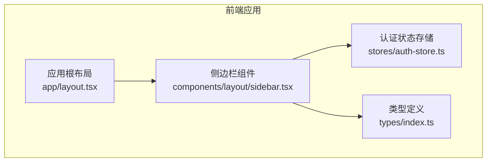
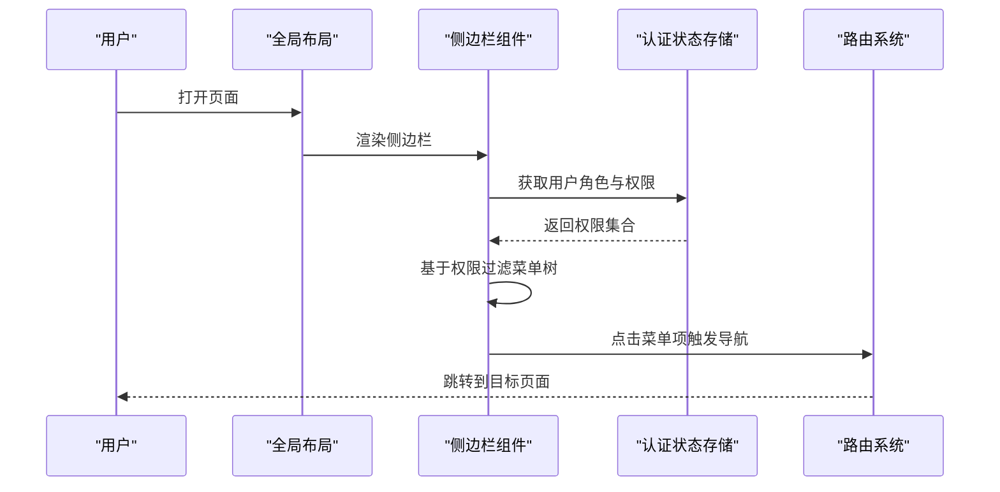
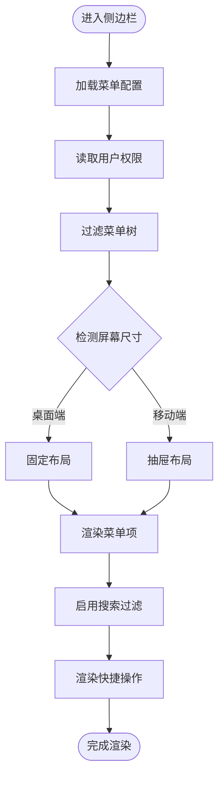
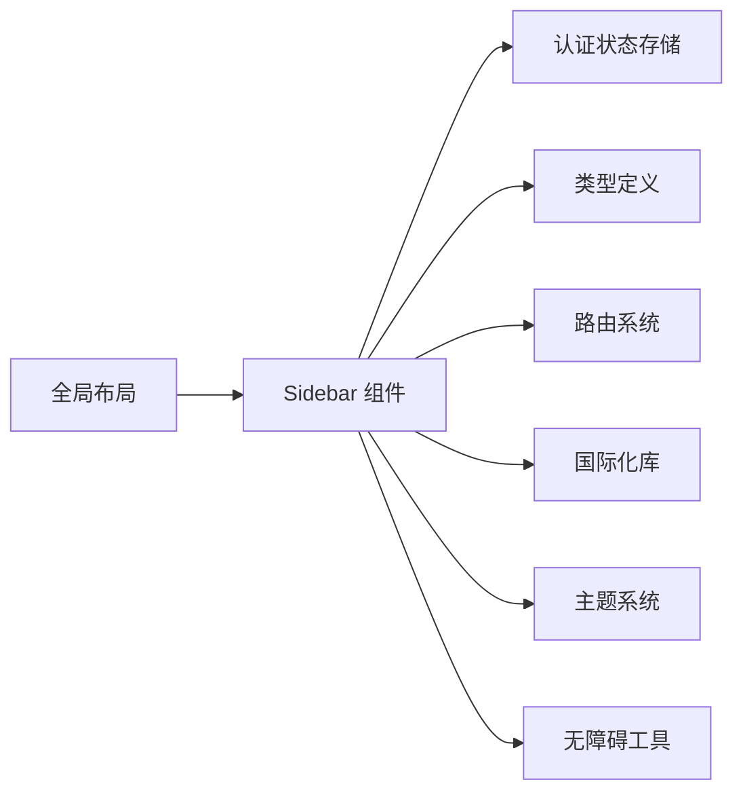

# 侧边栏布局组件

<cite>
**本文引用的文件**   
- [sidebar.tsx](file://frontend_design/src/components/layout/sidebar.tsx)
- [layout.tsx](file://frontend_design/src/app/layout.tsx)
- [auth-store.ts](file://frontend_design/src/stores/auth-store.ts)
- [index.ts](file://frontend_design/src/types/index.ts)
</cite>

## 目录
1. [简介](#简介)
2. [项目结构](#项目结构)
3. [核心组件](#核心组件)
4. [架构总览](#架构总览)
5. [详细组件分析](#详细组件分析)
6. [依赖分析](#依赖分析)
7. [性能考虑](#性能考虑)
8. [故障排查指南](#故障排查指南)
9. [结论](#结论)
10. [附录](#附录)

## 简介
本文件面向前端工程中的“侧边栏布局组件”，围绕 Sidebar 组件的架构设计、路由导航系统、权限控制机制与响应式适配策略进行系统化说明。文档覆盖菜单项动态生成、路由守卫实现、用户角色权限验证、移动端抽屉模式、桌面端固定布局、折叠展开动画等交互设计，并补充面包屑导航、搜索功能、快捷操作入口等增强特性。同时提供菜单配置格式、权限标识规范、主题定制方案，以及国际化支持、无障碍访问与性能优化等实现细节建议。

## 项目结构
本项目采用 Next.js 应用结构，侧边栏位于前端组件目录中，并与全局布局、认证状态管理、类型定义等模块协同工作。

图表来源
- [layout.tsx](file://frontend_design/src/app/layout.tsx)
- [sidebar.tsx](file://frontend_design/src/components/layout/sidebar.tsx)
- [auth-store.ts](file://frontend_design/src/stores/auth-store.ts)
- [index.ts](file://frontend_design/src/types/index.ts)

章节来源
- [layout.tsx](file://frontend_design/src/app/layout.tsx)
- [sidebar.tsx](file://frontend_design/src/components/layout/sidebar.tsx)
- [auth-store.ts](file://frontend_design/src/stores/auth-store.ts)
- [index.ts](file://frontend_design/src/types/index.ts)

## 核心组件
- 侧边栏组件（Sidebar）：负责渲染菜单树、处理路由跳转、维护折叠/展开状态、在移动端以抽屉形式展示，并提供搜索与快捷操作入口。
- 全局布局（Layout）：将 Sidebar 与主内容区域组合，统一页面骨架与响应式行为。
- 认证状态（Auth Store）：集中管理用户登录态、角色与权限集合，供 Sidebar 进行权限过滤与高亮显示。
- 类型定义（Types）：定义菜单节点、路由元信息、权限标识等数据结构，确保前后端一致性与可维护性。

章节来源
- [sidebar.tsx](file://frontend_design/src/components/layout/sidebar.tsx)
- [layout.tsx](file://frontend_design/src/app/layout.tsx)
- [auth-store.ts](file://frontend_design/src/stores/auth-store.ts)
- [index.ts](file://frontend_design/src/types/index.ts)

## 架构总览
Sidebar 作为导航中枢，通过读取菜单配置与当前用户权限，动态生成可访问的菜单树；结合路由系统进行导航，并在不同屏幕尺寸下切换为抽屉或固定布局。

图表来源
- [sidebar.tsx](file://frontend_design/src/components/layout/sidebar.tsx)
- [auth-store.ts](file://frontend_design/src/stores/auth-store.ts)
- [layout.tsx](file://frontend_design/src/app/layout.tsx)

## 详细组件分析

### 侧边栏组件（Sidebar）
- 职责
  - 渲染菜单树，支持多级嵌套
  - 根据用户权限过滤不可见菜单项
  - 维护折叠/展开状态，响应式切换抽屉/固定布局
  - 提供搜索与快捷操作入口
  - 与路由系统集成，完成导航跳转
- 关键数据流
  - 从认证状态读取用户角色与权限
  - 使用菜单配置构建菜单树
  - 对菜单项进行权限校验与可见性判断
  - 监听窗口尺寸变化，切换布局模式
- 交互设计
  - 桌面端：固定左侧面板，支持折叠/展开动画
  - 移动端：抽屉模式，滑出/收起过渡效果
  - 搜索：实时过滤菜单项，支持模糊匹配
  - 快捷操作：常用功能一键直达
- 无障碍访问
  - 键盘导航支持（Tab/Enter/Escape）
  - aria-* 属性标注（aria-expanded、aria-label、role="navigation"）
  - 焦点管理与可聚焦元素顺序合理
- 国际化支持
  - 菜单文本与提示文案通过 i18n 键值映射
  - 动态语言切换时自动更新界面文案

图表来源
- [sidebar.tsx](file://frontend_design/src/components/layout/sidebar.tsx)
- [auth-store.ts](file://frontend_design/src/stores/auth-store.ts)
- [index.ts](file://frontend_design/src/types/index.ts)

章节来源
- [sidebar.tsx](file://frontend_design/src/components/layout/sidebar.tsx)
- [auth-store.ts](file://frontend_design/src/stores/auth-store.ts)
- [index.ts](file://frontend_design/src/types/index.ts)

### 全局布局（Layout）
- 职责
  - 组合 Sidebar 与主内容区域
  - 提供统一的页面骨架与样式容器
  - 传递必要的上下文（如主题、语言、断点）
- 与 Sidebar 的关系
  - 作为父容器，控制整体布局宽度与间距
  - 在移动端通过遮罩层提升抽屉体验

章节来源
- [layout.tsx](file://frontend_design/src/app/layout.tsx)

### 认证状态（Auth Store）
- 职责
  - 管理用户登录态、角色与权限集合
  - 提供权限查询接口供 Sidebar 调用
- 与 Sidebar 的关系
  - 被 Sidebar 订阅，用于动态过滤菜单项
  - 在用户切换或登出后刷新菜单可见性

章节来源
- [auth-store.ts](file://frontend_design/src/stores/auth-store.ts)

### 类型定义（Types）
- 职责
  - 定义菜单节点结构（标题、路径、图标、子项、权限标识）
  - 定义路由元信息（是否需要鉴权、面包屑层级）
  - 定义权限标识规范（资源:动作 或 模块:功能）
- 与 Sidebar 的关系
  - 为菜单渲染与权限校验提供强类型约束
  - 保证配置与运行时一致性

章节来源
- [index.ts](file://frontend_design/src/types/index.ts)

## 依赖分析
- 组件耦合关系
  - Sidebar 依赖 Auth Store 获取权限
  - Sidebar 依赖 Types 进行数据结构校验
  - Layout 组合 Sidebar 与主内容区
- 外部集成点
  - 路由系统：用于导航跳转与高亮当前路由
  - 主题系统：颜色、字体、间距等视觉风格
  - 国际化库：多语言文案与方向性布局
  - 无障碍工具：ARIA 属性与键盘事件处理

图表来源
- [sidebar.tsx](file://frontend_design/src/components/layout/sidebar.tsx)
- [auth-store.ts](file://frontend_design/src/stores/auth-store.ts)
- [index.ts](file://frontend_design/src/types/index.ts)
- [layout.tsx](file://frontend_design/src/app/layout.tsx)

章节来源
- [sidebar.tsx](file://frontend_design/src/components/layout/sidebar.tsx)
- [auth-store.ts](file://frontend_design/src/stores/auth-store.ts)
- [index.ts](file://frontend_design/src/types/index.ts)
- [layout.tsx](file://frontend_design/src/app/layout.tsx)

## 性能考虑
- 菜单树缓存：对已生成的菜单树进行记忆化，避免重复计算
- 懒加载子菜单：仅在展开时加载深层级菜单项
- 虚拟滚动：超长菜单列表使用虚拟滚动减少 DOM 节点数量
- 防抖搜索：输入框变更使用防抖降低过滤频率
- 路由高亮优化：仅对可见菜单项注册监听器
- 主题切换节流：避免频繁重绘导致的卡顿

[本节为通用性能建议，不直接分析具体文件]

## 故障排查指南
- 菜单不显示
  - 检查用户权限是否包含对应权限标识
  - 确认菜单配置的路径与路由表一致
  - 查看控制台是否有类型错误或空引用
- 抽屉无法打开/关闭
  - 检查断点判断逻辑是否正确
  - 确认遮罩层点击事件绑定是否生效
- 搜索无结果
  - 确认搜索字段映射正确
  - 检查防抖时间设置是否过长
- 国际化未生效
  - 确认语言包是否加载成功
  - 检查 i18n 键值是否存在

[本节为通用问题定位建议，不直接分析具体文件]

## 结论
Sidebar 组件通过清晰的职责划分与模块化设计，实现了灵活的菜单导航、严格的权限控制与良好的响应式体验。配合全局布局、认证状态与类型定义，形成稳定可扩展的前端导航体系。建议在后续迭代中持续完善无障碍访问、国际化与性能优化，以提升用户体验与可维护性。

[本节为总结性内容，不直接分析具体文件]

## 附录

### 菜单配置格式
- 字段建议
  - id：唯一标识
  - title：菜单标题（支持 i18n 键）
  - path：路由路径
  - icon：图标标识
  - children：子菜单数组
  - permission：权限标识（可选）
  - meta：扩展元信息（如面包屑层级、是否隐藏）
- 示例结构（概念性描述）
  - 顶层菜单项包含标题、路径、图标与可选子项
  - 子项结构与顶层一致，支持多层嵌套
  - 每个菜单项可附带权限标识，用于过滤

[本节为概念性说明，不直接分析具体文件]

### 权限标识规范
- 命名约定
  - 资源:动作（例如 dashboard:view、settings:edit）
  - 或 模块:功能（例如 vehicle:control、health:report）
- 校验流程
  - 从认证状态读取用户权限集合
  - 对比菜单项的权限标识
  - 不满足则隐藏或禁用该菜单项

[本节为概念性说明，不直接分析具体文件]

### 主题定制方案
- 变量维度
  - 颜色：主色、背景色、文字色、边框色
  - 字体：字号、字重、行高
  - 间距：内边距、外边距、菜单项高度
- 切换机制
  - 通过主题上下文注入到 Sidebar
  - 支持明暗主题与品牌色替换

[本节为概念性说明，不直接分析具体文件]

### 国际化支持
- 文案组织
  - 按模块拆分语言包
  - 使用键值映射替代硬编码字符串
- 动态切换
  - 监听语言变更事件
  - 重新渲染菜单与提示文案

[本节为概念性说明，不直接分析具体文件]

### 无障碍访问
- 键盘导航
  - Tab 前进、Shift+Tab 后退
  - Enter 选择、Escape 关闭抽屉
- ARIA 属性
  - role="navigation"
  - aria-expanded 表示展开状态
  - aria-label 提供语义化描述
- 焦点管理
  - 打开抽屉时将焦点移至首个可聚焦元素
  - 关闭抽屉时恢复先前焦点

[本节为概念性说明，不直接分析具体文件]

### 路由守卫实现
- 前置守卫
  - 在进入页面之前校验用户权限
  - 未授权时重定向至登录页或错误页
- 后置守卫
  - 记录访问日志与埋点
  - 清理临时状态

[本节为概念性说明，不直接分析具体文件]

### 面包屑导航
- 数据来源
  - 从路由元信息或菜单树推导
- 更新时机
  - 路由切换时同步更新
- 交互
  - 点击任意层级可快速跳转

[本节为概念性说明，不直接分析具体文件]

### 搜索功能
- 过滤策略
  - 支持标题、路径、标签等多字段模糊匹配
- 性能优化
  - 防抖输入
  - 缓存搜索结果

[本节为概念性说明，不直接分析具体文件]

### 快捷操作入口
- 常见操作
  - 新建、导出、设置、帮助
- 位置与样式
  - 固定在侧边栏顶部或底部
  - 支持自定义图标与快捷键

[本节为概念性说明，不直接分析具体文件]