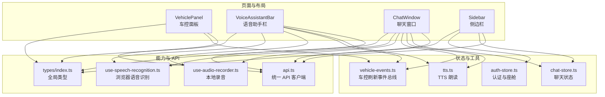
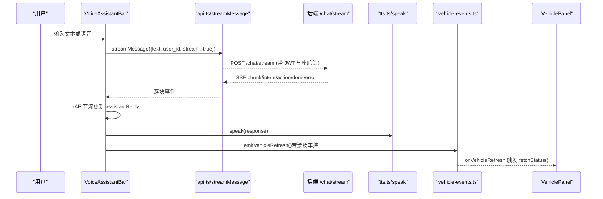
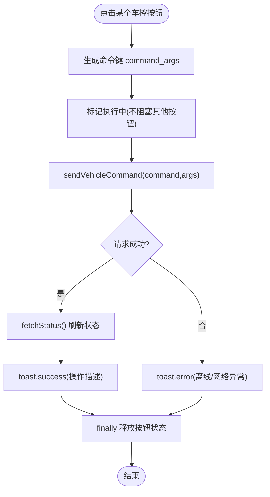
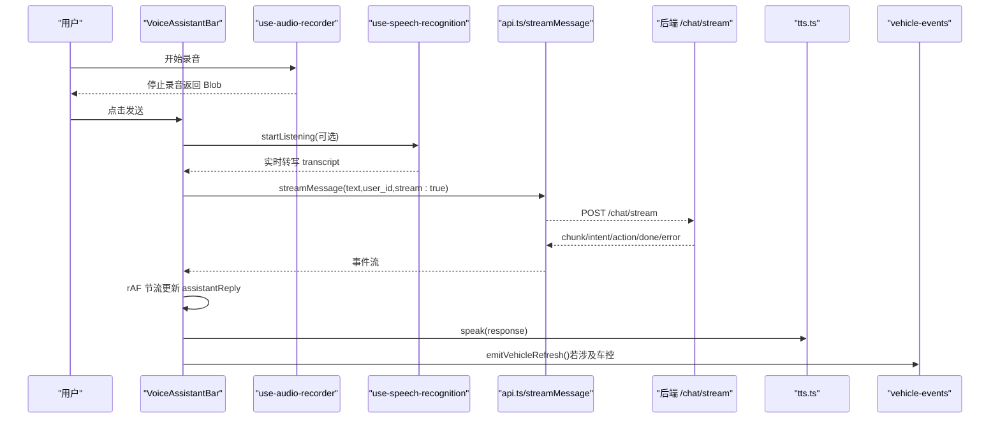
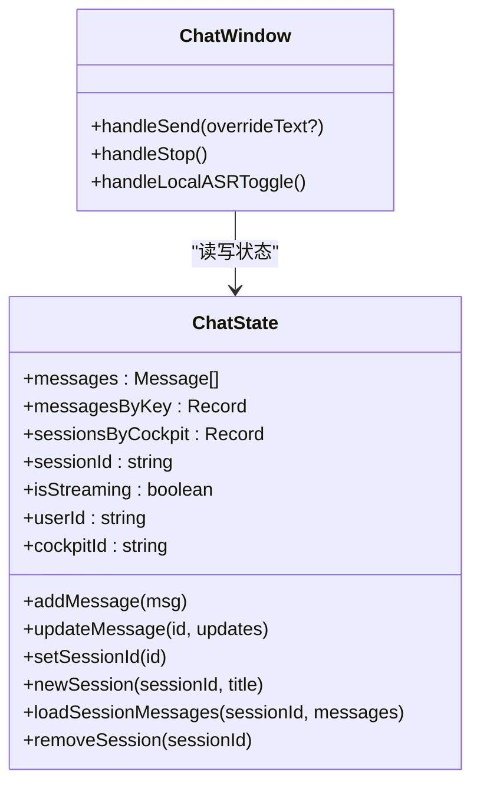
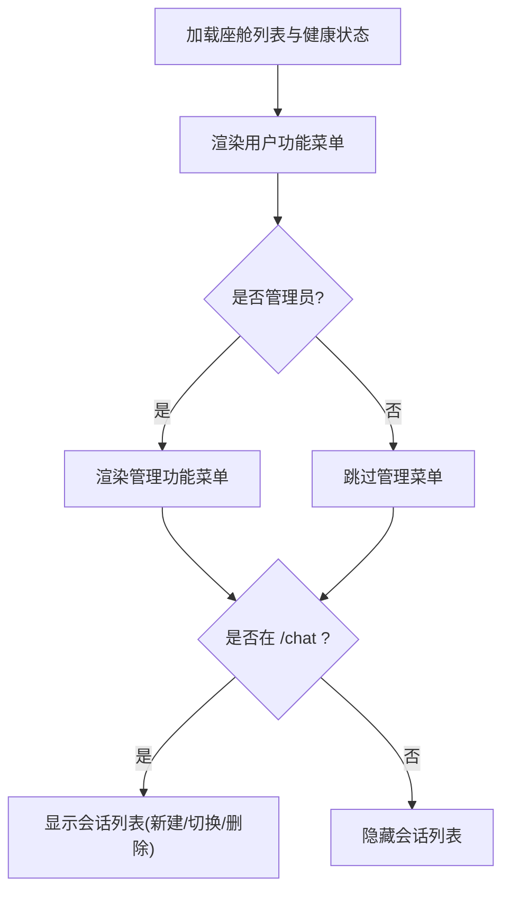
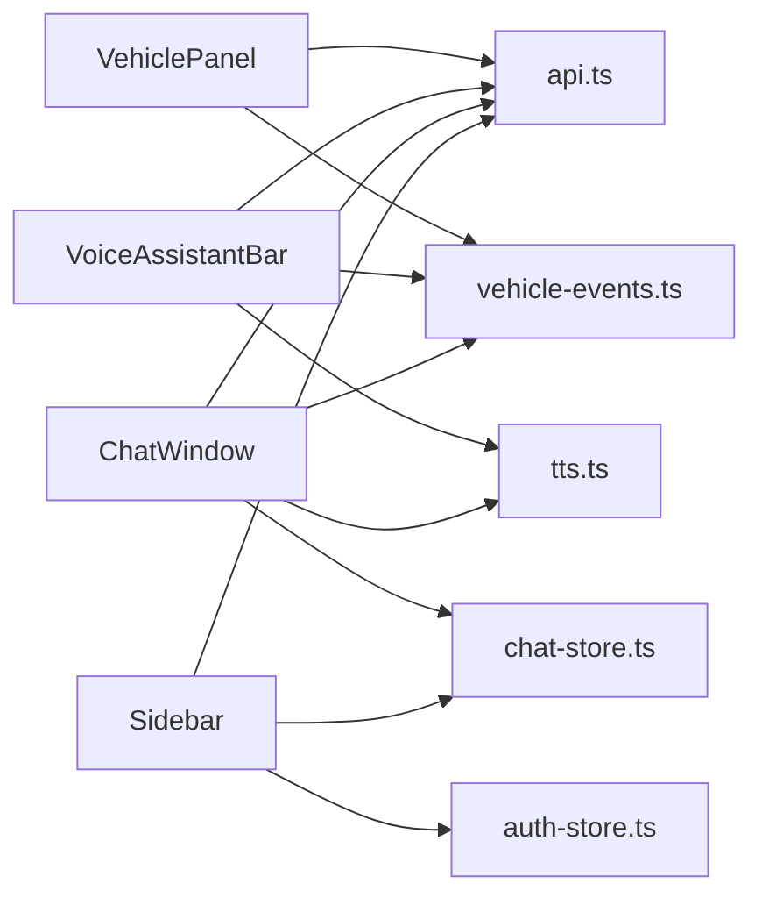

# 核心组件实现

<cite>
**本文引用的文件**   
- [vehicle-panel.tsx](file://frontend_design/src/components/vehicle/vehicle-panel.tsx)
- [voice-assistant-bar.tsx](file://frontend_design/src/components/vehicle/voice-assistant-bar.tsx)
- [chat-window.tsx](file://frontend_design/src/components/chat/chat-window.tsx)
- [sidebar.tsx](file://frontend_design/src/components/layout/sidebar.tsx)
- [use-audio-recorder.ts](file://frontend_design/src/hooks/use-audio-recorder.ts)
- [use-speech-recognition.ts](file://frontend_design/src/hooks/use-speech-recognition.ts)
- [api.ts](file://frontend_design/src/lib/api.ts)
- [vehicle-events.ts](file://frontend_design/src/lib/vehicle-events.ts)
- [tts.ts](file://frontend_design/src/lib/tts.ts)
- [chat-store.ts](file://frontend_design/src/stores/chat-store.ts)
- [auth-store.ts](file://frontend_design/src/stores/auth-store.ts)
- [index.ts](file://frontend_design/src/types/index.ts)
</cite>

## 目录
1. [简介](#简介)
2. [项目结构](#项目结构)
3. [核心组件](#核心组件)
4. [架构总览](#架构总览)
5. [详细组件分析](#详细组件分析)
6. [依赖关系分析](#依赖关系分析)
7. [性能与优化](#性能与优化)
8. [故障排查指南](#故障排查指南)
9. [结论](#结论)
10. [附录：接口与事件契约](#附录接口与事件契约)

## 简介
本技术文档聚焦 NexusCockpit 前端核心组件的实现与设计，围绕以下目标展开：
- 车控面板 VehiclePanel 的组件架构与子模块（空调、座椅、媒体、导航、车窗、状态）设计模式
- 语音助手栏 VoiceAssistantBar 的录音状态管理、实时反馈机制与流式响应处理
- 聊天窗口 ChatWindow 的消息渲染、流式响应、用户交互设计与多会话管理
- 侧边栏 Sidebar 的路由导航、权限控制与响应式适配
- 组件 Props 接口定义、事件处理机制、状态提升模式
- 组件复用策略、性能优化技巧、错误边界处理最佳实践

## 项目结构
前端采用 Next.js + React 组织方式，核心 UI 位于 components 目录，业务逻辑通过 hooks 与 stores 解耦，API 访问集中在 lib/api.ts。类型定义统一在 types/index.ts。

图表来源
- [vehicle-panel.tsx:1-717](file://frontend_design/src/components/vehicle/vehicle-panel.tsx#L1-L717)
- [voice-assistant-bar.tsx:1-430](file://frontend_design/src/components/vehicle/voice-assistant-bar.tsx#L1-L430)
- [chat-window.tsx:1-572](file://frontend_design/src/components/chat/chat-window.tsx#L1-L572)
- [sidebar.tsx:1-402](file://frontend_design/src/components/layout/sidebar.tsx#L1-L402)
- [use-audio-recorder.ts:1-302](file://frontend_design/src/hooks/use-audio-recorder.ts#L1-L302)
- [use-speech-recognition.ts:1-113](file://frontend_design/src/hooks/use-speech-recognition.ts#L1-L113)
- [api.ts:1-745](file://frontend_design/src/lib/api.ts#L1-L745)
- [vehicle-events.ts:1-34](file://frontend_design/src/lib/vehicle-events.ts#L1-L34)
- [tts.ts:1-75](file://frontend_design/src/lib/tts.ts#L1-L75)
- [chat-store.ts:1-286](file://frontend_design/src/stores/chat-store.ts#L1-L286)
- [auth-store.ts:1-223](file://frontend_design/src/stores/auth-store.ts#L1-L223)
- [index.ts:1-264](file://frontend_design/src/types/index.ts#L1-L264)

章节来源
- [vehicle-panel.tsx:1-717](file://frontend_design/src/components/vehicle/vehicle-panel.tsx#L1-L717)
- [voice-assistant-bar.tsx:1-430](file://frontend_design/src/components/vehicle/voice-assistant-bar.tsx#L1-L430)
- [chat-window.tsx:1-572](file://frontend_design/src/components/chat/chat-window.tsx#L1-L572)
- [sidebar.tsx:1-402](file://frontend_design/src/components/layout/sidebar.tsx#L1-L402)
- [api.ts:1-745](file://frontend_design/src/lib/api.ts#L1-L745)
- [chat-store.ts:1-286](file://frontend_design/src/stores/chat-store.ts#L1-L286)
- [auth-store.ts:1-223](file://frontend_design/src/stores/auth-store.ts#L1-L223)
- [index.ts:1-264](file://frontend_design/src/types/index.ts#L1-L264)

## 核心组件
本节概述四大核心组件的职责与协作方式：
- VehiclePanel：聚合车控子模块，负责状态拉取、命令下发、离线降级与 GPS 定位更新
- VoiceAssistantBar：集成语音输入（浏览器 Web Speech API 与本地 ASR）、流式回复、快捷指令与车控联动
- ChatWindow：完整对话界面，支持 SSE 流式、Markdown 渲染、多会话管理与自动降级
- Sidebar：基于角色的导航菜单、座舱切换与会话列表管理

章节来源
- [vehicle-panel.tsx:1-717](file://frontend_design/src/components/vehicle/vehicle-panel.tsx#L1-L717)
- [voice-assistant-bar.tsx:1-430](file://frontend_design/src/components/vehicle/voice-assistant-bar.tsx#L1-L430)
- [chat-window.tsx:1-572](file://frontend_design/src/components/chat/chat-window.tsx#L1-L572)
- [sidebar.tsx:1-402](file://frontend_design/src/components/layout/sidebar.tsx#L1-L402)

## 架构总览
整体数据流遵循“组件 → Store/Hook → API → 后端”的分层模式，并通过事件总线进行跨组件联动。

图表来源
- [voice-assistant-bar.tsx:120-229](file://frontend_design/src/components/vehicle/voice-assistant-bar.tsx#L120-L229)
- [api.ts:258-338](file://frontend_design/src/lib/api.ts#L258-L338)
- [tts.ts:22-61](file://frontend_design/src/lib/tts.ts#L22-L61)
- [vehicle-events.ts:22-33](file://frontend_design/src/lib/vehicle-events.ts#L22-L33)
- [vehicle-panel.tsx:200-207](file://frontend_design/src/components/vehicle/vehicle-panel.tsx#L200-L207)

## 详细组件分析

### 车控面板 VehiclePanel
职责与架构
- 聚合子模块：空调、座椅、媒体、导航、车窗、车辆状态概览
- 状态来源：初始化调用 getVehicleStatus；操作后异步刷新；GPS 定位更新后刷新；订阅 vehicle-events 刷新
- 离线降级：后端不可用时使用 MOCK_STATUS 并提示模拟模式
- 并发控制：以 command_args 组合作为唯一 key 标记执行中命令，避免按钮阻塞其他操作

关键流程
- 初始化音频元素与播放控制：根据 media.playing 与 track.url 动态设置 AudioElement
- 发送命令 handleCommand：标记执行中 → 调用 sendVehicleCommand → 成功则 toast 提示并刷新状态 → finally 释放按钮
- 座位/空调/媒体/导航/车窗等子卡片均通过同一 handleCommand 分发

图表来源
- [vehicle-panel.tsx:222-245](file://frontend_design/src/components/vehicle/vehicle-panel.tsx#L222-L245)
- [vehicle-panel.tsx:139-155](file://frontend_design/src/components/vehicle/vehicle-panel.tsx#L139-L155)
- [vehicle-panel.tsx:200-207](file://frontend_design/src/components/vehicle/vehicle-panel.tsx#L200-L207)
- [vehicle-panel.tsx:111-129](file://frontend_design/src/components/vehicle/vehicle-panel.tsx#L111-L129)

组件 Props 与内部状态
- 无外部 Props，内部状态包括 status、offline、navInput、executingCmds、mountedRef、audioRef
- 通过 useAuth 获取 cockpitId，座舱切换时重新拉取状态

错误处理与降级
- 拉取失败进入离线模式，显示模拟数据与提示
- 命令失败给出离线/网络异常提示
- 音频播放捕获异常静默处理

性能考虑
- 命令并行控制避免 UI 卡顿
- 仅对必要字段监听变化以触发音频播放
- 定位轮询间隔较长，降低频繁刷新

章节来源
- [vehicle-panel.tsx:1-717](file://frontend_design/src/components/vehicle/vehicle-panel.tsx#L1-L717)
- [api.ts:357-373](file://frontend_design/src/lib/api.ts#L357-L373)
- [vehicle-events.ts:22-33](file://frontend_design/src/lib/vehicle-events.ts#L22-L33)
- [index.ts:76-102](file://frontend_design/src/types/index.ts#L76-L102)

### 语音助手栏 VoiceAssistantBar
功能要点
- 双路语音输入：浏览器 Web Speech API 与本地 ASR（录制 WAV 上传后端 SenseVoice）
- 流式回复：SSE 逐块更新，rAF 节流渲染，AbortController 中断旧请求
- 快捷指令：一键发送常用车控指令
- 车控联动：当检测到意图/动作包含车控关键词时，触发 vehicle-events 刷新面板
- TTS 朗读：收到 done 事件后调用 speak 朗读回复

图表来源
- [voice-assistant-bar.tsx:132-229](file://frontend_design/src/components/vehicle/voice-assistant-bar.tsx#L132-L229)
- [use-audio-recorder.ts:136-255](file://frontend_design/src/hooks/use-audio-recorder.ts#L136-L255)
- [use-speech-recognition.ts:76-96](file://frontend_design/src/hooks/use-speech-recognition.ts#L76-L96)
- [api.ts:258-338](file://frontend_design/src/lib/api.ts#L258-L338)
- [tts.ts:22-61](file://frontend_design/src/lib/tts.ts#L22-L61)
- [vehicle-events.ts:22-33](file://frontend_design/src/lib/vehicle-events.ts#L22-L33)

状态管理与交互
- isStreaming、assistantReply、replyLoading、asrLoading 控制 UI 状态
- streamingContentRef 缓存流式内容，scheduleFlush 使用 requestAnimationFrame 合并更新
- AbortController 用于取消正在进行的流式请求，避免阻塞

错误处理
- 区分 StreamError 的状态码：404/501 走降级提示；401 鉴权失败；5xx 服务异常；其他网络异常
- 语音识别错误提示与录音状态提示

章节来源
- [voice-assistant-bar.tsx:1-430](file://frontend_design/src/components/vehicle/voice-assistant-bar.tsx#L1-L430)
- [use-audio-recorder.ts:1-302](file://frontend_design/src/hooks/use-audio-recorder.ts#L1-L302)
- [use-speech-recognition.ts:1-113](file://frontend_design/src/hooks/use-speech-recognition.ts#L1-L113)
- [api.ts:258-338](file://frontend_design/src/lib/api.ts#L258-L338)
- [tts.ts:1-75](file://frontend_design/src/lib/tts.ts#L1-L75)
- [vehicle-events.ts:1-34](file://frontend_design/src/lib/vehicle-events.ts#L1-L34)

### 聊天窗口 ChatWindow
功能要点
- 消息渲染：用户/助手气泡样式，Markdown 渲染（ReactMarkdown + remarkGfm），时间戳与意图标签
- 流式接收：SSE 事件流，rAF 节流更新占位消息，done 后写入最终内容与 intent/action
- 多会话管理：按座舱分组会话列表，新建/切换/删除会话，历史消息加载
- 降级策略：流式失败时回退到非流式 sendMessage
- 车控联动：检测 action/intent 包含车控关键词时触发 vehicle-events 刷新面板
- TTS 朗读：完成回复后自动朗读

图表来源
- [chat-store.ts:75-286](file://frontend_design/src/stores/chat-store.ts#L75-L286)
- [chat-window.tsx:197-343](file://frontend_design/src/components/chat/chat-window.tsx#L197-L343)

交互与事件
- Enter 发送，Shift+Enter 换行
- 语音识别结果同步至输入框，识别停止后自动发送
- 流式过程中可停止生成（AbortController.abort）

错误处理
- 流式错误分类提示与降级
- 服务不可用时的友好提示

章节来源
- [chat-window.tsx:1-572](file://frontend_design/src/components/chat/chat-window.tsx#L1-L572)
- [chat-store.ts:1-286](file://frontend_design/src/stores/chat-store.ts#L1-L286)
- [api.ts:244-338](file://frontend_design/src/lib/api.ts#L244-L338)
- [vehicle-events.ts:22-33](file://frontend_design/src/lib/vehicle-events.ts#L22-L33)
- [tts.ts:22-61](file://frontend_design/src/lib/tts.ts#L22-L61)

### 侧边栏 Sidebar
职责与特性
- 导航菜单：用户功能与管理功能分区，管理员额外可见运营总览、系统监控、管理设置
- 权限控制：基于 RBAC 角色判断是否展示管理区
- 座舱选择器：下拉切换当前座舱，影响所有组件的数据隔离
- 会话列表：仅在语音助手页面显示，支持新建/切换/删除会话
- 健康状态：底部常驻显示系统健康状态（healthy/degraded/offline）

图表来源
- [sidebar.tsx:189-191](file://frontend_design/src/components/layout/sidebar.tsx#L189-L191)
- [sidebar.tsx:297-339](file://frontend_design/src/components/layout/sidebar.tsx#L297-L339)
- [sidebar.tsx:94-128](file://frontend_design/src/components/layout/sidebar.tsx#L94-L128)

权限与路由
- 使用 canViewDataPlatform/canViewMiddleware/canAccessSettings 判定管理区可见性
- 使用 next/navigation 的 usePathname 与 useRouter 实现高亮与跳转

章节来源
- [sidebar.tsx:1-402](file://frontend_design/src/components/layout/sidebar.tsx#L1-L402)
- [auth-store.ts:199-222](file://frontend_design/src/stores/auth-store.ts#L199-L222)

## 依赖关系分析
组件间依赖与耦合
- VehiclePanel 依赖 api.ts 的车控接口与 vehicle-events 事件总线
- VoiceAssistantBar 依赖 api.ts 的流式接口、tts.ts 朗读、vehicle-events 联动、hooks 录音与识别
- ChatWindow 依赖 chat-store 多会话状态、api.ts 流式与非流式接口、tts.ts、vehicle-events
- Sidebar 依赖 auth-store 的角色与座舱、api.ts 的健康检查与会话管理

图表来源
- [vehicle-panel.tsx:1-717](file://frontend_design/src/components/vehicle/vehicle-panel.tsx#L1-L717)
- [voice-assistant-bar.tsx:1-430](file://frontend_design/src/components/vehicle/voice-assistant-bar.tsx#L1-L430)
- [chat-window.tsx:1-572](file://frontend_design/src/components/chat/chat-window.tsx#L1-L572)
- [sidebar.tsx:1-402](file://frontend_design/src/components/layout/sidebar.tsx#L1-L402)
- [api.ts:1-745](file://frontend_design/src/lib/api.ts#L1-L745)
- [chat-store.ts:1-286](file://frontend_design/src/stores/chat-store.ts#L1-L286)
- [auth-store.ts:1-223](file://frontend_design/src/stores/auth-store.ts#L1-L223)
- [vehicle-events.ts:1-34](file://frontend_design/src/lib/vehicle-events.ts#L1-L34)
- [tts.ts:1-75](file://frontend_design/src/lib/tts.ts#L1-L75)

章节来源
- [api.ts:1-745](file://frontend_design/src/lib/api.ts#L1-L745)
- [chat-store.ts:1-286](file://frontend_design/src/stores/chat-store.ts#L1-L286)
- [auth-store.ts:1-223](file://frontend_design/src/stores/auth-store.ts#L1-L223)
- [vehicle-events.ts:1-34](file://frontend_design/src/lib/vehicle-events.ts#L1-L34)
- [tts.ts:1-75](file://frontend_design/src/lib/tts.ts#L1-L75)

## 性能与优化
- 流式渲染节流：VoiceAssistantBar 与 ChatWindow 均采用 useRef 缓存内容 + requestAnimationFrame 合并更新，避免高频 setState 导致卡顿
- 并发命令控制：VehiclePanel 使用 Set 记录执行中的命令键，避免按钮阻塞其他操作
- 音频资源管理：VehiclePanel 使用 HTMLAudioElement 并正确清理；use-audio-recorder 使用 ScriptProcessorNode 采集 PCM 并编码为 WAV，减少后端转换开销
- 定位轮询降频：VehiclePanel 将 GPS 轮询间隔设为 5 分钟，仅刷新坐标缓存
- 降级策略：流式失败时自动回退非流式请求；后端不可用时使用 Mock 数据与离线提示

[本节为通用指导，无需具体文件引用]

## 故障排查指南
常见问题与定位
- 流式请求失败：检查 StreamError 状态码（401 鉴权失败、404/501 服务不可用、5xx 后端异常），确认 API_BASE 与网关可达
- 语音识别不支持：浏览器需支持 Web Speech API；如不支持，使用本地 ASR 录音上传
- 录音失败：检查麦克风权限与设备可用性；查看 use-audio-recorder 的错误信息
- 车控面板未刷新：确认 voice-assistant-bar 或 chat-window 是否正确触发 emitVehicleRefresh，且 vehicle-panel 已订阅 onVehicleRefresh
- 多会话状态错乱：检查 chat-store 的 sessionsByCockpit 与 messagesByKey 映射是否正确持久化与恢复

章节来源
- [api.ts:258-338](file://frontend_design/src/lib/api.ts#L258-L338)
- [use-speech-recognition.ts:26-74](file://frontend_design/src/hooks/use-speech-recognition.ts#L26-L74)
- [use-audio-recorder.ts:136-190](file://frontend_design/src/hooks/use-audio-recorder.ts#L136-L190)
- [vehicle-events.ts:22-33](file://frontend_design/src/lib/vehicle-events.ts#L22-L33)
- [chat-store.ts:260-286](file://frontend_design/src/stores/chat-store.ts#L260-L286)

## 结论
NexusCockpit 的前端核心组件通过清晰的分层与解耦实现了高可用、高性能与良好的用户体验。VehiclePanel 提供稳定的车控交互与离线降级；VoiceAssistantBar 与 ChatWindow 共同构建了流畅的语音/文字对话体验，并在必要时联动车控面板；Sidebar 提供了基于角色的导航与会话管理能力。结合事件总线与统一的 API 客户端，各组件之间松耦合、易扩展，适合持续演进。

[本节为总结，无需具体文件引用]

## 附录：接口与事件契约
- 车控命令与状态
  - 命令：VehicleCommand（command、arguments）
  - 状态：VehicleStatus（climate、windows、seats、media、navigation、status）
- 对话与流式事件
  - 请求：ChatRequest（text、user_id、session_id?、stream?）
  - 响应：ChatResponse（response、intent?、action?、trace_id?）
  - 流事件：StreamEvent（type: chunk/intent/action/experts/done/error，data 对应字段）
- 会话与会话元数据
  - SessionMeta（session_id、title、message_count、created_at、last_message_at）
- 认证与角色
  - AuthState（token、userId、role、cockpitId、isAuthenticated）
  - UserRole（super_admin、cockpit_admin、cockpit_user、cockpit_viewer）
- 事件总线
  - emitVehicleRefresh/onVehicleRefresh：用于跨组件通知车控状态刷新

章节来源
- [index.ts:19-102](file://frontend_design/src/types/index.ts#L19-L102)
- [index.ts:238-264](file://frontend_design/src/types/index.ts#L238-L264)
- [vehicle-events.ts:22-33](file://frontend_design/src/lib/vehicle-events.ts#L22-L33)
- [auth-store.ts:36-52](file://frontend_design/src/stores/auth-store.ts#L36-L52)