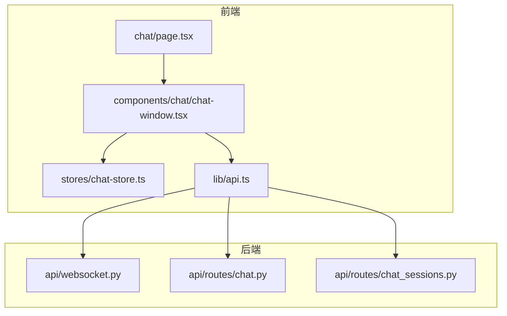
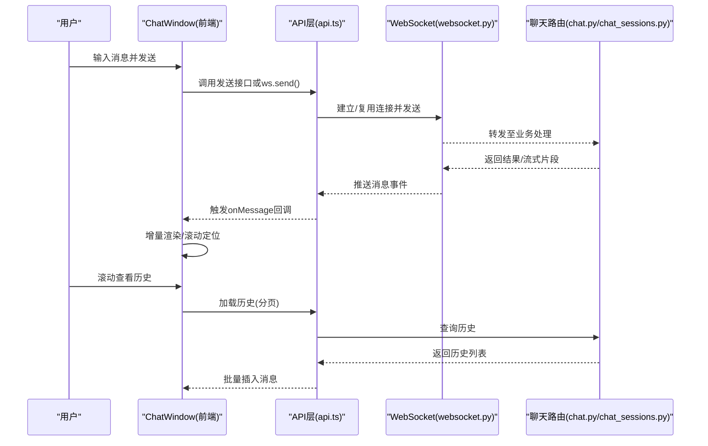
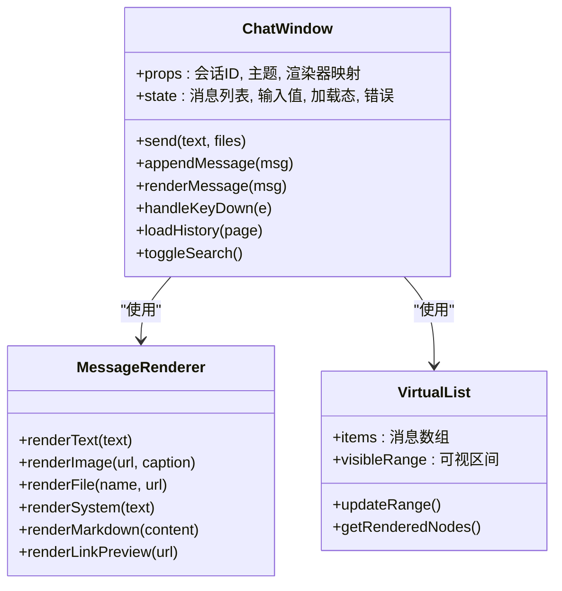
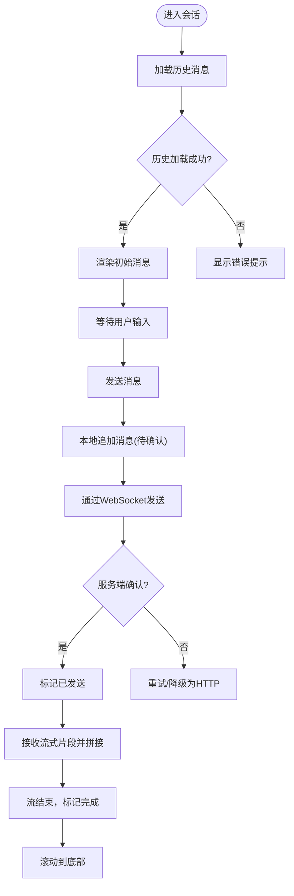
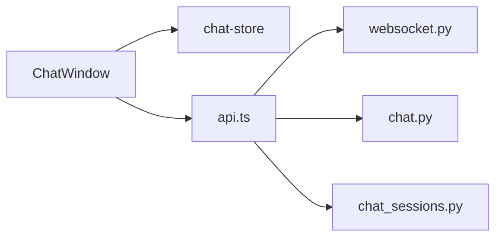

# 聊天窗口组件

<cite>
**本文引用的文件**   
- [chat-window.tsx](file://frontend_design/src/components/chat/chat-window.tsx)
- [page.tsx](file://frontend_design/src/app/chat/page.tsx)
- [chat-store.ts](file://frontend_design/src/stores/chat-store.ts)
- [api.ts](file://frontend_design/src/lib/api.ts)
- [websocket.ts](file://backend_design/nexus/api/websocket.py)
- [chat.py](file://backend_design/nexus/api/routes/chat.py)
- [chat_sessions.py](file://backend_design/nexus/api/routes/chat_sessions.py)
</cite>

## 目录
1. [简介](#简介)
2. [项目结构](#项目结构)
3. [核心组件](#核心组件)
4. [架构总览](#架构总览)
5. [详细组件分析](#详细组件分析)
6. [依赖分析](#依赖分析)
7. [性能考虑](#性能考虑)
8. [故障排查指南](#故障排查指南)
9. [结论](#结论)
10. [附录](#附录)

## 简介
本技术文档围绕前端“聊天窗口”组件展开，系统性阐述 ChatWindow 的架构设计、消息渲染引擎、流式响应处理、用户交互设计，以及后端 WebSocket 连接管理、断线重连、消息持久化与历史加载等关键机制。同时覆盖虚拟滚动优化、内存管理、性能监控、消息格式化规则、自定义渲染器、主题定制、移动端适配、键盘快捷键与搜索过滤等用户体验优化点，帮助读者快速理解并扩展该组件。

## 项目结构
前端侧：
- 页面入口：位于 chat 路由页面中挂载聊天窗口组件。
- 组件实现：聊天窗口主组件负责 UI 布局、输入框、消息列表、工具栏与状态联动。
- 状态管理：集中维护会话、消息列表、发送/接收状态、错误信息等。
- API 层：封装 HTTP 请求（如历史消息加载、上传）与 WebSocket 事件订阅。

后端侧：
- WebSocket 服务：提供实时消息通道，支持服务端推送与客户端上报。
- 聊天路由：提供历史消息查询、会话管理等 REST 接口。
- 会话管理：负责消息持久化、分页加载、清理策略等。

图表来源
- [page.tsx:1-200](file://frontend_design/src/app/chat/page.tsx#L1-L200)
- [chat-window.tsx:1-200](file://frontend_design/src/components/chat/chat-window.tsx#L1-L200)
- [chat-store.ts:1-200](file://frontend_design/src/stores/chat-store.ts#L1-L200)
- [api.ts:1-200](file://frontend_design/src/lib/api.ts#L1-L200)
- [websocket.py:1-200](file://backend_design/nexus/api/websocket.py#L1-L200)
- [chat.py:1-200](file://backend_design/nexus/api/routes/chat.py#L1-L200)
- [chat_sessions.py:1-200](file://backend_design/nexus/api/routes/chat_sessions.py#L1-L200)

章节来源
- [page.tsx:1-200](file://frontend_design/src/app/chat/page.tsx#L1-L200)
- [chat-window.tsx:1-200](file://frontend_design/src/components/chat/chat-window.tsx#L1-L200)
- [chat-store.ts:1-200](file://frontend_design/src/stores/chat-store.ts#L1-L200)
- [api.ts:1-200](file://frontend_design/src/lib/api.ts#L1-L200)
- [websocket.py:1-200](file://backend_design/nexus/api/websocket.py#L1-L200)
- [chat.py:1-200](file://backend_design/nexus/api/routes/chat.py#L1-L200)
- [chat_sessions.py:1-200](file://backend_design/nexus/api/routes/chat_sessions.py#L1-L200)

## 核心组件
- ChatWindow 组件
  - 职责：承载聊天界面，管理输入、发送、消息列表渲染、滚动定位、错误提示、加载态展示。
  - 关键能力：
    - 消息类型识别与渲染（文本、图片、文件、系统消息）。
    - Markdown 渲染与代码高亮（通过外部库集成）。
    - 链接预览（URL 解析与缩略图抓取）。
    - 流式响应处理（增量拼接、光标控制、防抖更新）。
    - 虚拟滚动（长列表优化）。
    - 键盘快捷键（回车发送、Shift+Enter 换行、Ctrl+F 搜索）。
    - 移动端适配（触摸手势、软键盘避让、自适应布局）。
- 状态存储（chat-store）
  - 职责：维护当前会话 ID、消息数组、发送/接收状态、错误信息、搜索关键字、是否正在加载历史等。
  - 关键操作：追加消息、批量插入历史、标记完成、清空会话、切换会话。
- API 层（api.ts）
  - 职责：封装历史消息加载、上传文件、WebSocket 初始化与事件绑定。
  - 关键方法：获取历史、发送消息、监听 ws 事件、重连逻辑。
- 后端 WebSocket（websocket.py）
  - 职责：建立连接、鉴权、广播/点对点消息转发、心跳检测、异常恢复。
- 聊天路由（chat.py、chat_sessions.py）
  - 职责：REST 接口提供历史消息分页、会话创建/切换、消息归档与清理。

章节来源
- [chat-window.tsx:1-200](file://frontend_design/src/components/chat/chat-window.tsx#L1-L200)
- [chat-store.ts:1-200](file://frontend_design/src/stores/chat-store.ts#L1-L200)
- [api.ts:1-200](file://frontend_design/src/lib/api.ts#L1-L200)
- [websocket.py:1-200](file://backend_design/nexus/api/websocket.py#L1-L200)
- [chat.py:1-200](file://backend_design/nexus/api/routes/chat.py#L1-L200)
- [chat_sessions.py:1-200](file://backend_design/nexus/api/routes/chat_sessions.py#L1-L200)

## 架构总览
整体采用前后端分离架构，前端通过 REST 拉取历史消息，通过 WebSocket 进行实时通信；后端提供消息路由、持久化与检索能力。

图表来源
- [chat-window.tsx:1-200](file://frontend_design/src/components/chat/chat-window.tsx#L1-L200)
- [api.ts:1-200](file://frontend_design/src/lib/api.ts#L1-L200)
- [websocket.py:1-200](file://backend_design/nexus/api/websocket.py#L1-L200)
- [chat.py:1-200](file://backend_design/nexus/api/routes/chat.py#L1-L200)
- [chat_sessions.py:1-200](file://backend_design/nexus/api/routes/chat_sessions.py#L1-L200)

## 详细组件分析

### ChatWindow 组件
- 渲染引擎
  - 消息类型分发：根据消息类型字段选择对应渲染器（文本、图片、文件、系统消息）。
  - Markdown 渲染：将文本内容转换为富文本，启用代码块语法高亮。
  - 链接预览：自动识别 URL，发起元数据抓取并展示标题/摘要/缩略图。
- 流式响应处理
  - 增量拼接：对服务端推送的片段进行追加，避免整段替换导致的闪烁。
  - 光标控制：保持滚动到底部，必要时暂停自动滚动以便用户阅读。
  - 防抖更新：在高频推送场景下合并更新批次，降低重排开销。
- 用户交互
  - 键盘快捷键：Enter 发送，Shift+Enter 换行，Ctrl+F 打开搜索面板。
  - 移动端适配：软键盘弹出时调整视口高度，长按复制/分享，滑动删除草稿。
  - 搜索过滤：按关键字匹配消息内容与附件名称，高亮命中片段。
- 虚拟滚动与内存管理
  - 可视区域渲染：仅渲染可见范围内的消息节点，减少 DOM 数量。
  - 回收策略：超出可视范围的消息节点及时卸载，释放内存。
  - 占位骨架：在首屏或历史加载时显示骨架屏，提升感知性能。
- 主题与自定义渲染器
  - 主题变量：通过 CSS 变量或主题配置对象统一控制颜色、字体、间距。
  - 自定义渲染器：为特定消息类型注册渲染函数，实现业务扩展（如卡片、表格、图表）。

图表来源
- [chat-window.tsx:1-200](file://frontend_design/src/components/chat/chat-window.tsx#L1-L200)

章节来源
- [chat-window.tsx:1-200](file://frontend_design/src/components/chat/chat-window.tsx#L1-L200)

### 状态管理（chat-store）
- 数据结构
  - 会话标识：当前会话 ID。
  - 消息数组：包含 id、type、content、meta、status、createdAt 等字段。
  - 状态标志：isSending、isLoadingHistory、error、searchKeyword。
- 关键操作
  - appendMessages：批量追加历史消息，保持顺序与去重。
  - markComplete：标记某条消息为完成态，停止流式拼接。
  - clearSession：清空当前会话并重置状态。
  - setSearchKeyword：设置搜索关键字并触发过滤。
- 副作用与同步
  - 与 WebSocket 事件同步：收到新消息时追加到 store。
  - 与本地缓存同步：可选持久化最近 N 条消息到 localStorage。

图表来源
- [chat-store.ts:1-200](file://frontend_design/src/stores/chat-store.ts#L1-L200)
- [api.ts:1-200](file://frontend_design/src/lib/api.ts#L1-L200)
- [websocket.py:1-200](file://backend_design/nexus/api/websocket.py#L1-L200)

章节来源
- [chat-store.ts:1-200](file://frontend_design/src/stores/chat-store.ts#L1-L200)
- [api.ts:1-200](file://frontend_design/src/lib/api.ts#L1-L200)

### API 层（api.ts）
- 历史消息加载
  - 参数：会话 ID、页码、每页大小、时间范围。
  - 返回：分页消息列表与下一页游标。
- 发送消息
  - 优先走 WebSocket 发送，失败回退到 HTTP。
  - 携带消息体、附件引用、上下文信息。
- WebSocket 管理
  - 连接建立：鉴权头、心跳保活、错误回调。
  - 事件订阅：onMessage、onStream、onError、onClose。
  - 断线重连：指数退避、最大重试次数、抖动随机。
- 文件上传
  - 分片上传、进度回调、断点续传（可选）。

章节来源
- [api.ts:1-200](file://frontend_design/src/lib/api.ts#L1-L200)

### 后端 WebSocket（websocket.py）
- 连接生命周期
  - 握手与鉴权：校验令牌、租户上下文。
  - 心跳检测：定时 ping/pong，超时断开。
  - 异常恢复：捕获网络异常，记录日志，通知前端重连。
- 消息路由
  - 点对点：基于会话 ID 路由到目标客户端。
  - 广播：用于全局通知或系统消息。
- 流式输出
  - 分块推送：按片段推送，附带序列号与完成标志。
  - 幂等性：客户端依据序列号去重与排序。

章节来源
- [websocket.py:1-200](file://backend_design/nexus/api/websocket.py#L1-L200)

### 聊天路由（chat.py、chat_sessions.py）
- 历史消息查询
  - 分页参数：page、pageSize、afterId、beforeId。
  - 过滤条件：时间范围、消息类型、关键词。
- 会话管理
  - 创建/切换会话：生成会话 ID、初始化上下文。
  - 清理策略：过期会话归档、冷数据迁移。
- 消息持久化
  - 写入策略：异步落盘、事务保证、索引优化。
  - 读取策略：游标分页、预取相邻页、缓存热点。

章节来源
- [chat.py:1-200](file://backend_design/nexus/api/routes/chat.py#L1-L200)
- [chat_sessions.py:1-200](file://backend_design/nexus/api/routes/chat_sessions.py#L1-L200)

## 依赖分析
- 前端内部依赖
  - ChatWindow 依赖 chat-store 进行状态读写，依赖 api.ts 进行网络交互。
  - 渲染引擎依赖 Markdown 与代码高亮库，依赖链接预览服务。
- 前后端耦合点
  - WebSocket 协议约定：事件名、消息体结构、序列号与完成标志。
  - REST 接口契约：历史消息分页字段、错误码规范。
- 潜在循环依赖
  - 组件与 store 之间单向依赖，避免双向绑定导致循环。
- 外部依赖
  - Markdown 渲染库、代码高亮库、虚拟滚动库、主题配置库。

图表来源
- [chat-window.tsx:1-200](file://frontend_design/src/components/chat/chat-window.tsx#L1-L200)
- [chat-store.ts:1-200](file://frontend_design/src/stores/chat-store.ts#L1-L200)
- [api.ts:1-200](file://frontend_design/src/lib/api.ts#L1-L200)
- [websocket.py:1-200](file://backend_design/nexus/api/websocket.py#L1-L200)
- [chat.py:1-200](file://backend_design/nexus/api/routes/chat.py#L1-L200)
- [chat_sessions.py:1-200](file://backend_design/nexus/api/routes/chat_sessions.py#L1-L200)

章节来源
- [chat-window.tsx:1-200](file://frontend_design/src/components/chat/chat-window.tsx#L1-L200)
- [chat-store.ts:1-200](file://frontend_design/src/stores/chat-store.ts#L1-L200)
- [api.ts:1-200](file://frontend_design/src/lib/api.ts#L1-L200)
- [websocket.py:1-200](file://backend_design/nexus/api/websocket.py#L1-L200)
- [chat.py:1-200](file://backend_design/nexus/api/routes/chat.py#L1-L200)
- [chat_sessions.py:1-200](file://backend_design/nexus/api/routes/chat_sessions.py#L1-L200)

## 性能考虑
- 虚拟滚动
  - 仅渲染可视区节点，显著降低 DOM 数量与重排成本。
  - 动态计算可视区间，随滚动实时更新。
- 内存管理
  - 消息节点回收：不可见节点及时卸载。
  - 大对象释放：图片与文件预览按需加载，完成后释放缓存。
- 渲染优化
  - 增量更新：流式片段拼接而非整段替换。
  - 防抖合并：高频推送合并为批次更新。
- 网络优化
  - 压缩传输：启用 gzip/br。
  - 分片与并发：大文件分片上传，限制并发数。
- 监控与指标
  - 首屏渲染时间、消息渲染耗时、WebSocket 延迟、错误率。
  - 埋点上报：用户行为与性能指标采集。

[本节为通用指导，不直接分析具体文件]

## 故障排查指南
- WebSocket 连接问题
  - 现象：频繁断开、无法接收消息。
  - 排查：检查鉴权头、心跳间隔、服务端日志、网络代理。
  - 修复：调整重连策略、增加抖动、校验证书。
- 历史消息加载失败
  - 现象：空白列表、分页异常。
  - 排查：检查分页参数、数据库索引、缓存一致性。
  - 修复：修正游标逻辑、增加重试与降级。
- 流式渲染卡顿
  - 现象：大量片段导致界面卡顿。
  - 排查：确认防抖与批处理、虚拟滚动配置。
  - 修复：合并更新、限制单次渲染节点数。
- 文件上传失败
  - 现象：进度停滞、重复上传。
  - 排查：检查分片大小、断点续传、服务器限流。
  - 修复：调整分片阈值、增加重试与幂等键。

章节来源
- [websocket.py:1-200](file://backend_design/nexus/api/websocket.py#L1-L200)
- [chat.py:1-200](file://backend_design/nexus/api/routes/chat.py#L1-L200)
- [chat_sessions.py:1-200](file://backend_design/nexus/api/routes/chat_sessions.py#L1-L200)
- [api.ts:1-200](file://frontend_design/src/lib/api.ts#L1-L200)

## 结论
ChatWindow 组件以清晰的职责划分与良好的扩展性为核心，结合虚拟滚动、流式渲染与健壮的网络层，提供了高性能、可定制的聊天体验。通过完善的错误处理与监控体系，可在复杂网络与大数据量场景下保持稳定表现。建议在生产环境持续优化渲染路径与网络策略，并结合业务需求扩展自定义渲染器与主题。

[本节为总结，不直接分析具体文件]

## 附录
- 消息类型与格式
  - 文本：纯文本与 Markdown 混合，支持代码块与行内代码。
  - 图片：支持 JPG/PNG/WebP，提供缩略图与大图预览。
  - 文件：支持常见办公文档与压缩包，提供下载与在线预览。
  - 系统消息：用于通知与状态变更，样式区分于普通消息。
- 自定义渲染器
  - 注册方式：在组件 props 中传入渲染器映射表。
  - 优先级：按消息类型精确匹配，未匹配则回退默认渲染。
- 主题定制
  - 变量项：主色、背景、字体、圆角、阴影、间距。
  - 动态切换：运行时切换主题并即时生效。
- 移动端适配
  - 布局：自适应宽度、底部固定输入区、顶部工具栏折叠。
  - 交互：长按菜单、滑动删除、手势缩放图片。
- 键盘快捷键
  - Enter：发送消息。
  - Shift+Enter：换行。
  - Ctrl+F：打开搜索面板。
  - Esc：关闭搜索或弹窗。
- 搜索过滤
  - 匹配范围：消息内容、附件名称、时间戳。
  - 高亮：命中片段加粗或着色。
  - 导航：上下跳转命中项，支持全选复制。

[本节为概念性说明，不直接分析具体文件]