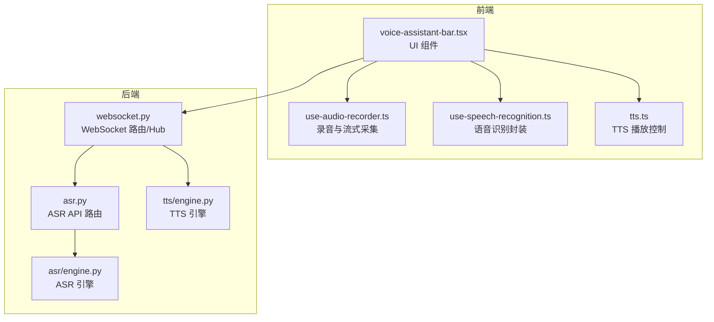
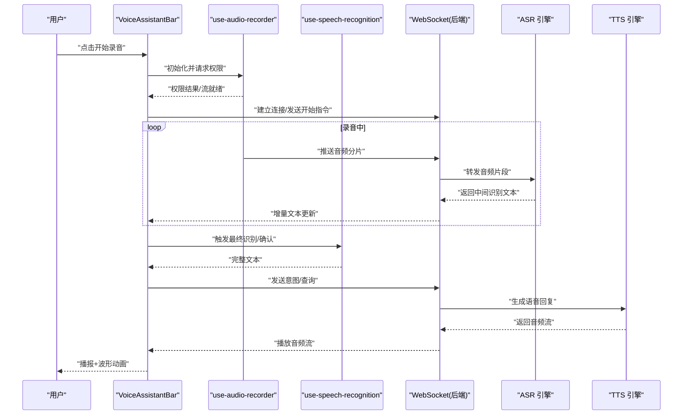
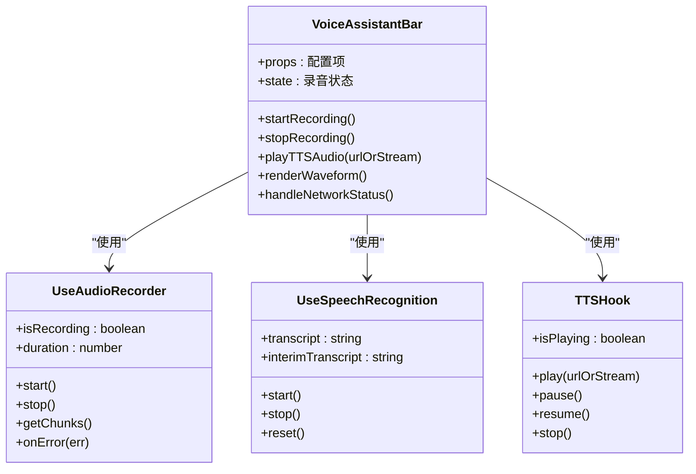
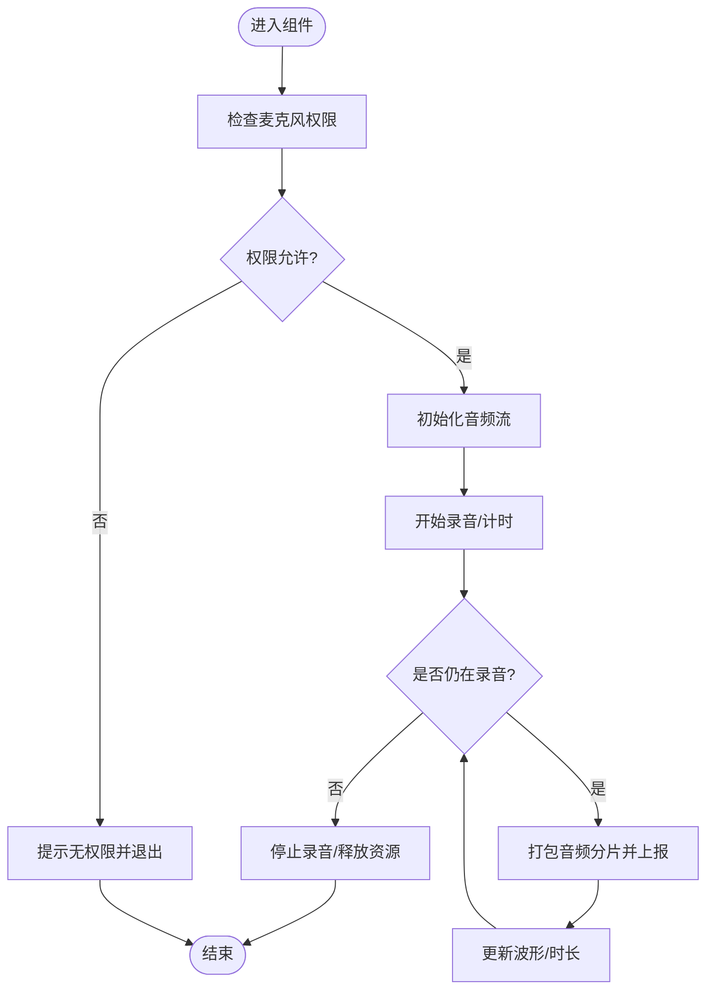
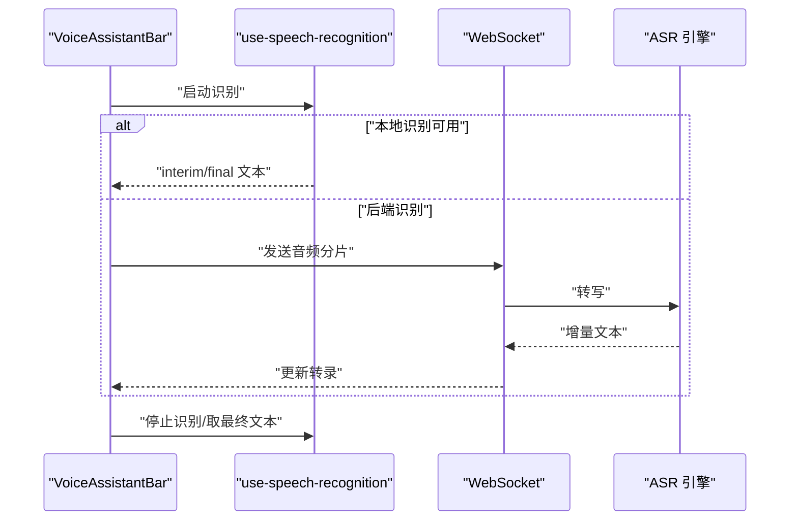
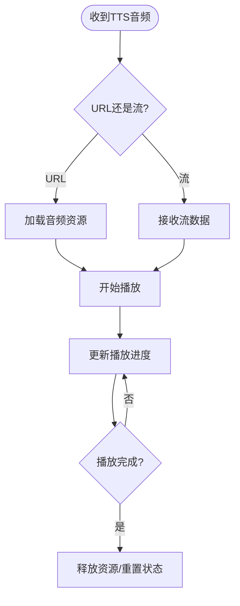
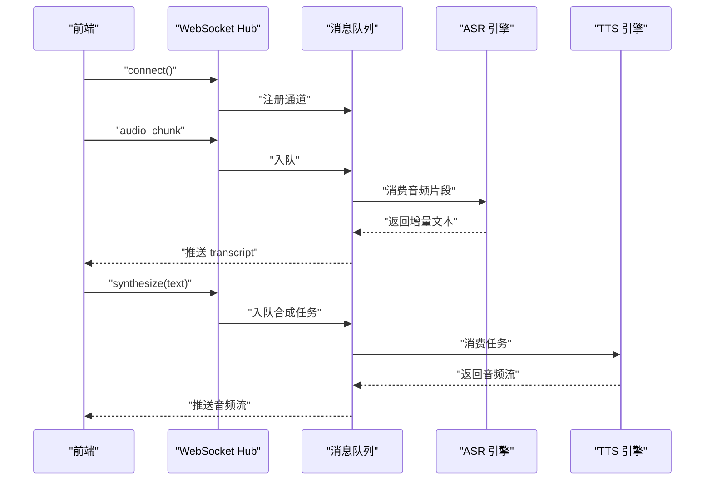
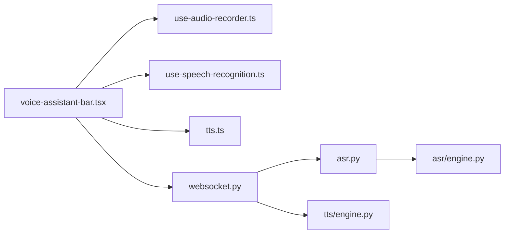

# 语音助手栏组件

<cite>
**本文引用的文件**   
- [voice-assistant-bar.tsx](file://frontend_design/src/components/vehicle/voice-assistant-bar.tsx)
- [use-audio-recorder.ts](file://frontend_design/src/hooks/use-audio-recorder.ts)
- [use-speech-recognition.ts](file://frontend_design/src/hooks/use-speech-recognition.ts)
- [tts.ts](file://frontend_design/src/lib/tts.ts)
- [websocket.ts](file://backend_design/nexus/api/websocket.py)
- [asr.py](file://backend_design/nexus/api/asr.py)
- [engine.py](file://backend_design/nexus/asr/engine.py)
- [engine.py](file://backend_design/nexus/tts/engine.py)
</cite>

## 目录
1. [简介](#简介)
2. [项目结构](#项目结构)
3. [核心组件](#核心组件)
4. [架构总览](#架构总览)
5. [详细组件分析](#详细组件分析)
6. [依赖关系分析](#依赖关系分析)
7. [性能考虑](#性能考虑)
8. [故障排查指南](#故障排查指南)
9. [结论](#结论)
10. [附录](#附录)

## 简介
本技术文档围绕前端“语音助手栏”组件 VoiceAssistantBar，系统阐述其架构设计与实现要点，包括录音状态管理、音频可视化、实时反馈机制；并覆盖麦克风权限获取、音频录制流程、语音识别集成、TTS播放控制等核心能力。同时说明与后端的 WebSocket 实时通信、消息队列管理、错误重试策略，以及 UI 交互（波形可视化、录音时长显示、网络状态指示）的实现思路。最后给出配置项、自定义样式支持、性能优化、移动端适配、浏览器兼容性与无障碍访问建议。

## 项目结构
与语音助手栏相关的前端代码主要位于 frontend_design/src 下，包含组件、Hooks 与工具库；后端提供 ASR/TTS 引擎与 WebSocket 接口。下图展示关键文件与职责：

图表来源
- [voice-assistant-bar.tsx](file://frontend_design/src/components/vehicle/voice-assistant-bar.tsx)
- [use-audio-recorder.ts](file://frontend_design/src/hooks/use-audio-recorder.ts)
- [use-speech-recognition.ts](file://frontend_design/src/hooks/use-speech-recognition.ts)
- [tts.ts](file://frontend_design/src/lib/tts.ts)
- [websocket.py](file://backend_design/nexus/api/websocket.py)
- [asr.py](file://backend_design/nexus/api/asr.py)
- [engine.py](file://backend_design/nexus/asr/engine.py)
- [engine.py](file://backend_design/nexus/tts/engine.py)

章节来源
- [voice-assistant-bar.tsx](file://frontend_design/src/components/vehicle/voice-assistant-bar.tsx)
- [use-audio-recorder.ts](file://frontend_design/src/hooks/use-audio-recorder.ts)
- [use-speech-recognition.ts](file://frontend_design/src/hooks/use-speech-recognition.ts)
- [tts.ts](file://frontend_design/src/lib/tts.ts)
- [websocket.py](file://backend_design/nexus/api/websocket.py)
- [asr.py](file://backend_design/nexus/api/asr.py)
- [engine.py](file://backend_design/nexus/asr/engine.py)
- [engine.py](file://backend_design/nexus/tts/engine.py)

## 核心组件
VoiceAssistantBar 是用户与语音助手交互的入口，负责：
- 录音状态机：空闲、请求权限、录音中、上传/识别中、播放中、错误
- 音频可视化：基于 MediaRecorder/Web Audio API 的波形绘制
- 实时反馈：网络状态、录音时长、识别进度、TTS 播放进度
- 事件总线：将内部状态变化暴露给上层页面或主题系统

章节来源
- [voice-assistant-bar.tsx](file://frontend_design/src/components/vehicle/voice-assistant-bar.tsx)

## 架构总览
整体采用“前端组件 + Hooks + 工具库 + 后端服务”的分层架构。前端通过 WebSocket 与后端保持长连接，完成双向数据交换；ASR 与 TTS 分别由独立引擎提供服务。

图表来源
- [voice-assistant-bar.tsx](file://frontend_design/src/components/vehicle/voice-assistant-bar.tsx)
- [use-audio-recorder.ts](file://frontend_design/src/hooks/use-audio-recorder.ts)
- [use-speech-recognition.ts](file://frontend_design/src/hooks/use-speech-recognition.ts)
- [websocket.py](file://backend_design/nexus/api/websocket.py)
- [asr.py](file://backend_design/nexus/api/asr.py)
- [engine.py](file://backend_design/nexus/asr/engine.py)
- [engine.py](file://backend_design/nexus/tts/engine.py)

## 详细组件分析

### 组件类图与职责

图表来源
- [voice-assistant-bar.tsx](file://frontend_design/src/components/vehicle/voice-assistant-bar.tsx)
- [use-audio-recorder.ts](file://frontend_design/src/hooks/use-audio-recorder.ts)
- [use-speech-recognition.ts](file://frontend_design/src/hooks/use-speech-recognition.ts)
- [tts.ts](file://frontend_design/src/lib/tts.ts)

章节来源
- [voice-assistant-bar.tsx](file://frontend_design/src/components/vehicle/voice-assistant-bar.tsx)
- [use-audio-recorder.ts](file://frontend_design/src/hooks/use-audio-recorder.ts)
- [use-speech-recognition.ts](file://frontend_design/src/hooks/use-speech-recognition.ts)
- [tts.ts](file://frontend_design/src/lib/tts.ts)

### 录音与权限流程
- 权限获取：调用浏览器媒体设备 API 请求麦克风权限，处理拒绝与异常分支
- 流式采集：创建 MediaStream，按固定时间切片写入 Blob，计算音量用于波形
- 状态同步：在组件内维护 isRecording、duration、error 等状态，驱动 UI 更新
- 资源释放：停止时关闭轨道、清理定时器与监听器，避免内存泄漏

图表来源
- [use-audio-recorder.ts](file://frontend_design/src/hooks/use-audio-recorder.ts)
- [voice-assistant-bar.tsx](file://frontend_design/src/components/vehicle/voice-assistant-bar.tsx)

章节来源
- [use-audio-recorder.ts](file://frontend_design/src/hooks/use-audio-recorder.ts)
- [voice-assistant-bar.tsx](file://frontend_design/src/components/vehicle/voice-assistant-bar.tsx)

### 语音识别集成
- 前端可选本地识别：通过浏览器 SpeechRecognition API 进行实时转写
- 后端识别：将音频分片经 WebSocket 推送到后端 ASR 引擎，返回增量文本
- 合并策略：前端对 interim 与 final 文本做去抖与拼接，保证流畅体验

图表来源
- [use-speech-recognition.ts](file://frontend_design/src/hooks/use-speech-recognition.ts)
- [websocket.py](file://backend_design/nexus/api/websocket.py)
- [asr.py](file://backend_design/nexus/api/asr.py)
- [engine.py](file://backend_design/nexus/asr/engine.py)

章节来源
- [use-speech-recognition.ts](file://frontend_design/src/hooks/use-speech-recognition.ts)
- [websocket.py](file://backend_design/nexus/api/websocket.py)
- [asr.py](file://backend_design/nexus/api/asr.py)
- [engine.py](file://backend_design/nexus/asr/engine.py)

### TTS 播放控制
- 播放源：支持 URL 或二进制流
- 控制方法：play/pause/resume/stop，配合进度回调更新 UI
- 并发与抢占：新播放请求可中断上一段，避免重叠
- 错误处理：网络失败、解码异常时回退到文本提示

图表来源
- [tts.ts](file://frontend_design/src/lib/tts.ts)
- [engine.py](file://backend_design/nexus/tts/engine.py)

章节来源
- [tts.ts](file://frontend_design/src/lib/tts.ts)
- [engine.py](file://backend_design/nexus/tts/engine.py)

### WebSocket 实时通信与消息队列
- 连接管理：自动重连、心跳保活、断线恢复
- 消息协议：定义 start/stop/audio_chunk/transcript/synthesize/play 等消息类型
- 队列策略：音频分片入队，按序发送；识别结果与 TTS 音频流并行处理
- 背压控制：当发送速率高于网络吞吐时，丢弃低优先级帧或降采样

图表来源
- [websocket.py](file://backend_design/nexus/api/websocket.py)
- [asr.py](file://backend_design/nexus/api/asr.py)
- [engine.py](file://backend_design/nexus/asr/engine.py)
- [engine.py](file://backend_design/nexus/tts/engine.py)

章节来源
- [websocket.py](file://backend_design/nexus/api/websocket.py)
- [asr.py](file://backend_design/nexus/api/asr.py)
- [engine.py](file://backend_design/nexus/asr/engine.py)
- [engine.py](file://backend_design/nexus/tts/engine.py)

### UI 交互设计
- 波形可视化：基于 Web Audio AnalyserNode 或离线 FFT 计算振幅，渲染 Canvas/SVG 波形
- 录音时长：毫秒级计时器，格式化显示 mm:ss.ms
- 网络状态指示：在线/离线、弱网降级提示、重连倒计时
- 无障碍：为按钮添加 aria-label、role、tabIndex；键盘 Enter/Space 触发；屏幕阅读器朗读当前状态

章节来源
- [voice-assistant-bar.tsx](file://frontend_design/src/components/vehicle/voice-assistant-bar.tsx)

## 依赖关系分析
- 组件耦合：VoiceAssistantBar 依赖三个 Hook/模块，职责清晰，便于替换与测试
- 外部依赖：浏览器媒体 API、Web Audio API、WebSocket、HTMLMediaElement
- 后端依赖：ASR/TTS 引擎、WebSocket Hub、可能的消息队列中间件

图表来源
- [voice-assistant-bar.tsx](file://frontend_design/src/components/vehicle/voice-assistant-bar.tsx)
- [use-audio-recorder.ts](file://frontend_design/src/hooks/use-audio-recorder.ts)
- [use-speech-recognition.ts](file://frontend_design/src/hooks/use-speech-recognition.ts)
- [tts.ts](file://frontend_design/src/lib/tts.ts)
- [websocket.py](file://backend_design/nexus/api/websocket.py)
- [asr.py](file://backend_design/nexus/api/asr.py)
- [engine.py](file://backend_design/nexus/asr/engine.py)
- [engine.py](file://backend_design/nexus/tts/engine.py)

章节来源
- [voice-assistant-bar.tsx](file://frontend_design/src/components/vehicle/voice-assistant-bar.tsx)
- [use-audio-recorder.ts](file://frontend_design/src/hooks/use-audio-recorder.ts)
- [use-speech-recognition.ts](file://frontend_design/src/hooks/use-speech-recognition.ts)
- [tts.ts](file://frontend_design/src/lib/tts.ts)
- [websocket.py](file://backend_design/nexus/api/websocket.py)
- [asr.py](file://backend_design/nexus/api/asr.py)
- [engine.py](file://backend_design/nexus/asr/engine.py)
- [engine.py](file://backend_design/nexus/tts/engine.py)

## 性能考虑
- 音频分片大小：平衡延迟与开销，通常 50–200ms 分片
- 波形采样率：降低采样点数量或使用抽帧，减少主线程压力
- 节流与防抖：识别文本更新节流，避免频繁重绘
- 资源回收：及时关闭 MediaStream、取消定时器、移除事件监听
- 弱网降级：降低采样率、增大分片、启用压缩、切换至纯文本模式
- 并发控制：限制同时进行的 TTS 播放与识别任务数

[本节为通用指导，不直接分析具体文件]

## 故障排查指南
- 麦克风权限被拒：检查浏览器安全上下文（HTTPS）、用户授权弹窗、移动端后台权限
- 无法建立 WebSocket：检查跨域、证书、代理与防火墙；查看重连日志
- 识别结果为空：确认音频编码格式、采样率与后端一致；检查网络丢包
- TTS 无法播放：检查 MIME 类型、浏览器解码能力、自动播放策略
- 波形卡顿：降低采样率、使用 OffscreenCanvas、将计算移至 Web Worker

章节来源
- [use-audio-recorder.ts](file://frontend_design/src/hooks/use-audio-recorder.ts)
- [websocket.py](file://backend_design/nexus/api/websocket.py)
- [tts.ts](file://frontend_design/src/lib/tts.ts)

## 结论
VoiceAssistantBar 以清晰的组件分层与 Hook 抽象实现了录音、识别、TTS 与实时通信的闭环。通过合理的状态机、消息队列与错误重试机制，兼顾了用户体验与鲁棒性。建议在后续迭代中持续优化弱网表现、提升无障碍体验，并完善监控与埋点以便定位问题。

[本节为总结，不直接分析具体文件]

## 附录

### 配置选项（示例）
- 录音参数：sampleRate、chunkSize、volumeThreshold
- 识别策略：mode=local|remote、language、enableInterim
- TTS 参数：voiceId、speed、format
- 网络参数：reconnectInterval、maxRetries、heartbeatMs
- UI 参数：waveformPoints、showDuration、theme

章节来源
- [voice-assistant-bar.tsx](file://frontend_design/src/components/vehicle/voice-assistant-bar.tsx)

### 自定义样式支持
- 通过 CSS 变量或主题对象注入颜色、字号、圆角、阴影
- 提供 className 扩展点，允许外层覆盖默认样式
- 响应式布局：在小屏设备上隐藏次要信息，保留核心控件

章节来源
- [voice-assistant-bar.tsx](file://frontend_design/src/components/vehicle/voice-assistant-bar.tsx)

### 移动端适配与兼容性
- iOS Safari 自动播放策略：需用户手势触发首次播放
- Android WebView：注意权限与混合内容限制
- 兼容性降级：在不支持 Web Audio 的环境回退到基础 UI

章节来源
- [use-audio-recorder.ts](file://frontend_design/src/hooks/use-audio-recorder.ts)
- [tts.ts](file://frontend_design/src/lib/tts.ts)

### 无障碍访问
- 语义化标签与 ARIA 属性
- 键盘可达性与焦点管理
- 屏幕阅读器友好的状态播报

章节来源
- [voice-assistant-bar.tsx](file://frontend_design/src/components/vehicle/voice-assistant-bar.tsx)