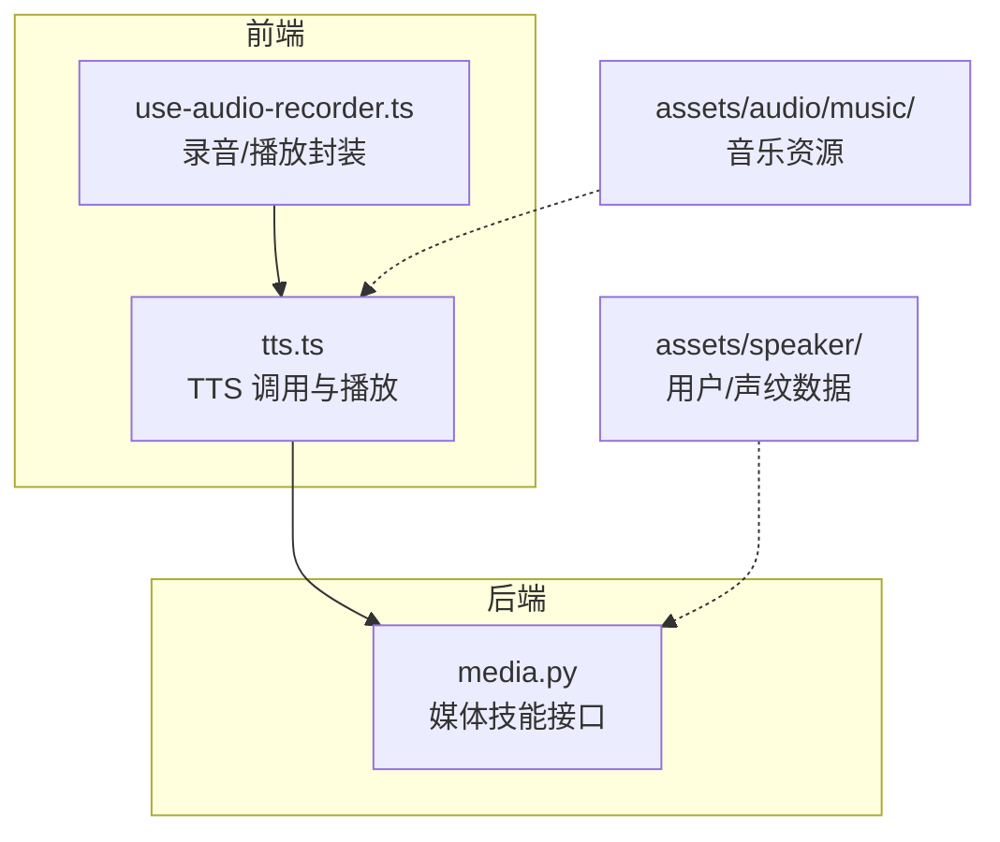
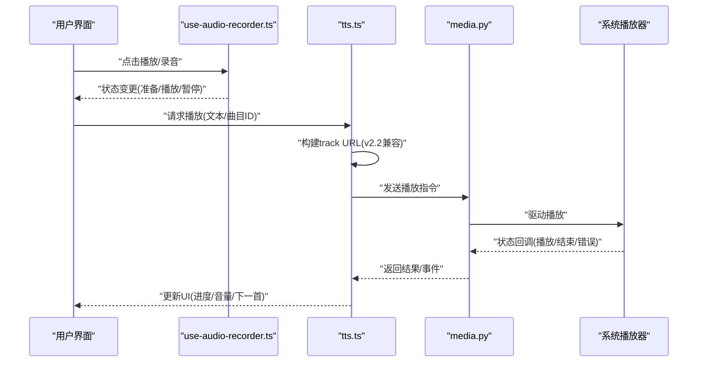
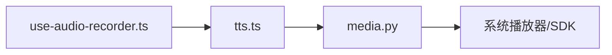

# 媒体播放模块

<cite>
**本文引用的文件**   
- [frontend_design/src/hooks/use-audio-recorder.ts](file://frontend_design/src/hooks/use-audio-recorder.ts)
- [frontend_design/src/lib/tts.ts](file://frontend_design/src/lib/tts.ts)
- [backend_design/nexus/skills/vehicle/media.py](file://backend_design/nexus/skills/vehicle/media.py)
- [assets/audio/music/README.md](file://assets/audio/music/README.md)
</cite>

## 目录
1. [简介](#简介)
2. [项目结构](#项目结构)
3. [核心组件](#核心组件)
4. [架构总览](#架构总览)
5. [详细组件分析](#详细组件分析)
6. [依赖分析](#依赖分析)
7. [性能考虑](#性能考虑)
8. [故障排查指南](#故障排查指南)
9. [结论](#结论)
10. [附录](#附录)

## 简介
本技术文档聚焦于“媒体播放模块”，围绕音频播放器实现、播放控制、音量调节、播放列表与自动播放下一首等能力展开。文档同时覆盖 v2.2 版本兼容处理、track URL 动态生成、音频资源管理，以及错误处理、性能优化与用户体验设计等最佳实践。内容基于仓库中前端音频录制与 TTS 相关代码、后端媒体技能接口及音频资源组织进行综合整理。

## 项目结构
媒体播放相关的前端逻辑主要位于 hooks 与 lib 目录：
- hooks/use-audio-recorder.ts：封装浏览器原生录音与播放能力，提供状态管理与事件回调。
- lib/tts.ts：负责文本转语音（TTS）的调用与播放流程，包含 URL 拼接、播放控制与错误处理。

后端媒体能力通过 skills/vehicle/media.py 暴露，用于在车机或平台侧执行媒体操作（如播放、暂停、切歌、音量等）。

图表来源
- [frontend_design/src/hooks/use-audio-recorder.ts](file://frontend_design/src/hooks/use-audio-recorder.ts)
- [frontend_design/src/lib/tts.ts](file://frontend_design/src/lib/tts.ts)
- [backend_design/nexus/skills/vehicle/media.py](file://backend_design/nexus/skills/vehicle/media.py)
- [assets/audio/music/README.md](file://assets/audio/music/README.md)

章节来源
- [frontend_design/src/hooks/use-audio-recorder.ts](file://frontend_design/src/hooks/use-audio-recorder.ts)
- [frontend_design/src/lib/tts.ts](file://frontend_design/src/lib/tts.ts)
- [backend_design/nexus/skills/vehicle/media.py](file://backend_design/nexus/skills/vehicle/media.py)
- [assets/audio/music/README.md](file://assets/audio/music/README.md)

## 核心组件
- 音频录制与播放封装（hooks/use-audio-recorder.ts）
  - 职责：封装浏览器 MediaRecorder/Audio API，提供开始/停止录音、回放、状态同步与事件回调。
  - 关键点：权限获取、流式采集、Blob 到可播放 URL 转换、播放状态与进度更新。
- TTS 播放管线（lib/tts.ts）
  - 职责：将文本转为语音并播放；负责与后端媒体服务交互、URL 动态生成、播放控制与错误处理。
  - 关键点：v2.2 兼容路径选择、track URL 拼接策略、播放队列与自动下一首、音量与静音控制。
- 媒体技能接口（backend_design/nexus/skills/vehicle/media.py）
  - 职责：对外暴露媒体控制能力（播放、暂停、上一首/下一首、音量），对接底层播放器或系统媒体框架。
  - 关键点：参数校验、状态广播、错误码映射、日志记录。

章节来源
- [frontend_design/src/hooks/use-audio-recorder.ts](file://frontend_design/src/hooks/use-audio-recorder.ts)
- [frontend_design/src/lib/tts.ts](file://frontend_design/src/lib/tts.ts)
- [backend_design/nexus/skills/vehicle/media.py](file://backend_design/nexus/skills/vehicle/media.py)

## 架构总览
媒体播放的整体流程包括：
- 前端发起播放请求（TTS 或本地音频）
- 根据版本与配置动态生成 track URL
- 调用后端媒体技能执行播放
- 播放器反馈状态（播放/暂停/结束/错误）
- 前端更新 UI（当前曲目高亮、进度条、音量条）
- 自动播放下一首（当当前曲目结束且存在后续曲目时）

图表来源
- [frontend_design/src/hooks/use-audio-recorder.ts](file://frontend_design/src/hooks/use-audio-recorder.ts)
- [frontend_design/src/lib/tts.ts](file://frontend_design/src/lib/tts.ts)
- [backend_design/nexus/skills/vehicle/media.py](file://backend_design/nexus/skills/vehicle/media.py)

## 详细组件分析

### 音频播放器实现（HTML5 Audio 对象初始化与状态管理）
- 初始化策略
  - 使用 HTML5 Audio 对象创建实例，设置跨域与预加载策略，避免首次播放延迟。
  - 为不同环境（移动端/桌面端）适配自动播放限制，必要时采用用户手势触发。
- 播放状态管理
  - 维护状态机：空闲、缓冲、播放、暂停、结束、错误。
  - 监听关键事件：oncanplay、onplaying、onpause、onended、onerror，确保 UI 与状态一致。
- 自动播放下一首
  - 在 onended 事件中判断播放列表是否还有下一项，若有则切换并立即加载。
  - 对网络异常或解码失败进行重试与降级处理，避免中断整体体验。

章节来源
- [frontend_design/src/hooks/use-audio-recorder.ts](file://frontend_design/src/hooks/use-audio-recorder.ts)
- [frontend_design/src/lib/tts.ts](file://frontend_design/src/lib/tts.ts)

### 播放控制功能（播放/暂停、上一首/下一首、当前状态显示）
- 播放/暂停切换
  - 统一入口方法，内部根据当前状态决定 play/pause，并同步 UI 图标与按钮禁用态。
- 上一首/下一首导航
  - 维护当前索引与循环模式（单曲循环/列表循环/随机），边界情况处理（首尾回绕或停止）。
- 当前播放状态显示
  - 实时更新进度条、剩余时间、曲目信息；错误时展示友好提示与重试入口。

章节来源
- [frontend_design/src/lib/tts.ts](file://frontend_design/src/lib/tts.ts)

### 音量调节系统（可视化、步进、范围限制）
- 音量条可视化
  - 使用 range 输入控件绑定 Audio.volume，实时反映音量变化。
  - 支持拖拽与点击跳转，节流更新避免频繁重绘。
- 步进调节
  - 提供 +/- 按钮按固定步长调整（例如每次 5%），并限制最小/最大阈值。
- 范围限制与持久化
  - 将最终音量写入本地存储，下次进入页面恢复；超过安全阈值时给出提示。

章节来源
- [frontend_design/src/lib/tts.ts](file://frontend_design/src/lib/tts.ts)

### 播放列表功能（曲目信息、高亮、点击播放）
- 曲目信息显示
  - 渲染标题、艺术家、时长、封面图；懒加载封面降低首屏压力。
- 当前曲目高亮
  - 根据当前索引添加 active 样式，滚动至可视区域。
- 点击播放逻辑
  - 点击任意条目即切换至该曲目并播放；若正在播放相同曲目则执行暂停/继续切换。

章节来源
- [frontend_design/src/lib/tts.ts](file://frontend_design/src/lib/tts.ts)

### v2.2 版本兼容处理与 track URL 动态生成
- 版本兼容
  - 检测运行环境与后端能力，选择 v2.2 兼容路径或新路径；对缺失字段提供默认值。
- track URL 动态生成
  - 根据曲目 ID、格式偏好、CDN 节点与鉴权令牌拼接完整 URL；对旧版接口做降级处理。
- 音频资源管理
  - 集中管理静态资源路径与命名规范；对大体积音频启用分片与断点续传（由后端支持）。

章节来源
- [frontend_design/src/lib/tts.ts](file://frontend_design/src/lib/tts.ts)
- [assets/audio/music/README.md](file://assets/audio/music/README.md)

### 后端媒体技能接口（media.py）
- 能力清单
  - 播放/暂停、上一首/下一首、音量设置、播放列表查询、状态上报。
- 错误处理
  - 统一错误码与消息体，便于前端展示与重试策略。
- 集成点
  - 与系统播放器或第三方 SDK 对接，提供稳定可靠的媒体控制能力。

章节来源
- [backend_design/nexus/skills/vehicle/media.py](file://backend_design/nexus/skills/vehicle/media.py)

## 依赖分析
- 前端依赖
  - use-audio-recorder.ts 依赖浏览器 MediaRecorder/Audio API，提供基础录制与播放能力。
  - tts.ts 依赖 use-audio-recorder.ts 与后端 media.py 提供的媒体控制接口。
- 后端依赖
  - media.py 作为媒体能力的抽象层，屏蔽底层差异，向上提供统一 API。

图表来源
- [frontend_design/src/hooks/use-audio-recorder.ts](file://frontend_design/src/hooks/use-audio-recorder.ts)
- [frontend_design/src/lib/tts.ts](file://frontend_design/src/lib/tts.ts)
- [backend_design/nexus/skills/vehicle/media.py](file://backend_design/nexus/skills/vehicle/media.py)

章节来源
- [frontend_design/src/hooks/use-audio-recorder.ts](file://frontend_design/src/hooks/use-audio-recorder.ts)
- [frontend_design/src/lib/tts.ts](file://frontend_design/src/lib/tts.ts)
- [backend_design/nexus/skills/vehicle/media.py](file://backend_design/nexus/skills/vehicle/media.py)

## 性能考虑
- 预加载与缓存
  - 对即将播放的曲目进行预加载，利用浏览器 HTTP 缓存减少重复下载。
- 流式播放
  - 优先使用流式传输，缩短首帧时间；对弱网环境启用自适应码率（后端支持）。
- 事件节流
  - 对进度更新、音量变化等高频事件进行节流，降低主线程压力。
- 资源清理
  - 在组件卸载或页面隐藏时释放 Audio 对象与 Blob URL，避免内存泄漏。

[本节为通用指导，不直接分析具体文件]

## 故障排查指南
- 常见问题定位
  - 无法自动播放：检查用户手势与浏览器策略；必要时引导用户交互后触发。
  - 播放卡顿：检查网络质量与 CDN 可用性；查看后端媒体服务日志。
  - 音量无响应：确认 range 控件绑定与事件监听是否正确。
- 错误处理建议
  - 捕获 onerror 事件，区分网络错误、解码错误与权限错误，分别给出提示与重试策略。
  - 对不可恢复错误提供“返回上一页”或“重新选择曲目”入口。

章节来源
- [frontend_design/src/lib/tts.ts](file://frontend_design/src/lib/tts.ts)
- [backend_design/nexus/skills/vehicle/media.py](file://backend_design/nexus/skills/vehicle/media.py)

## 结论
媒体播放模块以前端 hooks 与 TTS 管线为核心，结合后端媒体技能接口，实现了完整的播放控制、音量调节、播放列表与自动下一首等功能。通过 v2.2 兼容处理与 track URL 动态生成，提升了在不同环境下的稳定性与可维护性。遵循本文的性能优化与错误处理建议，可进一步提升用户体验与系统可靠性。

[本节为总结性内容，不直接分析具体文件]

## 附录
- 术语说明
  - track URL：指向具体音频资源的完整地址，可能包含鉴权参数与格式后缀。
  - 媒体技能：后端对媒体控制的抽象接口，屏蔽底层实现差异。
- 参考资源
  - 音频资源组织与命名规范参见 assets/audio/music/README.md。

章节来源
- [assets/audio/music/README.md](file://assets/audio/music/README.md)