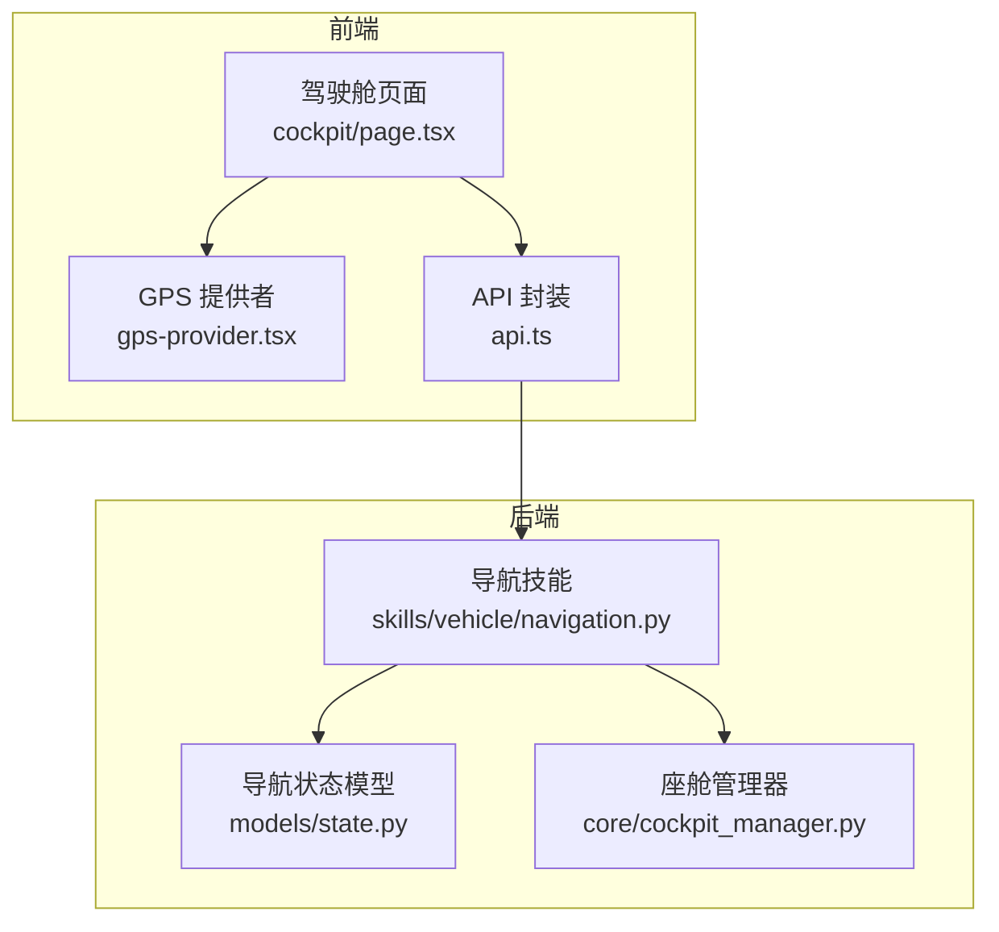
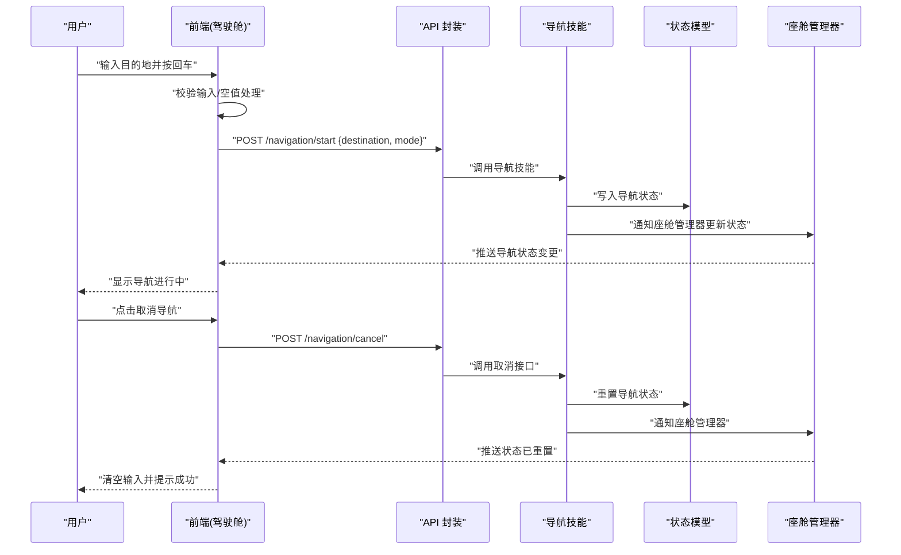
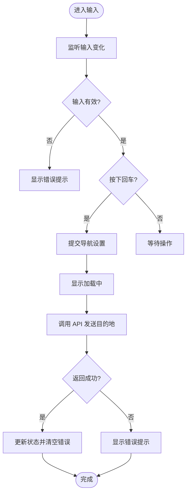
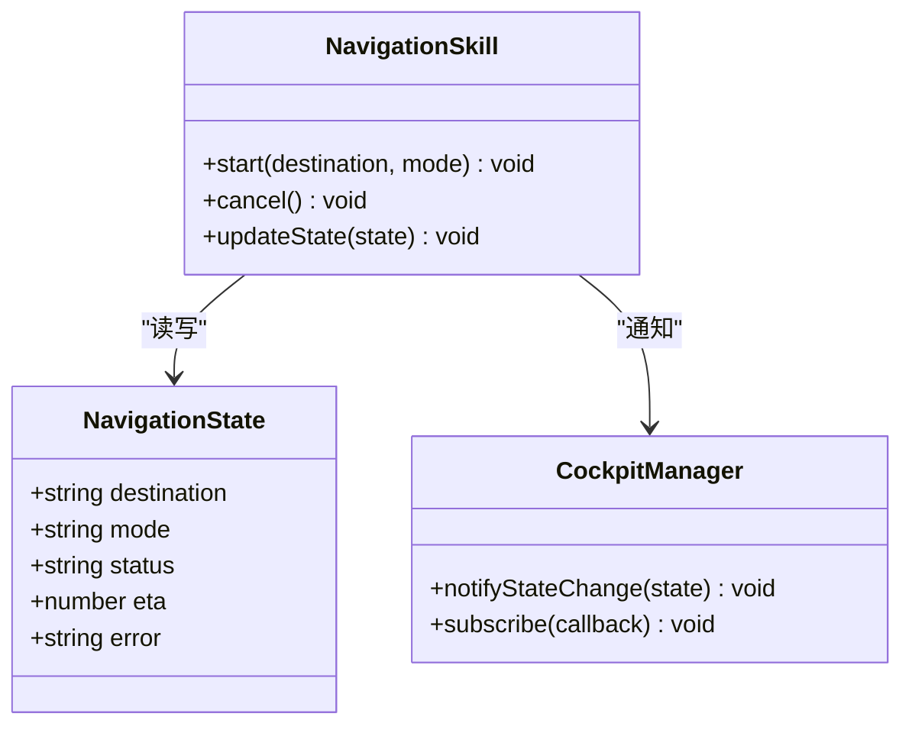
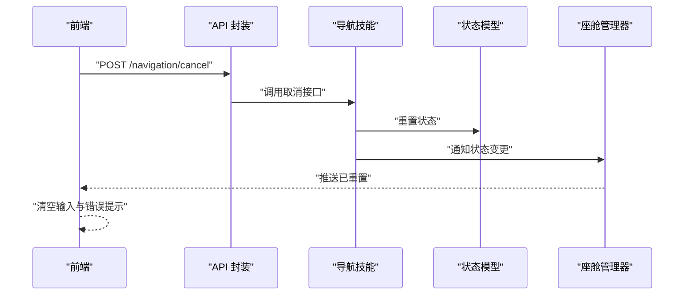
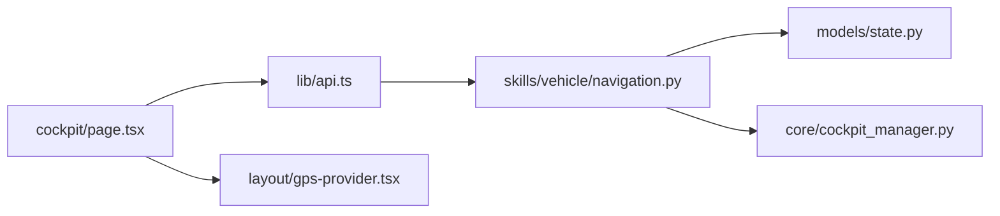

# 导航控制模块

<cite>
**本文引用的文件**   
- [frontend_design/src/app/cockpit/page.tsx](file://frontend_design/src/app/cockpit/page.tsx)
- [frontend_design/src/components/layout/gps-provider.tsx](file://frontend_design/src/components/layout/gps-provider.tsx)
- [frontend_design/src/lib/api.ts](file://frontend_design/src/lib/api.ts)
- [backend_design/nexus/skills/vehicle/navigation.py](file://backend_design/nexus/skills/vehicle/navigation.py)
- [backend_design/nexus/models/state.py](file://backend_design/nexus/models/state.py)
- [backend_design/nexus/core/cockpit_manager.py](file://backend_design/nexus/core/cockpit_manager.py)
</cite>

## 目录
1. [简介](#简介)
2. [项目结构](#项目结构)
3. [核心组件](#核心组件)
4. [架构总览](#架构总览)
5. [详细组件分析](#详细组件分析)
6. [依赖关系分析](#依赖关系分析)
7. [性能考虑](#性能考虑)
8. [故障排查指南](#故障排查指南)
9. [结论](#结论)
10. [附录](#附录)

## 简介
本技术文档聚焦“导航控制模块”，围绕前端导航输入与设置、后端导航技能与状态管理展开，系统性说明以下能力：
- 目的地输入功能：输入框状态管理、回车键触发、输入校验、空值处理
- 导航设置功能：目的地发送、导航模式选择、状态同步机制
- 取消导航功能：清空输入、发送取消指令、状态重置
- 导航状态持久化、用户输入体验优化、错误提示等交互设计
- 业务逻辑、API 调用封装与用户体验优化方案

## 项目结构
导航控制涉及前后端协作：
- 前端：驾驶舱页面承载导航输入与展示；GPS 提供者提供位置上下文；API 层封装导航相关接口
- 后端：导航技能负责解析意图、构造导航参数并下发；状态模型定义导航状态字段；座舱管理器协调会话与状态

图表来源
- [frontend_design/src/app/cockpit/page.tsx](file://frontend_design/src/app/cockpit/page.tsx)
- [frontend_design/src/components/layout/gps-provider.tsx](file://frontend_design/src/components/layout/gps-provider.tsx)
- [frontend_design/src/lib/api.ts](file://frontend_design/src/lib/api.ts)
- [backend_design/nexus/skills/vehicle/navigation.py](file://backend_design/nexus/skills/vehicle/navigation.py)
- [backend_design/nexus/models/state.py](file://backend_design/nexus/models/state.py)
- [backend_design/nexus/core/cockpit_manager.py](file://backend_design/nexus/core/cockpit_manager.py)

章节来源
- [frontend_design/src/app/cockpit/page.tsx](file://frontend_design/src/app/cockpit/page.tsx)
- [frontend_design/src/components/layout/gps-provider.tsx](file://frontend_design/src/components/layout/gps-provider.tsx)
- [frontend_design/src/lib/api.ts](file://frontend_design/src/lib/api.ts)
- [backend_design/nexus/skills/vehicle/navigation.py](file://backend_design/nexus/skills/vehicle/navigation.py)
- [backend_design/nexus/models/state.py](file://backend_design/nexus/models/state.py)
- [backend_design/nexus/core/cockpit_manager.py](file://backend_design/nexus/core/cockpit_manager.py)

## 核心组件
- 目的地输入与交互（前端）
  - 输入框状态管理：维护当前输入文本、是否正在加载、错误信息、最近一次成功目的地
  - 回车键触发：在输入框中监听回车事件，触发导航设置流程
  - 输入校验：非空校验、长度限制、非法字符过滤（如纯空格或特殊符号）
  - 空值处理：当输入为空时给出友好提示，阻止无效请求
- 导航设置（前端 + 后端）
  - 目的地发送：将目的地文本与可选的导航模式（如最快路线、最少拥堵、步行/驾车等）通过 API 发送到后端
  - 导航模式选择：前端提供模式选项，后端根据策略生成路径规划参数
  - 状态同步：后端更新导航状态后，通过消息通道推送至前端，驱动 UI 刷新
- 取消导航（前端 + 后端）
  - 清空输入：取消成功后自动清空输入框与错误提示
  - 发送取消指令：调用取消接口，后端停止当前导航任务
  - 状态重置：将导航状态恢复为空闲，清除缓存的目的地与模式
- 导航状态持久化（后端）
  - 使用状态模型持久化当前导航目标、模式、起止点、预计到达时间等
  - 支持跨会话恢复，避免重启导致导航中断
- 用户体验优化
  - 防抖与节流：减少重复提交
  - 即时反馈：加载中禁用按钮、显示进度
  - 错误提示：网络异常、服务不可用、参数不合法等场景的明确提示
  - 键盘可达性：支持回车启动、Esc 取消

章节来源
- [frontend_design/src/app/cockpit/page.tsx](file://frontend_design/src/app/cockpit/page.tsx)
- [frontend_design/src/lib/api.ts](file://frontend_design/src/lib/api.ts)
- [backend_design/nexus/skills/vehicle/navigation.py](file://backend_design/nexus/skills/vehicle/navigation.py)
- [backend_design/nexus/models/state.py](file://backend_design/nexus/models/state.py)
- [backend_design/nexus/core/cockpit_manager.py](file://backend_design/nexus/core/cockpit_manager.py)

## 架构总览
导航控制采用前后端分离架构，前端负责输入与展示，后端负责意图解析、路径规划与状态管理。

图表来源
- [frontend_design/src/app/cockpit/page.tsx](file://frontend_design/src/app/cockpit/page.tsx)
- [frontend_design/src/lib/api.ts](file://frontend_design/src/lib/api.ts)
- [backend_design/nexus/skills/vehicle/navigation.py](file://backend_design/nexus/skills/vehicle/navigation.py)
- [backend_design/nexus/models/state.py](file://backend_design/nexus/models/state.py)
- [backend_design/nexus/core/cockpit_manager.py](file://backend_design/nexus/core/cockpit_manager.py)

## 详细组件分析

### 目的地输入与交互（前端）
- 输入框状态管理
  - 维护字段：目的地文本、加载态、错误信息、最近成功目的地
  - 状态更新：onChange 更新文本；onSubmit 触发校验与发送；onCancel 清空并重置
- 回车键触发
  - 在输入框上监听回车事件，若输入有效则直接发起导航设置
- 输入校验与空值处理
  - 非空校验：空字符串或仅空白字符视为无效
  - 长度与字符集限制：防止过长或包含非法字符
  - 空值提示：统一错误提示文案，避免歧义
- 用户体验优化
  - 防抖：连续输入时延迟提交，降低后端压力
  - 加载态：提交期间禁用输入与按钮，显示进度指示
  - 历史记忆：保留最近一次成功目的地，便于快速重试

图表来源
- [frontend_design/src/app/cockpit/page.tsx](file://frontend_design/src/app/cockpit/page.tsx)
- [frontend_design/src/lib/api.ts](file://frontend_design/src/lib/api.ts)

章节来源
- [frontend_design/src/app/cockpit/page.tsx](file://frontend_design/src/app/cockpit/page.tsx)
- [frontend_design/src/lib/api.ts](file://frontend_design/src/lib/api.ts)

### 导航设置（前端 + 后端）
- 目的地发送
  - 前端组装 payload：目的地、导航模式、可选偏好（如避开高速）
  - 调用 API 封装层，统一错误处理与重试策略
- 导航模式选择
  - 模式枚举：最快路线、最少拥堵、步行/驾车等
  - 后端根据模式生成路径规划参数，必要时结合实时路况
- 状态同步机制
  - 后端更新状态模型并通知座舱管理器
  - 座舱管理器通过消息通道推送状态变更到前端
  - 前端接收后刷新 UI，显示导航进行中、剩余距离、预计到达时间等

图表来源
- [backend_design/nexus/models/state.py](file://backend_design/nexus/models/state.py)
- [backend_design/nexus/skills/vehicle/navigation.py](file://backend_design/nexus/skills/vehicle/navigation.py)
- [backend_design/nexus/core/cockpit_manager.py](file://backend_design/nexus/core/cockpit_manager.py)

章节来源
- [frontend_design/src/lib/api.ts](file://frontend_design/src/lib/api.ts)
- [backend_design/nexus/skills/vehicle/navigation.py](file://backend_design/nexus/skills/vehicle/navigation.py)
- [backend_design/nexus/models/state.py](file://backend_design/nexus/models/state.py)
- [backend_design/nexus/core/cockpit_manager.py](file://backend_design/nexus/core/cockpit_manager.py)

### 取消导航（前端 + 后端）
- 清空输入
  - 取消成功后自动清空输入框与错误提示，恢复初始状态
- 发送取消指令
  - 调用取消接口，后端终止当前导航任务并释放资源
- 状态重置
  - 将导航状态恢复为空闲，清除缓存的目的地与模式
  - 通知座舱管理器，前端收到后刷新 UI

图表来源
- [frontend_design/src/app/cockpit/page.tsx](file://frontend_design/src/app/cockpit/page.tsx)
- [frontend_design/src/lib/api.ts](file://frontend_design/src/lib/api.ts)
- [backend_design/nexus/skills/vehicle/navigation.py](file://backend_design/nexus/skills/vehicle/navigation.py)
- [backend_design/nexus/models/state.py](file://backend_design/nexus/models/state.py)
- [backend_design/nexus/core/cockpit_manager.py](file://backend_design/nexus/core/cockpit_manager.py)

章节来源
- [frontend_design/src/app/cockpit/page.tsx](file://frontend_design/src/app/cockpit/page.tsx)
- [frontend_design/src/lib/api.ts](file://frontend_design/src/lib/api.ts)
- [backend_design/nexus/skills/vehicle/navigation.py](file://backend_design/nexus/skills/vehicle/navigation.py)
- [backend_design/nexus/models/state.py](file://backend_design/nexus/models/state.py)
- [backend_design/nexus/core/cockpit_manager.py](file://backend_design/nexus/core/cockpit_manager.py)

### 导航状态持久化与恢复
- 持久化内容
  - 目的地、导航模式、状态、ETA、错误信息等
- 恢复策略
  - 应用重启后从状态模型读取并恢复导航上下文
  - 前端订阅状态变更，确保 UI 与后端一致

章节来源
- [backend_design/nexus/models/state.py](file://backend_design/nexus/models/state.py)
- [backend_design/nexus/core/cockpit_manager.py](file://backend_design/nexus/core/cockpit_manager.py)

### GPS 上下文集成
- 提供当前位置坐标与地址解析结果
- 用于起点默认填充、路径规划优化与 ETA 计算

章节来源
- [frontend_design/src/components/layout/gps-provider.tsx](file://frontend_design/src/components/layout/gps-provider.tsx)

## 依赖关系分析
- 前端依赖
  - 驾驶舱页面依赖 API 封装与 GPS 提供者
  - API 封装依赖后端导航技能接口
- 后端依赖
  - 导航技能依赖状态模型与座舱管理器
  - 座舱管理器负责状态广播与订阅

图表来源
- [frontend_design/src/app/cockpit/page.tsx](file://frontend_design/src/app/cockpit/page.tsx)
- [frontend_design/src/lib/api.ts](file://frontend_design/src/lib/api.ts)
- [frontend_design/src/components/layout/gps-provider.tsx](file://frontend_design/src/components/layout/gps-provider.tsx)
- [backend_design/nexus/skills/vehicle/navigation.py](file://backend_design/nexus/skills/vehicle/navigation.py)
- [backend_design/nexus/models/state.py](file://backend_design/nexus/models/state.py)
- [backend_design/nexus/core/cockpit_manager.py](file://backend_design/nexus/core/cockpit_manager.py)

章节来源
- [frontend_design/src/app/cockpit/page.tsx](file://frontend_design/src/app/cockpit/page.tsx)
- [frontend_design/src/lib/api.ts](file://frontend_design/src/lib/api.ts)
- [frontend_design/src/components/layout/gps-provider.tsx](file://frontend_design/src/components/layout/gps-provider.tsx)
- [backend_design/nexus/skills/vehicle/navigation.py](file://backend_design/nexus/skills/vehicle/navigation.py)
- [backend_design/nexus/models/state.py](file://backend_design/nexus/models/state.py)
- [backend_design/nexus/core/cockpit_manager.py](file://backend_design/nexus/core/cockpit_manager.py)

## 性能考虑
- 前端
  - 输入防抖与节流，减少不必要的 API 调用
  - 局部状态更新，避免整页重渲染
  - 错误边界与降级策略，保证主流程可用
- 后端
  - 路径规划异步执行，避免阻塞请求
  - 状态变更批量推送，降低消息通道负载
  - 缓存热点数据（如常用目的地），提升响应速度

## 故障排查指南
- 常见问题
  - 输入为空或未通过校验：检查前端校验逻辑与错误提示
  - 导航未启动：确认 API 调用是否成功、后端日志是否有异常
  - 状态不同步：检查座舱管理器推送是否正常、前端订阅是否生效
- 定位步骤
  - 查看前端控制台与网络请求
  - 检查后端导航技能日志与状态模型
  - 验证座舱管理器消息通道连接与订阅回调

章节来源
- [frontend_design/src/app/cockpit/page.tsx](file://frontend_design/src/app/cockpit/page.tsx)
- [frontend_design/src/lib/api.ts](file://frontend_design/src/lib/api.ts)
- [backend_design/nexus/skills/vehicle/navigation.py](file://backend_design/nexus/skills/vehicle/navigation.py)
- [backend_design/nexus/core/cockpit_manager.py](file://backend_design/nexus/core/cockpit_manager.py)

## 结论
导航控制模块通过清晰的前后端职责划分与状态同步机制，实现了稳定的目的地输入、导航设置与取消流程。结合输入校验、错误提示与状态持久化，提供了良好的用户体验与可恢复性。后续可进一步优化路径规划性能与消息推送效率，增强多设备协同与离线容错能力。

## 附录
- 术语
  - 导航模式：路径规划策略，如最快路线、最少拥堵
  - ETA：预计到达时间
  - 座舱管理器：负责会话与状态管理的核心组件
- 最佳实践
  - 始终对输入进行严格校验与友好提示
  - 保持前后端状态一致，避免脏读与竞态条件
  - 对关键操作提供明确的反馈与撤销能力