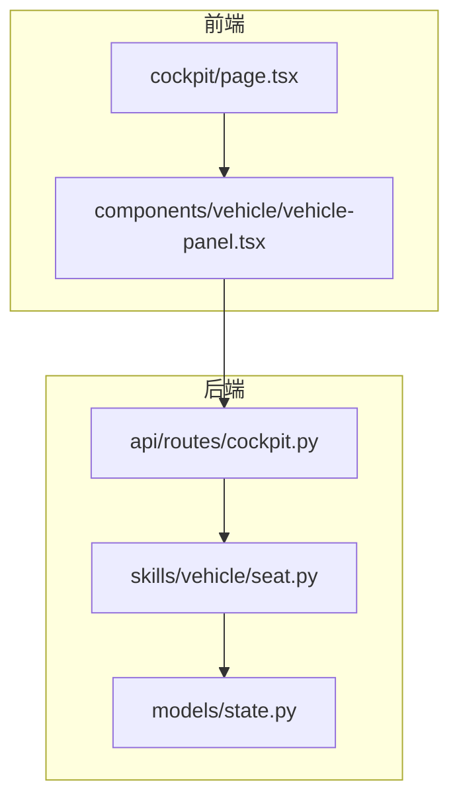
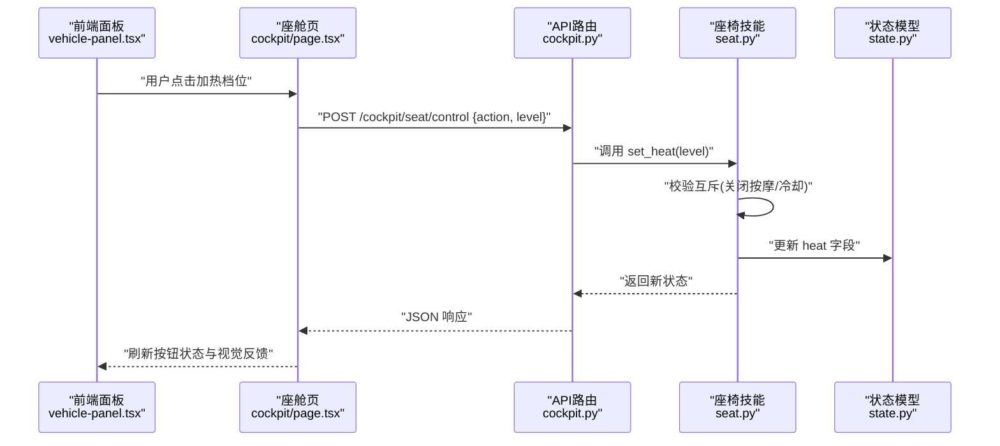
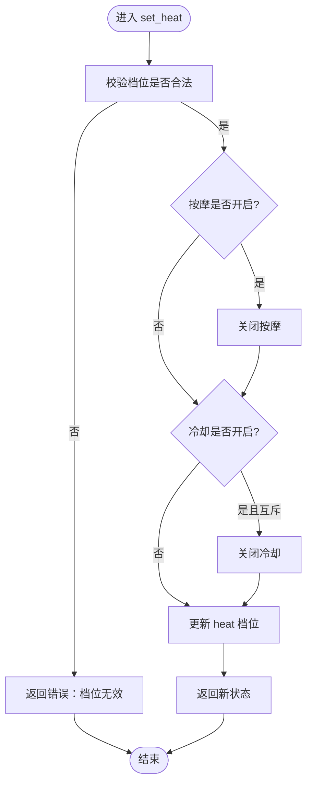
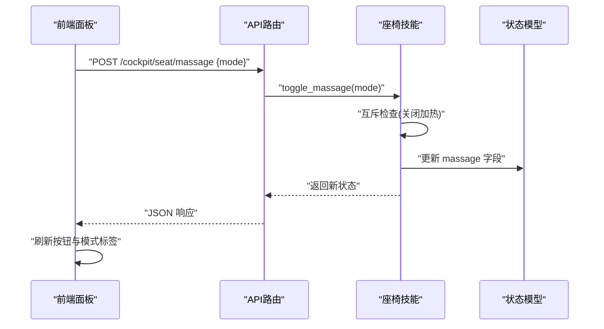
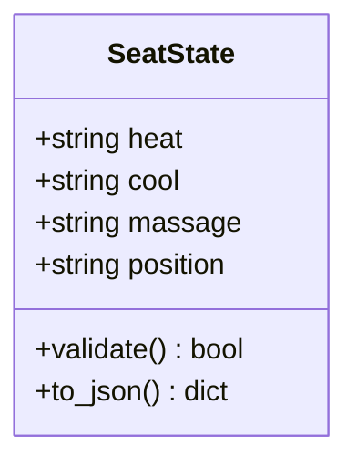
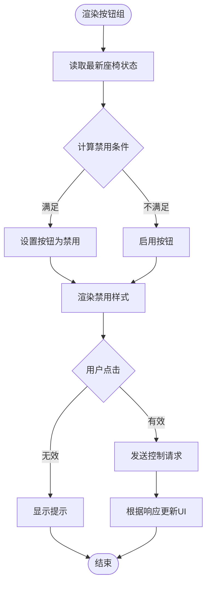
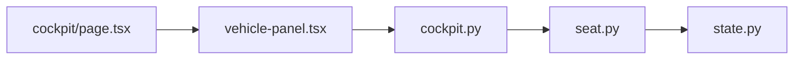

# 座椅控制模块

<cite>
**本文引用的文件**   
- [backend_design/nexus/skills/vehicle/seat.py](file://backend_design/nexus/skills/vehicle/seat.py)
- [backend_design/nexus/models/state.py](file://backend_design/nexus/models/state.py)
- [backend_design/nexus/api/routes/cockpit.py](file://backend_design/nexus/api/routes/cockpit.py)
- [frontend_design/src/app/cockpit/page.tsx](file://frontend_design/src/app/cockpit/page.tsx)
- [frontend_design/src/components/vehicle/vehicle-panel.tsx](file://frontend_design/src/components/vehicle/vehicle-panel.tsx)
</cite>

## 目录
1. [简介](#简介)
2. [项目结构](#项目结构)
3. [核心组件](#核心组件)
4. [架构总览](#架构总览)
5. [详细组件分析](#详细组件分析)
6. [依赖关系分析](#依赖关系分析)
7. [性能考虑](#性能考虑)
8. [故障排查指南](#故障排查指南)
9. [结论](#结论)
10. [附录](#附录)

## 简介
本技术文档聚焦于“座椅控制模块”，围绕主驾加热三档状态管理、按摩功能开关与模式同步、以及座椅状态数据结构（heat、cool、massage、position）进行系统化说明。文档同时覆盖按钮状态管理、禁用条件判断、视觉反馈等前端交互细节，并给出业务规则、异常处理与用户体验优化建议，帮助前后端开发者快速理解与落地实现。

## 项目结构
该模块涉及后端技能层、模型状态定义、API路由以及前端页面与面板组件：
- 后端技能层：负责解析用户意图、执行座椅控制命令、维护状态变更与互斥策略
- 模型状态层：定义座椅状态的数据结构与字段语义
- API路由层：暴露控制接口，接收前端请求并调用技能层
- 前端页面与面板：提供UI交互、按钮状态与视觉反馈、与后端同步状态

图表来源
- [frontend_design/src/app/cockpit/page.tsx](file://frontend_design/src/app/cockpit/page.tsx)
- [frontend_design/src/components/vehicle/vehicle-panel.tsx](file://frontend_design/src/components/vehicle/vehicle-panel.tsx)
- [backend_design/nexus/api/routes/cockpit.py](file://backend_design/nexus/api/routes/cockpit.py)
- [backend_design/nexus/skills/vehicle/seat.py](file://backend_design/nexus/skills/vehicle/seat.py)
- [backend_design/nexus/models/state.py](file://backend_design/nexus/models/state.py)

章节来源
- [backend_design/nexus/skills/vehicle/seat.py](file://backend_design/nexus/skills/vehicle/seat.py)
- [backend_design/nexus/models/state.py](file://backend_design/nexus/models/state.py)
- [backend_design/nexus/api/routes/cockpit.py](file://backend_design/nexus/api/routes/cockpit.py)
- [frontend_design/src/app/cockpit/page.tsx](file://frontend_design/src/app/cockpit/page.tsx)
- [frontend_design/src/components/vehicle/vehicle-panel.tsx](file://frontend_design/src/components/vehicle/vehicle-panel.tsx)

## 核心组件
- 座椅技能（Seat Skill）
  - 职责：解析控制指令、执行加热/制冷/按摩/位置调整、维护互斥与状态一致性
  - 关键能力：三档加热状态机、按摩模式切换、冷却联动、位置映射
- 状态模型（State Model）
  - 职责：定义 seat 对象字段（heat、cool、massage、position），提供默认值与校验
- API 路由（Cockpit API）
  - 职责：暴露控制接口，鉴权与参数校验后转发至技能层，返回统一响应
- 前端面板（Vehicle Panel）
  - 职责：渲染座椅控制UI、管理按钮状态与禁用逻辑、展示视觉反馈、与后端同步状态

章节来源
- [backend_design/nexus/skills/vehicle/seat.py](file://backend_design/nexus/skills/vehicle/seat.py)
- [backend_design/nexus/models/state.py](file://backend_design/nexus/models/state.py)
- [backend_design/nexus/api/routes/cockpit.py](file://backend_design/nexus/api/routes/cockpit.py)
- [frontend_design/src/components/vehicle/vehicle-panel.tsx](file://frontend_design/src/components/vehicle/vehicle-panel.tsx)

## 架构总览
以下序列图展示了从前端到后端的完整控制流程，包括加热档位切换与互斥处理：

图表来源
- [frontend_design/src/components/vehicle/vehicle-panel.tsx](file://frontend_design/src/components/vehicle/vehicle-panel.tsx)
- [frontend_design/src/app/cockpit/page.tsx](file://frontend_design/src/app/cockpit/page.tsx)
- [backend_design/nexus/api/routes/cockpit.py](file://backend_design/nexus/api/routes/cockpit.py)
- [backend_design/nexus/skills/vehicle/seat.py](file://backend_design/nexus/skills/vehicle/seat.py)
- [backend_design/nexus/models/state.py](file://backend_design/nexus/models/state.py)

## 详细组件分析

### 主驾加热功能（三档状态管理与互斥）
- 状态设计
  - heat 字段表示当前加热档位，常见取值包含“关闭”、“低档”、“中档”、“高档”
  - 档位切换需遵循互斥规则：开启加热时自动关闭按摩；若存在冷却，则根据业务策略决定是否允许共存或强制关闭
- 控制流程
  - 前端按钮组提供三档选择与关闭选项
  - 点击触发后，前端发送控制请求，后端技能层执行互斥检查与状态更新
  - 成功后前端刷新按钮激活态与视觉指示（如高亮、动画）
- 互斥策略
  - 加热 vs 按摩：互斥，开启加热即关闭按摩
  - 加热 vs 冷却：可配置互斥或限制共存档位，避免热力学冲突
- 错误处理
  - 非法档位、设备不可用、并发冲突等情况返回明确错误码与提示

图表来源
- [backend_design/nexus/skills/vehicle/seat.py](file://backend_design/nexus/skills/vehicle/seat.py)
- [backend_design/nexus/models/state.py](file://backend_design/nexus/models/state.py)

章节来源
- [backend_design/nexus/skills/vehicle/seat.py](file://backend_design/nexus/skills/vehicle/seat.py)
- [backend_design/nexus/models/state.py](file://backend_design/nexus/models/state.py)

### 按摩功能（开关控制、模式启用/禁用、状态同步与反馈）
- 状态设计
  - massage 字段表示按摩状态，常见取值包含“关闭”、“模式A”、“模式B”等
- 控制流程
  - 前端提供按摩开关与模式选择
  - 后端技能层在开启按摩时关闭加热（互斥），并更新 massage 字段
  - 成功响应后前端同步显示当前模式与开关状态
- 状态同步
  - 通过统一的座椅状态接口拉取最新状态，确保多端一致
- 用户反馈
  - 按钮激活态、模式标签、可选的动效提示

图表来源
- [frontend_design/src/components/vehicle/vehicle-panel.tsx](file://frontend_design/src/components/vehicle/vehicle-panel.tsx)
- [backend_design/nexus/api/routes/cockpit.py](file://backend_design/nexus/api/routes/cockpit.py)
- [backend_design/nexus/skills/vehicle/seat.py](file://backend_design/nexus/skills/vehicle/seat.py)
- [backend_design/nexus/models/state.py](file://backend_design/nexus/models/state.py)

章节来源
- [backend_design/nexus/skills/vehicle/seat.py](file://backend_design/nexus/skills/vehicle/seat.py)
- [backend_design/nexus/models/state.py](file://backend_design/nexus/models/state.py)
- [frontend_design/src/components/vehicle/vehicle-panel.tsx](file://frontend_design/src/components/vehicle/vehicle-panel.tsx)

### 座椅状态数据结构（heat、cool、massage、position）
- 字段含义
  - heat：主驾加热档位（关闭/低/中/高）
  - cool：主驾冷却档位（关闭/低/中/高）
  - massage：按摩状态（关闭/模式A/模式B）
  - position：座椅位置（前/中/后/自定义坐标）
- 使用场景
  - 加热/冷却用于温度调节，互斥策略防止热力学冲突
  - 按摩用于舒适性增强，与加热互斥
  - 位置用于记忆与一键复位，常与加热/冷却组合使用
- 数据校验
  - 所有字段应具备默认值与枚举约束，避免非法状态

图表来源
- [backend_design/nexus/models/state.py](file://backend_design/nexus/models/state.py)

章节来源
- [backend_design/nexus/models/state.py](file://backend_design/nexus/models/state.py)

### 按钮状态管理与UI交互（disabled、视觉反馈）
- 禁用条件
  - 当设备离线、权限不足、或互斥条件不满足时，按钮应处于 disabled 状态
  - 例如：加热开启时，按摩按钮禁用；冷却开启且互斥策略禁止共存时，加热按钮禁用
- 视觉反馈
  - 激活态高亮、选中态边框、加载态旋转图标
  - 错误态红色提示与重试入口
- 状态同步
  - 前端基于后端返回的状态刷新UI，避免本地状态漂移

图表来源
- [frontend_design/src/components/vehicle/vehicle-panel.tsx](file://frontend_design/src/components/vehicle/vehicle-panel.tsx)
- [frontend_design/src/app/cockpit/page.tsx](file://frontend_design/src/app/cockpit/page.tsx)

章节来源
- [frontend_design/src/components/vehicle/vehicle-panel.tsx](file://frontend_design/src/components/vehicle/vehicle-panel.tsx)
- [frontend_design/src/app/cockpit/page.tsx](file://frontend_design/src/app/cockpit/page.tsx)

## 依赖关系分析
- 前端依赖
  - cockpit/page.tsx 作为页面容器，集成 vehicle-panel.tsx 面板组件
  - 面板组件负责UI交互与状态展示，调用 cockpit API
- 后端依赖
  - cockpit.py 路由接收请求，调用 seat.py 技能层
  - seat.py 技能层依赖 state.py 状态模型进行数据校验与持久化
- 耦合与内聚
  - 前后端通过REST接口解耦，技能层与状态模型职责清晰
  - 互斥逻辑集中在技能层，保证业务规则一致性

图表来源
- [frontend_design/src/app/cockpit/page.tsx](file://frontend_design/src/app/cockpit/page.tsx)
- [frontend_design/src/components/vehicle/vehicle-panel.tsx](file://frontend_design/src/components/vehicle/vehicle-panel.tsx)
- [backend_design/nexus/api/routes/cockpit.py](file://backend_design/nexus/api/routes/cockpit.py)
- [backend_design/nexus/skills/vehicle/seat.py](file://backend_design/nexus/skills/vehicle/seat.py)
- [backend_design/nexus/models/state.py](file://backend_design/nexus/models/state.py)

章节来源
- [backend_design/nexus/api/routes/cockpit.py](file://backend_design/nexus/api/routes/cockpit.py)
- [backend_design/nexus/skills/vehicle/seat.py](file://backend_design/nexus/skills/vehicle/seat.py)
- [backend_design/nexus/models/state.py](file://backend_design/nexus/models/state.py)
- [frontend_design/src/app/cockpit/page.tsx](file://frontend_design/src/app/cockpit/page.tsx)
- [frontend_design/src/components/vehicle/vehicle-panel.tsx](file://frontend_design/src/components/vehicle/vehicle-panel.tsx)

## 性能考虑
- 减少不必要的状态同步：仅在用户操作或状态变化时拉取最新状态
- 批量更新：对多个字段变更合并为一次状态更新，降低网络开销
- 防抖与节流：对高频点击（如连续切换档位）进行防抖，避免重复请求
- 缓存策略：对只读状态（如可用模式列表）进行短期缓存，提升首屏渲染速度

## 故障排查指南
- 常见问题
  - 按钮点击无响应：检查网络连通性与API鉴权
  - 状态不同步：确认后端返回状态是否正确，前端是否按响应刷新UI
  - 互斥冲突：查看技能层日志，确认互斥逻辑是否按预期执行
- 定位步骤
  - 前端：打开控制台查看请求与响应，确认按钮禁用条件计算正确
  - 后端：检查API路由参数校验与技能层执行结果
  - 状态模型：验证字段枚举与默认值是否符合预期
- 恢复措施
  - 重试机制：失败时提供重试入口
  - 降级策略：设备不可用时提示用户稍后再试或切换到备用功能

章节来源
- [backend_design/nexus/api/routes/cockpit.py](file://backend_design/nexus/api/routes/cockpit.py)
- [backend_design/nexus/skills/vehicle/seat.py](file://backend_design/nexus/skills/vehicle/seat.py)
- [frontend_design/src/components/vehicle/vehicle-panel.tsx](file://frontend_design/src/components/vehicle/vehicle-panel.tsx)

## 结论
座椅控制模块通过清晰的职责划分与严格的互斥策略，实现了主驾加热三档管理、按摩模式切换与状态同步。前端提供直观的按钮状态与视觉反馈，后端保障业务规则与数据一致性。建议在后续迭代中完善错误码体系、增加更多可视化诊断信息，并持续优化用户体验与性能表现。

## 附录
- 术语表
  - 互斥：同一时刻仅允许某类功能生效，避免冲突
  - 状态同步：前后端状态保持一致的过程
  - 视觉反馈：通过颜色、动效等方式向用户传达当前状态
- 参考实现路径
  - 加热控制：[backend_design/nexus/skills/vehicle/seat.py](file://backend_design/nexus/skills/vehicle/seat.py)
  - 状态模型：[backend_design/nexus/models/state.py](file://backend_design/nexus/models/state.py)
  - API路由：[backend_design/nexus/api/routes/cockpit.py](file://backend_design/nexus/api/routes/cockpit.py)
  - 前端面板：[frontend_design/src/components/vehicle/vehicle-panel.tsx](file://frontend_design/src/components/vehicle/vehicle-panel.tsx)
  - 座舱页面：[frontend_design/src/app/cockpit/page.tsx](file://frontend_design/src/app/cockpit/page.tsx)