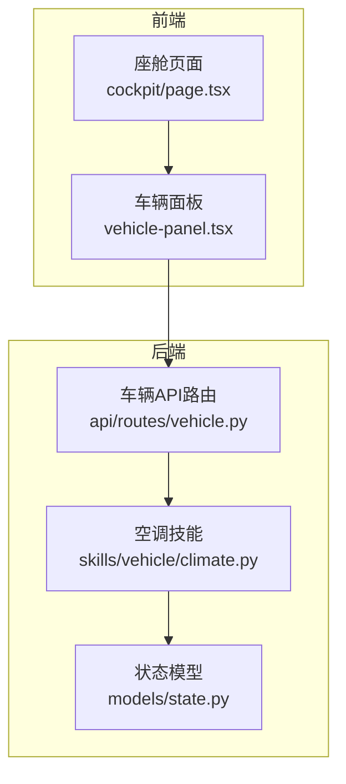
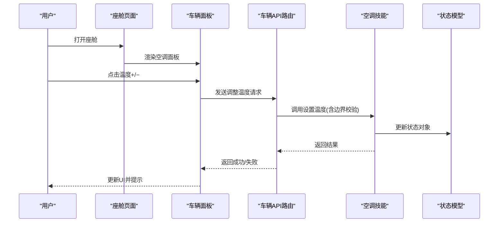
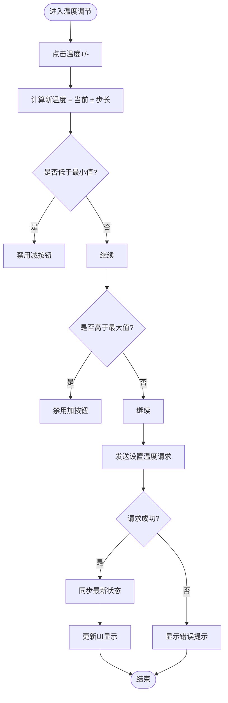
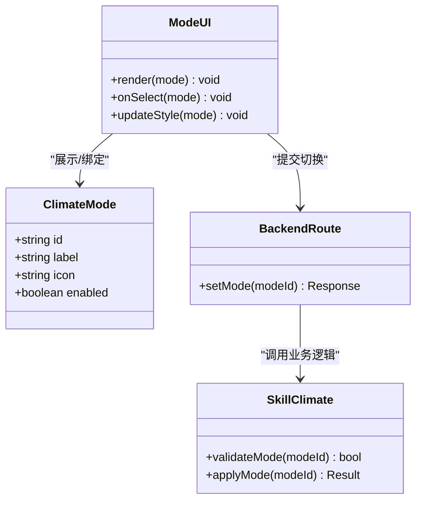
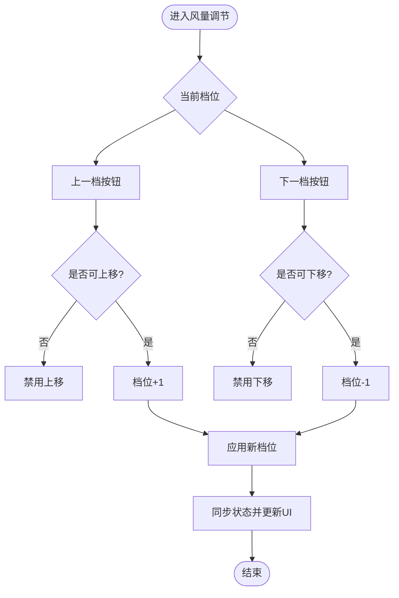
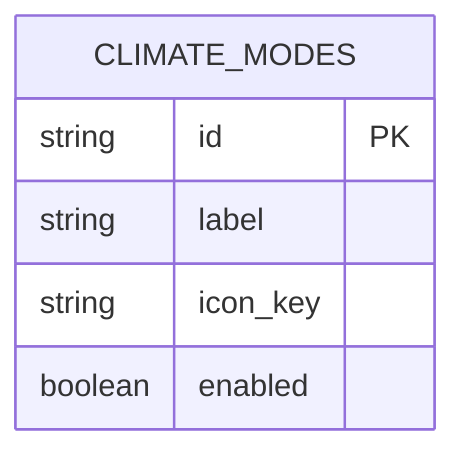
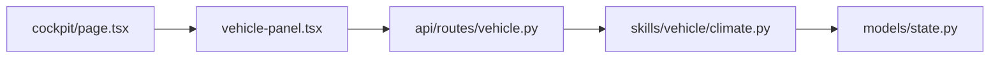

# 空调控制模块

<cite>
**本文引用的文件**   
- [frontend_design/src/app/cockpit/page.tsx](file://frontend_design/src/app/cockpit/page.tsx)
- [frontend_design/src/components/vehicle/vehicle-panel.tsx](file://frontend_design/src/components/vehicle/vehicle-panel.tsx)
- [backend_design/nexus/skills/vehicle/climate.py](file://backend_design/nexus/skills/vehicle/climate.py)
- [backend_design/nexus/api/routes/vehicle.py](file://backend_design/nexus/api/routes/vehicle.py)
- [backend_design/nexus/models/state.py](file://backend_design/nexus/models/state.py)
</cite>

## 目录
1. [简介](#简介)
2. [项目结构](#项目结构)
3. [核心组件](#核心组件)
4. [架构总览](#架构总览)
5. [详细组件分析](#详细组件分析)
6. [依赖关系分析](#依赖关系分析)
7. [性能考虑](#性能考虑)
8. [故障排查指南](#故障排查指南)
9. [结论](#结论)
10. [附录](#附录)

## 简介
本技术文档聚焦于“空调控制模块”，围绕温度调节、模式切换与风量调节三大能力，系统阐述前端交互逻辑、状态同步机制、后端接口与数据模型，以及配置结构与样式动态切换等实现细节。文档同时提供用户交互反馈、错误处理与无障碍访问的优化建议，帮助开发者快速理解并扩展该模块。

## 项目结构
空调控制模块涉及前后端协同：
- 前端页面与面板负责展示与控制（温度、模式、风量），并通过 API 与后端通信。
- 后端技能层封装车辆空调能力，API 路由暴露 HTTP/WebSocket 接口，状态模型统一描述当前空调状态。

**图示来源**
- [frontend_design/src/app/cockpit/page.tsx](file://frontend_design/src/app/cockpit/page.tsx)
- [frontend_design/src/components/vehicle/vehicle-panel.tsx](file://frontend_design/src/components/vehicle/vehicle-panel.tsx)
- [backend_design/nexus/api/routes/vehicle.py](file://backend_design/nexus/api/routes/vehicle.py)
- [backend_design/nexus/skills/vehicle/climate.py](file://backend_design/nexus/skills/vehicle/climate.py)
- [backend_design/nexus/models/state.py](file://backend_design/nexus/models/state.py)

**章节来源**
- [frontend_design/src/app/cockpit/page.tsx](file://frontend_design/src/app/cockpit/page.tsx)
- [frontend_design/src/components/vehicle/vehicle-panel.tsx](file://frontend_design/src/components/vehicle/vehicle-panel.tsx)
- [backend_design/nexus/api/routes/vehicle.py](file://backend_design/nexus/api/routes/vehicle.py)
- [backend_design/nexus/skills/vehicle/climate.py](file://backend_design/nexus/skills/vehicle/climate.py)
- [backend_design/nexus/models/state.py](file://backend_design/nexus/models/state.py)

## 核心组件
- 前端座舱页面：承载空调控制面板入口与上下文，负责将用户操作转发至车辆面板组件。
- 车辆面板组件：实现温度增减按钮、模式选择、风量步进控制，维护本地显示状态并与后端同步。
- 后端车辆API路由：接收前端请求，校验参数，调用空调技能执行控制。
- 空调技能：封装空调业务逻辑，包括温度范围限制、模式枚举、风量档位映射与边界处理。
- 状态模型：定义空调状态的字段与约束，作为前后端一致的数据契约。

**章节来源**
- [frontend_design/src/app/cockpit/page.tsx](file://frontend_design/src/app/cockpit/page.tsx)
- [frontend_design/src/components/vehicle/vehicle-panel.tsx](file://frontend_design/src/components/vehicle/vehicle-panel.tsx)
- [backend_design/nexus/api/routes/vehicle.py](file://backend_design/nexus/api/routes/vehicle.py)
- [backend_design/nexus/skills/vehicle/climate.py](file://backend_design/nexus/skills/vehicle/climate.py)
- [backend_design/nexus/models/state.py](file://backend_design/nexus/models/state.py)

## 架构总览
空调控制采用“前端面板 + 后端技能”的分层架构。前端负责交互与可视化，后端负责业务规则与设备控制。状态模型贯穿两端，确保一致性。

**图示来源**
- [frontend_design/src/app/cockpit/page.tsx](file://frontend_design/src/app/cockpit/page.tsx)
- [frontend_design/src/components/vehicle/vehicle-panel.tsx](file://frontend_design/src/components/vehicle/vehicle-panel.tsx)
- [backend_design/nexus/api/routes/vehicle.py](file://backend_design/nexus/api/routes/vehicle.py)
- [backend_design/nexus/skills/vehicle/climate.py](file://backend_design/nexus/skills/vehicle/climate.py)
- [backend_design/nexus/models/state.py](file://backend_design/nexus/models/state.py)

## 详细组件分析

### 温度调节功能
- 交互逻辑
  - 温度增加/减少按钮触发增量或减量事件，按步长更新目标温度。
  - 在达到最小/最大边界时禁用对应按钮，防止越界。
- 边界值处理
  - 后端对目标温度进行裁剪到允许区间；若超出则返回错误码与提示信息。
  - 前端在收到响应后刷新显示，并在越界时给出即时反馈。
- 状态同步机制
  - 每次调整后通过API拉取最新状态，或使用WebSocket推送更新。
  - 本地缓存与远端状态不一致时，优先以服务端为准，必要时回滚本地变更。

**图示来源**
- [frontend_design/src/components/vehicle/vehicle-panel.tsx](file://frontend_design/src/components/vehicle/vehicle-panel.tsx)
- [backend_design/nexus/api/routes/vehicle.py](file://backend_design/nexus/api/routes/vehicle.py)
- [backend_design/nexus/skills/vehicle/climate.py](file://backend_design/nexus/skills/vehicle/climate.py)
- [backend_design/nexus/models/state.py](file://backend_design/nexus/models/state.py)

**章节来源**
- [frontend_design/src/components/vehicle/vehicle-panel.tsx](file://frontend_design/src/components/vehicle/vehicle-panel.tsx)
- [backend_design/nexus/api/routes/vehicle.py](file://backend_design/nexus/api/routes/vehicle.py)
- [backend_design/nexus/skills/vehicle/climate.py](file://backend_design/nexus/skills/vehicle/climate.py)
- [backend_design/nexus/models/state.py](file://backend_design/nexus/models/state.py)

### 空调模式切换功能
- 支持模式
  - 自动、制冷、制热、通风、除霜五种模式。
- UI展示
  - 使用图标+文字标签组合呈现各模式，选中态高亮，未选中态置灰。
  - 根据当前模式动态切换背景色或边框样式，增强可感知性。
- 状态管理
  - 前端维护当前模式，点击切换时立即乐观更新UI，随后向服务端提交变更。
  - 若服务端拒绝（如不支持当前模式或设备忙），回滚UI并提示原因。

**图示来源**
- [frontend_design/src/components/vehicle/vehicle-panel.tsx](file://frontend_design/src/components/vehicle/vehicle-panel.tsx)
- [backend_design/nexus/api/routes/vehicle.py](file://backend_design/nexus/api/routes/vehicle.py)
- [backend_design/nexus/skills/vehicle/climate.py](file://backend_design/nexus/skills/vehicle/climate.py)

**章节来源**
- [frontend_design/src/components/vehicle/vehicle-panel.tsx](file://frontend_design/src/components/vehicle/vehicle-panel.tsx)
- [backend_design/nexus/api/routes/vehicle.py](file://backend_design/nexus/api/routes/vehicle.py)
- [backend_design/nexus/skills/vehicle/climate.py](file://backend_design/nexus/skills/vehicle/climate.py)

### 风量调节系统
- 7档风量
  - 使用可视化条或圆点表示7个档位，当前档位高亮。
- 步进控制
  - 支持“上一档/下一档”步进按钮，到达最低/最高档时禁用相应按钮。
- 禁用状态处理
  - 当空调关闭或设备不可用时，整体禁用风量控件，并显示不可用提示。
- 样式动态切换
  - 根据档位强度改变颜色深浅或动画强度，提升直观感受。

**图示来源**
- [frontend_design/src/components/vehicle/vehicle-panel.tsx](file://frontend_design/src/components/vehicle/vehicle-panel.tsx)
- [backend_design/nexus/api/routes/vehicle.py](file://backend_design/nexus/api/routes/vehicle.py)
- [backend_design/nexus/skills/vehicle/climate.py](file://backend_design/nexus/skills/vehicle/climate.py)

**章节来源**
- [frontend_design/src/components/vehicle/vehicle-panel.tsx](file://frontend_design/src/components/vehicle/vehicle-panel.tsx)
- [backend_design/nexus/api/routes/vehicle.py](file://backend_design/nexus/api/routes/vehicle.py)
- [backend_design/nexus/skills/vehicle/climate.py](file://backend_design/nexus/skills/vehicle/climate.py)

### CLIMATE_MODES 配置结构与图标映射
- 配置结构
  - 包含模式ID、显示名称、图标资源标识、启用标志等字段。
  - 用于驱动前端渲染与后端校验的一致性。
- 图标映射
  - 前端根据模式ID映射到具体图标资源，支持主题化替换。
- 样式动态切换
  - 根据模式类型（冷/暖/风/霜）切换主色调与动效，提高辨识度。

**图示来源**
- [backend_design/nexus/skills/vehicle/climate.py](file://backend_design/nexus/skills/vehicle/climate.py)
- [frontend_design/src/components/vehicle/vehicle-panel.tsx](file://frontend_design/src/components/vehicle/vehicle-panel.tsx)

**章节来源**
- [backend_design/nexus/skills/vehicle/climate.py](file://backend_design/nexus/skills/vehicle/climate.py)
- [frontend_design/src/components/vehicle/vehicle-panel.tsx](file://frontend_design/src/components/vehicle/vehicle-panel.tsx)

### 用户交互反馈、错误处理与无障碍访问
- 交互反馈
  - 操作后立即给予视觉反馈（高亮、加载指示），成功后显示确认提示。
- 错误处理
  - 网络异常或服务端拒绝时，显示明确错误信息并提供重试入口。
  - 对越界输入进行拦截并提示合法范围。
- 无障碍访问
  - 为所有可交互元素提供语义化标签与键盘可达性。
  - 为图标按钮添加aria-label，屏幕阅读器可读。
  - 对比度与焦点可见性符合WCAG标准。

**章节来源**
- [frontend_design/src/components/vehicle/vehicle-panel.tsx](file://frontend_design/src/components/vehicle/vehicle-panel.tsx)
- [backend_design/nexus/api/routes/vehicle.py](file://backend_design/nexus/api/routes/vehicle.py)

## 依赖关系分析
- 前端依赖
  - 座舱页面依赖车辆面板组件，后者依赖API客户端与服务端状态。
- 后端依赖
  - 车辆API路由依赖空调技能，技能依赖状态模型与设备抽象。
- 耦合与内聚
  - 前后端通过状态模型解耦，职责清晰；技能层集中业务规则，便于测试与维护。

**图示来源**
- [frontend_design/src/app/cockpit/page.tsx](file://frontend_design/src/app/cockpit/page.tsx)
- [frontend_design/src/components/vehicle/vehicle-panel.tsx](file://frontend_design/src/components/vehicle/vehicle-panel.tsx)
- [backend_design/nexus/api/routes/vehicle.py](file://backend_design/nexus/api/routes/vehicle.py)
- [backend_design/nexus/skills/vehicle/climate.py](file://backend_design/nexus/skills/vehicle/climate.py)
- [backend_design/nexus/models/state.py](file://backend_design/nexus/models/state.py)

**章节来源**
- [frontend_design/src/app/cockpit/page.tsx](file://frontend_design/src/app/cockpit/page.tsx)
- [frontend_design/src/components/vehicle/vehicle-panel.tsx](file://frontend_design/src/components/vehicle/vehicle-panel.tsx)
- [backend_design/nexus/api/routes/vehicle.py](file://backend_design/nexus/api/routes/vehicle.py)
- [backend_design/nexus/skills/vehicle/climate.py](file://backend_design/nexus/skills/vehicle/climate.py)
- [backend_design/nexus/models/state.py](file://backend_design/nexus/models/state.py)

## 性能考虑
- 前端
  - 避免频繁重绘，批量更新UI；节流/防抖处理高频点击。
  - 使用虚拟列表或懒加载渲染大量模式/档位项。
- 后端
  - 参数校验前置，尽早返回错误，减少无效计算。
  - 状态更新尽量幂等，避免重复命令导致抖动。
- 网络
  - 合理缓存只读配置（如CLIMATE_MODES），减少重复请求。
  - 使用WebSocket推送状态变化，降低轮询开销。

[本节为通用指导，不直接分析具体文件]

## 故障排查指南
- 常见问题
  - 温度无法调整：检查边界值与设备状态，确认服务端返回的错误码。
  - 模式切换失败：核对CLIMATE_MODES配置与设备能力，查看日志定位拒绝原因。
  - 风量无响应：确认空调是否开启，检查禁用状态与网络连通性。
- 调试建议
  - 在前端控制台打印请求/响应体，比对状态模型字段。
  - 在后端记录关键路径日志，包括参数校验结果与异常堆栈。
  - 使用浏览器无障碍工具验证标签与焦点顺序。

**章节来源**
- [backend_design/nexus/api/routes/vehicle.py](file://backend_design/nexus/api/routes/vehicle.py)
- [backend_design/nexus/skills/vehicle/climate.py](file://backend_design/nexus/skills/vehicle/climate.py)
- [backend_design/nexus/models/state.py](file://backend_design/nexus/models/state.py)

## 结论
空调控制模块通过清晰的前后端分层与统一的状态模型，实现了温度调节、模式切换与风量控制的稳定交互。结合完善的边界处理、错误反馈与无障碍设计，可提供良好的用户体验。后续可在性能优化与可观测性方面持续改进，进一步提升稳定性与可维护性。

[本节为总结性内容，不直接分析具体文件]

## 附录
- 术语
  - 状态模型：前后端共享的空调状态数据结构。
  - 技能：封装特定领域能力的后端服务。
  - 乐观更新：先更新UI再等待服务端确认的交互策略。

[本节为概念说明，不直接分析具体文件]