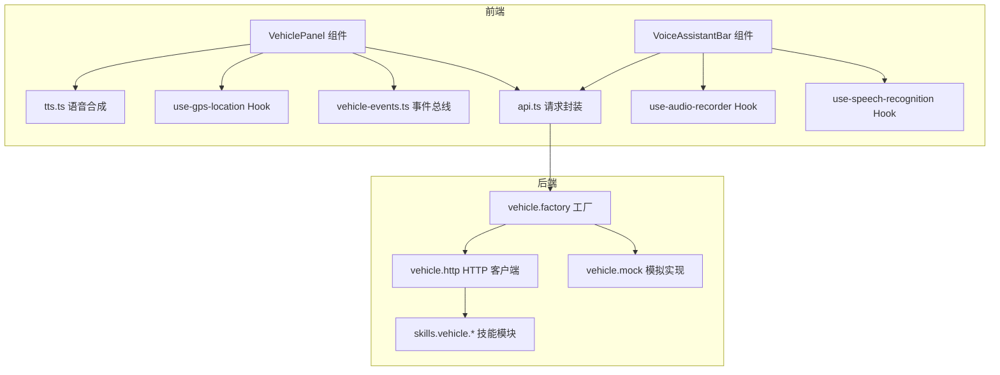
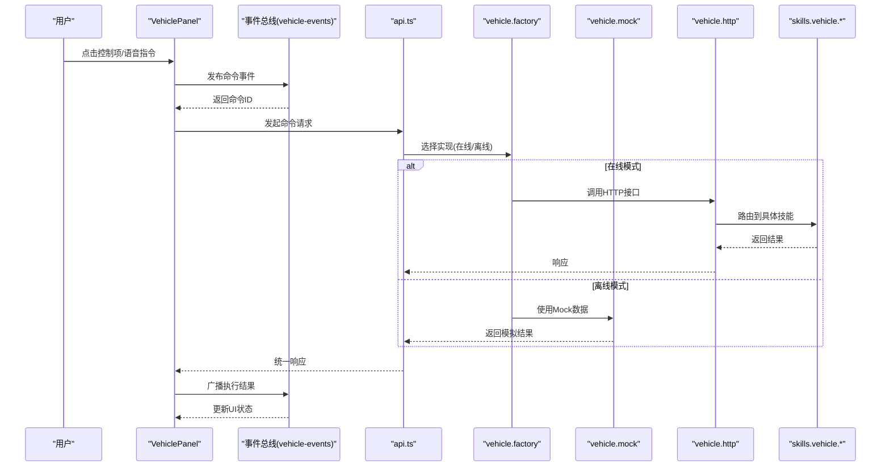
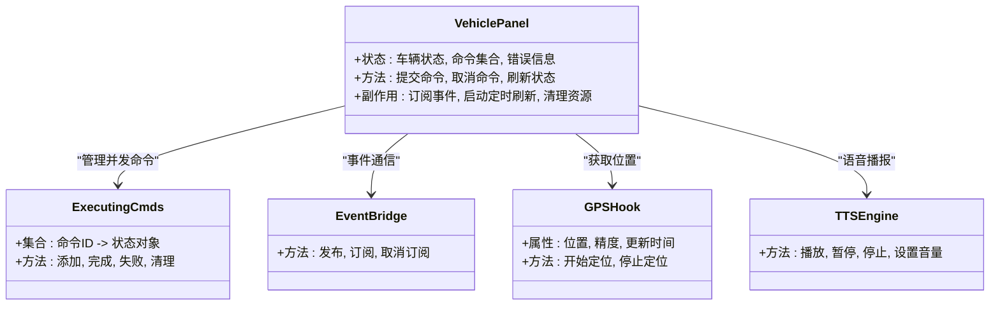
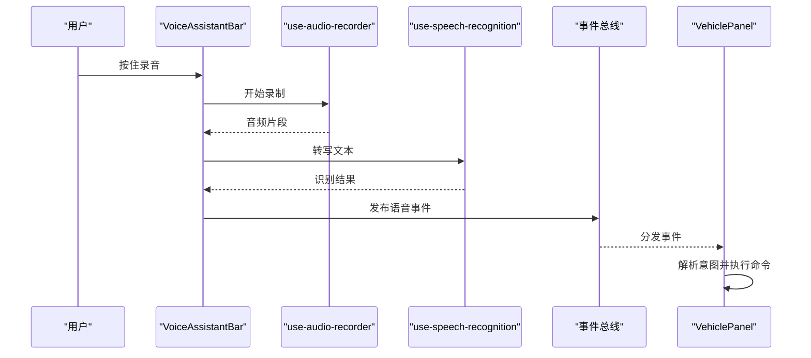
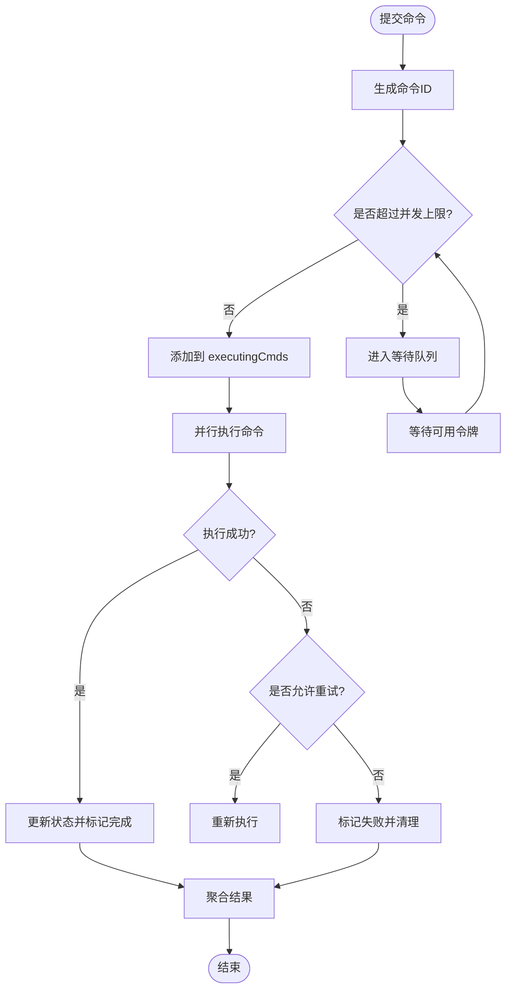
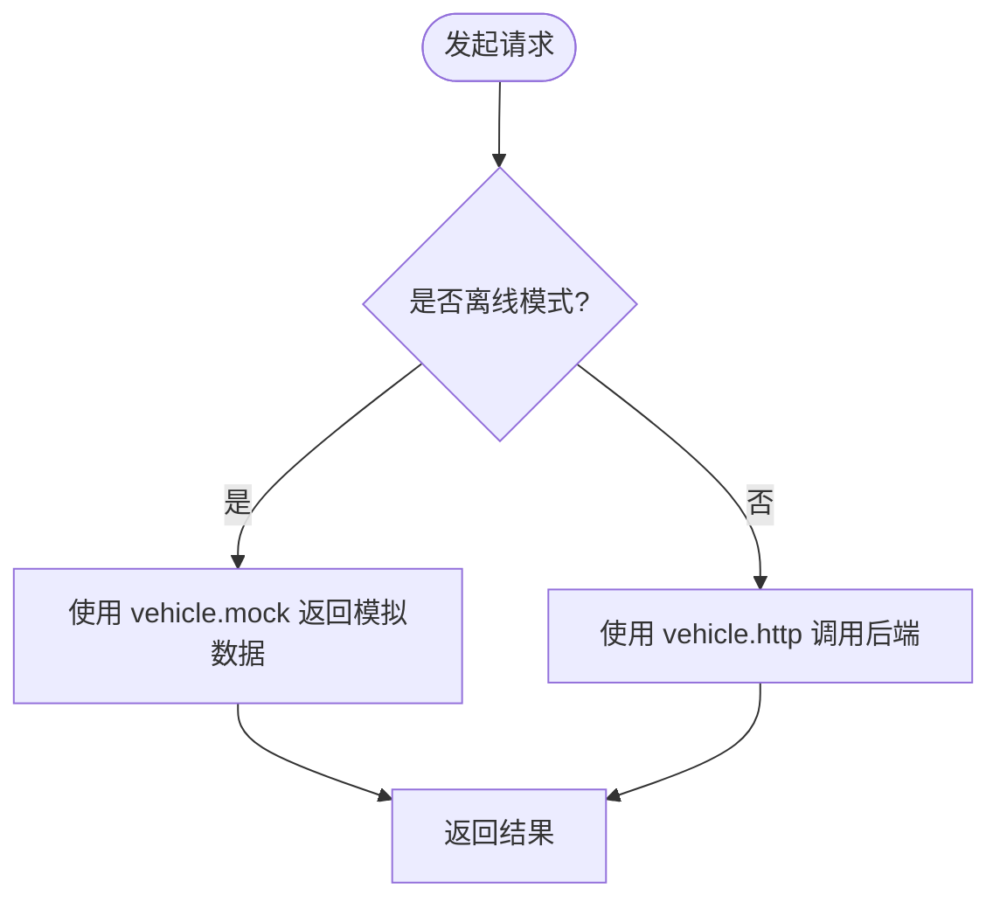
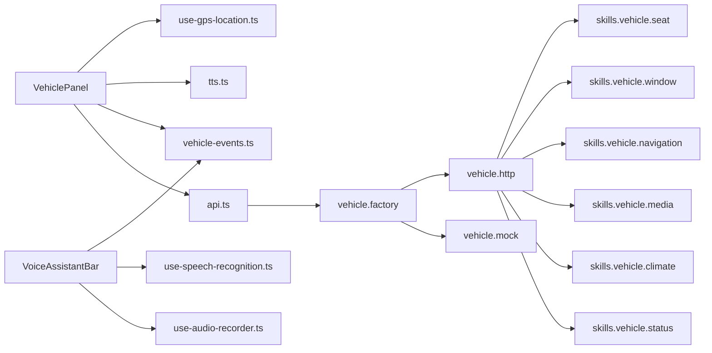

# 组件架构设计

<cite>
**本文引用的文件**   
- [frontend_design/src/components/vehicle/vehicle-panel.tsx](file://frontend_design/src/components/vehicle/vehicle-panel.tsx)
- [frontend_design/src/components/vehicle/voice-assistant-bar.tsx](file://frontend_design/src/components/vehicle/voice-assistant-bar.tsx)
- [frontend_design/src/hooks/use-gps-location.ts](file://frontend_design/src/hooks/use-gps-location.ts)
- [frontend_design/src/hooks/use-audio-recorder.ts](file://frontend_design/src/hooks/use-audio-recorder.ts)
- [frontend_design/src/hooks/use-speech-recognition.ts](file://frontend_design/src/hooks/use-speech-recognition.ts)
- [frontend_design/src/lib/vehicle-events.ts](file://frontend_design/src/lib/vehicle-events.ts)
- [frontend_design/src/lib/api.ts](file://frontend_design/src/lib/api.ts)
- [frontend_design/src/lib/tts.ts](file://frontend_design/src/lib/tts.ts)
- [frontend_design/src/app/cockpit/page.tsx](file://frontend_design/src/app/cockpit/page.tsx)
- [backend_design/nexus/vehicle/mock.py](file://backend_design/nexus/vehicle/mock.py)
- [backend_design/nexus/vehicle/http.py](file://backend_design/nexus/vehicle/http.py)
- [backend_design/nexus/vehicle/factory.py](file://backend_design/nexus/vehicle/factory.py)
- [backend_design/nexus/skills/vehicle/status.py](file://backend_design/nexus/skills/vehicle/status.py)
- [backend_design/nexus/skills/vehicle/climate.py](file://backend_design/nexus/skills/vehicle/climate.py)
- [backend_design/nexus/skills/vehicle/media.py](file://backend_design/nexus/skills/vehicle/media.py)
- [backend_design/nexus/skills/vehicle/navigation.py](file://backend_design/nexus/skills/vehicle/navigation.py)
- [backend_design/nexus/skills/vehicle/window.py](file://backend_design/nexus/skills/vehicle/window.py)
- [backend_design/nexus/skills/vehicle/seat.py](file://backend_design/nexus/skills/vehicle/seat.py)
</cite>

## 目录
1. [引言](#引言)
2. [项目结构](#项目结构)
3. [核心组件](#核心组件)
4. [架构总览](#架构总览)
5. [详细组件分析](#详细组件分析)
6. [依赖关系分析](#依赖关系分析)
7. [性能考虑](#性能考虑)
8. [故障排查指南](#故障排查指南)
9. [结论](#结论)
10. [附录](#附录)

## 引言
本文件聚焦于车控面板组件 VehiclePanel 的架构设计，围绕以下目标展开：
- 整体架构模式与状态管理策略（useState、useRef）
- 生命周期管理与清理机制（useEffect 清理）
- 错误边界处理与降级策略
- 离线模式与 Mock 数据切换逻辑
- 多命令并行执行机制与 executingCmds 集合的状态管理
- GPS 定位集成、语音助手事件订阅、音频播放管理等高级特性
- 组件间通信模式、性能优化策略与内存泄漏防护最佳实践

## 项目结构
前端采用 Next.js 应用组织方式，车控相关能力集中在 frontend_design/src/components/vehicle 与 hooks、lib 目录下；后端通过 Python 服务暴露车辆技能接口，并提供 Mock 实现用于离线开发。

图表来源
- [frontend_design/src/components/vehicle/vehicle-panel.tsx](file://frontend_design/src/components/vehicle/vehicle-panel.tsx)
- [frontend_design/src/components/vehicle/voice-assistant-bar.tsx](file://frontend_design/src/components/vehicle/voice-assistant-bar.tsx)
- [frontend_design/src/hooks/use-gps-location.ts](file://frontend_design/src/hooks/use-gps-location.ts)
- [frontend_design/src/hooks/use-audio-recorder.ts](file://frontend_design/src/hooks/use-audio-recorder.ts)
- [frontend_design/src/hooks/use-speech-recognition.ts](file://frontend_design/src/hooks/use-speech-recognition.ts)
- [frontend_design/src/lib/api.ts](file://frontend_design/src/lib/api.ts)
- [frontend_design/src/lib/tts.ts](file://frontend_design/src/lib/tts.ts)
- [frontend_design/src/lib/vehicle-events.ts](file://frontend_design/src/lib/vehicle-events.ts)
- [backend_design/nexus/vehicle/factory.py](file://backend_design/nexus/vehicle/factory.py)
- [backend_design/nexus/vehicle/mock.py](file://backend_design/nexus/vehicle/mock.py)
- [backend_design/nexus/vehicle/http.py](file://backend_design/nexus/vehicle/http.py)
- [backend_design/nexus/skills/vehicle/status.py](file://backend_design/nexus/skills/vehicle/status.py)
- [backend_design/nexus/skills/vehicle/climate.py](file://backend_design/nexus/skills/vehicle/climate.py)
- [backend_design/nexus/skills/vehicle/media.py](file://backend_design/nexus/skills/vehicle/media.py)
- [backend_design/nexus/skills/vehicle/navigation.py](file://backend_design/nexus/skills/vehicle/navigation.py)
- [backend_design/nexus/skills/vehicle/window.py](file://backend_design/nexus/skills/vehicle/window.py)
- [backend_design/nexus/skills/vehicle/seat.py](file://backend_design/nexus/skills/vehicle/seat.py)

章节来源
- [frontend_design/src/app/cockpit/page.tsx](file://frontend_design/src/app/cockpit/page.tsx)

## 核心组件
- VehiclePanel：车控面板主容器，负责聚合车辆状态、用户交互、命令编排、UI 渲染与错误边界。
- VoiceAssistantBar：语音助手条，负责录音、语音识别、TTS 播放与事件分发。
- Hooks：GPS 定位、录音、语音识别等可复用能力。
- Lib：API 封装、TTS 引擎、事件总线等通用能力。

章节来源
- [frontend_design/src/components/vehicle/vehicle-panel.tsx](file://frontend_design/src/components/vehicle/vehicle-panel.tsx)
- [frontend_design/src/components/vehicle/voice-assistant-bar.tsx](file://frontend_design/src/components/vehicle/voice-assistant-bar.tsx)
- [frontend_design/src/hooks/use-gps-location.ts](file://frontend_design/src/hooks/use-gps-location.ts)
- [frontend_design/src/hooks/use-audio-recorder.ts](file://frontend_design/src/hooks/use-audio-recorder.ts)
- [frontend_design/src/hooks/use-speech-recognition.ts](file://frontend_design/src/hooks/use-speech-recognition.ts)
- [frontend_design/src/lib/vehicle-events.ts](file://frontend_design/src/lib/vehicle-events.ts)
- [frontend_design/src/lib/api.ts](file://frontend_design/src/lib/api.ts)
- [frontend_design/src/lib/tts.ts](file://frontend_design/src/lib/tts.ts)

## 架构总览
VehiclePanel 采用“容器 + 展示”的组合式架构：
- 容器层：集中管理状态（useState）、引用（useRef）、副作用（useEffect），协调子组件与外部系统（GPS、TTS、后端）。
- 展示层：纯 UI 组件，接收 props 并触发回调。
- 事件总线：基于 vehicle-events.ts 的发布/订阅模型，解耦组件间通信。
- 命令编排：executingCmds 集合维护并发命令状态，支持并行执行与结果聚合。
- 降级策略：离线模式下回退到本地 Mock 数据与本地能力。

图表来源
- [frontend_design/src/components/vehicle/vehicle-panel.tsx](file://frontend_design/src/components/vehicle/vehicle-panel.tsx)
- [frontend_design/src/lib/vehicle-events.ts](file://frontend_design/src/lib/vehicle-events.ts)
- [frontend_design/src/lib/api.ts](file://frontend_design/src/lib/api.ts)
- [backend_design/nexus/vehicle/factory.py](file://backend_design/nexus/vehicle/factory.py)
- [backend_design/nexus/vehicle/mock.py](file://backend_design/nexus/vehicle/mock.py)
- [backend_design/nexus/vehicle/http.py](file://backend_design/nexus/vehicle/http.py)
- [backend_design/nexus/skills/vehicle/status.py](file://backend_design/nexus/skills/vehicle/status.py)
- [backend_design/nexus/skills/vehicle/climate.py](file://backend_design/nexus/skills/vehicle/climate.py)
- [backend_design/nexus/skills/vehicle/media.py](file://backend_design/nexus/skills/vehicle/media.py)
- [backend_design/nexus/skills/vehicle/navigation.py](file://backend_design/nexus/skills/vehicle/navigation.py)
- [backend_design/nexus/skills/vehicle/window.py](file://backend_design/nexus/skills/vehicle/window.py)
- [backend_design/nexus/skills/vehicle/seat.py](file://backend_design/nexus/skills/vehicle/seat.py)

## 详细组件分析

### VehiclePanel 组件分析
- 状态管理策略
  - useState：管理车辆状态、命令队列、错误信息、UI 开关等。
  - useRef：保存非渲染引用，如定时器、事件监听器句柄、音频实例等，避免不必要的重渲染。
- 生命周期管理
  - useEffect：订阅 GPS、事件总线、TTS 事件；在清理函数中移除监听、停止计时器、释放资源，防止内存泄漏。
- 错误边界处理
  - 在组件内部捕获异常并降级显示，结合全局错误边界兜底，确保崩溃不扩散。
- 离线模式与 Mock 切换
  - 通过配置或运行时标志决定使用后端 HTTP 还是本地 Mock；API 层根据工厂选择实现。
- 多命令并行执行
  - executingCmds 集合记录正在执行的命令 ID 与状态，支持并发提交、去重、超时与失败重试。
- GPS 定位集成
  - 使用 use-gps-location Hook 获取位置，并在地图或导航相关功能中使用。
- 语音助手事件订阅
  - 订阅来自 VoiceAssistantBar 的语音事件，驱动面板动作（如打开空调、调整媒体音量）。
- 音频播放管理
  - 与 tts.ts 协作，管理播放队列、中断、优先级与音量控制。

图表来源
- [frontend_design/src/components/vehicle/vehicle-panel.tsx](file://frontend_design/src/components/vehicle/vehicle-panel.tsx)
- [frontend_design/src/lib/vehicle-events.ts](file://frontend_design/src/lib/vehicle-events.ts)
- [frontend_design/src/hooks/use-gps-location.ts](file://frontend_design/src/hooks/use-gps-location.ts)
- [frontend_design/src/lib/tts.ts](file://frontend_design/src/lib/tts.ts)

章节来源
- [frontend_design/src/components/vehicle/vehicle-panel.tsx](file://frontend_design/src/components/vehicle/vehicle-panel.tsx)

### 语音助手条 VoiceAssistantBar 分析
- 录音与识别
  - use-audio-recorder 采集音频流，use-speech-recognition 将音频转为文本。
- 事件分发
  - 将识别结果转换为语义化事件，通过事件总线通知 VehiclePanel。
- 音频播放
  - 与 tts.ts 集成，支持打断、队列与优先级。

图表来源
- [frontend_design/src/components/vehicle/voice-assistant-bar.tsx](file://frontend_design/src/components/vehicle/voice-assistant-bar.tsx)
- [frontend_design/src/hooks/use-audio-recorder.ts](file://frontend_design/src/hooks/use-audio-recorder.ts)
- [frontend_design/src/hooks/use-speech-recognition.ts](file://frontend_design/src/hooks/use-speech-recognition.ts)
- [frontend_design/src/lib/vehicle-events.ts](file://frontend_design/src/lib/vehicle-events.ts)
- [frontend_design/src/components/vehicle/vehicle-panel.tsx](file://frontend_design/src/components/vehicle/vehicle-panel.tsx)

章节来源
- [frontend_design/src/components/vehicle/voice-assistant-bar.tsx](file://frontend_design/src/components/vehicle/voice-assistant-bar.tsx)
- [frontend_design/src/hooks/use-audio-recorder.ts](file://frontend_design/src/hooks/use-audio-recorder.ts)
- [frontend_design/src/hooks/use-speech-recognition.ts](file://frontend_design/src/hooks/use-speech-recognition.ts)

### 多命令并行执行流程
- 设计思路
  - 每个命令生成唯一 ID，加入 executingCmds 集合。
  - 并发限制：通过令牌桶或最大并发数控制。
  - 超时与重试：为每个命令设置超时时间，失败时按策略重试。
  - 结果聚合：所有命令完成后汇总状态，更新 UI。
- 状态管理
  - useState 维护集合快照，useRef 保存实时集合以避免闭包陷阱。

图表来源
- [frontend_design/src/components/vehicle/vehicle-panel.tsx](file://frontend_design/src/components/vehicle/vehicle-panel.tsx)
- [frontend_design/src/lib/api.ts](file://frontend_design/src/lib/api.ts)

章节来源
- [frontend_design/src/components/vehicle/vehicle-panel.tsx](file://frontend_design/src/components/vehicle/vehicle-panel.tsx)
- [frontend_design/src/lib/api.ts](file://frontend_design/src/lib/api.ts)

### 离线模式与 Mock 数据切换
- 切换逻辑
  - 通过配置或环境变量启用离线模式；API 层根据工厂选择 Mock 或 HTTP 实现。
- 数据一致性
  - Mock 数据需覆盖常用场景（状态查询、控制命令），保证 UI 行为一致。
- 降级策略
  - 网络不可用时自动切换到 Mock；关键路径具备本地缓存与回退方案。

图表来源
- [frontend_design/src/lib/api.ts](file://frontend_design/src/lib/api.ts)
- [backend_design/nexus/vehicle/factory.py](file://backend_design/nexus/vehicle/factory.py)
- [backend_design/nexus/vehicle/mock.py](file://backend_design/nexus/vehicle/mock.py)
- [backend_design/nexus/vehicle/http.py](file://backend_design/nexus/vehicle/http.py)

章节来源
- [frontend_design/src/lib/api.ts](file://frontend_design/src/lib/api.ts)
- [backend_design/nexus/vehicle/factory.py](file://backend_design/nexus/vehicle/factory.py)
- [backend_design/nexus/vehicle/mock.py](file://backend_design/nexus/vehicle/mock.py)
- [backend_design/nexus/vehicle/http.py](file://backend_design/nexus/vehicle/http.py)

### GPS 定位集成
- 定位能力
  - use-gps-location Hook 提供位置、精度、更新时间等状态，支持开始/停止定位。
- 使用场景
  - 导航、附近兴趣点推荐、天气与路况联动。
- 权限与隐私
  - 需要用户授权；在隐私敏感场景下提供关闭选项。

章节来源
- [frontend_design/src/hooks/use-gps-location.ts](file://frontend_design/src/hooks/use-gps-location.ts)

### 音频播放管理
- 播放控制
  - tts.ts 提供播放、暂停、停止、音量调节等方法。
- 队列与优先级
  - 支持高优先级提示音打断低优先级播报；队列顺序可控。
- 资源管理
  - 组件卸载时释放音频实例，避免内存泄漏。

章节来源
- [frontend_design/src/lib/tts.ts](file://frontend_design/src/lib/tts.ts)

### 事件总线与组件通信
- 发布/订阅
  - vehicle-events.ts 提供统一的发布与订阅接口，解耦组件耦合度。
- 事件类型
  - 定义清晰的领域事件（如命令执行、状态变更、错误上报）。
- 错误传播
  - 错误事件向上冒泡，便于统一处理与日志记录。

章节来源
- [frontend_design/src/lib/vehicle-events.ts](file://frontend_design/src/lib/vehicle-events.ts)

## 依赖关系分析
- 前端依赖
  - VehiclePanel 依赖 api.ts、vehicle-events.ts、tts.ts、use-gps-location.ts。
  - VoiceAssistantBar 依赖 use-audio-recorder.ts、use-speech-recognition.ts、vehicle-events.ts。
- 后端依赖
  - factory.py 根据配置选择 mock.py 或 http.py。
  - http.py 路由到 skills.vehicle.* 各技能模块。

图表来源
- [frontend_design/src/components/vehicle/vehicle-panel.tsx](file://frontend_design/src/components/vehicle/vehicle-panel.tsx)
- [frontend_design/src/components/vehicle/voice-assistant-bar.tsx](file://frontend_design/src/components/vehicle/voice-assistant-bar.tsx)
- [frontend_design/src/hooks/use-gps-location.ts](file://frontend_design/src/hooks/use-gps-location.ts)
- [frontend_design/src/hooks/use-audio-recorder.ts](file://frontend_design/src/hooks/use-audio-recorder.ts)
- [frontend_design/src/hooks/use-speech-recognition.ts](file://frontend_design/src/hooks/use-speech-recognition.ts)
- [frontend_design/src/lib/vehicle-events.ts](file://frontend_design/src/lib/vehicle-events.ts)
- [frontend_design/src/lib/api.ts](file://frontend_design/src/lib/api.ts)
- [frontend_design/src/lib/tts.ts](file://frontend_design/src/lib/tts.ts)
- [backend_design/nexus/vehicle/factory.py](file://backend_design/nexus/vehicle/factory.py)
- [backend_design/nexus/vehicle/mock.py](file://backend_design/nexus/vehicle/mock.py)
- [backend_design/nexus/vehicle/http.py](file://backend_design/nexus/vehicle/http.py)
- [backend_design/nexus/skills/vehicle/status.py](file://backend_design/nexus/skills/vehicle/status.py)
- [backend_design/nexus/skills/vehicle/climate.py](file://backend_design/nexus/skills/vehicle/climate.py)
- [backend_design/nexus/skills/vehicle/media.py](file://backend_design/nexus/skills/vehicle/media.py)
- [backend_design/nexus/skills/vehicle/navigation.py](file://backend_design/nexus/skills/vehicle/navigation.py)
- [backend_design/nexus/skills/vehicle/window.py](file://backend_design/nexus/skills/vehicle/window.py)
- [backend_design/nexus/skills/vehicle/seat.py](file://backend_design/nexus/skills/vehicle/seat.py)

章节来源
- [frontend_design/src/components/vehicle/vehicle-panel.tsx](file://frontend_design/src/components/vehicle/vehicle-panel.tsx)
- [frontend_design/src/components/vehicle/voice-assistant-bar.tsx](file://frontend_design/src/components/vehicle/voice-assistant-bar.tsx)
- [frontend_design/src/lib/api.ts](file://frontend_design/src/lib/api.ts)
- [backend_design/nexus/vehicle/factory.py](file://backend_design/nexus/vehicle/factory.py)
- [backend_design/nexus/vehicle/http.py](file://backend_design/nexus/vehicle/http.py)

## 性能考虑
- 状态最小化
  - 仅将必要状态提升到父级，减少重渲染范围。
- 引用优化
  - 使用 useRef 保存频繁访问但不需渲染的数据，避免闭包失效与重复计算。
- 事件去抖与节流
  - 对高频事件（如定位更新、输入）进行节流，降低处理压力。
- 并发控制
  - 限制 executingCmds 的最大并发数，避免雪崩效应。
- 资源释放
  - 在 useEffect 清理函数中释放定时器、监听器、音频实例，防止内存泄漏。
- 懒加载与代码分割
  - 按需加载重型模块（如语音识别、地图），提升首屏性能。

[本节为通用指导，无需列出具体文件来源]

## 故障排查指南
- 常见问题
  - 命令执行超时：检查 executingCmds 中的超时配置与重试策略。
  - 语音无法播放：确认 tts.ts 的音频实例是否正确初始化与释放。
  - 定位权限被拒：引导用户开启权限或提供手动输入坐标的降级方案。
  - 离线模式数据不一致：核对 mock.py 的数据结构与字段映射。
- 调试建议
  - 在事件总线中添加日志，追踪事件发布与订阅链路。
  - 使用浏览器开发者工具监控网络请求与资源占用。
  - 对关键路径增加埋点与指标上报，便于问题定位。

章节来源
- [frontend_design/src/lib/vehicle-events.ts](file://frontend_design/src/lib/vehicle-events.ts)
- [frontend_design/src/lib/tts.ts](file://frontend_design/src/lib/tts.ts)
- [frontend_design/src/hooks/use-gps-location.ts](file://frontend_design/src/hooks/use-gps-location.ts)
- [backend_design/nexus/vehicle/mock.py](file://backend_design/nexus/vehicle/mock.py)

## 结论
VehiclePanel 通过组合式架构与清晰的分层职责，实现了高内聚、低耦合的车控面板。其状态管理、生命周期清理、错误边界与降级策略共同保障了系统的稳定性与用户体验。多命令并行执行与事件总线进一步提升了可扩展性与可维护性。配合 GPS、语音与音频管理能力，形成完整的智能座舱前端解决方案。

[本节为总结性内容，无需列出具体文件来源]

## 附录
- 术语表
  - 离线模式：不依赖后端服务的运行模式，使用本地 Mock 数据与能力。
  - 事件总线：组件间松耦合通信机制，基于发布/订阅模型。
  - 并发控制：限制同时执行的命令数量，避免资源竞争与过载。
- 参考实现路径
  - 车辆技能模块：status、climate、media、navigation、window、seat 等。
  - 工厂与客户端：factory、mock、http。

[本节为补充说明，无需列出具体文件来源]