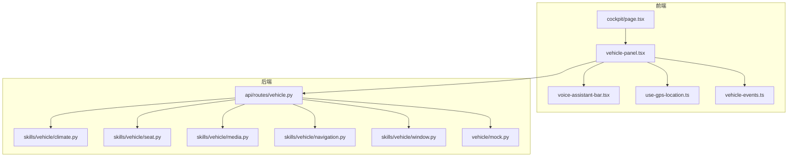
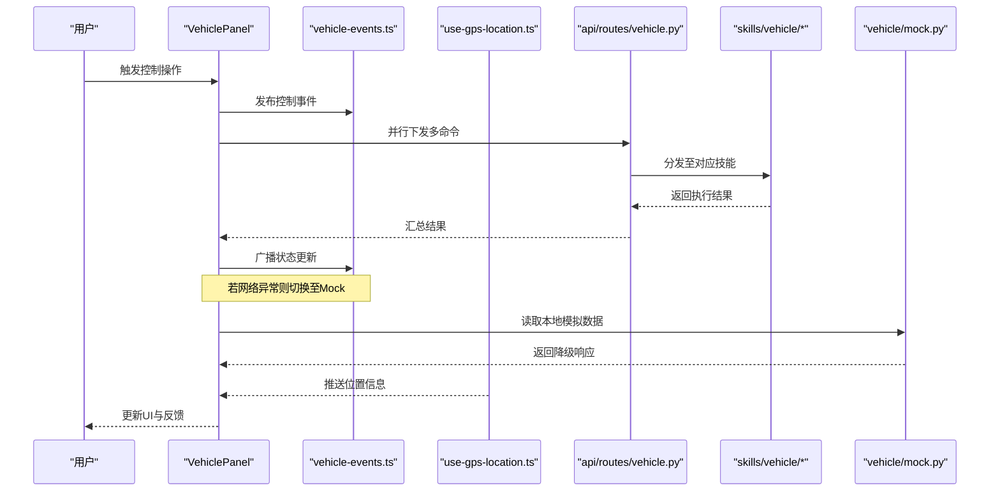
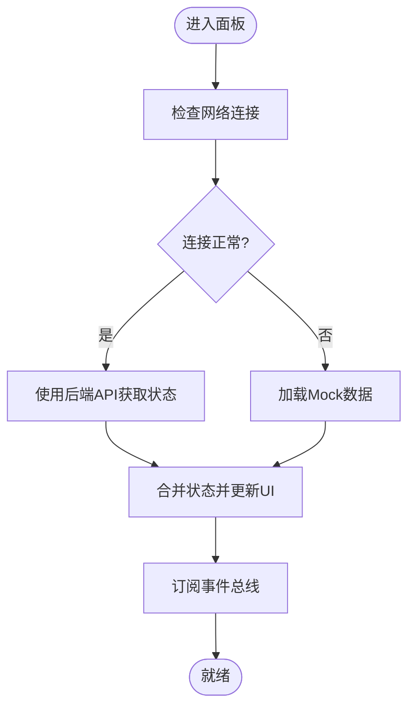
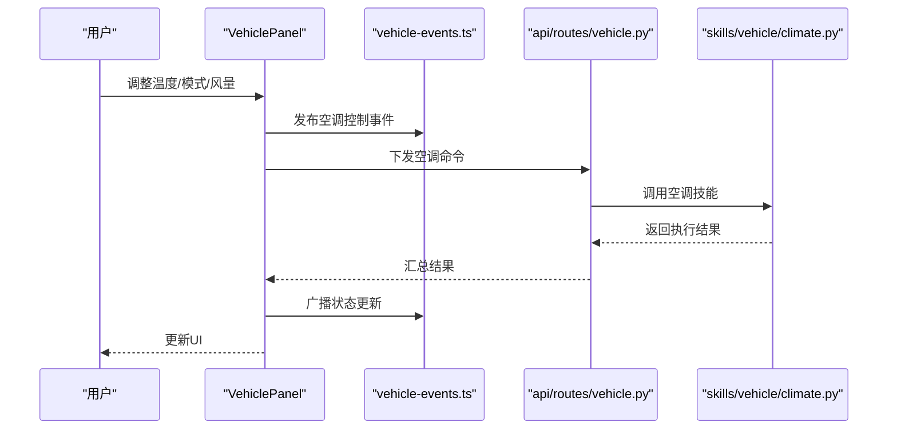
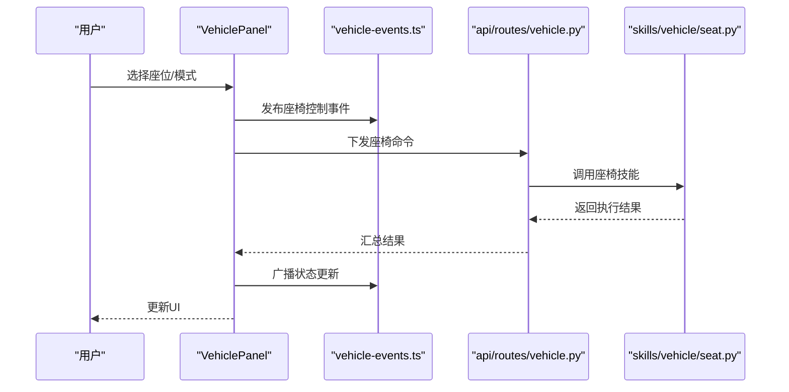
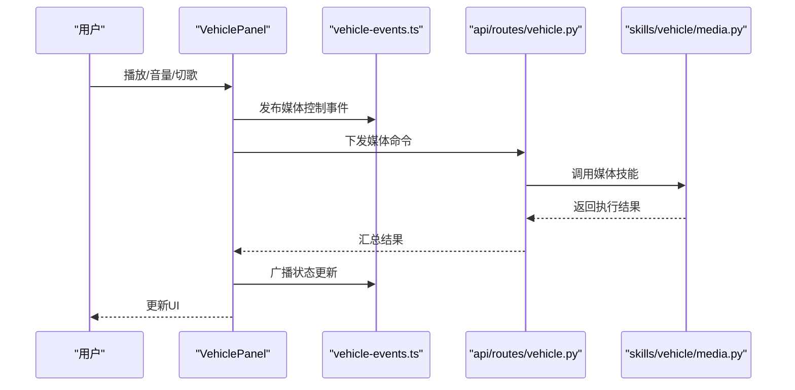
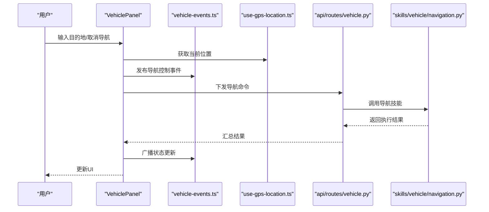
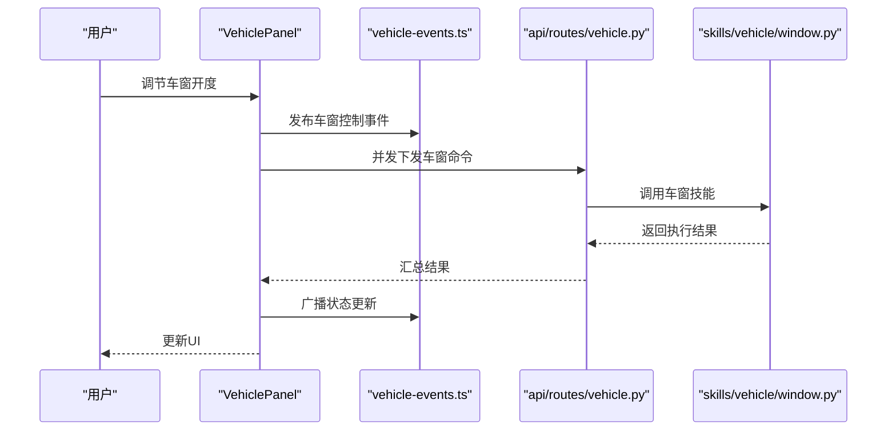
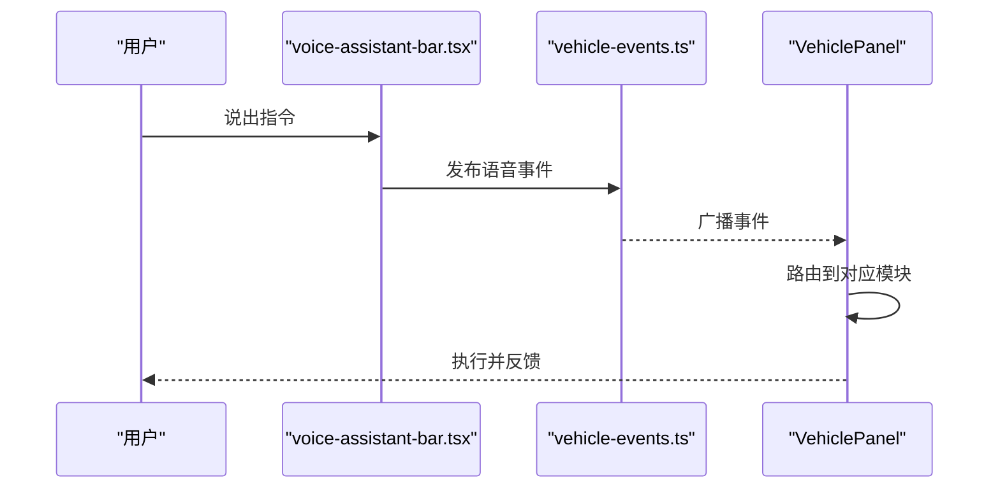
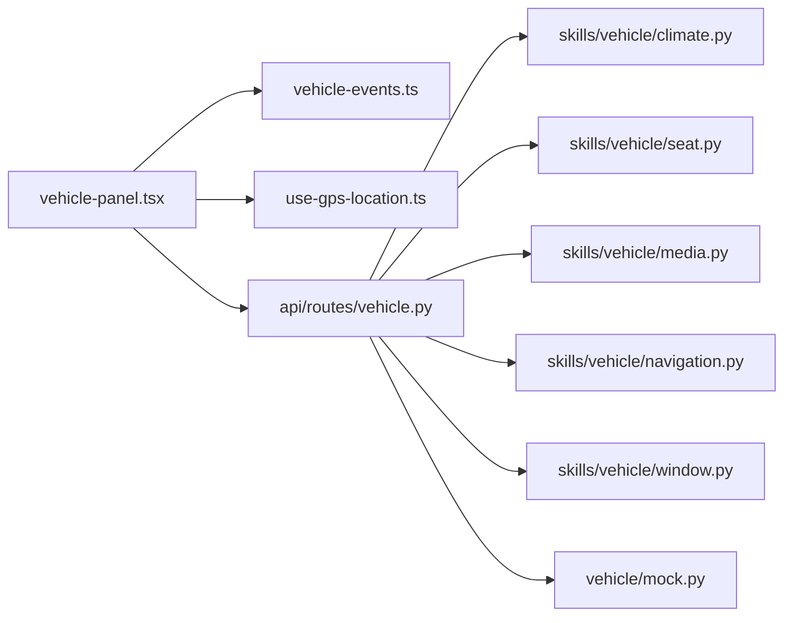

# 车控面板组件

<cite>
**本文引用的文件**   
- [frontend_design/src/components/vehicle/vehicle-panel.tsx](file://frontend_design/src/components/vehicle/vehicle-panel.tsx)
- [frontend_design/src/components/vehicle/voice-assistant-bar.tsx](file://frontend_design/src/components/vehicle/voice-assistant-bar.tsx)
- [frontend_design/src/hooks/use-gps-location.ts](file://frontend_design/src/hooks/use-gps-location.ts)
- [frontend_design/src/lib/vehicle-events.ts](file://frontend_design/src/lib/vehicle-events.ts)
- [frontend_design/src/app/cockpit/page.tsx](file://frontend_design/src/app/cockpit/page.tsx)
- [backend_design/nexus/skills/vehicle/climate.py](file://backend_design/nexus/skills/vehicle/climate.py)
- [backend_design/nexus/skills/vehicle/seat.py](file://backend_design/nexus/skills/vehicle/seat.py)
- [backend_design/nexus/skills/vehicle/media.py](file://backend_design/nexus/skills/vehicle/media.py)
- [backend_design/nexus/skills/vehicle/navigation.py](file://backend_design/nexus/skills/vehicle/navigation.py)
- [backend_design/nexus/skills/vehicle/window.py](file://backend_design/nexus/skills/vehicle/window.py)
- [backend_design/nexus/vehicle/mock.py](file://backend_design/nexus/vehicle/mock.py)
- [backend_design/nexus/api/routes/vehicle.py](file://backend_design/nexus/api/routes/vehicle.py)
</cite>

## 目录
1. [简介](#简介)
2. [项目结构](#项目结构)
3. [核心组件](#核心组件)
4. [架构总览](#架构总览)
5. [详细组件分析](#详细组件分析)
6. [依赖分析](#依赖分析)
7. [性能考虑](#性能考虑)
8. [故障排查指南](#故障排查指南)
9. [结论](#结论)
10. [附录](#附录)

## 简介
本技术文档围绕“车控面板组件”展开，聚焦前端 VehiclePanel 组件的架构设计与实现细节，涵盖车辆状态管理、离线模式降级、多命令并行执行机制；并对空调控制、座椅控制、媒体播放、导航控制、车窗控制等子模块进行逐项解析。同时说明状态提升模式、事件处理机制、错误边界处理策略，以及 Mock 数据降级、GPS 定位集成、语音助手事件订阅等高级特性。文末提供 Props 接口定义、性能优化技巧与用户体验最佳实践建议。

## 项目结构
车控面板位于前端设计目录中，主要涉及以下文件：
- 车控面板主组件：frontend_design/src/components/vehicle/vehicle-panel.tsx
- 语音助手条（用于语音输入与反馈）：frontend_design/src/components/vehicle/voice-assistant-bar.tsx
- GPS 定位 Hook：frontend_design/src/hooks/use-gps-location.ts
- 车辆事件总线：frontend_design/src/lib/vehicle-events.ts
- 座舱页面入口（承载车控面板）：frontend_design/src/app/cockpit/page.tsx
- 后端技能层（空调、座椅、媒体、导航、车窗）：backend_design/nexus/skills/vehicle/*.py
- 后端 Mock 数据源：backend_design/nexus/vehicle/mock.py
- 后端车辆 API 路由：backend_design/nexus/api/routes/vehicle.py

图表来源
- [frontend_design/src/app/cockpit/page.tsx](file://frontend_design/src/app/cockpit/page.tsx)
- [frontend_design/src/components/vehicle/vehicle-panel.tsx](file://frontend_design/src/components/vehicle/vehicle-panel.tsx)
- [frontend_design/src/components/vehicle/voice-assistant-bar.tsx](file://frontend_design/src/components/vehicle/voice-assistant-bar.tsx)
- [frontend_design/src/hooks/use-gps-location.ts](file://frontend_design/src/hooks/use-gps-location.ts)
- [frontend_design/src/lib/vehicle-events.ts](file://frontend_design/src/lib/vehicle-events.ts)
- [backend_design/nexus/api/routes/vehicle.py](file://backend_design/nexus/api/routes/vehicle.py)
- [backend_design/nexus/skills/vehicle/climate.py](file://backend_design/nexus/skills/vehicle/climate.py)
- [backend_design/nexus/skills/vehicle/seat.py](file://backend_design/nexus/skills/vehicle/seat.py)
- [backend_design/nexus/skills/vehicle/media.py](file://backend_design/nexus/skills/vehicle/media.py)
- [backend_design/nexus/skills/vehicle/navigation.py](file://backend_design/nexus/skills/vehicle/navigation.py)
- [backend_design/nexus/skills/vehicle/window.py](file://backend_design/nexus/skills/vehicle/window.py)
- [backend_design/nexus/vehicle/mock.py](file://backend_design/nexus/vehicle/mock.py)

章节来源
- [frontend_design/src/app/cockpit/page.tsx](file://frontend_design/src/app/cockpit/page.tsx)
- [frontend_design/src/components/vehicle/vehicle-panel.tsx](file://frontend_design/src/components/vehicle/vehicle-panel.tsx)
- [frontend_design/src/components/vehicle/voice-assistant-bar.tsx](file://frontend_design/src/components/vehicle/voice-assistant-bar.tsx)
- [frontend_design/src/hooks/use-gps-location.ts](file://frontend_design/src/hooks/use-gps-location.ts)
- [frontend_design/src/lib/vehicle-events.ts](file://frontend_design/src/lib/vehicle-events.ts)
- [backend_design/nexus/api/routes/vehicle.py](file://backend_design/nexus/api/routes/vehicle.py)
- [backend_design/nexus/skills/vehicle/climate.py](file://backend_design/nexus/skills/vehicle/climate.py)
- [backend_design/nexus/skills/vehicle/seat.py](file://backend_design/nexus/skills/vehicle/seat.py)
- [backend_design/nexus/skills/vehicle/media.py](file://backend_design/nexus/skills/vehicle/media.py)
- [backend_design/nexus/skills/vehicle/navigation.py](file://backend_design/nexus/skills/vehicle/navigation.py)
- [backend_design/nexus/skills/vehicle/window.py](file://backend_design/nexus/skills/vehicle/window.py)
- [backend_design/nexus/vehicle/mock.py](file://backend_design/nexus/vehicle/mock.py)

## 核心组件
VehiclePanel 作为车控面板的核心容器，承担以下职责：
- 聚合各子系统 UI（空调、座椅、媒体、导航、车窗）并统一渲染
- 维护车辆全局状态（在线/离线、连接质量、设备能力集）
- 协调多命令并发执行，保证结果合并与错误隔离
- 对接事件总线，订阅车辆状态变更与语音助手事件
- 在离线或网络异常时启用 Mock 降级策略，保障基础体验

关键设计要点：
- 状态提升：将车辆状态从子模块提升到 VehiclePanel 集中管理，避免重复请求与状态不一致
- 事件驱动：通过 vehicle-events 事件总线解耦各模块，降低耦合度
- 错误边界：对每个功能区块设置错误边界，单个模块失败不影响整体可用性
- 并发控制：使用 Promise.allSettled 或等价机制并行下发指令，分别收集成功/失败结果

章节来源
- [frontend_design/src/components/vehicle/vehicle-panel.tsx](file://frontend_design/src/components/vehicle/vehicle-panel.tsx)
- [frontend_design/src/lib/vehicle-events.ts](file://frontend_design/src/lib/vehicle-events.ts)

## 架构总览
下图展示了从前端到后端的调用链路，包括事件订阅与降级路径。

图表来源
- [frontend_design/src/components/vehicle/vehicle-panel.tsx](file://frontend_design/src/components/vehicle/vehicle-panel.tsx)
- [frontend_design/src/lib/vehicle-events.ts](file://frontend_design/src/lib/vehicle-events.ts)
- [frontend_design/src/hooks/use-gps-location.ts](file://frontend_design/src/hooks/use-gps-location.ts)
- [backend_design/nexus/api/routes/vehicle.py](file://backend_design/nexus/api/routes/vehicle.py)
- [backend_design/nexus/skills/vehicle/climate.py](file://backend_design/nexus/skills/vehicle/climate.py)
- [backend_design/nexus/skills/vehicle/seat.py](file://backend_design/nexus/skills/vehicle/seat.py)
- [backend_design/nexus/skills/vehicle/media.py](file://backend_design/nexus/skills/vehicle/media.py)
- [backend_design/nexus/skills/vehicle/navigation.py](file://backend_design/nexus/skills/vehicle/navigation.py)
- [backend_design/nexus/skills/vehicle/window.py](file://backend_design/nexus/skills/vehicle/window.py)
- [backend_design/nexus/vehicle/mock.py](file://backend_design/nexus/vehicle/mock.py)

## 详细组件分析

### 车辆状态管理与离线降级
- 状态来源：
  - 实时状态来自后端 API 与事件总线
  - 离线状态由本地 Mock 数据提供
- 降级策略：
  - 检测网络连通性与心跳超时
  - 自动切换到 Mock 数据源，保持界面可交互
  - 恢复在线后增量同步差异状态
- 并发执行：
  - 多命令并行下发，使用 allSettled 语义收集结果
  - 局部失败不影响其他命令执行

图表来源
- [frontend_design/src/components/vehicle/vehicle-panel.tsx](file://frontend_design/src/components/vehicle/vehicle-panel.tsx)
- [backend_design/nexus/vehicle/mock.py](file://backend_design/nexus/vehicle/mock.py)
- [backend_design/nexus/api/routes/vehicle.py](file://backend_design/nexus/api/routes/vehicle.py)

章节来源
- [frontend_design/src/components/vehicle/vehicle-panel.tsx](file://frontend_design/src/components/vehicle/vehicle-panel.tsx)
- [backend_design/nexus/vehicle/mock.py](file://backend_design/nexus/vehicle/mock.py)
- [backend_design/nexus/api/routes/vehicle.py](file://backend_design/nexus/api/routes/vehicle.py)

### 空调控制模块（温度调节、模式切换、风量控制）
- 功能点：
  - 温度设定与显示
  - 模式切换（制冷/制热/自动/除雾）
  - 风量档位调节
- 交互流程：
  - 用户操作触发事件
  - 面板并行下发空调相关命令
  - 接收执行结果并刷新 UI
- 错误处理：
  - 单条命令失败仅影响对应控件状态
  - 提供重试与回滚提示

图表来源
- [frontend_design/src/components/vehicle/vehicle-panel.tsx](file://frontend_design/src/components/vehicle/vehicle-panel.tsx)
- [frontend_design/src/lib/vehicle-events.ts](file://frontend_design/src/lib/vehicle-events.ts)
- [backend_design/nexus/api/routes/vehicle.py](file://backend_design/nexus/api/routes/vehicle.py)
- [backend_design/nexus/skills/vehicle/climate.py](file://backend_design/nexus/skills/vehicle/climate.py)

章节来源
- [frontend_design/src/components/vehicle/vehicle-panel.tsx](file://frontend_design/src/components/vehicle/vehicle-panel.tsx)
- [frontend_design/src/lib/vehicle-events.ts](file://frontend_design/src/lib/vehicle-events.ts)
- [backend_design/nexus/api/routes/vehicle.py](file://backend_design/nexus/api/routes/vehicle.py)
- [backend_design/nexus/skills/vehicle/climate.py](file://backend_design/nexus/skills/vehicle/climate.py)

### 座椅控制模块（加热、按摩功能）
- 功能点：
  - 座椅加热档位控制
  - 按摩开关与强度调节
- 交互流程：
  - 用户选择目标座位与模式
  - 面板并发下发多条指令（如左右侧独立控制）
  - 根据结果更新按钮状态与进度指示
- 错误处理：
  - 针对不支持的座位或模式给出明确提示
  - 失败项单独重试或禁用控件

图表来源
- [frontend_design/src/components/vehicle/vehicle-panel.tsx](file://frontend_design/src/components/vehicle/vehicle-panel.tsx)
- [frontend_design/src/lib/vehicle-events.ts](file://frontend_design/src/lib/vehicle-events.ts)
- [backend_design/nexus/api/routes/vehicle.py](file://backend_design/nexus/api/routes/vehicle.py)
- [backend_design/nexus/skills/vehicle/seat.py](file://backend_design/nexus/skills/vehicle/seat.py)

章节来源
- [frontend_design/src/components/vehicle/vehicle-panel.tsx](file://frontend_design/src/components/vehicle/vehicle-panel.tsx)
- [frontend_design/src/lib/vehicle-events.ts](file://frontend_design/src/lib/vehicle-events.ts)
- [backend_design/nexus/api/routes/vehicle.py](file://backend_design/nexus/api/routes/vehicle.py)
- [backend_design/nexus/skills/vehicle/seat.py](file://backend_design/nexus/skills/vehicle/seat.py)

### 媒体播放模块（播放控制、音量调节、播放列表）
- 功能点：
  - 播放/暂停/上一首/下一首
  - 音量加减与静音
  - 播放列表展示与选择
- 交互流程：
  - 用户操作触发媒体事件
  - 面板并行下发媒体命令
  - 实时更新当前曲目与音量状态
- 错误处理：
  - 网络不可用时使用本地缓存列表
  - 播放失败提示并允许重试

图表来源
- [frontend_design/src/components/vehicle/vehicle-panel.tsx](file://frontend_design/src/components/vehicle/vehicle-panel.tsx)
- [frontend_design/src/lib/vehicle-events.ts](file://frontend_design/src/lib/vehicle-events.ts)
- [backend_design/nexus/api/routes/vehicle.py](file://backend_design/nexus/api/routes/vehicle.py)
- [backend_design/nexus/skills/vehicle/media.py](file://backend_design/nexus/skills/vehicle/media.py)

章节来源
- [frontend_design/src/components/vehicle/vehicle-panel.tsx](file://frontend_design/src/components/vehicle/vehicle-panel.tsx)
- [frontend_design/src/lib/vehicle-events.ts](file://frontend_design/src/lib/vehicle-events.ts)
- [backend_design/nexus/api/routes/vehicle.py](file://backend_design/nexus/api/routes/vehicle.py)
- [backend_design/nexus/skills/vehicle/media.py](file://backend_design/nexus/skills/vehicle/media.py)

### 导航控制模块（目的地输入、取消导航）
- 功能点：
  - 目的地地址输入与搜索
  - 开始导航与取消导航
  - 结合 GPS 定位提供当前位置与路线提示
- 交互流程：
  - 用户输入目的地
  - 面板调用导航技能规划路线
  - 成功后启动导航，失败给出原因与建议
- 错误处理：
  - 地址解析失败提示修正建议
  - 取消导航需二次确认

图表来源
- [frontend_design/src/components/vehicle/vehicle-panel.tsx](file://frontend_design/src/components/vehicle/vehicle-panel.tsx)
- [frontend_design/src/hooks/use-gps-location.ts](file://frontend_design/src/hooks/use-gps-location.ts)
- [frontend_design/src/lib/vehicle-events.ts](file://frontend_design/src/lib/vehicle-events.ts)
- [backend_design/nexus/api/routes/vehicle.py](file://backend_design/nexus/api/routes/vehicle.py)
- [backend_design/nexus/skills/vehicle/navigation.py](file://backend_design/nexus/skills/vehicle/navigation.py)

章节来源
- [frontend_design/src/components/vehicle/vehicle-panel.tsx](file://frontend_design/src/components/vehicle/vehicle-panel.tsx)
- [frontend_design/src/hooks/use-gps-location.ts](file://frontend_design/src/hooks/use-gps-location.ts)
- [frontend_design/src/lib/vehicle-events.ts](file://frontend_design/src/lib/vehicle-events.ts)
- [backend_design/nexus/api/routes/vehicle.py](file://backend_design/nexus/api/routes/vehicle.py)
- [backend_design/nexus/skills/vehicle/navigation.py](file://backend_design/nexus/skills/vehicle/navigation.py)

### 车窗控制模块（各车窗开度显示）
- 功能点：
  - 四门车窗开度显示与调节
  - 一键全开/全关
  - 防夹保护状态提示
- 交互流程：
  - 用户拖动滑块或点击预设档位
  - 面板并发下发各车窗控制命令
  - 根据执行结果更新开度与状态图标
- 错误处理：
  - 某车窗执行失败仅影响该控件
  - 防夹触发时立即停止并提示

图表来源
- [frontend_design/src/components/vehicle/vehicle-panel.tsx](file://frontend_design/src/components/vehicle/vehicle-panel.tsx)
- [frontend_design/src/lib/vehicle-events.ts](file://frontend_design/src/lib/vehicle-events.ts)
- [backend_design/nexus/api/routes/vehicle.py](file://backend_design/nexus/api/routes/vehicle.py)
- [backend_design/nexus/skills/vehicle/window.py](file://backend_design/nexus/skills/vehicle/window.py)

章节来源
- [frontend_design/src/components/vehicle/vehicle-panel.tsx](file://frontend_design/src/components/vehicle/vehicle-panel.tsx)
- [frontend_design/src/lib/vehicle-events.ts](file://frontend_design/src/lib/vehicle-events.ts)
- [backend_design/nexus/api/routes/vehicle.py](file://backend_design/nexus/api/routes/vehicle.py)
- [backend_design/nexus/skills/vehicle/window.py](file://backend_design/nexus/skills/vehicle/window.py)

### 语音助手事件订阅
- 功能点：
  - 语音输入与识别回调
  - 意图解析后转发到对应控制模块
  - 语音反馈与状态播报
- 交互流程：
  - 语音助手条捕获语音
  - 解析意图并发布事件
  - VehiclePanel 订阅事件并执行相应控制

图表来源
- [frontend_design/src/components/vehicle/voice-assistant-bar.tsx](file://frontend_design/src/components/vehicle/voice-assistant-bar.tsx)
- [frontend_design/src/lib/vehicle-events.ts](file://frontend_design/src/lib/vehicle-events.ts)
- [frontend_design/src/components/vehicle/vehicle-panel.tsx](file://frontend_design/src/components/vehicle/vehicle-panel.tsx)

章节来源
- [frontend_design/src/components/vehicle/voice-assistant-bar.tsx](file://frontend_design/src/components/vehicle/voice-assistant-bar.tsx)
- [frontend_design/src/lib/vehicle-events.ts](file://frontend_design/src/lib/vehicle-events.ts)
- [frontend_design/src/components/vehicle/vehicle-panel.tsx](file://frontend_design/src/components/vehicle/vehicle-panel.tsx)

## 依赖分析
- 前端依赖关系：
  - VehiclePanel 依赖 vehicle-events 事件总线与 use-gps-location Hook
  - voice-assistant-bar 通过事件总线与 VehiclePanel 通信
- 后端依赖关系：
  - api/routes/vehicle.py 聚合各技能模块（climate、seat、media、navigation、window）
  - mock.py 提供离线数据源，供前端降级使用

图表来源
- [frontend_design/src/components/vehicle/vehicle-panel.tsx](file://frontend_design/src/components/vehicle/vehicle-panel.tsx)
- [frontend_design/src/lib/vehicle-events.ts](file://frontend_design/src/lib/vehicle-events.ts)
- [frontend_design/src/hooks/use-gps-location.ts](file://frontend_design/src/hooks/use-gps-location.ts)
- [backend_design/nexus/api/routes/vehicle.py](file://backend_design/nexus/api/routes/vehicle.py)
- [backend_design/nexus/skills/vehicle/climate.py](file://backend_design/nexus/skills/vehicle/climate.py)
- [backend_design/nexus/skills/vehicle/seat.py](file://backend_design/nexus/skills/vehicle/seat.py)
- [backend_design/nexus/skills/vehicle/media.py](file://backend_design/nexus/skills/vehicle/media.py)
- [backend_design/nexus/skills/vehicle/navigation.py](file://backend_design/nexus/skills/vehicle/navigation.py)
- [backend_design/nexus/skills/vehicle/window.py](file://backend_design/nexus/skills/vehicle/window.py)
- [backend_design/nexus/vehicle/mock.py](file://backend_design/nexus/vehicle/mock.py)

章节来源
- [frontend_design/src/components/vehicle/vehicle-panel.tsx](file://frontend_design/src/components/vehicle/vehicle-panel.tsx)
- [frontend_design/src/lib/vehicle-events.ts](file://frontend_design/src/lib/vehicle-events.ts)
- [frontend_design/src/hooks/use-gps-location.ts](file://frontend_design/src/hooks/use-gps-location.ts)
- [backend_design/nexus/api/routes/vehicle.py](file://backend_design/nexus/api/routes/vehicle.py)
- [backend_design/nexus/skills/vehicle/climate.py](file://backend_design/nexus/skills/vehicle/climate.py)
- [backend_design/nexus/skills/vehicle/seat.py](file://backend_design/nexus/skills/vehicle/seat.py)
- [backend_design/nexus/skills/vehicle/media.py](file://backend_design/nexus/skills/vehicle/media.py)
- [backend_design/nexus/skills/vehicle/navigation.py](file://backend_design/nexus/skills/vehicle/navigation.py)
- [backend_design/nexus/skills/vehicle/window.py](file://backend_design/nexus/skills/vehicle/window.py)
- [backend_design/nexus/vehicle/mock.py](file://backend_design/nexus/vehicle/mock.py)

## 性能考虑
- 减少重渲染：
  - 使用状态提升与事件总线，避免深层 props 传递导致的重复渲染
  - 对大列表（如播放列表）采用虚拟滚动或分页加载
- 并发与节流：
  - 多命令并行下发，但限制并发上限，防止后端过载
  - 高频操作（如音量调节）使用节流或去抖
- 资源优化：
  - 图片与音频资源按需加载与缓存
  - 地图与导航数据懒加载
- 错误快速失败：
  - 对耗时操作设置超时与重试策略，避免阻塞主线程

[本节为通用性能指导，不直接分析具体文件]

## 故障排查指南
- 常见问题：
  - 网络不可用导致状态不同步：检查连接状态与降级逻辑是否生效
  - 部分命令失败：查看事件日志与错误边界输出，定位具体模块
  - 语音无响应：确认语音助手条事件是否正确发布与订阅
- 调试建议：
  - 在事件总线中添加日志打印，追踪事件流向
  - 使用浏览器开发者工具监控网络请求与状态变化
  - 在后端技能层添加执行日志，便于定位问题

章节来源
- [frontend_design/src/lib/vehicle-events.ts](file://frontend_design/src/lib/vehicle-events.ts)
- [frontend_design/src/components/vehicle/vehicle-panel.tsx](file://frontend_design/src/components/vehicle/vehicle-panel.tsx)
- [frontend_design/src/components/vehicle/voice-assistant-bar.tsx](file://frontend_design/src/components/vehicle/voice-assistant-bar.tsx)

## 结论
VehiclePanel 通过状态提升、事件驱动与并发控制，实现了高内聚、低耦合的车控面板架构。配合 Mock 降级与错误边界，确保在离线与异常场景下仍能提供稳定体验。各子模块职责清晰，易于扩展与维护。建议在后续迭代中持续优化性能与用户体验，完善监控与日志体系。

[本节为总结性内容，不直接分析具体文件]

## 附录

### Props 接口定义（示例）
以下为 VehiclePanel 的典型 Props 字段说明（类型以 TypeScript 风格描述）：
- connected: boolean — 是否已连接到后端服务
- capabilities: string[] — 车辆能力集（如空调、座椅、媒体、导航、车窗）
- onCommand: (commands: Command[]) => void — 下发控制命令的回调
- onError: (error: Error) => void — 错误回调
- onStatusChange: (status: VehicleStatus) => void — 状态变化回调
- locale: string — 语言环境
- theme: ThemeMode — 主题模式

章节来源
- [frontend_design/src/components/vehicle/vehicle-panel.tsx](file://frontend_design/src/components/vehicle/vehicle-panel.tsx)

### 用户体验设计最佳实践
- 即时反馈：所有用户操作应在 100ms 内给予视觉或触觉反馈
- 渐进式增强：离线模式下提供基础功能，在线后逐步解锁高级特性
- 容错友好：失败操作提供明确原因与修复建议，支持一键重试
- 一致性：统一的控件样式与交互规范，降低学习成本

[本节为通用 UX 指导，不直接分析具体文件]