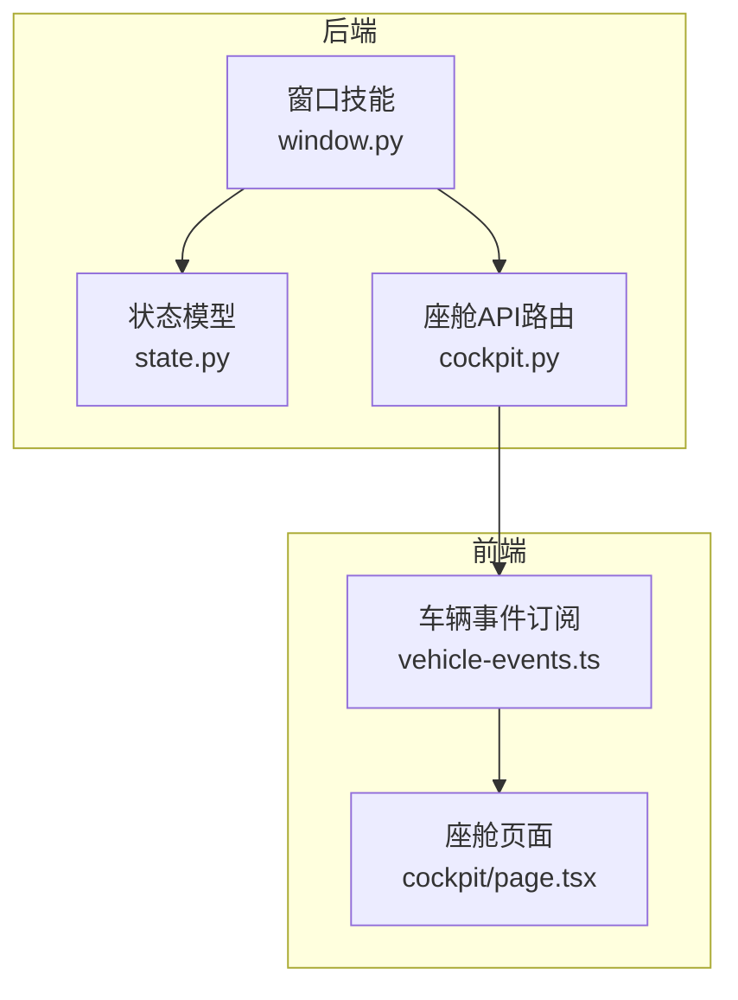
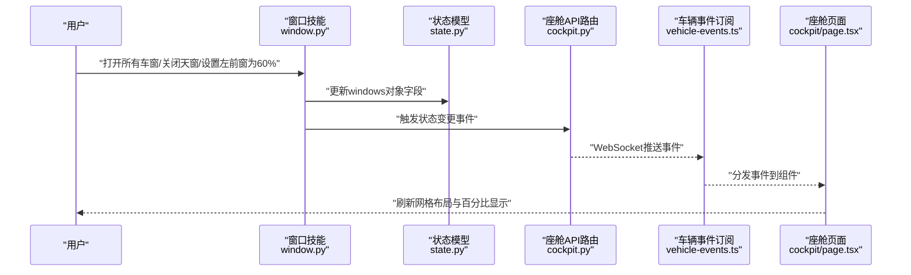
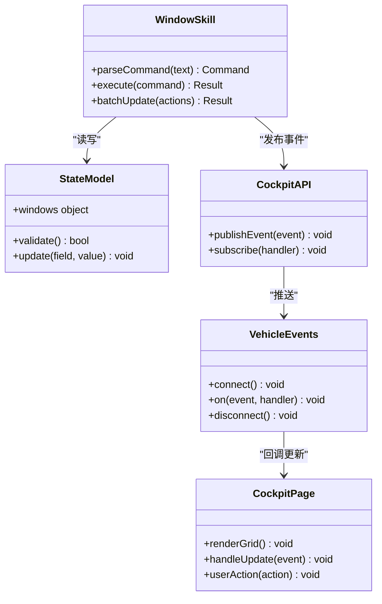
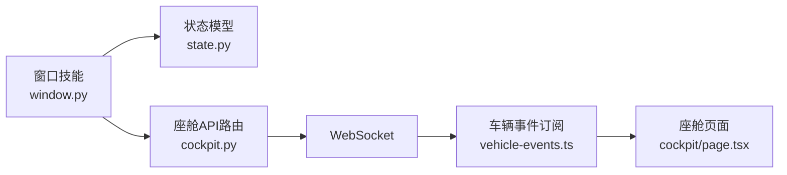

# 车窗控制模块

<cite>
**本文引用的文件**   
- [backend_design/nexus/skills/vehicle/window.py](file://backend_design/nexus/skills/vehicle/window.py)
- [backend_design/nexus/models/state.py](file://backend_design/nexus/models/state.py)
- [backend_design/nexus/api/routes/cockpit.py](file://backend_design/nexus/api/routes/cockpit.py)
- [frontend_design/src/app/cockpit/page.tsx](file://frontend_design/src/app/cockpit/page.tsx)
- [frontend_design/src/lib/vehicle-events.ts](file://frontend_design/src/lib/vehicle-events.ts)
</cite>

## 目录
1. [简介](#简介)
2. [项目结构](#项目结构)
3. [核心组件](#核心组件)
4. [架构总览](#架构总览)
5. [详细组件分析](#详细组件分析)
6. [依赖关系分析](#依赖关系分析)
7. [性能考虑](#性能考虑)
8. [故障排查指南](#故障排查指南)
9. [结论](#结论)
10. [附录](#附录)

## 简介
本技术文档聚焦于“车窗控制模块”，围绕以下目标展开：
- 车窗状态显示功能：左前、右前、左后、右后、天窗五个位置的状态展示与百分比显示，以及布局设计。
- 全开全关功能：批量操作指令、状态同步与用户反馈。
- 数据结构设计：windows对象字段含义与数据格式。
- 网格布局、响应式设计与状态更新机制等技术细节。
- 用户体验设计、错误处理与性能优化最佳实践。

该模块由后端技能层（意图解析与设备控制）、模型层（状态定义）、API路由（WebSocket事件发布）与前端页面（状态展示与交互）共同组成。

## 项目结构
与车窗控制相关的前后端关键文件如下：
- 后端技能层：负责将自然语言或系统指令转换为车窗控制动作，并触发状态变更。
- 状态模型：定义车辆状态中的 windows 对象结构与字段语义。
- API路由：通过 WebSocket 推送车窗状态变更事件到前端。
- 前端页面：渲染五窗+天窗的网格布局，监听事件并更新 UI。

图表来源
- [backend_design/nexus/skills/vehicle/window.py](file://backend_design/nexus/skills/vehicle/window.py)
- [backend_design/nexus/models/state.py](file://backend_design/nexus/models/state.py)
- [backend_design/nexus/api/routes/cockpit.py](file://backend_design/nexus/api/routes/cockpit.py)
- [frontend_design/src/app/cockpit/page.tsx](file://frontend_design/src/app/cockpit/page.tsx)
- [frontend_design/src/lib/vehicle-events.ts](file://frontend_design/src/lib/vehicle-events.ts)

章节来源
- [backend_design/nexus/skills/vehicle/window.py](file://backend_design/nexus/skills/vehicle/window.py)
- [backend_design/nexus/models/state.py](file://backend_design/nexus/models/state.py)
- [backend_design/nexus/api/routes/cockpit.py](file://backend_design/nexus/api/routes/cockpit.py)
- [frontend_design/src/app/cockpit/page.tsx](file://frontend_design/src/app/cockpit/page.tsx)
- [frontend_design/src/lib/vehicle-events.ts](file://frontend_design/src/lib/vehicle-events.ts)

## 核心组件
- 窗口技能（Window Skill）
  - 职责：解析车窗控制指令（如打开/关闭/设定百分比），执行对应动作，更新状态模型，并通过API路由广播状态变更。
  - 关键点：支持单窗与批量操作；对无效输入进行校验；确保状态一致性。
- 状态模型（State Model）
  - 职责：定义 windows 对象的结构，包括各窗口的开关状态与开度百分比等字段。
  - 关键点：字段类型明确，便于前后端一致理解与序列化。
- 座舱API路由（Cockpit API）
  - 职责：接收来自技能层的状态变更，通过WebSocket向已连接客户端推送事件。
  - 关键点：事件命名规范、幂等性、最小化负载。
- 前端座舱页面（Cockpit Page）
  - 职责：渲染五窗+天窗的网格布局，订阅车辆事件，实时更新UI，并提供用户交互入口。
  - 关键点：响应式布局、防抖节流、错误提示与回退策略。
- 车辆事件订阅（Vehicle Events）
  - 职责：封装WebSocket事件订阅逻辑，统一分发至业务组件。
  - 关键点：重连机制、去抖合并、异常捕获。

章节来源
- [backend_design/nexus/skills/vehicle/window.py](file://backend_design/nexus/skills/vehicle/window.py)
- [backend_design/nexus/models/state.py](file://backend_design/nexus/models/state.py)
- [backend_design/nexus/api/routes/cockpit.py](file://backend_design/nexus/api/routes/cockpit.py)
- [frontend_design/src/app/cockpit/page.tsx](file://frontend_design/src/app/cockpit/page.tsx)
- [frontend_design/src/lib/vehicle-events.ts](file://frontend_design/src/lib/vehicle-events.ts)

## 架构总览
下图展示了从用户指令到前端展示的端到端流程：

图表来源
- [backend_design/nexus/skills/vehicle/window.py](file://backend_design/nexus/skills/vehicle/window.py)
- [backend_design/nexus/models/state.py](file://backend_design/nexus/models/state.py)
- [backend_design/nexus/api/routes/cockpit.py](file://backend_design/nexus/api/routes/cockpit.py)
- [frontend_design/src/lib/vehicle-events.ts](file://frontend_design/src/lib/vehicle-events.ts)
- [frontend_design/src/app/cockpit/page.tsx](file://frontend_design/src/app/cockpit/page.tsx)

## 详细组件分析

### 数据结构设计：windows对象
- 目的：统一描述五窗+天窗的状态，供后端持久化与前端渲染使用。
- 建议字段（示例说明，具体以实现为准）：
  - left_front_open: 布尔值，表示左前窗是否开启。
  - right_front_open: 布尔值，表示右前窗是否开启。
  - left_rear_open: 布尔值，表示左后窗是否开启。
  - right_rear_open: 布尔值，表示右后窗是否开启。
  - sunroof_open: 布尔值，表示天窗是否开启。
  - left_front_percent: 数值，左前窗开度百分比（0-100）。
  - right_front_percent: 数值，右前窗开度百分比（0-100）。
  - left_rear_percent: 数值，左后窗开度百分比（0-100）。
  - right_rear_percent: 数值，右后窗开度百分比（0-100）。
  - sunroof_percent: 数值，天窗开度百分比（0-100）。
- 约束与校验：
  - 百分比范围限制在0-100，越界需修正或拒绝。
  - 当open为false时，percent应归零或忽略。
  - 批量操作时需保证原子性与一致性。

章节来源
- [backend_design/nexus/models/state.py](file://backend_design/nexus/models/state.py)

### 窗口技能（Window Skill）
- 功能要点：
  - 解析指令：识别目标窗口（左前/右前/左后/右后/天窗）与动作（打开/关闭/设定百分比）。
  - 批量操作：支持“全部打开/全部关闭”等指令，内部遍历windows对象并更新相应字段。
  - 状态同步：更新完成后，调用API路由广播事件，确保多端一致。
  - 错误处理：对非法窗口名、越界百分比、设备不可用等情况返回明确错误信息。
- 复杂度与优化：
  - 批量操作时间复杂度O(n)，n为窗口数量（固定为5），开销可忽略。
  - 建议在批量操作中采用事务式更新，避免中间态不一致。

章节来源
- [backend_design/nexus/skills/vehicle/window.py](file://backend_design/nexus/skills/vehicle/window.py)

### 座舱API路由（WebSocket事件发布）
- 功能要点：
  - 接收来自技能层的状态变更事件。
  - 将事件序列化为标准格式，通过WebSocket推送给所有订阅客户端。
  - 事件命名建议：如“window.update”、“window.batch_update”。
- 可靠性：
  - 断线重连与消息重试策略。
  - 事件去重与幂等处理，防止重复渲染。

章节来源
- [backend_design/nexus/api/routes/cockpit.py](file://backend_design/nexus/api/routes/cockpit.py)

### 前端座舱页面（网格布局与响应式设计）
- 布局设计：
  - 使用网格布局展示五个窗口卡片：左前、右前、左后、右后、天窗。
  - 每个卡片包含：窗口名称、开关按钮、百分比滑块或数字输入、当前百分比文本。
  - 响应式适配：在小屏设备上自动调整列数，保持触控友好。
- 状态更新机制：
  - 订阅车辆事件，收到更新后局部刷新对应卡片，避免整页重绘。
  - 本地缓存最新状态，网络异常时仍可展示最近一次有效状态。
- 用户反馈：
  - 操作进行中显示加载指示，完成或失败给出提示。
  - 批量操作提供进度反馈与结果汇总。

章节来源
- [frontend_design/src/app/cockpit/page.tsx](file://frontend_design/src/app/cockpit/page.tsx)

### 车辆事件订阅（事件分发与健壮性）
- 功能要点：
  - 封装WebSocket连接管理，包括连接建立、心跳保活、断线重连。
  - 事件路由：根据事件类型分发到对应处理器（如单窗更新、批量更新）。
  - 异常捕获：记录错误日志，提供降级策略（如仅展示本地缓存）。
- 性能优化：
  - 事件合并：短时间内多次更新合并为一次渲染。
  - 节流：高频事件（如实时百分比变化）进行节流处理。

章节来源
- [frontend_design/src/lib/vehicle-events.ts](file://frontend_design/src/lib/vehicle-events.ts)

#### 类图（概念性）

[此图为概念性类图，用于说明组件关系，不直接映射具体源码结构]

## 依赖关系分析
- 组件耦合：
  - 窗口技能依赖状态模型与API路由，低耦合高内聚。
  - 前端通过事件订阅与后端解耦，便于扩展新事件类型。
- 外部依赖：
  - WebSocket通信库（前端）与消息队列/广播机制（后端，视实现而定）。
- 潜在循环依赖：
  - 当前分层清晰，未发现循环依赖风险。

图表来源
- [backend_design/nexus/skills/vehicle/window.py](file://backend_design/nexus/skills/vehicle/window.py)
- [backend_design/nexus/models/state.py](file://backend_design/nexus/models/state.py)
- [backend_design/nexus/api/routes/cockpit.py](file://backend_design/nexus/api/routes/cockpit.py)
- [frontend_design/src/lib/vehicle-events.ts](file://frontend_design/src/lib/vehicle-events.ts)
- [frontend_design/src/app/cockpit/page.tsx](file://frontend_design/src/app/cockpit/page.tsx)

章节来源
- [backend_design/nexus/skills/vehicle/window.py](file://backend_design/nexus/skills/vehicle/window.py)
- [backend_design/nexus/models/state.py](file://backend_design/nexus/models/state.py)
- [backend_design/nexus/api/routes/cockpit.py](file://backend_design/nexus/api/routes/cockpit.py)
- [frontend_design/src/lib/vehicle-events.ts](file://frontend_design/src/lib/vehicle-events.ts)
- [frontend_design/src/app/cockpit/page.tsx](file://frontend_design/src/app/cockpit/page.tsx)

## 性能考虑
- 批量操作优化：
  - 使用事务式更新，减少中间状态暴露。
  - 合并多个小更新为一次广播，降低网络与渲染压力。
- 前端渲染优化：
  - 局部更新而非整页重绘，利用虚拟DOM差异对比。
  - 对高频事件进行节流与合并，避免抖动。
- 网络与可靠性：
  - 断线重连与指数退避策略。
  - 事件去重与幂等处理，防止重复状态。

[本节为通用性能指导，不直接分析具体文件]

## 故障排查指南
- 常见问题：
  - 百分比越界：检查输入校验逻辑，确保0-100范围。
  - 状态不同步：确认WebSocket连接正常，事件是否成功推送与订阅。
  - 批量操作部分失败：检查事务回滚与错误上报机制。
- 调试建议：
  - 在后端记录命令解析与状态变更日志。
  - 在前端打印事件流与渲染差异，定位更新问题。
  - 使用浏览器开发者工具监控WebSocket消息。

章节来源
- [backend_design/nexus/skills/vehicle/window.py](file://backend_design/nexus/skills/vehicle/window.py)
- [backend_design/nexus/api/routes/cockpit.py](file://backend_design/nexus/api/routes/cockpit.py)
- [frontend_design/src/lib/vehicle-events.ts](file://frontend_design/src/lib/vehicle-events.ts)

## 结论
车窗控制模块通过清晰的职责划分与事件驱动架构，实现了从指令解析、状态更新到前端渲染的完整闭环。合理的网格布局与响应式设计提升了用户体验，完善的错误处理与性能优化保障了系统的稳定性与流畅性。后续可扩展更多车窗控制场景与个性化配置。

[本节为总结性内容，不直接分析具体文件]

## 附录
- 术语表：
  - 开度百分比：窗口打开程度占最大开度的比例，取值0-100。
  - 批量操作：同时对多个窗口执行相同或不同动作的操作。
  - 事件订阅：前端监听后端推送的事件并进行响应的机制。
- 最佳实践清单：
  - 始终对输入进行严格校验与边界处理。
  - 使用事件驱动实现前后端解耦。
  - 提供友好的用户反馈与错误提示。
  - 对高频操作进行节流与合并，提升性能。

[本节为补充信息，不直接分析具体文件]