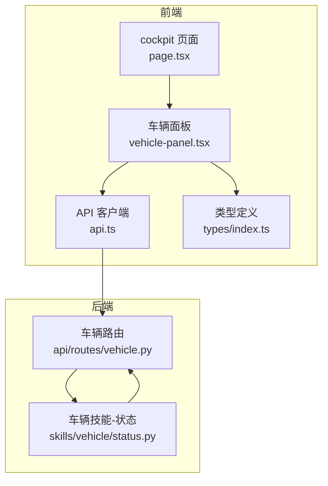
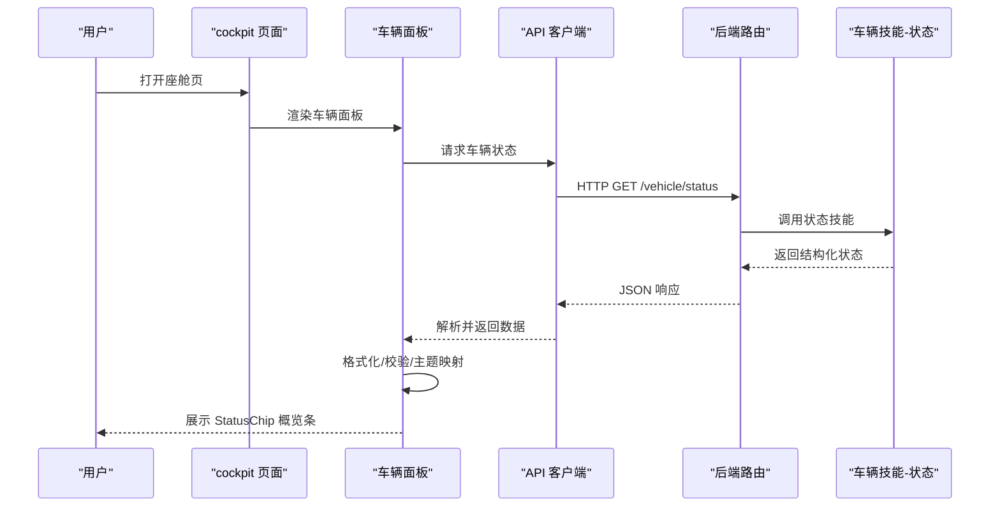
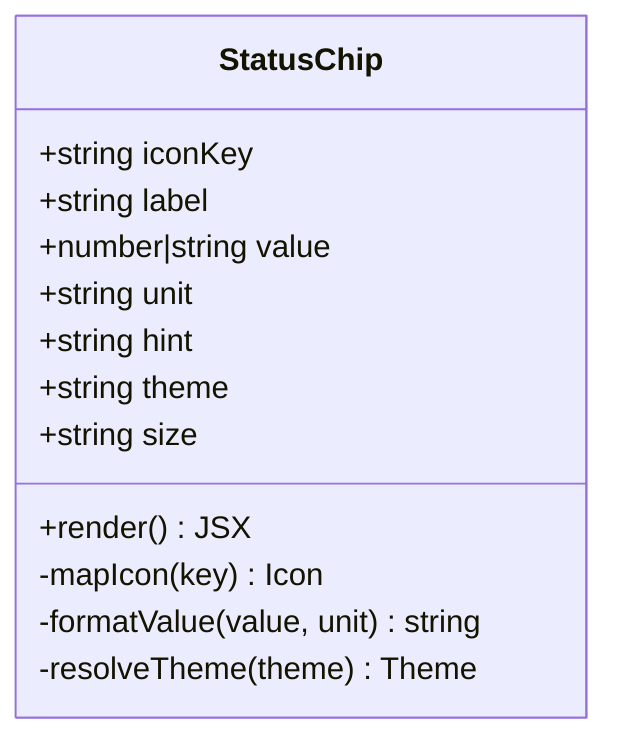
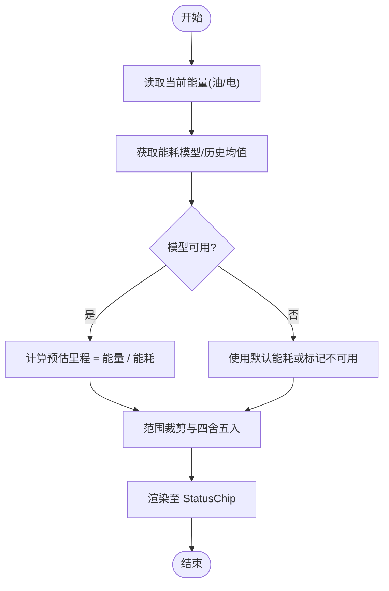
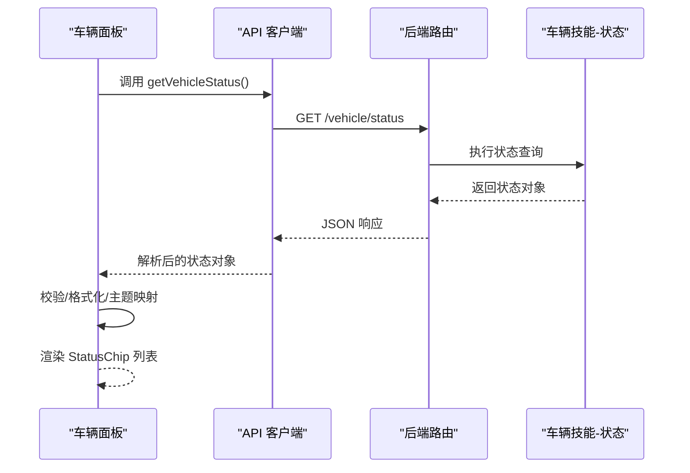
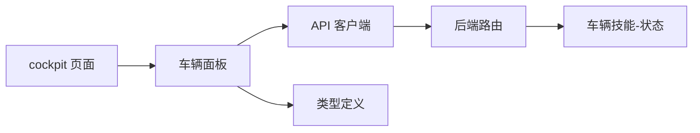

# 车辆状态概览条

<cite>
**本文引用的文件**   
- [frontend_design/src/app/cockpit/page.tsx](file://frontend_design/src/app/cockpit/page.tsx)
- [frontend_design/src/components/vehicle/vehicle-panel.tsx](file://frontend_design/src/components/vehicle/vehicle-panel.tsx)
- [frontend_design/src/lib/api.ts](file://frontend_design/src/lib/api.ts)
- [frontend_design/src/types/index.ts](file://frontend_design/src/types/index.ts)
- [backend_design/nexus/skills/vehicle/status.py](file://backend_design/nexus/skills/vehicle/status.py)
- [backend_design/nexus/api/routes/vehicle.py](file://backend_design/nexus/api/routes/vehicle.py)
</cite>

## 目录
1. [简介](#简介)
2. [项目结构](#项目结构)
3. [核心组件](#核心组件)
4. [架构总览](#架构总览)
5. [详细组件分析](#详细组件分析)
6. [依赖关系分析](#依赖关系分析)
7. [性能考虑](#性能考虑)
8. [故障排查指南](#故障排查指南)
9. [结论](#结论)
10. [附录](#附录)

## 简介
本技术文档聚焦“车辆状态概览条”的前端实现与后端数据链路，围绕 StatusChip 组件的设计与落地，系统阐述以下要点：
- 图标映射、标签显示、数值格式化、颜色主题策略
- 四个核心状态指标：油量显示、电量显示、续航计算、胎压状态
- 状态数据的获取与展示逻辑：数据格式、单位转换、异常值处理
- 响应式布局设计、图标库集成、样式定制
- 状态监控最佳实践、性能优化与用户体验设计

## 项目结构
前端采用 Next.js + TypeScript，关键位置如下：
- 页面入口：cockpit 页面聚合车辆面板与状态概览
- 车辆面板：承载状态概览条（StatusChip）及具体指标卡片
- API 客户端：封装车辆状态接口调用
- 类型定义：统一前后端数据结构契约
- 后端技能：提供车辆状态能力（如油量、电量、胎压等）
- 后端路由：暴露 REST 接口供前端消费

图表来源
- [frontend_design/src/app/cockpit/page.tsx](file://frontend_design/src/app/cockpit/page.tsx)
- [frontend_design/src/components/vehicle/vehicle-panel.tsx](file://frontend_design/src/components/vehicle/vehicle-panel.tsx)
- [frontend_design/src/lib/api.ts](file://frontend_design/src/lib/api.ts)
- [frontend_design/src/types/index.ts](file://frontend_design/src/types/index.ts)
- [backend_design/nexus/skills/vehicle/status.py](file://backend_design/nexus/skills/vehicle/status.py)
- [backend_design/nexus/api/routes/vehicle.py](file://backend_design/nexus/api/routes/vehicle.py)

章节来源
- [frontend_design/src/app/cockpit/page.tsx](file://frontend_design/src/app/cockpit/page.tsx)
- [frontend_design/src/components/vehicle/vehicle-panel.tsx](file://frontend_design/src/components/vehicle/vehicle-panel.tsx)
- [frontend_design/src/lib/api.ts](file://frontend_design/src/lib/api.ts)
- [frontend_design/src/types/index.ts](file://frontend_design/src/types/index.ts)
- [backend_design/nexus/skills/vehicle/status.py](file://backend_design/nexus/skills/vehicle/status.py)
- [backend_design/nexus/api/routes/vehicle.py](file://backend_design/nexus/api/routes/vehicle.py)

## 核心组件
- StatusChip 组件：用于在概览条中呈现单项状态（图标+标签+数值+辅助信息），支持主题色与尺寸适配。
- 四个核心指标：
  - 油量显示：百分比或剩余里程，带低油量警示
  - 电量显示：百分比或剩余里程，带低电量警示
  - 续航计算：基于当前能量与能耗模型估算
  - 胎压状态：各轮胎压力与告警提示

章节来源
- [frontend_design/src/components/vehicle/vehicle-panel.tsx](file://frontend_design/src/components/vehicle/vehicle-panel.tsx)
- [frontend_design/src/types/index.ts](file://frontend_design/src/types/index.ts)

## 架构总览
从用户交互到数据落地的端到端流程如下：

图表来源
- [frontend_design/src/app/cockpit/page.tsx](file://frontend_design/src/app/cockpit/page.tsx)
- [frontend_design/src/components/vehicle/vehicle-panel.tsx](file://frontend_design/src/components/vehicle/vehicle-panel.tsx)
- [frontend_design/src/lib/api.ts](file://frontend_design/src/lib/api.ts)
- [backend_design/nexus/api/routes/vehicle.py](file://backend_design/nexus/api/routes/vehicle.py)
- [backend_design/nexus/skills/vehicle/status.py](file://backend_design/nexus/skills/vehicle/status.py)

## 详细组件分析

### StatusChip 组件设计与实现
- 职责
  - 接收标准化状态项（图标键、标签文本、数值、单位、辅助说明、主题色）
  - 根据主题与尺寸进行自适应渲染
  - 提供可访问性属性（aria-label、role）
- 输入参数（建议）
  - iconKey: string（图标映射键）
  - label: string（主标签）
  - value: number | string（主数值）
  - unit: string（单位）
  - hint: string（辅助信息）
  - theme: "normal" | "warning" | "danger" | "info"（主题）
  - size: "sm" | "md" | "lg"（尺寸）
- 输出行为
  - 图标选择：由 iconKey 映射到具体图标资源
  - 标签与数值：按主题与尺寸排版
  - 数值格式化：保留小数位、千分位、单位拼接
  - 颜色主题：依据主题切换前景/背景/描边
  - 无障碍：为屏幕阅读器提供可读描述

图表来源
- [frontend_design/src/components/vehicle/vehicle-panel.tsx](file://frontend_design/src/components/vehicle/vehicle-panel.tsx)
- [frontend_design/src/types/index.ts](file://frontend_design/src/types/index.ts)

章节来源
- [frontend_design/src/components/vehicle/vehicle-panel.tsx](file://frontend_design/src/components/vehicle/vehicle-panel.tsx)
- [frontend_design/src/types/index.ts](file://frontend_design/src/types/index.ts)

### 图标映射与主题策略
- 图标映射
  - 以键值表形式维护 iconKey 到图标资源的映射
  - 支持多套图标集（线性/面性/品牌化），通过配置切换
- 主题策略
  - 主题枚举：正常、警告、危险、信息
  - 颜色变量：前景、背景、边框、阴影
  - 对比度校验：确保 WCAG 对比度达标
- 扩展方式
  - 新增状态时仅需注册新 iconKey 与主题映射

章节来源
- [frontend_design/src/components/vehicle/vehicle-panel.tsx](file://frontend_design/src/components/vehicle/vehicle-panel.tsx)

### 数值格式化与单位转换
- 格式化规则
  - 整数/小数位数控制
  - 千分位分隔符
  - 单位后缀与前缀
- 单位转换
  - 能量单位：kWh、MJ 等
  - 距离单位：km、mi
  - 压力单位：bar、psi、kPa
- 边界与异常
  - null/undefined 占位
  - NaN/Infinity 兜底
  - 负数/超上限裁剪与告警

章节来源
- [frontend_design/src/components/vehicle/vehicle-panel.tsx](file://frontend_design/src/components/vehicle/vehicle-panel.tsx)
- [frontend_design/src/types/index.ts](file://frontend_design/src/types/index.ts)

### 四个核心状态指标

#### 油量显示
- 数据来源：后端状态接口中的燃油相关字段
- 展示内容：剩余油量百分比或剩余里程
- 阈值与主题：低于阈值触发 warning/danger 主题
- 单位：百分比或 km

章节来源
- [frontend_design/src/components/vehicle/vehicle-panel.tsx](file://frontend_design/src/components/vehicle/vehicle-panel.tsx)
- [frontend_design/src/types/index.ts](file://frontend_design/src/types/index.ts)
- [backend_design/nexus/skills/vehicle/status.py](file://backend_design/nexus/skills/vehicle/status.py)
- [backend_design/nexus/api/routes/vehicle.py](file://backend_design/nexus/api/routes/vehicle.py)

#### 电量显示
- 数据来源：电池 SOC、剩余能量
- 展示内容：SOC 百分比或剩余里程
- 阈值与主题：低电量预警
- 单位：百分比或 km

章节来源
- [frontend_design/src/components/vehicle/vehicle-panel.tsx](file://frontend_design/src/components/vehicle/vehicle-panel.tsx)
- [frontend_design/src/types/index.ts](file://frontend_design/src/types/index.ts)
- [backend_design/nexus/skills/vehicle/status.py](file://backend_design/nexus/skills/vehicle/status.py)
- [backend_design/nexus/api/routes/vehicle.py](file://backend_design/nexus/api/routes/vehicle.py)

#### 续航计算
- 计算逻辑
  - 基于当前能量（油/电）与历史/模型能耗估算
  - 考虑驾驶模式、温度、路况等修正因子
- 展示内容：预估剩余里程
- 异常处理：能耗缺失时使用默认值或降级为“不可用”

图表来源
- [frontend_design/src/components/vehicle/vehicle-panel.tsx](file://frontend_design/src/components/vehicle/vehicle-panel.tsx)
- [frontend_design/src/types/index.ts](file://frontend_design/src/types/index.ts)

章节来源
- [frontend_design/src/components/vehicle/vehicle-panel.tsx](file://frontend_design/src/components/vehicle/vehicle-panel.tsx)
- [frontend_design/src/types/index.ts](file://frontend_design/src/types/index.ts)

#### 胎压状态
- 数据来源：各轮胎压力传感器
- 展示内容：单胎压力、整体健康状态
- 阈值与主题：过低/过高触发警告
- 单位：bar/kPa/psi（可配置）

章节来源
- [frontend_design/src/components/vehicle/vehicle-panel.tsx](file://frontend_design/src/components/vehicle/vehicle-panel.tsx)
- [frontend_design/src/types/index.ts](file://frontend_design/src/types/index.ts)
- [backend_design/nexus/skills/vehicle/status.py](file://backend_design/nexus/skills/vehicle/status.py)
- [backend_design/nexus/api/routes/vehicle.py](file://backend_design/nexus/api/routes/vehicle.py)

### 数据获取与展示逻辑
- 请求路径
  - 前端 API 客户端发起 GET 请求至后端车辆状态路由
  - 后端路由转发至车辆技能-状态模块
  - 技能模块聚合底层数据并返回结构化 JSON
- 数据契约
  - 使用 types/index.ts 统一定义字段、单位、可选性与取值范围
- 展示流程
  - 解析响应 -> 校验与清洗 -> 格式化 -> 主题映射 -> 渲染 StatusChip

图表来源
- [frontend_design/src/lib/api.ts](file://frontend_design/src/lib/api.ts)
- [backend_design/nexus/api/routes/vehicle.py](file://backend_design/nexus/api/routes/vehicle.py)
- [backend_design/nexus/skills/vehicle/status.py](file://backend_design/nexus/skills/vehicle/status.py)
- [frontend_design/src/types/index.ts](file://frontend_design/src/types/index.ts)

章节来源
- [frontend_design/src/lib/api.ts](file://frontend_design/src/lib/api.ts)
- [backend_design/nexus/api/routes/vehicle.py](file://backend_design/nexus/api/routes/vehicle.py)
- [backend_design/nexus/skills/vehicle/status.py](file://backend_design/nexus/skills/vehicle/status.py)
- [frontend_design/src/types/index.ts](file://frontend_design/src/types/index.ts)

### 响应式布局与样式定制
- 布局策略
  - 使用弹性布局与网格，在小屏下自动换行与缩放
  - 通过断点控制列数与间距
- 样式定制
  - CSS 变量管理主题色、字号、圆角、阴影
  - 支持深色/浅色模式切换
- 可访问性
  - 语义化标签、键盘导航、焦点可见性

章节来源
- [frontend_design/src/components/vehicle/vehicle-panel.tsx](file://frontend_design/src/components/vehicle/vehicle-panel.tsx)

### 图标库集成
- 集成方案
  - 使用 SVG 图标集或字体图标库
  - 通过 iconKey 动态加载对应资源
- 性能优化
  - 按需加载、缓存常用图标
  - 预取高频状态图标

章节来源
- [frontend_design/src/components/vehicle/vehicle-panel.tsx](file://frontend_design/src/components/vehicle/vehicle-panel.tsx)

## 依赖关系分析
- 前端内部依赖
  - cockpit 页面依赖 vehicle-panel
  - vehicle-panel 依赖 api 客户端与类型定义
- 前后端契约
  - types/index.ts 作为数据契约
  - api.ts 负责序列化/反序列化
- 后端依赖
  - routes/vehicle.py 依赖 skills/vehicle/status.py

图表来源
- [frontend_design/src/app/cockpit/page.tsx](file://frontend_design/src/app/cockpit/page.tsx)
- [frontend_design/src/components/vehicle/vehicle-panel.tsx](file://frontend_design/src/components/vehicle/vehicle-panel.tsx)
- [frontend_design/src/lib/api.ts](file://frontend_design/src/lib/api.ts)
- [frontend_design/src/types/index.ts](file://frontend_design/src/types/index.ts)
- [backend_design/nexus/api/routes/vehicle.py](file://backend_design/nexus/api/routes/vehicle.py)
- [backend_design/nexus/skills/vehicle/status.py](file://backend_design/nexus/skills/vehicle/status.py)

章节来源
- [frontend_design/src/app/cockpit/page.tsx](file://frontend_design/src/app/cockpit/page.tsx)
- [frontend_design/src/components/vehicle/vehicle-panel.tsx](file://frontend_design/src/components/vehicle/vehicle-panel.tsx)
- [frontend_design/src/lib/api.ts](file://frontend_design/src/lib/api.ts)
- [frontend_design/src/types/index.ts](file://frontend_design/src/types/index.ts)
- [backend_design/nexus/api/routes/vehicle.py](file://backend_design/nexus/api/routes/vehicle.py)
- [backend_design/nexus/skills/vehicle/status.py](file://backend_design/nexus/skills/vehicle/status.py)

## 性能考虑
- 请求优化
  - 合并请求、分页/增量更新
  - 缓存策略：内存缓存 + 短期本地缓存
- 渲染优化
  - 避免重排重绘，批量更新状态
  - 虚拟化长列表（若扩展为多车/多设备）
- 网络容错
  - 超时重试、退避策略
  - 降级展示：离线或错误时的占位与提示

[本节为通用指导，不直接分析具体文件]

## 故障排查指南
- 常见问题
  - 数据为空或缺失：检查后端返回结构与前端类型定义是否一致
  - 单位不一致：确认单位转换逻辑与后端单位约定
  - 主题异常：核对主题映射表与对比度要求
  - 图标缺失：检查 iconKey 映射与资源路径
- 定位步骤
  - 查看浏览器网络面板的响应体
  - 打印类型校验结果与格式化中间态
  - 在后端日志中追踪状态技能执行链路

章节来源
- [frontend_design/src/types/index.ts](file://frontend_design/src/types/index.ts)
- [frontend_design/src/lib/api.ts](file://frontend_design/src/lib/api.ts)
- [backend_design/nexus/api/routes/vehicle.py](file://backend_design/nexus/api/routes/vehicle.py)
- [backend_design/nexus/skills/vehicle/status.py](file://backend_design/nexus/skills/vehicle/status.py)

## 结论
通过将 StatusChip 组件抽象为高内聚、低耦合的可复用单元，并结合清晰的数据契约与健壮的错误处理，车辆状态概览条能够在多种设备上稳定展示油量、电量、续航与胎压等关键指标。配合主题系统与响应式布局，既满足视觉一致性，也提升可用性。后续可在能耗模型精度、实时刷新频率与可观测性方面持续优化。

[本节为总结性内容，不直接分析具体文件]

## 附录
- 术语
  - SOC：电池荷电状态
  - bar/kPa/psi：压力单位
  - kWh/MJ：能量单位
- 参考实现路径
  - 前端页面与面板：cockpit 页面、vehicle-panel
  - 数据契约与客户端：types/index.ts、api.ts
  - 后端能力与接口：skills/vehicle/status.py、api/routes/vehicle.py

[本节为补充信息，不直接分析具体文件]