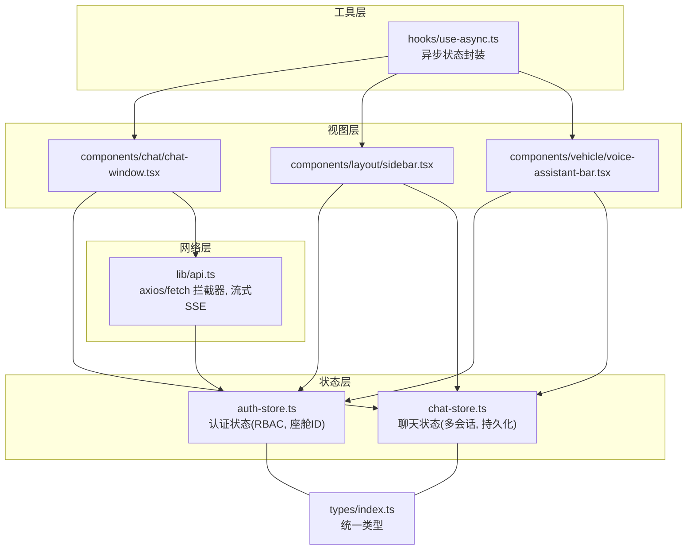
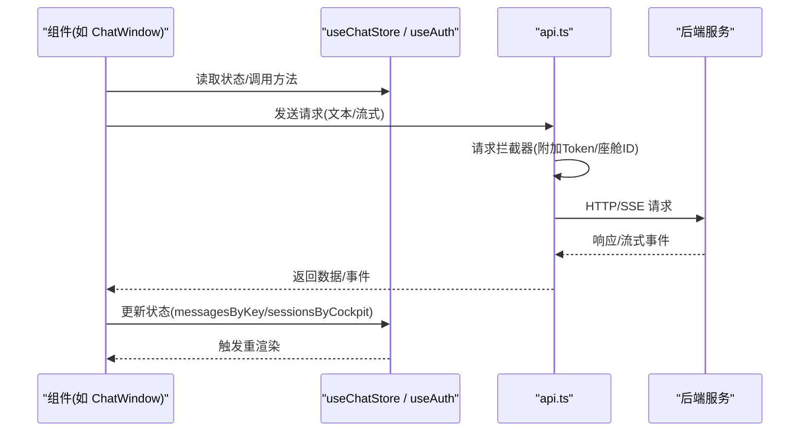
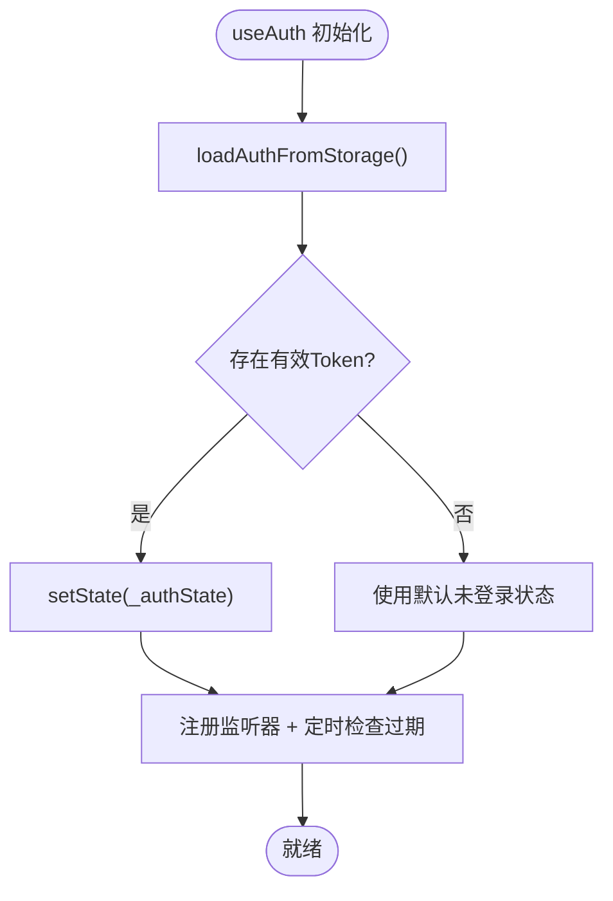
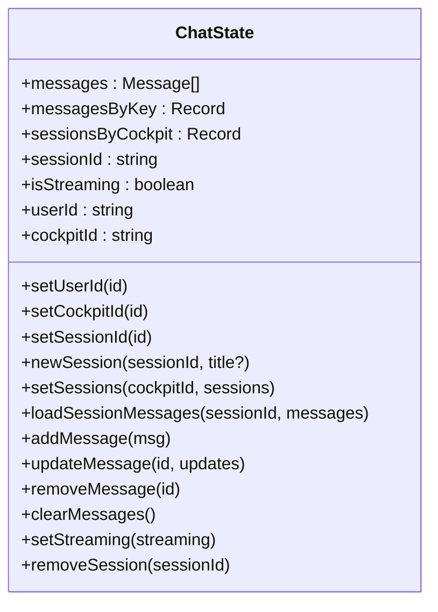
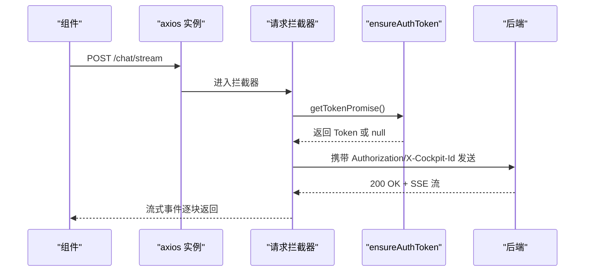
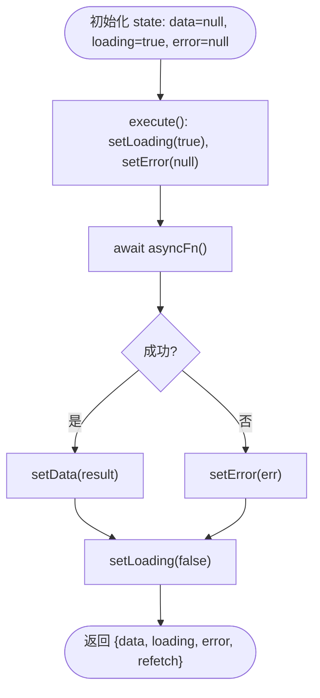
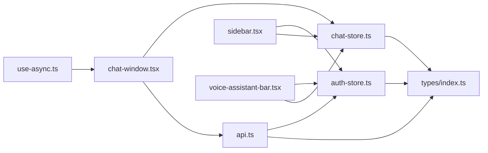

# 状态管理

<cite>
**本文引用的文件**   
- [auth-store.ts](file://frontend_design/src/stores/auth-store.ts)
- [chat-store.ts](file://frontend_design/src/stores/chat-store.ts)
- [api.ts](file://frontend_design/src/lib/api.ts)
- [use-async.ts](file://frontend_design/src/hooks/use-async.ts)
- [index.ts（类型）](file://frontend_design/src/types/index.ts)
- [chat-window.tsx](file://frontend_design/src/components/chat/chat-window.tsx)
- [sidebar.tsx](file://frontend_design/src/components/layout/sidebar.tsx)
- [voice-assistant-bar.tsx](file://frontend_design/src/components/vehicle/voice-assistant-bar.tsx)
</cite>

## 目录
1. [简介](#简介)
2. [项目结构](#项目结构)
3. [核心组件](#核心组件)
4. [架构总览](#架构总览)
5. [详细组件分析](#详细组件分析)
6. [依赖关系分析](#依赖关系分析)
7. [性能与优化](#性能与优化)
8. [调试与排障](#调试与排障)
9. [最佳实践与示例](#最佳实践与示例)
10. [结论](#结论)

## 简介
本文件聚焦于 NexusCockpit 前端的状态管理系统，围绕 Zustand 的模块化组织、持久化策略、中间件使用展开，并深入说明认证状态管理（JWT 令牌处理、RBAC 权限校验）、聊天状态管理（消息历史、会话切换、状态同步），以及自定义 Hook 的设计模式（如 useAsync）。文档同时提供实际代码路径与可视化图示，帮助读者快速理解并扩展系统。

## 项目结构
前端状态相关的关键位置：
- stores：全局状态定义与操作（Zustand store、轻量模块级单例）
- hooks：可复用逻辑封装（异步数据获取等）
- lib：API 客户端与网络层（axios + fetch 流式）
- components：页面与业务组件消费状态与 API
- types：统一类型定义

图表来源
- [auth-store.ts:1-223](file://frontend_design/src/stores/auth-store.ts#L1-L223)
- [chat-store.ts:1-286](file://frontend_design/src/stores/chat-store.ts#L1-L286)
- [api.ts:1-745](file://frontend_design/src/lib/api.ts#L1-L745)
- [use-async.ts:1-64](file://frontend_design/src/hooks/use-async.ts#L1-L64)
- [chat-window.tsx:1-572](file://frontend_design/src/components/chat/chat-window.tsx#L1-L572)
- [sidebar.tsx:1-200](file://frontend_design/src/components/layout/sidebar.tsx#L1-L200)
- [voice-assistant-bar.tsx:1-120](file://frontend_design/src/components/vehicle/voice-assistant-bar.tsx#L1-L120)
- [index.ts（类型）:1-264](file://frontend_design/src/types/index.ts#L1-L264)

章节来源
- [auth-store.ts:1-223](file://frontend_design/src/stores/auth-store.ts#L1-L223)
- [chat-store.ts:1-286](file://frontend_design/src/stores/chat-store.ts#L1-L286)
- [api.ts:1-745](file://frontend_design/src/lib/api.ts#L1-L745)
- [use-async.ts:1-64](file://frontend_design/src/hooks/use-async.ts#L1-L64)
- [chat-window.tsx:1-572](file://frontend_design/src/components/chat/chat-window.tsx#L1-L572)
- [sidebar.tsx:1-200](file://frontend_design/src/components/layout/sidebar.tsx#L1-L200)
- [voice-assistant-bar.tsx:1-120](file://frontend_design/src/components/vehicle/voice-assistant-bar.tsx#L1-L120)
- [index.ts（类型）:1-264](file://frontend_design/src/types/index.ts#L1-L264)

## 核心组件
- 认证状态（auth-store）
  - 基于模块级单例 + 监听器通知机制，实现跨组件订阅与重渲染。
  - 从 localStorage 加载 JWT，解析 payload 中的角色与座舱 ID，支持过期检测与定时刷新。
  - 暴露 setAuthToken、setCockpitId、clearAuth、getAuthState 及 useAuth Hook。
  - 内置 RBAC 权限判断函数（hasRole、canViewDataPlatform 等）。
- 聊天状态（chat-store）
  - 基于 Zustand create + persist 中间件，持久化到 localStorage。
  - 维护 messagesByKey（按 cockpitId:sessionId 分组）与 sessionsByCockpit（按座舱分组的会话列表）。
  - 提供新建/切换/删除会话、加载历史消息、增删改消息、清空消息、流式状态控制等方法。
- API 客户端（api.ts）
  - axios 实例统一配置超时与 Content-Type。
  - 请求拦截器自动附加 Authorization 与 X-Cockpit-Id；响应拦截器统一错误处理与 401 重试。
  - 流式 SSE 通过原生 fetch + ReadableStream 实现，支持 AbortSignal 取消。
  - 提供登录/登出、对话（非流式/流式）、车控、健康检查、数据中台、中间件、ASR、设置、声纹等接口。
- 自定义 Hook（use-async）
  - 封装 Promise 异步流程，自动处理 loading/error/data 状态与卸载竞态问题。
  - 返回 data、loading、error、refetch，便于在任意组件内复用。

章节来源
- [auth-store.ts:1-223](file://frontend_design/src/stores/auth-store.ts#L1-L223)
- [chat-store.ts:1-286](file://frontend_design/src/stores/chat-store.ts#L1-L286)
- [api.ts:1-745](file://frontend_design/src/lib/api.ts#L1-L745)
- [use-async.ts:1-64](file://frontend_design/src/hooks/use-async.ts#L1-L64)

## 架构总览
整体状态流转：
- 组件通过 useAuth/useChatStore 读取状态与操作方法。
- 组件调用 api.ts 中的方法发起网络请求，axios/fetch 拦截器负责鉴权与错误处理。
- 成功响应后更新 Zustand store 或模块级单例状态，触发订阅者重渲染。
- 流式场景下，SSE 事件逐块写入当前会话消息，结合 rAF 节流渲染。

图表来源
- [chat-window.tsx:186-343](file://frontend_design/src/components/chat/chat-window.tsx#L186-L343)
- [api.ts:134-172](file://frontend_design/src/lib/api.ts#L134-L172)
- [api.ts:258-338](file://frontend_design/src/lib/api.ts#L258-L338)
- [chat-store.ts:75-286](file://frontend_design/src/stores/chat-store.ts#L75-L286)

## 详细组件分析

### 认证状态管理（auth-store）
- 设计要点
  - 模块级单例 _authState 保存 token、userId、role、cockpitId、isAuthenticated。
  - loadAuthFromStorage 从 localStorage 解析 JWT，校验 exp 过期时间，恢复 cockpitId。
  - setAuthToken/clearAuth/setCockpitId 修改状态并 notifyListeners 触发订阅者更新。
  - useAuth Hook 初始化时从存储恢复状态，订阅变更，并每分钟检查 Token 是否过期。
  - RBAC 权限函数基于角色等级比较，提供 canViewDataPlatform/canAccessSettings 等便捷方法。
- 关键流程
  - 首次加载：useAuth 初始化 → loadAuthFromStorage → setState → 订阅监听器。
  - 登录/声纹验证：api.ts 调用 login/verifyVoiceprint → setAuthToken → auth-store 更新 → 菜单/路由根据角色显示。
  - 登出：clearAuth → 清除 localStorage → 重置状态。

图表来源
- [auth-store.ts:143-180](file://frontend_design/src/stores/auth-store.ts#L143-L180)
- [auth-store.ts:70-98](file://frontend_design/src/stores/auth-store.ts#L70-L98)

章节来源
- [auth-store.ts:1-223](file://frontend_design/src/stores/auth-store.ts#L1-L223)

### 聊天状态管理（chat-store）
- 设计要点
  - 使用 Zustand create + persist 中间件，持久化 messagesByKey、sessionsByCockpit、sessionId、userId、cockpitId。
  - storageKey(cocpitId, sessionId) 作为唯一键，保证多座舱多会话隔离。
  - setCockpitId/setSessionId/newSession/loadSessionMessages/addMessage/updateMessage/removeMessage/clearMessages 等方法保持 messages 与 messagesByKey 一致。
  - onRehydrateStorage 恢复时重建当前会话 messages，并重置 isStreaming。
- 关键流程
  - 座舱切换：保存当前会话消息 → 加载目标座舱首个会话 → 更新 cockpitId/sessionId/messages。
  - 会话切换：保存当前会话消息 → 加载目标会话消息 → 更新 sessionId/messages。
  - 新增会话：保存当前会话消息 → 插入新会话元信息 → 切换到新会话并清空消息。
  - 删除会话：若删除的是当前会话，切换到下一个会话并加载其消息。

图表来源
- [chat-store.ts:31-67](file://frontend_design/src/stores/chat-store.ts#L31-L67)
- [chat-store.ts:75-286](file://frontend_design/src/stores/chat-store.ts#L75-L286)

章节来源
- [chat-store.ts:1-286](file://frontend_design/src/stores/chat-store.ts#L1-L286)

### API 客户端与流式处理（api.ts）
- 设计要点
  - axios.create 统一 baseURL、timeout、Content-Type。
  - 请求拦截器：确保 Token 可用（ensureAuthToken），附加 Authorization 与 X-Cockpit-Id。
  - 响应拦截器：统一错误日志，401 自动刷新 Token 并重试一次。
  - 流式 SSE：原生 fetch + ReadableStream，按行解析 data: JSON，支持 AbortSignal 取消。
  - 登录/登出：login/logout 与 auth-store 双向同步。
- 关键流程
  - 首次请求：getTokenPromise → ensureAuthToken → 可能调用 /auth/token → 缓存 Token → 附加到请求头。
  - 401 重试：originalRequest._retried 标记避免死循环，refreshToken 清理旧 Token 并重新获取。
  - 流式失败降级：当 StreamError 状态为 404/501 时回退到非流式 sendMessage。

图表来源
- [api.ts:134-172](file://frontend_design/src/lib/api.ts#L134-L172)
- [api.ts:52-100](file://frontend_design/src/lib/api.ts#L52-L100)
- [api.ts:258-338](file://frontend_design/src/lib/api.ts#L258-L338)

章节来源
- [api.ts:1-745](file://frontend_design/src/lib/api.ts#L1-L745)

### 自定义 Hook：useAsync
- 设计要点
  - 内部维护 data/loading/error 三态，使用 mountedRef 防止组件卸载后 setState。
  - execute 由 useCallback 包裹，deps 变化时重新执行，返回 refetch 手动触发。
- 适用场景
  - 健康检查、中间件状态、数据中台概览等一次性或按需拉取的数据。

图表来源
- [use-async.ts:21-63](file://frontend_design/src/hooks/use-async.ts#L21-L63)

章节来源
- [use-async.ts:1-64](file://frontend_design/src/hooks/use-async.ts#L1-L64)

### 组件集成与状态同步
- chat-window.tsx
  - 使用 useChatStore 管理消息与会话，useAuth 获取当前座舱 ID。
  - 座舱切换时同步 setCockpitId，并在无本地缓存时从后端加载会话列表与消息。
  - 流式接收 SSE 事件，rAF 节流更新消息内容，done 事件触发 TTS 朗读与车控面板刷新。
- sidebar.tsx
  - 使用 useAuth 展示用户信息与角色，提供切换座舱与登出操作。
- voice-assistant-bar.tsx
  - 同步 useChatStore 与 useAuth 的 cockpitId，确保语音助手上下文一致。

章节来源
- [chat-window.tsx:1-572](file://frontend_design/src/components/chat/chat-window.tsx#L1-L572)
- [sidebar.tsx:1-200](file://frontend_design/src/components/layout/sidebar.tsx#L1-L200)
- [voice-assistant-bar.tsx:1-120](file://frontend_design/src/components/vehicle/voice-assistant-bar.tsx#L1-L120)

## 依赖关系分析
- 低耦合高内聚
  - stores 仅关注状态与持久化，不直接依赖网络层；网络层 api.ts 独立封装请求与错误处理。
  - 组件通过 Hooks 与 Stores 交互，避免直接访问全局变量。
- 外部依赖
  - zustand/persist：状态持久化。
  - axios：HTTP 客户端与拦截器。
  - Web APIs：localStorage、fetch、ReadableStream、AbortController。
- 潜在风险
  - 模块级单例与 React 组件状态的双向同步需小心内存泄漏与重复订阅，已在 useAuth 中通过清理监听器与定时器规避。
  - 流式 SSE 在高并发下需注意 AbortController 的正确释放与 rAF 节流。

图表来源
- [auth-store.ts:1-223](file://frontend_design/src/stores/auth-store.ts#L1-L223)
- [chat-store.ts:1-286](file://frontend_design/src/stores/chat-store.ts#L1-L286)
- [api.ts:1-745](file://frontend_design/src/lib/api.ts#L1-L745)
- [chat-window.tsx:1-572](file://frontend_design/src/components/chat/chat-window.tsx#L1-L572)
- [sidebar.tsx:1-200](file://frontend_design/src/components/layout/sidebar.tsx#L1-L200)
- [voice-assistant-bar.tsx:1-120](file://frontend_design/src/components/vehicle/voice-assistant-bar.tsx#L1-L120)
- [use-async.ts:1-64](file://frontend_design/src/hooks/use-async.ts#L1-L64)
- [index.ts（类型）:1-264](file://frontend_design/src/types/index.ts#L1-L264)

章节来源
- [auth-store.ts:1-223](file://frontend_design/src/stores/auth-store.ts#L1-L223)
- [chat-store.ts:1-286](file://frontend_design/src/stores/chat-store.ts#L1-L286)
- [api.ts:1-745](file://frontend_design/src/lib/api.ts#L1-L745)
- [chat-window.tsx:1-572](file://frontend_design/src/components/chat/chat-window.tsx#L1-L572)
- [sidebar.tsx:1-200](file://frontend_design/src/components/layout/sidebar.tsx#L1-L200)
- [voice-assistant-bar.tsx:1-120](file://frontend_design/src/components/vehicle/voice-assistant-bar.tsx#L1-L120)
- [use-async.ts:1-64](file://frontend_design/src/hooks/use-async.ts#L1-L64)
- [index.ts（类型）:1-264](file://frontend_design/src/types/index.ts#L1-L264)

## 性能与优化
- 流式渲染节流
  - 使用 requestAnimationFrame 合并多次 chunk 更新，避免频繁 setState 导致卡顿。
- 状态选择器
  - 在组件中尽量只订阅必要字段（如 cockpitId、messages），减少无关重渲染。
- 持久化体积控制
  - persist 的 partialize 仅持久化必要字段（messagesByKey、sessionsByCockpit、sessionId、userId、cockpitId），避免冗余。
- 网络层优化
  - axios 统一超时与错误处理，减少重复样板代码。
  - 流式请求支持 AbortController，及时中断无用请求。
- 资源释放
  - useAuth 清理监听器与定时器；chat-window 卸载时中止流式请求。

[本节为通用指导，无需特定文件引用]

## 调试与排障
- 常见问题
  - 401 鉴权失败：检查 ensureAuthToken 是否正确获取 Token，确认 role 字段存在且未过期。
  - 流式 SSE 失败：查看 StreamError.status，404/501 将自动降级为非流式请求。
  - 会话切换后消息为空：确认 messagesByKey 的 key 构造与 onRehydrateStorage 恢复逻辑。
- 定位建议
  - 在浏览器控制台查看 API Error 日志（响应拦截器输出）。
  - 检查 localStorage 中 nexus_token 与 nexus_cockpit_id 是否存在且格式正确。
  - 使用 Zustand Devtools 观察 store 快照与 actions 调用顺序。

章节来源
- [api.ts:150-172](file://frontend_design/src/lib/api.ts#L150-L172)
- [api.ts:258-338](file://frontend_design/src/lib/api.ts#L258-L338)
- [chat-store.ts:261-286](file://frontend_design/src/stores/chat-store.ts#L261-L286)

## 最佳实践与示例

### 创建新的 Zustand Store
- 步骤
  - 定义 State 接口与默认值。
  - 使用 create<State>() 定义 store。
  - 如需持久化，使用 persist 中间件，并通过 partialize 指定持久化字段。
  - 在 onRehydrateStorage 中恢复复杂类型（如 Date）。
- 参考路径
  - [chat-store.ts:75-286](file://frontend_design/src/stores/chat-store.ts#L75-L286)

### 使用自定义 Hook（useAsync）
- 步骤
  - 在组件中调用 useAsync(asyncFn, deps)。
  - 使用 data/loading/error/refetch 进行渲染与重试。
- 参考路径
  - [use-async.ts:21-63](file://frontend_design/src/hooks/use-async.ts#L21-L63)

### 处理复杂状态逻辑（会话切换与消息同步）
- 步骤
  - 切换座舱：保存当前会话消息 → 加载目标座舱首个会话 → 更新 cockpitId/sessionId/messages。
  - 切换会话：保存当前会话消息 → 加载目标会话消息 → 更新 sessionId/messages。
  - 新增/删除会话：维护 sessionsByCockpit 与 messagesByKey 一致性。
- 参考路径
  - [chat-store.ts:88-156](file://frontend_design/src/stores/chat-store.ts#L88-L156)
  - [chat-store.ts:167-259](file://frontend_design/src/stores/chat-store.ts#L167-L259)

### 认证与权限控制
- 步骤
  - 登录成功后调用 setAuthToken(token)，同步到 auth-store。
  - 在组件中使用 hasRole/canViewDataPlatform 等函数控制菜单可见性。
- 参考路径
  - [auth-store.ts:105-130](file://frontend_design/src/stores/auth-store.ts#L105-L130)
  - [auth-store.ts:186-222](file://frontend_design/src/stores/auth-store.ts#L186-L222)

### 流式请求与降级策略
- 步骤
  - 优先尝试 streamMessage，捕获 StreamError 并根据 status 决定是否降级到 sendMessage。
  - 使用 AbortController 支持用户主动停止生成。
- 参考路径
  - [chat-window.tsx:239-333](file://frontend_design/src/components/chat/chat-window.tsx#L239-L333)
  - [api.ts:258-338](file://frontend_design/src/lib/api.ts#L258-L338)

## 结论
NexusCockpit 的前端状态管理以 Zustand 为核心，结合模块级单例与持久化中间件，实现了清晰的职责划分与良好的可扩展性。认证与聊天两大领域分别由 auth-store 与 chat-store 承载，配合 api.ts 的网络层与 useAsync 的异步封装，形成稳定高效的状态驱动架构。通过节流渲染、选择性订阅与完善的错误处理，系统在用户体验与性能之间取得良好平衡。