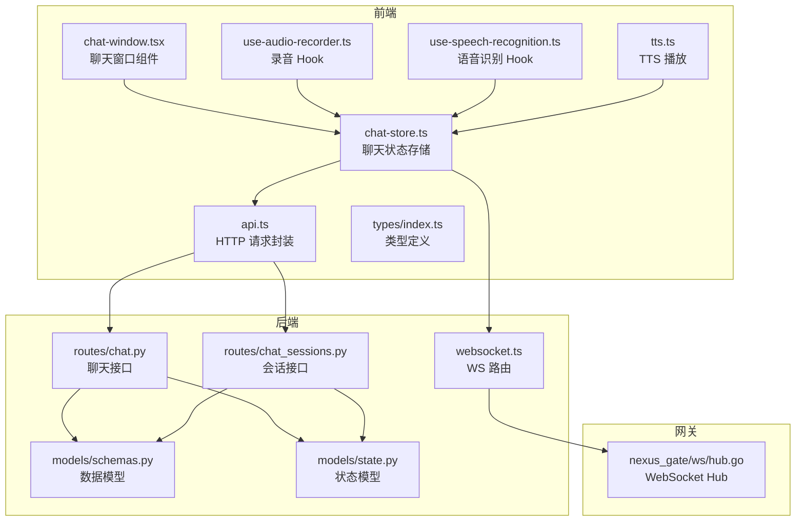
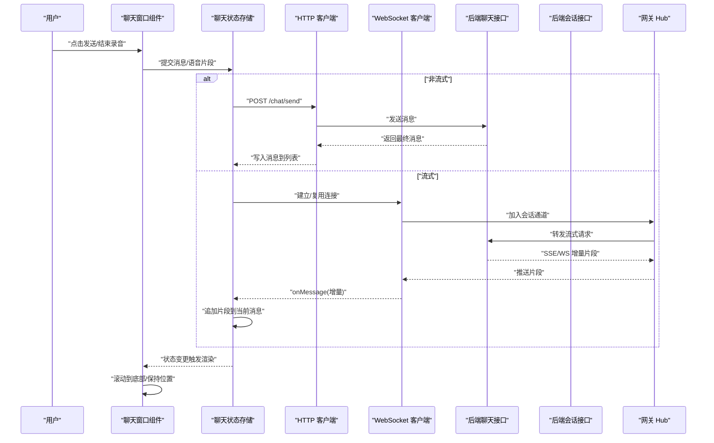
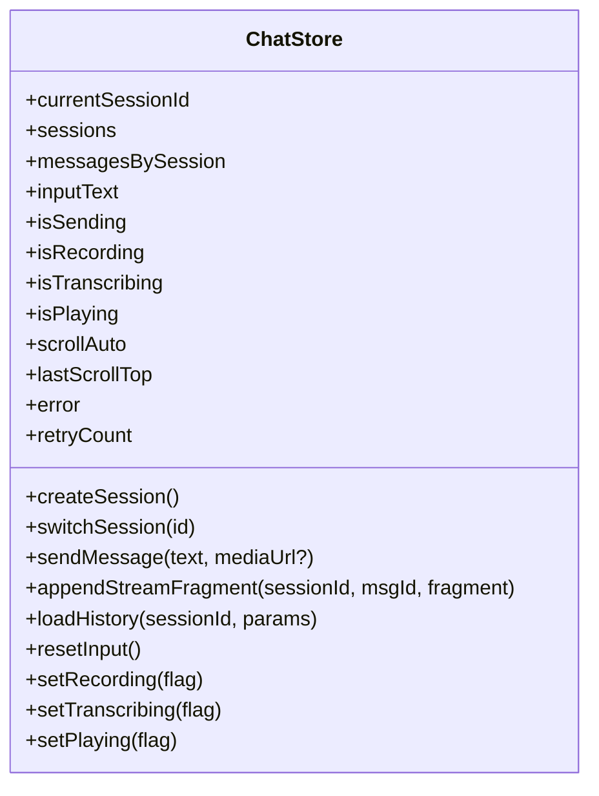
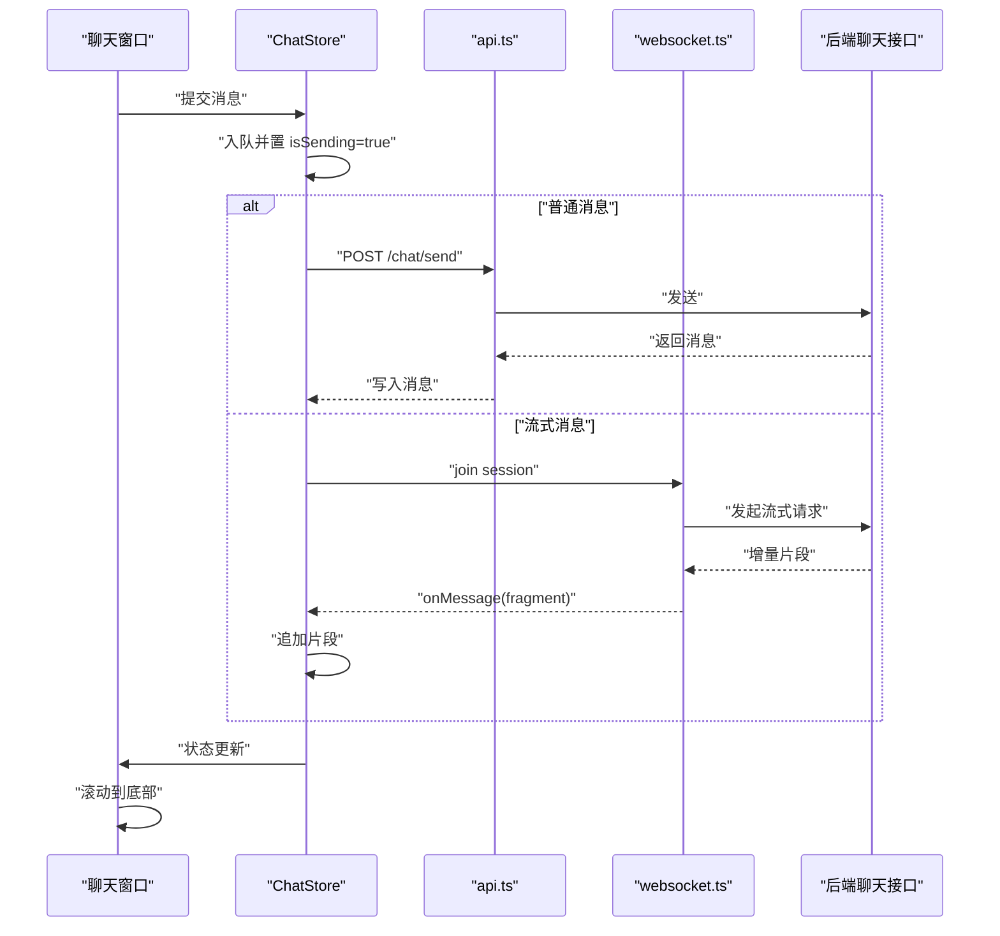
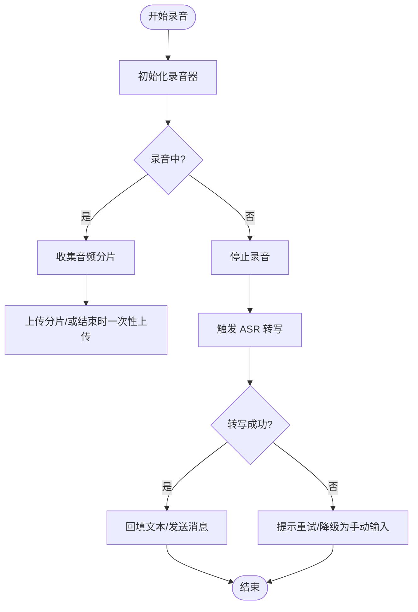
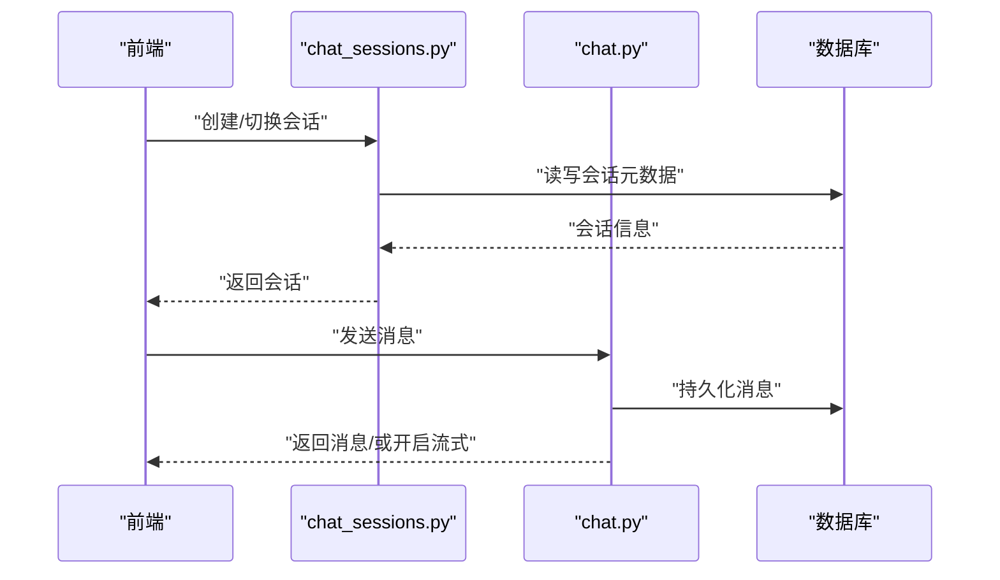
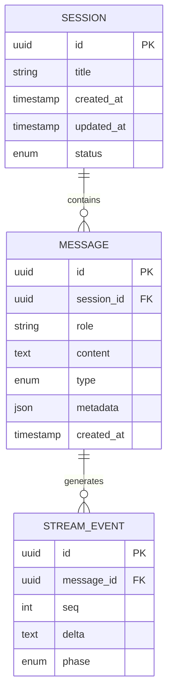
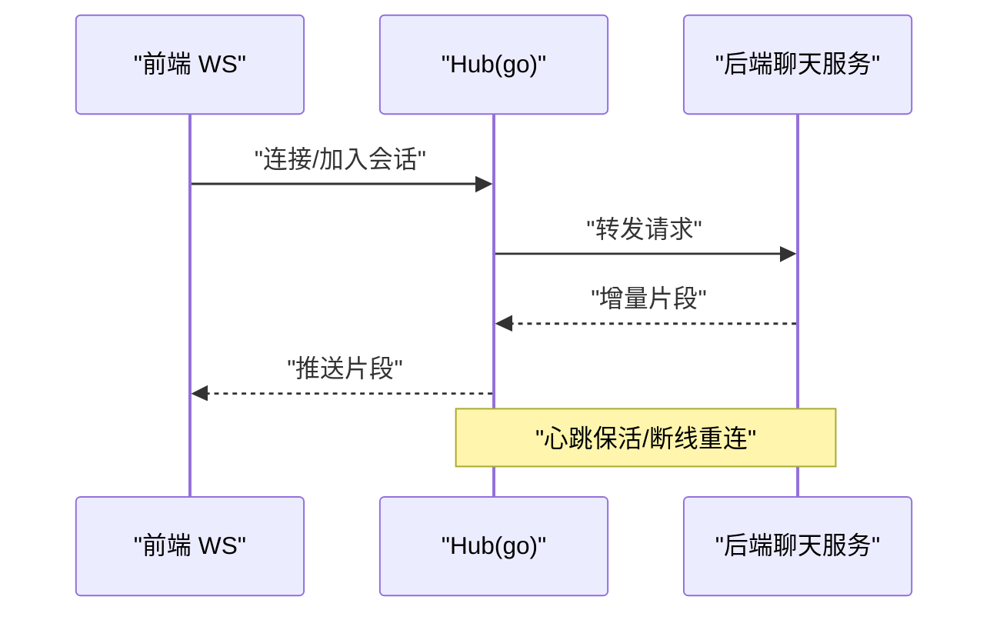
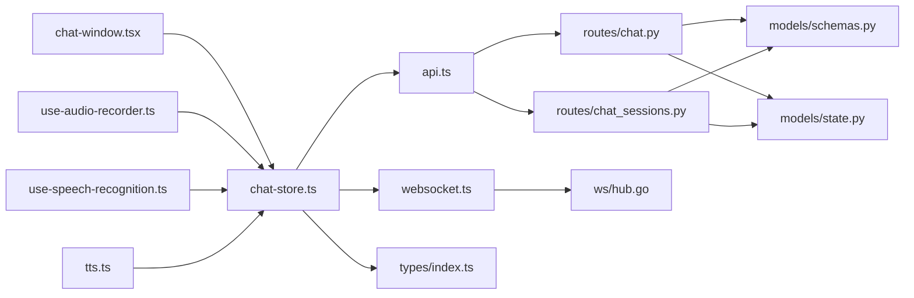

# 聊天状态管理

<cite>
**本文引用的文件**   
- [chat-store.ts](file://frontend_design/src/stores/chat-store.ts)
- [chat-window.tsx](file://frontend_design/src/components/chat/chat-window.tsx)
- [use-audio-recorder.ts](file://frontend_design/src/hooks/use-audio-recorder.ts)
- [use-speech-recognition.ts](file://frontend_design/src/hooks/use-speech-recognition.ts)
- [tts.ts](file://frontend_design/src/lib/tts.ts)
- [api.ts](file://frontend_design/src/lib/api.ts)
- [index.ts](file://frontend_design/src/types/index.ts)
- [websocket.ts](file://backend_design/nexus/api/websocket.ts)
- [chat.py](file://backend_design/nexus/api/routes/chat.py)
- [chat_sessions.py](file://backend_design/nexus/api/routes/chat_sessions.py)
- [schemas.py](file://backend_design/nexus/models/schemas.py)
- [state.py](file://backend_design/nexus/models/state.py)
- [hub.go](file://backend_design/nexus_gate/internal/ws/hub.go)
</cite>

## 目录
1. [简介](#简介)
2. [项目结构](#项目结构)
3. [核心组件](#核心组件)
4. [架构总览](#架构总览)
5. [详细组件分析](#详细组件分析)
6. [依赖关系分析](#依赖关系分析)
7. [性能考虑](#性能考虑)
8. [故障排查指南](#故障排查指南)
9. [结论](#结论)
10. [附录：使用示例与最佳实践](#附录使用示例与最佳实践)

## 简介
本技术文档聚焦于 NexusCockpit 的“聊天状态管理”，覆盖前后端在会话、消息、实时通信、语音交互等方面的状态设计与实现。内容包含：
- 聊天会话的状态结构设计（消息历史、会话切换、消息类型）
- 实时通信状态管理（WebSocket 连接、发送/接收状态、流式响应）
- 聊天界面状态同步（消息列表更新、滚动位置保持、输入状态）
- 语音交互状态（录音、播放、ASR/TTS 进度）
- 消息持久化策略、内存优化技巧、错误重试机制
- 实际代码示例路径，展示如何创建新会话、发送消息、处理语音输入、管理聊天历史

## 项目结构
前端采用 Next.js + TypeScript，状态集中在 store 与 hooks 中；后端以 FastAPI 提供 REST 与 WebSocket 接口，Go 网关负责 WebSocket Hub 转发。

**图示来源** 
- [chat-store.ts](file://frontend_design/src/stores/chat-store.ts)
- [chat-window.tsx](file://frontend_design/src/components/chat/chat-window.tsx)
- [use-audio-recorder.ts](file://frontend_design/src/hooks/use-audio-recorder.ts)
- [use-speech-recognition.ts](file://frontend_design/src/hooks/use-speech-recognition.ts)
- [tts.ts](file://frontend_design/src/lib/tts.ts)
- [api.ts](file://frontend_design/src/lib/api.ts)
- [index.ts](file://frontend_design/src/types/index.ts)
- [websocket.ts](file://backend_design/nexus/api/websocket.ts)
- [chat.py](file://backend_design/nexus/api/routes/chat.py)
- [chat_sessions.py](file://backend_design/nexus/api/routes/chat_sessions.py)
- [schemas.py](file://backend_design/nexus/models/schemas.py)
- [state.py](file://backend_design/nexus/models/state.py)
- [hub.go](file://backend_design/nexus_gate/internal/ws/hub.go)

**章节来源**
- [chat-store.ts](file://frontend_design/src/stores/chat-store.ts)
- [chat-window.tsx](file://frontend_design/src/components/chat/chat-window.tsx)
- [use-audio-recorder.ts](file://frontend_design/src/hooks/use-audio-recorder.ts)
- [use-speech-recognition.ts](file://frontend_design/src/hooks/use-speech-recognition.ts)
- [tts.ts](file://frontend_design/src/lib/tts.ts)
- [api.ts](file://frontend_design/src/lib/api.ts)
- [index.ts](file://frontend_design/src/types/index.ts)
- [websocket.ts](file://backend_design/nexus/api/websocket.ts)
- [chat.py](file://backend_design/nexus/api/routes/chat.py)
- [chat_sessions.py](file://backend_design/nexus/api/routes/chat_sessions.py)
- [schemas.py](file://backend_design/nexus/models/schemas.py)
- [state.py](file://backend_design/nexus/models/state.py)
- [hub.go](file://backend_design/nexus_gate/internal/ws/hub.go)

## 核心组件
- 前端聊天状态存储（chat-store.ts）
  - 维护当前会话 ID、消息列表、加载/错误状态、输入框文本、语音相关状态（录音/播放/转写进度）、滚动锚点等
  - 提供创建/切换/删除会话、发送消息、追加流式片段、重置状态等方法
- 聊天窗口组件（chat-window.tsx）
  - 订阅 store 状态，渲染消息列表与输入区，处理用户交互（发送、清空、语音按钮）
  - 控制滚动行为（新消息自动滚动到底部，恢复历史滚动位置）
- 语音相关 Hooks
  - use-audio-recorder.ts：封装 MediaRecorder，管理录音开始/停止、音频数据分片上传
  - use-speech-recognition.ts：封装浏览器 SpeechRecognition，管理转写结果与中断
- TTS 播放（tts.ts）
  - 管理音频播放队列、播放状态、打断逻辑
- HTTP/WebSocket 客户端（api.ts, websocket.ts）
  - 统一封装 REST 调用与 WebSocket 连接、重连、事件分发
- 后端聊天与会话接口（chat.py, chat_sessions.py）
  - 提供创建会话、发送消息、获取历史、流式响应等能力
- 数据与状态模型（schemas.py, state.py）
  - 定义消息、会话、流式事件等数据结构
- 网关 WebSocket Hub（hub.go）
  - 管理多连接广播、房间/会话级转发

**章节来源**
- [chat-store.ts](file://frontend_design/src/stores/chat-store.ts)
- [chat-window.tsx](file://frontend_design/src/components/chat/chat-window.tsx)
- [use-audio-recorder.ts](file://frontend_design/src/hooks/use-audio-recorder.ts)
- [use-speech-recognition.ts](file://frontend_design/src/hooks/use-speech-recognition.ts)
- [tts.ts](file://frontend_design/src/lib/tts.ts)
- [api.ts](file://frontend_design/src/lib/api.ts)
- [websocket.ts](file://backend_design/nexus/api/websocket.ts)
- [chat.py](file://backend_design/nexus/api/routes/chat.py)
- [chat_sessions.py](file://backend_design/nexus/api/routes/chat_sessions.py)
- [schemas.py](file://backend_design/nexus/models/schemas.py)
- [state.py](file://backend_design/nexus/models/state.py)
- [hub.go](file://backend_design/nexus_gate/internal/ws/hub.go)

## 架构总览
整体流程：用户在聊天窗口输入或语音输入，前端通过 store 发起发送请求；REST 用于常规消息，WebSocket 用于流式增量返回；后端根据会话上下文生成回复并推送；前端实时更新消息列表与滚动位置，必要时触发 TTS 播放。

**图示来源** 
- [chat-window.tsx](file://frontend_design/src/components/chat/chat-window.tsx)
- [chat-store.ts](file://frontend_design/src/stores/chat-store.ts)
- [api.ts](file://frontend_design/src/lib/api.ts)
- [websocket.ts](file://backend_design/nexus/api/websocket.ts)
- [chat.py](file://backend_design/nexus/api/routes/chat.py)
- [chat_sessions.py](file://backend_design/nexus/api/routes/chat_sessions.py)
- [hub.go](file://backend_design/nexus_gate/internal/ws/hub.go)

## 详细组件分析

### 前端聊天状态存储（chat-store.ts）
职责与状态字段
- 会话管理：当前会话 ID、会话列表、加载态
- 消息管理：消息数组、按会话索引的消息映射、正在编辑/发送中的消息标记
- 输入状态：输入框文本、是否禁用发送
- 语音状态：录音中、转写中、播放中、TTS 队列长度
- 滚动状态：是否自动滚动、上次滚动位置
- 错误与重试：最近错误信息、重试计数、退避策略参数

关键方法
- 创建/切换/删除会话：校验上下文、更新当前会话、拉取历史
- 发送消息：构造消息对象、入队、调用 API/WS、处理成功/失败
- 流式追加：定位当前消息、追加片段、合并为完整文本
- 历史加载：分页/时间窗加载、去重、插入到列表
- 滚动控制：计算是否需要滚动到底部、保存/恢复位置
- 语音联动：录音完成回调、转写结果回填、TTS 播放状态同步

内存优化
- 仅保留必要字段，避免冗余引用
- 大列表虚拟滚动（由上层组件配合）
- 消息片段延迟合并，减少频繁重排

错误处理与重试
- 网络异常时指数退避重试
- 断线重连（WebSocket）
- 幂等发送（基于消息 ID）

**章节来源**
- [chat-store.ts](file://frontend_design/src/stores/chat-store.ts)

#### 类图（前端状态模型）

**图示来源** 
- [chat-store.ts](file://frontend_design/src/stores/chat-store.ts)

### 聊天窗口组件（chat-window.tsx）
职责
- 渲染消息列表与输入区
- 监听 store 变化，驱动 UI 更新
- 处理用户操作：发送、清空、语音按钮、滚动行为
- 与语音/播放状态联动（显示录音/转写/播放指示器）

滚动策略
- 新消息到达且用户已在底部则自动滚动
- 用户上滚查看历史时不强制滚动到底部
- 切换会话后恢复上次滚动位置

**章节来源**
- [chat-window.tsx](file://frontend_design/src/components/chat/chat-window.tsx)

#### 序列图（发送消息）

**图示来源** 
- [chat-window.tsx](file://frontend_design/src/components/chat/chat-window.tsx)
- [chat-store.ts](file://frontend_design/src/stores/chat-store.ts)
- [api.ts](file://frontend_design/src/lib/api.ts)
- [websocket.ts](file://backend_design/nexus/api/websocket.ts)
- [chat.py](file://backend_design/nexus/api/routes/chat.py)

### 语音交互状态（录音/转写/播放）
- 录音（use-audio-recorder.ts）
  - 管理 MediaRecorder 生命周期、分片上传、错误回退
  - 与 store 的 isRecording 状态联动
- 转写（use-speech-recognition.ts）
  - 管理浏览器语音识别、中间结果、最终结果
  - 将转写文本回填至输入框或作为消息发送
- 播放（tts.ts）
  - 管理播放队列、打断、播放进度
  - 与 store 的 isPlaying 状态联动

**图示来源** 
- [use-audio-recorder.ts](file://frontend_design/src/hooks/use-audio-recorder.ts)
- [use-speech-recognition.ts](file://frontend_design/src/hooks/use-speech-recognition.ts)
- [chat-store.ts](file://frontend_design/src/stores/chat-store.ts)

**章节来源**
- [use-audio-recorder.ts](file://frontend_design/src/hooks/use-audio-recorder.ts)
- [use-speech-recognition.ts](file://frontend_design/src/hooks/use-speech-recognition.ts)
- [tts.ts](file://frontend_design/src/lib/tts.ts)
- [chat-store.ts](file://frontend_design/src/stores/chat-store.ts)

### 后端聊天与会话接口（chat.py, chat_sessions.py）
- 会话接口（chat_sessions.py）
  - 创建会话、列出会话、切换会话、删除会话
  - 返回会话元信息与最近消息摘要
- 聊天接口（chat.py）
  - 发送消息（REST）：校验输入、落库、返回消息
  - 流式响应（WS/SSE）：增量推送片段，支持中断
  - 获取历史：分页/时间范围查询，支持过滤消息类型

**图示来源** 
- [chat_sessions.py](file://backend_design/nexus/api/routes/chat_sessions.py)
- [chat.py](file://backend_design/nexus/api/routes/chat.py)

**章节来源**
- [chat.py](file://backend_design/nexus/api/routes/chat.py)
- [chat_sessions.py](file://backend_design/nexus/api/routes/chat_sessions.py)

### 数据与状态模型（schemas.py, state.py）
- schemas.py
  - 定义消息体、会话体、流式事件、分页参数等
- state.py
  - 定义系统内部状态机（如会话状态、消息状态、流式阶段）

**图示来源** 
- [schemas.py](file://backend_design/nexus/models/schemas.py)
- [state.py](file://backend_design/nexus/models/state.py)

**章节来源**
- [schemas.py](file://backend_design/nexus/models/schemas.py)
- [state.py](file://backend_design/nexus/models/state.py)

### 网关 WebSocket Hub（hub.go）
- 管理连接池、会话级频道
- 转发前端消息到后端服务，并将后端增量片段广播给对应前端连接
- 处理心跳、断线重连、限流

**图示来源** 
- [hub.go](file://backend_design/nexus_gate/internal/ws/hub.go)
- [websocket.ts](file://backend_design/nexus/api/websocket.ts)

**章节来源**
- [hub.go](file://backend_design/nexus_gate/internal/ws/hub.go)
- [websocket.ts](file://backend_design/nexus/api/websocket.ts)

## 依赖关系分析
- 前端
  - chat-store.ts 依赖 api.ts、websocket.ts、types/index.ts
  - chat-window.tsx 依赖 chat-store.ts
  - 语音与播放依赖 use-audio-recorder.ts、use-speech-recognition.ts、tts.ts
- 后端
  - routes/chat.py、routes/chat_sessions.py 依赖 models/schemas.py、models/state.py
  - api/websocket.ts 依赖 gateway hub.go

**图示来源** 
- [chat-store.ts](file://frontend_design/src/stores/chat-store.ts)
- [chat-window.tsx](file://frontend_design/src/components/chat/chat-window.tsx)
- [use-audio-recorder.ts](file://frontend_design/src/hooks/use-audio-recorder.ts)
- [use-speech-recognition.ts](file://frontend_design/src/hooks/use-speech-recognition.ts)
- [tts.ts](file://frontend_design/src/lib/tts.ts)
- [api.ts](file://frontend_design/src/lib/api.ts)
- [websocket.ts](file://backend_design/nexus/api/websocket.ts)
- [chat.py](file://backend_design/nexus/api/routes/chat.py)
- [chat_sessions.py](file://backend_design/nexus/api/routes/chat_sessions.py)
- [schemas.py](file://backend_design/nexus/models/schemas.py)
- [state.py](file://backend_design/nexus/models/state.py)
- [hub.go](file://backend_design/nexus_gate/internal/ws/hub.go)

**章节来源**
- [chat-store.ts](file://frontend_design/src/stores/chat-store.ts)
- [chat-window.tsx](file://frontend_design/src/components/chat/chat-window.tsx)
- [use-audio-recorder.ts](file://frontend_design/src/hooks/use-audio-recorder.ts)
- [use-speech-recognition.ts](file://frontend_design/src/hooks/use-speech-recognition.ts)
- [tts.ts](file://frontend_design/src/lib/tts.ts)
- [api.ts](file://frontend_design/src/lib/api.ts)
- [websocket.ts](file://backend_design/nexus/api/websocket.ts)
- [chat.py](file://backend_design/nexus/api/routes/chat.py)
- [chat_sessions.py](file://backend_design/nexus/api/routes/chat_sessions.py)
- [schemas.py](file://backend_design/nexus/models/schemas.py)
- [state.py](file://backend_design/nexus/models/state.py)
- [hub.go](file://backend_design/nexus_gate/internal/ws/hub.go)

## 性能考虑
- 消息列表
  - 使用稳定 key（消息 ID）减少重排
  - 大列表启用虚拟滚动（由上层组件实现）
  - 增量追加而非全量替换
- 流式响应
  - 小片段合并策略，降低渲染频率
  - 节流/防抖更新，避免频繁状态变更
- 语音
  - 录音分片上传，降低单次体积
  - 转写结果缓存，避免重复识别
  - TTS 播放队列，支持打断与优先级
- 网络
  - 指数退避重试、连接池复用
  - 心跳保活，快速检测断线

[本节为通用指导，无需具体文件来源]

## 故障排查指南
常见问题与定位要点
- 无法创建/切换会话
  - 检查会话接口返回值与状态码
  - 确认本地 currentSessionId 是否正确更新
- 消息未显示或重复
  - 核对消息 ID 唯一性与去重逻辑
  - 检查流式片段顺序与合并策略
- 流式无响应或卡顿
  - 观察 WebSocket 连接状态与心跳
  - 检查 Hub 转发日志与后端流式输出
- 语音转写失败
  - 检查浏览器权限与麦克风可用性
  - 查看转写中间结果与最终结果回调
- TTS 播放异常
  - 检查播放队列与打断逻辑
  - 确认音频源 URL 可达与格式兼容

**章节来源**
- [chat-store.ts](file://frontend_design/src/stores/chat-store.ts)
- [chat-window.tsx](file://frontend_design/src/components/chat/chat-window.tsx)
- [use-audio-recorder.ts](file://frontend_design/src/hooks/use-audio-recorder.ts)
- [use-speech-recognition.ts](file://frontend_design/src/hooks/use-speech-recognition.ts)
- [tts.ts](file://frontend_design/src/lib/tts.ts)
- [websocket.ts](file://backend_design/nexus/api/websocket.ts)
- [hub.go](file://backend_design/nexus_gate/internal/ws/hub.go)

## 结论
NexusCockpit 的聊天状态管理以前端 store 为核心，结合组件与语音/播放 hooks，形成清晰的状态流转；后端通过 REST 与 WebSocket 协同，提供稳定的会话与消息能力。通过合理的内存优化、错误重试与流式处理，系统在交互体验与稳定性方面达到良好平衡。

[本节为总结性内容，无需具体文件来源]

## 附录：使用示例与最佳实践
以下示例以“步骤+文件路径”的形式给出，便于直接定位实现细节。

- 创建新会话
  - 步骤
    - 调用会话接口创建会话
    - 更新当前会话 ID 与标题
    - 拉取最近消息摘要
  - 参考路径
    - [chat_sessions.py](file://backend_design/nexus/api/routes/chat_sessions.py)
    - [chat-store.ts](file://frontend_design/src/stores/chat-store.ts)

- 发送消息（REST）
  - 步骤
    - 构建消息对象（角色、内容、类型）
    - 调用发送接口
    - 成功后追加到消息列表并滚动到底部
  - 参考路径
    - [chat.py](file://backend_design/nexus/api/routes/chat.py)
    - [api.ts](file://frontend_design/src/lib/api.ts)
    - [chat-store.ts](file://frontend_design/src/stores/chat-store.ts)
    - [chat-window.tsx](file://frontend_design/src/components/chat/chat-window.tsx)

- 发送消息（流式）
  - 步骤
    - 建立/复用 WebSocket 连接并加入会话频道
    - 发送消息并监听增量片段
    - 将片段追加到当前消息，完成后合并为完整文本
  - 参考路径
    - [websocket.ts](file://backend_design/nexus/api/websocket.ts)
    - [hub.go](file://backend_design/nexus_gate/internal/ws/hub.go)
    - [chat.py](file://backend_design/nexus/api/routes/chat.py)
    - [chat-store.ts](file://frontend_design/src/stores/chat-store.ts)

- 处理语音输入
  - 步骤
    - 启动录音，收集音频分片
    - 结束录音后触发 ASR 转写
    - 将转写文本回填输入框或直接发送
  - 参考路径
    - [use-audio-recorder.ts](file://frontend_design/src/hooks/use-audio-recorder.ts)
    - [use-speech-recognition.ts](file://frontend_design/src/hooks/use-speech-recognition.ts)
    - [chat-store.ts](file://frontend_design/src/stores/chat-store.ts)

- 管理聊天历史
  - 步骤
    - 切换会话时加载历史（分页/时间窗）
    - 去重并按时间排序插入
    - 保持滚动位置或自动滚动
  - 参考路径
    - [chat_sessions.py](file://backend_design/nexus/api/routes/chat_sessions.py)
    - [chat-store.ts](file://frontend_design/src/stores/chat-store.ts)
    - [chat-window.tsx](file://frontend_design/src/components/chat/chat-window.tsx)

- 消息类型定义与状态模型
  - 参考路径
    - [schemas.py](file://backend_design/nexus/models/schemas.py)
    - [state.py](file://backend_design/nexus/models/state.py)
    - [index.ts](file://frontend_design/src/types/index.ts)