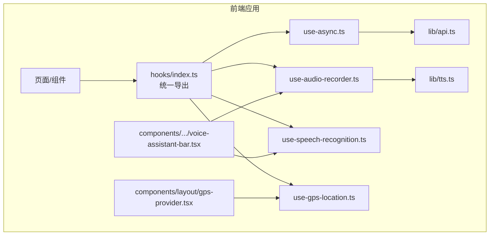
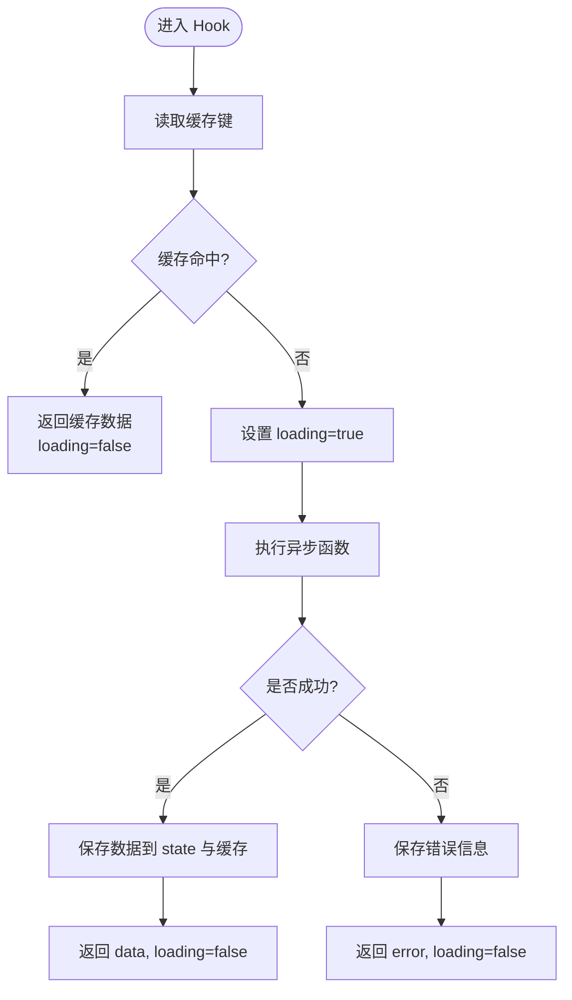
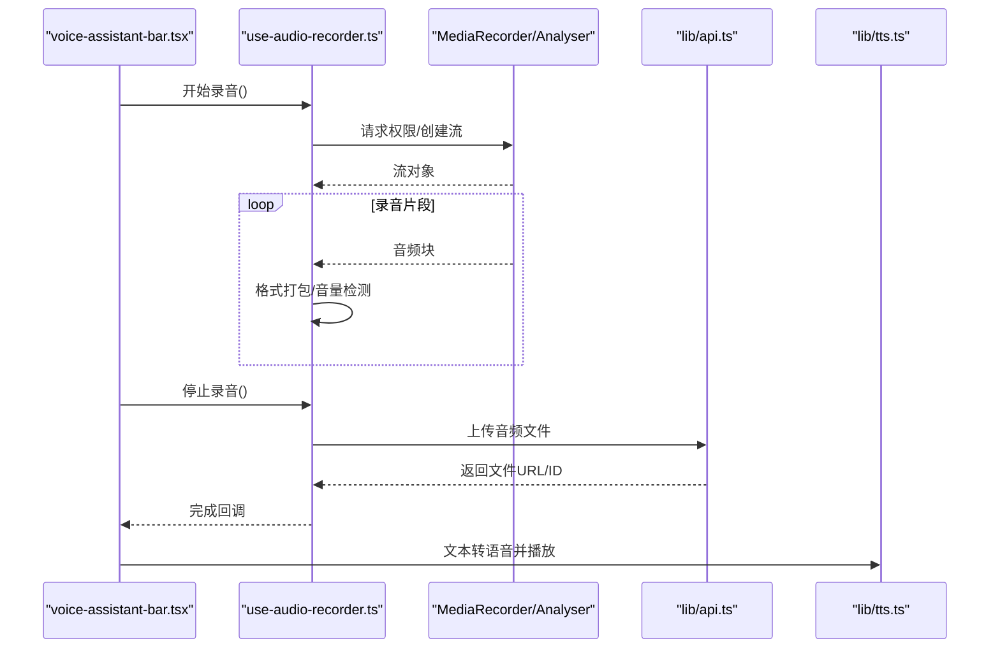
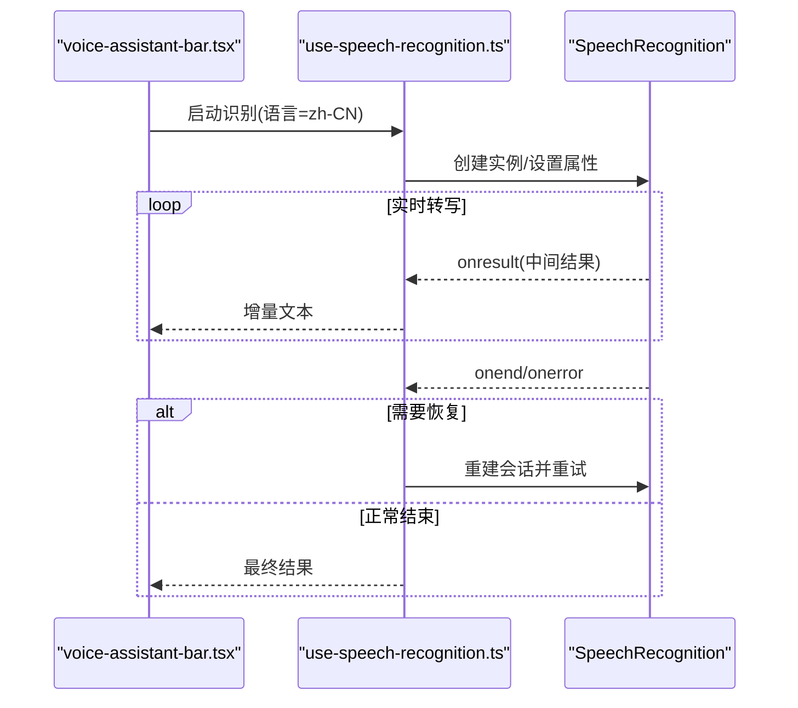
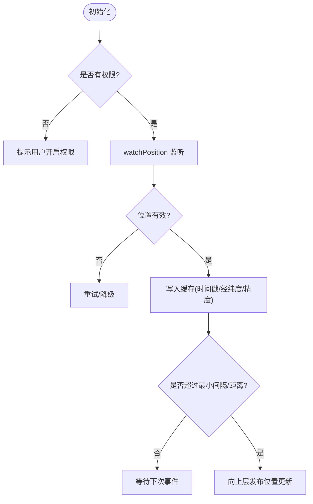
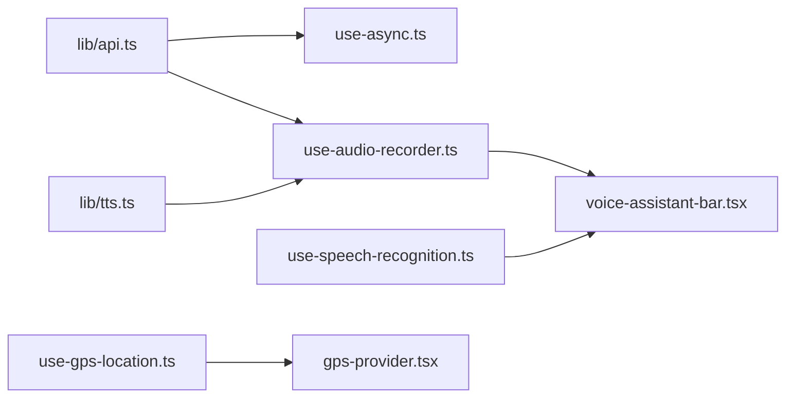

# 自定义Hooks模式

<cite>
**本文引用的文件**   
- [frontend_design/src/hooks/use-async.ts](file://frontend_design/src/hooks/use-async.ts)
- [frontend_design/src/hooks/use-audio-recorder.ts](file://frontend_design/src/hooks/use-audio-recorder.ts)
- [frontend_design/src/hooks/use-speech-recognition.ts](file://frontend_design/src/hooks/use-speech-recognition.ts)
- [frontend_design/src/hooks/use-gps-location.ts](file://frontend_design/src/hooks/use-gps-location.ts)
- [frontend_design/src/hooks/index.ts](file://frontend_design/src/hooks/index.ts)
- [frontend_design/src/lib/api.ts](file://frontend_design/src/lib/api.ts)
- [frontend_design/src/lib/tts.ts](file://frontend_design/src/lib/tts.ts)
- [frontend_design/src/components/vehicle/voice-assistant-bar.tsx](file://frontend_design/src/components/vehicle/voice-assistant-bar.tsx)
- [frontend_design/src/components/layout/gps-provider.tsx](file://frontend_design/src/components/layout/gps-provider.tsx)
</cite>

## 目录
1. [简介](#简介)
2. [项目结构](#项目结构)
3. [核心组件](#核心组件)
4. [架构总览](#架构总览)
5. [详细组件分析](#详细组件分析)
6. [依赖分析](#依赖分析)
7. [性能考虑](#性能考虑)
8. [故障排查指南](#故障排查指南)
9. [结论](#结论)
10. [附录](#附录)

## 简介
本技术文档聚焦于 NexusCockpit 前端中的自定义 Hooks 设计模式，系统性解析以下能力：
- useAsync Hook：异步状态管理、加载与错误统一处理、缓存策略。
- 音频录制 Hook：基于 Web Audio API 的封装、录音格式处理、音量检测、上传集成。
- 语音识别 Hook：浏览器原生 SpeechRecognition 的使用、实时转写、语言检测、错误恢复。
- GPS 定位 Hook：地理位置 API 封装、精度控制、权限处理、位置缓存。
- Hooks 组合使用模式、性能优化技巧、调试工具集成，并提供创建新 Hook 与组合复杂业务逻辑的实践示例。

## 项目结构
NexusCockpit 的前端采用 Next.js + TypeScript 组织，自定义 Hooks 集中于 hooks 目录，并通过 index.ts 统一导出；与 UI 组件和工具库（如 api.ts、tts.ts）解耦，便于复用与测试。



图表来源
- [frontend_design/src/hooks/index.ts](file://frontend_design/src/hooks/index.ts)
- [frontend_design/src/hooks/use-async.ts](file://frontend_design/src/hooks/use-async.ts)
- [frontend_design/src/hooks/use-audio-recorder.ts](file://frontend_design/src/hooks/use-audio-recorder.ts)
- [frontend_design/src/hooks/use-speech-recognition.ts](file://frontend_design/src/hooks/use-speech-recognition.ts)
- [frontend_design/src/hooks/use-gps-location.ts](file://frontend_design/src/hooks/use-gps-location.ts)
- [frontend_design/src/lib/api.ts](file://frontend_design/src/lib/api.ts)
- [frontend_design/src/lib/tts.ts](file://frontend_design/src/lib/tts.ts)
- [frontend_design/src/components/vehicle/voice-assistant-bar.tsx](file://frontend_design/src/components/vehicle/voice-assistant-bar.tsx)
- [frontend_design/src/components/layout/gps-provider.tsx](file://frontend_design/src/components/layout/gps-provider.tsx)

章节来源
- [frontend_design/src/hooks/index.ts](file://frontend_design/src/hooks/index.ts)

## 核心组件
本节对四个核心自定义 Hook 进行概览式说明，后续章节将深入实现细节与流程图。

- useAsync：封装通用异步请求生命周期，提供 loading、error、data 状态与可选缓存键，支持手动重试与取消。
- useAudioRecorder：封装 MediaRecorder/Web Audio API，提供开始/停止录音、PCM/OGG 等格式输出、实时音量检测、上传到后端接口。
- useSpeechRecognition：封装浏览器 SpeechRecognition，提供实时转写、语言设置、结果拼接、错误恢复与重连。
- useGpsLocation：封装 navigator.geolocation，提供高精度定位、权限提示、位置缓存与去抖更新。

章节来源
- [frontend_design/src/hooks/use-async.ts](file://frontend_design/src/hooks/use-async.ts)
- [frontend_design/src/hooks/use-audio-recorder.ts](file://frontend_design/src/hooks/use-audio-recorder.ts)
- [frontend_design/src/hooks/use-speech-recognition.ts](file://frontend_design/src/hooks/use-speech-recognition.ts)
- [frontend_design/src/hooks/use-gps-location.ts](file://frontend_design/src/hooks/use-gps-location.ts)

## 架构总览
下图展示了 Hooks 与外部依赖（API、TTS、UI 组件）之间的交互关系，体现“Hook 作为能力单元”的设计思想。

```mermaid
graph TB
UAR["use-async.ts"] --> API["lib/api.ts"]
UAR --> |返回{loading,error,data}| UI1["任意组件"]
UAR2["use-audio-recorder.ts"] --> WEBA["Web Audio / MediaRecorder"]
UAR2 --> API
UAR2 --> TTS["lib/tts.ts"]
UAR2 --> UI2["voice-assistant-bar.tsx"]
UASR["use-speech-recognition.ts"] --> SR["浏览器 SpeechRecognition"]
UASR --> UI2
UGPS["use-gps-location.ts"] --> GEO["navigator.geolocation"]
UGPS --> GPSProv["gps-provider.tsx"]
```

图表来源
- [frontend_design/src/hooks/use-async.ts](file://frontend_design/src/hooks/use-async.ts)
- [frontend_design/src/hooks/use-audio-recorder.ts](file://frontend_design/src/hooks/use-audio-recorder.ts)
- [frontend_design/src/hooks/use-speech-recognition.ts](file://frontend_design/src/hooks/use-speech-recognition.ts)
- [frontend_design/src/hooks/use-gps-location.ts](file://frontend_design/src/hooks/use-gps-location.ts)
- [frontend_design/src/lib/api.ts](file://frontend_design/src/lib/api.ts)
- [frontend_design/src/lib/tts.ts](file://frontend_design/src/lib/tts.ts)
- [frontend_design/src/components/vehicle/voice-assistant-bar.tsx](file://frontend_design/src/components/vehicle/voice-assistant-bar.tsx)
- [frontend_design/src/components/layout/gps-provider.tsx](file://frontend_design/src/components/layout/gps-provider.tsx)

## 详细组件分析

### useAsync：异步状态管理与缓存
- 职责
  - 统一管理异步操作的 loading、error、data 状态。
  - 支持基于 key 的简单内存缓存，避免重复请求。
  - 暴露执行函数、重试、清理副作用的能力。
- 关键流程
  - 初始化时根据 key 检查缓存命中，命中则直接返回数据并结束 loading。
  - 未命中则进入执行阶段：设置 loading=true，调用传入的异步函数，成功写入 data 并缓存，失败记录 error。
  - 提供手动触发与自动触发（依赖变化）两种模式。
- 复杂度
  - 时间复杂度 O(1)（缓存查找），空间复杂度取决于缓存大小。
- 错误处理
  - 捕获异常并归一化为 error 状态，组件侧可据此展示友好提示或降级逻辑。
- 缓存策略
  - 基于字符串 key 的内存 Map，支持过期时间或失效策略（由上层配置）。
- 典型用法路径
  - 在页面或子组件中通过 useAsync 发起数据获取，结合 UI 渲染 loading/error/data。



图表来源
- [frontend_design/src/hooks/use-async.ts](file://frontend_design/src/hooks/use-async.ts)

章节来源
- [frontend_design/src/hooks/use-async.ts](file://frontend_design/src/hooks/use-async.ts)

### 音频录制 Hook：Web Audio API 封装与上传集成
- 职责
  - 封装媒体采集与音频流处理，提供开始/停止录音、格式转换、实时音量检测、上传至后端。
- 关键流程
  - 初始化：请求麦克风权限，创建 MediaStream，必要时接入 AnalyserNode 做音量检测。
  - 录音：使用 MediaRecorder 收集音频块，按目标格式（如 PCM/OGG）打包。
  - 上传：完成后调用 api.ts 提供的上传接口，返回文件 URL 或 ID。
  - 播放：可与 tts.ts 协作，将文本转语音后播放。
- 错误处理
  - 权限拒绝、设备不可用、编码不支持等情况均会记录错误状态，并提供重试或回退方案。
- 性能要点
  - 合理设置采样率与分片大小，避免主线程阻塞；使用 OffscreenAudioContext（若可用）降低卡顿。
- 典型用法路径
  - 在 voice-assistant-bar.tsx 中组合 useAudioRecorder 与 useSpeechRecognition，实现“按住说话”体验。



图表来源
- [frontend_design/src/hooks/use-audio-recorder.ts](file://frontend_design/src/hooks/use-audio-recorder.ts)
- [frontend_design/src/lib/api.ts](file://frontend_design/src/lib/api.ts)
- [frontend_design/src/lib/tts.ts](file://frontend_design/src/lib/tts.ts)
- [frontend_design/src/components/vehicle/voice-assistant-bar.tsx](file://frontend_design/src/components/vehicle/voice-assistant-bar.tsx)

章节来源
- [frontend_design/src/hooks/use-audio-recorder.ts](file://frontend_design/src/hooks/use-audio-recorder.ts)
- [frontend_design/src/lib/api.ts](file://frontend_design/src/lib/api.ts)
- [frontend_design/src/lib/tts.ts](file://frontend_design/src/lib/tts.ts)
- [frontend_design/src/components/vehicle/voice-assistant-bar.tsx](file://frontend_design/src/components/vehicle/voice-assistant-bar.tsx)

### 语音识别 Hook：浏览器原生 API 与错误恢复
- 职责
  - 封装 SpeechRecognition，提供实时转写、语言设置、结果拼接、错误恢复与重连。
- 关键流程
  - 初始化：创建实例，设置语言、连续识别、中间结果回调。
  - 运行：监听 onresult/onerror/onend，维护当前转写文本与最终结果。
  - 恢复：onerror 或 onend 时尝试重建会话并重试，避免中断用户体验。
- 错误处理
  - 针对权限、网络、引擎不可用等错误进行分类处理，提供用户提示与降级（如切换到键盘输入）。
- 性能要点
  - 节流中间结果更新，减少重渲染；合并相邻短句提升可读性。
- 典型用法路径
  - 在 voice-assistant-bar.tsx 中，将识别结果传递给聊天或指令解析模块。



图表来源
- [frontend_design/src/hooks/use-speech-recognition.ts](file://frontend_design/src/hooks/use-speech-recognition.ts)
- [frontend_design/src/components/vehicle/voice-assistant-bar.tsx](file://frontend_design/src/components/vehicle/voice-assistant-bar.tsx)

章节来源
- [frontend_design/src/hooks/use-speech-recognition.ts](file://frontend_design/src/hooks/use-speech-recognition.ts)
- [frontend_design/src/components/vehicle/voice-assistant-bar.tsx](file://frontend_design/src/components/vehicle/voice-assistant-bar.tsx)

### GPS 定位 Hook：权限、精度与缓存
- 职责
  - 封装 navigator.geolocation，提供高精度定位、权限提示、位置缓存与去抖更新。
- 关键流程
  - 初始化：检查权限，必要时引导用户开启；设置 enableHighAccuracy、timeout、maximumAge。
  - 更新：watchPosition 持续监听，结合时间戳与距离阈值判断是否更新。
  - 缓存：将最近一次有效位置持久化（内存或 localStorage），快速返回。
- 错误处理
  - 权限拒绝、超时、未知错误分别处理，提供重试与降级（如默认城市坐标）。
- 性能要点
  - 合理设置 maximumAge 与最小更新间隔，避免频繁定位导致耗电。
- 典型用法路径
  - gps-provider.tsx 提供全局位置上下文，供车辆面板、导航等模块消费。



图表来源
- [frontend_design/src/hooks/use-gps-location.ts](file://frontend_design/src/hooks/use-gps-location.ts)
- [frontend_design/src/components/layout/gps-provider.tsx](file://frontend_design/src/components/layout/gps-provider.tsx)

章节来源
- [frontend_design/src/hooks/use-gps-location.ts](file://frontend_design/src/hooks/use-gps-location.ts)
- [frontend_design/src/components/layout/gps-provider.tsx](file://frontend_design/src/components/layout/gps-provider.tsx)

## 依赖分析
- 内部依赖
  - useAsync 依赖 lib/api.ts 的网络请求封装。
  - useAudioRecorder 依赖 lib/api.ts 的上传接口与 lib/tts.ts 的语音合成。
  - useSpeechRecognition 与 useGpsLocation 主要依赖浏览器原生 API。
- 组件耦合
  - voice-assistant-bar.tsx 组合 useAudioRecorder 与 useSpeechRecognition，形成“听-说”闭环。
  - gps-provider.tsx 聚合 useGpsLocation 并向下游提供位置上下文。
- 潜在循环依赖
  - 当前结构以 hooks 为中心向外辐射，未见明显循环导入风险。



图表来源
- [frontend_design/src/hooks/use-async.ts](file://frontend_design/src/hooks/use-async.ts)
- [frontend_design/src/hooks/use-audio-recorder.ts](file://frontend_design/src/hooks/use-audio-recorder.ts)
- [frontend_design/src/hooks/use-speech-recognition.ts](file://frontend_design/src/hooks/use-speech-recognition.ts)
- [frontend_design/src/hooks/use-gps-location.ts](file://frontend_design/src/hooks/use-gps-location.ts)
- [frontend_design/src/lib/api.ts](file://frontend_design/src/lib/api.ts)
- [frontend_design/src/lib/tts.ts](file://frontend_design/src/lib/tts.ts)
- [frontend_design/src/components/vehicle/voice-assistant-bar.tsx](file://frontend_design/src/components/vehicle/voice-assistant-bar.tsx)
- [frontend_design/src/components/layout/gps-provider.tsx](file://frontend_design/src/components/layout/gps-provider.tsx)

章节来源
- [frontend_design/src/hooks/index.ts](file://frontend_design/src/hooks/index.ts)

## 性能考虑
- 缓存与去抖
  - useAsync 的内存缓存可减少重复请求；useGpsLocation 的时间/距离阈值可降低定位频率。
- 渲染优化
  - 语音识别中间结果应节流更新；音频录制分片大小需权衡延迟与内存占用。
- 资源释放
  - 组件卸载时务必停止录音、关闭识别会话、清除 watchPosition 监听，避免泄漏。
- 并发控制
  - 对于高频操作（如实时转写、音量检测），注意在主线程与音频线程间的任务分配，避免阻塞 UI。

[本节为通用指导，不直接分析具体文件]

## 故障排查指南
- 常见问题
  - 权限问题：麦克风/摄像头/地理位置权限被拒，需在 UI 明确提示并引导用户授权。
  - 浏览器兼容：SpeechRecognition 在不同浏览器存在差异，建议提供降级方案（如键盘输入）。
  - 网络异常：上传失败或超时，应显示重试按钮与错误原因。
- 调试建议
  - 在 Hook 内部增加日志开关，打印关键状态变更（loading、error、data、position）。
  - 使用浏览器开发者工具的 Performance 面板分析音频与识别过程的耗时热点。
- 恢复策略
  - 语音识别：onerror/onend 自动重建会话；音频录制：断点续录或分段上传。
  - GPS：无信号时回退到上次缓存位置，并在 UI 上标注“离线”。

章节来源
- [frontend_design/src/hooks/use-audio-recorder.ts](file://frontend_design/src/hooks/use-audio-recorder.ts)
- [frontend_design/src/hooks/use-speech-recognition.ts](file://frontend_design/src/hooks/use-speech-recognition.ts)
- [frontend_design/src/hooks/use-gps-location.ts](file://frontend_design/src/hooks/use-gps-location.ts)

## 结论
NexusCockpit 的自定义 Hooks 以“单一职责、可组合、可测试”为核心原则，围绕异步、音频、语音识别与定位四大场景提供了稳定且易用的能力抽象。通过统一的错误处理、缓存与性能优化策略，显著提升了用户体验与开发效率。建议在新增功能时优先复用现有 Hook，并以组合方式构建更复杂的业务逻辑。

[本节为总结性内容，不直接分析具体文件]

## 附录

### 如何创建新的自定义 Hook（实践步骤）
- 明确职责：定义输入参数、返回值与副作用范围。
- 选择依赖：尽量使用浏览器原生 API 或已有工具库（api.ts、tts.ts）。
- 状态设计：遵循 loading/error/data 三元组或领域特定状态模型。
- 错误与恢复：覆盖常见异常路径，提供重试与降级。
- 性能与资源：加入去抖/节流、缓存、资源释放逻辑。
- 导出与文档：在 hooks/index.ts 中统一导出，补充使用示例与注意事项。

章节来源
- [frontend_design/src/hooks/index.ts](file://frontend_design/src/hooks/index.ts)

### 组合多个 Hooks 的典型模式
- “听-说-查”链路：useAudioRecorder + useSpeechRecognition + useAsync
  - 录音 -> 转写 -> 调用 API 查询 -> 渲染结果。
- “定位+天气”链路：useGpsLocation + useAsync
  - 获取位置 -> 缓存 -> 调用天气接口 -> 展示信息。
- “语音助手”链路：useAudioRecorder + useSpeechRecognition + lib/tts.ts
  - 录音 -> 转写 -> 文本转语音 -> 播放。

章节来源
- [frontend_design/src/hooks/use-audio-recorder.ts](file://frontend_design/src/hooks/use-audio-recorder.ts)
- [frontend_design/src/hooks/use-speech-recognition.ts](file://frontend_design/src/hooks/use-speech-recognition.ts)
- [frontend_design/src/hooks/use-async.ts](file://frontend_design/src/hooks/use-async.ts)
- [frontend_design/src/hooks/use-gps-location.ts](file://frontend_design/src/hooks/use-gps-location.ts)
- [frontend_design/src/lib/api.ts](file://frontend_design/src/lib/api.ts)
- [frontend_design/src/lib/tts.ts](file://frontend_design/src/lib/tts.ts)