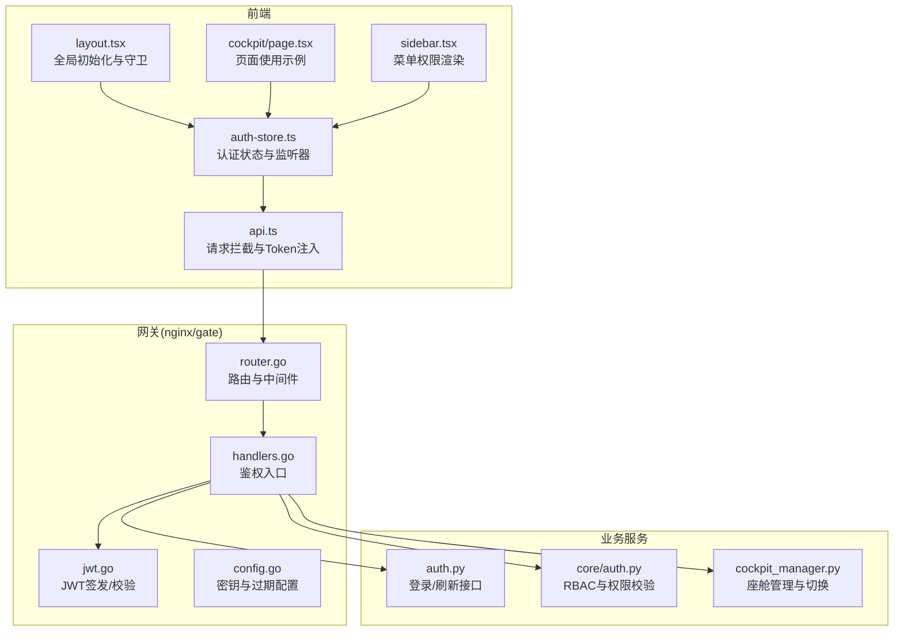
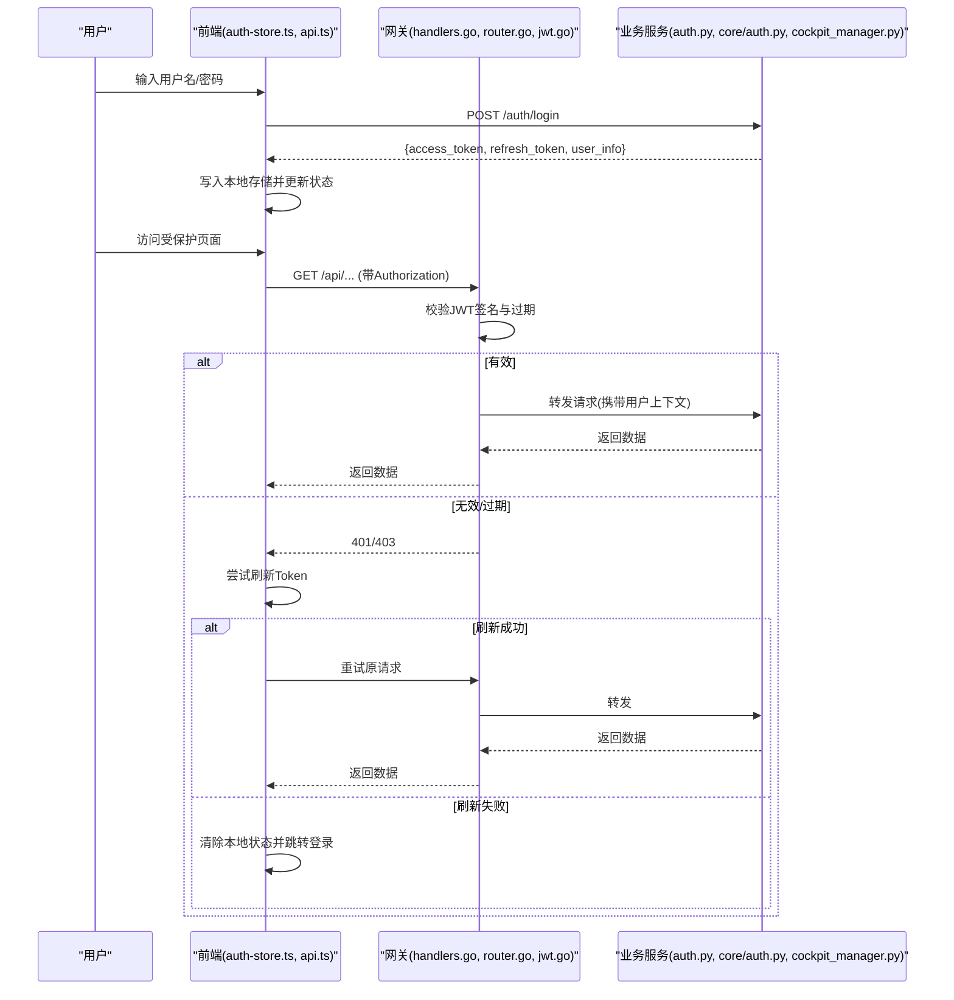
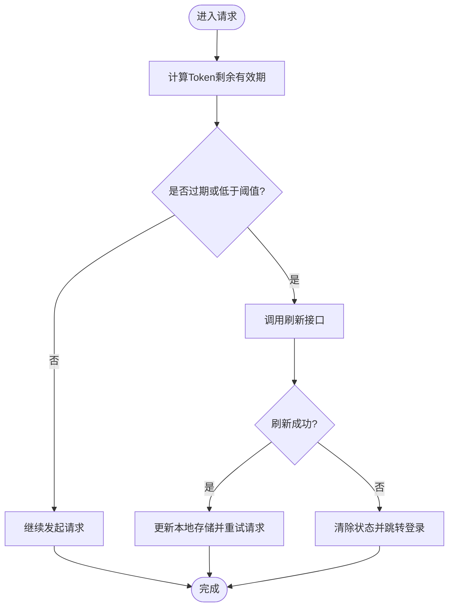
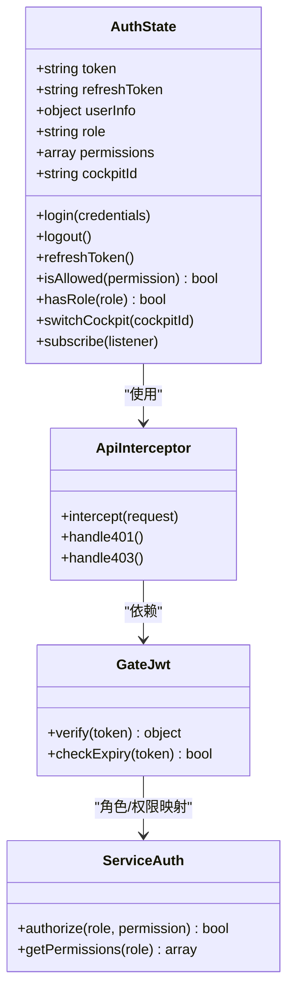
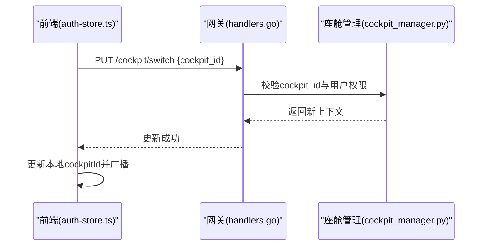
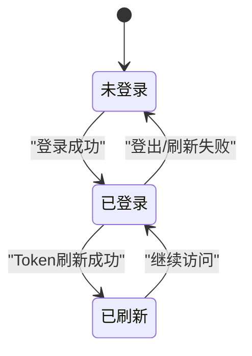
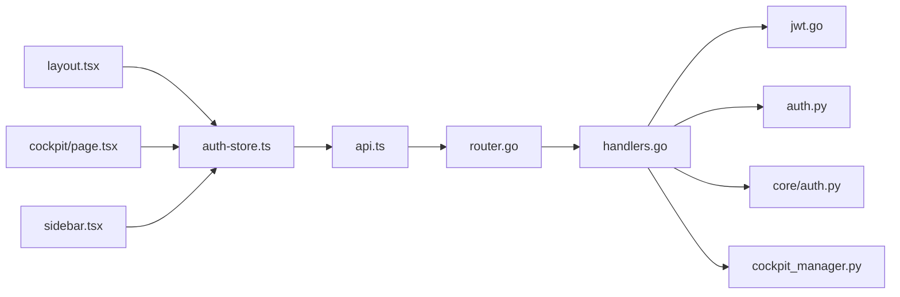

# 认证状态管理

<cite>
**本文引用的文件**   
- [auth-store.ts](file://frontend_design/src/stores/auth-store.ts)
- [api.ts](file://frontend_design/src/lib/api.ts)
- [layout.tsx](file://frontend_design/src/app/layout.tsx)
- [page.tsx](file://frontend_design/src/app/cockpit/page.tsx)
- [sidebar.tsx](file://frontend_design/src/components/layout/sidebar.tsx)
- [jwt.go](file://backend_design/nexus_gate/internal/auth/jwt.go)
- [handlers.go](file://backend_design/nexus_gate/internal/handlers/handlers.go)
- [router.go](file://backend_design/nexus_gate/internal/router/router.go)
- [config.go](file://backend_design/nexus_gate/internal/config/config.go)
- [auth.py](file://backend_design/nexus/api/routes/auth.py)
- [core_auth.py](file://backend_design/nexus/core/auth.py)
- [cockpit_manager.py](file://backend_design/nexus/core/cockpit_manager.py)
</cite>

## 目录
1. [简介](#简介)
2. [项目结构](#项目结构)
3. [核心组件](#核心组件)
4. [架构总览](#架构总览)
5. [详细组件分析](#详细组件分析)
6. [依赖关系分析](#依赖关系分析)
7. [性能考虑](#性能考虑)
8. [故障排查指南](#故障排查指南)
9. [结论](#结论)
10. [附录](#附录)

## 简介
本文件聚焦于 NexusCockpit 前端的认证与权限状态管理，围绕以下目标展开：
- JWT Token 的解析与验证机制（结构、过期检查、本地存储策略）
- RBAC 四级角色体系（super_admin、cockpit_admin、cockpit_user、cockpit_viewer）及权限检查函数实现逻辑
- 座舱切换功能（cockpit_id 管理、多座舱支持、状态同步）
- 认证状态生命周期（登录、登出、Token 自动刷新、监听器模式）
- 使用示例（useAuth hook、权限检查、座舱切换）
- 安全最佳实践与常见问题解决方案

## 项目结构
前端认证相关代码主要位于 frontend_design 目录：
- 状态存储：stores/auth-store.ts
- API 封装：lib/api.ts
- 应用布局与全局初始化：app/layout.tsx
- 页面级使用示例：app/cockpit/page.tsx
- 侧边栏与导航权限控制：components/layout/sidebar.tsx

后端网关负责 JWT 签发与校验：
- JWT 实现：nexus_gate/internal/auth/jwt.go
- 路由与中间件：nexus_gate/internal/router/router.go
- 处理器与鉴权入口：nexus_gate/internal/handlers/handlers.go
- 配置项：nexus_gate/internal/config/config.go

后端业务服务提供认证与座舱能力：
- 认证路由：nexus/api/routes/auth.py
- 核心鉴权工具：nexus/core/auth.py
- 座舱管理器：nexus/core/cockpit_manager.py

图示来源
- [auth-store.ts](file://frontend_design/src/stores/auth-store.ts)
- [api.ts](file://frontend_design/src/lib/api.ts)
- [layout.tsx](file://frontend_design/src/app/layout.tsx)
- [page.tsx](file://frontend_design/src/app/cockpit/page.tsx)
- [sidebar.tsx](file://frontend_design/src/components/layout/sidebar.tsx)
- [router.go](file://backend_design/nexus_gate/internal/router/router.go)
- [handlers.go](file://backend_design/nexus_gate/internal/handlers/handlers.go)
- [jwt.go](file://backend_design/nexus_gate/internal/auth/jwt.go)
- [config.go](file://backend_design/nexus_gate/internal/config/config.go)
- [auth.py](file://backend_design/nexus/api/routes/auth.py)
- [core_auth.py](file://backend_design/nexus/core/auth.py)
- [cockpit_manager.py](file://backend_design/nexus/core/cockpit_manager.py)

章节来源
- [auth-store.ts](file://frontend_design/src/stores/auth-store.ts)
- [api.ts](file://frontend_design/src/lib/api.ts)
- [layout.tsx](file://frontend_design/src/app/layout.tsx)
- [page.tsx](file://frontend_design/src/app/cockpit/page.tsx)
- [sidebar.tsx](file://frontend_design/src/components/layout/sidebar.tsx)
- [jwt.go](file://backend_design/nexus_gate/internal/auth/jwt.go)
- [handlers.go](file://backend_design/nexus_gate/internal/handlers/handlers.go)
- [router.go](file://backend_design/nexus_gate/internal/router/router.go)
- [config.go](file://backend_design/nexus_gate/internal/config/config.go)
- [auth.py](file://backend_design/nexus/api/routes/auth.py)
- [core_auth.py](file://backend_design/nexus/core/auth.py)
- [cockpit_manager.py](file://backend_design/nexus/core/cockpit_manager.py)

## 核心组件
- 认证状态存储（auth-store.ts）
  - 职责：维护用户会话、角色、权限、当前座舱ID；提供登录、登出、刷新、权限检查、座舱切换等API；基于监听器模式通知订阅者。
  - 关键点：本地持久化策略（如 localStorage/sessionStorage）、Token 过期检测与自动刷新、事件总线式状态变更广播。
- API 拦截器（api.ts）
  - 职责：在请求头注入 Authorization；处理 401/403 响应；触发刷新或跳转登录页。
- 全局初始化与守卫（layout.tsx）
  - 职责：应用启动时恢复会话、执行必要校验；对受保护路由进行前置鉴权。
- 页面与组件使用示例（cockpit/page.tsx、sidebar.tsx）
  - 职责：展示 useAuth hook 的使用方式、权限判断与菜单渲染、座舱切换交互。

章节来源
- [auth-store.ts](file://frontend_design/src/stores/auth-store.ts)
- [api.ts](file://frontend_design/src/lib/api.ts)
- [layout.tsx](file://frontend_design/src/app/layout.tsx)
- [page.tsx](file://frontend_design/src/app/cockpit/page.tsx)
- [sidebar.tsx](file://frontend_design/src/components/layout/sidebar.tsx)

## 架构总览
整体认证流程如下：
- 登录：前端调用后端登录接口，获取 JWT；将 Token 与用户信息写入本地存储并更新状态。
- 访问资源：前端通过 API 拦截器携带 Token；网关校验签名与过期；若有效则转发至业务服务。
- 权限控制：网关或服务层根据角色与权限决定允许/拒绝。
- 刷新：当 Token 即将过期或已过期，前端尝试刷新；失败则强制登出。
- 座舱切换：前端更新 cockpit_id 并同步到后端上下文，后续请求按新座舱隔离数据。

图示来源
- [auth-store.ts](file://frontend_design/src/stores/auth-store.ts)
- [api.ts](file://frontend_design/src/lib/api.ts)
- [handlers.go](file://backend_design/nexus_gate/internal/handlers/handlers.go)
- [router.go](file://backend_design/nexus_gate/internal/router/router.go)
- [jwt.go](file://backend_design/nexus_gate/internal/auth/jwt.go)
- [auth.py](file://backend_design/nexus/api/routes/auth.py)
- [core_auth.py](file://backend_design/nexus/core/auth.py)

## 详细组件分析

### JWT Token 解析与验证
- 结构定义
  - 典型字段包括：子标识（sub）、签发时间（iat）、过期时间（exp）、角色（role）、权限集合（permissions）、租户/座舱标识（tenant/cockpit_id）等。
  - 建议采用标准声明与自定义声明结合的方式，便于网关与服务端统一解析。
- 过期时间检查
  - 前端在每次请求前计算剩余有效期；当小于阈值（如 5 分钟）时主动刷新。
  - 网关在服务端校验 exp；若过期直接返回 401。
- 本地存储策略
  - access_token 与 refresh_token 分别存储；建议使用更安全的位置（如 httpOnly Cookie 或内存+可选持久化）。
  - 登出时需同时清理两类 Token 与用户信息。
- 刷新流程
  - 使用 refresh_token 调用刷新接口；成功后更新本地存储并重试原请求。
  - 刷新失败则清空状态并跳转登录。

图示来源
- [api.ts](file://frontend_design/src/lib/api.ts)
- [auth-store.ts](file://frontend_design/src/stores/auth-store.ts)
- [jwt.go](file://backend_design/nexus_gate/internal/auth/jwt.go)
- [auth.py](file://backend_design/nexus/api/routes/auth.py)

章节来源
- [jwt.go](file://backend_design/nexus_gate/internal/auth/jwt.go)
- [handlers.go](file://backend_design/nexus_gate/internal/handlers/handlers.go)
- [config.go](file://backend_design/nexus_gate/internal/config/config.go)
- [api.ts](file://frontend_design/src/lib/api.ts)
- [auth-store.ts](file://frontend_design/src/stores/auth-store.ts)
- [auth.py](file://backend_design/nexus/api/routes/auth.py)

### RBAC 权限控制系统
- 四级角色体系
  - super_admin：超级管理员，拥有系统全部权限。
  - cockpit_admin：座舱管理员，可管理座舱配置与用户。
  - cockpit_user：普通用户，具备操作型权限。
  - cockpit_viewer：只读用户，仅查看。
- 权限层级设计
  - 角色包含一组权限点（如 cockpit:read、cockpit:write、cockpit:admin、system:manage）。
  - 权限检查函数依据角色与所需权限点进行判定。
- 实现逻辑
  - 从 JWT 中解析 role 与 permissions。
  - 提供 isAllowed(permission) 与 hasRole(role) 等辅助函数。
  - 在路由守卫与 UI 渲染处调用这些函数进行控制。

图示来源
- [auth-store.ts](file://frontend_design/src/stores/auth-store.ts)
- [api.ts](file://frontend_design/src/lib/api.ts)
- [jwt.go](file://backend_design/nexus_gate/internal/auth/jwt.go)
- [core_auth.py](file://backend_design/nexus/core/auth.py)

章节来源
- [auth-store.ts](file://frontend_design/src/stores/auth-store.ts)
- [api.ts](file://frontend_design/src/lib/api.ts)
- [core_auth.py](file://backend_design/nexus/core/auth.py)

### 座舱切换功能
- cockpit_id 管理
  - 每个用户可关联多个座舱；当前活跃座舱由 cockpitId 表示。
  - 切换后需更新本地状态并在后续请求中携带该标识。
- 多座舱支持
  - 后端通过上下文注入 cockpit_id，用于数据隔离与权限校验。
- 状态同步机制
  - 前端在切换时调用后端接口确认有效性；成功后更新本地存储并广播状态变更。
  - 监听器模式确保各组件即时响应（如侧边栏菜单、页面数据加载）。

图示来源
- [auth-store.ts](file://frontend_design/src/stores/auth-store.ts)
- [handlers.go](file://backend_design/nexus_gate/internal/handlers/handlers.go)
- [cockpit_manager.py](file://backend_design/nexus/core/cockpit_manager.py)

章节来源
- [auth-store.ts](file://frontend_design/src/stores/auth-store.ts)
- [handlers.go](file://backend_design/nexus_gate/internal/handlers/handlers.go)
- [cockpit_manager.py](file://backend_design/nexus/core/cockpit_manager.py)

### 认证状态生命周期管理
- 登录流程
  - 提交凭证 -> 获取 Token -> 写入本地存储 -> 更新状态 -> 导航到首页或目标页。
- 登出处理
  - 调用后端登出接口（可选）-> 清除本地存储 -> 重置状态 -> 跳转登录页。
- Token 自动刷新
  - 基于剩余有效期阈值触发刷新；刷新失败则强制登出。
- 监听器模式
  - 提供 subscribe/unsubscribe 方法；状态变化时通知所有订阅者（如路由守卫、UI 组件）。

图示来源
- [auth-store.ts](file://frontend_design/src/stores/auth-store.ts)
- [api.ts](file://frontend_design/src/lib/api.ts)
- [layout.tsx](file://frontend_design/src/app/layout.tsx)

章节来源
- [auth-store.ts](file://frontend_design/src/stores/auth-store.ts)
- [api.ts](file://frontend_design/src/lib/api.ts)
- [layout.tsx](file://frontend_design/src/app/layout.tsx)

### 使用示例（路径引用）
- 使用 useAuth hook
  - 参考：[auth-store.ts](file://frontend_design/src/stores/auth-store.ts)
- 权限检查函数
  - 参考：[auth-store.ts](file://frontend_design/src/stores/auth-store.ts)、[core_auth.py](file://backend_design/nexus/core/auth.py)
- 座舱切换功能
  - 参考：[auth-store.ts](file://frontend_design/src/stores/auth-store.ts)、[cockpit_manager.py](file://backend_design/nexus/core/cockpit_manager.py)
- 页面集成示例
  - 参考：[page.tsx](file://frontend_design/src/app/cockpit/page.tsx)、[sidebar.tsx](file://frontend_design/src/components/layout/sidebar.tsx)

## 依赖关系分析
- 前端内部依赖
  - auth-store.ts 被 layout.tsx、cockpit/page.tsx、sidebar.tsx 使用。
  - api.ts 为全局请求拦截器，被所有需要认证的页面与组件间接使用。
- 前后端交互
  - 前端通过网关路由与处理器进行鉴权；网关依赖 jwt.go 进行签名与过期校验。
  - 业务服务提供认证与座舱管理能力，供网关转发。

图示来源
- [auth-store.ts](file://frontend_design/src/stores/auth-store.ts)
- [api.ts](file://frontend_design/src/lib/api.ts)
- [layout.tsx](file://frontend_design/src/app/layout.tsx)
- [page.tsx](file://frontend_design/src/app/cockpit/page.tsx)
- [sidebar.tsx](file://frontend_design/src/components/layout/sidebar.tsx)
- [router.go](file://backend_design/nexus_gate/internal/router/router.go)
- [handlers.go](file://backend_design/nexus_gate/internal/handlers/handlers.go)
- [jwt.go](file://backend_design/nexus_gate/internal/auth/jwt.go)
- [auth.py](file://backend_design/nexus/api/routes/auth.py)
- [core_auth.py](file://backend_design/nexus/core/auth.py)
- [cockpit_manager.py](file://backend_design/nexus/core/cockpit_manager.py)

章节来源
- [auth-store.ts](file://frontend_design/src/stores/auth-store.ts)
- [api.ts](file://frontend_design/src/lib/api.ts)
- [layout.tsx](file://frontend_design/src/app/layout.tsx)
- [page.tsx](file://frontend_design/src/app/cockpit/page.tsx)
- [sidebar.tsx](file://frontend_design/src/components/layout/sidebar.tsx)
- [router.go](file://backend_design/nexus_gate/internal/router/router.go)
- [handlers.go](file://backend_design/nexus_gate/internal/handlers/handlers.go)
- [jwt.go](file://backend_design/nexus_gate/internal/auth/jwt.go)
- [auth.py](file://backend_design/nexus/api/routes/auth.py)
- [core_auth.py](file://backend_design/nexus/core/auth.py)
- [cockpit_manager.py](file://backend_design/nexus/core/cockpit_manager.py)

## 性能考虑
- 减少不必要的重渲染：监听器应精准订阅状态变化，避免全量更新。
- 批量刷新：在高并发场景下合并刷新请求，避免重复刷新。
- 缓存策略：对非敏感元数据（如角色映射）做短期缓存，降低网络开销。
- 超时与重试：合理设置请求超时与重试次数，提升用户体验。

## 故障排查指南
- 常见错误
  - 401 未授权：检查 Token 是否存在、是否过期、刷新流程是否正确。
  - 403 禁止访问：检查角色与权限映射、cockpit_id 是否有效。
  - 跨域问题：确认网关 CORS 配置与请求头。
- 调试步骤
  - 查看浏览器开发者工具的 Network 面板，确认请求头与响应码。
  - 检查本地存储中的 Token 与用户信息是否一致。
  - 在后端日志中检索鉴权失败的详细信息。

章节来源
- [api.ts](file://frontend_design/src/lib/api.ts)
- [auth-store.ts](file://frontend_design/src/stores/auth-store.ts)
- [handlers.go](file://backend_design/nexus_gate/internal/handlers/handlers.go)

## 结论
NexusCockpit 的认证状态管理以 JWT 为核心，结合前端状态存储与监听器模式，实现了完整的登录、刷新、权限控制与座舱切换能力。通过清晰的职责划分与模块化设计，系统在安全性与可维护性方面具备良好的基础。建议持续优化刷新策略与错误处理，以提升用户体验与稳定性。

## 附录
- 安全最佳实践
  - 使用 HTTPS 传输 Token。
  - 尽量将 Token 存储在 httpOnly Cookie 中，避免 XSS 窃取。
  - 定期轮换密钥与缩短 Token 有效期。
  - 最小权限原则：按需分配角色与权限点。
- 常见问题解决方案
  - 刷新失败：检查 refresh_token 是否有效、刷新接口是否可达。
  - 权限不生效：核对 JWT 中 role 与 permissions 是否与后端映射一致。
  - 座舱切换异常：确认 cockpit_id 存在且用户具备访问权限。