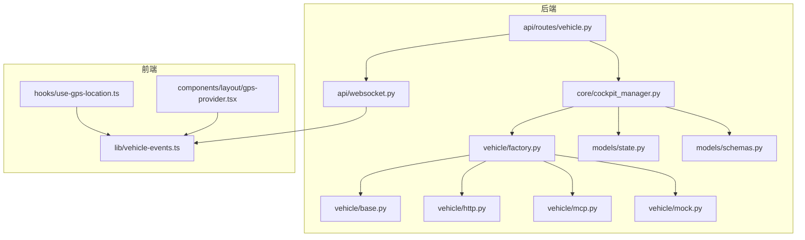
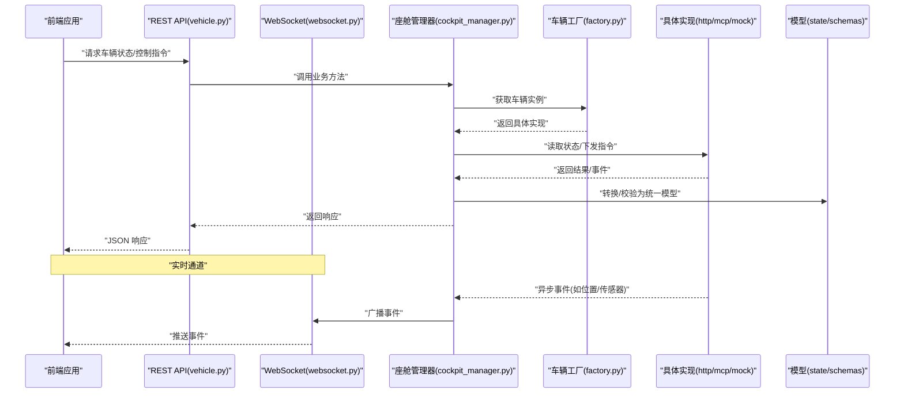
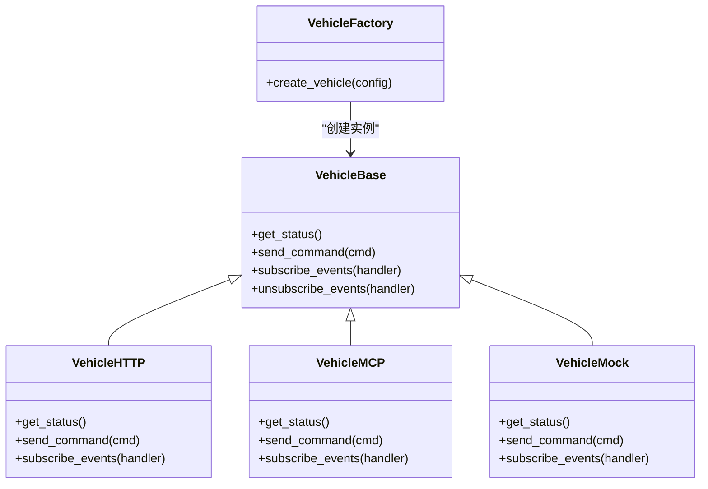
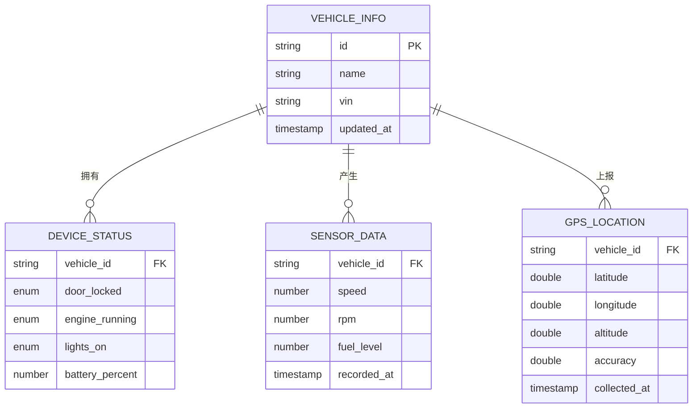
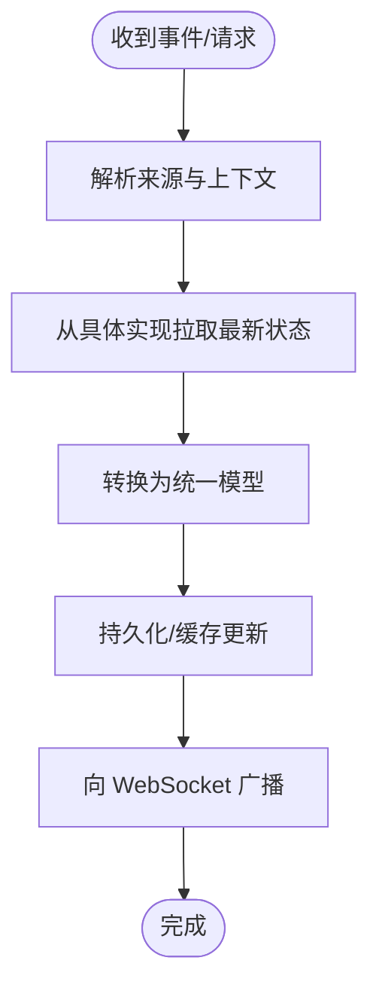
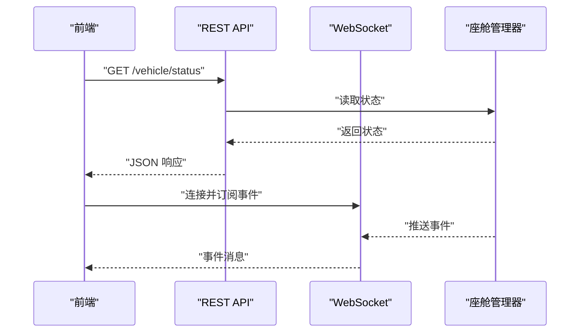
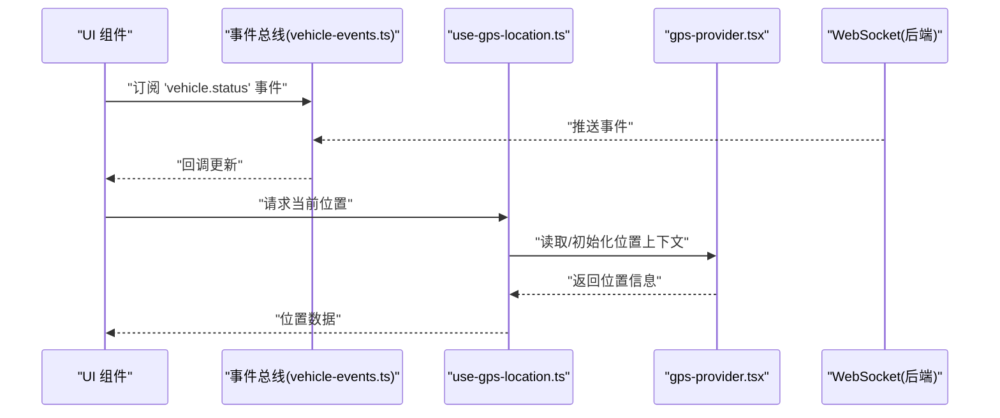
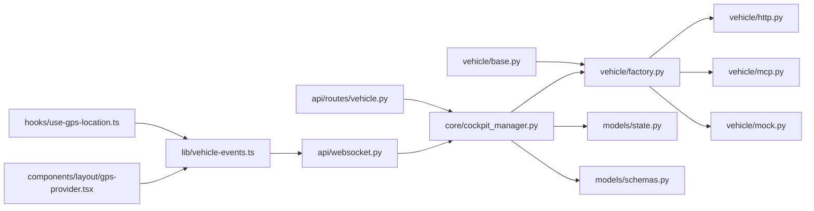

# 车辆状态管理

<cite>
**本文引用的文件**   
- [backend_design/nexus/vehicle/base.py](file://backend_design/nexus/vehicle/base.py)
- [backend_design/nexus/vehicle/factory.py](file://backend_design/nexus/vehicle/factory.py)
- [backend_design/nexus/vehicle/http.py](file://backend_design/nexus/vehicle/http.py)
- [backend_design/nexus/vehicle/mcp.py](file://backend_design/nexus/vehicle/mcp.py)
- [backend_design/nexus/vehicle/mock.py](file://backend_design/nexus/vehicle/mock.py)
- [backend_design/nexus/models/state.py](file://backend_design/nexus/models/state.py)
- [backend_design/nexus/models/schemas.py](file://backend_design/nexus/models/schemas.py)
- [backend_design/nexus/core/cockpit_manager.py](file://backend_design/nexus/core/cockpit_manager.py)
- [backend_design/nexus/api/routes/vehicle.py](file://backend_design/nexus/api/routes/vehicle.py)
- [backend_design/nexus/api/websocket.py](file://backend_design/nexus/api/websocket.py)
- [frontend_design/src/lib/vehicle-events.ts](file://frontend_design/src/lib/vehicle-events.ts)
- [frontend_design/src/hooks/use-gps-location.ts](file://frontend_design/src/hooks/use-gps-location.ts)
- [frontend_design/src/components/layout/gps-provider.tsx](file://frontend_design/src/components/layout/gps-provider.tsx)
</cite>

## 目录
1. [简介](#简介)
2. [项目结构](#项目结构)
3. [核心组件](#核心组件)
4. [架构总览](#架构总览)
5. [详细组件分析](#详细组件分析)
6. [依赖关系分析](#依赖关系分析)
7. [性能考虑](#性能考虑)
8. [故障排查指南](#故障排查指南)
9. [结论](#结论)
10. [附录：使用示例与最佳实践](#附录使用示例与最佳实践)

## 简介
本技术文档聚焦 NexusCockpit 的车辆状态管理能力，覆盖以下关键主题：
- 车辆状态数据结构设计（基本信息、设备状态、传感器数据、GPS 位置）
- 事件系统（订阅/发布、实时推送、过滤与处理）
- GPS 定位状态管理（获取、轨迹记录、地理围栏、缓存策略）
- 车辆控制状态（指令发送、执行反馈、错误处理、回滚机制）
- 状态同步策略、离线数据处理与性能优化
- 前端与后端的协作方式及实际使用示例路径

## 项目结构
围绕“车辆状态管理”的后端与前端关键模块分布如下：
- 后端
  - 车辆抽象与实现：base、factory、http、mcp、mock
  - 模型与模式定义：models/state.py、models/schemas.py
  - 座舱管理器：core/cockpit_manager.py
  - API 路由与 WebSocket：api/routes/vehicle.py、api/websocket.py
- 前端
  - 事件总线与类型：lib/vehicle-events.ts
  - GPS Hook 与 Provider：hooks/use-gps-location.ts、components/layout/gps-provider.tsx

图表来源
- [backend_design/nexus/vehicle/base.py](file://backend_design/nexus/vehicle/base.py)
- [backend_design/nexus/vehicle/factory.py](file://backend_design/nexus/vehicle/factory.py)
- [backend_design/nexus/vehicle/http.py](file://backend_design/nexus/vehicle/http.py)
- [backend_design/nexus/vehicle/mcp.py](file://backend_design/nexus/vehicle/mcp.py)
- [backend_design/nexus/vehicle/mock.py](file://backend_design/nexus/vehicle/mock.py)
- [backend_design/nexus/models/state.py](file://backend_design/nexus/models/state.py)
- [backend_design/nexus/models/schemas.py](file://backend_design/nexus/models/schemas.py)
- [backend_design/nexus/core/cockpit_manager.py](file://backend_design/nexus/core/cockpit_manager.py)
- [backend_design/nexus/api/routes/vehicle.py](file://backend_design/nexus/api/routes/vehicle.py)
- [backend_design/nexus/api/websocket.py](file://backend_design/nexus/api/websocket.py)
- [frontend_design/src/lib/vehicle-events.ts](file://frontend_design/src/lib/vehicle-events.ts)
- [frontend_design/src/hooks/use-gps-location.ts](file://frontend_design/src/hooks/use-gps-location.ts)
- [frontend_design/src/components/layout/gps-provider.tsx](file://frontend_design/src/components/layout/gps-provider.tsx)

章节来源
- [backend_design/nexus/vehicle/base.py](file://backend_design/nexus/vehicle/base.py)
- [backend_design/nexus/vehicle/factory.py](file://backend_design/nexus/vehicle/factory.py)
- [backend_design/nexus/vehicle/http.py](file://backend_design/nexus/vehicle/http.py)
- [backend_design/nexus/vehicle/mcp.py](file://backend_design/nexus/vehicle/mcp.py)
- [backend_design/nexus/vehicle/mock.py](file://backend_design/nexus/vehicle/mock.py)
- [backend_design/nexus/models/state.py](file://backend_design/nexus/models/state.py)
- [backend_design/nexus/models/schemas.py](file://backend_design/nexus/models/schemas.py)
- [backend_design/nexus/core/cockpit_manager.py](file://backend_design/nexus/core/cockpit_manager.py)
- [backend_design/nexus/api/routes/vehicle.py](file://backend_design/nexus/api/routes/vehicle.py)
- [backend_design/nexus/api/websocket.py](file://backend_design/nexus/api/websocket.py)
- [frontend_design/src/lib/vehicle-events.ts](file://frontend_design/src/lib/vehicle-events.ts)
- [frontend_design/src/hooks/use-gps-location.ts](file://frontend_design/src/hooks/use-gps-location.ts)
- [frontend_design/src/components/layout/gps-provider.tsx](file://frontend_design/src/components/layout/gps-provider.tsx)

## 核心组件
- 车辆抽象层
  - 提供统一的车辆接口定义，屏蔽底层协议差异（HTTP/MCP/Mock），便于扩展新的通信方式。
- 工厂与实例化
  - 根据配置或运行时上下文选择具体实现（HTTP/MCP/Mock），并负责生命周期管理。
- 座舱管理器
  - 聚合多源车辆状态，维护全局状态视图，协调事件分发与持久化。
- 模型与模式
  - 定义车辆状态的数据结构与校验规则，确保前后端一致性与可演进性。
- API 与 WebSocket
  - 暴露 REST 接口用于查询与控制；通过 WebSocket 推送实时事件与状态变更。
- 前端事件与 GPS
  - 统一的事件总线封装，结合 GPS Hook 与 Provider 提供稳定的位置能力。

章节来源
- [backend_design/nexus/vehicle/base.py](file://backend_design/nexus/vehicle/base.py)
- [backend_design/nexus/vehicle/factory.py](file://backend_design/nexus/vehicle/factory.py)
- [backend_design/nexus/core/cockpit_manager.py](file://backend_design/nexus/core/cockpit_manager.py)
- [backend_design/nexus/models/state.py](file://backend_design/nexus/models/state.py)
- [backend_design/nexus/models/schemas.py](file://backend_design/nexus/models/schemas.py)
- [backend_design/nexus/api/routes/vehicle.py](file://backend_design/nexus/api/routes/vehicle.py)
- [backend_design/nexus/api/websocket.py](file://backend_design/nexus/api/websocket.py)
- [frontend_design/src/lib/vehicle-events.ts](file://frontend_design/src/lib/vehicle-events.ts)
- [frontend_design/src/hooks/use-gps-location.ts](file://frontend_design/src/hooks/use-gps-location.ts)
- [frontend_design/src/components/layout/gps-provider.tsx](file://frontend_design/src/components/layout/gps-provider.tsx)

## 架构总览
整体采用“抽象接口 + 多实现 + 工厂装配 + 事件驱动”的架构风格，后端以座舱管理器为核心编排器，前端通过事件总线与 WebSocket 保持实时一致性。

图表来源
- [backend_design/nexus/api/routes/vehicle.py](file://backend_design/nexus/api/routes/vehicle.py)
- [backend_design/nexus/api/websocket.py](file://backend_design/nexus/api/websocket.py)
- [backend_design/nexus/core/cockpit_manager.py](file://backend_design/nexus/core/cockpit_manager.py)
- [backend_design/nexus/vehicle/factory.py](file://backend_design/nexus/vehicle/factory.py)
- [backend_design/nexus/vehicle/http.py](file://backend_design/nexus/vehicle/http.py)
- [backend_design/nexus/vehicle/mcp.py](file://backend_design/nexus/vehicle/mcp.py)
- [backend_design/nexus/vehicle/mock.py](file://backend_design/nexus/vehicle/mock.py)
- [backend_design/nexus/models/state.py](file://backend_design/nexus/models/state.py)
- [backend_design/nexus/models/schemas.py](file://backend_design/nexus/models/schemas.py)

## 详细组件分析

### 车辆抽象与实现（面向对象）
- 抽象基类定义统一接口（如获取状态、下发控制、订阅事件等）。
- 工厂按环境/配置选择 HTTP/MCP/Mock 实现。
- 各实现适配不同通信协议，向上暴露一致的模型。

图表来源
- [backend_design/nexus/vehicle/base.py](file://backend_design/nexus/vehicle/base.py)
- [backend_design/nexus/vehicle/factory.py](file://backend_design/nexus/vehicle/factory.py)
- [backend_design/nexus/vehicle/http.py](file://backend_design/nexus/vehicle/http.py)
- [backend_design/nexus/vehicle/mcp.py](file://backend_design/nexus/vehicle/mcp.py)
- [backend_design/nexus/vehicle/mock.py](file://backend_design/nexus/vehicle/mock.py)

章节来源
- [backend_design/nexus/vehicle/base.py](file://backend_design/nexus/vehicle/base.py)
- [backend_design/nexus/vehicle/factory.py](file://backend_design/nexus/vehicle/factory.py)
- [backend_design/nexus/vehicle/http.py](file://backend_design/nexus/vehicle/http.py)
- [backend_design/nexus/vehicle/mcp.py](file://backend_design/nexus/vehicle/mcp.py)
- [backend_design/nexus/vehicle/mock.py](file://backend_design/nexus/vehicle/mock.py)

### 数据模型与模式（状态与校验）
- state.py：定义车辆状态的核心数据结构（基本信息、设备状态、传感器数据、GPS 位置等）。
- schemas.py：定义输入输出模式与校验规则，保证 API 契约稳定。

图表来源
- [backend_design/nexus/models/state.py](file://backend_design/nexus/models/state.py)
- [backend_design/nexus/models/schemas.py](file://backend_design/nexus/models/schemas.py)

章节来源
- [backend_design/nexus/models/state.py](file://backend_design/nexus/models/state.py)
- [backend_design/nexus/models/schemas.py](file://backend_design/nexus/models/schemas.py)

### 座舱管理器（状态聚合与事件编排）
- 职责：聚合多源状态、维护全局视图、驱动事件分发、协调持久化与缓存。
- 与工厂交互：按需创建/复用车辆实例。
- 与模型交互：将原始数据转换为统一状态对象。
- 与 WebSocket 交互：将内部事件广播给前端。

图表来源
- [backend_design/nexus/core/cockpit_manager.py](file://backend_design/nexus/core/cockpit_manager.py)
- [backend_design/nexus/api/websocket.py](file://backend_design/nexus/api/websocket.py)

章节来源
- [backend_design/nexus/core/cockpit_manager.py](file://backend_design/nexus/core/cockpit_manager.py)
- [backend_design/nexus/api/websocket.py](file://backend_design/nexus/api/websocket.py)

### API 与 WebSocket（REST 与实时通道）
- REST 接口：查询车辆状态、下发控制指令、触发特定操作。
- WebSocket：推送事件流（位置、传感器、设备状态变化等），支持客户端订阅与过滤。

图表来源
- [backend_design/nexus/api/routes/vehicle.py](file://backend_design/nexus/api/routes/vehicle.py)
- [backend_design/nexus/api/websocket.py](file://backend_design/nexus/api/websocket.py)
- [backend_design/nexus/core/cockpit_manager.py](file://backend_design/nexus/core/cockpit_manager.py)

章节来源
- [backend_design/nexus/api/routes/vehicle.py](file://backend_design/nexus/api/routes/vehicle.py)
- [backend_design/nexus/api/websocket.py](file://backend_design/nexus/api/websocket.py)

### 前端事件与 GPS（订阅、发布与位置能力）
- 事件总线：封装订阅/发布、去抖/节流、过滤与重试。
- GPS Hook：封装浏览器/平台定位能力，提供稳定接口与错误处理。
- GPS Provider：在组件树中共享位置上下文，避免重复初始化。

图表来源
- [frontend_design/src/lib/vehicle-events.ts](file://frontend_design/src/lib/vehicle-events.ts)
- [frontend_design/src/hooks/use-gps-location.ts](file://frontend_design/src/hooks/use-gps-location.ts)
- [frontend_design/src/components/layout/gps-provider.tsx](file://frontend_design/src/components/layout/gps-provider.tsx)
- [backend_design/nexus/api/websocket.py](file://backend_design/nexus/api/websocket.py)

章节来源
- [frontend_design/src/lib/vehicle-events.ts](file://frontend_design/src/lib/vehicle-events.ts)
- [frontend_design/src/hooks/use-gps-location.ts](file://frontend_design/src/hooks/use-gps-location.ts)
- [frontend_design/src/components/layout/gps-provider.tsx](file://frontend_design/src/components/layout/gps-provider.tsx)

## 依赖关系分析
- 耦合与内聚
  - 车辆抽象层高内聚，具体实现低耦合，通过工厂解耦选择逻辑。
  - 座舱管理器作为编排中心，集中处理状态聚合与事件分发。
- 外部依赖
  - HTTP/MCP 客户端、WebSocket 服务、持久化存储（由各自实现引入）。
- 潜在循环依赖
  - 通过分层与接口隔离避免循环引用。

图表来源
- [backend_design/nexus/vehicle/base.py](file://backend_design/nexus/vehicle/base.py)
- [backend_design/nexus/vehicle/factory.py](file://backend_design/nexus/vehicle/factory.py)
- [backend_design/nexus/vehicle/http.py](file://backend_design/nexus/vehicle/http.py)
- [backend_design/nexus/vehicle/mcp.py](file://backend_design/nexus/vehicle/mcp.py)
- [backend_design/nexus/vehicle/mock.py](file://backend_design/nexus/vehicle/mock.py)
- [backend_design/nexus/core/cockpit_manager.py](file://backend_design/nexus/core/cockpit_manager.py)
- [backend_design/nexus/models/state.py](file://backend_design/nexus/models/state.py)
- [backend_design/nexus/models/schemas.py](file://backend_design/nexus/models/schemas.py)
- [backend_design/nexus/api/routes/vehicle.py](file://backend_design/nexus/api/routes/vehicle.py)
- [backend_design/nexus/api/websocket.py](file://backend_design/nexus/api/websocket.py)
- [frontend_design/src/lib/vehicle-events.ts](file://frontend_design/src/lib/vehicle-events.ts)
- [frontend_design/src/hooks/use-gps-location.ts](file://frontend_design/src/hooks/use-gps-location.ts)
- [frontend_design/src/components/layout/gps-provider.tsx](file://frontend_design/src/components/layout/gps-provider.tsx)

章节来源
- [backend_design/nexus/vehicle/base.py](file://backend_design/nexus/vehicle/base.py)
- [backend_design/nexus/vehicle/factory.py](file://backend_design/nexus/vehicle/factory.py)
- [backend_design/nexus/vehicle/http.py](file://backend_design/nexus/vehicle/http.py)
- [backend_design/nexus/vehicle/mcp.py](file://backend_design/nexus/vehicle/mcp.py)
- [backend_design/nexus/vehicle/mock.py](file://backend_design/nexus/vehicle/mock.py)
- [backend_design/nexus/core/cockpit_manager.py](file://backend_design/nexus/core/cockpit_manager.py)
- [backend_design/nexus/models/state.py](file://backend_design/nexus/models/state.py)
- [backend_design/nexus/models/schemas.py](file://backend_design/nexus/models/schemas.py)
- [backend_design/nexus/api/routes/vehicle.py](file://backend_design/nexus/api/routes/vehicle.py)
- [backend_design/nexus/api/websocket.py](file://backend_design/nexus/api/websocket.py)
- [frontend_design/src/lib/vehicle-events.ts](file://frontend_design/src/lib/vehicle-events.ts)
- [frontend_design/src/hooks/use-gps-location.ts](file://frontend_design/src/hooks/use-gps-location.ts)
- [frontend_design/src/components/layout/gps-provider.tsx](file://frontend_design/src/components/layout/gps-provider.tsx)

## 性能考虑
- 事件合并与去抖：对高频传感器/GPS 数据进行合并与节流，降低网络与渲染压力。
- 增量更新：仅推送变更字段，减少 payload 大小。
- 本地缓存：热点状态（如车辆基本信息、最近位置）进行短期缓存，提高读取性能。
- 批量写入：轨迹点批量落盘，减少 I/O 次数。
- 连接池与超时：HTTP/MCP 客户端使用连接池与合理超时，避免资源耗尽。
- 背压与限流：WebSocket 广播侧实施限流与队列长度上限，防止雪崩。

[本节为通用指导，不直接分析具体文件]

## 故障排查指南
- 常见问题定位
  - 事件未到达前端：检查 WebSocket 连接状态、订阅过滤器、服务端广播逻辑。
  - 控制指令无反馈：确认指令幂等性、执行结果回传、错误码映射。
  - GPS 异常：检查权限、定位源可用性、Provider 初始化顺序。
- 日志与观测
  - 在关键路径添加结构化日志（事件 ID、时间戳、来源、耗时）。
  - 监控指标：连接数、事件吞吐、失败率、延迟分位。
- 恢复策略
  - 断线重连与指数退避。
  - 指令重试与补偿（结合幂等键）。
  - 状态快照与回滚（见附录）。

章节来源
- [backend_design/nexus/api/websocket.py](file://backend_design/nexus/api/websocket.py)
- [backend_design/nexus/core/cockpit_manager.py](file://backend_design/nexus/core/cockpit_manager.py)
- [frontend_design/src/lib/vehicle-events.ts](file://frontend_design/src/lib/vehicle-events.ts)
- [frontend_design/src/hooks/use-gps-location.ts](file://frontend_design/src/hooks/use-gps-location.ts)
- [frontend_design/src/components/layout/gps-provider.tsx](file://frontend_design/src/components/layout/gps-provider.tsx)

## 结论
NexusCockpit 通过清晰的抽象层、工厂装配与事件驱动架构，实现了可扩展、高性能且易维护的车辆状态管理。前后端基于统一模型与事件总线协同工作，配合合理的缓存、批处理与限流策略，满足实时性与稳定性要求。

[本节为总结，不直接分析具体文件]

## 附录：使用示例与最佳实践
以下为常见操作的“代码片段路径”，请根据路径查看对应实现细节：
- 订阅车辆事件
  - 前端事件总线订阅与过滤：[frontend_design/src/lib/vehicle-events.ts](file://frontend_design/src/lib/vehicle-events.ts)
  - 后端 WebSocket 推送入口：[backend_design/nexus/api/websocket.py](file://backend_design/nexus/api/websocket.py)
- 获取 GPS 位置
  - 前端 Hook 与 Provider：[frontend_design/src/hooks/use-gps-location.ts](file://frontend_design/src/hooks/use-gps-location.ts)、[frontend_design/src/components/layout/gps-provider.tsx](file://frontend_design/src/components/layout/gps-provider.tsx)
  - 后端状态聚合与模型：[backend_design/nexus/core/cockpit_manager.py](file://backend_design/nexus/core/cockpit_manager.py)、[backend_design/nexus/models/state.py](file://backend_design/nexus/models/state.py)
- 发送控制指令
  - REST 接口与控制器：[backend_design/nexus/api/routes/vehicle.py](file://backend_design/nexus/api/routes/vehicle.py)
  - 车辆实现（HTTP/MCP/Mock）：[backend_design/nexus/vehicle/http.py](file://backend_design/nexus/vehicle/http.py)、[backend_design/nexus/vehicle/mcp.py](file://backend_design/nexus/vehicle/mcp.py)、[backend_design/nexus/vehicle/mock.py](file://backend_design/nexus/vehicle/mock.py)
- 处理车辆状态变化
  - 事件分发与广播：[backend_design/nexus/core/cockpit_manager.py](file://backend_design/nexus/core/cockpit_manager.py)、[backend_design/nexus/api/websocket.py](file://backend_design/nexus/api/websocket.py)
  - 前端事件消费与 UI 更新：[frontend_design/src/lib/vehicle-events.ts](file://frontend_design/src/lib/vehicle-events.ts)

最佳实践建议
- 使用幂等键与唯一事件 ID，便于追踪与重试。
- 对敏感控制指令增加鉴权与审计日志。
- 对高频事件设置最小推送间隔与阈值触发。
- 在 Provider/Hook 中统一错误边界与降级展示。

章节来源
- [backend_design/nexus/api/routes/vehicle.py](file://backend_design/nexus/api/routes/vehicle.py)
- [backend_design/nexus/api/websocket.py](file://backend_design/nexus/api/websocket.py)
- [backend_design/nexus/core/cockpit_manager.py](file://backend_design/nexus/core/cockpit_manager.py)
- [backend_design/nexus/vehicle/http.py](file://backend_design/nexus/vehicle/http.py)
- [backend_design/nexus/vehicle/mcp.py](file://backend_design/nexus/vehicle/mcp.py)
- [backend_design/nexus/vehicle/mock.py](file://backend_design/nexus/vehicle/mock.py)
- [frontend_design/src/lib/vehicle-events.ts](file://frontend_design/src/lib/vehicle-events.ts)
- [frontend_design/src/hooks/use-gps-location.ts](file://frontend_design/src/hooks/use-gps-location.ts)
- [frontend_design/src/components/layout/gps-provider.tsx](file://frontend_design/src/components/layout/gps-provider.tsx)