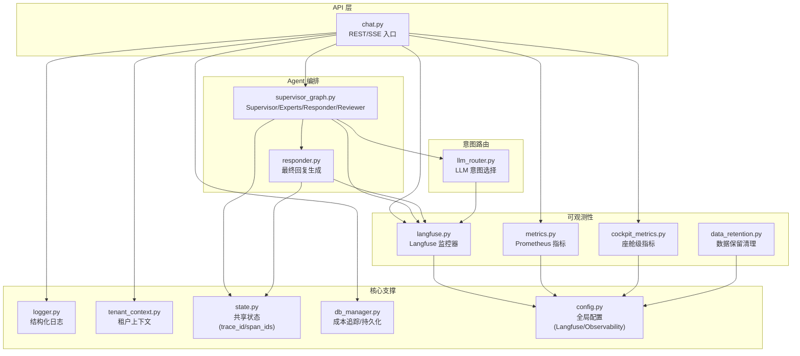
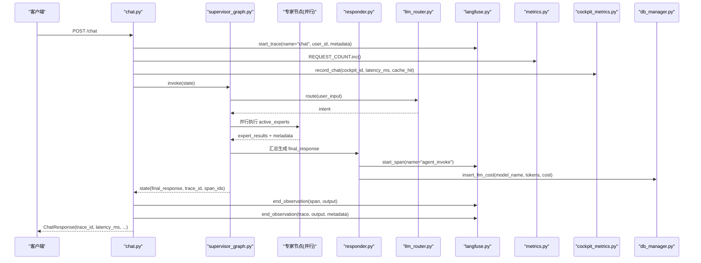
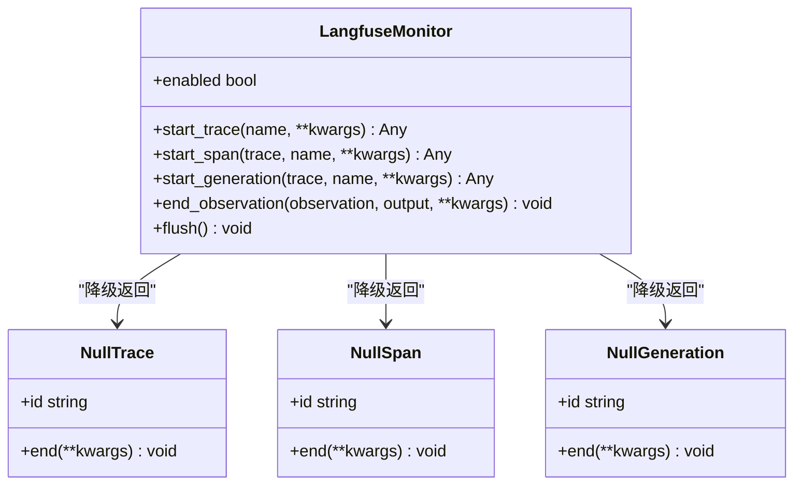
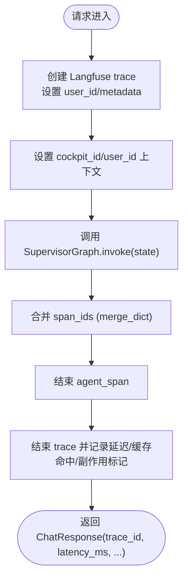
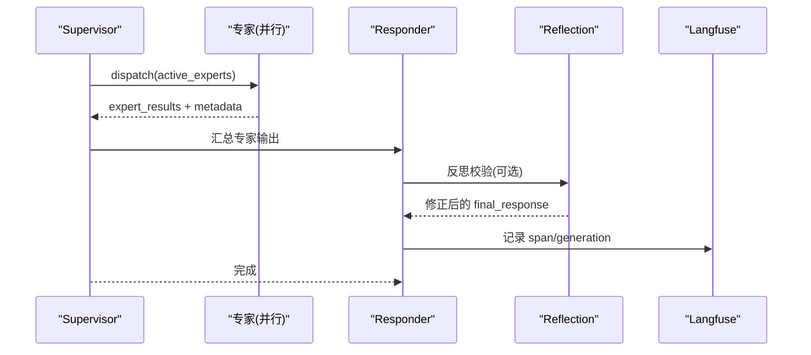
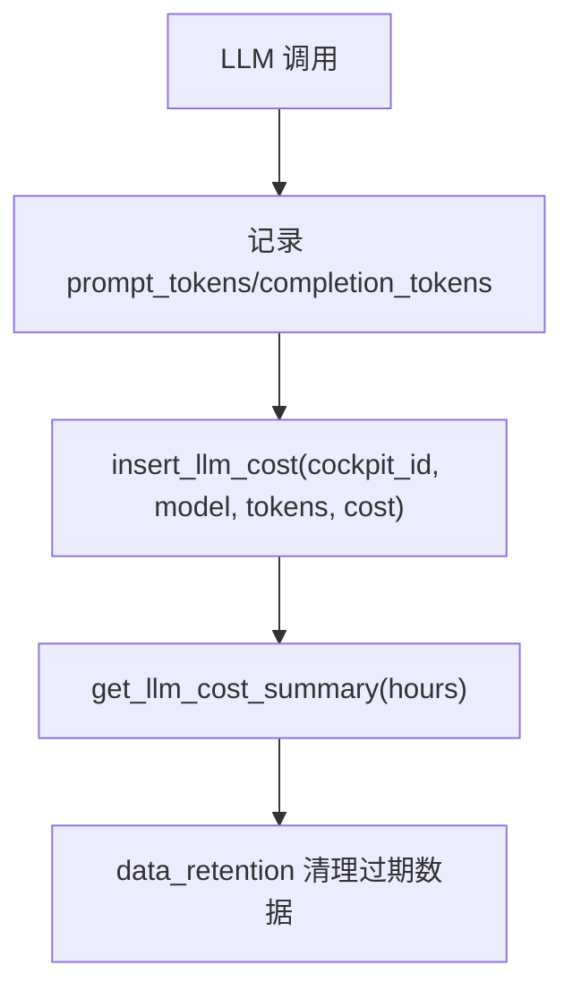
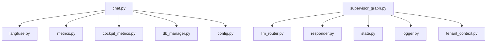

# 分布式追踪

<cite>
**本文引用的文件**   
- [langfuse.py](file://backend_design/nexus/observability/langfuse.py)
- [metrics.py](file://backend_design/nexus/observability/metrics.py)
- [cockpit_metrics.py](file://backend_design/nexus/observability/cockpit_metrics.py)
- [data_retention.py](file://backend_design/nexus/observability/data_retention.py)
- [logger.py](file://backend_design/nexus/core/logger.py)
- [tenant_context.py](file://backend_design/nexus/core/tenant_context.py)
- [state.py](file://backend_design/nexus/models/state.py)
- [llm_router.py](file://backend_design/nexus/intent/llm_router.py)
- [supervisor_graph.py](file://backend_design/nexus/agent/supervisor_graph.py)
- [responder.py](file://backend_design/nexus/agent/responder.py)
- [chat.py](file://backend_design/nexus/api/routes/chat.py)
- [config.py](file://backend_design/nexus/config.py)
- [db_manager.py](file://backend_design/nexus/core/db_manager.py)
- [prometheus.yml](file://config/prometheus/prometheus.yml)
- [L7-observability.md](file://docs/architecture/L7-observability.md)
</cite>

## 目录
1. [简介](#简介)
2. [项目结构](#项目结构)
3. [核心组件](#核心组件)
4. [架构总览](#架构总览)
5. [详细组件分析](#详细组件分析)
6. [依赖关系分析](#依赖关系分析)
7. [性能与慢查询定位](#性能与慢查询定位)
8. [错误链路追踪与排障](#错误链路追踪与排障)
9. [数据导出、查询优化与存储策略](#数据导出查询优化与存储策略)
10. [调试场景与案例](#调试场景与案例)
11. [结论](#结论)

## 简介
本技术文档围绕 NexusCockpit 的分布式追踪体系，系统性阐述 Langfuse LLM 追踪集成方案、请求级追踪机制（Trace ID 生成、Span 管理、上下文传递）、多智能体协作场景下的追踪策略（Supervisor 调度、专家并行执行、结果聚合），并给出性能瓶颈定位、慢查询分析、错误链路追踪方法，以及追踪数据的导出、查询优化与存储策略。同时提供实际调试场景的追踪案例分析和问题排查指南，帮助读者快速定位问题并优化系统可观测性。

## 项目结构
NexusCockpit 的可观测性与追踪能力主要分布在 observability、core、models、agent、intent、api 等模块中：
- observability：Langfuse 追踪封装、Prometheus 指标采集、座舱级指标、数据保留策略
- core：结构化日志、数据库访问、租户上下文
- models：工作流共享状态（含 trace_id、span_ids）
- agent：Supervisor 编排与 Responder 响应生成
- intent：LLM 意图路由
- api：REST/SSE 接口，集成追踪与指标记录
- config：全局配置（包含 Langfuse、Observability 等）
- docs：架构文档（L7 可观测层）

图表来源
- [chat.py:146-293](file://backend_design/nexus/api/routes/chat.py#L146-L293)
- [supervisor_graph.py:127-173](file://backend_design/nexus/agent/supervisor_graph.py#L127-L173)
- [responder.py:66-109](file://backend_design/nexus/agent/responder.py#L66-L109)
- [llm_router.py:43-64](file://backend_design/nexus/intent/llm_router.py#L43-L64)
- [langfuse.py:51-127](file://backend_design/nexus/observability/langfuse.py#L51-L127)
- [metrics.py:14-113](file://backend_design/nexus/observability/metrics.py#L14-L113)
- [cockpit_metrics.py:27-189](file://backend_design/nexus/observability/cockpit_metrics.py#L27-L189)
- [data_retention.py:45-171](file://backend_design/nexus/observability/data_retention.py#L45-L171)
- [logger.py:32-105](file://backend_design/nexus/core/logger.py#L32-L105)
- [tenant_context.py:29-106](file://backend_design/nexus/core/tenant_context.py#L29-L106)
- [state.py:38-161](file://backend_design/nexus/models/state.py#L38-L161)
- [db_manager.py:358-464](file://backend_design/nexus/core/db_manager.py#L358-L464)
- [config.py:395-414](file://backend_design/nexus/config.py#L395-L414)

章节来源
- [L7-observability.md:1-55](file://docs/architecture/L7-observability.md#L1-L55)
- [chat.py:146-293](file://backend_design/nexus/api/routes/chat.py#L146-L293)
- [supervisor_graph.py:127-173](file://backend_design/nexus/agent/supervisor_graph.py#L127-L173)
- [responder.py:66-109](file://backend_design/nexus/agent/responder.py#L66-L109)
- [llm_router.py:43-64](file://backend_design/nexus/intent/llm_router.py#L43-L64)
- [langfuse.py:51-127](file://backend_design/nexus/observability/langfuse.py#L51-L127)
- [metrics.py:14-113](file://backend_design/nexus/observability/metrics.py#L14-L113)
- [cockpit_metrics.py:27-189](file://backend_design/nexus/observability/cockpit_metrics.py#L27-L189)
- [data_retention.py:45-171](file://backend_design/nexus/observability/data_retention.py#L45-L171)
- [logger.py:32-105](file://backend_design/nexus/core/logger.py#L32-L105)
- [tenant_context.py:29-106](file://backend_design/nexus/core/tenant_context.py#L29-L106)
- [state.py:38-161](file://backend_design/nexus/models/state.py#L38-L161)
- [db_manager.py:358-464](file://backend_design/nexus/core/db_manager.py#L358-L464)
- [config.py:395-414](file://backend_design/nexus/config.py#L395-L414)

## 核心组件
- LangfuseMonitor：封装 Langfuse 客户端，自动检测配置，未启用时降级为空操作；提供 start_trace、start_span、start_generation、end_observation、flush 等方法，贯穿 API 与 Agent 调用链。
- Prometheus 指标：REQUEST_COUNT、REQUEST_LATENCY、AGENT_INVOCATIONS、AGENT_LATENCY、SKILL_EXECUTIONS、CACHE_HITS/MISSES、RAG_RETRIEVALS/RAG_LATENCY、LLM_CALLS/LLM_LATENCY、ACTIVE_CONNECTIONS/ACTIVE_USERS 等。
- 座舱级指标：按 cockpit_id 维度写入 Redis，支持实时看板与 SubAgent 巡检。
- 数据保留策略：定时清理 MySQL 旧数据，防止无限增长。
- 结构化日志：基于 structlog，输出 JSON 或彩色控制台格式，支持上下文绑定（如 request_id）。
- 租户上下文：使用 contextvars 在协程安全范围内传递 cockpit_id、user_id，实现多租户隔离。
- SupervisorState：工作流共享状态，包含 trace_id、span_ids、latency_ms 等可观测字段，并通过 reducer 合并并行节点输出。
- DB 成本追踪：记录 llm_cost_tracking，支持按座舱与时间范围汇总。

章节来源
- [langfuse.py:51-127](file://backend_design/nexus/observability/langfuse.py#L51-L127)
- [metrics.py:14-113](file://backend_design/nexus/observability/metrics.py#L14-L113)
- [cockpit_metrics.py:27-189](file://backend_design/nexus/observability/cockpit_metrics.py#L27-L189)
- [data_retention.py:45-171](file://backend_design/nexus/observability/data_retention.py#L45-L171)
- [logger.py:32-105](file://backend_design/nexus/core/logger.py#L32-L105)
- [tenant_context.py:29-106](file://backend_design/nexus/core/tenant_context.py#L29-L106)
- [state.py:38-161](file://backend_design/nexus/models/state.py#L38-L161)
- [db_manager.py:358-464](file://backend_design/nexus/core/db_manager.py#L358-L464)

## 架构总览
下图展示从 API 到 Agent 再到 LLM 的完整追踪链路，包括 Langfuse Trace/Span、Prometheus 指标、Redis/MySQL 持久化与数据保留策略。

图表来源
- [chat.py:146-293](file://backend_design/nexus/api/routes/chat.py#L146-L293)
- [supervisor_graph.py:127-173](file://backend_design/nexus/agent/supervisor_graph.py#L127-L173)
- [responder.py:66-109](file://backend_design/nexus/agent/responder.py#L66-L109)
- [llm_router.py:43-64](file://backend_design/nexus/intent/llm_router.py#L43-L64)
- [langfuse.py:51-127](file://backend_design/nexus/observability/langfuse.py#L51-L127)
- [metrics.py:14-113](file://backend_design/nexus/observability/metrics.py#L14-L113)
- [cockpit_metrics.py:27-189](file://backend_design/nexus/observability/cockpit_metrics.py#L27-L189)
- [db_manager.py:358-464](file://backend_design/nexus/core/db_manager.py#L358-L464)

## 详细组件分析

### Langfuse LLM 追踪集成方案
- 自动启用判断：通过 LangfuseConfig 的 public_key 与 secret_key 是否配置决定 enabled；未配置或未安装时自动降级为 NullTrace/NullSpan/NullGeneration。
- 生命周期管理：API 层创建顶层 trace，Agent 层创建 span/generation，统一通过 end_observation 结束观察对象，避免遗漏。
- 降级与健壮性：所有关键调用均 try/except 捕获异常，确保追踪失败不影响业务主流程。
- 刷新策略：提供 flush 方法用于批量发送，降低网络开销。

图表来源
- [langfuse.py:21-127](file://backend_design/nexus/observability/langfuse.py#L21-L127)

章节来源
- [langfuse.py:51-127](file://backend_design/nexus/observability/langfuse.py#L51-L127)
- [config.py:395-414](file://backend_design/nexus/config.py#L395-L414)

### 请求级追踪机制（Trace ID、Span 管理、上下文传递）
- Trace ID 与 Span IDs：SupervisorState 包含 trace_id 与 span_ids（字典合并 reducer），在多节点并行执行时自动合并各节点的 span 信息。
- 上下文传递：使用 tenant_context 的 cockpit_id/user_id 在协程安全范围内传递，结合 logger 的 bind_context/clear_context 实现结构化日志上下文。
- API 层注入：chat.py 在请求开始时创建 Langfuse trace，并在 finally 块中结束观察对象，确保异常路径也能正确收尾。

图表来源
- [state.py:97-100](file://backend_design/nexus/models/state.py#L97-L100)
- [tenant_context.py:29-106](file://backend_design/nexus/core/tenant_context.py#L29-L106)
- [logger.py:86-105](file://backend_design/nexus/core/logger.py#L86-L105)
- [chat.py:163-282](file://backend_design/nexus/api/routes/chat.py#L163-L282)

章节来源
- [state.py:38-161](file://backend_design/nexus/models/state.py#L38-L161)
- [tenant_context.py:29-106](file://backend_design/nexus/core/tenant_context.py#L29-L106)
- [logger.py:32-105](file://backend_design/nexus/core/logger.py#L32-L105)
- [chat.py:146-293](file://backend_design/nexus/api/routes/chat.py#L146-L293)

### 多智能体协作场景下的追踪策略
- Supervisor 调度追踪：Supervisor 节点负责记忆召回、用户画像加载、意图路由与专家分派决策，记录 supervisor_latency_ms 到 metadata。
- 专家并行执行追踪：active_experts 通过 asyncio.gather 并行执行，expert_results 通过 add reducer 自动累加，metadata 通过 merge_dict 合并，便于后续聚合分析。
- 结果聚合追踪：Responder 汇总专家输出，生成 final_response，记录 responder_latency_ms；反射校验节点（v2.2）对工具数据与搜索结果做事实性检查，记录 reflection_result 与 reflection_latency_ms。

图表来源
- [supervisor_graph.py:326-400](file://backend_design/nexus/agent/supervisor_graph.py#L326-L400)
- [supervisor_graph.py:401-450](file://backend_design/nexus/agent/supervisor_graph.py#L401-L450)
- [supervisor_graph.py:534-675](file://backend_design/nexus/agent/supervisor_graph.py#L534-L675)
- [responder.py:66-109](file://backend_design/nexus/agent/responder.py#L66-L109)
- [langfuse.py:51-127](file://backend_design/nexus/observability/langfuse.py#L51-L127)

章节来源
- [supervisor_graph.py:183-283](file://backend_design/nexus/agent/supervisor_graph.py#L183-L283)
- [supervisor_graph.py:326-400](file://backend_design/nexus/agent/supervisor_graph.py#L326-L400)
- [supervisor_graph.py:401-450](file://backend_design/nexus/agent/supervisor_graph.py#L401-L450)
- [supervisor_graph.py:534-675](file://backend_design/nexus/agent/supervisor_graph.py#L534-L675)
- [responder.py:66-109](file://backend_design/nexus/agent/responder.py#L66-L109)

### Token 使用统计与成本分析
- 成本记录：db_manager.insert_llm_cost 将 cockpit_id、request_type、model_name、prompt_tokens、completion_tokens、cost_yuan 写入 llm_cost_tracking 表。
- 成本汇总：get_llm_cost_summary 支持按座舱与时间范围汇总 total_cost、total_tokens、call_count 及 by_cockpit 分组。
- 数据保留：data_retention 对 llm_cost_tracking 表执行 365 天保留策略，定期清理过期数据。

图表来源
- [db_manager.py:358-464](file://backend_design/nexus/core/db_manager.py#L358-L464)
- [data_retention.py:31-131](file://backend_design/nexus/observability/data_retention.py#L31-L131)

章节来源
- [db_manager.py:358-464](file://backend_design/nexus/core/db_manager.py#L358-L464)
- [data_retention.py:45-171](file://backend_design/nexus/observability/data_retention.py#L45-L171)

## 依赖关系分析
- API 层依赖：LangfuseMonitor、Prometheus 指标、座舱级指标、SessionStore、语义缓存、RateLimiter。
- Agent 层依赖：IntentRouterService、MemoryManager、SkillRegistry、LLM 客户端、PromptManager、CheckpointSaver。
- 可观测性依赖：structlog 日志、contextvars 上下文、Redis/MySQL 持久化。
- 外部服务：Langfuse、Prometheus/Grafana、Milvus/Neo4j、Redis、MySQL。

图表来源
- [chat.py:146-293](file://backend_design/nexus/api/routes/chat.py#L146-L293)
- [supervisor_graph.py:127-173](file://backend_design/nexus/agent/supervisor_graph.py#L127-L173)
- [responder.py:66-109](file://backend_design/nexus/agent/responder.py#L66-L109)
- [llm_router.py:43-64](file://backend_design/nexus/intent/llm_router.py#L43-L64)
- [state.py:38-161](file://backend_design/nexus/models/state.py#L38-L161)
- [logger.py:32-105](file://backend_design/nexus/core/logger.py#L32-L105)
- [tenant_context.py:29-106](file://backend_design/nexus/core/tenant_context.py#L29-L106)
- [config.py:395-414](file://backend_design/nexus/config.py#L395-L414)

章节来源
- [chat.py:146-293](file://backend_design/nexus/api/routes/chat.py#L146-L293)
- [supervisor_graph.py:127-173](file://backend_design/nexus/agent/supervisor_graph.py#L127-L173)
- [responder.py:66-109](file://backend_design/nexus/agent/responder.py#L66-L109)
- [llm_router.py:43-64](file://backend_design/nexus/intent/llm_router.py#L43-L64)
- [state.py:38-161](file://backend_design/nexus/models/state.py#L38-L161)
- [logger.py:32-105](file://backend_design/nexus/core/logger.py#L32-L105)
- [tenant_context.py:29-106](file://backend_design/nexus/core/tenant_context.py#L29-L106)
- [config.py:395-414](file://backend_design/nexus/config.py#L395-L414)

## 性能与慢查询定位
- 指标采集：
  - 请求级：REQUEST_COUNT、REQUEST_LATENCY（buckets 覆盖 0.1s~30s）
  - Agent 级：AGENT_INVOCATIONS、AGENT_LATENCY（buckets 0.05s~5s）
  - RAG 级：RAG_RETRIEVALS、RAG_LATENCY（buckets 0.05s~5s）
  - LLM 级：LLM_CALLS、LLM_LATENCY（buckets 0.5s~30s）
  - 缓存级：CACHE_HITS、CACHE_MISSES
- 慢查询分析：
  - 通过 Prometheus 查询 p95/p99 延迟，定位高延迟端点与模型调用。
  - 结合 Langfuse 的 generation/span 耗时，识别具体 LLM 调用瓶颈。
  - 使用座舱级指标（cockpit_stats）查看 chat_count、vehicle_cmd_count、error_rate、cache_hit_rate。
- 优化建议：
  - 调整 Histogram buckets 以匹配业务延迟分布。
  - 开启 LLM 并发限流（llm_concurrency_limit）避免过载。
  - 合理设置语义缓存阈值与 TTL，减少重复 LLM 调用。

章节来源
- [metrics.py:14-113](file://backend_design/nexus/observability/metrics.py#L14-L113)
- [cockpit_metrics.py:27-189](file://backend_design/nexus/observability/cockpit_metrics.py#L27-L189)
- [config.py:124-130](file://backend_design/nexus/config.py#L124-L130)
- [prometheus.yml:1-34](file://config/prometheus/prometheus.yml#L1-L34)

## 错误链路追踪与排障
- 结构化日志：使用 get_logger 获取 structlog 实例，配合 bind_context/clear_context 绑定 request_id、user_id 等上下文，生产环境输出 JSON 便于 ELK/Loki 采集。
- 异常捕获：LangfuseMonitor 与 Agent 节点均 try/except 捕获异常，记录错误日志并降级为 Null 对象，保证主流程稳定。
- 会话并发控制：chat.py 使用 _session_locks 防止同一 session 的并发请求交叉污染历史，超过上限时清理空闲锁防止内存泄漏。
- 常见问题排查：
  - Langfuse 未启用：检查 LANGFUSE_PUBLIC_KEY/SECRET_KEY 配置，确认 enabled 计算逻辑。
  - 指标缺失：确认 Prometheus scrape 配置与 /metrics 端点可达。
  - 成本记录失败：检查 MySQL 连接与 llm_cost_tracking 表结构。

章节来源
- [logger.py:32-105](file://backend_design/nexus/core/logger.py#L32-L105)
- [langfuse.py:51-127](file://backend_design/nexus/observability/langfuse.py#L51-L127)
- [chat.py:54-75](file://backend_design/nexus/api/routes/chat.py#L54-L75)
- [config.py:395-414](file://backend_design/nexus/config.py#L395-L414)
- [prometheus.yml:1-34](file://config/prometheus/prometheus.yml#L1-L34)
- [db_manager.py:358-464](file://backend_design/nexus/core/db_manager.py#L358-L464)

## 数据导出、查询优化与存储策略
- 导出方式：
  - Langfuse：通过 Web UI 或 API 导出 trace/span/generation 数据，支持按 user_id、session_id、trace_id 过滤。
  - Prometheus：使用 PromQL 查询指标，导出 CSV 或通过 Grafana 面板导出。
  - MySQL：直接查询 llm_cost_tracking、chat_logs、cockpit_stats 等表。
- 查询优化：
  - 为 llm_cost_tracking 建立索引（cockpit_id, created_at）、（request_type, created_at）。
  - 使用 DATE_SUB(NOW(), INTERVAL %s HOUR) 进行时间范围过滤，避免全表扫描。
  - 对高频查询字段（如 cockpit_id、created_at）建立复合索引。
- 存储策略：
  - data_retention 定期清理过期数据，llm_cost_tracking 保留 365 天，cockpit_stats 保留 7 天。
  - 大表归档：可将历史数据归档到对象存储或冷备库，降低在线库压力。

章节来源
- [db_manager.py:358-464](file://backend_design/nexus/core/db_manager.py#L358-L464)
- [data_retention.py:31-131](file://backend_design/nexus/observability/data_retention.py#L31-L131)
- [L7-observability.md:1-55](file://docs/architecture/L7-observability.md#L1-L55)

## 调试场景与案例
- 场景一：LLM 调用超时
  - 现象：请求延迟升高，Langfuse 显示 generation 耗时过长。
  - 排查：检查 LLM 服务端状态、网络连通性、模型并发限制；查看 PROMETHEUS_URL 与 Grafana 面板。
  - 处理：调整 timeout、开启本地 LLM 降级（fallback_enabled）。
- 场景二：缓存命中率低
  - 现象：CACHE_MISSES 高，LLM 调用频繁。
  - 排查：检查语义缓存相似度阈值与 TTL；确认 has_side_effect 标记是否正确设置。
  - 处理：调优缓存参数，避免车控指令被缓存。
- 场景三：多座舱指标异常
  - 现象：某 cockpit_id 的 error_rate 升高。
  - 排查：查看 cockpit_stats 中的 error_count 与 last_latency_ms；检查 Redis 连接与指标写入逻辑。
  - 处理：修复上游服务异常，重置 stats 进行验证。

章节来源
- [config.py:124-146](file://backend_design/nexus/config.py#L124-L146)
- [chat.py:254-293](file://backend_design/nexus/api/routes/chat.py#L254-L293)
- [cockpit_metrics.py:103-147](file://backend_design/nexus/observability/cockpit_metrics.py#L103-L147)

## 结论
NexusCockpit 的分布式追踪体系以 Langfuse 为核心，结合 Prometheus 指标、结构化日志与座舱级指标，实现了从 API 到 Agent 再到 LLM 的全链路可观测性。通过 Supervisor 调度与专家并行执行，系统在多智能体协作场景下仍能保持清晰的追踪粒度与性能洞察。配合数据保留策略与查询优化，系统具备良好的扩展性与运维友好性。建议在生产环境中持续监控 Langfuse 与 Prometheus 指标，结合结构化日志进行问题定位与性能调优。