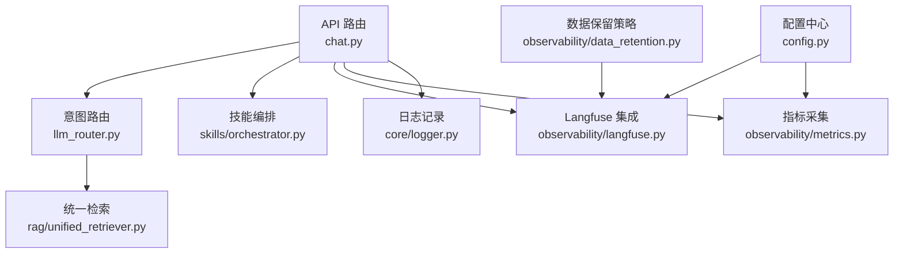
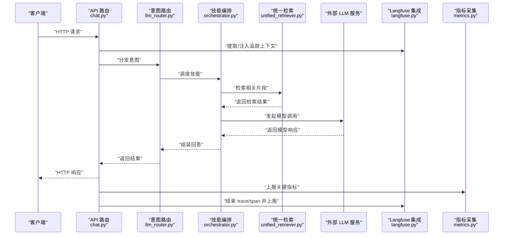
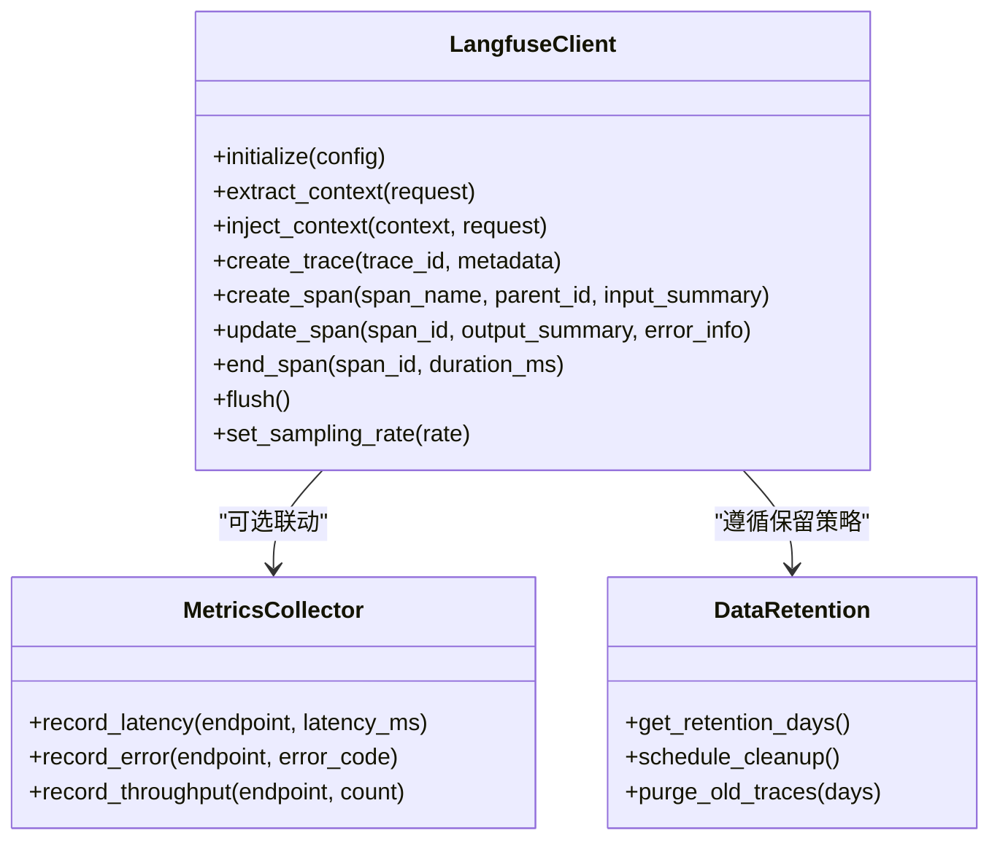
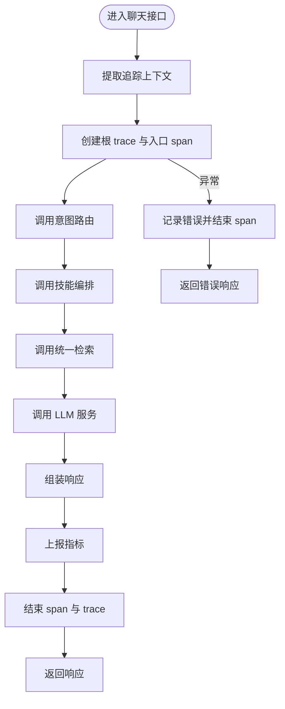
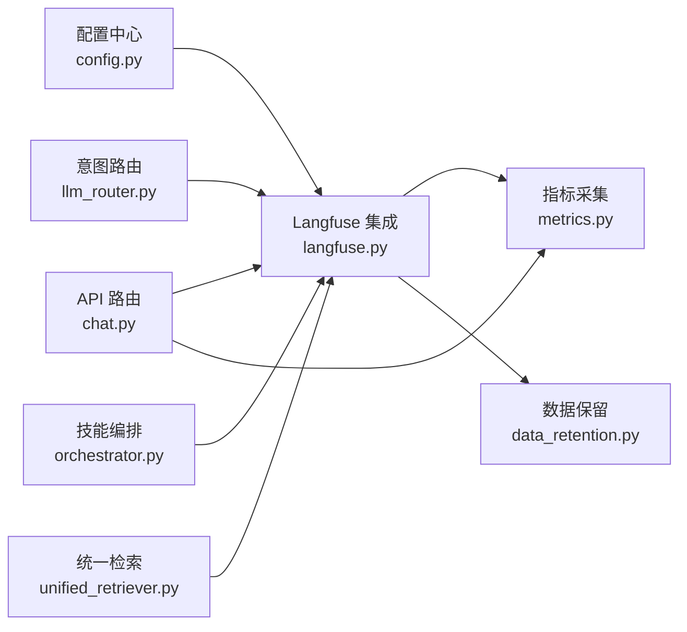

# 分布式追踪

<cite>
**本文引用的文件**   
- [backend_design/nexus/observability/langfuse.py](file://backend_design/nexus/observability/langfuse.py)
- [backend_design/nexus/observability/metrics.py](file://backend_design/nexus/observability/metrics.py)
- [backend_design/nexus/observability/data_retention.py](file://backend_design/nexus/observability/data_retention.py)
- [backend_design/nexus/api/routes/chat.py](file://backend_design/nexus/api/routes/chat.py)
- [backend_design/nexus/core/logger.py](file://backend_design/nexus/core/logger.py)
- [backend_design/nexus/intent/llm_router.py](file://backend_design/nexus/intent/llm_router.py)
- [backend_design/nexus/skills/orchestrator.py](file://backend_design/nexus/skills/orchestrator.py)
- [backend_design/nexus/rag/unified_retriever.py](file://backend_design/nexus/rag/unified_retriever.py)
- [backend_design/nexus/config.py](file://backend_design/nexus/config.py)
</cite>

## 目录
1. [简介](#简介)
2. [项目结构](#项目结构)
3. [核心组件](#核心组件)
4. [架构总览](#架构总览)
5. [详细组件分析](#详细组件分析)
6. [依赖关系分析](#依赖关系分析)
7. [性能考量](#性能考量)
8. [故障排查指南](#故障排查指南)
9. [结论](#结论)
10. [附录](#附录)

## 简介
本技术文档聚焦于在 AI 应用中集成 Langfuse 的分布式追踪方案，围绕请求链路传播、Span 创建策略、AI 模型调用追踪与性能分析、采样策略与性能影响评估、追踪 ID 的生成与传递机制、问题定位与瓶颈分析方法，以及追踪数据的保留策略与存储优化进行系统化说明。目标是在保证可观测性的同时，将追踪开销控制在可接受范围，并提供可操作的排障与优化建议。

## 项目结构
本项目在后端模块中提供统一的观测能力，其中与分布式追踪直接相关的代码位于 observability 子包，并在 API 路由、意图路由、技能编排、检索等关键路径上接入追踪上下文与 Span 埋点。

图表来源
- [backend_design/nexus/api/routes/chat.py](file://backend_design/nexus/api/routes/chat.py)
- [backend_design/nexus/intent/llm_router.py](file://backend_design/nexus/intent/llm_router.py)
- [backend_design/nexus/skills/orchestrator.py](file://backend_design/nexus/skills/orchestrator.py)
- [backend_design/nexus/rag/unified_retriever.py](file://backend_design/nexus/rag/unified_retriever.py)
- [backend_design/nexus/observability/langfuse.py](file://backend_design/nexus/observability/langfuse.py)
- [backend_design/nexus/observability/metrics.py](file://backend_design/nexus/observability/metrics.py)
- [backend_design/nexus/core/logger.py](file://backend_design/nexus/core/logger.py)
- [backend_design/nexus/config.py](file://backend_design/nexus/config.py)
- [backend_design/nexus/observability/data_retention.py](file://backend_design/nexus/observability/data_retention.py)

章节来源
- [backend_design/nexus/observability/langfuse.py](file://backend_design/nexus/observability/langfuse.py)
- [backend_design/nexus/observability/metrics.py](file://backend_design/nexus/observability/metrics.py)
- [backend_design/nexus/observability/data_retention.py](file://backend_design/nexus/observability/data_retention.py)
- [backend_design/nexus/api/routes/chat.py](file://backend_design/nexus/api/routes/chat.py)
- [backend_design/nexus/intent/llm_router.py](file://backend_design/nexus/intent/llm_router.py)
- [backend_design/nexus/skills/orchestrator.py](file://backend_design/nexus/skills/orchestrator.py)
- [backend_design/nexus/rag/unified_retriever.py](file://backend_design/nexus/rag/unified_retriever.py)
- [backend_design/nexus/core/logger.py](file://backend_design/nexus/core/logger.py)
- [backend_design/nexus/config.py](file://backend_design/nexus/config.py)

## 核心组件
- Langfuse 集成层：负责初始化客户端、管理追踪会话（trace）、创建 span、注入/提取追踪上下文、上报事件与指标。
- 指标采集层：对关键路径耗时、错误率、吞吐等进行计数与度量，便于与追踪数据联动分析。
- 数据保留策略：定义追踪数据的生命周期与清理策略，平衡可观测性与存储成本。
- 业务接入点：API 路由、意图路由、技能编排、检索等关键路径通过中间件或装饰器自动注入追踪上下文并创建 span。

章节来源
- [backend_design/nexus/observability/langfuse.py](file://backend_design/nexus/observability/langfuse.py)
- [backend_design/nexus/observability/metrics.py](file://backend_design/nexus/observability/metrics.py)
- [backend_design/nexus/observability/data_retention.py](file://backend_design/nexus/observability/data_retention.py)
- [backend_design/nexus/api/routes/chat.py](file://backend_design/nexus/api/routes/chat.py)
- [backend_design/nexus/intent/llm_router.py](file://backend_design/nexus/intent/llm_router.py)
- [backend_design/nexus/skills/orchestrator.py](file://backend_design/nexus/skills/orchestrator.py)
- [backend_design/nexus/rag/unified_retriever.py](file://backend_design/nexus/rag/unified_retriever.py)

## 架构总览
下图展示了从 HTTP 请求进入，到意图识别、技能执行、RAG 检索、LLM 调用，再到 Langfuse 上报的整体链路。

图表来源
- [backend_design/nexus/api/routes/chat.py](file://backend_design/nexus/api/routes/chat.py)
- [backend_design/nexus/intent/llm_router.py](file://backend_design/nexus/intent/llm_router.py)
- [backend_design/nexus/skills/orchestrator.py](file://backend_design/nexus/skills/orchestrator.py)
- [backend_design/nexus/rag/unified_retriever.py](file://backend_design/nexus/rag/unified_retriever.py)
- [backend_design/nexus/observability/langfuse.py](file://backend_design/nexus/observability/langfuse.py)
- [backend_design/nexus/observability/metrics.py](file://backend_design/nexus/observability/metrics.py)

## 详细组件分析

### Langfuse 集成层
- 职责
  - 初始化与配置：根据配置加载服务端地址、密钥、默认标签、采样率等参数。
  - 上下文传播：从请求头或内部上下文提取/注入追踪 ID，确保跨组件链路一致。
  - Trace/Span 管理：为每个请求创建 trace，按功能边界创建 span，记录输入输出摘要、耗时、错误信息。
  - 上报与批处理：批量上报以减少网络开销，支持失败重试与降级。
  - 采样控制：基于全局或按端点的采样策略降低追踪开销。
- 关键设计要点
  - 使用轻量级上下文载体避免阻塞主流程。
  - 对大对象采用摘要化与截断策略，避免 payload 过大。
  - 对高频接口启用更严格的采样，对关键路径降低采样阈值。
  - 与指标采集解耦，分别上报以便独立分析与告警。

图表来源
- [backend_design/nexus/observability/langfuse.py](file://backend_design/nexus/observability/langfuse.py)
- [backend_design/nexus/observability/metrics.py](file://backend_design/nexus/observability/metrics.py)
- [backend_design/nexus/observability/data_retention.py](file://backend_design/nexus/observability/data_retention.py)

章节来源
- [backend_design/nexus/observability/langfuse.py](file://backend_design/nexus/observability/langfuse.py)
- [backend_design/nexus/observability/metrics.py](file://backend_design/nexus/observability/metrics.py)
- [backend_design/nexus/observability/data_retention.py](file://backend_design/nexus/observability/data_retention.py)

### API 路由接入点（聊天接口）
- 职责
  - 接收请求并解析追踪上下文（如 X-Trace-Id、X-Span-Id）。
  - 创建根 trace 与入口 span，记录请求元数据（用户、租户、端点）。
  - 调用下游组件（意图路由、技能编排、检索），在各阶段创建子 span。
  - 捕获异常并记录错误信息，更新 span 状态。
  - 上报指标与结束 trace。
- 关键点
  - 使用 try/finally 确保 span 一定被结束。
  - 对敏感字段进行脱敏与截断。
  - 结合采样策略决定是否上报完整 payload。

图表来源
- [backend_design/nexus/api/routes/chat.py](file://backend_design/nexus/api/routes/chat.py)
- [backend_design/nexus/intent/llm_router.py](file://backend_design/nexus/intent/llm_router.py)
- [backend_design/nexus/skills/orchestrator.py](file://backend_design/nexus/skills/orchestrator.py)
- [backend_design/nexus/rag/unified_retriever.py](file://backend_design/nexus/rag/unified_retriever.py)
- [backend_design/nexus/observability/langfuse.py](file://backend_design/nexus/observability/langfuse.py)

章节来源
- [backend_design/nexus/api/routes/chat.py](file://backend_design/nexus/api/routes/chat.py)
- [backend_design/nexus/intent/llm_router.py](file://backend_design/nexus/intent/llm_router.py)
- [backend_design/nexus/skills/orchestrator.py](file://backend_design/nexus/skills/orchestrator.py)
- [backend_design/nexus/rag/unified_retriever.py](file://backend_design/nexus/rag/unified_retriever.py)
- [backend_design/nexus/observability/langfuse.py](file://backend_design/nexus/observability/langfuse.py)

### 指标采集层
- 职责
  - 记录端到端延迟、分阶段延迟、错误码分布、吞吐量。
  - 与追踪数据关联，便于在 Langfuse 界面查看对应 trace 时同步展示指标。
- 关键点
  - 使用高效计数器与直方图，避免锁竞争。
  - 对高基数维度（如用户 ID）进行采样或聚合，防止指标爆炸。

章节来源
- [backend_design/nexus/observability/metrics.py](file://backend_design/nexus/observability/metrics.py)

### 数据保留策略
- 职责
  - 定义追踪数据的保留天数与清理周期。
  - 提供定时任务清理过期数据，释放存储空间。
- 关键点
  - 支持按环境（开发/测试/生产）差异化保留策略。
  - 清理前可对关键 trace 进行归档或导出。

章节来源
- [backend_design/nexus/observability/data_retention.py](file://backend_design/nexus/observability/data_retention.py)

### 配置中心
- 职责
  - 集中管理 Langfuse 连接参数、采样率、保留策略、标签白名单等。
- 关键点
  - 支持热更新与动态调整采样率。
  - 提供默认值与校验，避免运行时配置错误。

章节来源
- [backend_design/nexus/config.py](file://backend_design/nexus/config.py)

## 依赖关系分析
- 耦合与内聚
  - Langfuse 集成层与业务模块通过上下文传播松耦合，仅依赖轻量接口。
  - 指标采集与追踪上报分离，避免相互阻塞。
- 外部依赖
  - Langfuse 服务端：用于持久化与可视化追踪数据。
  - 日志系统：辅助定位问题，与追踪 ID 关联。
- 潜在循环依赖
  - 通过分层与接口抽象避免循环引用，确保可维护性。

图表来源
- [backend_design/nexus/config.py](file://backend_design/nexus/config.py)
- [backend_design/nexus/observability/langfuse.py](file://backend_design/nexus/observability/langfuse.py)
- [backend_design/nexus/observability/metrics.py](file://backend_design/nexus/observability/metrics.py)
- [backend_design/nexus/observability/data_retention.py](file://backend_design/nexus/observability/data_retention.py)
- [backend_design/nexus/api/routes/chat.py](file://backend_design/nexus/api/routes/chat.py)
- [backend_design/nexus/intent/llm_router.py](file://backend_design/nexus/intent/llm_router.py)
- [backend_design/nexus/skills/orchestrator.py](file://backend_design/nexus/skills/orchestrator.py)
- [backend_design/nexus/rag/unified_retriever.py](file://backend_design/nexus/rag/unified_retriever.py)

章节来源
- [backend_design/nexus/config.py](file://backend_design/nexus/config.py)
- [backend_design/nexus/observability/langfuse.py](file://backend_design/nexus/observability/langfuse.py)
- [backend_design/nexus/observability/metrics.py](file://backend_design/nexus/observability/metrics.py)
- [backend_design/nexus/observability/data_retention.py](file://backend_design/nexus/observability/data_retention.py)
- [backend_design/nexus/api/routes/chat.py](file://backend_design/nexus/api/routes/chat.py)
- [backend_design/nexus/intent/llm_router.py](file://backend_design/nexus/intent/llm_router.py)
- [backend_design/nexus/skills/orchestrator.py](file://backend_design/nexus/skills/orchestrator.py)
- [backend_design/nexus/rag/unified_retriever.py](file://backend_design/nexus/rag/unified_retriever.py)

## 性能考量
- 采样策略
  - 全局采样率：按 QPS 与资源水位动态调整，避免在高负载下造成额外压力。
  - 端点级采样：对高频接口提高采样阈值，对关键路径降低阈值以获取更多细节。
  - 条件采样：仅在出现错误或特定标签命中时全量上报。
- 数据裁剪
  - 对输入输出进行摘要化与长度限制，避免大 payload 导致网络与存储压力。
  - 对敏感字段进行脱敏，减少合规风险与体积。
- 异步与批处理
  - 使用后台队列批量上报，降低主线程阻塞。
  - 实现退避重试与熔断，保障稳定性。
- 指标与追踪解耦
  - 指标用于实时告警与容量规划，追踪用于深度诊断，二者互补但互不干扰。

[本节为通用指导，无需具体文件分析]

## 故障排查指南
- 快速定位
  - 通过追踪 ID 在 Langfuse 中检索端到端链路，观察各 span 耗时与错误信息。
  - 结合日志中的追踪 ID 交叉验证，确认上下文是否成功传播。
- 常见问题
  - 上下文丢失：检查请求头是否正确携带追踪 ID，确认注入/提取逻辑是否生效。
  - Span 未结束：确认 finally 分支是否执行，避免内存泄漏。
  - 采样过低：适当提高关键路径采样率，确保能复现问题。
  - 上报失败：检查 Langfuse 服务端连通性与认证，关注重试与降级行为。
- 性能瓶颈分析
  - 关注长尾延迟与热点接口，结合指标直方图定位慢步骤。
  - 对比不同版本或配置的追踪数据，评估变更影响。

章节来源
- [backend_design/nexus/core/logger.py](file://backend_design/nexus/core/logger.py)
- [backend_design/nexus/observability/langfuse.py](file://backend_design/nexus/observability/langfuse.py)
- [backend_design/nexus/observability/metrics.py](file://backend_design/nexus/observability/metrics.py)

## 结论
通过在关键路径接入 Langfuse 分布式追踪，并结合指标采集与数据保留策略，可以在保证可观测性的同时有效控制性能开销。合理的采样策略、上下文传播机制与 Span 创建规范是落地成功的关键。配合问题定位与瓶颈分析方法，团队能够快速发现并解决复杂链路中的性能与稳定性问题。

[本节为总结性内容，无需具体文件分析]

## 附录
- 最佳实践清单
  - 为每个请求创建根 trace，并为每个功能边界创建 span。
  - 对输入输出进行摘要化与脱敏，避免泄露与膨胀。
  - 使用 finally 确保 span 结束，避免资源泄漏。
  - 对高频接口实施严格采样，对关键路径放宽采样。
  - 定期评估保留策略，平衡可观测性与存储成本。
- 参考路径
  - 追踪上下文注入/提取：[backend_design/nexus/observability/langfuse.py](file://backend_design/nexus/observability/langfuse.py)
  - 指标采集示例：[backend_design/nexus/observability/metrics.py](file://backend_design/nexus/observability/metrics.py)
  - 数据保留策略：[backend_design/nexus/observability/data_retention.py](file://backend_design/nexus/observability/data_retention.py)
  - API 接入点：[backend_design/nexus/api/routes/chat.py](file://backend_design/nexus/api/routes/chat.py)
  - 意图路由接入：[backend_design/nexus/intent/llm_router.py](file://backend_design/nexus/intent/llm_router.py)
  - 技能编排接入：[backend_design/nexus/skills/orchestrator.py](file://backend_design/nexus/skills/orchestrator.py)
  - 检索接入：[backend_design/nexus/rag/unified_retriever.py](file://backend_design/nexus/rag/unified_retriever.py)
  - 配置项：[backend_design/nexus/config.py](file://backend_design/nexus/config.py)