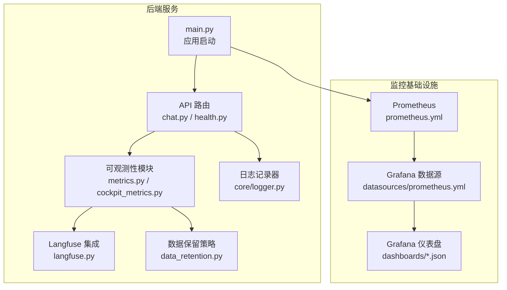
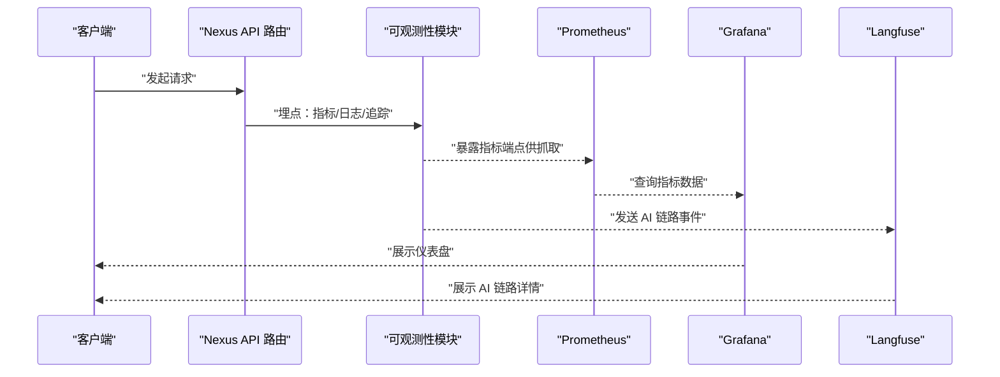
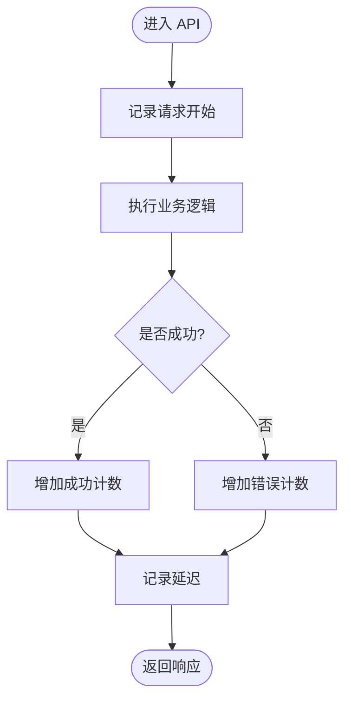
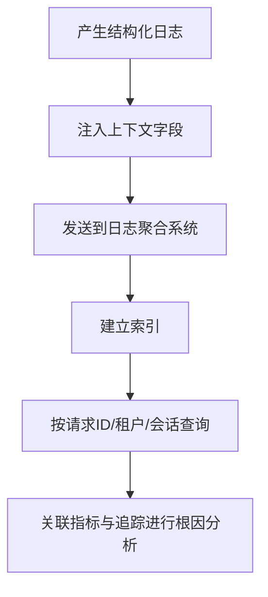
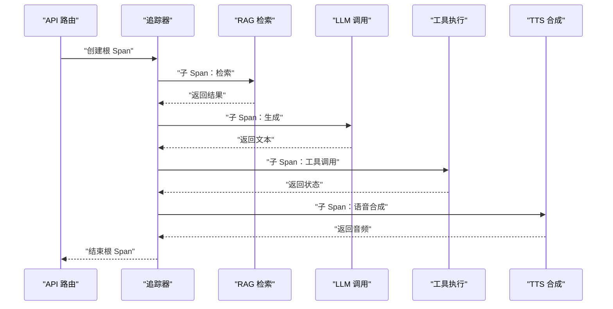
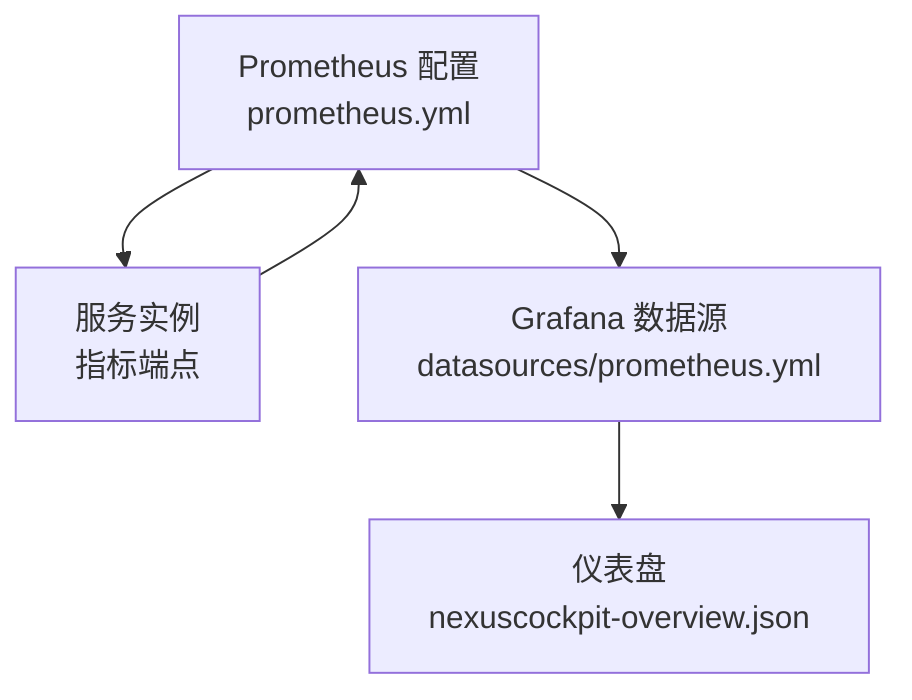
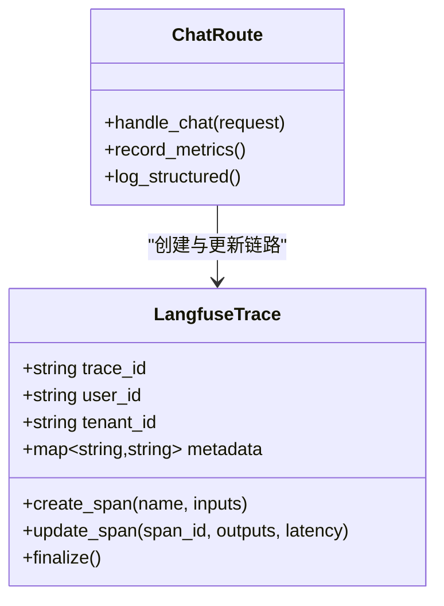
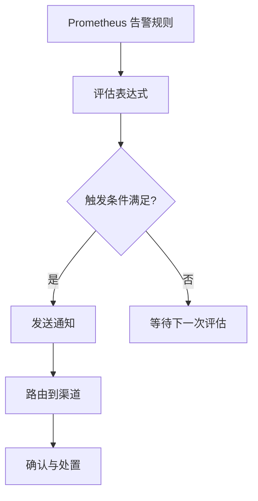
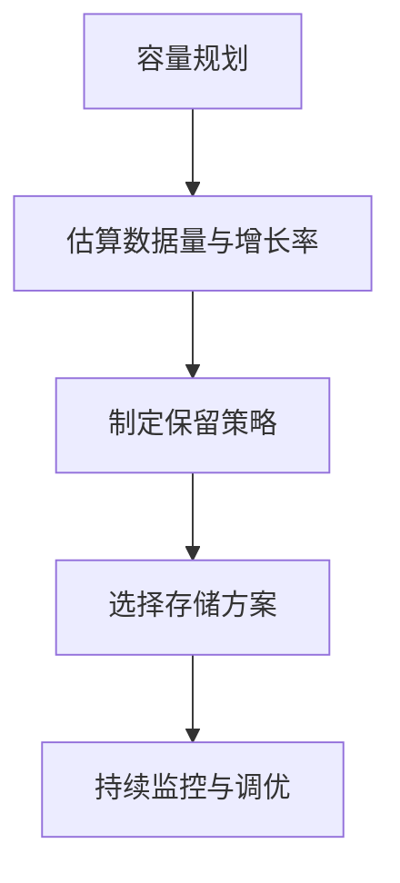
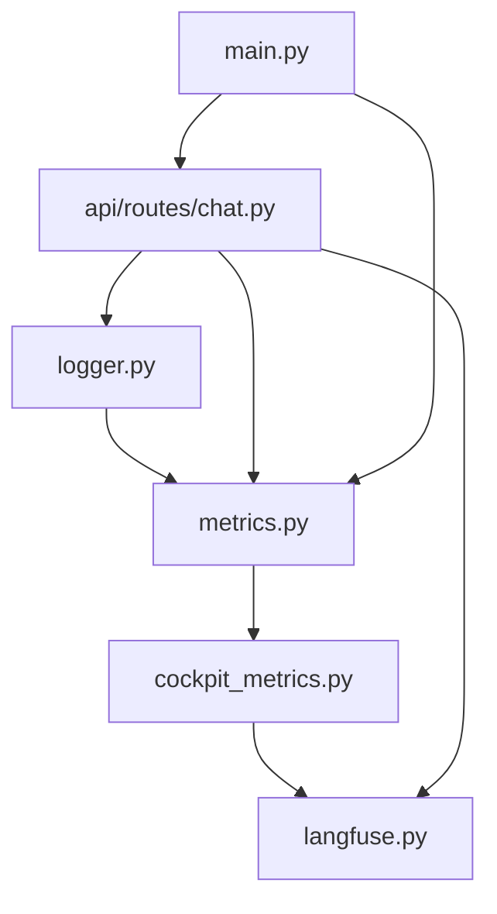

# 可观测性系统

<cite>
**本文引用的文件**   
- [backend_design/nexus/observability/__init__.py](file://backend_design/nexus/observability/__init__.py)
- [backend_design/nexus/observability/metrics.py](file://backend_design/nexus/observability/metrics.py)
- [backend_design/nexus/observability/cockpit_metrics.py](file://backend_design/nexus/observability/cockpit_metrics.py)
- [backend_design/nexus/observability/langfuse.py](file://backend_design/nexus/observability/langfuse.py)
- [backend_design/nexus/observability/data_retention.py](file://backend_design/nexus/observability/data_retention.py)
- [config/prometheus/prometheus.yml](file://config/prometheus/prometheus.yml)
- [config/grafana/provisioning/datasources/prometheus.yml](file://config/grafana/provisioning/datasources/prometheus.yml)
- [config/grafana/provisioning/dashboards/dashboards.yml](file://config/grafana/provisioning/dashboards/dashboards.yml)
- [config/grafana/provisioning/dashboards/nexuscockpit-overview.json](file://config/grafana/provisioning/dashboards/nexuscockpit-overview.json)
- [backend_design/nexus/core/logger.py](file://backend_design/nexus/core/logger.py)
- [backend_design/nexus/api/routes/chat.py](file://backend_design/nexus/api/routes/chat.py)
- [backend_design/nexus/api/routes/health.py](file://backend_design/nexus/api/routes/health.py)
- [backend_design/nexus/main.py](file://backend_design/nexus/main.py)
- [docker-compose.yml](file://docker-compose.yml)
</cite>

## 目录
1. [简介](#简介)
2. [项目结构](#项目结构)
3. [核心组件](#核心组件)
4. [架构总览](#架构总览)
5. [详细组件分析](#详细组件分析)
6. [依赖关系分析](#依赖关系分析)
7. [性能考量](#性能考量)
8. [故障排查指南](#故障排查指南)
9. [结论](#结论)
10. [附录](#附录)

## 简介
本技术文档面向 NexusCockpit 的可观测性体系，覆盖指标监控、日志聚合、分布式追踪、AI 应用追踪（Langfuse）、Prometheus/Grafana 面板配置、告警规则与通知策略，以及数据保留与容量规划建议。目标是帮助读者快速理解采集策略、关键指标定义、链路跟踪和问题定位方法，并掌握运维侧的监控面板与告警配置要点。

## 项目结构
可观测性相关代码集中在后端 Python 服务的 observability 模块中，同时包含 Prometheus 抓取配置、Grafana 数据源与仪表盘预置配置，以及日志记录器与 API 路由中的埋点示例。

图表来源
- [backend_design/nexus/main.py](file://backend_design/nexus/main.py)
- [backend_design/nexus/api/routes/chat.py](file://backend_design/nexus/api/routes/chat.py)
- [backend_design/nexus/api/routes/health.py](file://backend_design/nexus/api/routes/health.py)
- [backend_design/nexus/observability/metrics.py](file://backend_design/nexus/observability/metrics.py)
- [backend_design/nexus/observability/cockpit_metrics.py](file://backend_design/nexus/observability/cockpit_metrics.py)
- [backend_design/nexus/observability/langfuse.py](file://backend_design/nexus/observability/langfuse.py)
- [backend_design/nexus/observability/data_retention.py](file://backend_design/nexus/observability/data_retention.py)
- [backend_design/nexus/core/logger.py](file://backend_design/nexus/core/logger.py)
- [config/prometheus/prometheus.yml](file://config/prometheus/prometheus.yml)
- [config/grafana/provisioning/datasources/prometheus.yml](file://config/grafana/provisioning/datasources/prometheus.yml)
- [config/grafana/provisioning/dashboards/dashboards.yml](file://config/grafana/provisioning/dashboards/dashboards.yml)
- [config/grafana/provisioning/dashboards/nexuscockpit-overview.json](file://config/grafana/provisioning/dashboards/nexuscockpit-overview.json)

章节来源
- [backend_design/nexus/observability/__init__.py](file://backend_design/nexus/observability/__init__.py)
- [backend_design/nexus/observability/metrics.py](file://backend_design/nexus/observability/metrics.py)
- [backend_design/nexus/observability/cockpit_metrics.py](file://backend_design/nexus/observability/cockpit_metrics.py)
- [backend_design/nexus/observability/langfuse.py](file://backend_design/nexus/observability/langfuse.py)
- [backend_design/nexus/observability/data_retention.py](file://backend_design/nexus/observability/data_retention.py)
- [config/prometheus/prometheus.yml](file://config/prometheus/prometheus.yml)
- [config/grafana/provisioning/datasources/prometheus.yml](file://config/grafana/provisioning/datasources/prometheus.yml)
- [config/grafana/provisioning/dashboards/dashboards.yml](file://config/grafana/provisioning/dashboards/dashboards.yml)
- [config/grafana/provisioning/dashboards/nexuscockpit-overview.json](file://config/grafana/provisioning/dashboards/nexuscockpit-overview.json)
- [backend_design/nexus/core/logger.py](file://backend_design/nexus/core/logger.py)
- [backend_design/nexus/api/routes/chat.py](file://backend_design/nexus/api/routes/chat.py)
- [backend_design/nexus/api/routes/health.py](file://backend_design/nexus/api/routes/health.py)
- [backend_design/nexus/main.py](file://backend_design/nexus/main.py)

## 核心组件
- 指标采集与暴露
  - 通用指标封装：提供计数器、直方图、计时器等常用指标的注册与上报能力，便于在业务路径中统一埋点。
  - 座舱专属指标：针对聊天会话、意图识别、工具调用、TTS/ASR 等流程的关键步骤进行细化统计，包括请求量、延迟分布、错误率与资源使用。
- Langfuse AI 应用追踪
  - 为 LLM 调用、提示词版本、检索增强生成（RAG）步骤、技能执行等创建 trace/span，支持按用户、租户、会话维度关联，便于性能分析与问题定位。
- 日志记录器
  - 结构化日志输出，包含请求上下文、租户标识、会话 ID、耗时等字段，便于后续聚合与分析。
- 数据保留策略
  - 对指标、日志、追踪数据进行生命周期管理，支持按时间窗口或大小阈值清理，避免存储膨胀。
- Prometheus 抓取与 Grafana 可视化
  - 通过配置文件定义抓取目标、标签与间隔；Grafana 预置数据源与仪表盘，快速呈现系统健康与业务指标。

章节来源
- [backend_design/nexus/observability/metrics.py](file://backend_design/nexus/observability/metrics.py)
- [backend_design/nexus/observability/cockpit_metrics.py](file://backend_design/nexus/observability/cockpit_metrics.py)
- [backend_design/nexus/observability/langfuse.py](file://backend_design/nexus/observability/langfuse.py)
- [backend_design/nexus/core/logger.py](file://backend_design/nexus/core/logger.py)
- [backend_design/nexus/observability/data_retention.py](file://backend_design/nexus/observability/data_retention.py)
- [config/prometheus/prometheus.yml](file://config/prometheus/prometheus.yml)
- [config/grafana/provisioning/datasources/prometheus.yml](file://config/grafana/provisioning/datasources/prometheus.yml)
- [config/grafana/provisioning/dashboards/dashboards.yml](file://config/grafana/provisioning/dashboards/dashboards.yml)
- [config/grafana/provisioning/dashboards/nexuscockpit-overview.json](file://config/grafana/provisioning/dashboards/nexuscockpit-overview.json)

## 架构总览
整体架构围绕“采集—存储—可视化—告警”的主线展开：
- 采集层：Python 服务内埋点（指标、日志、追踪），API 路由与中间件触发上报。
- 存储层：Prometheus 拉取指标；日志与追踪数据由外部系统（如 Loki、Jaeger/OpenTelemetry Collector、Langfuse）接收与持久化。
- 可视化层：Grafana 展示指标与仪表盘；Langfuse 控制台用于 AI 链路分析。
- 告警层：基于 Prometheus 规则触发告警，并通过通知渠道（邮件、Webhook 等）推送。

图表来源
- [backend_design/nexus/api/routes/chat.py](file://backend_design/nexus/api/routes/chat.py)
- [backend_design/nexus/observability/metrics.py](file://backend_design/nexus/observability/metrics.py)
- [backend_design/nexus/observability/langfuse.py](file://backend_design/nexus/observability/langfuse.py)
- [config/prometheus/prometheus.yml](file://config/prometheus/prometheus.yml)
- [config/grafana/provisioning/datasources/prometheus.yml](file://config/grafana/provisioning/datasources/prometheus.yml)
- [config/grafana/provisioning/dashboards/nexuscockpit-overview.json](file://config/grafana/provisioning/dashboards/nexuscockpit-overview.json)

## 详细组件分析

### 指标监控：采集策略与关键指标
- 采集策略
  - 在 API 入口与关键处理阶段埋点，记录请求计数、成功/失败次数、延迟分位数、并发数等。
  - 为不同租户与会话添加标签，便于多维分析。
  - 采用批量上报与异步写入，降低对主流程的影响。
- 关键指标定义（示例类别）
  - 请求类：总请求数、错误请求数、成功率、P50/P95/P99 延迟。
  - 业务类：意图识别准确率、工具调用成功率、TTS/ASR 时长、RAG 检索命中数。
  - 资源类：CPU/内存占用、GC 停顿、队列积压、缓存命中率。
  - AI 类：LLM 调用次数、Token 用量、重试次数、降级触发次数。
- 指标命名与标签规范
  - 统一的命名空间与后缀约定，确保跨模块一致性。
  - 标签包含租户、会话、模型、工具名等维度，控制基数以避免高基数字段。

图表来源
- [backend_design/nexus/observability/metrics.py](file://backend_design/nexus/observability/metrics.py)
- [backend_design/nexus/observability/cockpit_metrics.py](file://backend_design/nexus/observability/cockpit_metrics.py)
- [backend_design/nexus/api/routes/chat.py](file://backend_design/nexus/api/routes/chat.py)

章节来源
- [backend_design/nexus/observability/metrics.py](file://backend_design/nexus/observability/metrics.py)
- [backend_design/nexus/observability/cockpit_metrics.py](file://backend_design/nexus/observability/cockpit_metrics.py)
- [backend_design/nexus/api/routes/chat.py](file://backend_design/nexus/api/routes/chat.py)

### 日志聚合：收集格式与分析方法
- 收集格式
  - 结构化 JSON 日志，包含时间戳、级别、消息、上下文键值对（租户、会话、请求 ID、耗时）。
  - 关键字段标准化，便于索引与查询。
- 分析方法
  - 基于请求 ID 串联上下游日志，定位慢调用与异常分支。
  - 结合指标与日志进行根因分析，例如错误率突增时查看对应错误日志与堆栈。
  - 对高频错误进行聚类与去噪，减少告警风暴。

图表来源
- [backend_design/nexus/core/logger.py](file://backend_design/nexus/core/logger.py)
- [backend_design/nexus/api/routes/chat.py](file://backend_design/nexus/api/routes/chat.py)

章节来源
- [backend_design/nexus/core/logger.py](file://backend_design/nexus/core/logger.py)
- [backend_design/nexus/api/routes/chat.py](file://backend_design/nexus/api/routes/chat.py)

### 分布式追踪：链路跟踪与问题定位
- 链路跟踪
  - 在 API 入口创建 span，贯穿意图识别、RAG 检索、LLM 调用、工具执行、TTS/ASR 等环节。
  - 将 TraceID/SpanID 注入日志与指标标签，实现跨系统关联。
- 问题定位机制
  - 通过端到端耗时分解，识别瓶颈环节（如 LLM 超时、检索召回率低）。
  - 结合错误码与异常信息，快速定位上游依赖问题。
  - 利用 Langfuse 的 AI 链路视图，对比不同提示词与模型版本的性能差异。

图表来源
- [backend_design/nexus/observability/langfuse.py](file://backend_design/nexus/observability/langfuse.py)
- [backend_design/nexus/api/routes/chat.py](file://backend_design/nexus/api/routes/chat.py)

章节来源
- [backend_design/nexus/observability/langfuse.py](file://backend_design/nexus/observability/langfuse.py)
- [backend_design/nexus/api/routes/chat.py](file://backend_design/nexus/api/routes/chat.py)

### Prometheus 与 Grafana 监控面板配置
- Prometheus 抓取配置
  - 定义抓取目标、标签、抓取间隔与超时参数，确保稳定采集。
  - 合理设置 scrape_interval 与 evaluation_interval，平衡实时性与负载。
- Grafana 数据源与仪表盘
  - 预置数据源指向 Prometheus，启用必要的认证与访问控制。
  - 仪表盘涵盖系统概览、API 健康、AI 链路性能、资源使用等视图。
  - 通过变量与过滤条件，支持按租户、会话、模型等维度筛选。

图表来源
- [config/prometheus/prometheus.yml](file://config/prometheus/prometheus.yml)
- [config/grafana/provisioning/datasources/prometheus.yml](file://config/grafana/provisioning/datasources/prometheus.yml)
- [config/grafana/provisioning/dashboards/dashboards.yml](file://config/grafana/provisioning/dashboards/dashboards.yml)
- [config/grafana/provisioning/dashboards/nexuscockpit-overview.json](file://config/grafana/provisioning/dashboards/nexuscockpit-overview.json)

章节来源
- [config/prometheus/prometheus.yml](file://config/prometheus/prometheus.yml)
- [config/grafana/provisioning/datasources/prometheus.yml](file://config/grafana/provisioning/datasources/prometheus.yml)
- [config/grafana/provisioning/dashboards/dashboards.yml](file://config/grafana/provisioning/dashboards/dashboards.yml)
- [config/grafana/provisioning/dashboards/nexuscockpit-overview.json](file://config/grafana/provisioning/dashboards/nexuscockpit-overview.json)

### Langfuse 的 AI 应用追踪与性能分析
- 追踪内容
  - 记录提示词版本、输入输出、模型参数、检索结果、工具调用结果与耗时。
  - 支持按用户、租户、会话维度组织数据，便于对比与回溯。
- 性能分析
  - 通过链路视图分析各阶段耗时占比，识别瓶颈与抖动。
  - 结合重试与降级策略，评估稳定性与用户体验影响。
  - 对比不同模型与提示词的效果，辅助优化决策。

图表来源
- [backend_design/nexus/observability/langfuse.py](file://backend_design/nexus/observability/langfuse.py)
- [backend_design/nexus/api/routes/chat.py](file://backend_design/nexus/api/routes/chat.py)

章节来源
- [backend_design/nexus/observability/langfuse.py](file://backend_design/nexus/observability/langfuse.py)
- [backend_design/nexus/api/routes/chat.py](file://backend_design/nexus/api/routes/chat.py)

### 告警规则的配置与通知策略
- 告警规则
  - 基于 Prometheus 表达式定义阈值与持续时间，覆盖错误率、延迟、资源使用、队列积压等关键场景。
  - 使用标签区分租户与服务实例，避免误报与漏报。
- 通知策略
  - 配置多种通知渠道（邮件、Webhook、IM 等），按严重级别与团队职责分发。
  - 引入抑制与静默规则，减少告警风暴与重复通知。
  - 定期演练告警流程，确保响应时效与处置闭环。

图表来源
- [config/prometheus/prometheus.yml](file://config/prometheus/prometheus.yml)

章节来源
- [config/prometheus/prometheus.yml](file://config/prometheus/prometheus.yml)

### 监控数据的保留策略与容量规划建议
- 保留策略
  - 指标数据：按时间窗口与存储成本设定保留期，过期数据归档或删除。
  - 日志数据：按级别与来源分类保留，重要日志延长保留期。
  - 追踪数据：仅保留必要字段与采样比例，控制体积。
- 容量规划
  - 估算指标基数与写入速率，规划 Prometheus 存储与磁盘容量。
  - 根据峰值流量与增长趋势，预留扩容空间与弹性策略。
  - 定期审查保留策略与采样率，平衡可观测性与成本。

图表来源
- [backend_design/nexus/observability/data_retention.py](file://backend_design/nexus/observability/data_retention.py)

章节来源
- [backend_design/nexus/observability/data_retention.py](file://backend_design/nexus/observability/data_retention.py)

## 依赖关系分析
- 组件耦合与内聚
  - 可观测性模块内部高内聚，对外通过统一接口暴露指标、日志与追踪能力。
  - API 路由低耦合地调用可观测性模块，避免侵入式改动。
- 直接与间接依赖
  - 指标模块依赖底层指标库；Langfuse 模块依赖外部 SDK；日志模块依赖标准库与可选的外部聚合器。
- 外部依赖与集成点
  - Prometheus 抓取端点；Grafana 数据源与仪表盘；Langfuse 服务端。
- 循环依赖检查
  - 当前结构未发现循环依赖，保持清晰的单向调用关系。

图表来源
- [backend_design/nexus/observability/metrics.py](file://backend_design/nexus/observability/metrics.py)
- [backend_design/nexus/observability/cockpit_metrics.py](file://backend_design/nexus/observability/cockpit_metrics.py)
- [backend_design/nexus/observability/langfuse.py](file://backend_design/nexus/observability/langfuse.py)
- [backend_design/nexus/core/logger.py](file://backend_design/nexus/core/logger.py)
- [backend_design/nexus/api/routes/chat.py](file://backend_design/nexus/api/routes/chat.py)
- [backend_design/nexus/main.py](file://backend_design/nexus/main.py)

章节来源
- [backend_design/nexus/observability/metrics.py](file://backend_design/nexus/observability/metrics.py)
- [backend_design/nexus/observability/cockpit_metrics.py](file://backend_design/nexus/observability/cockpit_metrics.py)
- [backend_design/nexus/observability/langfuse.py](file://backend_design/nexus/observability/langfuse.py)
- [backend_design/nexus/core/logger.py](file://backend_design/nexus/core/logger.py)
- [backend_design/nexus/api/routes/chat.py](file://backend_design/nexus/api/routes/chat.py)
- [backend_design/nexus/main.py](file://backend_design/nexus/main.py)

## 性能考量
- 指标上报开销
  - 采用异步与批量上报，避免阻塞主流程；控制标签基数，防止高基数字段导致查询变慢。
- 日志写入性能
  - 使用结构化日志与异步落盘，限制大对象序列化；按需采样高频日志。
- 追踪采样
  - 在高流量场景下启用采样策略，保留关键链路样本，降低存储与传输压力。
- 资源使用
  - 监控 CPU/内存/GC 指标，设置合理的线程池与连接池大小，避免资源争用。

[本节为通用指导，不直接分析具体文件]

## 故障排查指南
- 常见问题
  - 指标缺失：检查抓取配置与端点可达性，确认埋点是否生效。
  - 日志丢失：验证日志聚合系统连通性与权限，检查本地缓冲与重试策略。
  - 追踪断裂：确认 TraceID 传递是否正确，下游服务是否注入上下文。
  - 告警风暴：调整阈值与持续时间，启用抑制与静默规则。
- 定位步骤
  - 从 Grafana 仪表盘发现异常，结合指标曲线缩小范围。
  - 使用请求 ID 在日志系统中串联全链路日志，定位错误分支。
  - 在 Langfuse 中查看 AI 链路详情，对比不同版本与参数的效果。
  - 必要时开启更细粒度的追踪与日志级别，复现问题后恢复默认。

章节来源
- [backend_design/nexus/api/routes/health.py](file://backend_design/nexus/api/routes/health.py)
- [backend_design/nexus/core/logger.py](file://backend_design/nexus/core/logger.py)
- [backend_design/nexus/observability/langfuse.py](file://backend_design/nexus/observability/langfuse.py)

## 结论
本可观测性体系以指标、日志、追踪为核心，结合 Prometheus/Grafana 与 Langfuse，形成完整的监控、可视化与问题分析闭环。通过规范的采集策略、清晰的指标定义、严格的日志格式与有效的告警策略，能够显著提升系统的可观测性与运维效率。配合数据保留与容量规划，可在保证质量的同时控制成本。

[本节为总结性内容，不直接分析具体文件]

## 附录
- 部署参考
  - docker-compose 编排了服务与监控组件，便于本地与测试环境快速搭建。
- 健康检查
  - 健康检查路由可用于探针与负载均衡健康判断，结合指标与日志提升可用性。

章节来源
- [docker-compose.yml](file://docker-compose.yml)
- [backend_design/nexus/api/routes/health.py](file://backend_design/nexus/api/routes/health.py)