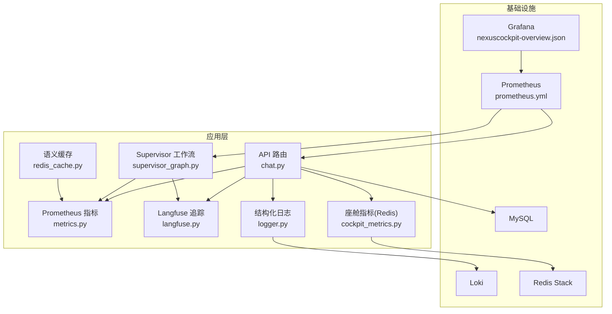
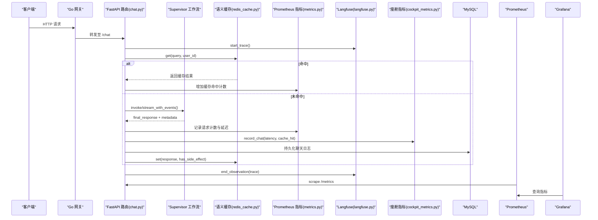
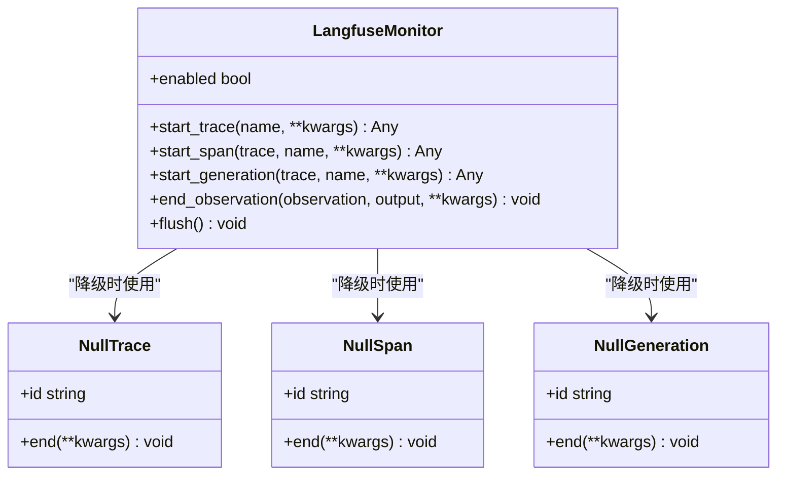
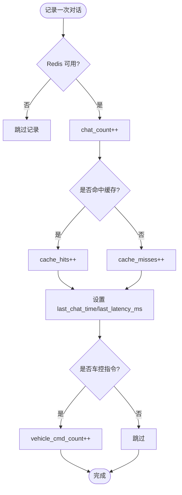
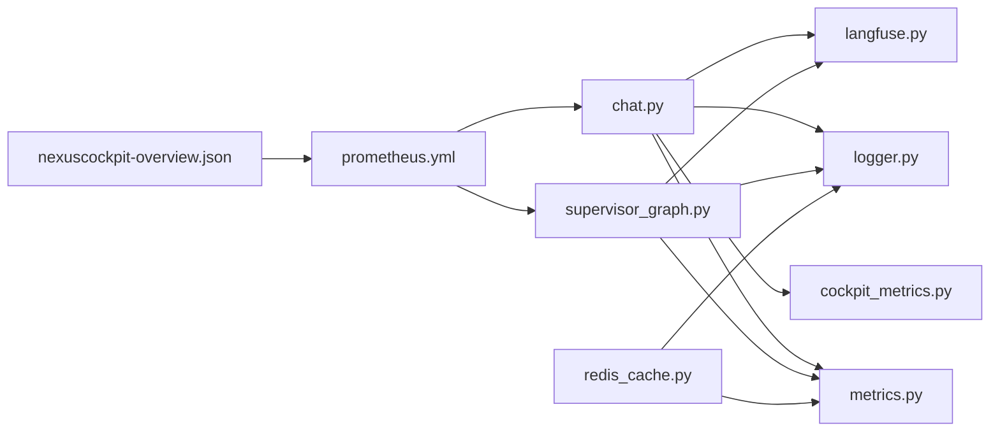

# 可观测性系统

<cite>
**本文引用的文件**
- [backend_design/nexus/observability/metrics.py](file://backend_design/nexus/observability/metrics.py)
- [backend_design/nexus/observability/langfuse.py](file://backend_design/nexus/observability/langfuse.py)
- [backend_design/nexus/observability/cockpit_metrics.py](file://backend_design/nexus/observability/cockpit_metrics.py)
- [backend_design/nexus/core/logger.py](file://backend_design/nexus/core/logger.py)
- [config/prometheus/prometheus.yml](file://config/prometheus/prometheus.yml)
- [config/grafana/provisioning/dashboards/nexuscockpit-overview.json](file://config/grafana/provisioning/dashboards/nexuscockpit-overview.json)
- [backend_design/nexus/api/routes/chat.py](file://backend_design/nexus/api/routes/chat.py)
- [backend_design/nexus/agent/supervisor_graph.py](file://backend_design/nexus/agent/supervisor_graph.py)
- [backend_design/nexus/middleware/redis_cache.py](file://backend_design/nexus/middleware/redis_cache.py)
- [backend_design/nexus/config.py](file://backend_design/nexus/config.py)
- [docker-compose.yml](file://docker-compose.yml)
- [docs/architecture/L7-observability.md](file://docs/architecture/L7-observability.md)
</cite>

## 目录
1. [引言](#引言)
2. [项目结构](#项目结构)
3. [核心组件](#核心组件)
4. [架构总览](#架构总览)
5. [详细组件分析](#详细组件分析)
6. [依赖关系分析](#依赖关系分析)
7. [性能与容量规划](#性能与容量规划)
8. [故障排查指南](#故障排查指南)
9. [结论](#结论)
10. [附录](#附录)

## 引言
本文件面向 NexusCockpit 的可观测性体系，覆盖指标采集（Prometheus/Grafana）、分布式追踪（Langfuse LLM 链路）、日志聚合（结构化日志、级别管理、异常告警）、座舱监控看板（实时数据、趋势、健康检查），以及数据存储策略、查询优化与容量规划。目标是帮助读者快速理解并扩展该系统的可观测能力。

## 项目结构
可观测性相关代码集中在后端 Python 服务中，并通过基础设施编排统一暴露：
- 指标定义与采集：nexus/observability/metrics.py
- Langfuse 追踪封装：nexus/observability/langfuse.py
- 座舱级指标写入 Redis：nexus/observability/cockpit_metrics.py
- 结构化日志：nexus/core/logger.py
- Prometheus 抓取配置：config/prometheus/prometheus.yml
- Grafana 预置面板：config/grafana/provisioning/dashboards/nexuscockpit-overview.json
- API 层埋点与持久化：backend_design/nexus/api/routes/chat.py
- Agent 工作流与延迟统计：backend_design/nexus/agent/supervisor_graph.py
- 语义缓存命中/未命中埋点：backend_design/nexus/middleware/redis_cache.py
- 可观测性配置（含 Langfuse/Observability）：backend_design/nexus/config.py
- 基础设施编排（Prometheus/Grafana/Loki）：docker-compose.yml

图表来源
- [backend_design/nexus/api/routes/chat.py](file://backend_design/nexus/api/routes/chat.py)
- [backend_design/nexus/agent/supervisor_graph.py](file://backend_design/nexus/agent/supervisor_graph.py)
- [backend_design/nexus/middleware/redis_cache.py](file://backend_design/nexus/middleware/redis_cache.py)
- [backend_design/nexus/observability/metrics.py](file://backend_design/nexus/observability/metrics.py)
- [backend_design/nexus/observability/langfuse.py](file://backend_design/nexus/observability/langfuse.py)
- [backend_design/nexus/observability/cockpit_metrics.py](file://backend_design/nexus/observability/cockpit_metrics.py)
- [backend_design/nexus/core/logger.py](file://backend_design/nexus/core/logger.py)
- [config/prometheus/prometheus.yml](file://config/prometheus/prometheus.yml)
- [config/grafana/provisioning/dashboards/nexuscockpit-overview.json](file://config/grafana/provisioning/dashboards/nexuscockpit-overview.json)
- [docker-compose.yml](file://docker-compose.yml)

章节来源
- [docs/architecture/L7-observability.md:1-134](file://docs/architecture/L7-observability.md#L1-L134)

## 核心组件
- Prometheus 指标
  - 请求总量、延迟直方图、Agent 调用计数与延迟、技能执行计数、缓存命中/未命中、RAG 检索计数与延迟、LLM 调用计数与延迟、活跃连接数、活跃用户数等。
  - 初始化入口用于注入版本与服务信息。
- Langfuse 追踪
  - 自动检测配置，未启用时降级为空操作；提供 trace/span/generation 的创建与结束方法。
- 座舱级指标
  - 将对话、车控指令、错误等指标写入 Redis Hash，供运营看板实时读取；计算缓存命中率与错误率。
- 结构化日志
  - 基于 structlog，生产环境输出 JSON，开发环境彩色控制台；支持上下文绑定（如 request_id）。
- Prometheus 抓取配置
  - 采集 Python AI 后端与 Go 网关 /metrics 端点，以及 Milvus 与 Prometheus 自身指标。
- Grafana 面板
  - 预置 Overview 面板，展示 API 请求总数、P95/P50/P99 延迟、缓存命中率、活跃连接、Agent 调用速率、RAG/LLM 延迟等。
- API 埋点与持久化
  - 在 chat 接口中记录请求计数与延迟、缓存命中/未命中、Agent 调用状态、Langfuse 追踪、座舱指标写入 Redis、聊天日志持久化到 MySQL。
- Agent 工作流
  - Supervisor 节点并行记忆召回、画像加载、意图路由，并在关键阶段记录延迟元数据。
- 语义缓存埋点
  - KNN/Scan 两种路径均更新命中/未命中计数，安全隔离副作用响应。

章节来源
- [backend_design/nexus/observability/metrics.py:1-113](file://backend_design/nexus/observability/metrics.py#L1-L113)
- [backend_design/nexus/observability/langfuse.py:1-128](file://backend_design/nexus/observability/langfuse.py#L1-L128)
- [backend_design/nexus/observability/cockpit_metrics.py:1-189](file://backend_design/nexus/observability/cockpit_metrics.py#L1-L189)
- [backend_design/nexus/core/logger.py:1-105](file://backend_design/nexus/core/logger.py#L1-L105)
- [config/prometheus/prometheus.yml:1-35](file://config/prometheus/prometheus.yml#L1-L35)
- [config/grafana/provisioning/dashboards/nexuscockpit-overview.json:1-800](file://config/grafana/provisioning/dashboards/nexuscockpit-overview.json#L1-L800)
- [backend_design/nexus/api/routes/chat.py:1-392](file://backend_design/nexus/api/routes/chat.py#L1-L392)
- [backend_design/nexus/agent/supervisor_graph.py:1-800](file://backend_design/nexus/agent/supervisor_graph.py#L1-L800)
- [backend_design/nexus/middleware/redis_cache.py:1-449](file://backend_design/nexus/middleware/redis_cache.py#L1-L449)

## 架构总览
NexusCockpit 的可观测性遵循“三支柱”设计：Metrics + Tracing + Logging，配合 Grafana 可视化与 Loki 日志聚合。

图表来源
- [backend_design/nexus/api/routes/chat.py:1-392](file://backend_design/nexus/api/routes/chat.py#L1-L392)
- [backend_design/nexus/agent/supervisor_graph.py:1-800](file://backend_design/nexus/agent/supervisor_graph.py#L1-L800)
- [backend_design/nexus/middleware/redis_cache.py:1-449](file://backend_design/nexus/middleware/redis_cache.py#L1-L449)
- [backend_design/nexus/observability/metrics.py:1-113](file://backend_design/nexus/observability/metrics.py#L1-L113)
- [backend_design/nexus/observability/langfuse.py:1-128](file://backend_design/nexus/observability/langfuse.py#L1-L128)
- [backend_design/nexus/observability/cockpit_metrics.py:1-189](file://backend_design/nexus/observability/cockpit_metrics.py#L1-L189)
- [config/prometheus/prometheus.yml:1-35](file://config/prometheus/prometheus.yml#L1-L35)
- [config/grafana/provisioning/dashboards/nexuscockpit-overview.json:1-800](file://config/grafana/provisioning/dashboards/nexuscockpit-overview.json#L1-L800)

## 详细组件分析

### Prometheus 指标体系
- 指标分类
  - 应用信息：版本、服务名等
  - 请求指标：总量、延迟直方图
  - Agent 指标：调用次数、延迟分布
  - 技能指标：执行次数
  - 缓存指标：命中/未命中
  - RAG 指标：检索次数、延迟
  - LLM 指标：调用次数、延迟
  - 系统指标：活跃连接、活跃用户
- 使用方式
  - 在 API 层对请求计数与延迟进行标注
  - 在缓存命中/未命中分支分别递增计数器
  - 在 Agent 执行前后记录调用与延迟
- 复杂度与影响
  - Counter/Histogram 为 O(1) 增量更新，低开销
  - 标签维度需控制 cardinality，避免高基数字段导致存储膨胀

章节来源
- [backend_design/nexus/observability/metrics.py:1-113](file://backend_design/nexus/observability/metrics.py#L1-L113)
- [backend_design/nexus/api/routes/chat.py:1-392](file://backend_design/nexus/api/routes/chat.py#L1-L392)
- [backend_design/nexus/middleware/redis_cache.py:1-449](file://backend_design/nexus/middleware/redis_cache.py#L1-L449)

### Langfuse 分布式追踪
- 功能特性
  - 自动检测配置，未安装或未配置时降级为空操作
  - 提供 start_trace/start_span/start_generation/end_observation 统一接口
- 集成位置
  - API 层创建顶层 trace，贯穿整个请求生命周期
  - Agent 层通过 span 记录各节点耗时
- 配置项
  - public_key、secret_key、host，由配置中心集中管理

图表来源
- [backend_design/nexus/observability/langfuse.py:1-128](file://backend_design/nexus/observability/langfuse.py#L1-L128)
- [backend_design/nexus/config.py:395-414](file://backend_design/nexus/config.py#L395-L414)

章节来源
- [backend_design/nexus/observability/langfuse.py:1-128](file://backend_design/nexus/observability/langfuse.py#L1-L128)
- [backend_design/nexus/config.py:395-414](file://backend_design/nexus/config.py#L395-L414)

### 座舱监控看板与实时指标
- 指标采集
  - 对话请求：记录 chat_count、cache_hits/cache_misses、last_latency_ms、last_chat_time
  - 车控指令：vehicle_cmd_count、vehicle_cmd_errors
  - 错误统计：error_count、按类型分组的 error_xxx
- 指标计算
  - 缓存命中率 = hits/(hits+misses)
  - 错误率 = error_count/chat_count
- 数据源
  - Redis Hash 作为实时指标存储，供运营看板读取
  - 聊天日志持久化到 MySQL，管理员仅可见聚合指标

图表来源
- [backend_design/nexus/observability/cockpit_metrics.py:1-189](file://backend_design/nexus/observability/cockpit_metrics.py#L1-L189)
- [backend_design/nexus/api/routes/chat.py:1-392](file://backend_design/nexus/api/routes/chat.py#L1-L392)

章节来源
- [backend_design/nexus/observability/cockpit_metrics.py:1-189](file://backend_design/nexus/observability/cockpit_metrics.py#L1-L189)
- [backend_design/nexus/api/routes/chat.py:1-392](file://backend_design/nexus/api/routes/chat.py#L1-L392)

### 结构化日志与级别管理
- 输出格式
  - 生产环境：JSON（便于 Loki/ELK 采集）
  - 开发环境：彩色控制台（便于调试）
- 上下文绑定
  - 支持绑定 request_id、user_id 等字段，贯穿全链路
- 级别控制
  - 通过配置 server.log_level 动态调整

章节来源
- [backend_design/nexus/core/logger.py:1-105](file://backend_design/nexus/core/logger.py#L1-L105)

### Grafana 面板与 Prometheus 抓取
- 抓取目标
  - Python AI 后端 /metrics
  - Go 网关 /metrics
  - Milvus 指标
  - Prometheus 自身指标
- 预置面板
  - API 请求总数、P95/P50/P99 延迟、缓存命中率、活跃连接、Agent 调用速率、RAG/LLM 延迟等

章节来源
- [config/prometheus/prometheus.yml:1-35](file://config/prometheus/prometheus.yml#L1-L35)
- [config/grafana/provisioning/dashboards/nexuscockpit-overview.json:1-800](file://config/grafana/provisioning/dashboards/nexuscockpit-overview.json#L1-L800)

### 语义缓存埋点与安全隔离
- 埋点位置
  - KNN 与 Scan 两条路径均更新命中/未命中计数
- 安全隔离
  - has_side_effect=True 的响应永不写入缓存，且查询时直接跳过，防止车控指令被缓存后不执行

章节来源
- [backend_design/nexus/middleware/redis_cache.py:1-449](file://backend_design/nexus/middleware/redis_cache.py#L1-L449)

### Agent 工作流中的可观测性
- Supervisor 节点
  - 并行执行记忆召回、画像加载、意图路由，记录 supervisor_latency_ms
- Responder/Reflection/Reviewer
  - 在生成与反思阶段记录延迟与结果标记，便于定位瓶颈

章节来源
- [backend_design/nexus/agent/supervisor_graph.py:1-800](file://backend_design/nexus/agent/supervisor_graph.py#L1-L800)

## 依赖关系分析
- 组件耦合
  - API 路由依赖 metrics、langfuse、cockpit_metrics、logger
  - Agent 工作流依赖 metrics、langfuse、logger
  - 语义缓存依赖 metrics、logger、embedding 服务
- 外部依赖
  - Prometheus 抓取 Python/Go 服务与中间件指标
  - Grafana 消费 Prometheus 指标
  - Loki 消费结构化日志
  - Redis/MySQL 作为指标与日志持久化存储

图表来源
- [backend_design/nexus/api/routes/chat.py:1-392](file://backend_design/nexus/api/routes/chat.py#L1-L392)
- [backend_design/nexus/agent/supervisor_graph.py:1-800](file://backend_design/nexus/agent/supervisor_graph.py#L1-L800)
- [backend_design/nexus/middleware/redis_cache.py:1-449](file://backend_design/nexus/middleware/redis_cache.py#L1-L449)
- [backend_design/nexus/observability/metrics.py:1-113](file://backend_design/nexus/observability/metrics.py#L1-L113)
- [backend_design/nexus/observability/langfuse.py:1-128](file://backend_design/nexus/observability/langfuse.py#L1-L128)
- [backend_design/nexus/observability/cockpit_metrics.py:1-189](file://backend_design/nexus/observability/cockpit_metrics.py#L1-L189)
- [backend_design/nexus/core/logger.py:1-105](file://backend_design/nexus/core/logger.py#L1-L105)
- [config/prometheus/prometheus.yml:1-35](file://config/prometheus/prometheus.yml#L1-L35)
- [config/grafana/provisioning/dashboards/nexuscockpit-overview.json:1-800](file://config/grafana/provisioning/dashboards/nexuscockpit-overview.json#L1-L800)

章节来源
- [docker-compose.yml:1-246](file://docker-compose.yml#L1-L246)

## 性能与容量规划
- 指标采集
  - 合理设置 Histogram buckets，避免过多桶导致内存占用过高
  - 控制标签基数，避免高基数字段（如用户 ID）直接作为标签
- 存储策略
  - Prometheus 保留周期根据磁盘容量与查询需求设定
  - Grafana 面板查询窗口建议以 5m/1h/24h 为主，减少长窗口聚合开销
- 容量规划
  - 根据 QPS 与平均延迟估算 Prometheus 存储增长
  - 结合 Redis/MySQL 的指标与日志量评估资源扩容阈值
- 查询优化
  - 优先使用 rate/increase 聚合短窗口指标
  - 使用 histogram_quantile 计算 P95/P99，避免逐条采样

[本节为通用指导，无需具体文件引用]

## 故障排查指南
- 常见问题
  - Prometheus 无法抓取：检查 targets 与网络连通性、/metrics 端点可用性
  - Grafana 无数据：确认 Prometheus 已上报指标、面板表达式正确
  - Langfuse 未生效：检查 public_key/secret_key/host 配置是否正确
  - 座舱指标缺失：确认 Redis 可用、cockpit_metrics 单例已注入
  - 结构化日志未输出：检查 server.log_level 与 structlog 配置
- 定位步骤
  - 查看 Prometheus 目标状态与最近抓取时间
  - 在 Grafana 面板验证指标名称与标签
  - 在 Langfuse 界面核对 trace/span 是否存在
  - 在 Redis 中检查 cockpit_id:stats 键值
  - 在 Loki 中按 level/event 过滤日志

章节来源
- [config/prometheus/prometheus.yml:1-35](file://config/prometheus/prometheus.yml#L1-L35)
- [config/grafana/provisioning/dashboards/nexuscockpit-overview.json:1-800](file://config/grafana/provisioning/dashboards/nexuscockpit-overview.json#L1-L800)
- [backend_design/nexus/observability/langfuse.py:1-128](file://backend_design/nexus/observability/langfuse.py#L1-L128)
- [backend_design/nexus/observability/cockpit_metrics.py:1-189](file://backend_design/nexus/observability/cockpit_metrics.py#L1-L189)
- [backend_design/nexus/core/logger.py:1-105](file://backend_design/nexus/core/logger.py#L1-L105)

## 结论
NexusCockpit 的可观测性体系以 Prometheus/Grafana 为核心，辅以 Langfuse 追踪与结构化日志，形成从业务到基础设施的全栈可视。通过 API 层与 Agent 层的精细化埋点、Redis 实时指标与 MySQL 持久化日志，既满足实时监控与趋势分析，也为问题定位与容量规划提供了可靠依据。

## 附录
- 环境变量与配置
  - Langfuse：public_key、secret_key、host
  - Observability：prometheus_url、grafana_url
  - Server：log_level、debug、cors_origins
- 部署要点
  - docker-compose 启动 Prometheus/Grafana/Loki
  - 确保 host.docker.internal 可达（Docker Desktop）

章节来源
- [backend_design/nexus/config.py:583-598](file://backend_design/nexus/config.py#L583-L598)
- [docker-compose.yml:198-233](file://docker-compose.yml#L198-L233)