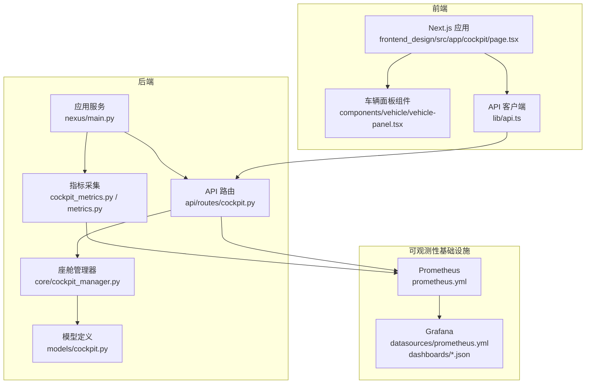
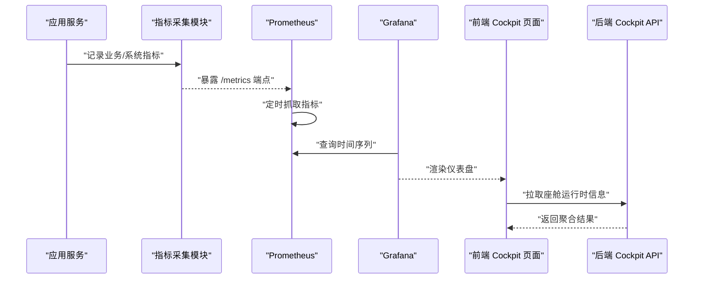
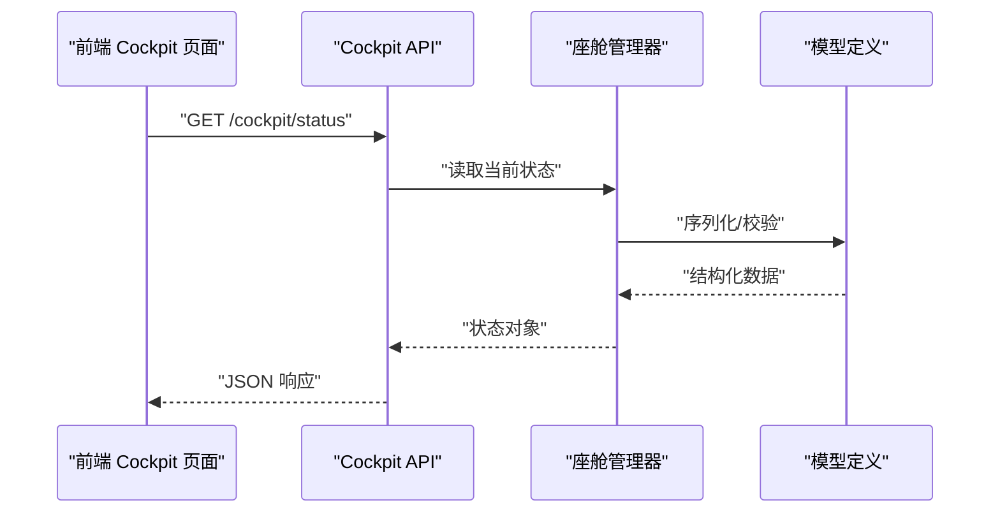
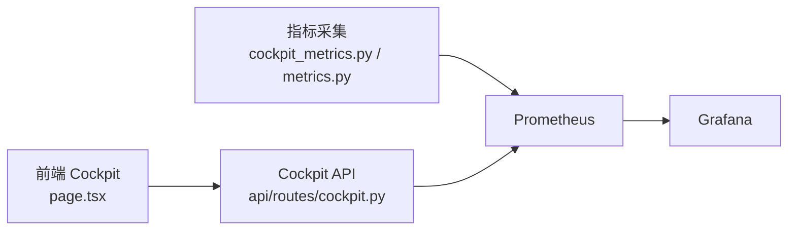

# 座舱监控看板

<cite>
**本文引用的文件**   
- [config/grafana/provisioning/dashboards/dashboards.yml](file://config/grafana/provisioning/dashboards/dashboards.yml)
- [config/grafana/provisioning/dashboards/nexuscockpit-overview.json](file://config/grafana/provisioning/dashboards/nexuscockpit-overview.json)
- [config/grafana/provisioning/datasources/prometheus.yml](file://config/grafana/provisioning/datasources/prometheus.yml)
- [backend_design/nexus/observability/cockpit_metrics.py](file://backend_design/nexus/observability/cockpit_metrics.py)
- [backend_design/nexus/observability/metrics.py](file://backend_design/nexus/observability/metrics.py)
- [backend_design/nexus/api/routes/cockpit.py](file://backend_design/nexus/api/routes/cockpit.py)
- [backend_design/nexus/core/cockpit_manager.py](file://backend_design/nexus/core/cockpit_manager.py)
- [backend_design/nexus/models/cockpit.py](file://backend_design/nexus/models/cockpit.py)
- [backend_design/nexus/config.py](file://backend_design/nexus/config.py)
- [frontend_design/src/app/cockpit/page.tsx](file://frontend_design/src/app/cockpit/page.tsx)
- [frontend_design/src/components/vehicle/vehicle-panel.tsx](file://frontend_design/src/components/vehicle/vehicle-panel.tsx)
- [frontend_design/src/lib/api.ts](file://frontend_design/src/lib/api.ts)
- [docker-compose.yml](file://docker-compose.yml)
</cite>

## 目录
1. [简介](#简介)
2. [项目结构](#项目结构)
3. [核心组件](#核心组件)
4. [架构总览](#架构总览)
5. [详细组件分析](#详细组件分析)
6. [依赖关系分析](#依赖关系分析)
7. [性能与优化](#性能与优化)
8. [告警与通知](#告警与通知)
9. [故障排查指南](#故障排查指南)
10. [结论](#结论)
11. [附录](#附录)

## 简介
本技术文档围绕 NexusCockpit 座舱监控看板，系统性说明 Grafana 看板的配置、布局设计、数据源与可视化组件选择；阐述实时监控数据的展示逻辑（关键业务指标、系统健康状态、性能趋势）；给出告警规则配置建议（阈值、通知渠道、升级策略）；提供自定义看板开发指南、查询优化与响应式适配方法；并覆盖历史回溯、对比分析与容量预测等高级能力。同时结合后端指标采集、API 暴露与前端页面集成，形成端到端的运维使用案例与快速定位方法。

## 项目结构
NexusCockpit 的监控看板由“后端指标采集 + Prometheus 存储 + Grafana 可视化”构成，并通过 API 暴露部分运行时信息供前端 Cockpit 页面聚合展示。

图表来源
- [backend_design/nexus/observability/cockpit_metrics.py](file://backend_design/nexus/observability/cockpit_metrics.py)
- [backend_design/nexus/observability/metrics.py](file://backend_design/nexus/observability/metrics.py)
- [backend_design/nexus/api/routes/cockpit.py](file://backend_design/nexus/api/routes/cockpit.py)
- [backend_design/nexus/core/cockpit_manager.py](file://backend_design/nexus/core/cockpit_manager.py)
- [backend_design/nexus/models/cockpit.py](file://backend_design/nexus/models/cockpit.py)
- [config/grafana/provisioning/datasources/prometheus.yml](file://config/grafana/provisioning/datasources/prometheus.yml)
- [config/grafana/provisioning/dashboards/nexuscockpit-overview.json](file://config/grafana/provisioning/dashboards/nexuscockpit-overview.json)
- [frontend_design/src/app/cockpit/page.tsx](file://frontend_design/src/app/cockpit/page.tsx)
- [frontend_design/src/components/vehicle/vehicle-panel.tsx](file://frontend_design/src/components/vehicle/vehicle-panel.tsx)
- [frontend_design/src/lib/api.ts](file://frontend_design/src/lib/api.ts)

章节来源
- [config/grafana/provisioning/dashboards/dashboards.yml](file://config/grafana/provisioning/dashboards/dashboards.yml)
- [config/grafana/provisioning/datasources/prometheus.yml](file://config/grafana/provisioning/datasources/prometheus.yml)
- [config/grafana/provisioning/dashboards/nexuscockpit-overview.json](file://config/grafana/provisioning/dashboards/nexuscockpit-overview.json)
- [backend_design/nexus/observability/cockpit_metrics.py](file://backend_design/nexus/observability/cockpit_metrics.py)
- [backend_design/nexus/observability/metrics.py](file://backend_design/nexus/observability/metrics.py)
- [backend_design/nexus/api/routes/cockpit.py](file://backend_design/nexus/api/routes/cockpit.py)
- [backend_design/nexus/core/cockpit_manager.py](file://backend_design/nexus/core/cockpit_manager.py)
- [backend_design/nexus/models/cockpit.py](file://backend_design/nexus/models/cockpit.py)
- [frontend_design/src/app/cockpit/page.tsx](file://frontend_design/src/app/cockpit/page.tsx)
- [frontend_design/src/components/vehicle/vehicle-panel.tsx](file://frontend_design/src/components/vehicle/vehicle-panel.tsx)
- [frontend_design/src/lib/api.ts](file://frontend_design/src/lib/api.ts)

## 核心组件
- 指标采集层：负责在应用运行期采集关键指标（如请求量、错误率、延迟分位、资源使用、业务指标），并暴露给 Prometheus 抓取。
- 数据持久化层：Prometheus 作为时序数据库，提供高效的时间序列存储与查询。
- 可视化层：Grafana 通过 Provisioning 自动注册数据源与仪表盘，统一呈现实时与历史数据。
- API 与前端集成：后端提供 Cockpit 相关 API，前端 Next.js 页面聚合多源数据，实现交互式座舱视图。

章节来源
- [backend_design/nexus/observability/cockpit_metrics.py](file://backend_design/nexus/observability/cockpit_metrics.py)
- [backend_design/nexus/observability/metrics.py](file://backend_design/nexus/observability/metrics.py)
- [config/grafana/provisioning/datasources/prometheus.yml](file://config/grafana/provisioning/datasources/prometheus.yml)
- [config/grafana/provisioning/dashboards/nexuscockpit-overview.json](file://config/grafana/provisioning/dashboards/nexuscockpit-overview.json)
- [backend_design/nexus/api/routes/cockpit.py](file://backend_design/nexus/api/routes/cockpit.py)
- [frontend_design/src/app/cockpit/page.tsx](file://frontend_design/src/app/cockpit/page.tsx)

## 架构总览
下图展示了从指标采集到可视化的完整链路，以及前端 Cockpit 页面的数据获取路径。

图表来源
- [backend_design/nexus/observability/cockpit_metrics.py](file://backend_design/nexus/observability/cockpit_metrics.py)
- [backend_design/nexus/observability/metrics.py](file://backend_design/nexus/observability/metrics.py)
- [config/grafana/provisioning/datasources/prometheus.yml](file://config/grafana/provisioning/datasources/prometheus.yml)
- [config/grafana/provisioning/dashboards/nexuscockpit-overview.json](file://config/grafana/provisioning/dashboards/nexuscockpit-overview.json)
- [backend_design/nexus/api/routes/cockpit.py](file://backend_design/nexus/api/routes/cockpit.py)
- [frontend_design/src/app/cockpit/page.tsx](file://frontend_design/src/app/cockpit/page.tsx)

## 详细组件分析

### Grafana 看板配置
- 数据源配置
  - 通过 Provisioning 自动注册 Prometheus 数据源，确保 Grafana 启动即可用。
  - 典型字段包括名称、类型、URL、访问模式、认证方式等。
- 仪表盘注册
  - 通过 dashboards.yml 声明需要导入的 JSON 仪表盘文件。
  - 示例包含 overview 类仪表盘，用于集中展示座舱关键指标与健康状态。
- 仪表盘内容要点
  - 布局分区：概览区（KPI）、健康状态区（红黄绿指示器）、趋势区（折线/面积图）、明细区（表格/热力图）。
  - 变量与过滤：支持按租户、设备、区域等维度筛选。
  - 刷新策略：短周期轮询与长周期历史查询分离，避免大屏抖动。

章节来源
- [config/grafana/provisioning/datasources/prometheus.yml](file://config/grafana/provisioning/datasources/prometheus.yml)
- [config/grafana/provisioning/dashboards/dashboards.yml](file://config/grafana/provisioning/dashboards/dashboards.yml)
- [config/grafana/provisioning/dashboards/nexuscockpit-overview.json](file://config/grafana/provisioning/dashboards/nexuscockpit-overview.json)

### 指标采集与暴露
- 指标分类
  - 系统指标：CPU、内存、磁盘、网络、进程数等。
  - 应用指标：QPS、错误率、P95/P99 延迟、连接池、队列长度等。
  - 业务指标：会话数、意图识别成功率、技能调用次数、TTS/ASR 耗时等。
- 采集与导出
  - 在关键路径埋点计数与计时，汇总为计数器、直方图、摘要等类型。
  - 暴露标准 /metrics 接口供 Prometheus 抓取。
- 命名与标签
  - 采用一致的命名规范与标签体系，便于跨域聚合与多维分析。

章节来源
- [backend_design/nexus/observability/cockpit_metrics.py](file://backend_design/nexus/observability/cockpit_metrics.py)
- [backend_design/nexus/observability/metrics.py](file://backend_design/nexus/observability/metrics.py)

### Cockpit API 与前端集成
- API 职责
  - 提供座舱运行时信息聚合接口，如健康检查、关键指标快照、最近事件列表等。
  - 与座舱管理器协作，读取当前状态与缓存。
- 前端交互
  - Cockpit 页面聚合 API 与 Grafana 嵌入视图，形成统一的座舱体验。
  - 车辆面板组件承载具体业务子视图（如车辆状态、媒体、导航等）。
- 数据流
  - 前端定时拉取 API，结合 Grafana 面板进行联动过滤与钻取。

图表来源
- [backend_design/nexus/api/routes/cockpit.py](file://backend_design/nexus/api/routes/cockpit.py)
- [backend_design/nexus/core/cockpit_manager.py](file://backend_design/nexus/core/cockpit_manager.py)
- [backend_design/nexus/models/cockpit.py](file://backend_design/nexus/models/cockpit.py)
- [frontend_design/src/app/cockpit/page.tsx](file://frontend_design/src/app/cockpit/page.tsx)
- [frontend_design/src/components/vehicle/vehicle-panel.tsx](file://frontend_design/src/components/vehicle/vehicle-panel.tsx)
- [frontend_design/src/lib/api.ts](file://frontend_design/src/lib/api.ts)

章节来源
- [backend_design/nexus/api/routes/cockpit.py](file://backend_design/nexus/api/routes/cockpit.py)
- [backend_design/nexus/core/cockpit_manager.py](file://backend_design/nexus/core/cockpit_manager.py)
- [backend_design/nexus/models/cockpit.py](file://backend_design/nexus/models/cockpit.py)
- [frontend_design/src/app/cockpit/page.tsx](file://frontend_design/src/app/cockpit/page.tsx)
- [frontend_design/src/components/vehicle/vehicle-panel.tsx](file://frontend_design/src/components/vehicle/vehicle-panel.tsx)
- [frontend_design/src/lib/api.ts](file://frontend_design/src/lib/api.ts)

### 实时监控展示逻辑
- 关键业务指标面板
  - 使用 KPI 卡片展示 QPS、错误率、P95/P99、活跃会话等。
  - 支持同比/环比切换与阈值颜色标记。
- 系统健康状态监控
  - 以红黄绿状态灯或环形进度条表示整体健康度。
  - 关联子系统健康检查与依赖可用性。
- 性能趋势分析
  - 折线图/面积图展示延迟分布、吞吐变化。
  - 热力图展示时段负载与异常热点。

章节来源
- [config/grafana/provisioning/dashboards/nexuscockpit-overview.json](file://config/grafana/provisioning/dashboards/nexuscockpit-overview.json)

### 告警规则配置
- 阈值设置
  - 基于历史基线与业务 SLI/SLO 设定静态/动态阈值。
  - 针对突发流量与季节性波动采用滑动窗口与去噪策略。
- 通知渠道
  - 支持邮件、企业微信、钉钉、Slack、Webhook 等。
  - 告警模板包含上下文（实例、标签、关联日志链接）。
- 告警升级策略
  - 多级升级：警告 -> 严重 -> 紧急，按持续时间与影响面升级。
  - 抑制与合并：同因告警合并，避免风暴。

章节来源
- [config/grafana/provisioning/datasources/prometheus.yml](file://config/grafana/provisioning/datasources/prometheus.yml)
- [config/grafana/provisioning/dashboards/nexuscockpit-overview.json](file://config/grafana/provisioning/dashboards/nexuscockpit-overview.json)

### 自定义看板开发指南
- 新建仪表盘
  - 在 Provisioning 目录下新增 JSON 文件，并在 dashboards.yml 中注册。
  - 复用现有变量与主题样式，保持风格一致。
- 数据查询优化
  - 优先使用降采样与聚合函数减少数据量。
  - 合理设置时间范围与刷新间隔，避免频繁全量查询。
- 响应式设计适配
  - 使用自适应网格布局，在大屏与小屏下均能良好显示。
  - 对复杂图表提供折叠与分页，提升可读性。

章节来源
- [config/grafana/provisioning/dashboards/dashboards.yml](file://config/grafana/provisioning/dashboards/dashboards.yml)
- [config/grafana/provisioning/dashboards/nexuscockpit-overview.json](file://config/grafana/provisioning/dashboards/nexuscockpit-overview.json)

### 历史回溯、对比分析与容量预测
- 历史回溯
  - 利用 Prometheus 长期存储与 Grafana 时间选择器，回放任意时间段。
  - 结合日志检索工具进行根因定位。
- 对比分析
  - 同一指标在不同环境/版本/租户间的对比视图。
  - 使用比率与差值面板突出差异。
- 容量预测
  - 基于线性回归或指数平滑对关键指标进行短期预测。
  - 结合业务增长曲线制定扩容计划。

章节来源
- [config/grafana/provisioning/datasources/prometheus.yml](file://config/grafana/provisioning/datasources/prometheus.yml)
- [config/grafana/provisioning/dashboards/nexuscockpit-overview.json](file://config/grafana/provisioning/dashboards/nexuscockpit-overview.json)

## 依赖关系分析
- 组件耦合
  - 指标采集与 API 解耦，通过标准 /metrics 与 REST 接口分别对外暴露。
  - Grafana 仅依赖 Prometheus 数据源，不直接耦合后端。
- 外部依赖
  - Prometheus 负责时序存储与查询。
  - 可选 Loki/ELK 用于日志关联分析。
- 潜在风险
  - 高基数标签导致存储膨胀，需控制标签数量与取值空间。
  - 大查询导致 Grafana 超时，需优化 PromQL 与索引。

图表来源
- [backend_design/nexus/observability/cockpit_metrics.py](file://backend_design/nexus/observability/cockpit_metrics.py)
- [backend_design/nexus/observability/metrics.py](file://backend_design/nexus/observability/metrics.py)
- [backend_design/nexus/api/routes/cockpit.py](file://backend_design/nexus/api/routes/cockpit.py)
- [config/grafana/provisioning/datasources/prometheus.yml](file://config/grafana/provisioning/datasources/prometheus.yml)
- [frontend_design/src/app/cockpit/page.tsx](file://frontend_design/src/app/cockpit/page.tsx)

章节来源
- [backend_design/nexus/observability/cockpit_metrics.py](file://backend_design/nexus/observability/cockpit_metrics.py)
- [backend_design/nexus/observability/metrics.py](file://backend_design/nexus/observability/metrics.py)
- [backend_design/nexus/api/routes/cockpit.py](file://backend_design/nexus/api/routes/cockpit.py)
- [config/grafana/provisioning/datasources/prometheus.yml](file://config/grafana/provisioning/datasources/prometheus.yml)
- [frontend_design/src/app/cockpit/page.tsx](file://frontend_design/src/app/cockpit/page.tsx)

## 性能与优化
- 指标侧
  - 控制标签基数，避免高基数导致的存储与查询压力。
  - 使用直方图/摘要替代高频采样，降低开销。
- 查询侧
  - 使用降采样与预聚合，缩短查询时延。
  - 合理设置 Grafana 刷新频率与时间窗口。
- 前端侧
  - 懒加载与按需渲染，减少首屏压力。
  - 对大图表采用分页与虚拟滚动。

[本节为通用指导，无需特定文件引用]

## 告警与通知
- 阈值策略
  - 静态阈值：适用于稳定场景。
  - 动态阈值：基于历史均值与方差计算，适应波动。
- 通知渠道
  - 多渠道冗余，重要告警双通道发送。
  - 告警消息包含上下文与一键跳转链接。
- 升级与抑制
  - 按持续时长与影响面分级升级。
  - 维护窗口内抑制非关键告警。

章节来源
- [config/grafana/provisioning/datasources/prometheus.yml](file://config/grafana/provisioning/datasources/prometheus.yml)
- [config/grafana/provisioning/dashboards/nexuscockpit-overview.json](file://config/grafana/provisioning/dashboards/nexuscockpit-overview.json)

## 故障排查指南
- 常见问题
  - 指标缺失：检查 /metrics 是否暴露、Prometheus 抓取是否正常。
  - 看板空白：确认数据源连通性与权限。
  - 查询缓慢：优化 PromQL、增加索引或降采样。
- 快速定位
  - 从概览面板定位异常维度（租户/设备/区域）。
  - 结合日志与链路追踪进行根因分析。
  - 使用对比视图验证变更影响。

章节来源
- [config/grafana/provisioning/datasources/prometheus.yml](file://config/grafana/provisioning/datasources/prometheus.yml)
- [config/grafana/provisioning/dashboards/nexuscockpit-overview.json](file://config/grafana/provisioning/dashboards/nexuscockpit-overview.json)

## 结论
NexusCockpit 座舱监控看板通过标准化的指标采集、稳定的时序存储与灵活的可视化编排，实现了从系统健康到业务指标的端到端监控。配合完善的告警与通知机制，以及历史回溯与容量预测能力，能够有效支撑日常运维与重大保障场景。建议在后续迭代中持续优化指标质量与查询性能，完善告警治理与自动化处置流程。

[本节为总结性内容，无需特定文件引用]

## 附录
- 部署参考
  - docker-compose 编排了应用、Prometheus、Grafana 等组件，便于本地与测试环境快速拉起。
- 配置文件位置
  - Grafana 数据源与仪表盘 Provisioning 位于 config/grafana/provisioning 目录。
  - 应用配置位于 backend_design/nexus/config.py。

章节来源
- [docker-compose.yml](file://docker-compose.yml)
- [config/grafana/provisioning/datasources/prometheus.yml](file://config/grafana/provisioning/datasources/prometheus.yml)
- [config/grafana/provisioning/dashboards/dashboards.yml](file://config/grafana/provisioning/dashboards/dashboards.yml)
- [backend_design/nexus/config.py](file://backend_design/nexus/config.py)