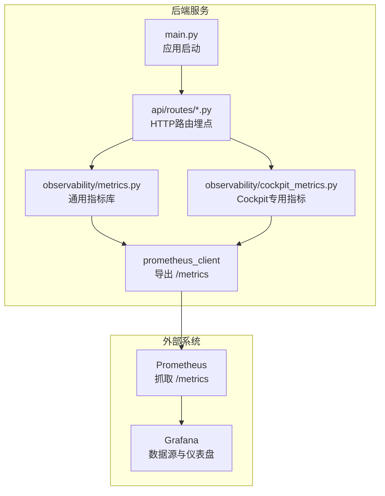
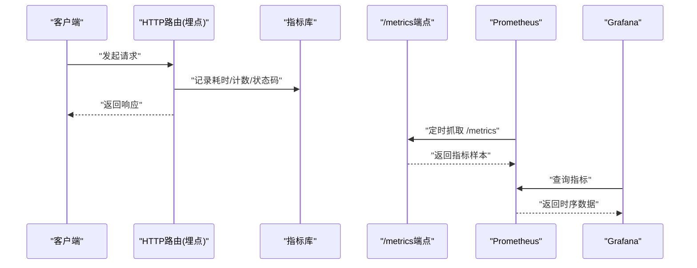
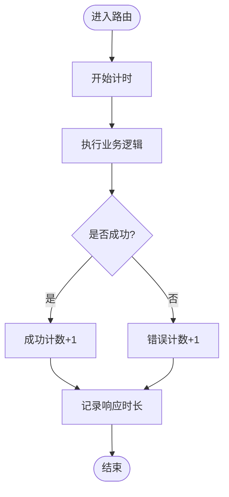
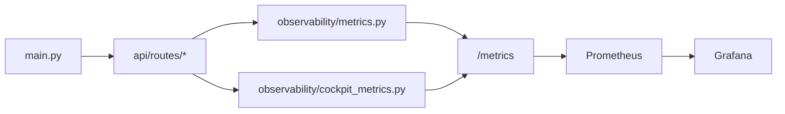

# 指标监控

<cite>
**本文引用的文件**   
- [backend_design/nexus/observability/metrics.py](file://backend_design/nexus/observability/metrics.py)
- [backend_design/nexus/observability/cockpit_metrics.py](file://backend_design/nexus/observability/cockpit_metrics.py)
- [backend_design/nexus/observability/data_retention.py](file://backend_design/nexus/observability/data_retention.py)
- [config/prometheus/prometheus.yml](file://config/prometheus/prometheus.yml)
- [config/grafana/provisioning/datasources/prometheus.yml](file://config/grafana/provisioning/datasources/prometheus.yml)
- [config/grafana/provisioning/dashboards/dashboards.yml](file://config/grafana/provisioning/dashboards/dashboards.yml)
- [config/grafana/provisioning/dashboards/nexuscockpit-overview.json](file://config/grafana/provisioning/dashboards/nexuscockpit-overview.json)
- [backend_design/nexus/api/routes/health.py](file://backend_design/nexus/api/routes/health.py)
- [backend_design/nexus/api/routes/chat.py](file://backend_design/nexus/api/routes/chat.py)
- [backend_design/nexus/api/routes/cockpit.py](file://backend_design/nexus/api/routes/cockpit.py)
- [backend_design/nexus/core/logger.py](file://backend_design/nexus/core/logger.py)
- [backend_design/nexus/config.py](file://backend_design/nexus/config.py)
- [backend_design/nexus/main.py](file://backend_design/nexus/main.py)
- [docker-compose.yml](file://docker-compose.yml)
</cite>

## 目录
1. [简介](#简介)
2. [项目结构](#项目结构)
3. [核心组件](#核心组件)
4. [架构总览](#架构总览)
5. [详细组件分析](#详细组件分析)
6. [依赖关系分析](#依赖关系分析)
7. [性能考量](#性能考量)
8. [故障排查指南](#故障排查指南)
9. [结论](#结论)
10. [附录](#附录)

## 简介
本技术文档面向Nexus Cockpit的指标监控系统，聚焦Prometheus指标采集的配置与策略、自定义指标的注册与收集机制、关键业务指标定义（API响应时间、错误率、内存使用率、CPU利用率等）、Cockpit专用指标的采集逻辑与性能监控点、Prometheus配置文件结构与查询语法示例、告警规则配置方法与阈值建议，以及指标数据的保留策略与容量规划。文档旨在帮助开发与运维人员快速理解并落地可观测性方案。

## 项目结构
本项目在后端可观测性方面采用分层组织：
- observability层：负责指标定义、采集、导出与数据保留策略
- api层：在关键路由中埋点，暴露指标采集入口
- config层：提供Prometheus与Grafana的集成配置
- main层：应用启动时初始化可观测性组件

图表来源
- [backend_design/nexus/main.py](file://backend_design/nexus/main.py)
- [backend_design/nexus/api/routes/chat.py](file://backend_design/nexus/api/routes/chat.py)
- [backend_design/nexus/api/routes/cockpit.py](file://backend_design/nexus/api/routes/cockpit.py)
- [backend_design/nexus/observability/metrics.py](file://backend_design/nexus/observability/metrics.py)
- [backend_design/nexus/observability/cockpit_metrics.py](file://backend_design/nexus/observability/cockpit_metrics.py)
- [config/prometheus/prometheus.yml](file://config/prometheus/prometheus.yml)
- [config/grafana/provisioning/datasources/prometheus.yml](file://config/grafana/provisioning/datasources/prometheus.yml)
- [config/grafana/provisioning/dashboards/dashboards.yml](file://config/grafana/provisioning/dashboards/dashboards.yml)
- [config/grafana/provisioning/dashboards/nexuscockpit-overview.json](file://config/grafana/provisioning/dashboards/nexuscockpit-overview.json)

章节来源
- [backend_design/nexus/main.py](file://backend_design/nexus/main.py)
- [backend_design/nexus/observability/metrics.py](file://backend_design/nexus/observability/metrics.py)
- [backend_design/nexus/observability/cockpit_metrics.py](file://backend_design/nexus/observability/cockpit_metrics.py)
- [config/prometheus/prometheus.yml](file://config/prometheus/prometheus.yml)
- [config/grafana/provisioning/datasources/prometheus.yml](file://config/grafana/provisioning/datasources/prometheus.yml)
- [config/grafana/provisioning/dashboards/dashboards.yml](file://config/grafana/provisioning/dashboards/dashboards.yml)
- [config/grafana/provisioning/dashboards/nexuscockpit-overview.json](file://config/grafana/provisioning/dashboards/nexuscockpit-overview.json)

## 核心组件
- 通用指标库：封装常用计数器、直方图、摘要等类型，统一命名规范与标签维度，便于跨模块复用
- Cockpit专用指标：围绕Cockpit业务域（会话、技能、车辆控制、语音交互）定义细粒度指标
- 数据保留策略：定义指标数据生命周期管理，包括滚动清理与归档策略
- Prometheus集成：通过标准HTTP端点暴露指标，供Prometheus周期性抓取
- Grafana集成：预置数据源与仪表盘，开箱即用

章节来源
- [backend_design/nexus/observability/metrics.py](file://backend_design/nexus/observability/metrics.py)
- [backend_design/nexus/observability/cockpit_metrics.py](file://backend_design/nexus/observability/cockpit_metrics.py)
- [backend_design/nexus/observability/data_retention.py](file://backend_design/nexus/observability/data_retention.py)

## 架构总览
整体架构遵循“应用内埋点 + 标准指标导出 + Prometheus抓取 + Grafana可视化”的模式。

图表来源
- [backend_design/nexus/api/routes/chat.py](file://backend_design/nexus/api/routes/chat.py)
- [backend_design/nexus/api/routes/cockpit.py](file://backend_design/nexus/api/routes/cockpit.py)
- [backend_design/nexus/observability/metrics.py](file://backend_design/nexus/observability/metrics.py)
- [config/prometheus/prometheus.yml](file://config/prometheus/prometheus.yml)
- [config/grafana/provisioning/datasources/prometheus.yml](file://config/grafana/provisioning/datasources/prometheus.yml)

## 详细组件分析

### 通用指标库（metrics.py）
- 职责
  - 提供统一的指标创建与更新接口
  - 定义常见指标类型（计数器、直方图、摘要、信息型指标）
  - 维护命名空间与标签约定，避免重复与冲突
- 设计要点
  - 延迟注册：在模块加载时完成指标注册，避免运行时开销
  - 标签维度：按模块、路径、方法、状态码等维度拆分，便于聚合分析
  - 采样策略：对高QPS场景采用合适的分桶或摘要参数，平衡精度与开销
- 典型指标类别
  - HTTP相关：请求总数、错误数、响应时长分布
  - 资源相关：内存占用、CPU使用率、GC次数（如适用）
  - 业务相关：调用成功率、超时次数、重试次数

章节来源
- [backend_design/nexus/observability/metrics.py](file://backend_design/nexus/observability/metrics.py)

### Cockpit专用指标（cockpit_metrics.py）
- 职责
  - 围绕Cockpit业务域定义专用指标，覆盖会话生命周期、技能执行、车辆控制、语音交互等
- 关键监控点
  - 会话指标：新建会话数、活跃会话数、会话平均时长、会话失败数
  - 技能指标：技能调用次数、成功率、平均耗时、异常分类计数
  - 车辆控制：指令下发次数、成功/失败、端到端延迟
  - 语音交互：ASR/TTS调用次数、识别/合成成功率、平均耗时
- 数据采集位置
  - 在对应API路由入口处开始计时，出口处结束并记录结果
  - 在关键子流程（意图识别、工具调用、外部依赖）插入埋点

章节来源
- [backend_design/nexus/observability/cockpit_metrics.py](file://backend_design/nexus/observability/cockpit_metrics.py)
- [backend_design/nexus/api/routes/cockpit.py](file://backend_design/nexus/api/routes/cockpit.py)

### 数据保留策略（data_retention.py）
- 职责
  - 定义指标数据生命周期管理策略，包括滚动清理、归档与压缩
- 策略要素
  - 时间窗口：按小时/天/周进行数据切片
  - 存储层级：热数据（短期高频访问）、温数据（中期分析）、冷数据（长期归档）
  - 清理任务：后台任务定期扫描并删除过期数据
- 与Prometheus的关系
  - 本地指标通常由Prometheus持久化；如需本地缓存或中间态数据，可按此策略管理

章节来源
- [backend_design/nexus/observability/data_retention.py](file://backend_design/nexus/observability/data_retention.py)

### Prometheus抓取配置（prometheus.yml）
- 目标
  - 配置抓取目标、抓取间隔、标签重写、安全认证等
- 关键项说明
  - scrape_configs：定义抓取作业，包含job_name、targets、metrics_path、scheme、basic_auth等
  - global：全局抓取间隔、超时等
  - rule_files：引入告警规则文件
- 最佳实践
  - 为不同服务划分独立job，便于隔离与扩容
  - 合理设置scrape_interval与evaluation_interval，兼顾实时性与负载
  - 使用relabel_configs对指标进行过滤与标准化

章节来源
- [config/prometheus/prometheus.yml](file://config/prometheus/prometheus.yml)

### Grafana数据源与仪表盘
- 数据源
  - 指向Prometheus实例，支持多集群与只读账号
- 仪表盘
  - 预置Overview仪表盘，展示关键业务与健康指标
  - 支持按租户、环境、版本等维度筛选

章节来源
- [config/grafana/provisioning/datasources/prometheus.yml](file://config/grafana/provisioning/datasources/prometheus.yml)
- [config/grafana/provisioning/dashboards/dashboards.yml](file://config/grafana/provisioning/dashboards/dashboards.yml)
- [config/grafana/provisioning/dashboards/nexuscockpit-overview.json](file://config/grafana/provisioning/dashboards/nexuscockpit-overview.json)

### API埋点与指标采集流程
- 健康检查
  - 健康探针用于存活与就绪检测，同时输出基础指标
- 聊天与会话
  - 在聊天路由中记录请求量、错误率、响应时长分布，并按会话ID与用户维度打标签
- Cockpit控制
  - 在车辆控制、技能执行等关键路径埋点，统计成功率与延迟

图表来源
- [backend_design/nexus/api/routes/health.py](file://backend_design/nexus/api/routes/health.py)
- [backend_design/nexus/api/routes/chat.py](file://backend_design/nexus/api/routes/chat.py)
- [backend_design/nexus/api/routes/cockpit.py](file://backend_design/nexus/api/routes/cockpit.py)
- [backend_design/nexus/observability/metrics.py](file://backend_design/nexus/observability/metrics.py)

章节来源
- [backend_design/nexus/api/routes/health.py](file://backend_design/nexus/api/routes/health.py)
- [backend_design/nexus/api/routes/chat.py](file://backend_design/nexus/api/routes/chat.py)
- [backend_design/nexus/api/routes/cockpit.py](file://backend_design/nexus/api/routes/cockpit.py)
- [backend_design/nexus/observability/metrics.py](file://backend_design/nexus/observability/metrics.py)

## 依赖关系分析
- 组件耦合
  - api路由依赖指标库与Cockpit专用指标，形成松耦合的埋点方式
  - main负责初始化与生命周期管理，集中注入可观测性能力
- 外部依赖
  - Prometheus通过HTTP抓取指标
  - Grafana通过数据源读取Prometheus时序数据
- 潜在风险
  - 指标标签基数过高导致存储膨胀
  - 过度埋点影响主链路性能

图表来源
- [backend_design/nexus/main.py](file://backend_design/nexus/main.py)
- [backend_design/nexus/api/routes/chat.py](file://backend_design/nexus/api/routes/chat.py)
- [backend_design/nexus/api/routes/cockpit.py](file://backend_design/nexus/api/routes/cockpit.py)
- [backend_design/nexus/observability/metrics.py](file://backend_design/nexus/observability/metrics.py)
- [backend_design/nexus/observability/cockpit_metrics.py](file://backend_design/nexus/observability/cockpit_metrics.py)
- [config/prometheus/prometheus.yml](file://config/prometheus/prometheus.yml)
- [config/grafana/provisioning/datasources/prometheus.yml](file://config/grafana/provisioning/datasources/prometheus.yml)

章节来源
- [backend_design/nexus/main.py](file://backend_design/nexus/main.py)
- [backend_design/nexus/observability/metrics.py](file://backend_design/nexus/observability/metrics.py)
- [backend_design/nexus/observability/cockpit_metrics.py](file://backend_design/nexus/observability/cockpit_metrics.py)
- [config/prometheus/prometheus.yml](file://config/prometheus/prometheus.yml)
- [config/grafana/provisioning/datasources/prometheus.yml](file://config/grafana/provisioning/datasources/prometheus.yml)

## 性能考量
- 指标类型选择
  - 高QPS场景优先使用计数器与直方图，谨慎使用摘要以避免额外计算
- 标签基数控制
  - 避免将高基数字段（如用户ID、设备序列号）作为标签；必要时使用外部存储关联
- 采样与分桶
  - 根据P95/P99需求调整直方图分桶边界，减少不必要的精度
- 抓取频率
  - 根据SLA要求设置合理的抓取间隔，避免Prometheus过载
- 资源监控
  - 结合系统指标（内存、CPU、磁盘IO）评估服务瓶颈

[本节为通用指导，不直接分析具体文件]

## 故障排查指南
- 常见问题
  - 指标缺失：检查路由埋点是否正确触发，确认/export端点可达
  - 指标基数爆炸：审查标签维度，移除高基数字段
  - 抓取失败：核对Prometheus配置中的targets与认证信息
  - 告警风暴：优化阈值与抑制规则，合并相似告警
- 定位步骤
  - 查看健康检查端点与日志
  - 在Grafana中检索指标是否存在与趋势是否正常
  - 检查Prometheus抓取日志与目标状态
  - 验证告警规则文件语法与生效状态

章节来源
- [backend_design/nexus/api/routes/health.py](file://backend_design/nexus/api/routes/health.py)
- [backend_design/nexus/core/logger.py](file://backend_design/nexus/core/logger.py)
- [config/prometheus/prometheus.yml](file://config/prometheus/prometheus.yml)

## 结论
通过标准化的指标库与Cockpit专用指标，配合Prometheus抓取与Grafana可视化，Nexus Cockpit实现了从业务到系统的全面可观测性。建议在上线前完成指标命名规范、标签基数治理与告警阈值调优，并结合数据保留策略进行容量规划，确保系统在稳定与成本之间取得平衡。

[本节为总结性内容，不直接分析具体文件]

## 附录

### 关键业务指标定义与建议
- API响应时间
  - 指标类型：直方图/摘要
  - 维度：路径、方法、状态码、租户
  - 建议阈值：P95 < 200ms，P99 < 500ms（视业务而定）
- 错误率
  - 指标类型：计数器（成功/失败）
  - 维度：路径、方法、错误类型
  - 建议阈值：错误率 > 1%触发警告，> 5%触发严重
- 内存使用率
  - 指标类型： Gauge
  - 维度：进程、容器
  - 建议阈值：> 80%触发警告，> 90%触发严重
- CPU利用率
  - 指标类型： Gauge
  - 维度：进程、容器
  - 建议阈值：> 70%触发警告，> 85%触发严重

[本节为概念性说明，不直接分析具体文件]

### Prometheus配置结构示例
- 全局配置
  - scrape_interval、evaluation_interval、scrape_timeout
- 抓取配置
  - job_name、targets、metrics_path、scheme、basic_auth、tls_config
- 标签重写
  - relabel_configs用于过滤与标准化
- 规则文件
  - rule_files引入告警规则

章节来源
- [config/prometheus/prometheus.yml](file://config/prometheus/prometheus.yml)

### 查询语法示例
- 请求总量
  - sum(rate(http_requests_total{job="nexus_cockpit"}[5m]))
- 错误率
  - sum(rate(http_errors_total{job="nexus_cockpit"}[5m])) / sum(rate(http_requests_total{job="nexus_cockpit"}[5m]))
- P95响应时长
  - histogram_quantile(0.95, sum(rate(http_request_duration_seconds_bucket{job="nexus_cockpit"}[5m])) by (le))
- 内存使用率
  - process_resident_memory_bytes / node_memory_MemTotal_bytes * 100
- CPU利用率
  - rate(process_cpu_seconds_total[5m])

[本节为概念性说明，不直接分析具体文件]

### 告警规则配置方法与阈值建议
- 规则文件
  - 在Prometheus配置中引入rule_files
- 规则结构
  - groups与rules，包含expr、for、labels、annotations
- 阈值建议
  - 基于历史SLO与业务容忍度设定，逐步迭代优化
- 抑制与静默
  - 使用inhibit_rules避免级联告警风暴

章节来源
- [config/prometheus/prometheus.yml](file://config/prometheus/prometheus.yml)

### 指标数据保留策略与容量规划
- 保留策略
  - 热数据：短期（如7天），用于实时监控与快速排障
  - 温数据：中期（如30天），用于趋势分析与容量评估
  - 冷数据：长期（如90天以上），用于合规与审计
- 容量规划
  - 估算指标数量、标签基数、抓取频率与存储增长
  - 结合磁盘I/O与网络带宽评估Prometheus集群规模
  - 考虑冷热分层与归档以降低长期存储成本

章节来源
- [backend_design/nexus/observability/data_retention.py](file://backend_design/nexus/observability/data_retention.py)

### 部署与集成参考
- Docker Compose
  - 编排后端服务、Prometheus与Grafana，统一环境变量与端口映射
- 环境变量
  - 通过config.py集中管理配置项，便于多环境切换

章节来源
- [docker-compose.yml](file://docker-compose.yml)
- [backend_design/nexus/config.py](file://backend_design/nexus/config.py)