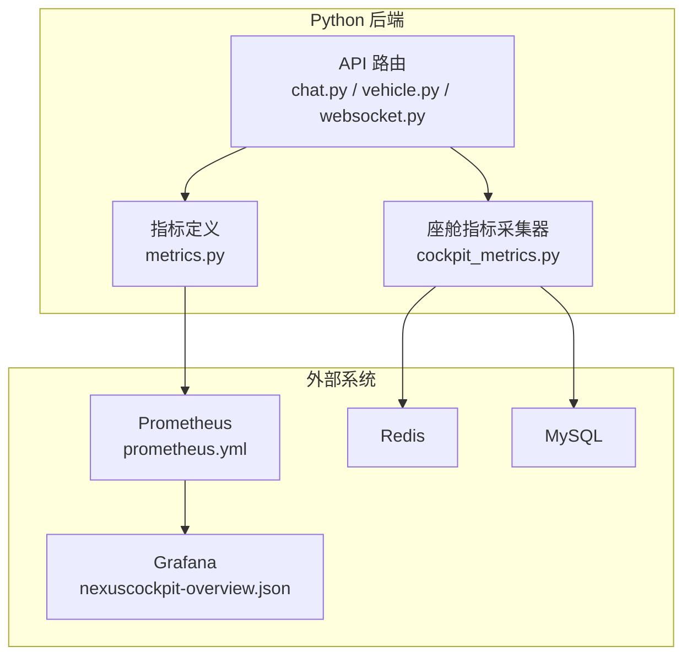
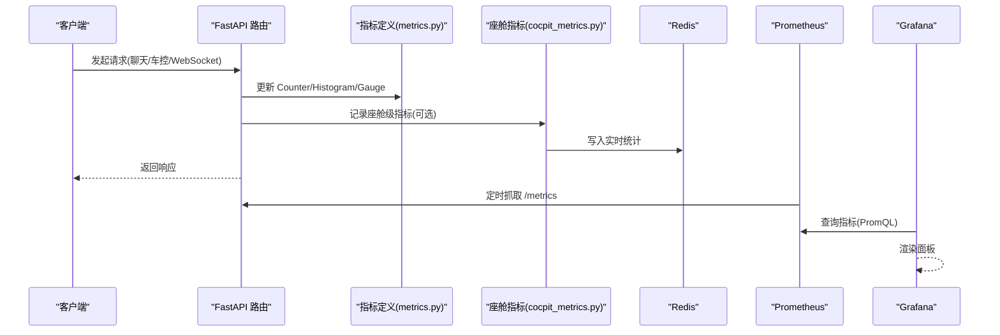
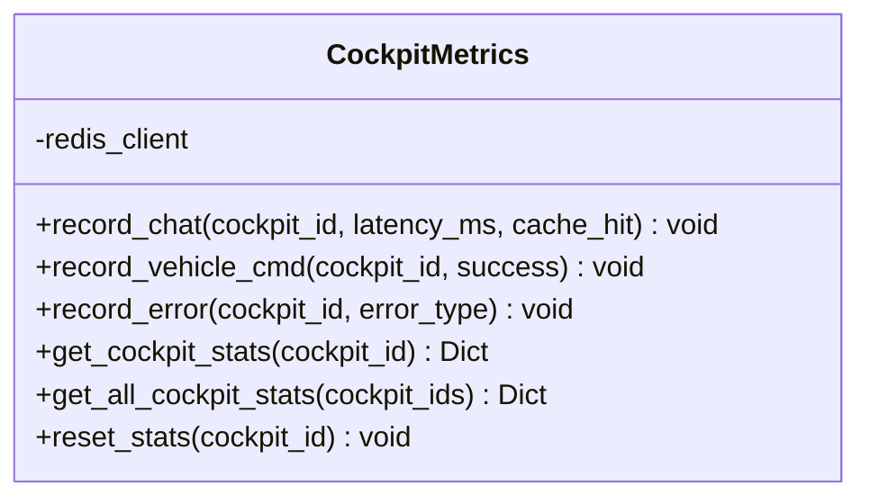
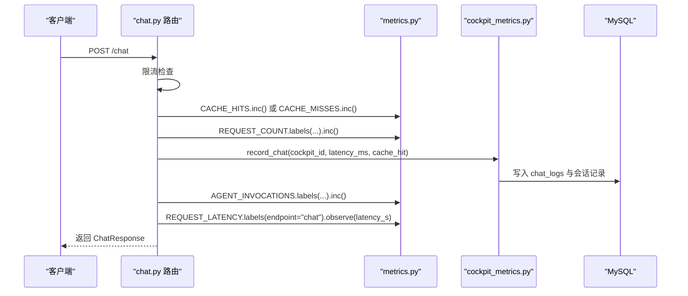
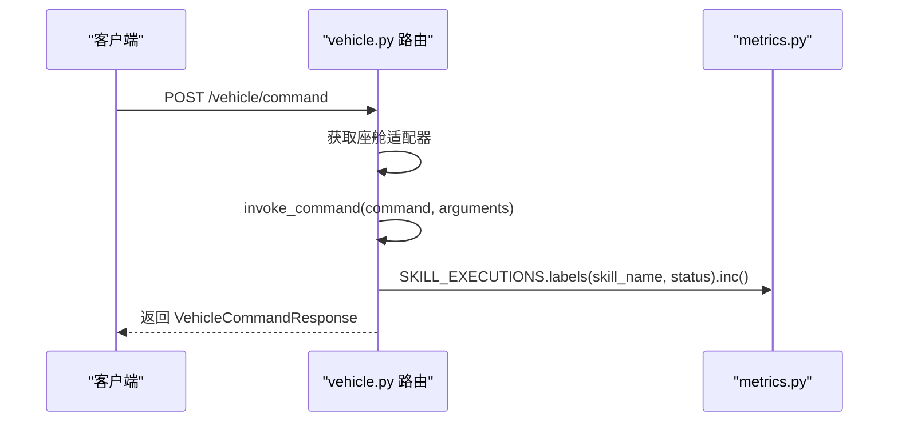
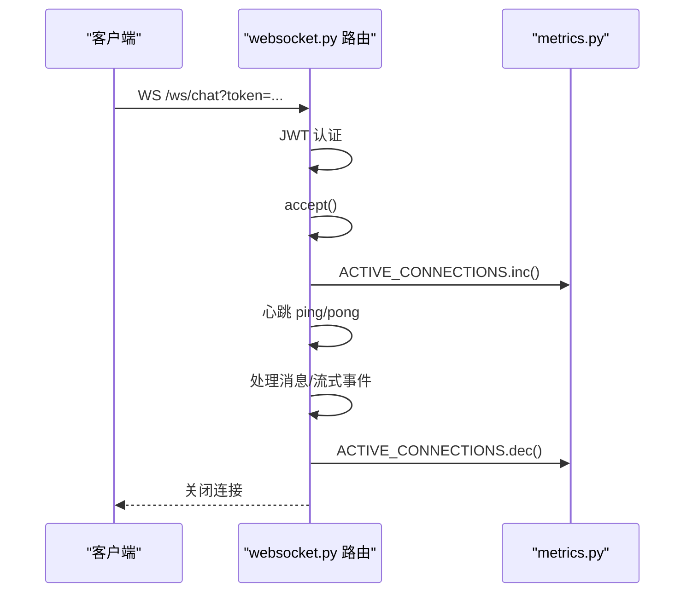
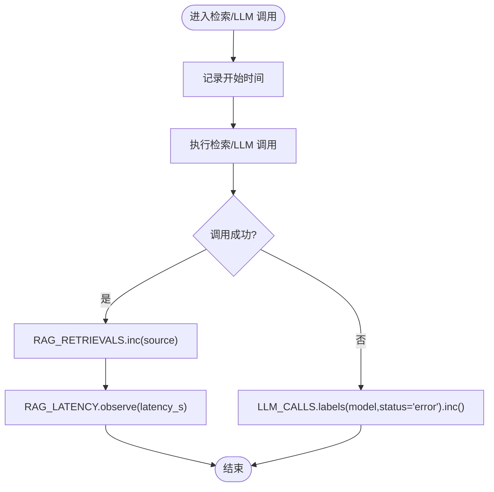
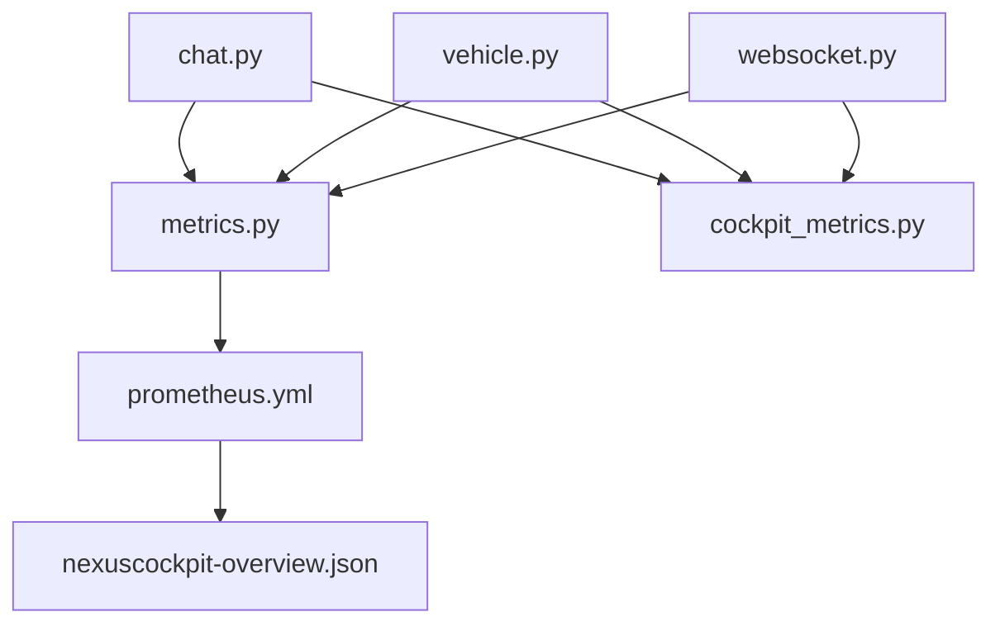

# 指标采集系统

<cite>
**本文引用的文件**
- [metrics.py](file://backend_design/nexus/observability/metrics.py)
- [cockpit_metrics.py](file://backend_design/nexus/observability/cockpit_metrics.py)
- [chat.py](file://backend_design/nexus/api/routes/chat.py)
- [vehicle.py](file://backend_design/nexus/api/routes/vehicle.py)
- [websocket.py](file://backend_design/nexus/api/websocket.py)
- [prometheus.yml](file://config/prometheus/prometheus.yml)
- [nexuscockpit-overview.json](file://config/grafana/provisioning/dashboards/nexuscockpit-overview.json)
- [test_metrics.py](file://backend_design/scripts/test_metrics.py)
</cite>

## 目录
1. [简介](#简介)
2. [项目结构](#项目结构)
3. [核心组件](#核心组件)
4. [架构总览](#架构总览)
5. [详细组件分析](#详细组件分析)
6. [依赖关系分析](#依赖关系分析)
7. [性能考量](#性能考量)
8. [故障排查指南](#故障排查指南)
9. [结论](#结论)
10. [附录](#附录)

## 简介
本技术文档聚焦于 NexusCockpit 的 Prometheus 指标采集体系，系统性说明指标类型（Counter、Gauge、Histogram）的设计与使用场景，覆盖请求、Agent、技能执行、缓存、RAG 检索、LLM 调用以及系统级指标的埋点策略。同时提供命名规范、标签设计原则、性能影响分析与最佳实践，并给出自定义指标开发与集成的完整示例路径，帮助读者快速扩展与维护观测能力。

## 项目结构
指标相关代码主要分布在以下位置：
- 指标定义与初始化：backend_design/nexus/observability/metrics.py
- 座舱级实时指标写入 Redis：backend_design/nexus/observability/cockpit_metrics.py
- 业务埋点入口：API 路由层（聊天、车控、WebSocket）
- 采集配置：config/prometheus/prometheus.yml
- 可视化面板：config/grafana/provisioning/dashboards/nexuscockpit-overview.json
- 测试脚本：backend_design/scripts/test_metrics.py

图表来源
- [metrics.py:1-113](file://backend_design/nexus/observability/metrics.py#L1-L113)
- [cockpit_metrics.py:1-189](file://backend_design/nexus/observability/cockpit_metrics.py#L1-L189)
- [chat.py:1-200](file://backend_design/nexus/api/routes/chat.py#L1-L200)
- [vehicle.py:1-129](file://backend_design/nexus/api/routes/vehicle.py#L1-L129)
- [websocket.py:1-196](file://backend_design/nexus/api/websocket.py#L1-L196)
- [prometheus.yml:1-35](file://config/prometheus/prometheus.yml#L1-L35)
- [nexuscockpit-overview.json:752-801](file://config/grafana/provisioning/dashboards/nexuscockpit-overview.json#L752-L801)

章节来源
- [metrics.py:1-113](file://backend_design/nexus/observability/metrics.py#L1-L113)
- [cockpit_metrics.py:1-189](file://backend_design/nexus/observability/cockpit_metrics.py#L1-L189)
- [prometheus.yml:1-35](file://config/prometheus/prometheus.yml#L1-L35)

## 核心组件
- 指标定义模块（metrics.py）
  - 使用 prometheus_client 暴露 /metrics 端点，集中声明所有业务与系统指标。
  - 包含应用信息 Info、请求计数与延迟、Agent 调用与延迟、技能执行、缓存命中/未命中、RAG 检索与延迟、LLM 调用与延迟、活跃连接与用户等。
- 座舱级指标采集器（cockpit_metrics.py）
  - 将对话、车控指令、错误等实时统计写入 Redis，供 SubAgent 巡检；计算命中率、错误率等派生指标。
  - 提供全局单例获取与设置方法，便于在启动时注入 Redis 客户端。
- API 埋点入口
  - chat.py：记录请求计数、延迟、缓存命中/未命中、Agent 调用结果、座舱级指标与日志持久化。
  - vehicle.py：记录技能执行次数与状态。
  - websocket.py：维护活跃连接数 Gauge。
- 采集与可视化
  - prometheus.yml：定义抓取任务与目标，包括 Python 后端与 Go 网关。
  - Grafana 面板：提供 RAG/LLM P95 延迟等关键视图。

章节来源
- [metrics.py:1-113](file://backend_design/nexus/observability/metrics.py#L1-L113)
- [cockpit_metrics.py:1-189](file://backend_design/nexus/observability/cockpit_metrics.py#L1-L189)
- [chat.py:1-200](file://backend_design/nexus/api/routes/chat.py#L1-L200)
- [vehicle.py:1-129](file://backend_design/nexus/api/routes/vehicle.py#L1-L129)
- [websocket.py:1-196](file://backend_design/nexus/api/websocket.py#L1-L196)
- [prometheus.yml:1-35](file://config/prometheus/prometheus.yml#L1-L35)
- [nexuscockpit-overview.json:752-801](file://config/grafana/provisioning/dashboards/nexuscockpit-overview.json#L752-L801)

## 架构总览
整体流程：API 路由层在关键路径埋点，通过 prometheus_client 暴露 /metrics；Prometheus 按 job 抓取指标；Grafana 基于 PromQL 展示面板。同时，座舱级实时指标经 CockpitMetrics 写入 Redis，用于运营看板与巡检。

图表来源
- [chat.py:146-200](file://backend_design/nexus/api/routes/chat.py#L146-L200)
- [vehicle.py:47-76](file://backend_design/nexus/api/routes/vehicle.py#L47-L76)
- [websocket.py:70-196](file://backend_design/nexus/api/websocket.py#L70-L196)
- [metrics.py:1-113](file://backend_design/nexus/observability/metrics.py#L1-L113)
- [cockpit_metrics.py:41-147](file://backend_design/nexus/observability/cockpit_metrics.py#L41-L147)
- [prometheus.yml:1-35](file://config/prometheus/prometheus.yml#L1-L35)
- [nexuscockpit-overview.json:752-801](file://config/grafana/provisioning/dashboards/nexuscockpit-overview.json#L752-L801)

## 详细组件分析

### 指标定义与类型设计（metrics.py）
- 指标类型与用途
  - Counter：累计不可逆量，如请求总数、缓存命中/未命中、RAG 检索次数、LLM 调用次数、技能执行次数。
  - Histogram：分布型指标，适合延迟测量，如请求延迟、Agent 延迟、RAG 延迟、LLM 延迟。
  - Gauge：可增可减的瞬时值，如活跃连接数、活跃用户数。
  - Info：应用元数据，如版本、服务名、描述。
- 指标清单与标签
  - 请求指标
    - nexus_requests_total（Counter）：标签 endpoint、method、status
    - nexus_request_latency_seconds（Histogram）：标签 endpoint，分桶合理覆盖常见延迟区间
  - Agent 指标
    - nexus_agent_invocations_total（Counter）：标签 agent_name、status
    - nexus_agent_latency_seconds（Histogram）：标签 agent_name，分桶适配节点耗时
  - 技能执行指标
    - nexus_skill_executions_total（Counter）：标签 skill_name、status
  - 缓存指标
    - nexus_cache_hits_total（Counter）
    - nexus_cache_misses_total（Counter）
  - RAG 检索指标
    - nexus_rag_retrievals_total（Counter）：标签 source（vector/graph/fusion）
    - nexus_rag_latency_seconds（Histogram）：分桶适配检索耗时
  - LLM 调用指标
    - nexus_llm_calls_total（Counter）：标签 model、status
    - nexus_llm_latency_seconds（Histogram）：分桶适配模型调用耗时
  - 系统指标
    - nexus_active_connections（Gauge）：WebSocket 活跃连接
    - nexus_active_users（Gauge）：近 5 分钟活跃唯一用户
- 初始化
  - init_metrics() 设置应用信息，便于在面板中识别服务版本与环境。

章节来源
- [metrics.py:1-113](file://backend_design/nexus/observability/metrics.py#L1-L113)

### 座舱级指标采集器（cockpit_metrics.py）
- 职责
  - 将对话、车控指令、错误等实时统计写入 Redis，键格式 cockpit_id:stats。
  - 计算派生指标：缓存命中率、错误率。
  - 提供读取全部座舱统计与重置统计的方法。
- 关键方法
  - record_chat(cockpit_id, latency_ms, cache_hit)：记录对话计数、缓存命中/未命中、最近延迟与时间戳。
  - record_vehicle_cmd(cockpit_id, success)：记录车控指令计数与错误计数。
  - record_error(cockpit_id, error_type)：记录错误总数与分类错误计数。
  - get_cockpit_stats(cockpit_id)：读取并解析 Redis Hash，计算命中率与错误率。
  - get_all_cockpit_stats(cockpit_ids)：批量获取各座舱统计。
  - reset_stats(cockpit_id)：清空指定座舱统计（测试用）。
- 单例模式
  - get_cockpit_metrics()/set_cockpit_metrics() 管理全局实例，便于在 main 启动时注入 Redis 客户端。

图表来源
- [cockpit_metrics.py:27-189](file://backend_design/nexus/observability/cockpit_metrics.py#L27-L189)

章节来源
- [cockpit_metrics.py:1-189](file://backend_design/nexus/observability/cockpit_metrics.py#L1-L189)

### 请求指标埋点（chat.py）
- 埋点位置与逻辑
  - 语义缓存命中：增加 CACHE_HITS，REQUEST_COUNT 标记 status=cache_hit，并记录座舱级指标。
  - 语义缓存未命中：增加 CACHE_MISSES。
  - Agent 调用成功/失败：AGENT_INVOCATIONS 按 agent_name 与 status 计数。
  - 请求总计数与延迟：REQUEST_COUNT 标记 status=success，REQUEST_LATENCY 观察延迟（秒）。
  - 座舱级指标：调用 CockpitMetrics.record_chat 写入 Redis。
  - 日志持久化：将对话内容、意图、动作、延迟、缓存命中等信息写入 MySQL（隐私数据隔离）。
- 时序流程

图表来源
- [chat.py:146-200](file://backend_design/nexus/api/routes/chat.py#L146-L200)
- [chat.py:235-267](file://backend_design/nexus/api/routes/chat.py#L235-L267)
- [metrics.py:20-32](file://backend_design/nexus/observability/metrics.py#L20-L32)
- [cockpit_metrics.py:41-147](file://backend_design/nexus/observability/cockpit_metrics.py#L41-L147)

章节来源
- [chat.py:1-200](file://backend_design/nexus/api/routes/chat.py#L1-L200)
- [chat.py:235-267](file://backend_design/nexus/api/routes/chat.py#L235-L267)

### 技能执行指标埋点（vehicle.py）
- 埋点位置与逻辑
  - 直接调用车控适配器后，根据 result.success 更新 SKILL_EXECUTIONS 的 skill_name 与 status。
- 时序流程

图表来源
- [vehicle.py:47-76](file://backend_design/nexus/api/routes/vehicle.py#L47-L76)
- [metrics.py:48-53](file://backend_design/nexus/observability/metrics.py#L48-L53)

章节来源
- [vehicle.py:1-129](file://backend_design/nexus/api/routes/vehicle.py#L1-L129)

### WebSocket 活跃连接指标（websocket.py）
- 埋点位置与逻辑
  - 接受连接后 ACTIVE_CONNECTIONS.inc()，断开或异常退出时 ACTIVE_CONNECTIONS.dec()。
- 时序流程

图表来源
- [websocket.py:70-196](file://backend_design/nexus/api/websocket.py#L70-L196)
- [metrics.py:92-101](file://backend_design/nexus/observability/metrics.py#L92-L101)

章节来源
- [websocket.py:1-196](file://backend_design/nexus/api/websocket.py#L1-L196)

### RAG 与 LLM 指标埋点建议
- 现状
  - metrics.py 已定义 RAG_RETRIEVALS、RAG_LATENCY、LLM_CALLS、LLM_LATENCY 等指标。
  - 当前代码库中未见在统一检索器或 LLM 调用处直接埋点的实现片段。
- 建议埋点位置
  - RAG：在 unified_retriever.py 的 retrieve/_retrieve_memory/_retrieve_knowledge/_retrieve_hybrid 中，按 source 维度记录检索次数与延迟。
  - LLM：在 supervisor_graph.py 或 llm_router.py 的 chat.completions.create 前后，记录 model 与 status，并观察延迟。
- 流程图（概念性）

[此图为概念性流程，不直接映射具体源码文件]

### 指标命名规范与标签设计原则
- 命名规范
  - 前缀：nexus_，体现服务域。
  - 后缀：_total（Counter）、_seconds（Histogram 以秒为单位）、无后缀（Gauge）。
  - 语义清晰：requests、agent、skill、cache、rag、llm、active 等。
- 标签设计原则
  - 低基数：避免高基数字段（如 user_id、request_id）作为标签，防止内存膨胀。
  - 稳定枚举：endpoint、method、status、agent_name、skill_name、source、model 等。
  - 维度正交：不同维度的标签组合应能独立分析，避免冗余。
- 分桶策略
  - 针对延迟类 Histogram，选择贴近业务预期的分桶，兼顾精度与存储成本。
  - 参考现有分桶：请求（0.1~30s）、Agent（0.05~5s）、RAG（0.05~5s）、LLM（0.5~30s）。

章节来源
- [metrics.py:20-90](file://backend_design/nexus/observability/metrics.py#L20-L90)

### 性能影响分析与优化建议
- 指标开销
  - Counter 与 Gauge 的 inc/dec 操作开销极低，适合高频埋点。
  - Histogram 会维护分桶计数，需控制分桶数量与标签基数，避免内存增长。
- 标签基数控制
  - 避免将用户 ID、会话 ID 等作为标签；如需细粒度分析，采用聚合或采样。
- I/O 与异步
  - 座舱级指标写入 Redis 使用 pipeline 批量操作，降低网络往返。
  - 异常捕获与降级：当 Redis 不可用时，记录日志并跳过写入，不影响主流程。
- 监控自身健康
  - Prometheus 抓取间隔与评估间隔设置为 15s，避免过高频率导致负载。
  - 面板中使用 rate/histogram_quantile 等函数进行平滑与分位计算，减少抖动。

章节来源
- [cockpit_metrics.py:54-147](file://backend_design/nexus/observability/cockpit_metrics.py#L54-L147)
- [prometheus.yml:1-35](file://config/prometheus/prometheus.yml#L1-L35)
- [nexuscockpit-overview.json:752-801](file://config/grafana/provisioning/dashboards/nexuscockpit-overview.json#L752-L801)

### 最佳实践指南
- 埋点时机
  - 在关键路径的“进入/退出”处埋点，确保延迟与计数准确。
  - 对异常分支也要记录状态（如 status=error），便于错误率分析。
- 指标粒度
  - 优先使用低基数标签；必要时通过多指标拆分维度。
- 面板与告警
  - 使用 rate() 计算每秒增量，结合 histogram_quantile 查看 P95/P99。
  - 为关键指标设置阈值告警（如错误率、P95 延迟、活跃连接上限）。
- 可观测性闭环
  - 指标 + 日志 + 链路追踪（Langfuse）协同定位问题。

[本节为通用指导，不直接分析具体文件]

## 依赖关系分析
- 模块耦合
  - API 路由层依赖 metrics.py 中的指标对象，并在关键路径调用 inc/observe。
  - cockpit_metrics.py 依赖 Redis 客户端，提供实时统计写入与读取。
  - prometheus.yml 定义抓取目标，将 /metrics 暴露给 Prometheus。
  - Grafana 面板引用 RAG/LLM 延迟指标，构建 P95 视图。
- 潜在循环依赖
  - 当前结构清晰，未见循环导入；指标定义与业务埋点解耦良好。
- 外部依赖
  - prometheus_client：指标暴露。
  - redis.asyncio：异步 Redis 客户端。
  - FastAPI：路由与中间件集成。

图表来源
- [metrics.py:1-113](file://backend_design/nexus/observability/metrics.py#L1-L113)
- [cockpit_metrics.py:1-189](file://backend_design/nexus/observability/cockpit_metrics.py#L1-L189)
- [chat.py:1-200](file://backend_design/nexus/api/routes/chat.py#L1-L200)
- [vehicle.py:1-129](file://backend_design/nexus/api/routes/vehicle.py#L1-L129)
- [websocket.py:1-196](file://backend_design/nexus/api/websocket.py#L1-L196)
- [prometheus.yml:1-35](file://config/prometheus/prometheus.yml#L1-L35)
- [nexuscockpit-overview.json:752-801](file://config/grafana/provisioning/dashboards/nexuscockpit-overview.json#L752-L801)

章节来源
- [metrics.py:1-113](file://backend_design/nexus/observability/metrics.py#L1-L113)
- [cockpit_metrics.py:1-189](file://backend_design/nexus/observability/cockpit_metrics.py#L1-L189)
- [prometheus.yml:1-35](file://config/prometheus/prometheus.yml#L1-L35)

## 性能考量
- 指标采集对 CPU/内存的影响主要来自 Histogram 的分桶计数与标签基数。
- 建议：
  - 控制标签基数，避免高基数字段。
  - 合理设置分桶，平衡精度与存储。
  - 使用 pipeline 批量写 Redis，减少网络开销。
  - 监控 Prometheus 抓取成功率与延迟，调整 scrape_interval。

[本节为通用指导，不直接分析具体文件]

## 故障排查指南
- 常见问题
  - Redis 不可用：cockpit_metrics.py 捕获异常并记录日志，指标写入被跳过，不影响主流程。
  - 指标未上报：检查 /metrics 是否暴露，确认 prometheus.yml targets 与端口。
  - 面板无数据：确认 PromQL 表达式与指标名称一致，检查抓取间隔与时间范围。
- 诊断步骤
  - 访问 /metrics 验证指标是否存在与数值变化。
  - 使用 test_metrics.py 验证 CockpitMetrics 单例与 Redis 连通性。
  - 在 Grafana 中查看 RAG/LLM P95 延迟面板，确认指标可用。

章节来源
- [cockpit_metrics.py:63-101](file://backend_design/nexus/observability/cockpit_metrics.py#L63-L101)
- [test_metrics.py:1-26](file://backend_design/scripts/test_metrics.py#L1-L26)
- [prometheus.yml:1-35](file://config/prometheus/prometheus.yml#L1-L35)
- [nexuscockpit-overview.json:752-801](file://config/grafana/provisioning/dashboards/nexuscockpit-overview.json#L752-L801)

## 结论
NexusCockpit 的指标体系以 metrics.py 为核心，结合 API 路由层的精准埋点与 CockpitMetrics 的实时统计，形成了从请求到业务链路的完整观测闭环。通过合理的命名与标签设计、分桶策略与性能优化，系统在可观测性与稳定性方面具备良好基础。后续建议在 RAG 与 LLM 调用路径补充埋点，完善端到端延迟与错误率分析。

[本节为总结，不直接分析具体文件]

## 附录

### 自定义指标开发示例与集成方法
- 新增指标
  - 在 metrics.py 中定义新的 Counter/Gauge/Histogram，遵循命名与标签规范。
  - 在 init_metrics() 中补充应用信息（如需）。
- 埋点集成
  - 在对应路由或组件的关键路径调用 inc/observe/inc/dec。
  - 对于需要落盘的实时统计，使用 CockpitMetrics 的相应方法。
- 验证与可视化
  - 使用 test_metrics.py 验证 Redis 连通与指标写入。
  - 在 Grafana 中添加新指标面板，使用 rate/histogram_quantile 等函数进行分析。

章节来源
- [metrics.py:1-113](file://backend_design/nexus/observability/metrics.py#L1-L113)
- [cockpit_metrics.py:1-189](file://backend_design/nexus/observability/cockpit_metrics.py#L1-L189)
- [test_metrics.py:1-26](file://backend_design/scripts/test_metrics.py#L1-L26)