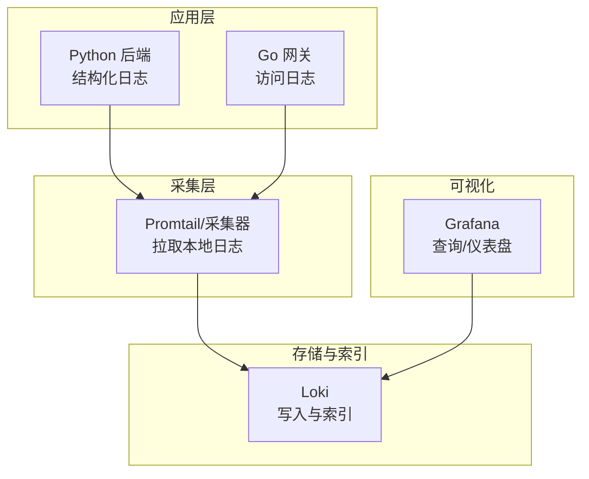
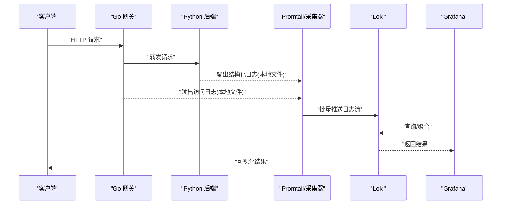
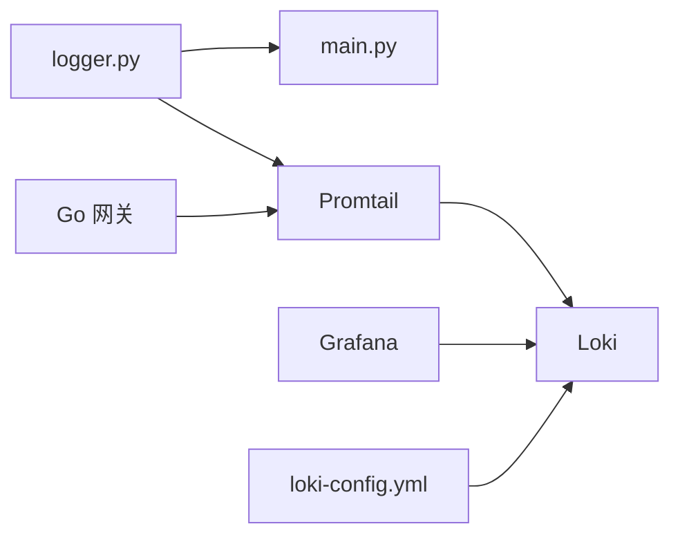

# 日志管理

<cite>
**本文引用的文件**   
- [backend_design/nexus/core/logger.py](file://backend_design/nexus/core/logger.py)
- [config/loki/loki-config.yml](file://config/loki/loki-config.yml)
- [docker-compose.yml](file://docker-compose.yml)
- [backend_design/nexus/config.py](file://backend_design/nexus/config.py)
- [backend_design/nexus/main.py](file://backend_design/nexus/main.py)
- [backend_design/nexus/api/routes/middleware_status.py](file://backend_design/nexus/api/routes/middleware_status.py)
- [backend_design/nexus/observability/data_retention.py](file://backend_design/nexus/observability/data_retention.py)
</cite>

## 目录
1. [简介](#简介)
2. [项目结构](#项目结构)
3. [核心组件](#核心组件)
4. [架构总览](#架构总览)
5. [详细组件分析](#详细组件分析)
6. [依赖关系分析](#依赖关系分析)
7. [性能考虑](#性能考虑)
8. [故障排查指南](#故障排查指南)
9. [结论](#结论)
10. [附录](#附录)

## 简介
本技术文档面向“日志管理系统”，围绕结构化日志格式与采集策略、Loki 聚合平台配置与索引机制、日志级别管理与过滤规则、Grafana 查询与分析语法示例、日志轮转/压缩/清理策略、敏感信息脱敏与安全考量，以及数据生命周期与存储优化进行系统化说明。文档同时结合仓库中的后端 Python 服务、Go 网关、Loki/Grafana 配置与编排文件，给出可落地的工程实践建议。

## 项目结构
本项目在以下位置涉及日志相关能力：
- 后端 Python 服务：提供结构化日志输出与运行时状态接口
- Go 网关：作为统一入口，转发请求并产生访问日志
- Loki 配置：定义日志收集、分片、索引与保留策略
- Grafana 数据源与仪表盘：用于可视化与查询
- Docker Compose：编排 Loki、Promtail（或替代采集器）、Grafana 等组件

图表来源
- [docker-compose.yml](file://docker-compose.yml)
- [config/loki/loki-config.yml](file://config/loki/loki-config.yml)

章节来源
- [docker-compose.yml](file://docker-compose.yml)
- [config/loki/loki-config.yml](file://config/loki/loki-config.yml)

## 核心组件
- 结构化日志输出（Python）
  - 通过统一的日志模块输出 JSON 结构化日志，包含时间戳、级别、服务名、租户上下文、请求标识等字段，便于 Loki 解析与索引。
- 访问日志（Go 网关）
  - 网关记录 HTTP 请求的入站/出站关键信息，便于链路追踪与问题定位。
- Loki 配置
  - 定义多租户标签、分片大小、索引字段、对象存储后端、保留策略等。
- Grafana 集成
  - 配置 Loki 数据源，提供日志浏览、聚合统计与告警面板。

章节来源
- [backend_design/nexus/core/logger.py](file://backend_design/nexus/core/logger.py)
- [backend_design/nexus/main.py](file://backend_design/nexus/main.py)
- [config/loki/loki-config.yml](file://config/loki/loki-config.yml)

## 架构总览
下图展示了从应用到可视化的完整日志链路：应用生成结构化日志，采集器读取并推送至 Loki，Grafana 通过 Loki 数据源进行查询与展示。

图表来源
- [docker-compose.yml](file://docker-compose.yml)
- [config/loki/loki-config.yml](file://config/loki/loki-config.yml)
- [backend_design/nexus/core/logger.py](file://backend_design/nexus/core/logger.py)

## 详细组件分析

### 结构化日志规范与采集策略
- 结构化字段建议
  - 基础字段：时间戳、日志级别、服务名、实例标识、租户 ID、请求 ID、消息体
  - 业务字段：操作类型、资源标识、耗时、错误码、堆栈摘要
  - 环境字段：主机名、容器 ID、部署版本、区域/可用区
- 采集策略
  - 本地文件路径固定，按服务划分目录；采集器以增量方式读取新行
  - 为每条日志附加静态标签（如 service、tenant），便于后续筛选
  - 控制单条日志体积，避免超大 JSON 导致采集延迟
- 安全与脱敏
  - 禁止输出明文密码、令牌、证书、个人身份信息（PII）
  - 对敏感字段进行哈希或掩码处理；必要时在采集前做二次清洗

章节来源
- [backend_design/nexus/core/logger.py](file://backend_design/nexus/core/logger.py)

### Loki 配置与数据索引机制
- 分片与索引
  - 合理设置 chunk_size、index_period 等参数，平衡写入吞吐与查询延迟
  - 将高频查询字段（如 service、tenant、level）设为索引标签，提升检索效率
- 对象存储与持久化
  - 使用对象存储（如 S3/MinIO）作为后端，确保高可用与低成本扩展
- 保留策略
  - 基于时间窗口与容量阈值组合策略，自动清理过期数据
- 多租户隔离
  - 通过 tenant_id 标签实现逻辑隔离，配合权限控制防止越权访问

章节来源
- [config/loki/loki-config.yml](file://config/loki/loki-config.yml)

### 日志级别管理与过滤规则
- 级别定义
  - DEBUG/INFO/WARN/ERROR/FATAL，生产默认 INFO 及以上
- 动态调整
  - 通过配置中心或运行时接口切换级别，避免重启
- 过滤规则
  - 基于标签（service、tenant、level）与关键字进行预过滤
  - 对高频噪声日志进行采样或降级

章节来源
- [backend_design/nexus/core/logger.py](file://backend_design/nexus/core/logger.py)

### Grafana 日志查询与分析语法示例
- 基础查询
  - 按服务与级别筛选：{service="nexus", level="error"}
  - 按时间范围与租户过滤：{service="nexus", tenant_id="t01"} |~ "支付失败"
- 聚合与统计
  - 统计各服务错误数：count_over_time({service=~".+"} |~ "error" [5m]) by (service)
  - 计算 P95 耗时：histogram_quantile(0.95, sum(rate(http_request_duration_seconds_bucket[5m])) by (le))
- 关联分析
  - 通过 request_id 串联网关与后端日志，构建端到端链路视图

章节来源
- [config/loki/loki-config.yml](file://config/loki/loki-config.yml)

### 日志轮转、压缩与清理策略
- 轮转
  - 按文件大小与时间双维度轮转，保留最近 N 个历史文件
- 压缩
  - 对归档文件启用 gzip/zstd 压缩，降低磁盘占用
- 清理
  - 定期删除超过保留期的归档文件；与 Loki 保留策略保持一致
- 监控
  - 监控磁盘使用率与轮转失败告警，保障稳定性

章节来源
- [backend_design/nexus/core/logger.py](file://backend_design/nexus/core/logger.py)

### 敏感信息脱敏与安全考虑
- 脱敏原则
  - 输入侧：在日志生成前对敏感字段进行掩码或哈希
  - 输出侧：在采集层增加正则替换，兜底遗漏的敏感内容
- 传输与存储
  - 采集器与 Loki 之间启用 TLS；对象存储开启加密
- 访问控制
  - 限制 Grafana 与 Loki 的访问权限，最小化暴露面

章节来源
- [backend_design/nexus/core/logger.py](file://backend_design/nexus/core/logger.py)
- [config/loki/loki-config.yml](file://config/loki/loki-config.yml)

### 数据生命周期管理与存储优化
- 生命周期
  - 热数据（近 7 天）：高性能索引与快速查询
  - 温数据（7-30 天）：降采样与合并分片
  - 冷数据（>30 天）：归档至低成本对象存储
- 存储优化
  - 调整分片大小与索引周期，减少小文件数量
  - 对热点标签建立二级索引，加速常见查询

章节来源
- [config/loki/loki-config.yml](file://config/loki/loki-config.yml)
- [backend_design/nexus/observability/data_retention.py](file://backend_design/nexus/observability/data_retention.py)

## 依赖关系分析
- 组件耦合
  - Python 后端依赖日志模块输出结构化日志
  - Go 网关独立输出访问日志
  - Promtail 依赖本地日志文件与 Loki 配置
  - Grafana 依赖 Loki 数据源
- 外部依赖
  - 对象存储（S3/MinIO）
  - 可选：TLS 证书与密钥管理服务

图表来源
- [backend_design/nexus/core/logger.py](file://backend_design/nexus/core/logger.py)
- [backend_design/nexus/main.py](file://backend_design/nexus/main.py)
- [config/loki/loki-config.yml](file://config/loki/loki-config.yml)
- [docker-compose.yml](file://docker-compose.yml)

章节来源
- [docker-compose.yml](file://docker-compose.yml)
- [config/loki/loki-config.yml](file://config/loki/loki-config.yml)
- [backend_design/nexus/core/logger.py](file://backend_design/nexus/core/logger.py)
- [backend_design/nexus/main.py](file://backend_design/nexus/main.py)

## 性能考虑
- 写入吞吐
  - 增大分片大小与批处理大小，减少网络往返
- 查询延迟
  - 将常用标签纳入索引；避免全量扫描
- 资源占用
  - 控制日志体积与采样率；对非关键路径降级日志级别
- 扩容策略
  - 水平扩展采集器与 Loki 节点；对象存储按需扩容

## 故障排查指南
- 常见问题
  - 日志未入库：检查采集器进程、本地文件路径与权限、Loki 连接
  - 查询缓慢：确认索引标签是否命中；评估分片大小与索引周期
  - 磁盘爆满：核对轮转与清理策略；监控对象存储配额
- 诊断步骤
  - 查看采集器日志与指标
  - 在 Grafana 中按服务与级别缩小范围
  - 使用 request_id 串联网关与后端日志
- 健康检查
  - 提供运行时状态接口，暴露日志子系统健康度与队列积压情况

章节来源
- [backend_design/nexus/api/routes/middleware_status.py](file://backend_design/nexus/api/routes/middleware_status.py)

## 结论
通过统一的结构化日志规范、合理的 Loki 索引与保留策略、完善的采集与可视化链路，以及严格的安全与生命周期管理，可实现高效、稳定、可扩展的日志管理体系。建议在上线前完成压测与容量规划，持续监控关键指标并迭代优化。

## 附录
- 术语
  - 结构化日志：JSON 或键值对形式的机器可读日志
  - 分片：Loki 内部的数据组织单元，影响读写性能
  - 保留策略：基于时间与容量的数据清理规则
- 参考配置位置
  - Loki 配置：见配置文件路径
  - 编排文件：见 docker-compose 文件
  - 后端日志模块：见 logger.py