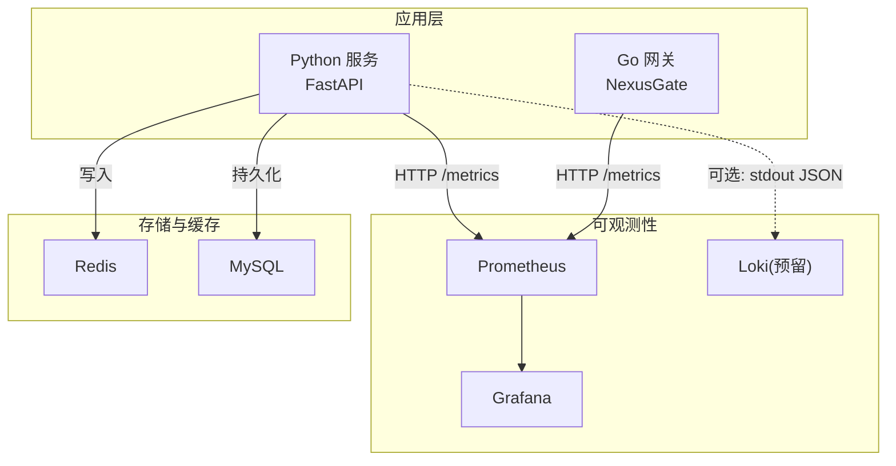
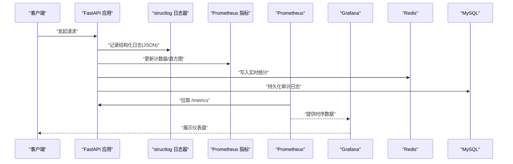
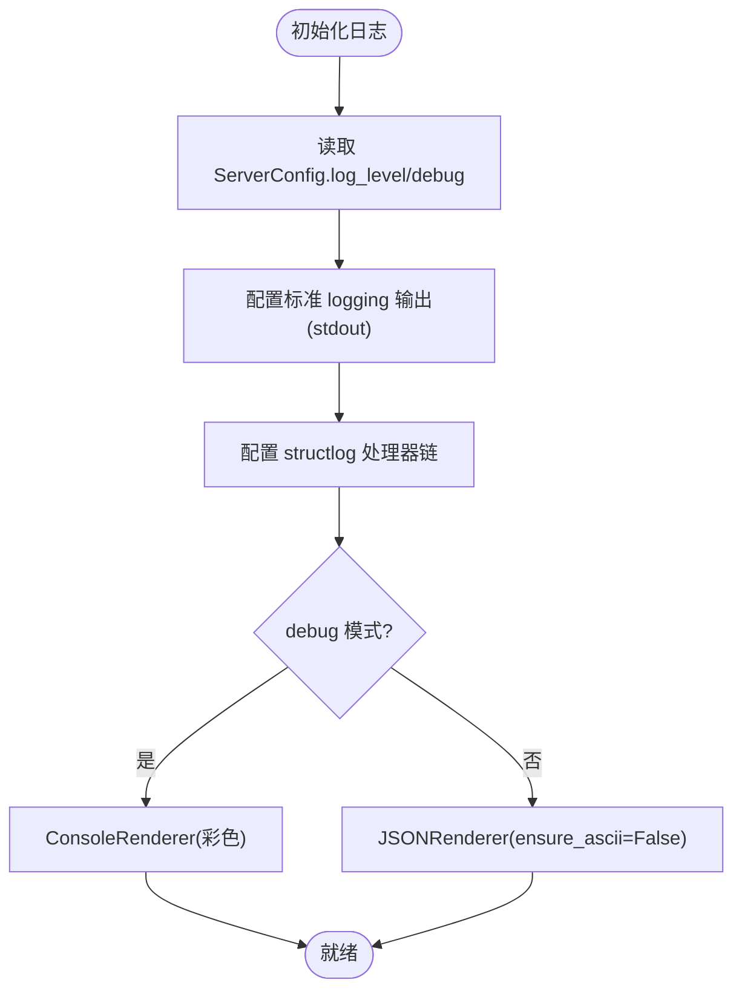
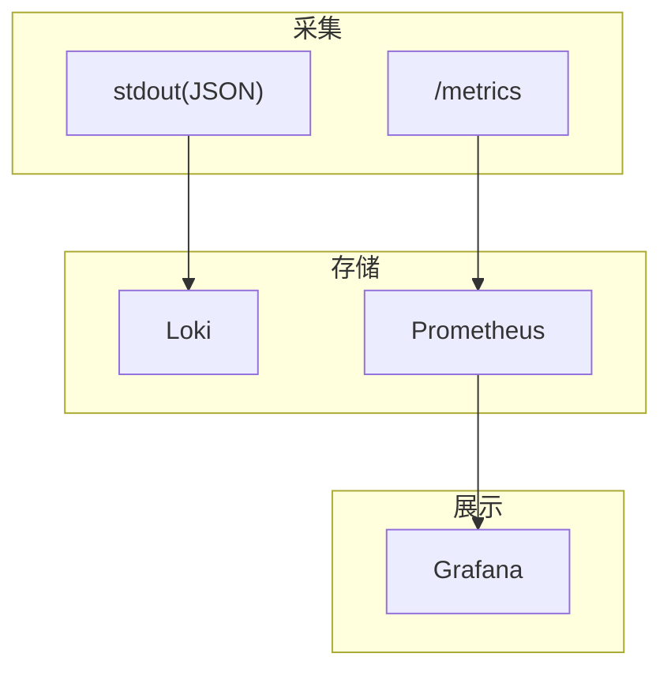
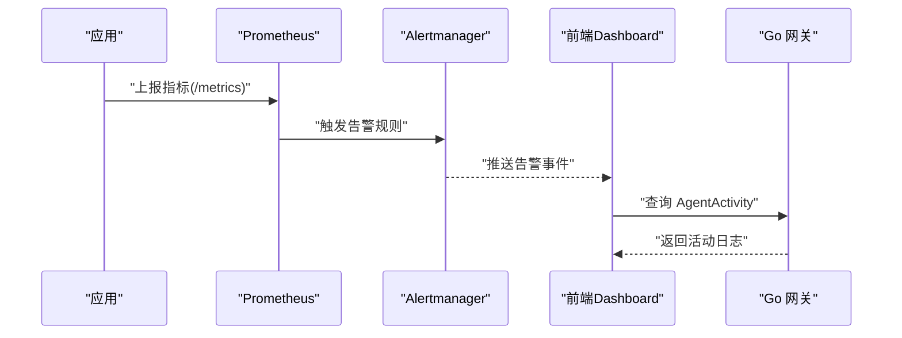

# 日志聚合分析

<cite>
**本文引用的文件**   
- [backend_design/nexus/core/logger.py](file://backend_design/nexus/core/logger.py)
- [backend_design/nexus/config.py](file://backend_design/nexus/config.py)
- [backend_design/nexus/observability/metrics.py](file://backend_design/nexus/observability/metrics.py)
- [backend_design/nexus/observability/cockpit_metrics.py](file://backend_design/nexus/observability/cockpit_metrics.py)
- [config/prometheus/prometheus.yml](file://config/prometheus/prometheus.yml)
- [docker-compose.yml](file://docker-compose.yml)
- [docs/architecture/L7-observability.md](file://docs/architecture/L7-observability.md)
- [backend_design/nexus/api/routes/chat.py](file://backend_design/nexus/api/routes/chat.py)
- [backend_design/nexus/core/db_manager.py](file://backend_design/nexus/core/db_manager.py)
- [backend_design/nexus/core/tenant_context.py](file://backend_design/nexus/core/tenant_context.py)
- [backend_design/nexus_gate/proto/nexus.proto](file://backend_design/nexus_gate/proto/nexus.proto)
</cite>

## 目录
1. [引言](#引言)
2. [项目结构](#项目结构)
3. [核心组件](#核心组件)
4. [架构总览](#架构总览)
5. [详细组件分析](#详细组件分析)
6. [依赖关系分析](#依赖关系分析)
7. [性能与容量规划](#性能与容量规划)
8. [故障排查指南](#故障排查指南)
9. [结论](#结论)
10. [附录](#附录)

## 引言
本技术文档围绕 NexusCockpit 的日志聚合与分析体系，系统性说明结构化日志规范、采集与传输方案、集中式存储与索引优化、查询与分析工具链（Prometheus/Grafana/Loki）、异常告警机制、采样策略与性能监控集成，并提供调试最佳实践、常见问题诊断方法与容量规划建议。文档同时给出实际故障排查的日志分析案例，帮助读者快速定位问题根因并制定改进措施。

## 项目结构
NexusCockpit 的可观测性与日志相关能力主要分布在以下位置：
- 结构化日志：后端基于 structlog 输出 JSON 格式日志，统一时间戳、级别、上下文等字段
- 指标采集：Prometheus 通过 /metrics 拉取应用与网关指标
- 面板可视化：Grafana 预置仪表盘展示关键业务与系统指标
- 多座舱指标：Redis 实时统计 + MySQL 历史聚合
- 配置中心：集中管理日志级别、Prometheus/Grafana 地址等可观测性参数
- 容器编排：docker-compose 提供 Prometheus、Grafana、Loki 等基础设施



图表来源
- [docker-compose.yml:207-245](file://docker-compose.yml#L207-L245)
- [config/prometheus/prometheus.yml:1-35](file://config/prometheus/prometheus.yml#L1-L35)
- [backend_design/nexus/observability/metrics.py:1-113](file://backend_design/nexus/observability/metrics.py#L1-L113)

章节来源
- [docker-compose.yml:207-245](file://docker-compose.yml#L207-L245)
- [config/prometheus/prometheus.yml:1-35](file://config/prometheus/prometheus.yml#L1-L35)
- [docs/architecture/L7-observability.md:1-134](file://docs/architecture/L7-observability.md#L1-L134)

## 核心组件
- 结构化日志器：基于 structlog，生产环境输出 JSON，开发环境彩色控制台；自动附加时间戳、级别、调用栈、异常信息；支持上下文绑定（如 request_id、user_id）
- 指标采集器：prometheus_client 暴露 /metrics，定义请求、延迟、Agent、技能、缓存、RAG、LLM、连接数等指标
- 多座舱指标：CockpitMetrics 将实时统计写入 Redis，计算命中率、错误率等衍生指标
- 配置中心：ServerConfig 控制日志级别与调试模式；ObservabilityConfig 提供 Prometheus/Grafana 地址
- 数据持久化：SubAgent/MainAgent 日志写入 MySQL，便于中台查询与审计
- 容器编排：Prometheus 抓取 Python 与 Go 服务指标；Grafana 预置仪表盘

章节来源
- [backend_design/nexus/core/logger.py:32-71](file://backend_design/nexus/core/logger.py#L32-L71)
- [backend_design/nexus/observability/metrics.py:1-113](file://backend_design/nexus/observability/metrics.py#L1-L113)
- [backend_design/nexus/observability/cockpit_metrics.py:27-189](file://backend_design/nexus/observability/cockpit_metrics.py#L27-L189)
- [backend_design/nexus/config.py:416-432](file://backend_design/nexus/config.py#L416-L432)
- [backend_design/nexus/config.py:583-598](file://backend_design/nexus/config.py#L583-L598)
- [backend_design/nexus/core/db_manager.py:220-255](file://backend_design/nexus/core/db_manager.py#L220-L255)
- [config/prometheus/prometheus.yml:1-35](file://config/prometheus/prometheus.yml#L1-L35)
- [docker-compose.yml:207-245](file://docker-compose.yml#L207-L245)

## 架构总览
下图展示了日志与指标的端到端链路：应用输出结构化日志与指标，Prometheus 拉取指标，Grafana 可视化；Redis 承载实时统计，MySQL 持久化审计日志；Loki 作为预留的日志聚合入口。



图表来源
- [backend_design/nexus/core/logger.py:32-71](file://backend_design/nexus/core/logger.py#L32-L71)
- [backend_design/nexus/observability/metrics.py:1-113](file://backend_design/nexus/observability/metrics.py#L1-L113)
- [backend_design/nexus/observability/cockpit_metrics.py:27-189](file://backend_design/nexus/observability/cockpit_metrics.py#L27-L189)
- [backend_design/nexus/core/db_manager.py:220-255](file://backend_design/nexus/core/db_manager.py#L220-L255)
- [config/prometheus/prometheus.yml:1-35](file://config/prometheus/prometheus.yml#L1-L35)
- [docker-compose.yml:207-245](file://docker-compose.yml#L207-L245)

## 详细组件分析

### 结构化日志规范设计
- 日志级别
  - 通过 ServerConfig.log_level 控制，映射到 logging 常量，默认 INFO
  - 使用 structlog 过滤包装器按级别筛选
- 字段标准化
  - 自动字段：timestamp（ISO 格式）、level、stack_info、exc_info
  - 上下文字段：request_id、user_id、trace_id、cockpit_id 等通过 contextvars 绑定
  - 事件语义：以 event 字段描述具体动作（如 chat_request）
- 敏感信息脱敏
  - 建议在上下文绑定阶段对敏感字段进行脱敏处理（如掩码手机号、邮箱），避免直接写入明文
  - 在中间件或 API 入口处统一执行脱敏逻辑，确保所有后续日志携带脱敏后的上下文
- 输出格式
  - 生产环境：JSON 渲染器，便于 ELK/Loki 采集
  - 开发环境：彩色控制台渲染，便于阅读



图表来源
- [backend_design/nexus/core/logger.py:32-71](file://backend_design/nexus/core/logger.py#L32-L71)
- [backend_design/nexus/config.py:416-432](file://backend_design/nexus/config.py#L416-L432)

章节来源
- [backend_design/nexus/core/logger.py:32-104](file://backend_design/nexus/core/logger.py#L32-L104)
- [backend_design/nexus/config.py:416-432](file://backend_design/nexus/config.py#L416-L432)
- [docs/architecture/L7-observability.md:104-126](file://docs/architecture/L7-observability.md#L104-L126)

### 日志收集架构
- 本地日志轮转
  - 当前实现为 stdout JSON 输出，未内置文件轮转；推荐由运行环境（Docker/进程管理器）接管日志文件与轮转
- 远程日志传输
  - 预留 Loki 集成点：stdout JSON 可直接被 Filebeat/Fluent Bit 采集并转发至 Loki
  - 可在 docker-compose 中挂载 loki_data 卷并配置 scrape/ingest 路径
- 集中式存储方案
  - 审计日志：SubAgent/MainAgent 日志写入 MySQL，供数据中台查询
  - 实时统计：CockpitMetrics 写入 Redis，用于 SubAgent 巡检与前端展示
  - 指标数据：Prometheus 拉取 /metrics，Grafana 可视化

章节来源
- [backend_design/nexus/core/logger.py:32-71](file://backend_design/nexus/core/logger.py#L32-L71)
- [backend_design/nexus/core/db_manager.py:220-255](file://backend_design/nexus/core/db_manager.py#L220-L255)
- [backend_design/nexus/observability/cockpit_metrics.py:27-189](file://backend_design/nexus/observability/cockpit_metrics.py#L27-L189)
- [docker-compose.yml:207-245](file://docker-compose.yml#L207-L245)

### 日志查询与分析工具链
- Prometheus 配置
  - 抓取目标：nexus-ai（Python）、nexus-gate（Go）、milvus、prometheus 自身
  - 抓取间隔：15s
  - 指标路径：/metrics
- Grafana 面板
  - 预置 Overview 面板，包含 RAG/LLM P95 延迟、命中率等
- Loki 集成（预留）
  - 可通过 docker-compose 启动 Loki 并挂载配置文件，结合 Filebeat/Fluent Bit 采集 stdout JSON 日志
  - 建议索引策略：按 cockpit_id、level、event 建立索引，提升检索效率



图表来源
- [config/prometheus/prometheus.yml:1-35](file://config/prometheus/prometheus.yml#L1-L35)
- [docker-compose.yml:207-245](file://docker-compose.yml#L207-L245)
- [docs/architecture/L7-observability.md:86-103](file://docs/architecture/L7-observability.md#L86-L103)

章节来源
- [config/prometheus/prometheus.yml:1-35](file://config/prometheus/prometheus.yml#L1-L35)
- [docs/architecture/L7-observability.md:86-103](file://docs/architecture/L7-observability.md#L86-L103)

### 异常日志自动告警机制
- 指标驱动告警
  - 基于 Prometheus 阈值规则（如错误率、P95 延迟、缓存命中率）触发告警
  - Grafana 可配置 Alertmanager 通知渠道（邮件、Webhook）
- 前端告警展示
  - 前端 Dashboard 展示 24h 告警记录，支持按严重程度筛选
- 子代理活动日志
  - Go 网关提供 AgentActivity 接口，返回引擎活动时间线，辅助定位异常



图表来源
- [backend_design/nexus/observability/metrics.py:1-113](file://backend_design/nexus/observability/metrics.py#L1-L113)
- [frontend_design/src/app/dashboard/page.tsx:482-545](file://frontend_design/src/app/dashboard/page.tsx#L482-L545)
- [backend_design/nexus_gate/proto/nexus.proto:123-130](file://backend_design/nexus_gate/proto/nexus.proto#L123-L130)

章节来源
- [backend_design/nexus/observability/metrics.py:1-113](file://backend_design/nexus/observability/metrics.py#L1-L113)
- [frontend_design/src/app/dashboard/page.tsx:482-545](file://frontend_design/src/app/dashboard/page.tsx#L482-L545)
- [backend_design/nexus_gate/proto/nexus.proto:123-130](file://backend_design/nexus_gate/proto/nexus.proto#L123-L130)

### 日志采样策略
- 全量 vs 采样
  - 高吞吐场景下可对 debug/warn 级别日志进行采样（如 1%），降低存储压力
- 上下文保留
  - 采样需保留 trace_id、cockpit_id、user_id 等关键字段，保证可追踪性
- 动态调整
  - 通过配置中心动态调整采样比例，结合 Prometheus 指标评估影响

[本节为通用指导，不直接分析具体文件]

### 性能监控集成
- 指标清单
  - 请求总量、延迟直方图、Agent 节点延迟、缓存命中/未命中、RAG 检索次数与延迟、LLM 调用次数与延迟、活跃连接数、活跃用户数
- 面板展示
  - Overview 面板汇总关键指标；RAG/LLM P95 延迟曲线用于性能瓶颈定位
- 实时统计
  - CockpitMetrics 计算缓存命中率与错误率，支撑实时监控

章节来源
- [backend_design/nexus/observability/metrics.py:1-113](file://backend_design/nexus/observability/metrics.py#L1-L113)
- [backend_design/nexus/observability/cockpit_metrics.py:103-147](file://backend_design/nexus/observability/cockpit_metrics.py#L103-L147)
- [docs/architecture/L7-observability.md:73-103](file://docs/architecture/L7-observability.md#L73-L103)

### 日志调试最佳实践
- 统一上下文
  - 在中间件设置 cockpit_id、user_id、trace_id，并通过 logger.bind_context 绑定
- 结构化事件
  - 使用 event 字段明确动作语义，便于聚合与检索
- 异常堆栈
  - 利用 StackInfoRenderer 与 format_exc_info 输出完整堆栈，加速定位
- 脱敏先行
  - 在上下文绑定前完成敏感字段脱敏，避免泄露

章节来源
- [backend_design/nexus/core/logger.py:51-71](file://backend_design/nexus/core/logger.py#L51-L71)
- [backend_design/nexus/core/tenant_context.py:29-62](file://backend_design/nexus/core/tenant_context.py#L29-L62)

### 常见问题诊断方法
- 指标异常
  - 检查 Prometheus 抓取状态与目标可达性
  - 核对 /metrics 标签维度是否过多导致内存膨胀
- 日志缺失
  - 确认 stdout JSON 输出是否正常；检查容器日志挂载与轮转策略
- 告警风暴
  - 调整告警规则去重与抑制策略；增加静默窗口

[本节为通用指导，不直接分析具体文件]

### 日志容量规划指南
- 日志量估算
  - 按 QPS × 平均日志条数 × 单条大小 × 保留天数估算
- 存储分层
  - 热数据（近 7 天）：SSD；温数据（7-30 天）：HDD；冷数据（>30 天）：对象存储归档
- 索引优化
  - 仅对高频查询字段建索引（cockpit_id、level、event、trace_id）
- 压缩与分片
  - 启用日志压缩；按时间分片（小时/天）提升检索性能

[本节为通用指导，不直接分析具体文件]

### 实际故障排查案例

#### 案例一：LLM 调用失败与降级
- 现象
  - 响应延迟升高，部分请求返回兜底消息
- 日志线索
  - 记录“LLM response failed”与“Falling back to local LLM”
- 根因
  - 云端 LLM 不可用或超时，触发本地模型降级
- 处置
  - 检查 LLM 配置与网络连通性；调整超时与重试策略；观察降级后延迟分布

章节来源
- [backend_design/nexus/agent/responder.py:180-249](file://backend_design/nexus/agent/responder.py#L180-L249)

#### 案例二：缓存命中率下降
- 现象
  - 缓存命中率显著降低，LLM 调用次数上升
- 日志线索
  - “Cache HIT (scan)”减少，“miss_count”增加
- 根因
  - 相似度阈值过高或向量维度不一致导致匹配失败
- 处置
  - 调整 cache_similarity_threshold；校验 embedding 维度一致性；监控命中率趋势

章节来源
- [backend_design/nexus/middleware/redis_cache.py:278-309](file://backend_design/nexus/middleware/redis_cache.py#L278-L309)

#### 案例三：多座舱隔离失效
- 现象
  - 不同座舱间出现数据交叉污染
- 日志线索
  - cockpit_id 上下文未正确传播
- 根因
  - 中间件未设置 cockpit_id 或未使用纯 ASGI 中间件导致 contextvars 丢失
- 处置
  - 使用纯 ASGI 中间件提取 X-Cockpit-Id 并设置到 contextvars；确保所有异步分支继承上下文

章节来源
- [backend_design/nexus/main.py:397-410](file://backend_design/nexus/main.py#L397-L410)
- [backend_design/nexus/core/tenant_context.py:29-62](file://backend_design/nexus/core/tenant_context.py#L29-L62)

#### 案例四：指标抓取失败
- 现象
  - Prometheus 无法抓取 nexus-ai 或 nexus-gate 指标
- 日志线索
  - Prometheus 目标状态为 DOWN
- 根因
  - 端口映射错误或服务未暴露 /metrics
- 处置
  - 检查 docker-compose 端口映射；确认服务监听地址与端口；验证 /metrics 路径可达

章节来源
- [config/prometheus/prometheus.yml:1-35](file://config/prometheus/prometheus.yml#L1-L35)
- [docker-compose.yml:207-245](file://docker-compose.yml#L207-L245)

## 依赖关系分析
- 组件耦合
  - logger 依赖 config（读取 log_level/debug）
  - metrics 与 cockpit_metrics 独立，后者依赖 redis 与 tenant_context
  - db_manager 负责审计日志持久化，与 logger 解耦
- 外部依赖
  - Prometheus/Grafana/Loki 为外部可观测性组件
  - Redis/MySQL 为运行时存储

```mermaid
classDiagram
class Logger {
+setup_logging()
+get_logger(name)
+bind_context(**kwargs)
+clear_context()
}
class Config {
+server.log_level
+server.debug
+observability.prometheus_url
+observability.grafana_url
}
class Metrics {
+REQUEST_COUNT
+REQUEST_LATENCY
+AGENT_INVOCATIONS
+CACHE_HITS
+RAG_RETRIEVALS
+LLM_CALLS
+ACTIVE_CONNECTIONS
}
class CockpitMetrics {
+record_chat()
+record_vehicle_cmd()
+record_error()
+get_cockpit_stats()
}
class DBManager {
+insert_subagent_log()
+insert_mainagent_log()
}
Logger --> Config : "读取配置"
CockpitMetrics --> Logger : "记录日志"
Metrics --> Config : "可选 : 版本信息"
DBManager --> Logger : "记录错误"
```

图表来源
- [backend_design/nexus/core/logger.py:32-71](file://backend_design/nexus/core/logger.py#L32-L71)
- [backend_design/nexus/config.py:416-432](file://backend_design/nexus/config.py#L416-L432)
- [backend_design/nexus/config.py:583-598](file://backend_design/nexus/config.py#L583-L598)
- [backend_design/nexus/observability/metrics.py:1-113](file://backend_design/nexus/observability/metrics.py#L1-L113)
- [backend_design/nexus/observability/cockpit_metrics.py:27-189](file://backend_design/nexus/observability/cockpit_metrics.py#L27-L189)
- [backend_design/nexus/core/db_manager.py:220-255](file://backend_design/nexus/core/db_manager.py#L220-L255)

章节来源
- [backend_design/nexus/core/logger.py:32-71](file://backend_design/nexus/core/logger.py#L32-L71)
- [backend_design/nexus/config.py:416-432](file://backend_design/nexus/config.py#L416-L432)
- [backend_design/nexus/observability/metrics.py:1-113](file://backend_design/nexus/observability/metrics.py#L1-L113)
- [backend_design/nexus/observability/cockpit_metrics.py:27-189](file://backend_design/nexus/observability/cockpit_metrics.py#L27-L189)
- [backend_design/nexus/core/db_manager.py:220-255](file://backend_design/nexus/core/db_manager.py#L220-L255)

## 性能与容量规划
- 指标粒度
  - 合理设置 Histogram buckets，避免过度细分导致内存占用
- 日志采样
  - 在高并发场景对低优先级日志采样，保留关键上下文
- 存储分层
  - 热/温/冷数据分层存储，结合压缩与分片策略
- 索引优化
  - 仅对高频查询字段建索引，避免索引过大影响写入性能

[本节为通用指导，不直接分析具体文件]

## 故障排查指南
- 快速定位
  - 通过 trace_id 串联日志与指标，快速还原请求链路
- 指标核查
  - 检查 Prometheus 抓取状态与目标可达性
- 日志检索
  - 使用 cockpit_id、level、event 组合检索，缩小范围
- 告警治理
  - 调整告警规则与抑制策略，避免告警风暴

[本节为通用指导，不直接分析具体文件]

## 结论
NexusCockpit 的日志与可观测性体系以结构化日志为基础，结合 Prometheus/Grafana 指标与面板，辅以 Redis 实时统计与 MySQL 审计日志，形成完整的采集、存储、分析与可视化闭环。通过统一的上下文绑定与脱敏策略，保障日志质量与安全；通过合理的采样与索引优化，兼顾性能与成本。未来可进一步集成 Loki 实现更强大的日志检索与分析能力。

## 附录
- 环境变量参考
  - LOG_LEVEL、DEBUG、PROMETHEUS_URL、GRAFANA_URL
- 关键路径
  - /metrics（指标）、/api/chat（对话）、/api/dataplatform（数据中台）

章节来源
- [backend_design/nexus/config.py:416-432](file://backend_design/nexus/config.py#L416-L432)
- [backend_design/nexus/config.py:583-598](file://backend_design/nexus/config.py#L583-L598)
- [backend_design/nexus/api/routes/chat.py:269-341](file://backend_design/nexus/api/routes/chat.py#L269-L341)
- [backend_design/nexus/api/routes/dataplatform.py:253-292](file://backend_design/nexus/api/routes/dataplatform.py#L253-L292)