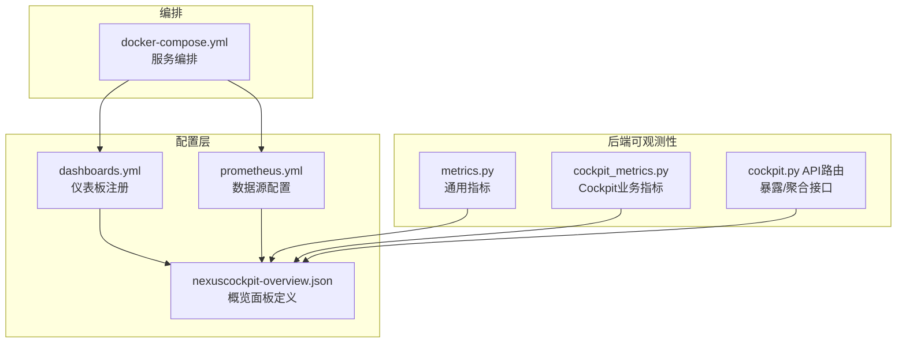
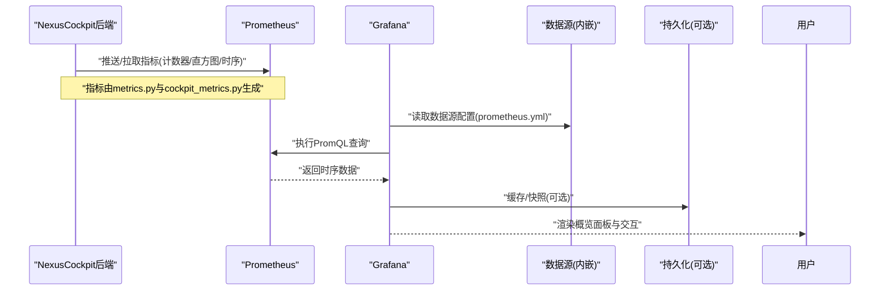
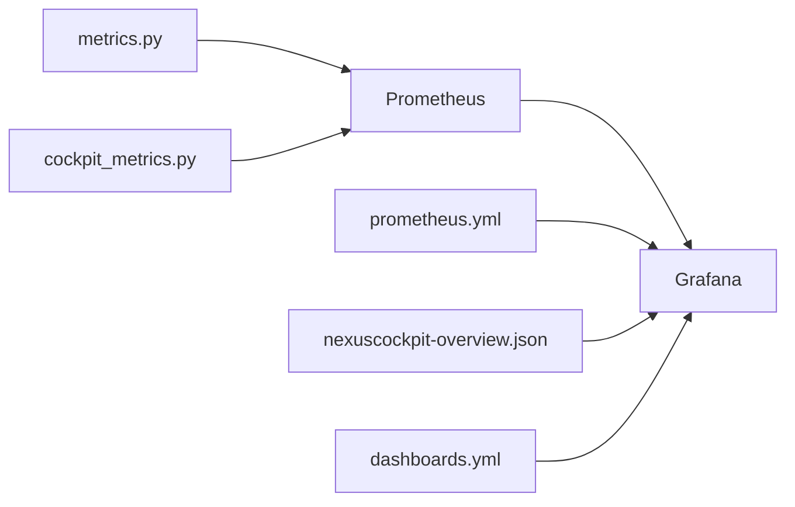

# 监控面板

<cite>
**本文引用的文件**   
- [config/grafana/provisioning/dashboards/dashboards.yml](file://config/grafana/provisioning/dashboards/dashboards.yml)
- [config/grafana/provisioning/dashboards/nexuscockpit-overview.json](file://config/grafana/provisioning/dashboards/nexuscockpit-overview.json)
- [config/grafana/provisioning/datasources/prometheus.yml](file://config/grafana/provisioning/datasources/prometheus.yml)
- [backend_design/nexus/observability/metrics.py](file://backend_design/nexus/observability/metrics.py)
- [backend_design/nexus/observability/cockpit_metrics.py](file://backend_design/nexus/observability/cockpit_metrics.py)
- [backend_design/nexus/api/routes/cockpit.py](file://backend_design/nexus/api/routes/cockpit.py)
- [docker-compose.yml](file://docker-compose.yml)
</cite>

## 目录
1. [简介](#简介)
2. [项目结构](#项目结构)
3. [核心组件](#核心组件)
4. [架构总览](#架构总览)
5. [详细组件分析](#详细组件分析)
6. [依赖关系分析](#依赖关系分析)
7. [性能考虑](#性能考虑)
8. [故障排查指南](#故障排查指南)
9. [结论](#结论)
10. [附录](#附录)

## 简介
本文件面向运维与研发人员，提供NexusCockpit的Grafana监控面板配置、使用与扩展指南。内容涵盖：
- Grafana仪表板结构与可视化组件说明
- NexusCockpit概览面板的指标展示与交互能力
- 自定义监控面板创建步骤与最佳实践
- 数据源配置与连接管理（Prometheus）
- 告警通知的配置与触发条件设置
- 面板权限管理与访问控制
- 常用查询语句与图表类型参考

## 项目结构
与监控面板相关的核心位置如下：
- Grafana预置仪表板定义与数据源配置位于 config/grafana/provisioning 下
- 后端指标采集与导出逻辑位于 backend_design/nexus/observability 下
- 服务编排与容器化集成通过 docker-compose.yml 管理

图示来源
- [config/grafana/provisioning/dashboards/dashboards.yml](file://config/grafana/provisioning/dashboards/dashboards.yml)
- [config/grafana/provisioning/dashboards/nexuscockpit-overview.json](file://config/grafana/provisioning/dashboards/nexuscockpit-overview.json)
- [config/grafana/provisioning/datasources/prometheus.yml](file://config/grafana/provisioning/datasources/prometheus.yml)
- [backend_design/nexus/observability/metrics.py](file://backend_design/nexus/observability/metrics.py)
- [backend_design/nexus/observability/cockpit_metrics.py](file://backend_design/nexus/observability/cockpit_metrics.py)
- [backend_design/nexus/api/routes/cockpit.py](file://backend_design/nexus/api/routes/cockpit.py)
- [docker-compose.yml](file://docker-compose.yml)

章节来源
- [config/grafana/provisioning/dashboards/dashboards.yml](file://config/grafana/provisioning/dashboards/dashboards.yml)
- [config/grafana/provisioning/dashboards/nexuscockpit-overview.json](file://config/grafana/provisioning/dashboards/nexuscockpit-overview.json)
- [config/grafana/provisioning/datasources/prometheus.yml](file://config/grafana/provisioning/datasources/prometheus.yml)
- [backend_design/nexus/observability/metrics.py](file://backend_design/nexus/observability/metrics.py)
- [backend_design/nexus/observability/cockpit_metrics.py](file://backend_design/nexus/observability/cockpit_metrics.py)
- [backend_design/nexus/api/routes/cockpit.py](file://backend_design/nexus/api/routes/cockpit.py)
- [docker-compose.yml](file://docker-compose.yml)

## 核心组件
- 仪表板注册表
  - dashboards.yml 用于声明式注册Grafana仪表板，指向JSON定义文件，便于版本化管理与自动化部署。
- 概览面板定义
  - nexuscockpit-overview.json 包含面板标题、时间范围、变量、行分组、各可视化图元及查询表达式等。
- 数据源配置
  - prometheus.yml 声明Prometheus数据源地址、认证与TLS等参数，供Grafana在启动时自动加载。
- 后端指标采集
  - metrics.py 提供通用应用指标（如请求计数、延迟分布、错误率等）。
  - cockpit_metrics.py 聚焦Cockpit业务域指标（会话数、技能调用次数、失败率、资源占用等）。
- API路由
  - cockpit.py 暴露与Cockpit相关的API，可能用于聚合或透传指标数据至Prometheus或其他存储。

章节来源
- [config/grafana/provisioning/dashboards/dashboards.yml](file://config/grafana/provisioning/dashboards/dashboards.yml)
- [config/grafana/provisioning/dashboards/nexuscockpit-overview.json](file://config/grafana/provisioning/dashboards/nexuscockpit-overview.json)
- [config/grafana/provisioning/datasources/prometheus.yml](file://config/grafana/provisioning/datasources/prometheus.yml)
- [backend_design/nexus/observability/metrics.py](file://backend_design/nexus/observability/metrics.py)
- [backend_design/nexus/observability/cockpit_metrics.py](file://backend_design/nexus/observability/cockpit_metrics.py)
- [backend_design/nexus/api/routes/cockpit.py](file://backend_design/nexus/api/routes/cockpit.py)

## 架构总览
下图展示了从后端指标采集到Grafana可视化的端到端流程，以及容器编排如何注入配置。

图示来源
- [backend_design/nexus/observability/metrics.py](file://backend_design/nexus/observability/metrics.py)
- [backend_design/nexus/observability/cockpit_metrics.py](file://backend_design/nexus/observability/cockpit_metrics.py)
- [config/grafana/provisioning/datasources/prometheus.yml](file://config/grafana/provisioning/datasources/prometheus.yml)
- [config/grafana/provisioning/dashboards/nexuscockpit-overview.json](file://config/grafana/provisioning/dashboards/nexuscockpit-overview.json)

## 详细组件分析

### 概览面板（NexusCockpit Overview）
- 面板目标
  - 集中展示Cockpit关键运行状态：活跃会话、技能调用成功率、平均响应时间、错误率、资源使用趋势等。
- 可视化组件建议
  - 时间序列图：用于展示QPS、延迟分位、错误率等随时间变化趋势。
  - 统计面板（Stat）：用于展示当前活跃会话数、最近一次错误数等单值KPI。
  - 表格面板：用于列出异常事件、慢请求TopN、技能调用明细等。
  - 热力图：用于展示不同时间段内的负载分布。
- 交互功能
  - 全局时间选择器与刷新间隔
  - 多变量过滤（如按租户、模块、技能名）
  - 钻取跳转：点击某项跳转到对应详情面板或日志查询
- 数据来源
  - 默认数据源为Prometheus；如需接入其他存储，可在数据源中新增并切换。

章节来源
- [config/grafana/provisioning/dashboards/nexuscockpit-overview.json](file://config/grafana/provisioning/dashboards/nexuscockpit-overview.json)

### 数据源配置与连接管理（Prometheus）
- 配置要点
  - 数据源名称、URL、鉴权方式、TLS证书、超时与重试策略
  - 标签映射与保留策略（可选）
- 连接管理
  - 健康检查：确保Grafana能成功连通Prometheus
  - 多环境隔离：通过命名空间或前缀区分开发/测试/生产
- 常见问题
  - 网络不通、证书不匹配、跨域限制、鉴权失败等

章节来源
- [config/grafana/provisioning/datasources/prometheus.yml](file://config/grafana/provisioning/datasources/prometheus.yml)

### 后端指标采集与导出
- 通用指标（metrics.py）
  - 典型类别：请求计数、耗时分布、错误计数、并发度、队列长度等
  - 维度设计：方法、路径、状态码、租户、模块等
- Cockpit业务指标（cockpit_metrics.py）
  - 典型类别：会话生命周期、技能调用次数/成功率、语音处理耗时、RAG检索耗时、模型调用延迟等
  - 维度设计：技能名、意图分类、用户ID、设备类型等
- 指标发布
  - 通常以HTTP /metrics暴露或通过SDK推送到Pushgateway/Prometheus
  - 注意采样频率与标签基数控制，避免高基导致存储膨胀

章节来源
- [backend_design/nexus/observability/metrics.py](file://backend_design/nexus/observability/metrics.py)
- [backend_design/nexus/observability/cockpit_metrics.py](file://backend_design/nexus/observability/cockpit_metrics.py)

### API路由与指标联动（cockpit.py）
- 职责
  - 提供Cockpit相关API，可能负责将业务事件转换为指标上报或聚合结果
- 与监控的关系
  - 在关键路径埋点：入口/出口、异常分支、外部依赖调用
  - 结合中间件统一记录请求级指标（耗时、状态码、错误码）

章节来源
- [backend_design/nexus/api/routes/cockpit.py](file://backend_design/nexus/api/routes/cockpit.py)

### 容器编排与服务集成（docker-compose.yml）
- 作用
  - 统一管理Grafana、Prometheus、后端服务的启动顺序、端口映射、环境变量与挂载卷
- 与监控的关系
  - 通过环境变量注入数据源、仪表板注册路径等
  - 保证指标采集链路在服务启动后即可工作

章节来源
- [docker-compose.yml](file://docker-compose.yml)

## 依赖关系分析
- 组件耦合
  - 概览面板依赖数据源配置与后端指标
  - 数据源配置被Grafana在启动时加载
  - 后端指标由应用代码生成并通过Prometheus抓取
- 外部依赖
  - Prometheus作为时序数据库与查询引擎
  - Grafana作为可视化与告警平台

图示来源
- [backend_design/nexus/observability/metrics.py](file://backend_design/nexus/observability/metrics.py)
- [backend_design/nexus/observability/cockpit_metrics.py](file://backend_design/nexus/observability/cockpit_metrics.py)
- [config/grafana/provisioning/datasources/prometheus.yml](file://config/grafana/provisioning/datasources/prometheus.yml)
- [config/grafana/provisioning/dashboards/nexuscockpit-overview.json](file://config/grafana/provisioning/dashboards/nexuscockpit-overview.json)
- [config/grafana/provisioning/dashboards/dashboards.yml](file://config/grafana/provisioning/dashboards/dashboards.yml)

## 性能考虑
- 指标粒度与标签基数
  - 控制标签数量与取值范围，避免高基导致存储与查询压力
- 采样与聚合
  - 合理设置采样间隔，必要时在PromQL层进行降采样与聚合
- 查询优化
  - 优先使用索引友好的函数与过滤条件，减少全表扫描
- 面板渲染
  - 限制同时查询数量与时间窗口大小，避免前端卡顿

## 故障排查指南
- 数据源不可用
  - 检查prometheus.yml中的URL、鉴权与TLS配置
  - 在Grafana数据源页面执行“保存并测试”
- 无数据
  - 确认后端已正确生成并暴露指标
  - 验证Prometheus抓取目标状态
  - 检查Grafana面板的数据源与查询表达式
- 指标缺失或异常
  - 核对指标命名、单位与维度是否一致
  - 查看后端日志与错误码，定位异常分支
- 面板加载缓慢
  - 调整时间范围与刷新间隔
  - 优化PromQL，增加必要索引或预聚合

章节来源
- [config/grafana/provisioning/datasources/prometheus.yml](file://config/grafana/provisioning/datasources/prometheus.yml)
- [backend_design/nexus/observability/metrics.py](file://backend_design/nexus/observability/metrics.py)
- [backend_design/nexus/observability/cockpit_metrics.py](file://backend_design/nexus/observability/cockpit_metrics.py)

## 结论
通过标准化的指标采集、清晰的仪表板设计与合理的告警策略，NexusCockpit能够实现对系统运行状态的全面感知与快速定位问题。建议在持续演进中保持指标命名规范、面板模块化与告警分级，以提升整体可观测性与运维效率。

## 附录

### 自定义监控面板创建步骤
- 准备数据源
  - 在数据源配置中添加或校验Prometheus数据源
- 新建仪表板
  - 使用Grafana界面新建仪表板，添加行与面板
- 编写查询
  - 基于PromQL编写查询，选择合适的聚合与过滤条件
- 配置可视化
  - 选择合适图表类型，设置坐标轴、阈值与样式
- 添加变量与交互
  - 引入全局变量实现多维度筛选
- 保存与共享
  - 将面板导出为JSON，纳入版本管理

章节来源
- [config/grafana/provisioning/dashboards/dashboards.yml](file://config/grafana/provisioning/dashboards/dashboards.yml)
- [config/grafana/provisioning/dashboards/nexuscockpit-overview.json](file://config/grafana/provisioning/dashboards/nexuscockpit-overview.json)
- [config/grafana/provisioning/datasources/prometheus.yml](file://config/grafana/provisioning/datasources/prometheus.yml)

### 告警通知配置与触发条件
- 告警规则
  - 在Prometheus或Grafana中定义规则，指定指标、阈值、持续时间与标签
- 通知渠道
  - 支持邮件、Webhook、企业微信、钉钉等
- 触发条件示例
  - 错误率超过阈值、P99延迟高于SLA、CPU/内存使用率超限、特定技能调用失败率升高
- 降噪与抑制
  - 使用静默、抑制规则避免告警风暴

章节来源
- [config/grafana/provisioning/datasources/prometheus.yml](file://config/grafana/provisioning/datasources/prometheus.yml)
- [config/grafana/provisioning/dashboards/nexuscockpit-overview.json](file://config/grafana/provisioning/dashboards/nexuscockpit-overview.json)

### 面板权限管理与访问控制
- 角色与组织
  - 基于Grafana的组织与角色体系，分配只读/编辑/管理员权限
- 资源隔离
  - 通过文件夹与命名空间隔离不同团队的面板与数据源
- 访问控制
  - 结合反向代理或网关实现SSO与细粒度授权

[本节为概念性说明，无需源码引用]

### 常用查询语句与图表类型参考
- 常用查询
  - 请求总量：sum(rate(...))
  - 错误率：rate(error_total)/rate(request_total)
  - 延迟分位：histogram_quantile(...)
  - 活跃会话：count by(...) (active_sessions)
- 图表类型
  - 时间序列图：趋势与对比
  - 统计面板：单值KPI
  - 表格面板：明细与TopN
  - 热力图：负载分布
  - 仪表盘：饱和度指示

[本节为概念性说明，无需源码引用]