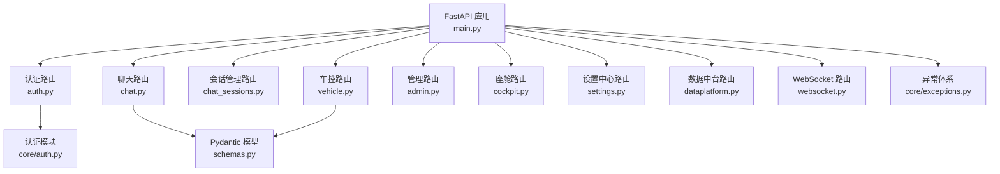
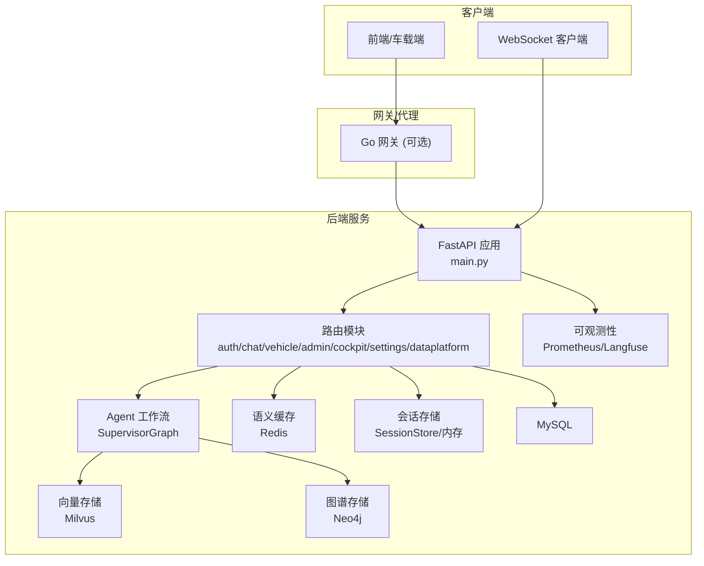
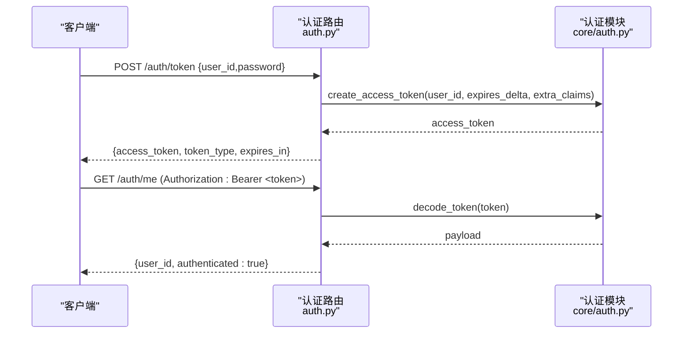
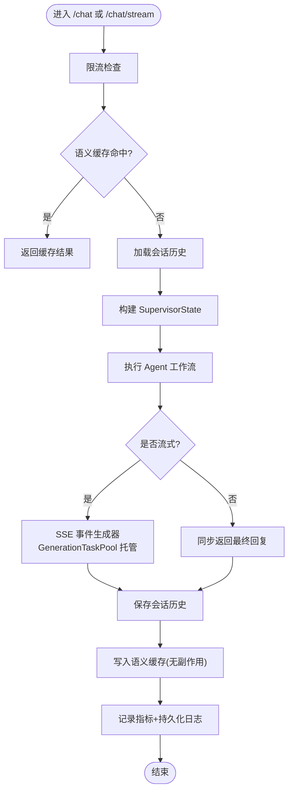
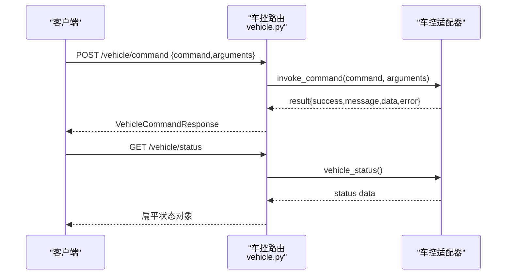
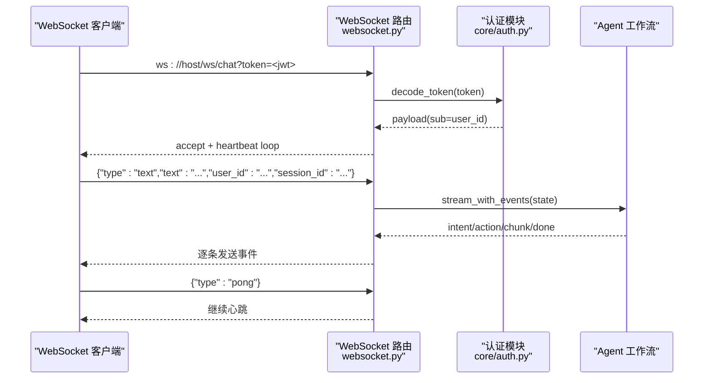

# API路由系统

<cite>
**本文引用的文件**   
- [backend_design/nexus/main.py](file://backend_design/nexus/main.py)
- [backend_design/nexus/api/websocket.py](file://backend_design/nexus/api/websocket.py)
- [backend_design/nexus/api/routes/auth.py](file://backend_design/nexus/api/routes/auth.py)
- [backend_design/nexus/api/routes/chat.py](file://backend_design/nexus/api/routes/chat.py)
- [backend_design/nexus/api/routes/chat_sessions.py](file://backend_design/nexus/api/routes/chat_sessions.py)
- [backend_design/nexus/api/routes/vehicle.py](file://backend_design/nexus/api/routes/vehicle.py)
- [backend_design/nexus/api/routes/admin.py](file://backend_design/nexus/api/routes/admin.py)
- [backend_design/nexus/api/routes/cockpit.py](file://backend_design/nexus/api/routes/cockpit.py)
- [backend_design/nexus/api/routes/settings.py](file://backend_design/nexus/api/routes/settings.py)
- [backend_design/nexus/api/routes/dataplatform.py](file://backend_design/nexus/api/routes/dataplatform.py)
- [backend_design/nexus/models/schemas.py](file://backend_design/nexus/models/schemas.py)
- [backend_design/nexus/core/auth.py](file://backend_design/nexus/core/auth.py)
- [backend_design/nexus/core/exceptions.py](file://backend_design/nexus/core/exceptions.py)
</cite>

## 目录
1. [简介](#简介)
2. [项目结构](#项目结构)
3. [核心组件](#核心组件)
4. [架构总览](#架构总览)
5. [详细组件分析](#详细组件分析)
6. [依赖关系分析](#依赖关系分析)
7. [性能考量](#性能考量)
8. [故障排查指南](#故障排查指南)
9. [结论](#结论)
10. [附录](#附录)

## 简介
本文件为 NexusCockpit API 路由系统的全面文档，覆盖 RESTful 设计原则、路由组织与模块职责、请求参数验证、响应格式标准化、错误处理机制、WebSocket 实时通信模式、API 版本控制与向后兼容策略，以及 API 文档生成与测试方法。读者可据此快速理解并集成聊天对话（SSE 流式输出、多会话管理）、认证（JWT 令牌、用户管理）、车控（车辆状态查询、设备控制）、管理（系统配置、用户权限）、座舱（多座舱管理）等能力。

## 项目结构
后端采用 FastAPI 应用入口集中注册路由与中间件，按功能划分路由模块：
- 应用入口与生命周期管理：main.py
- WebSocket 实时接口：api/websocket.py
- 认证接口：routes/auth.py
- 聊天对话与 SSE：routes/chat.py
- 多会话管理：routes/chat_sessions.py
- 车控接口：routes/vehicle.py
- 管理接口：routes/admin.py
- 座舱接口：routes/cockpit.py
- 设置中心（座舱/用户/中间件/声纹）：routes/settings.py
- 数据中台（全局统计/对比/告警/活动）：routes/dataplatform.py
- 统一 Pydantic 模型：models/schemas.py
- 认证与异常体系：core/auth.py, core/exceptions.py



图表来源
- [backend_design/nexus/main.py:436-484](file://backend_design/nexus/main.py#L436-L484)
- [backend_design/nexus/api/websocket.py:42](file://backend_design/nexus/api/websocket.py#L42)
- [backend_design/nexus/models/schemas.py:19-88](file://backend_design/nexus/models/schemas.py#L19-L88)
- [backend_design/nexus/core/auth.py:35-122](file://backend_design/nexus/core/auth.py#L35-L122)
- [backend_design/nexus/core/exceptions.py:19-128](file://backend_design/nexus/core/exceptions.py#L19-L128)

章节来源
- [backend_design/nexus/main.py:436-484](file://backend_design/nexus/main.py#L436-L484)

## 核心组件
- 应用生命周期与中间件：在 lifespan 中初始化向量存储、图谱存储、车控适配器、语义缓存、限流器、会话存储、Langfuse、Agent 工作流、MCP Server、提醒扫描器等；注册 CORS、Prometheus /metrics、静态资源挂载；定义全局异常处理器与 ASGI 中间件（提取座舱 ID、记录指标）。
- 路由注册：将各功能路由挂载到 FastAPI 实例，形成统一的 REST 命名空间。
- 统一模型：通过 Pydantic 定义 ChatRequest/Response、VehicleCommandRequest/Response 等，确保参数校验与 OpenAPI 文档自动生成。
- 认证与授权：提供 JWT 签发与校验依赖 get_current_user，支持可选认证 get_optional_user。
- 异常体系：自定义异常类（AuthError、RateLimitError、NexusError 等），配合全局异常处理器返回统一 JSON 格式 {error, message, details}。

章节来源
- [backend_design/nexus/main.py:75-433](file://backend_design/nexus/main.py#L75-L433)
- [backend_design/nexus/main.py:436-484](file://backend_design/nexus/main.py#L436-L484)
- [backend_design/nexus/models/schemas.py:19-88](file://backend_design/nexus/models/schemas.py#L19-L88)
- [backend_design/nexus/core/auth.py:35-122](file://backend_design/nexus/core/auth.py#L35-L122)
- [backend_design/nexus/core/exceptions.py:19-128](file://backend_design/nexus/core/exceptions.py#L19-L128)

## 架构总览
整体架构围绕 FastAPI 应用为中心，结合 Agent 工作流、语义缓存、记忆管理、RAG、Redis、MySQL、Milvus、Neo4j、Prometheus、Langfuse 等组件，提供高可用、可观测、可扩展的 API 服务。



图表来源
- [backend_design/nexus/main.py:75-433](file://backend_design/nexus/main.py#L75-L433)
- [backend_design/nexus/api/routes/chat.py:319-464](file://backend_design/nexus/api/routes/chat.py#L319-L464)
- [backend_design/nexus/api/routes/chat.py:467-686](file://backend_design/nexus/api/routes/chat.py#L467-L686)
- [backend_design/nexus/api/websocket.py:71-209](file://backend_design/nexus/api/websocket.py#L71-L209)

## 详细组件分析

### 认证接口（JWT 令牌、用户管理）
- 功能要点
  - POST /auth/token：签发 JWT Access Token，开发环境直接签发，生产应接入数据库校验密码与角色。
  - GET /auth/me：验证当前用户信息。
  - POST /auth/change-password：修改密码（开发环境直返成功）。
  - POST /auth/send-code：发送手机验证码（开发模式返回验证码）。
  - POST /auth/reset-password-by-code：通过验证码重置密码。
- 安全特性
  - JWT 签发与解码由 core/auth.py 实现，支持过期时间、额外 claims（role、cockpit_id）。
  - 受保护路由通过 Depends(get_current_user) 注入 user_id。
- 请求/响应模型
  - TokenRequest/TokenResponse、ChangePasswordRequest、SendCodeRequest/Response、ResetPasswordByCodeRequest。
- 错误处理
  - AuthError 经全局异常处理器返回 401 与统一 JSON 格式。



图表来源
- [backend_design/nexus/api/routes/auth.py:48-83](file://backend_design/nexus/api/routes/auth.py#L48-L83)
- [backend_design/nexus/core/auth.py:35-83](file://backend_design/nexus/core/auth.py#L35-L83)

章节来源
- [backend_design/nexus/api/routes/auth.py:35-194](file://backend_design/nexus/api/routes/auth.py#L35-L194)
- [backend_design/nexus/core/auth.py:35-122](file://backend_design/nexus/core/auth.py#L35-L122)

### 聊天对话接口（SSE 流式输出、多会话管理）
- 功能要点
  - POST /chat：非流式对话，包含限流→语义缓存→Agent 执行→指标记录→日志持久化→缓存写入→返回。
  - POST /chat/stream：SSE 流式输出结构化事件（intent/experts/action/chunk/done/error），使用 GenerationTaskPool 托管 pipeline，断连不中断生成。
  - POST /chat/cancel：取消正在进行的 AI 生成任务。
- 会话管理
  - 会话历史优先从 SessionStore（Redis）加载，不可用时回退内存 dict。
  - 会话并发锁防止同一 session 的并发请求交叉污染历史。
  - 删除会话时精确清理 MySQL、Redis、SQLite checkpoint、内存锁、语义缓存、Milvus 会话级记忆。
- 语义缓存
  - 车控指令与上下文敏感查询跳过缓存，避免副作用或错误上下文命中。
  - 有副作用的响应禁止写入缓存。
- 指标与日志
  - 指标写入 Redis（看板），聊天日志写入 MySQL（隐私数据），管理员仅见聚合指标。
  - Langfuse 链路追踪贯穿请求生命周期。



图表来源
- [backend_design/nexus/api/routes/chat.py:319-464](file://backend_design/nexus/api/routes/chat.py#L319-L464)
- [backend_design/nexus/api/routes/chat.py:467-686](file://backend_design/nexus/api/routes/chat.py#L467-L686)
- [backend_design/nexus/api/routes/chat_sessions.py:138-324](file://backend_design/nexus/api/routes/chat_sessions.py#L138-L324)

章节来源
- [backend_design/nexus/api/routes/chat.py:319-719](file://backend_design/nexus/api/routes/chat.py#L319-L719)
- [backend_design/nexus/api/routes/chat_sessions.py:35-534](file://backend_design/nexus/api/routes/chat_sessions.py#L35-L534)

### 车控接口（车辆状态查询、设备控制）
- 功能要点
  - POST /vehicle/command：直接执行车控命令（绕过 Agent 工作流），需要 JWT 认证。
  - GET /vehicle/status：获取车辆当前状态（空调、车窗、座椅、媒体、导航、车况）。
  - POST /vehicle/location：更新浏览器 GPS 坐标，用于逆地理编码降级定位。
- 多座舱隔离
  - 通过 X-Cockpit-Id 头或 tenant_context 获取 cockpit_id，每个座舱独立适配器实例。
- 错误处理
  - VehicleError 经全局异常处理器返回统一 JSON 格式。



图表来源
- [backend_design/nexus/api/routes/vehicle.py:48-108](file://backend_design/nexus/api/routes/vehicle.py#L48-L108)

章节来源
- [backend_design/nexus/api/routes/vehicle.py:35-152](file://backend_design/nexus/api/routes/vehicle.py#L35-L152)

### 管理接口（系统配置、用户权限）
- 功能要点
  - 技能列表：GET /admin/skills
  - 记忆查询：GET /admin/memory/{user_id}
  - 缓存统计与清空：GET /admin/cache/stats, POST /admin/cache/clear
  - 活跃会话列表：GET /admin/sessions
  - 知识库上传/重建索引/统计：POST /admin/kb/upload, POST /admin/kb/reindex, GET /admin/kb/stats
  - 配置热更新：POST /admin/config/reload（清除配置缓存、重置 LLM 客户端单例）
  - 查看当前配置：GET /admin/config（敏感值脱敏）
- 权限控制
  - 多数接口通过 Depends(get_current_user) 保护。

章节来源
- [backend_design/nexus/api/routes/admin.py:22-272](file://backend_design/nexus/api/routes/admin.py#L22-L272)

### 座舱接口（多座舱管理）
- 功能要点
  - 获取座舱状态：GET /cockpit/{cockpit_id}/status
  - 座舱对话（非流式/流式）：POST /cockpit/{cockpit_id}/chat, POST /cockpit/{cockpit_id}/chat/stream
  - 座舱车控指令：POST /cockpit/{cockpit_id}/vehicle/cmd
  - 座舱车辆状态：GET /cockpit/{cockpit_id}/vehicle/status
- 多租户上下文
  - 使用 CockpitContext 设置 cockpit_id 与 user_id，确保跨模块隔离。

章节来源
- [backend_design/nexus/api/routes/cockpit.py:54-266](file://backend_design/nexus/api/routes/cockpit.py#L54-L266)

### 设置中心（座舱管理/用户管理/中间件配置/声纹）
- 功能要点
  - 座舱 CRUD：GET/POST/PUT/DELETE /settings/cockpits
  - 用户管理：GET/POST/DELETE /settings/users，密码重置 PUT /settings/users/{user_id}/password
  - 中间件配置：GET/PUT /settings/middleware（Redis Pub/Sub 热更新）
  - 声纹管理：GET/POST/DELETE /settings/voiceprint/*（验证成功自动签发 JWT）
- 审计日志
  - 用户操作写入审计日志（如 user_register、user_delete、password_reset）。

章节来源
- [backend_design/nexus/api/routes/settings.py:42-393](file://backend_design/nexus/api/routes/settings.py#L42-L393)

### 数据中台（全局统计/座舱对比/告警/Agent 活动）
- 功能要点
  - 全局概览：GET /dataplatform/overview
  - 单座舱详情：GET /dataplatform/cockpit/{cockpit_id}
  - 并发能力：GET /dataplatform/concurrency
  - 告警历史：GET /dataplatform/alerts
  - Agent 活动时间线：GET /dataplatform/agent/activity
  - 座舱对比：GET /dataplatform/comparison
  - 缓存趋势：GET /dataplatform/cache-trend（按小时聚合最近 24 小时）

章节来源
- [backend_design/nexus/api/routes/dataplatform.py:28-383](file://backend_design/nexus/api/routes/dataplatform.py#L28-L383)

### WebSocket 接口（实时语音/文本）
- 功能要点
  - 连接认证：通过 query 参数 token 进行 JWT 认证。
  - 心跳保活：服务端每 30 秒发送 ping，客户端需回复 pong。
  - 事件格式：统一 JSON 事件（intent/action/chunk/done/error/ping/pong）。
  - 限流与历史记录：调用 rate_limiter.check_or_raise，优先从 SessionStore 加载历史。
  - 流式执行：使用 agent_graph.stream_with_events 输出结构化事件。



图表来源
- [backend_design/nexus/api/websocket.py:71-209](file://backend_design/nexus/api/websocket.py#L71-L209)
- [backend_design/nexus/core/auth.py:64-83](file://backend_design/nexus/core/auth.py#L64-L83)

章节来源
- [backend_design/nexus/api/websocket.py:42-209](file://backend_design/nexus/api/websocket.py#L42-L209)

## 依赖关系分析
- 路由层依赖
  - chat.py 依赖 schemas.py（ChatRequest/Response）、rate_limiter、semantic_cache、agent_graph、session_store、db_manager、langfuse、metrics。
  - vehicle.py 依赖 auth.get_current_user、vehicle_adapter、metrics。
  - admin.py 依赖 skill_registry、memory_manager、semantic_cache、cherry_kb、db_manager。
  - cockpit.py 依赖 cockpit_manager、CockpitContext、metrics。
  - settings.py 依赖 cockpit_manager、db_manager、voiceprint_service。
  - dataplatform.py 依赖 cockpit_manager、db_manager、metrics。
- 认证与异常
  - 所有受保护路由依赖 core/auth.py 的 get_current_user。
  - 全局异常处理器捕获 RateLimitError、AuthError、NexusError、HTTPException、RequestValidationError、通用 Exception。

```mermaid
classDiagram
class ChatRouter {
+POST /chat
+POST /chat/stream
+POST /chat/cancel
}
class VehicleRouter {
+POST /vehicle/command
+GET /vehicle/status
+POST /vehicle/location
}
class AdminRouter {
+GET /admin/skills
+GET /admin/memory/{user_id}
+GET /admin/cache/stats
+POST /admin/cache/clear
+GET /admin/sessions
+POST /admin/kb/upload
+POST /admin/kb/reindex
+GET /admin/kb/stats
+POST /admin/config/reload
+GET /admin/config
}
class CockpitRouter {
+GET /cockpit/{id}/status
+POST /cockpit/{id}/chat
+POST /cockpit/{id}/chat/stream
+POST /cockpit/{id}/vehicle/cmd
+GET /cockpit/{id}/vehicle/status
}
class SettingsRouter {
+CRUD /settings/cockpits
+CRUD /settings/users
+GET/PUT /settings/middleware
+Voiceprint APIs
}
class DataPlatformRouter {
+GET /dataplatform/overview
+GET /dataplatform/cockpit/{id}
+GET /dataplatform/concurrency
+GET /dataplatform/alerts
+GET /dataplatform/agent/activity
+GET /dataplatform/comparison
+GET /dataplatform/cache-trend
}
class AuthModule {
+create_access_token()
+decode_token()
+get_current_user()
+get_optional_user()
}
class Exceptions {
+NexusError
+AuthError
+RateLimitError
+VehicleError
+...
}
ChatRouter --> AuthModule : "Depends(get_current_user)"
VehicleRouter --> AuthModule
AdminRouter --> AuthModule
CockpitRouter --> AuthModule
SettingsRouter --> AuthModule
DataPlatformRouter --> AuthModule
All --> Exceptions : "全局异常处理器"
```

图表来源
- [backend_design/nexus/api/routes/chat.py:319-719](file://backend_design/nexus/api/routes/chat.py#L319-L719)
- [backend_design/nexus/api/routes/vehicle.py:48-152](file://backend_design/nexus/api/routes/vehicle.py#L48-L152)
- [backend_design/nexus/api/routes/admin.py:22-272](file://backend_design/nexus/api/routes/admin.py#L22-L272)
- [backend_design/nexus/api/routes/cockpit.py:54-266](file://backend_design/nexus/api/routes/cockpit.py#L54-L266)
- [backend_design/nexus/api/routes/settings.py:42-393](file://backend_design/nexus/api/routes/settings.py#L42-L393)
- [backend_design/nexus/api/routes/dataplatform.py:28-383](file://backend_design/nexus/api/routes/dataplatform.py#L28-L383)
- [backend_design/nexus/core/auth.py:35-122](file://backend_design/nexus/core/auth.py#L35-L122)
- [backend_design/nexus/core/exceptions.py:19-128](file://backend_design/nexus/core/exceptions.py#L19-L128)

章节来源
- [backend_design/nexus/main.py:436-484](file://backend_design/nexus/main.py#L436-L484)

## 性能考量
- 语义缓存：对非车控、非上下文敏感且无副作用的请求启用缓存，显著降低 LLM 调用与延迟。
- 会话并发锁：防止同一 session 的并发请求交叉污染历史，提升一致性。
- SSE 心跳保活：按配置间隔发送注释行，避免连接超时断开。
- 指标采集：Prometheus REQUEST_COUNT/REQUEST_LATENCY、AGENT_INVOCATIONS、CACHE_HITS/MISSES、SKILL_EXECUTIONS 等。
- 后台任务：ASR/TTS 模型后台预加载、ReminderScanner 定时扫描、MCP Server 启动、DataRetentionManager 定期清理。
- 降级策略：Milvus/Neo4j/Redis/DB 不可用时，关键路径具备降级与容错（如记忆召回降级、Agent 图未初始化提示）。

[本节为通用指导，无需引用具体文件]

## 故障排查指南
- 常见错误码与处理
  - 429：限流错误（RateLimitError），重试策略建议指数退避。
  - 401：认证错误（AuthError），检查 Authorization 头与 Token 有效性。
  - 422：请求参数校验失败（RequestValidationError），检查 Pydantic 模型字段约束。
  - 500：内部错误（NexusError/Unhandled Exception），查看日志与堆栈。
- 诊断工具
  - /health：健康检查。
  - /metrics：Prometheus 指标。
  - /admin/cache/stats：语义缓存统计。
  - /dataplatform/overview：全局概览。
  - /chat/sessions/consistency-check：存储一致性自检。
- 常见问题
  - Agent 图未初始化：检查 Milvus/Neo4j/Redis 是否启动。
  - 车控指令未生效：确认未命中旧缓存（has_side_effect 修复后已规避）。
  - WebSocket 连接断开：检查心跳与网络稳定性。

章节来源
- [backend_design/nexus/main.py:505-596](file://backend_design/nexus/main.py#L505-L596)
- [backend_design/nexus/api/routes/chat.py:375-384](file://backend_design/nexus/api/routes/chat.py#L375-L384)
- [backend_design/nexus/api/routes/chat_sessions.py:404-534](file://backend_design/nexus/api/routes/chat_sessions.py#L404-L534)

## 结论
NexusCockpit API 路由系统以 FastAPI 为核心，通过模块化路由、统一模型与异常体系、完善的认证与鉴权、丰富的可观测性与缓存/记忆/RAG 能力，构建了面向车载场景的多智能体对话平台。SSE 与 WebSocket 双通道满足单向流式与双向实时需求，多座舱隔离与数据中台支撑运营监控与决策。开发者可基于本文档快速集成与扩展。

[本节为总结，无需引用具体文件]

## 附录

### RESTful 设计原则与路由组织
- 资源导向：/auth、/chat、/vehicle、/admin、/cockpit、/settings、/dataplatform。
- HTTP 方法：GET 查询、POST 创建/执行、PUT/PATCH 更新、DELETE 删除。
- 状态码：200/201/400/401/404/422/429/500 统一返回 {error, message, details}。
- 版本控制：当前未显式引入 URL 版本前缀（如 /v1），建议在后续迭代中通过路由前缀或请求头 Accept-Version 管理版本，保持向后兼容。

章节来源
- [backend_design/nexus/main.py:463-484](file://backend_design/nexus/main.py#L463-L484)
- [backend_design/nexus/models/schemas.py:19-88](file://backend_design/nexus/models/schemas.py#L19-L88)

### 请求参数验证与响应格式标准化
- 参数验证：Pydantic 模型定义字段类型、长度、正则等约束，自动返回 422 错误详情。
- 响应标准化：ChatResponse、VehicleCommandResponse、HealthResponse 等统一结构，便于前端解析。

章节来源
- [backend_design/nexus/models/schemas.py:19-88](file://backend_design/nexus/models/schemas.py#L19-L88)

### WebSocket 实时通信模式
- 认证：query 参数 token 传递 JWT。
- 心跳：ping/pong 保活。
- 事件：intent/action/chunk/done/error/ping/pong。
- 限流与历史：rate_limiter + SessionStore。

章节来源
- [backend_design/nexus/api/websocket.py:71-209](file://backend_design/nexus/api/websocket.py#L71-L209)

### API 文档生成与测试方法
- OpenAPI/Swagger：FastAPI 自动根据 Pydantic 模型生成文档，访问 /docs 或 /redoc。
- 导出 OpenAPI：可使用 scripts/export_openapi.py 导出规范文件。
- 测试建议：单元测试覆盖认证、聊天、车控、管理、座舱、设置、数据中台等路由；集成测试验证端到端流程与降级路径。

章节来源
- [backend_design/nexus/models/schemas.py:19-88](file://backend_design/nexus/models/schemas.py#L19-L88)

### API 版本控制与向后兼容性策略
- 当前未引入显式版本前缀，建议未来通过路由前缀（/v1）或请求头 Accept-Version 管理版本。
- 向后兼容：新增字段默认值、废弃字段保留但标记 deprecated、错误码稳定、响应结构不破坏性变更。

[本节为通用指导，无需引用具体文件]

### 开发者集成示例（步骤）
- 获取 Token：POST /auth/token，携带 user_id/password。
- 发起聊天：POST /chat 或 /chat/stream，携带 text/user_id/session_id。
- 车控命令：POST /vehicle/command，携带 command/arguments。
- 多会话管理：POST /chat/sessions 创建，GET /chat/sessions 列表，DELETE /chat/sessions/{id} 删除。
- 座舱接口：POST /cockpit/{cockpit_id}/chat，GET /cockpit/{cockpit_id}/status。
- 设置中心：CRUD 座舱/用户，更新中间件配置，声纹注册/验证。
- 数据中台：GET /dataplatform/overview 获取全局概览。

章节来源
- [backend_design/nexus/api/routes/auth.py:48-83](file://backend_design/nexus/api/routes/auth.py#L48-L83)
- [backend_design/nexus/api/routes/chat.py:319-464](file://backend_design/nexus/api/routes/chat.py#L319-L464)
- [backend_design/nexus/api/routes/vehicle.py:48-108](file://backend_design/nexus/api/routes/vehicle.py#L48-L108)
- [backend_design/nexus/api/routes/chat_sessions.py:58-135](file://backend_design/nexus/api/routes/chat_sessions.py#L58-L135)
- [backend_design/nexus/api/routes/cockpit.py:76-149](file://backend_design/nexus/api/routes/cockpit.py#L76-L149)
- [backend_design/nexus/api/routes/settings.py:42-154](file://backend_design/nexus/api/routes/settings.py#L42-L154)
- [backend_design/nexus/api/routes/dataplatform.py:28-67](file://backend_design/nexus/api/routes/dataplatform.py#L28-L67)