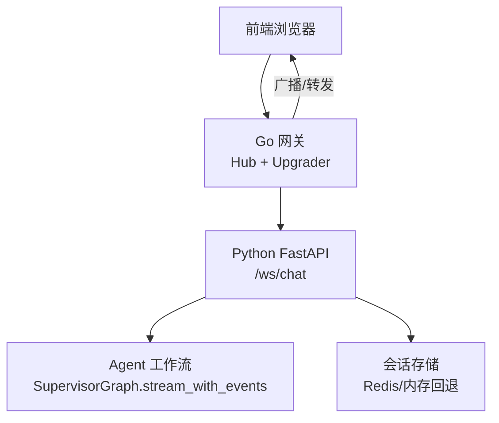
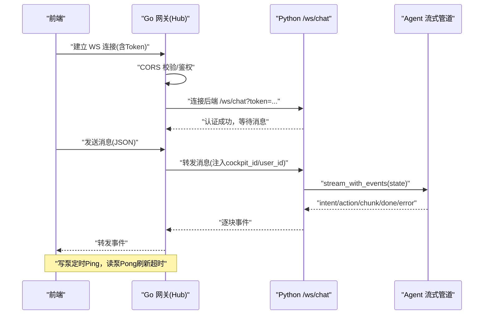
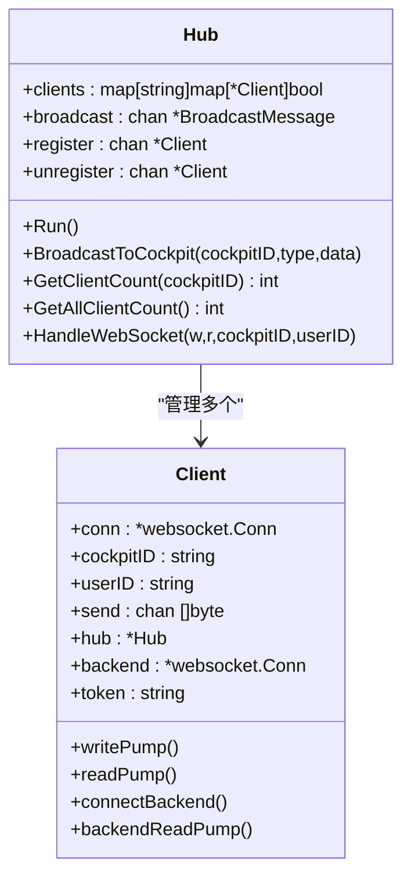
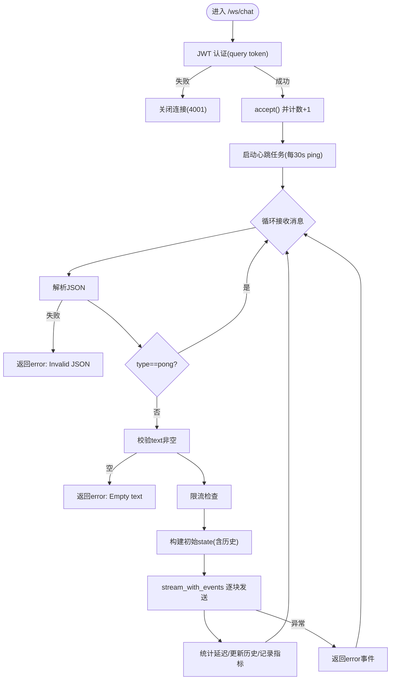
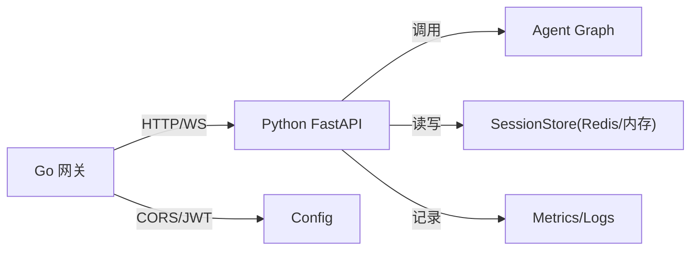

# WebSocket实时通信API

<cite>
**本文引用的文件**   
- [backend_design/nexus/api/websocket.py](file://backend_design/nexus/api/websocket.py)
- [backend_design/nexus_gate/internal/ws/hub.go](file://backend_design/nexus_gate/internal/ws/hub.go)
- [backend_design/nexus/config/server.py](file://backend_design/nexus/config/server.py)
- [backend_design/nexus_gate/internal/config/config.go](file://backend_design/nexus_gate/internal/config/config.go)
- [backend_design/nexus/core/exceptions.py](file://backend_design/nexus/core/exceptions.py)
- [backend_design/nexus/api/routes/chat.py](file://backend_design/nexus/api/routes/chat.py)
- [frontend_design/src/lib/api.ts](file://frontend_design/src/lib/api.ts)
</cite>

## 目录
1. [简介](#简介)
2. [项目结构](#项目结构)
3. [核心组件](#核心组件)
4. [架构总览](#架构总览)
5. [详细组件分析](#详细组件分析)
6. [依赖关系分析](#依赖关系分析)
7. [性能考量](#性能考量)
8. [故障排查指南](#故障排查指南)
9. [结论](#结论)
10. [附录](#附录)

## 简介
本文件为 NexusCockpit 的 WebSocket 实时通信 API 提供全面文档，覆盖连接建立、维护与断线重连机制；消息协议设计（类型定义、序列化格式、错误处理）；典型实时场景（语音通话、车控指令下发、状态推送、聊天消息）；连接管理策略（连接池、心跳检测、并发控制、内存管理）；完整消息流转图、客户端集成示例与调试方法；WebSocket 与 HTTP API 的协作模式与数据一致性保证；性能优化建议、安全考虑与兼容性降级策略。

## 项目结构
NexusCockpit 在网关层（Go）与 AI 服务层（Python）之间通过 WebSocket 进行双向实时通信：
- Go 网关负责前端连接接入、鉴权、跨域校验、Hub 广播、后端代理转发、心跳保活与背压保护。
- Python FastAPI 提供 /ws/chat 端点，完成 JWT 认证、限流、Agent 流式事件输出、会话历史持久化与指标记录。
- 前端通过统一 API 客户端发起 REST/SSE/WS 请求，自动注入 Token 与座舱上下文。

图表来源
- [backend_design/nexus_gate/internal/ws/hub.go:150-190](file://backend_design/nexus_gate/internal/ws/hub.go#L150-L190)
- [backend_design/nexus/api/websocket.py:71-115](file://backend_design/nexus/api/websocket.py#L71-L115)

章节来源
- [backend_design/nexus/api/websocket.py:1-209](file://backend_design/nexus/api/websocket.py#L1-L209)
- [backend_design/nexus_gate/internal/ws/hub.go:1-353](file://backend_design/nexus_gate/internal/ws/hub.go#L1-L353)

## 核心组件
- Go 网关 Hub
  - 负责 WS 升级、CORS 白名单校验、Client 注册/注销、按 cockpit_id 广播、写泵心跳 Ping、读泵转发、后端连接管理与重连。
- Python WebSocket 处理器
  - 负责 /ws/chat 认证、心跳 ping/pong、限流、构建 Agent State、流式事件发送、会话历史持久化与指标记录。
- 配置与安全
  - Python 侧 ServerConfig/JWTConfig；Go 侧 Config 加载与生产环境安全检查。
- 异常体系
  - Python 自定义异常族，便于统一错误码与详情透传。

章节来源
- [backend_design/nexus_gate/internal/ws/hub.go:22-38](file://backend_design/nexus_gate/internal/ws/hub.go#L22-L38)
- [backend_design/nexus/api/websocket.py:48-69](file://backend_design/nexus/api/websocket.py#L48-L69)
- [backend_design/nexus/config/server.py:15-61](file://backend_design/nexus/config/server.py#L15-L61)
- [backend_design/nexus_gate/internal/config/config.go:120-142](file://backend_design/nexus_gate/internal/config/config.go#L120-L142)
- [backend_design/nexus/core/exceptions.py:19-128](file://backend_design/nexus/core/exceptions.py#L19-L128)

## 架构总览
整体交互流程：
- 前端通过 Go 网关建立 WebSocket 连接，携带 Authorization 或 query token。
- 网关校验来源与鉴权，创建 Client，尝试连接 Python /ws/chat。
- Python 端验证 Token，启动心跳任务，接收消息并进入 Agent 流式处理。
- 事件逐块经网关回推至前端；失败时网关返回结构化 error 事件。

图表来源
- [backend_design/nexus_gate/internal/ws/hub.go:150-190](file://backend_design/nexus_gate/internal/ws/hub.go#L150-L190)
- [backend_design/nexus_gate/internal/ws/hub.go:221-248](file://backend_design/nexus_gate/internal/ws/hub.go#L221-L248)
- [backend_design/nexus/api/websocket.py:71-115](file://backend_design/nexus/api/websocket.py#L71-L115)
- [backend_design/nexus/api/websocket.py:181-184](file://backend_design/nexus/api/websocket.py#L181-L184)

## 详细组件分析

### Go 网关 Hub（连接管理与转发）
- 连接升级与来源校验：基于 CORS_ORIGINS 白名单，非浏览器无 Origin 放行由 JWT 把关。
- Client 生命周期：register/unregister，send 通道缓冲 256，满则关闭连接避免阻塞。
- 心跳保活：写泵每 30s 发送 Ping，设置写超时 10s；读泵 PongHandler 刷新读超时 60s。
- 后端连接：构造 ws://AIHost:AIPort/ws/chat?token=...，失败则提示不可用；读取后端消息回推客户端；写入失败触发重连并重发。
- 消息增强：injectCockpitInfo 将 cockpit_id/user_id 注入 JSON 或包装原始文本。

图表来源
- [backend_design/nexus_gate/internal/ws/hub.go:51-75](file://backend_design/nexus_gate/internal/ws/hub.go#L51-L75)
- [backend_design/nexus_gate/internal/ws/hub.go:192-219](file://backend_design/nexus_gate/internal/ws/hub.go#L192-L219)
- [backend_design/nexus_gate/internal/ws/hub.go:276-326](file://backend_design/nexus_gate/internal/ws/hub.go#L276-L326)
- [backend_design/nexus_gate/internal/ws/hub.go:328-352](file://backend_design/nexus_gate/internal/ws/hub.go#L328-L352)

章节来源
- [backend_design/nexus_gate/internal/ws/hub.go:22-38](file://backend_design/nexus_gate/internal/ws/hub.go#L22-L38)
- [backend_design/nexus_gate/internal/ws/hub.go:150-190](file://backend_design/nexus_gate/internal/ws/hub.go#L150-L190)
- [backend_design/nexus_gate/internal/ws/hub.go:221-248](file://backend_design/nexus_gate/internal/ws/hub.go#L221-L248)
- [backend_design/nexus_gate/internal/ws/hub.go:276-326](file://backend_design/nexus_gate/internal/ws/hub.go#L276-L326)
- [backend_design/nexus_gate/internal/ws/hub.go:328-352](file://backend_design/nexus_gate/internal/ws/hub.go#L328-L352)

### Python WebSocket 处理器（/ws/chat）
- 认证：从 query 参数 token 解析 JWT，失败关闭连接。
- 心跳：服务端每 30s 发送 ping，客户端需回复 pong。
- 消息处理：解析 JSON，空文本报错；限流检查；构建初始 state；调用 agent_graph.stream_with_events 逐块发送；完成后更新会话历史与指标。
- 错误处理：JSON 解析失败、Agent 未初始化、运行时异常均返回结构化 error。

图表来源
- [backend_design/nexus/api/websocket.py:71-115](file://backend_design/nexus/api/websocket.py#L71-L115)
- [backend_design/nexus/api/websocket.py:117-147](file://backend_design/nexus/api/websocket.py#L117-L147)
- [backend_design/nexus/api/websocket.py:149-199](file://backend_design/nexus/api/websocket.py#L149-L199)

章节来源
- [backend_design/nexus/api/websocket.py:48-69](file://backend_design/nexus/api/websocket.py#L48-L69)
- [backend_design/nexus/api/websocket.py:71-115](file://backend_design/nexus/api/websocket.py#L71-L115)
- [backend_design/nexus/api/websocket.py:117-147](file://backend_design/nexus/api/websocket.py#L117-L147)
- [backend_design/nexus/api/websocket.py:149-199](file://backend_design/nexus/api/websocket.py#L149-L199)

### 消息协议设计
- 统一 JSON 事件格式：
  - type: "intent"/"action"/"chunk"/"done"/"error"/"ping"/"pong"
  - data: 各类型对应负载（如 chunk.chunk、done.latency_ms、error.message）
- 序列化：UTF-8 JSON 文本帧；网关对非 JSON 消息包装为包含 cockpit_id/user_id 的 JSON。
- 错误处理：
  - 认证失败：关闭连接并带原因码
  - JSON 解析失败：返回 error 事件
  - Agent 未初始化：返回 error 事件
  - 后端不可用：网关返回 error 事件并尝试重连

章节来源
- [backend_design/nexus/api/websocket.py:17-25](file://backend_design/nexus/api/websocket.py#L17-L25)
- [backend_design/nexus/api/websocket.py:120-136](file://backend_design/nexus/api/websocket.py#L120-L136)
- [backend_design/nexus/api/websocket.py:170-179](file://backend_design/nexus/api/websocket.py#L170-L179)
- [backend_design/nexus_gate/internal/ws/hub.go:312-326](file://backend_design/nexus_gate/internal/ws/hub.go#L312-L326)
- [backend_design/nexus_gate/internal/ws/hub.go:328-352](file://backend_design/nexus_gate/internal/ws/hub.go#L328-L352)

### 实时功能场景
- 语音通话：前端采集音频 → ASR REST 转文本 → 通过 WS 发送文本 → Agent 流式生成回复 → TTS 播放。
- 车控指令下发：识别意图为 vehicle_* → 执行技能 → 返回 action 与结果 → 前端驱动 UI/设备。
- 状态推送：后端通过 Hub.BroadcastToCockpit 向指定座舱所有客户端推送状态变更。
- 聊天消息：REST/SSE 用于单向流式输出；WS 用于双向交互（语音对话）。

章节来源
- [backend_design/nexus/api/routes/chat.py:467-686](file://backend_design/nexus/api/routes/chat.py#L467-L686)
- [backend_design/nexus_gate/internal/ws/hub.go:123-130](file://backend_design/nexus_gate/internal/ws/hub.go#L123-L130)
- [frontend_design/src/lib/api.ts:612-625](file://frontend_design/src/lib/api.ts#L612-L625)

### 连接管理策略
- 连接池：Hub 以 cockpit_id 分组维护 Client 集合，支持广播到座舱级。
- 心跳检测：Go 写泵每 30s Ping；Python 每 30s ping；PongHandler 刷新读超时。
- 并发控制：Python 会话级 asyncio.Lock 防止同 session 并发污染；Gateway send 通道缓冲 256 防阻塞。
- 内存管理：空闲锁清理上限；连接断开及时 close 与 unregister；后端连接失败重试与资源释放。

章节来源
- [backend_design/nexus_gate/internal/ws/hub.go:78-121](file://backend_design/nexus_gate/internal/ws/hub.go#L78-L121)
- [backend_design/nexus_gate/internal/ws/hub.go:192-219](file://backend_design/nexus_gate/internal/ws/hub.go#L192-L219)
- [backend_design/nexus/api/routes/chat.py:224-246](file://backend_design/nexus/api/routes/chat.py#L224-L246)
- [backend_design/nexus/api/websocket.py:101-115](file://backend_design/nexus/api/websocket.py#L101-L115)

### 客户端集成示例与调试
- 前端集成要点：
  - 获取 Token：/auth/token，存入 localStorage，请求拦截器自动附加 Authorization。
  - SSE 流式：/chat/stream 使用 ReadableStream 解析 data: JSON。
  - WS 连接：ws://gateway/ws?token=...，发送 {"text":"...", "user_id":"...", "session_id":"..."}，处理 intent/action/chunk/done/error/ping/pong。
- 调试方法：
  - 浏览器开发者工具 Network 面板查看 WS 帧与 SSE 事件。
  - 后端日志定位认证、限流、Agent 流式、会话持久化与指标记录。
  - 网关日志观察 origin 拒绝、后端连接失败、缓冲区满等。

章节来源
- [frontend_design/src/lib/api.ts:55-103](file://frontend_design/src/lib/api.ts#L55-L103)
- [frontend_design/src/lib/api.ts:261-341](file://frontend_design/src/lib/api.ts#L261-L341)
- [backend_design/nexus/api/websocket.py:117-147](file://backend_design/nexus/api/websocket.py#L117-L147)
- [backend_design/nexus_gate/internal/ws/hub.go:22-38](file://backend_design/nexus_gate/internal/ws/hub.go#L22-L38)

### WebSocket 与 HTTP API 协作与一致性
- 协作模式：
  - REST/SSE：适合单向流式输出（文本对话），具备缓存与指标记录。
  - WebSocket：适合双向交互（语音对话），低延迟、可取消、可心跳。
- 数据一致性：
  - 会话历史优先 Redis SessionStore，不可用时回退内存 dict。
  - chat_logs 成对写入保障：即使流中断也填充兜底话术确保 assistant_response 非空。
  - 指标记录与持久化在 finally 中执行，保证最终一致。

章节来源
- [backend_design/nexus/api/routes/chat.py:151-187](file://backend_design/nexus/api/routes/chat.py#L151-L187)
- [backend_design/nexus/api/routes/chat.py:646-676](file://backend_design/nexus/api/routes/chat.py#L646-L676)
- [backend_design/nexus/api/websocket.py:188-193](file://backend_design/nexus/api/websocket.py#L188-L193)

## 依赖关系分析
- Go 网关依赖：
  - gorilla/websocket：WS 升级与读写。
  - 内部 config：CORS、JWT、AI 服务地址、限流等。
- Python 服务依赖：
  - FastAPI/Starlette：WS 路由与异步 I/O。
  - Agent Graph：SupervisorGraph.stream_with_events。
  - 中间件：RateLimiter、SessionStore、DB Manager、Langfuse 监控。

图表来源
- [backend_design/nexus_gate/internal/config/config.go:80-118](file://backend_design/nexus_gate/internal/config/config.go#L80-L118)
- [backend_design/nexus/api/routes/chat.py:248-317](file://backend_design/nexus/api/routes/chat.py#L248-L317)

章节来源
- [backend_design/nexus_gate/internal/config/config.go:80-118](file://backend_design/nexus_gate/internal/config/config.go#L80-L118)
- [backend_design/nexus/api/routes/chat.py:248-317](file://backend_design/nexus/api/routes/chat.py#L248-L317)

## 性能考量
- 连接与转发
  - 合理设置 send 通道容量（当前 256），避免阻塞导致连接关闭。
  - 心跳间隔与超时平衡：30s Ping，10s 写超时，60s 读超时。
- 流式处理
  - 优先使用 GenerationTaskPool 托管 pipeline，SSE/WS 仅消费事件，提升抗断连能力。
  - 语义缓存命中直接返回 done，降低 LLM 调用压力。
- 资源清理
  - 会话锁上限与空闲清理，防止长期运行内存泄漏。
  - 后端连接失败快速失败与重试，避免僵尸连接。

[本节为通用指导，不直接分析具体文件]

## 故障排查指南
- 认证失败
  - 检查 query token 或 Authorization Bearer 是否正确；确认 JWT_SECRET 一致。
- 连接被拒
  - 检查 CORS_ORIGINS 是否包含前端域名；浏览器 Origin 头是否存在。
- 后端不可用
  - 观察网关日志“backend connect failed”；确认 AIHost/AIPort 可达；检查 Python /ws/chat 健康。
- 消息丢失或乱序
  - 检查 send 通道是否满；确认客户端正确处理 chunk/done 顺序。
- 会话不一致
  - 检查 SessionStore 可用性；确认 finally 块中的持久化逻辑执行。

章节来源
- [backend_design/nexus/api/websocket.py:88-92](file://backend_design/nexus/api/websocket.py#L88-L92)
- [backend_design/nexus_gate/internal/ws/hub.go:22-38](file://backend_design/nexus_gate/internal/ws/hub.go#L22-L38)
- [backend_design/nexus_gate/internal/ws/hub.go:241-248](file://backend_design/nexus_gate/internal/ws/hub.go#L241-L248)
- [backend_design/nexus/api/routes/chat.py:646-676](file://backend_design/nexus/api/routes/chat.py#L646-L676)

## 结论
NexusCockpit 的 WebSocket 实时通信通过 Go 网关与 Python FastAPI 协同实现高可靠、低延迟的双向交互。网关层提供连接治理、跨域与鉴权、广播与转发；Python 层专注业务流式处理与会话一致性。结合心跳、限流、缓存与指标记录，系统具备良好的可扩展性与可观测性。建议在部署时严格配置安全项，并根据流量特征调优心跳与缓冲参数。

[本节为总结，不直接分析具体文件]

## 附录

### 兼容性与降级策略
- 浏览器兼容性
  - WebSocket：现代浏览器均支持；旧版 IE 不支持，需降级为 SSE 或长轮询。
  - SSE：IE 不支持，需降级为长轮询。
- 降级路径
  - 若 WS 不可用，前端回退到 /chat/stream（SSE）；若 SSE 不可用，回退到普通 POST /chat。
  - 网关后端不可用时返回 error 事件，前端提示重试。

[本节为通用指导，不直接分析具体文件]

### 安全注意事项
- 生产环境必须设置强 JWT_SECRET、RBAC 口令与具体 CORS_ORIGINS。
- WS 连接通过 query token 或 Authorization 传递，禁止明文敏感信息。
- 限制消息大小（网关读限制 64KB），防止大报文攻击。

章节来源
- [backend_design/nexus_gate/internal/config/config.go:120-142](file://backend_design/nexus_gate/internal/config/config.go#L120-L142)
- [backend_design/nexus_gate/internal/ws/hub.go:286](file://backend_design/nexus_gate/internal/ws/hub.go#L286)

### 配置参考
- Python ServerConfig/JWTConfig：监听端口、CORS、JWT 密钥与过期时间、RBAC 默认角色等。
- Go Config：网关与 AI 服务地址、CORS、限流 QPS、座舱数量、Prometheus 地址等。

章节来源
- [backend_design/nexus/config/server.py:15-61](file://backend_design/nexus/config/server.py#L15-L61)
- [backend_design/nexus_gate/internal/config/config.go:80-118](file://backend_design/nexus_gate/internal/config/config.go#L80-L118)