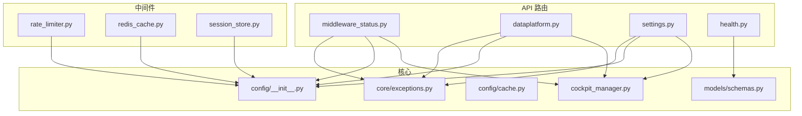
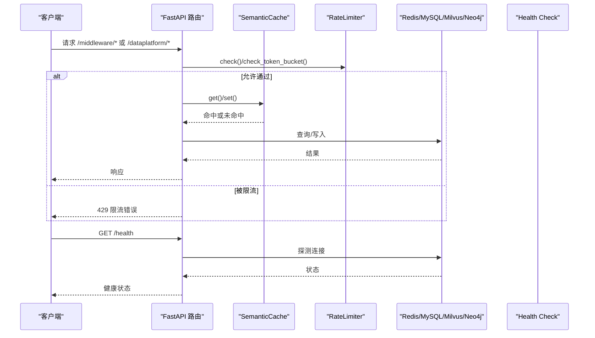
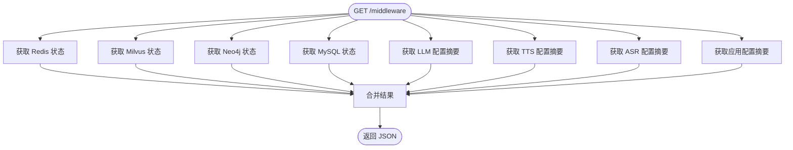
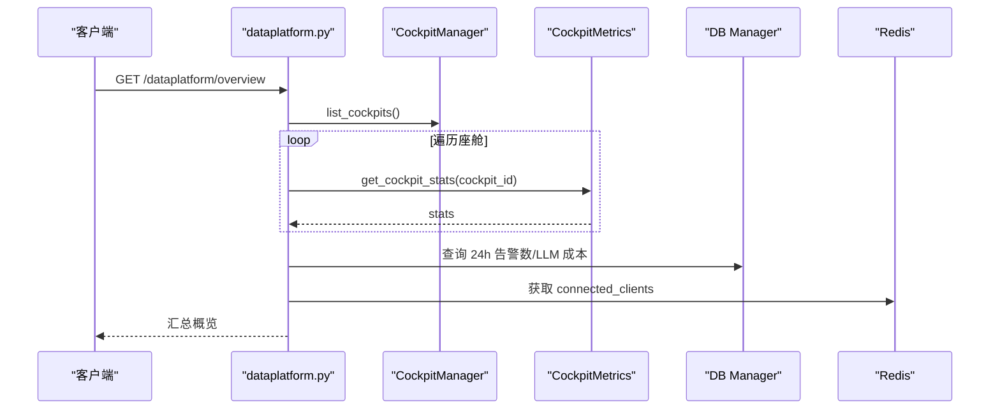
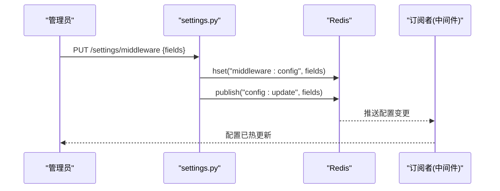
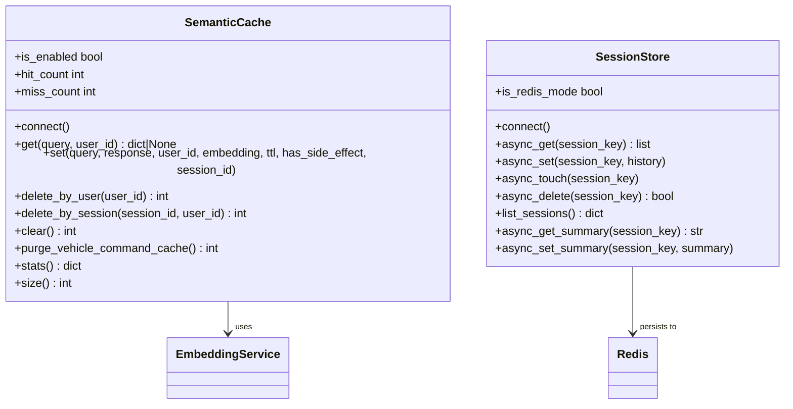
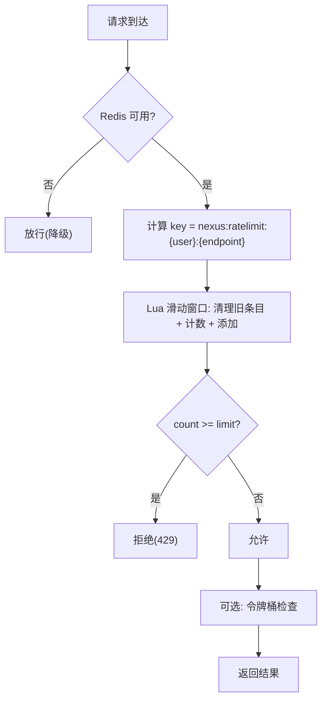
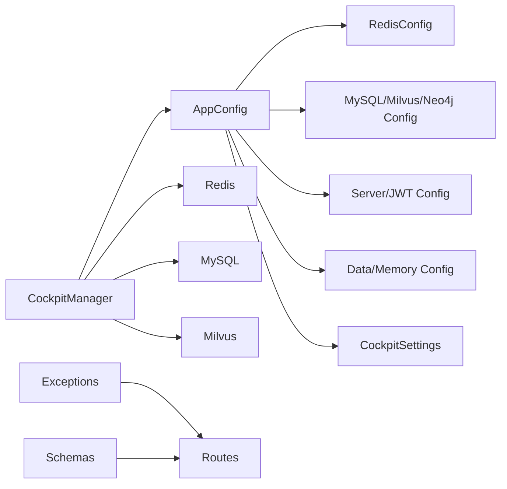

# 中间件服务API

<cite>
**本文引用的文件**   
- [backend_design/nexus/api/routes/middleware_status.py](file://backend_design/nexus/api/routes/middleware_status.py)
- [backend_design/nexus/api/routes/dataplatform.py](file://backend_design/nexus/api/routes/dataplatform.py)
- [backend_design/nexus/api/routes/settings.py](file://backend_design/nexus/api/routes/settings.py)
- [backend_design/nexus/middleware/rate_limiter.py](file://backend_design/nexus/middleware/rate_limiter.py)
- [backend_design/nexus/middleware/redis_cache.py](file://backend_design/nexus/middleware/redis_cache.py)
- [backend_design/nexus/middleware/session_store.py](file://backend_design/nexus/middleware/session_store.py)
- [backend_design/nexus/core/cockpit_manager.py](file://backend_design/nexus/core/cockpit_manager.py)
- [backend_design/nexus/config/__init__.py](file://backend_design/nexus/config/__init__.py)
- [backend_design/nexus/config/cache.py](file://backend_design/nexus/config/cache.py)
- [backend_design/nexus/core/exceptions.py](file://backend_design/nexus/core/exceptions.py)
- [backend_design/nexus/models/schemas.py](file://backend_design/nexus/models/schemas.py)
- [backend_design/nexus/api/routes/health.py](file://backend_design/nexus/api/routes/health.py)
</cite>

## 目录
1. [简介](#简介)
2. [项目结构](#项目结构)
3. [核心组件](#核心组件)
4. [架构总览](#架构总览)
5. [详细组件分析](#详细组件分析)
6. [依赖关系分析](#依赖关系分析)
7. [性能考量](#性能考量)
8. [故障排查指南](#故障排查指南)
9. [结论](#结论)
10. [附录](#附录)

## 简介
本文件为 NexusCockpit 中间件服务 API 的详细技术文档，覆盖以下能力：
- 中间件状态监控接口：Redis、Milvus、Neo4j、MySQL、LLM/TTS/ASR 等运行态与配置概览。
- 数据中台 API：全局统计、座舱对比、告警历史、Agent 活动时间线、缓存趋势等。
- 系统设置接口：座舱管理、用户管理、中间件配置热更新与验证规则。
- 缓存服务：基于 Redis 的语义缓存（向量检索）、会话存储、分布式锁与键值操作。
- 限流服务：滑动窗口与令牌桶两种算法，支持实时监控与剩余配额查询。
- 健康检查、性能指标与故障转移机制说明。
- 扩展开发指南：自定义中间件集成方法与微服务下的服务发现与负载均衡策略建议。

## 项目结构
NexusCockpit 后端采用 FastAPI 路由 + 模块化中间件的架构：
- API 路由层：按功能划分 routes（middleware_status、dataplatform、settings、health）。
- 中间件层：rate_limiter、redis_cache、session_store。
- 核心能力：cockpit_manager（多座舱管理）、config（统一配置中心）、exceptions（异常体系）、models/schemas（请求响应模型）。

图表来源
- [backend_design/nexus/api/routes/middleware_status.py:1-269](file://backend_design/nexus/api/routes/middleware_status.py#L1-L269)
- [backend_design/nexus/api/routes/dataplatform.py:1-383](file://backend_design/nexus/api/routes/dataplatform.py#L1-L383)
- [backend_design/nexus/api/routes/settings.py:1-393](file://backend_design/nexus/api/routes/settings.py#L1-L393)
- [backend_design/nexus/middleware/rate_limiter.py:1-297](file://backend_design/nexus/middleware/rate_limiter.py#L1-L297)
- [backend_design/nexus/middleware/redis_cache.py:1-615](file://backend_design/nexus/middleware/redis_cache.py#L1-L615)
- [backend_design/nexus/middleware/session_store.py:1-294](file://backend_design/nexus/middleware/session_store.py#L1-L294)
- [backend_design/nexus/core/cockpit_manager.py:1-397](file://backend_design/nexus/core/cockpit_manager.py#L1-L397)
- [backend_design/nexus/config/__init__.py:1-167](file://backend_design/nexus/config/__init__.py#L1-L167)
- [backend_design/nexus/config/cache.py:1-41](file://backend_design/nexus/config/cache.py#L1-L41)
- [backend_design/nexus/core/exceptions.py:1-128](file://backend_design/nexus/core/exceptions.py#L1-L128)
- [backend_design/nexus/models/schemas.py:1-88](file://backend_design/nexus/models/schemas.py#L1-L88)
- [backend_design/nexus/api/routes/health.py:1-108](file://backend_design/nexus/api/routes/health.py#L1-L108)

章节来源
- [backend_design/nexus/api/routes/middleware_status.py:1-269](file://backend_design/nexus/api/routes/middleware_status.py#L1-L269)
- [backend_design/nexus/api/routes/dataplatform.py:1-383](file://backend_design/nexus/api/routes/dataplatform.py#L1-L383)
- [backend_design/nexus/api/routes/settings.py:1-393](file://backend_design/nexus/api/routes/settings.py#L1-L393)
- [backend_design/nexus/middleware/rate_limiter.py:1-297](file://backend_design/nexus/middleware/rate_limiter.py#L1-L297)
- [backend_design/nexus/middleware/redis_cache.py:1-615](file://backend_design/nexus/middleware/redis_cache.py#L1-L615)
- [backend_design/nexus/middleware/session_store.py:1-294](file://backend_design/nexus/middleware/session_store.py#L1-L294)
- [backend_design/nexus/core/cockpit_manager.py:1-397](file://backend_design/nexus/core/cockpit_manager.py#L1-L397)
- [backend_design/nexus/config/__init__.py:1-167](file://backend_design/nexus/config/__init__.py#L1-L167)
- [backend_design/nexus/config/cache.py:1-41](file://backend_design/nexus/config/cache.py#L1-L41)
- [backend_design/nexus/core/exceptions.py:1-128](file://backend_design/nexus/core/exceptions.py#L1-L128)
- [backend_design/nexus/models/schemas.py:1-88](file://backend_design/nexus/models/schemas.py#L1-L88)
- [backend_design/nexus/api/routes/health.py:1-108](file://backend_design/nexus/api/routes/health.py#L1-L108)

## 核心组件
- 中间件状态监控：提供 /middleware/* 端点，返回 Redis/Milvus/Neo4j/MySQL/LLM/TTS/ASR/App 的运行状态与关键配置摘要。
- 数据中台：/dataplatform/* 聚合各座舱指标、告警、活动、缓存趋势与并发资源使用。
- 系统设置：/settings/* 提供座舱 CRUD、用户管理、中间件配置热更新、声纹注册/验证/删除。
- 缓存服务：SemanticCache 基于 Redis 8 RediSearch KNN 或降级 scan；SessionStore 持久化会话与滚动摘要；RateLimiter 提供滑动窗口与令牌桶限流。
- 健康检查：/health 检测 Milvus/Neo4j/Redis/MySQL/Agent 等组件连接状态。

章节来源
- [backend_design/nexus/api/routes/middleware_status.py:1-269](file://backend_design/nexus/api/routes/middleware_status.py#L1-L269)
- [backend_design/nexus/api/routes/dataplatform.py:1-383](file://backend_design/nexus/api/routes/dataplatform.py#L1-L383)
- [backend_design/nexus/api/routes/settings.py:1-393](file://backend_design/nexus/api/routes/settings.py#L1-L393)
- [backend_design/nexus/middleware/redis_cache.py:1-615](file://backend_design/nexus/middleware/redis_cache.py#L1-L615)
- [backend_design/nexus/middleware/session_store.py:1-294](file://backend_design/nexus/middleware/session_store.py#L1-L294)
- [backend_design/nexus/middleware/rate_limiter.py:1-297](file://backend_design/nexus/middleware/rate_limiter.py#L1-L297)
- [backend_design/nexus/api/routes/health.py:1-108](file://backend_design/nexus/api/routes/health.py#L1-L108)

## 架构总览
整体调用链：客户端通过 FastAPI 路由进入业务逻辑，访问中间件（缓存/限流/会话），并读取/写入外部存储（Redis、MySQL、Milvus、Neo4j）。配置由 AppConfig 统一管理，异常体系集中处理。

图表来源
- [backend_design/nexus/api/routes/middleware_status.py:1-269](file://backend_design/nexus/api/routes/middleware_status.py#L1-L269)
- [backend_design/nexus/api/routes/dataplatform.py:1-383](file://backend_design/nexus/api/routes/dataplatform.py#L1-L383)
- [backend_design/nexus/middleware/rate_limiter.py:1-297](file://backend_design/nexus/middleware/rate_limiter.py#L1-L297)
- [backend_design/nexus/middleware/redis_cache.py:1-615](file://backend_design/nexus/middleware/redis_cache.py#L1-L615)
- [backend_design/nexus/api/routes/health.py:1-108](file://backend_design/nexus/api/routes/health.py#L1-L108)

## 详细组件分析

### 中间件状态监控接口
- 路径前缀：/middleware
- 主要端点：
  - GET /middleware/：汇总 ASR/TTS/Milvus/Neo4j/MySQL/Redis/LLM/App 的状态与配置摘要。
  - GET /middleware/redis：Redis 版本、内存、连接数、keyspace。
  - GET /middleware/milvus：URI、集合列表与数量。
  - GET /middleware/neo4j：节点/关系计数、标签列表。
  - GET /middleware/mysql：版本、连接数、主机/端口/库名。
- 数据格式要点：
  - name/status/version/uri/collections/connection_count/keyspace 等字段。
  - LLM 返回 provider/model/base_url/max_tokens/temperature 及脱敏 api_key。
  - TTS/ASR 返回 engine/model_path/sample_rate 等。
  - App 返回 version/environment/debug/host/port/cors_origins/rate_limit_enabled/cache_enabled 等。

图表来源
- [backend_design/nexus/api/routes/middleware_status.py:1-269](file://backend_design/nexus/api/routes/middleware_status.py#L1-L269)

章节来源
- [backend_design/nexus/api/routes/middleware_status.py:1-269](file://backend_design/nexus/api/routes/middleware_status.py#L1-L269)

### 数据中台 API
- 路径前缀：/dataplatform
- 主要端点：
  - GET /dataplatform/overview：全局统计（聊天/车控指令总数、缓存命中率、平均延迟、座舱数、24h 告警数、当前并发、峰值并发、LLM 成本汇总）。
  - GET /dataplatform/cockpit/{cockpit_id}：单座舱详情与统计。
  - GET /dataplatform/concurrency：并发能力（当前并发、峰值、QPS、Agent 并行度、资源使用）。
  - GET /dataplatform/alerts：最近 N 小时告警（支持 cockpit_id 过滤）。
  - GET /dataplatform/agent/activity：最近 N 小时 Agent 活动时间线（支持 cockpit_id 过滤）。
  - GET /dataplatform/comparison：多座舱对比（聊天/车控/缓存命中率/成功率/平均延迟/健康评分）。
  - GET /dataplatform/cache-trend：最近 24 小时缓存命中/未命中趋势（每 2 小时一个点）。
- 数据来源：
  - CockpitManager 列出座舱。
  - CockpitMetrics（get_cockpit_metrics）获取各座舱统计。
  - DB Manager 查询 MySQL（mainagent_logs、subagent_logs、chat_logs 等）。
  - Redis 查询当前连接数。
  - psutil 获取 CPU/内存/磁盘使用。

图表来源
- [backend_design/nexus/api/routes/dataplatform.py:1-383](file://backend_design/nexus/api/routes/dataplatform.py#L1-L383)
- [backend_design/nexus/core/cockpit_manager.py:1-397](file://backend_design/nexus/core/cockpit_manager.py#L1-L397)

章节来源
- [backend_design/nexus/api/routes/dataplatform.py:1-383](file://backend_design/nexus/api/routes/dataplatform.py#L1-L383)
- [backend_design/nexus/core/cockpit_manager.py:1-397](file://backend_design/nexus/core/cockpit_manager.py#L1-L397)

### 系统设置接口
- 路径前缀：/settings
- 主要端点：
  - 座舱管理：GET/POST/PUT/DELETE /settings/cockpits
  - 用户管理：GET/POST/DELETE /settings/users，重置密码 PUT /settings/users/{user_id}/password
  - 中间件配置：GET/PUT /settings/middleware（热更新）
  - 声纹：GET/POST/DELETE /settings/voiceprint/*
- 热更新机制：
  - PUT /settings/middleware 将变更写入 Redis hash（middleware:config），并通过 Pub/Sub 发布 config:update 通知，订阅方监听后生效。
- 配置验证规则：
  - 密码长度校验（至少 6 位）。
  - 数据库不可用时返回 503。
  - 重复用户创建返回 409。
  - 不存在资源返回 404。

图表来源
- [backend_design/nexus/api/routes/settings.py:1-393](file://backend_design/nexus/api/routes/settings.py#L1-L393)

章节来源
- [backend_design/nexus/api/routes/settings.py:1-393](file://backend_design/nexus/api/routes/settings.py#L1-L393)

### 缓存服务（Redis 语义缓存与会话存储）
- SemanticCache（redis_cache.py）：
  - 特性：RediSearch KNN 向量检索 O(log n)，按 user_id 分片，TTL 分级，副作用隔离（has_side_effect=True 不缓存）。
  - 方法：connect/get/set/delete_by_user/delete_by_session/clear/purge_vehicle_command_cache/stats/size/is_enabled/hit_count/miss_count。
  - 兼容：FT.* 不可用自动降级为 scan 模式（O(n)）。
- SessionStore（session_store.py）：
  - 特性：Redis 持久化会话历史与滚动摘要，支持 TTL 续期与内存降级。
  - 方法：async_get/async_set/async_touch/async_delete/list_sessions/async_get_summary/async_set_summary/is_redis_mode。
- 键空间约定：
  - 语义缓存条目前缀：nexus:cache:entry:*
  - 会话历史前缀：nexus:session:*
  - 滚动摘要前缀：nexus:summary:*

图表来源
- [backend_design/nexus/middleware/redis_cache.py:1-615](file://backend_design/nexus/middleware/redis_cache.py#L1-L615)
- [backend_design/nexus/middleware/session_store.py:1-294](file://backend_design/nexus/middleware/session_store.py#L1-L294)

章节来源
- [backend_design/nexus/middleware/redis_cache.py:1-615](file://backend_design/nexus/middleware/redis_cache.py#L1-L615)
- [backend_design/nexus/middleware/session_store.py:1-294](file://backend_design/nexus/middleware/session_store.py#L1-L294)

### 限流服务（滑动窗口与令牌桶）
- RateLimiter（rate_limiter.py）：
  - 滑动窗口：基于 Redis ZSET 原子 Lua 脚本，清理旧条目+计数+添加新条目，超限不污染计数器。
  - 令牌桶：基于 Redis Hash 原子 Lua 脚本，支持突发流量与稳定速率控制。
  - 方法：connect/check/check_or_raise/check_token_bucket/get_remaining/close。
  - 默认限制：60 次/分钟；超出抛出 RateLimitError（映射为 429）。
- 实时监控：
  - get_remaining 返回剩余次数。
  - 日志记录超限事件。

图表来源
- [backend_design/nexus/middleware/rate_limiter.py:1-297](file://backend_design/nexus/middleware/rate_limiter.py#L1-L297)

章节来源
- [backend_design/nexus/middleware/rate_limiter.py:1-297](file://backend_design/nexus/middleware/rate_limiter.py#L1-L297)

### 健康检查与性能指标
- 健康检查（health.py）：
  - GET /health：检测 Milvus/Neo4j/Redis/MySQL/Agent 状态，返回 healthy/degraded。
  - GET /：根路径返回基本信息与文档入口。
- 性能指标：
  - 数据中台聚合各座舱 avg_latency_ms、cache_hit_rate、error_rate、vehicle_cmd_success_rate 等。
  - 资源使用：CPU/内存/磁盘百分比。

章节来源
- [backend_design/nexus/api/routes/health.py:1-108](file://backend_design/nexus/api/routes/health.py#L1-L108)
- [backend_design/nexus/api/routes/dataplatform.py:1-383](file://backend_design/nexus/api/routes/dataplatform.py#L1-L383)

## 依赖关系分析
- 配置中心（AppConfig）聚合所有子系统配置，提供 lru_cache 单例与快捷访问函数。
- RedisConfig 定义连接参数与语义缓存行为（相似度阈值、TTL、开关）。
- CockpitManager 负责多座舱生命周期与中间件初始化（Redis/MySQL/Milvus）。
- 异常体系（NexusError 及其子类）统一错误码与详情，便于前端差异化处理。

图表来源
- [backend_design/nexus/config/__init__.py:1-167](file://backend_design/nexus/config/__init__.py#L1-L167)
- [backend_design/nexus/config/cache.py:1-41](file://backend_design/nexus/config/cache.py#L1-L41)
- [backend_design/nexus/core/cockpit_manager.py:1-397](file://backend_design/nexus/core/cockpit_manager.py#L1-L397)
- [backend_design/nexus/core/exceptions.py:1-128](file://backend_design/nexus/core/exceptions.py#L1-L128)
- [backend_design/nexus/models/schemas.py:1-88](file://backend_design/nexus/models/schemas.py#L1-L88)

章节来源
- [backend_design/nexus/config/__init__.py:1-167](file://backend_design/nexus/config/__init__.py#L1-L167)
- [backend_design/nexus/config/cache.py:1-41](file://backend_design/nexus/config/cache.py#L1-L41)
- [backend_design/nexus/core/cockpit_manager.py:1-397](file://backend_design/nexus/core/cockpit_manager.py#L1-L397)
- [backend_design/nexus/core/exceptions.py:1-128](file://backend_design/nexus/core/exceptions.py#L1-L128)
- [backend_design/nexus/models/schemas.py:1-88](file://backend_design/nexus/models/schemas.py#L1-L88)

## 性能考量
- 语义缓存：
  - 优先使用 RediSearch KNN（O(log n)），不可用时回退到 scan（O(n)）。
  - 相似度阈值与 TTL 可调，避免误命中与过期。
  - 副作用隔离确保车控指令不被缓存命中跳过执行。
- 限流：
  - 滑动窗口保证原子性与无污染；令牌桶支持突发流量。
  - EVALSHA 预加载脚本提升性能。
- 会话存储：
  - Redis 持久化 + TTL 续期，内存降级保障可用性。
- 健康检查：
  - 轻量探测（socket 连接测试）快速判断 MySQL 可达性。

[本节为通用指导，无需引用具体文件]

## 故障排查指南
- 常见错误码与异常：
  - RATE_LIMIT_ERROR：限流触发，检查 RateLimiter 配置与 Redis 连通性。
  - CACHE_ERROR：缓存读写失败，检查 Redis 连接与 FT.* 命令可用性。
  - AUTH_ERROR：JWT 无效/过期，检查 JWT 配置与 Token 签发流程。
  - CIRCUIT_BREAKER_ERROR：熔断器打开，检查下游服务稳定性。
- 排查步骤：
  - 查看 /health 与各中间件状态 /middleware/*。
  - 检查 Redis 日志与 Lua 脚本加载情况。
  - 确认数据库连接与表结构（mainagent_logs、subagent_logs、chat_logs）。
  - 关注限流日志与缓存命中率统计。

章节来源
- [backend_design/nexus/core/exceptions.py:1-128](file://backend_design/nexus/core/exceptions.py#L1-L128)
- [backend_design/nexus/api/routes/health.py:1-108](file://backend_design/nexus/api/routes/health.py#L1-L108)
- [backend_design/nexus/api/routes/middleware_status.py:1-269](file://backend_design/nexus/api/routes/middleware_status.py#L1-L269)

## 结论
NexusCockpit 中间件服务以 FastAPI 路由为核心，结合 Redis 语义缓存、会话存储与分布式限流，提供了完善的中间件状态监控、数据中台聚合与系统设置管理能力。通过统一的配置中心与异常体系，系统在可观测性、可扩展性与高可用方面具备良好基础。生产环境建议配合 Go 网关直接查询 MySQL/Prometheus，进一步提升性能与稳定性。

[本节为总结，无需引用具体文件]

## 附录

### API 清单与数据格式要点
- 中间件状态监控
  - GET /middleware/：包含 asr/tts/milvus/neo4j/mysql/redis/llm/app 子对象。
  - GET /middleware/redis：name/status/version/memory_used_mb/memory_max_mb/connected_clients/keyspace。
  - GET /middleware/milvus：name/status/uri/collections/collection_count。
  - GET /middleware/neo4j：name/status/uri/node_count/relationship_count/labels。
  - GET /middleware/mysql：name/status/version/connections/host/port/database。
- 数据中台
  - GET /dataplatform/overview：total_chats/total_vehicle_cmds/cache_hit_rate/avg_latency_ms/cockpit_count/alert_count_24h/current_concurrency/peak_concurrency/llm_cost_24h。
  - GET /dataplatform/cockpit/{cockpit_id}：cockpit_id/name/is_active/stats。
  - GET /dataplatform/concurrency：current_concurrency/peak_concurrency_24h/qps/agent_parallelism/resource_usage。
  - GET /dataplatform/alerts：数组项含 alert_time/llm_judgment/decision_trace 等。
  - GET /dataplatform/agent/activity：数组项含 check_time/check_items/llm_judgment/decision_trace/check_summary/llm_summary。
  - GET /dataplatform/comparison：cockpit_id/name/chat_count/vehicle_cmd_count/cache_hit_rate/vehicle_cmd_success_rate/avg_latency_ms/health_score。
  - GET /dataplatform/cache-trend：[{time,hits,misses}, ...]。
- 系统设置
  - 座舱：GET/POST/PUT/DELETE /settings/cockpits。
  - 用户：GET/POST/DELETE /settings/users；PUT /settings/users/{user_id}/password。
  - 中间件配置：GET/PUT /settings/middleware（热更新通过 Redis Pub/Sub）。
  - 声纹：GET/POST/DELETE /settings/voiceprint/*。
- 健康检查
  - GET /health：status/version/services（milvus/neo4j/redis/mysql/oss/agent）。

[本节为概览，无需引用具体文件]

### 扩展开发指南与自定义中间件集成
- 新增中间件：
  - 在 middleware/ 下实现类，遵循 connect/get/set/close 等生命周期方法。
  - 通过 AppConfig 注入配置，使用 Redis/DB 客户端进行交互。
  - 在路由层按需调用，保持异常与日志规范。
- 微服务架构建议：
  - 服务发现：使用 Consul/Nacos/Kubernetes Service 暴露中间件实例。
  - 负载均衡：网关层（如 Go 网关）对上游服务做轮询/加权/一致性哈希。
  - 熔断与重试：结合 CircuitBreakerError 与重试策略，避免雪崩。
  - 可观测性：接入 Prometheus/Grafana/Loki，采集指标与日志。

[本节为通用指导，无需引用具体文件]