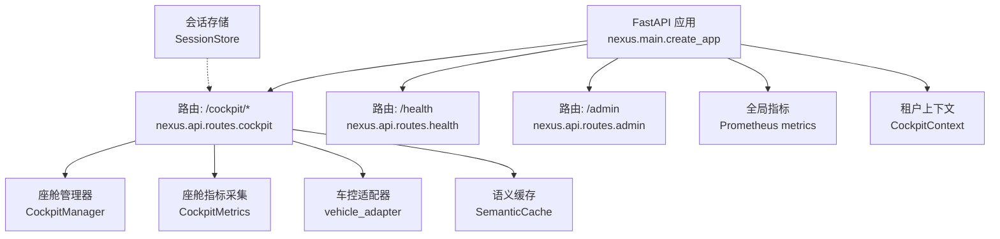
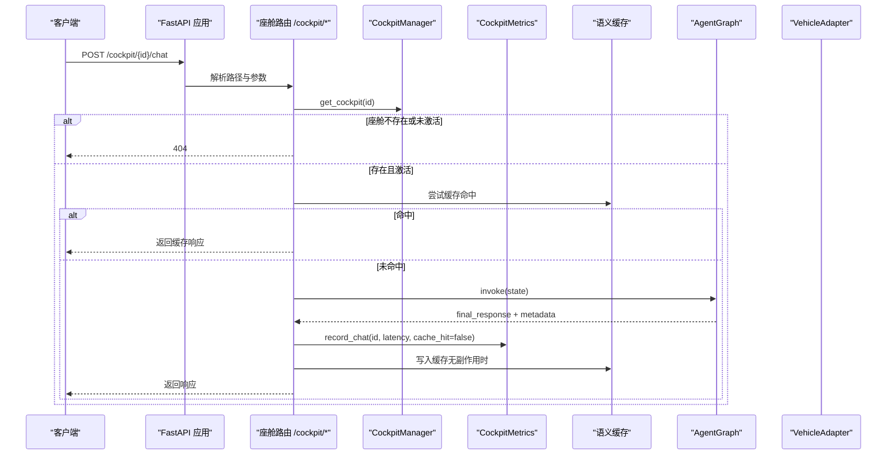
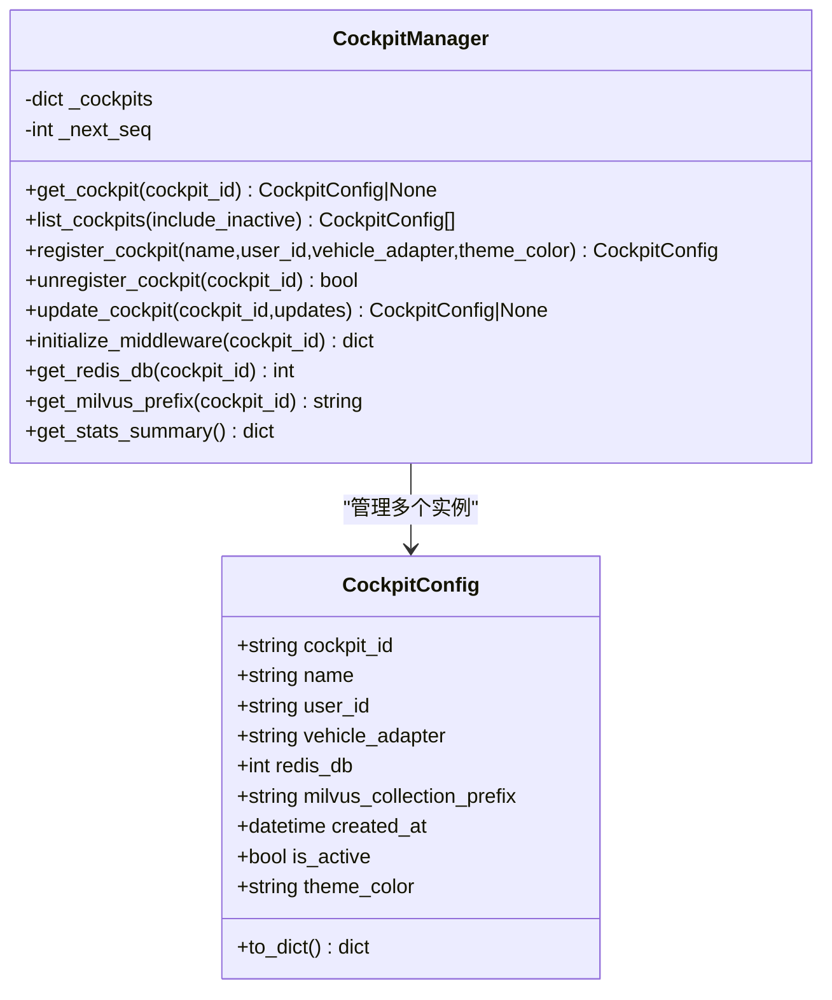
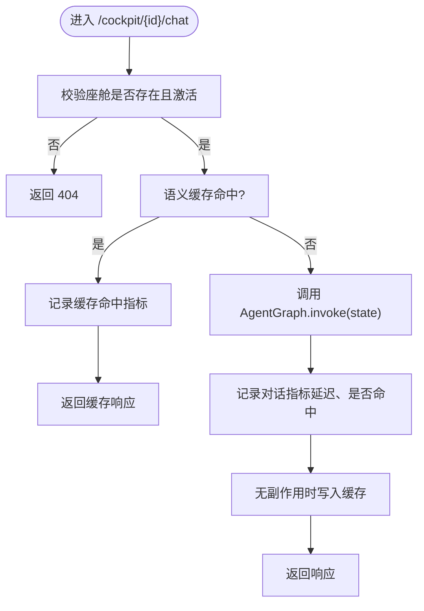
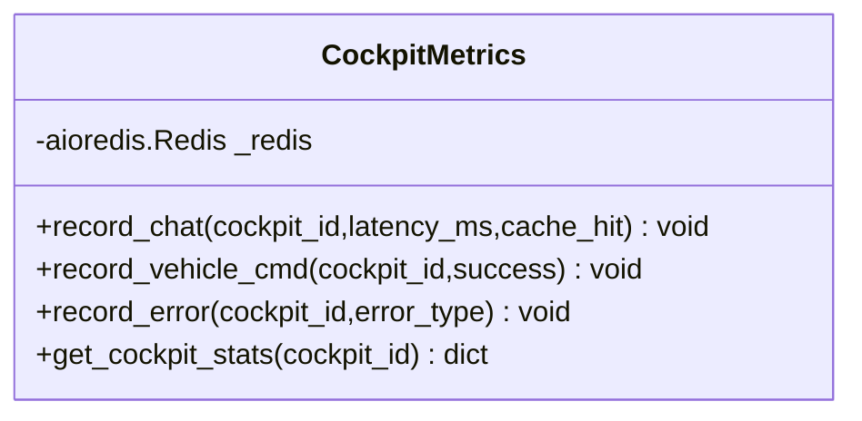
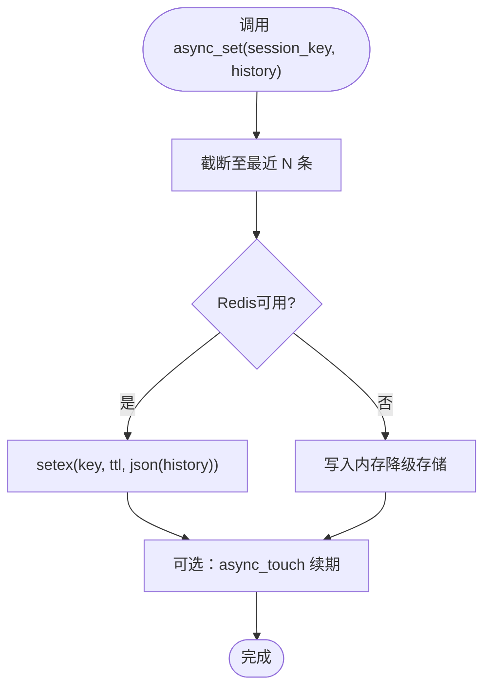
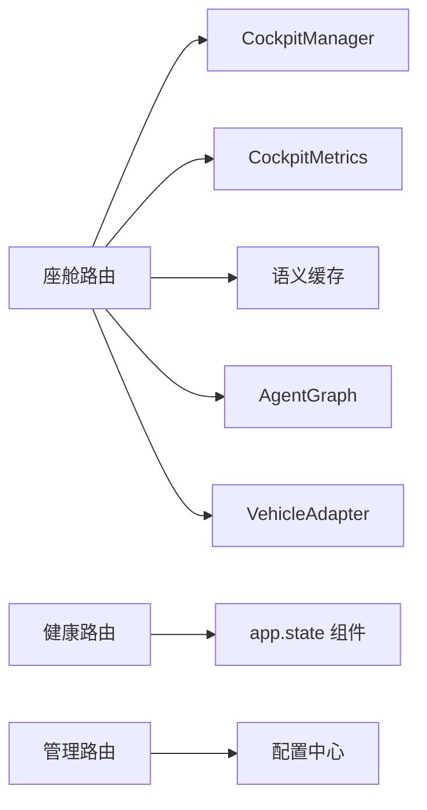

# 座舱管理API

<cite>
**本文引用的文件**   
- [main.py](file://backend_design/nexus/main.py)
- [cockpit_manager.py](file://backend_design/nexus/core/cockpit_manager.py)
- [cockpit.py](file://backend_design/nexus/api/routes/cockpit.py)
- [cockpit.py（模型）](file://backend_design/nexus/models/cockpit.py)
- [cockpit.py（配置）](file://backend_design/nexus/config/cockpit.py)
- [cockpit_metrics.py](file://backend_design/nexus/observability/cockpit_metrics.py)
- [metrics.py](file://backend_design/nexus/observability/metrics.py)
- [tenant_context.py](file://backend_design/nexus/core/tenant_context.py)
- [admin.py](file://backend_design/nexus/api/routes/admin.py)
- [health.py](file://backend_design/nexus/api/routes/health.py)
- [session_store.py](file://backend_design/nexus/middleware/session_store.py)
- [exceptions.py](file://backend_design/nexus/core/exceptions.py)
</cite>

## 目录
1. [简介](#简介)
2. [项目结构](#项目结构)
3. [核心组件](#核心组件)
4. [架构总览](#架构总览)
5. [详细组件分析](#详细组件分析)
6. [依赖关系分析](#依赖关系分析)
7. [性能与扩展性](#性能与扩展性)
8. [故障诊断与排错指南](#故障诊断与排错指南)
9. [结论](#结论)
10. [附录：API调用示例与最佳实践](#附录api调用示例与最佳实践)

## 简介
本文件面向 NexusCockpit 的“座舱管理API”，系统性阐述多座舱管理的核心能力，包括：
- 座舱注册、配置管理与状态监控
- 资源隔离与分配（Redis DB、Milvus Collection 前缀、MySQL 用户记录等）
- 座舱间数据共享机制与通信协议（上下文隔离、指标采集、会话持久化）
- 座舱生命周期管理（启动、停止、重启、故障恢复）
- 配置热更新与版本兼容性策略
- 健康检查、性能监控与告警通知接口
- 扩展开发指南与插件集成方法
- 分布式场景下的数据一致性与负载均衡建议

## 项目结构
NexusCockpit 后端以 FastAPI 应用为核心，通过路由模块暴露座舱相关 API；核心管理器 CockpitManager 负责座舱注册、查询与资源初始化；可观测性层提供座舱级指标采集；中间件与会话存储保障多实例部署下的会话一致性。

图表来源 
- [main.py:436-484](file://backend_design/nexus/main.py#L436-L484)
- [cockpit.py（路由）:29-266](file://backend_design/nexus/api/routes/cockpit.py#L29-L266)
- [health.py:26-95](file://backend_design/nexus/api/routes/health.py#L26-L95)
- [admin.py:172-221](file://backend_design/nexus/api/routes/admin.py#L172-L221)
- [cockpit_manager.py:75-111](file://backend_design/nexus/core/cockpit_manager.py#L75-L111)
- [cockpit_metrics.py:24-36](file://backend_design/nexus/observability/cockpit_metrics.py#L24-L36)
- [metrics.py:14-32](file://backend_design/nexus/observability/metrics.py#L14-L32)
- [tenant_context.py:71-103](file://backend_design/nexus/core/tenant_context.py#L71-L103)
- [session_store.py:43-81](file://backend_design/nexus/middleware/session_store.py#L43-L81)

章节来源
- [main.py:436-484](file://backend_design/nexus/main.py#L436-L484)

## 核心组件
- 座舱管理器 CockpitManager
  - 职责：座舱注册、查询、注销、配置更新、默认座舱初始化、中间件资源初始化（Redis/MySQL/Milvus）。
  - 关键数据结构：CockpitConfig（包含 cockpit_id、name、user_id、vehicle_adapter、redis_db、milvus_collection_prefix、is_active、theme_color 等）。
  - 资源隔离：每个座舱分配独立 Redis DB 编号与 Milvus collection 前缀；MySQL 中创建对应用户记录并写入审计日志。
- 座舱 API 路由
  - 路径前缀：/cockpit/{cockpit_id}
  - 功能：获取座舱状态、对话（同步/流式）、车控指令执行、车辆状态查询。
  - 上下文隔离：使用 CockpitContext 设置 cockpit_id 与 user_id，确保后续中间件与存储按座舱隔离。
- 座舱指标采集 CockpitMetrics
  - 指标维度：对话次数、延迟、缓存命中/未命中、错误计数、车控成功/失败率等。
  - 存储：实时写入 Redis Hash（{cockpit_id}:stats），供仪表盘与巡检读取。
- 会话存储 SessionStore
  - 特性：基于 Redis 的会话历史持久化，支持滚动摘要（running_summary）；Redis 不可用时自动降级内存。
  - TTL 管理：活跃会话自动续期，过期清理。
- 可观测性 Prometheus 指标
  - 指标：请求计数、延迟直方图、Agent/技能/缓存/RAG/LLM 调用统计、活跃连接数等。
  - 端点：/metrics 挂载于应用根路径下。
- 健康检查与健康路由
  - 端点：/health 返回各组件连接状态（Milvus、Neo4j、Redis、MySQL、Agent）。
- 配置中心与热更新
  - 端点：/admin/config/reload 重新加载 .env.local 并重置 LLM 客户端单例，无需重启服务。
  - 兼容策略：敏感字段脱敏输出，仅对下次请求生效。

章节来源
- [cockpit_manager.py:75-111](file://backend_design/nexus/core/cockpit_manager.py#L75-L111)
- [cockpit_manager.py:136-191](file://backend_design/nexus/core/cockpit_manager.py#L136-L191)
- [cockpit_manager.py:193-297](file://backend_design/nexus/core/cockpit_manager.py#L193-L297)
- [cockpit.py（路由）:54-149](file://backend_design/nexus/api/routes/cockpit.py#L54-L149)
- [cockpit.py（路由）:152-201](file://backend_design/nexus/api/routes/cockpit.py#L152-L201)
- [cockpit.py（路由）:204-266](file://backend_design/nexus/api/routes/cockpit.py#L204-L266)
- [cockpit_metrics.py:24-180](file://backend_design/nexus/observability/cockpit_metrics.py#L24-L180)
- [session_store.py:43-294](file://backend_design/nexus/middleware/session_store.py#L43-L294)
- [metrics.py:14-108](file://backend_design/nexus/observability/metrics.py#L14-L108)
- [health.py:26-95](file://backend_design/nexus/api/routes/health.py#L26-L95)
- [admin.py:172-221](file://backend_design/nexus/api/routes/admin.py#L172-L221)

## 架构总览
下图展示从 HTTP 请求到座舱处理的关键流程，包括上下文注入、指标记录、缓存与 Agent 工作流调用。

图表来源 
- [cockpit.py（路由）:76-149](file://backend_design/nexus/api/routes/cockpit.py#L76-L149)
- [cockpit_manager.py:112-134](file://backend_design/nexus/core/cockpit_manager.py#L112-L134)
- [cockpit_metrics.py:38-64](file://backend_design/nexus/observability/cockpit_metrics.py#L38-L64)

## 详细组件分析

### 座舱管理器 CockpitManager
- 设计要点
  - 单例模式：全局唯一实例，避免重复初始化。
  - 默认座舱：启动时预置三个默认座舱，便于演示与快速接入。
  - 资源初始化：注册后异步初始化 Redis stats、配置键、MySQL 用户记录与审计日志。
  - 软删除：注销座舱标记 is_active=False，序号不回退，避免 ID 冲突。
- 复杂度与性能
  - 注册操作 O(1)，列表查询 O(n)。
  - 中间件初始化采用异步任务，不阻塞注册流程。
- 错误处理
  - 中间件初始化失败记录警告，不阻止注册；MySQL/Redis 不可用则跳过或降级。

图表来源 
- [cockpit_manager.py:33-73](file://backend_design/nexus/core/cockpit_manager.py#L33-L73)
- [cockpit_manager.py:75-111](file://backend_design/nexus/core/cockpit_manager.py#L75-L111)
- [cockpit_manager.py:136-191](file://backend_design/nexus/core/cockpit_manager.py#L136-L191)
- [cockpit_manager.py:193-297](file://backend_design/nexus/core/cockpit_manager.py#L193-L297)

章节来源
- [cockpit_manager.py:75-111](file://backend_design/nexus/core/cockpit_manager.py#L75-L111)
- [cockpit_manager.py:136-191](file://backend_design/nexus/core/cockpit_manager.py#L136-L191)
- [cockpit_manager.py:193-297](file://backend_design/nexus/core/cockpit_manager.py#L193-L297)

### 座舱 API 路由（/cockpit/*）
- 端点说明
  - GET /cockpit/{cockpit_id}/status：返回座舱状态与实时指标。
  - POST /cockpit/{cockpit_id}/chat：非流式对话，含缓存命中检测与指标记录。
  - POST /cockpit/{cockpit_id}/chat/stream：SSE 流式对话，异常与断开安全处理。
  - POST /cockpit/{cockpit_id}/vehicle/cmd：执行车控指令，记录成功/失败指标。
  - GET /cockpit/{cockpit_id}/vehicle/status：查询车辆状态。
- 上下文与隔离
  - 使用 CockpitContext 设置 cockpit_id 与 user_id，确保后续中间件与存储按座舱隔离。
- 错误与降级
  - 座舱不存在或未激活返回 404；Agent/VehicleAdapter 未初始化返回 503；异常统一格式。

图表来源 
- [cockpit.py（路由）:76-149](file://backend_design/nexus/api/routes/cockpit.py#L76-L149)
- [cockpit_metrics.py:38-64](file://backend_design/nexus/observability/cockpit_metrics.py#L38-L64)

章节来源
- [cockpit.py（路由）:54-149](file://backend_design/nexus/api/routes/cockpit.py#L54-L149)
- [cockpit.py（路由）:152-201](file://backend_design/nexus/api/routes/cockpit.py#L152-L201)
- [cockpit.py（路由）:204-266](file://backend_design/nexus/api/routes/cockpit.py#L204-L266)

### 座舱指标采集 CockpitMetrics
- 指标维度
  - chat_count、cache_hits、cache_misses、total_latency_ms、latency_count、last_chat_time、last_latency_ms、error_count、vehicle_cmd_count、vehicle_cmd_errors 等。
- 计算逻辑
  - 缓存命中率 = hits/(hits+misses)
  - 平均延迟 = total_latency_ms/latency_count
  - 车控成功率 = (vehicle_cmd_count - vehicle_cmd_errors)/vehicle_cmd_count
- 存储与访问
  - Redis Hash 键：{cockpit_id}:stats
  - 提供 get_cockpit_stats 聚合计算并返回字典。

图表来源 
- [cockpit_metrics.py:24-180](file://backend_design/nexus/observability/cockpit_metrics.py#L24-L180)

章节来源
- [cockpit_metrics.py:24-180](file://backend_design/nexus/observability/cockpit_metrics.py#L24-L180)

### 会话存储 SessionStore
- 功能特性
  - Redis 持久化会话历史与滚动摘要，TTL 自动续期。
  - Redis 不可用时降级为内存 dict，保证可用性。
  - 支持列出活跃会话、删除会话历史与摘要。
- 数据模型
  - 会话键前缀：nexus:session:{session_key}
  - 摘要键前缀：nexus:summary:{session_key}
- 复杂度与性能
  - 读写均为 O(1)，TTL 管理由 Redis 原生支持。

图表来源 
- [session_store.py:152-194](file://backend_design/nexus/middleware/session_store.py#L152-L194)

章节来源
- [session_store.py:43-294](file://backend_design/nexus/middleware/session_store.py#L43-L294)

### 健康检查与健康路由
- 端点
  - GET /health：检查 Milvus、Neo4j、Redis、MySQL、Agent 的连接状态，返回 healthy/degraded。
  - GET /：根路径返回基本信息与文档入口。
- 实现要点
  - 通过 app.state 判断组件是否初始化与连接状态。
  - MySQL 健康检查采用 socket 探测端口连通性。

章节来源
- [health.py:26-95](file://backend_design/nexus/api/routes/health.py#L26-L95)

### 配置热更新与版本兼容性
- 端点
  - POST /admin/config/reload：清除配置缓存、重置 LLM 客户端与框架适配器单例，返回新配置状态（敏感值脱敏）。
  - GET /admin/config：查看当前配置状态（脱敏）。
- 兼容性策略
  - 仅对下一次请求生效，避免运行时状态不一致。
  - 缺失或不支持的模块（如框架适配器）会跳过并记录日志。

章节来源
- [admin.py:172-221](file://backend_design/nexus/api/routes/admin.py#L172-L221)
- [admin.py:224-272](file://backend_design/nexus/api/routes/admin.py#L224-L272)

## 依赖关系分析
- 组件耦合
  - 座舱路由依赖 CockpitManager、CockpitMetrics、VehicleAdapter、语义缓存与 AgentGraph。
  - 指标采集依赖 Redis 客户端，健康检查依赖 app.state 中的组件实例。
  - 会话存储依赖 Redis，具备内存降级能力。
- 外部依赖
  - Redis：会话、指标、缓存。
  - Milvus/Neo4j：向量与图谱存储（健康检查与初始化阶段）。
  - MySQL：用户管理与审计日志。
- 潜在循环依赖
  - 通过单例与 app.state 解耦，避免直接循环导入。

图表来源 
- [cockpit.py（路由）:29-266](file://backend_design/nexus/api/routes/cockpit.py#L29-L266)
- [health.py:26-95](file://backend_design/nexus/api/routes/health.py#L26-L95)
- [admin.py:172-221](file://backend_design/nexus/api/routes/admin.py#L172-L221)

章节来源
- [cockpit.py（路由）:29-266](file://backend_design/nexus/api/routes/cockpit.py#L29-L266)

## 性能与扩展性
- 性能特征
  - 指标采集使用 Redis pipeline 批量写入，降低网络往返。
  - 对话缓存命中可显著降低 LLM 调用延迟。
  - Prometheus 指标在 ASGI 中间件中统一记录，覆盖所有端点。
- 扩展建议
  - 新增座舱类型：在 CockpitManager.register_cockpit 中扩展初始化逻辑。
  - 新增指标维度：在 CockpitMetrics.record_* 中追加统计项。
  - 新增中间件：遵循 CockpitContext 上下文传递规则，确保按座舱隔离。
- 分布式建议
  - 数据一致性：Redis 作为单一事实源（会话、指标、缓存），MySQL 用于持久化审计与用户信息。
  - 负载均衡：多实例部署共享同一 Redis/MySQL；通过网关（Go 网关）进行请求分发。
  - 故障恢复：组件初始化失败不阻断服务启动，运行时报错降级处理。

[本节为通用指导，不直接分析具体文件]

## 故障诊断与排错指南
- 常见问题定位
  - 座舱 404：确认 CockpitManager.get_cockpit 返回非空且 is_active=True。
  - 指标为空：检查 CockpitMetrics 是否已设置全局实例，Redis 连接是否正常。
  - 会话丢失：确认 SessionStore 是否连接到 Redis，TTL 是否合理。
  - 健康检查 degraded：逐项检查 Milvus、Neo4j、Redis、MySQL、Agent 状态。
- 错误体系
  - 自定义异常：NexusError 及其子类（AuthError、RateLimitError、VehicleError 等），统一 JSON 响应格式。
  - 全局异常处理器：将不同异常映射为统一结构 {error, message, details}。
- 调试工具
  - /metrics：Prometheus 指标端点，观察请求计数、延迟、缓存命中率等。
  - /admin/cache/stats：语义缓存统计（命中/未命中/命中率/大小）。
  - /admin/sessions：活跃会话列表。

章节来源
- [exceptions.py:19-128](file://backend_design/nexus/core/exceptions.py#L19-L128)
- [main.py:503-596](file://backend_design/nexus/main.py#L503-L596)
- [admin.py:51-86](file://backend_design/nexus/api/routes/admin.py#L51-L86)
- [admin.py:89-108](file://backend_design/nexus/api/routes/admin.py#L89-L108)
- [health.py:26-95](file://backend_design/nexus/api/routes/health.py#L26-L95)

## 结论
NexusCockpit 的座舱管理 API 通过 CockpitManager 实现多座舱注册与资源隔离，结合 CockpitMetrics 与 SessionStore 提供实时指标与持久化会话；健康检查与配置热更新保障系统稳定性与可运维性。整体架构清晰、可扩展性强，适合在多实例与分布式环境下稳定运行。

[本节为总结，不直接分析具体文件]

## 附录：API调用示例与最佳实践
- 基础用法
  - 注册座舱：POST /cockpit/{id}/...（实际注册通过 CockpitManager.register_cockpit，可由前端或管理脚本触发）
  - 对话：POST /cockpit/{id}/chat，携带 text、user_id、stream 标志
  - 流式对话：POST /cockpit/{id}/chat/stream，接收 SSE 事件
  - 车控指令：POST /cockpit/{id}/vehicle/cmd，携带 command 与 arguments
  - 车辆状态：GET /cockpit/{id}/vehicle/status
  - 健康检查：GET /health
  - 配置热更新：POST /admin/config/reload
- 最佳实践
  - 始终在请求头或上下文中传递 cockpit_id，确保隔离。
  - 合理使用缓存：对无副作用的请求启用缓存，减少 LLM 调用。
  - 监控指标：关注 avg_latency_ms、cache_hit_rate、error_rate、vehicle_cmd_success_rate。
  - 故障恢复：组件初始化失败不影响服务启动，运行时应捕获异常并降级。

[本节为通用指导，不直接分析具体文件]