# 管理后台API

<cite>
**本文引用的文件**   
- [admin.py](file://backend_design/nexus/api/routes/admin.py)
- [auth.py](file://backend_design/nexus/api/routes/auth.py)
- [settings.py](file://backend_design/nexus/api/routes/settings.py)
- [health.py](file://backend_design/nexus/api/routes/health.py)
- [middleware_status.py](file://backend_design/nexus/api/routes/middleware_status.py)
- [dataplatform.py](file://backend_design/nexus/api/routes/dataplatform.py)
- [auth_core.py](file://backend_design/nexus/core/auth.py)
- [db_manager.py](file://backend_design/nexus/core/db_manager.py)
- [logger.py](file://backend_design/nexus/core/logger.py)
- [metrics.py](file://backend_design/nexus/observability/metrics.py)
- [schemas.py](file://backend_design/nexus/models/schemas.py)
- [cockpit_models.py](file://backend_design/nexus/models/cockpit.py)
- [config_init.py](file://backend_design/nexus/config/__init__.py)
</cite>

## 目录
1. [简介](#简介)
2. [项目结构](#项目结构)
3. [核心组件](#核心组件)
4. [架构总览](#架构总览)
5. [详细组件分析](#详细组件分析)
6. [依赖关系分析](#依赖关系分析)
7. [性能考量](#性能考量)
8. [故障排查指南](#故障排查指南)
9. [结论](#结论)
10. [附录](#附录)

## 简介
本文件为 NexusCockpit 管理后台 API 的全面技术文档，覆盖以下能力与主题：
- 用户管理（CRUD、批量导入导出接口规划）
- 角色权限管理（RBAC 权限矩阵与鉴权流程）
- 系统配置管理（查看与热更新）
- 日志审计（操作审计、结构化日志、脱敏策略）
- 系统监控（指标采集与健康检查）
- 数据备份恢复与系统升级（接口设计与最佳实践）
- 多租户隔离与安全策略
- 管理员操作最佳实践与故障排查

说明：当前代码库已实现认证、设置中心、健康检查、中间件状态、数据中台概览、审计日志、指标采集等。部分功能（如批量导入导出、备份恢复、升级接口）以“接口设计建议”形式提供，便于后续落地。

## 项目结构
后端采用 FastAPI 路由按职责拆分：
- 认证路由：/auth/*
- 管理路由：/admin/*
- 设置中心：/settings/*
- 健康检查：/health, /
- 中间件状态：/middleware/*
- 数据中台：/dataplatform/*

核心支撑模块：
- 认证与鉴权：nexus.core.auth
- 数据库与审计：nexus.core.db_manager
- 结构化日志与脱敏：nexus.core.logger
- 指标采集：nexus.observability.metrics
- 统一配置：nexus.config.__init__
- 模型与Schema：nexus.models.schemas, nexus.models.cockpit

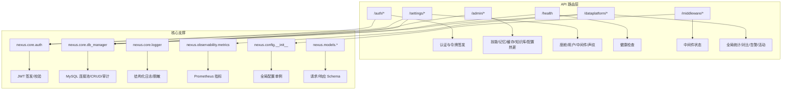

**图表来源** 
- [admin.py:1-272](file://backend_design/nexus/api/routes/admin.py#L1-L272)
- [auth.py:1-194](file://backend_design/nexus/api/routes/auth.py#L1-L194)
- [settings.py:1-393](file://backend_design/nexus/api/routes/settings.py#L1-L393)
- [health.py:1-108](file://backend_design/nexus/api/routes/health.py#L1-L108)
- [middleware_status.py:1-269](file://backend_design/nexus/api/routes/middleware_status.py#L1-L269)
- [dataplatform.py:1-383](file://backend_design/nexus/api/routes/dataplatform.py#L1-L383)
- [auth_core.py:1-140](file://backend_design/nexus/core/auth.py#L1-L140)
- [db_manager.py:1-800](file://backend_design/nexus/core/db_manager.py#L1-L800)
- [logger.py:1-249](file://backend_design/nexus/core/logger.py#L1-L249)
- [metrics.py:1-108](file://backend_design/nexus/observability/metrics.py#L1-L108)
- [schemas.py:1-88](file://backend_design/nexus/models/schemas.py#L1-L88)
- [cockpit_models.py:1-214](file://backend_design/nexus/models/cockpit.py#L1-L214)
- [config_init.py:1-167](file://backend_design/nexus/config/__init__.py#L1-L167)

**章节来源**
- [admin.py:1-272](file://backend_design/nexus/api/routes/admin.py#L1-L272)
- [auth.py:1-194](file://backend_design/nexus/api/routes/auth.py#L1-L194)
- [settings.py:1-393](file://backend_design/nexus/api/routes/settings.py#L1-L393)
- [health.py:1-108](file://backend_design/nexus/api/routes/health.py#L1-L108)
- [middleware_status.py:1-269](file://backend_design/nexus/api/routes/middleware_status.py#L1-L269)
- [dataplatform.py:1-383](file://backend_design/nexus/api/routes/dataplatform.py#L1-L383)
- [auth_core.py:1-140](file://backend_design/nexus/core/auth.py#L1-L140)
- [db_manager.py:1-800](file://backend_design/nexus/core/db_manager.py#L1-L800)
- [logger.py:1-249](file://backend_design/nexus/core/logger.py#L1-L249)
- [metrics.py:1-108](file://backend_design/nexus/observability/metrics.py#L1-L108)
- [schemas.py:1-88](file://backend_design/nexus/models/schemas.py#L1-L88)
- [cockpit_models.py:1-214](file://backend_design/nexus/models/cockpit.py#L1-L214)
- [config_init.py:1-167](file://backend_design/nexus/config/__init__.py#L1-L167)

## 核心组件
- 认证与授权
  - JWT 签发与校验：支持自定义过期时间、额外声明（role、cockpit_id）。
  - 可选认证依赖：get_optional_user 用于非强制认证场景。
- 设置中心
  - 座舱 CRUD、用户管理（持久化到 MySQL）、中间件配置热更新、声纹注册/验证/删除。
- 管理接口
  - 技能列表、用户记忆查询、语义缓存统计/清空、会话列表、知识库上传/重建索引/统计、配置热更新。
- 健康检查与中间件状态
  - 健康检查聚合 Milvus/Neo4j/Redis/MySQL/OSS/Agent 状态；中间件状态提供 Redis/Milvus/Neo4j/MySQL/LLM/TTS/ASR/App 概览。
- 数据中台
  - 全局概览、单座舱详情、并发统计、告警历史、Agent 活动时间线、座舱对比、缓存趋势、资源使用。
- 指标与日志
  - Prometheus 指标（请求、延迟、Agent、技能、缓存、RAG、LLM、连接数）；结构化日志与敏感字段脱敏。

**章节来源**
- [auth_core.py:1-140](file://backend_design/nexus/core/auth.py#L1-L140)
- [settings.py:1-393](file://backend_design/nexus/api/routes/settings.py#L1-L393)
- [admin.py:1-272](file://backend_design/nexus/api/routes/admin.py#L1-L272)
- [health.py:1-108](file://backend_design/nexus/api/routes/health.py#L1-L108)
- [middleware_status.py:1-269](file://backend_design/nexus/api/routes/middleware_status.py#L1-L269)
- [dataplatform.py:1-383](file://backend_design/nexus/api/routes/dataplatform.py#L1-L383)
- [metrics.py:1-108](file://backend_design/nexus/observability/metrics.py#L1-L108)
- [logger.py:1-249](file://backend_design/nexus/core/logger.py#L1-L249)

## 架构总览
下图展示从客户端到各服务组件的调用路径与数据流向。

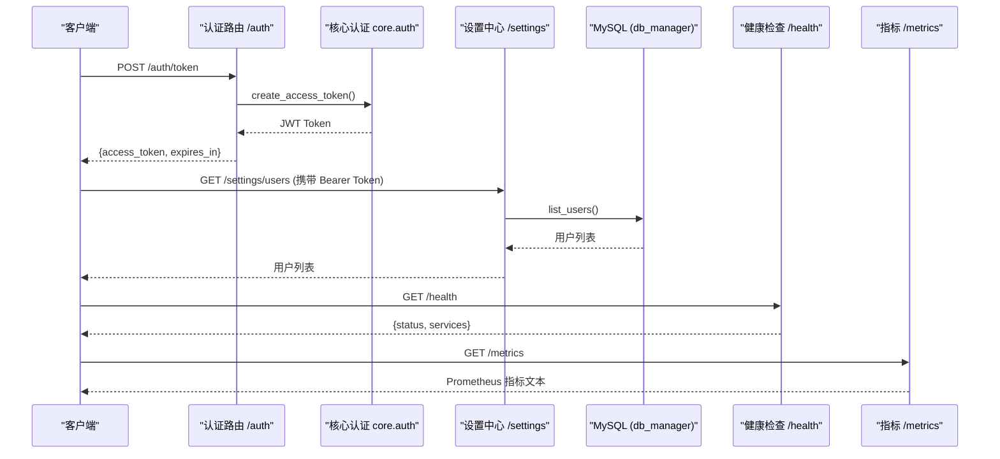

**图表来源** 
- [auth.py:1-194](file://backend_design/nexus/api/routes/auth.py#L1-L194)
- [auth_core.py:1-140](file://backend_design/nexus/core/auth.py#L1-L140)
- [settings.py:1-393](file://backend_design/nexus/api/routes/settings.py#L1-L393)
- [db_manager.py:1-800](file://backend_design/nexus/core/db_manager.py#L1-L800)
- [health.py:1-108](file://backend_design/nexus/api/routes/health.py#L1-L108)
- [metrics.py:1-108](file://backend_design/nexus/observability/metrics.py#L1-L108)

## 详细组件分析

### 认证与授权（/auth）
- 登录获取 Token：POST /auth/token
  - 开发模式直接签发 Token，默认赋予 super_admin 角色与 cockpit_id。
  - 生产环境应接入用户数据库验证密码并查询角色。
- 获取当前用户：GET /auth/me
  - 校验 Token 有效性，返回 user_id 与 authenticated 标志。
- 修改密码：POST /auth/change-password
  - 开发模式直接成功；生产环境需校验旧密码并更新。
- 验证码相关：POST /auth/send-code、POST /auth/reset-password-by-code
  - 开发模式内存存储验证码；生产环境对接短信网关。

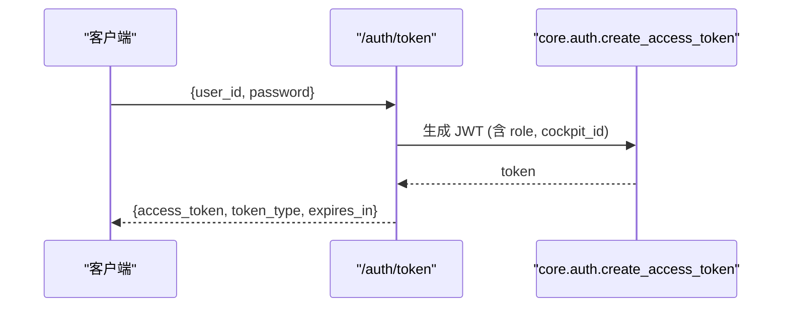

**图表来源** 
- [auth.py:1-194](file://backend_design/nexus/api/routes/auth.py#L1-L194)
- [auth_core.py:1-140](file://backend_design/nexus/core/auth.py#L1-L140)

**章节来源**
- [auth.py:1-194](file://backend_design/nexus/api/routes/auth.py#L1-L194)
- [auth_core.py:1-140](file://backend_design/nexus/core/auth.py#L1-L140)

### 设置中心（/settings）
- 座舱管理：GET/POST/PUT/DELETE /settings/cockpits/*
  - 注册、更新、注销座舱；返回列表包含总数与活跃数量。
- 用户管理：GET/POST/DELETE /settings/users/*
  - 列出、创建、删除用户；创建时写入审计日志；删除时写入审计日志。
  - 管理员重置密码：PUT /settings/users/{user_id}/password
- 中间件配置：GET/PUT /settings/middleware
  - 读取与热更新中间件配置（通过 Redis Pub/Sub 通知）。
- 声纹管理：GET/POST/DELETE /settings/voiceprint/*
  - 注册、验证（成功后自动签发 JWT）、删除声纹。

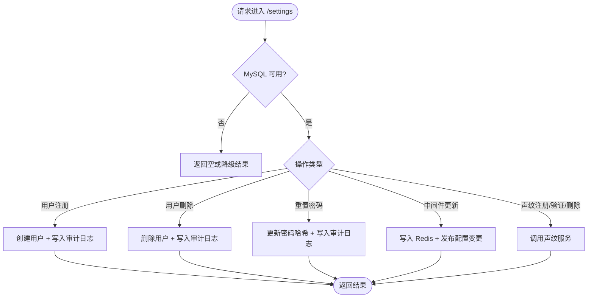

**图表来源** 
- [settings.py:1-393](file://backend_design/nexus/api/routes/settings.py#L1-L393)
- [db_manager.py:1-800](file://backend_design/nexus/core/db_manager.py#L1-L800)

**章节来源**
- [settings.py:1-393](file://backend_design/nexus/api/routes/settings.py#L1-L393)
- [db_manager.py:1-800](file://backend_design/nexus/core/db_manager.py#L1-L800)

### 管理接口（/admin）
- 技能列表：GET /admin/skills
- 用户记忆查询：GET /admin/memory/{user_id}
- 语义缓存统计/清空：GET /admin/cache/stats、POST /admin/cache/clear
- 会话列表：GET /admin/sessions
- 知识库管理：POST /admin/kb/upload、POST /admin/kb/reindex、GET /admin/kb/stats
- 配置热更新：POST /admin/config/reload、GET /admin/config

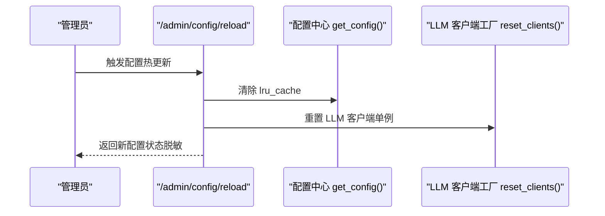

**图表来源** 
- [admin.py:1-272](file://backend_design/nexus/api/routes/admin.py#L1-L272)
- [config_init.py:1-167](file://backend_design/nexus/config/__init__.py#L1-L167)

**章节来源**
- [admin.py:1-272](file://backend_design/nexus/api/routes/admin.py#L1-L272)

### 健康检查与中间件状态
- 健康检查：GET /health
  - 检查 Milvus、Neo4j、Redis、MySQL、OSS、Agent 状态，返回 healthy/degraded。
- 根路径：GET /
  - 返回应用基本信息与文档入口。
- 中间件状态：GET /middleware/*
  - 分别查询 Redis/Milvus/Neo4j/MySQL 状态与应用级配置（版本、环境、调试开关等）。

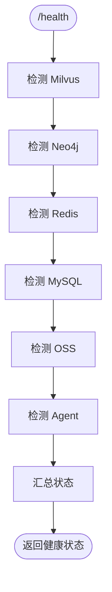

**图表来源** 
- [health.py:1-108](file://backend_design/nexus/api/routes/health.py#L1-L108)
- [middleware_status.py:1-269](file://backend_design/nexus/api/routes/middleware_status.py#L1-L269)

**章节来源**
- [health.py:1-108](file://backend_design/nexus/api/routes/health.py#L1-L108)
- [middleware_status.py:1-269](file://backend_design/nexus/api/routes/middleware_status.py#L1-L269)

### 数据中台（/dataplatform）
- 全局概览：GET /dataplatform/overview
  - 汇总对话数、车控指令数、缓存命中率、平均延迟、并发、告警数、LLM 成本。
- 单座舱详情：GET /dataplatform/cockpit/{cockpit_id}
- 并发统计：GET /dataplatform/concurrency
- 告警历史：GET /dataplatform/alerts
- Agent 活动：GET /dataplatform/agent/activity
- 座舱对比：GET /dataplatform/comparison
- 缓存趋势：GET /dataplatform/cache-trend
- 资源使用：内部函数 psutil 采集 CPU/内存/磁盘

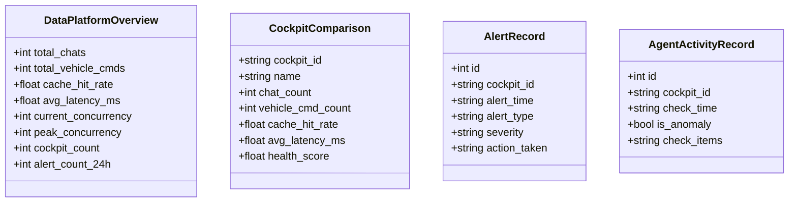

**图表来源** 
- [dataplatform.py:1-383](file://backend_design/nexus/api/routes/dataplatform.py#L1-L383)
- [cockpit_models.py:1-214](file://backend_design/nexus/models/cockpit.py#L1-L214)

**章节来源**
- [dataplatform.py:1-383](file://backend_design/nexus/api/routes/dataplatform.py#L1-L383)
- [cockpit_models.py:1-214](file://backend_design/nexus/models/cockpit.py#L1-L214)

### 指标采集与可观测性
- Prometheus 指标：/metrics
  - 请求计数与延迟、Agent 调用与延迟、技能执行、缓存命中/未命中、RAG 检索与延迟、LLM 调用与延迟、活跃连接数。
- 初始化：启动时注入应用信息（版本、服务名、描述）。

```mermaid
graph TB
M["/metrics"] --> RC["nexus_requests_total"]
M --> RL["nexus_request_latency_seconds"]
M --> AI["nexus_agent_invocations_total"]
M --> AL["nexus_agent_latency_seconds"]
M --> SE["nexus_skill_executions_total"]
M --> CH["nexus_cache_hits_total"]
M --> CM["nexus_cache_misses_total"]
M --> RR["nexus_rag_retrievals_total"]
M --> RLAT["nexus_rag_latency_seconds"]
M --> LC["nexus_llm_calls_total"]
M --> LLAT["nexus_llm_latency_seconds"]
M --> AC["nexus_active_connections"]
```

**图表来源** 
- [metrics.py:1-108](file://backend_design/nexus/observability/metrics.py#L1-L108)

**章节来源**
- [metrics.py:1-108](file://backend_design/nexus/observability/metrics.py#L1-L108)

### 审计日志与结构化日志
- 审计日志表：audit_logs（cockpit_id、user_id、action、detail、ip_address、created_at）
- 审计写入点：用户注册、删除、密码重置等关键操作均记录审计日志。
- 结构化日志：基于 structlog，JSON 输出，敏感字段自动脱敏（api_key、secret、token、password、authorization、jwt、bearer 等），Bearer Token 值与长密钥字符串掩码处理。

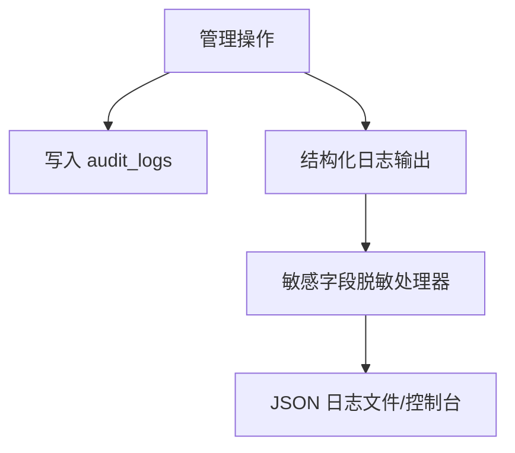

**图表来源** 
- [db_manager.py:1-800](file://backend_design/nexus/core/db_manager.py#L1-L800)
- [logger.py:1-249](file://backend_design/nexus/core/logger.py#L1-L249)
- [settings.py:1-393](file://backend_design/nexus/api/routes/settings.py#L1-L393)

**章节来源**
- [db_manager.py:1-800](file://backend_design/nexus/core/db_manager.py#L1-L800)
- [logger.py:1-249](file://backend_design/nexus/core/logger.py#L1-L249)
- [settings.py:1-393](file://backend_design/nexus/api/routes/settings.py#L1-L393)

### RBAC 权限矩阵与鉴权流程
- 角色定义与权限映射：super_admin、cockpit_admin、cockpit_user、cockpit_viewer
- 权限标识示例：cockpit:register、cockpit:delete、cockpit:update、cockpit:chat、cockpit:vehicle、dataplatform:view、middleware:view、settings:manage、user:manage、cockpit:view、cockpit:view:own、user:manage:own
- 权限检查：check_permission(role, permission, cockpit_id) 支持 :own 变体

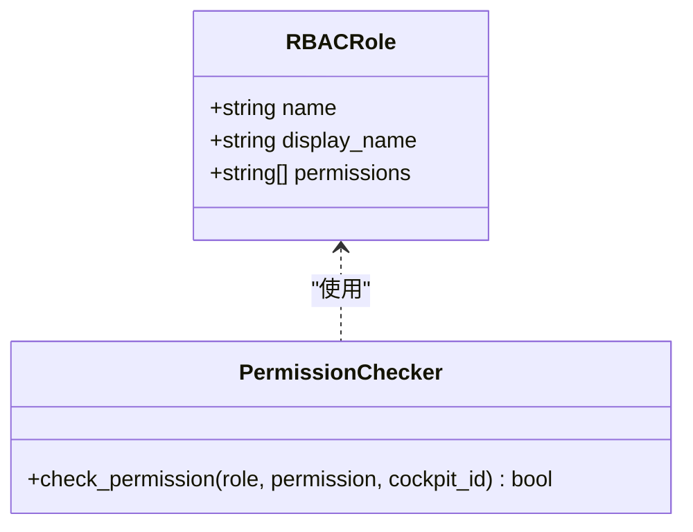

**图表来源** 
- [cockpit_models.py:1-214](file://backend_design/nexus/models/cockpit.py#L1-L214)

**章节来源**
- [cockpit_models.py:1-214](file://backend_design/nexus/models/cockpit.py#L1-L214)

## 依赖关系分析
- 路由层依赖核心模块：
  - settings.py 依赖 db_manager（MySQL）、auth（JWT）、voiceprint（声纹服务）
  - admin.py 依赖 app.state（skill_registry、memory_manager、semantic_cache、cherry_kb、session_store）
  - auth.py 依赖 config（JWT 配置）、core.auth（Token 签发）
  - health.py 依赖 app.state（vector_store、graph_store、semantic_cache、oss_storage、agent_graph）
  - middleware_status.py 依赖 config（Redis/Milvus/Neo4j/MySQL/LLM/TTS/ASR）
  - dataplatform.py 依赖 db_manager、cockpit_manager、cockpit_metrics
- 指标与日志：
  - metrics.py 暴露 Prometheus 指标
  - logger.py 提供结构化日志与脱敏

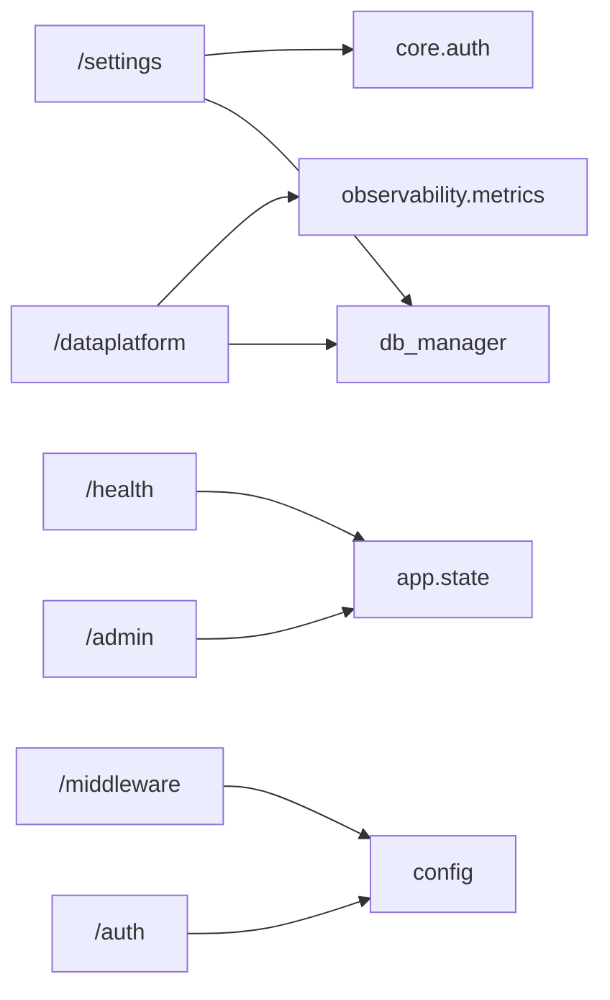

**图表来源** 
- [settings.py:1-393](file://backend_design/nexus/api/routes/settings.py#L1-L393)
- [admin.py:1-272](file://backend_design/nexus/api/routes/admin.py#L1-L272)
- [auth.py:1-194](file://backend_design/nexus/api/routes/auth.py#L1-L194)
- [health.py:1-108](file://backend_design/nexus/api/routes/health.py#L1-L108)
- [middleware_status.py:1-269](file://backend_design/nexus/api/routes/middleware_status.py#L1-L269)
- [dataplatform.py:1-383](file://backend_design/nexus/api/routes/dataplatform.py#L1-L383)
- [metrics.py:1-108](file://backend_design/nexus/observability/metrics.py#L1-L108)

**章节来源**
- [settings.py:1-393](file://backend_design/nexus/api/routes/settings.py#L1-L393)
- [admin.py:1-272](file://backend_design/nexus/api/routes/admin.py#L1-L272)
- [auth.py:1-194](file://backend_design/nexus/api/routes/auth.py#L1-L194)
- [health.py:1-108](file://backend_design/nexus/api/routes/health.py#L1-L108)
- [middleware_status.py:1-269](file://backend_design/nexus/api/routes/middleware_status.py#L1-L269)
- [dataplatform.py:1-383](file://backend_design/nexus/api/routes/dataplatform.py#L1-L383)
- [metrics.py:1-108](file://backend_design/nexus/observability/metrics.py#L1-L108)

## 性能考量
- 连接池与异步：MySQL 使用 aiomysql 连接池，减少频繁创建/销毁连接开销。
- 指标采集：Prometheus 计数器与直方图，避免高频同步阻塞。
- 缓存与降级：语义缓存统计与清空；MySQL 不可用时返回空或降级结果。
- 日志优化：抑制第三方库 DEBUG 日志，减少噪音；结构化 JSON 便于高效采集。

[本节为通用指导，不直接分析具体文件]

## 故障排查指南
- 健康检查失败
  - 检查 /health 返回的 services 状态，定位 Milvus/Neo4j/Redis/MySQL/OSS/Agent 异常。
- 中间件状态异常
  - 访问 /middleware/* 查看具体中间件的错误信息与版本。
- 审计日志缺失
  - 确认 MySQL 连接正常；检查 db_manager.insert_audit_log 是否被调用。
- 结构化日志无敏感脱敏
  - 检查 logger.setup_logging 是否初始化；确认 sanitize_log_processor 生效。
- 指标未采集
  - 确认 /metrics 端点可用；检查 init_metrics 是否调用。

**章节来源**
- [health.py:1-108](file://backend_design/nexus/api/routes/health.py#L1-L108)
- [middleware_status.py:1-269](file://backend_design/nexus/api/routes/middleware_status.py#L1-L269)
- [db_manager.py:1-800](file://backend_design/nexus/core/db_manager.py#L1-L800)
- [logger.py:1-249](file://backend_design/nexus/core/logger.py#L1-L249)
- [metrics.py:1-108](file://backend_design/nexus/observability/metrics.py#L1-L108)

## 结论
NexusCockpit 管理后台 API 在认证、设置中心、健康检查、中间件状态、数据中台、指标与日志方面具备完整实现。RBAC 权限矩阵清晰，审计日志完善，结构化日志与脱敏策略健全。针对批量导入导出、备份恢复、系统升级等能力，本文提供了接口设计建议与最佳实践，便于后续扩展与落地。

[本节为总结性内容，不直接分析具体文件]

## 附录

### 权限矩阵（RBAC）
- super_admin：cockpit:register、cockpit:delete、cockpit:update、cockpit:chat、cockpit:vehicle、dataplatform:view、middleware:view、settings:manage、user:manage
- cockpit_admin：cockpit:update、cockpit:chat、cockpit:vehicle、dataplatform:view:own、user:manage:own
- cockpit_user：cockpit:chat、cockpit:vehicle
- cockpit_viewer：cockpit:view

**章节来源**
- [cockpit_models.py:1-214](file://backend_design/nexus/models/cockpit.py#L1-L214)

### 操作日志格式（审计）
- 字段：cockpit_id、user_id、action、detail（JSON）、ip_address、created_at
- 写入时机：用户注册、删除、密码重置等关键操作

**章节来源**
- [db_manager.py:1-800](file://backend_design/nexus/core/db_manager.py#L1-L800)
- [settings.py:1-393](file://backend_design/nexus/api/routes/settings.py#L1-L393)

### 安全策略配置
- JWT 配置：secret_key、algorithm、expire_minutes
- 结构化日志脱敏：匹配敏感 key 名称与 Bearer Token/长密钥字符串进行掩码
- 中间件配置热更新：通过 Redis Pub/Sub 发布配置变更

**章节来源**
- [config_init.py:1-167](file://backend_design/nexus/config/__init__.py#L1-L167)
- [logger.py:1-249](file://backend_design/nexus/core/logger.py#L1-L249)
- [settings.py:1-393](file://backend_design/nexus/api/routes/settings.py#L1-L393)

### 多租户隔离与数据安全
- 座舱隔离：每个座舱独立 cockpit_id，用户绑定 cockpit_id，数据按座舱维度隔离
- 权限控制：:own 变体限制仅操作自身座舱资源
- 审计追踪：所有关键操作记录 cockpit_id、user_id、action、detail、ip_address

**章节来源**
- [db_manager.py:1-800](file://backend_design/nexus/core/db_manager.py#L1-L800)
- [cockpit_models.py:1-214](file://backend_design/nexus/models/cockpit.py#L1-L214)

### 批量导入导出（接口设计建议）
- 用户批量导入：POST /settings/users/batch-import（CSV/Excel，字段：user_id、username、cockpit_id、role、password_hash）
- 用户批量导出：GET /settings/users/export?format=csv|excel&cockpit_id=...
- 知识库批量导入：POST /admin/kb/batch-upload（ZIP 包，按类别分块入库）
- 审计日志导出：GET /admin/audit/export?hours=24&cockpit_id=...

[本节为接口设计建议，不直接分析具体文件]

### 数据备份恢复（接口设计建议）
- 全量备份：POST /admin/backup/full（触发 MySQL 快照，返回任务 ID）
- 增量备份：POST /admin/backup/incremental（基于 binlog 或时间点）
- 恢复：POST /admin/backup/restore（指定备份文件/时间点，需停机或只读模式）
- 备份清单：GET /admin/backup/list（分页、过滤条件）

[本节为接口设计建议，不直接分析具体文件]

### 系统更新升级（接口设计建议）
- 版本检查：GET /admin/update/check（比较当前版本与最新版本）
- 下载更新：POST /admin/update/download（版本号，返回下载进度）
- 执行升级：POST /admin/update/apply（灰度/全量，回滚策略）
- 升级状态：GET /admin/update/status（任务状态、日志）

[本节为接口设计建议，不直接分析具体文件]

### 管理员操作最佳实践
- 最小权限原则：为不同角色分配最小必要权限，优先使用 :own 变体
- 敏感操作审计：确保所有关键操作写入审计日志，定期审计
- 配置热更新：通过 /admin/config/reload 与 /settings/middleware 热更新，避免重启
- 健康巡检：定时调用 /health 与 /middleware/*，监控组件状态
- 指标监控：集成 Prometheus/Grafana，关注请求延迟、错误率、缓存命中率

[本节为通用指导，不直接分析具体文件]