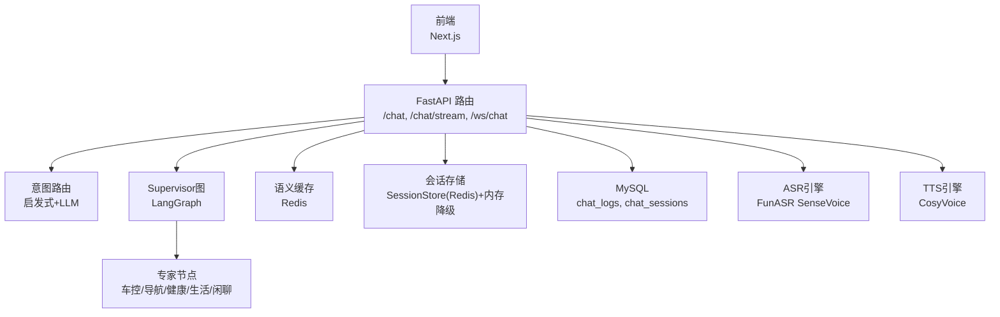
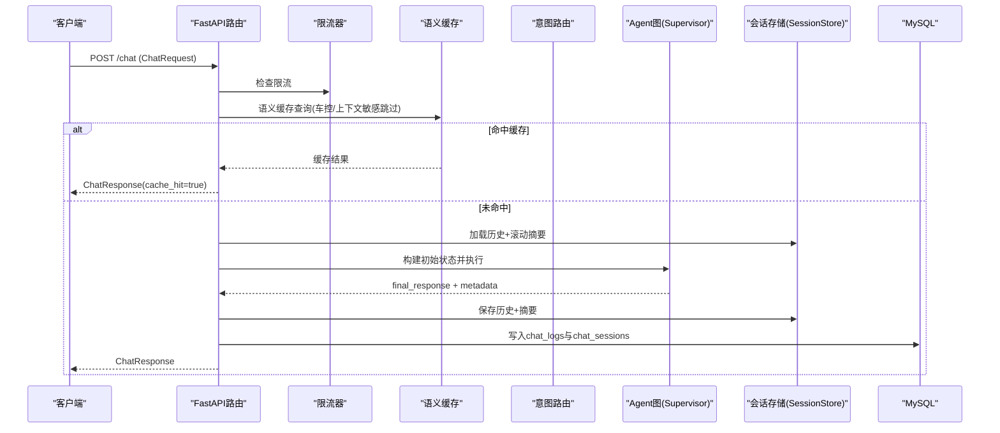
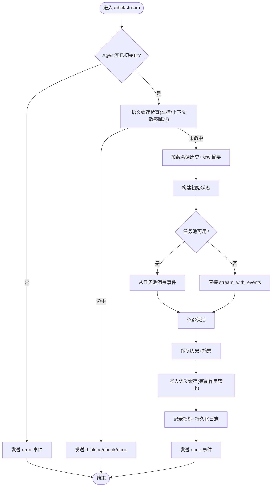
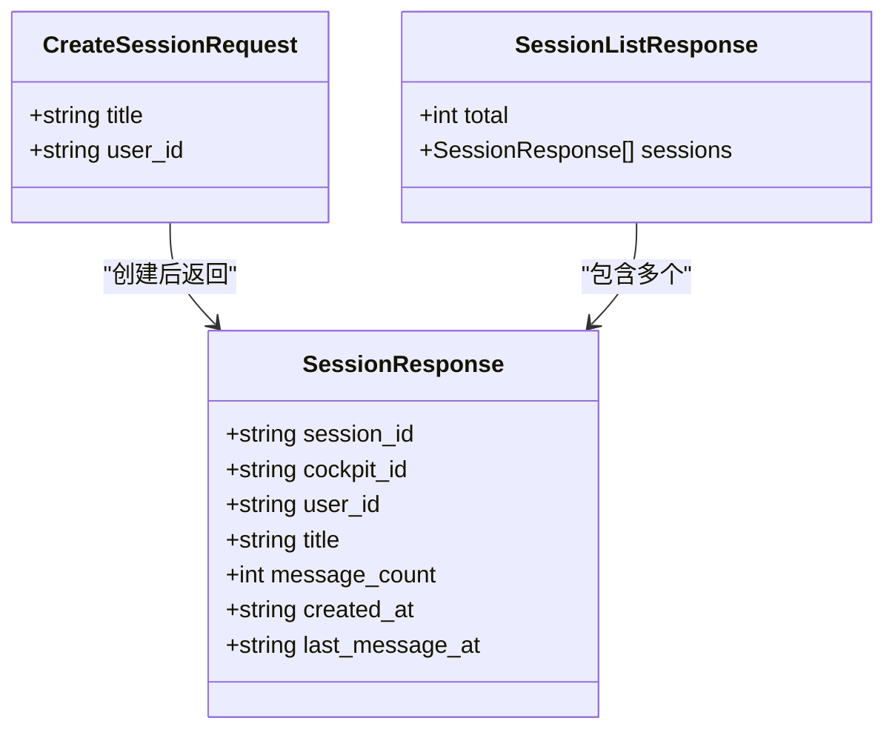
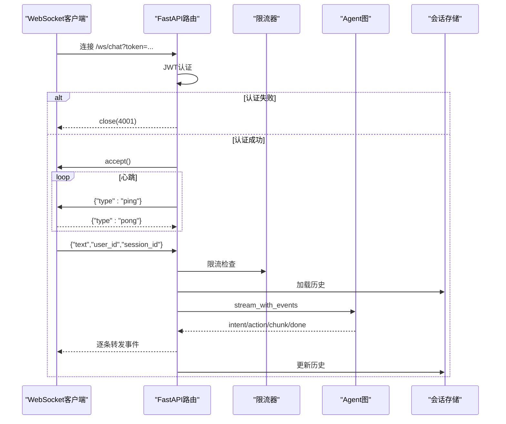
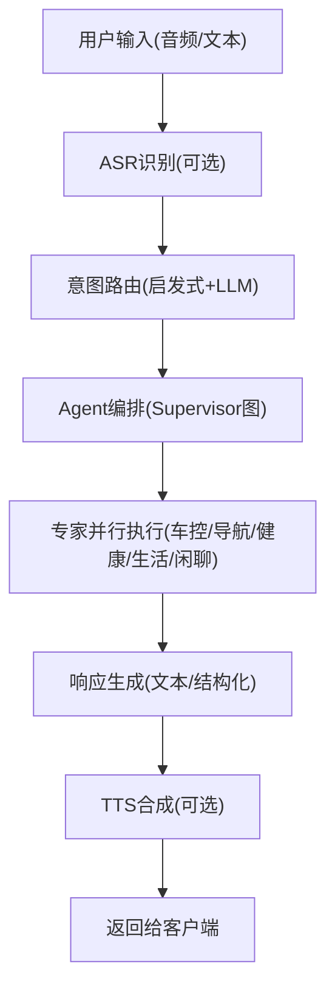
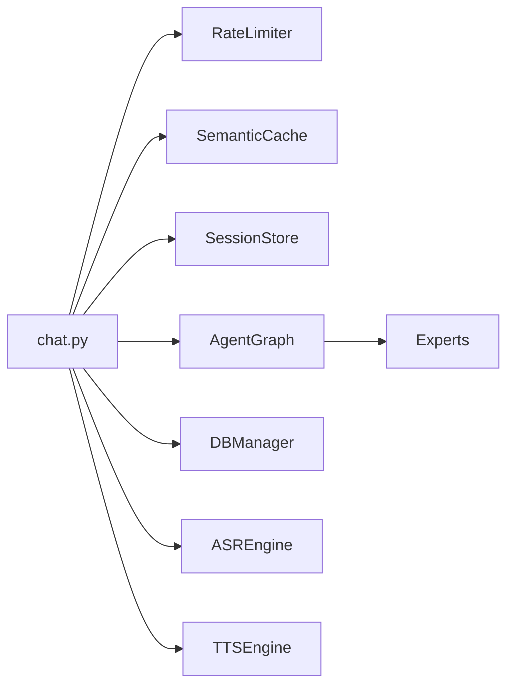

# 聊天对话API

<cite>
**本文引用的文件**   
- [chat.py](file://backend_design/nexus/api/routes/chat.py)
- [chat_sessions.py](file://backend_design/nexus/api/routes/chat_sessions.py)
- [websocket.py](file://backend_design/nexus/api/websocket.py)
- [engine.py（ASR）](file://backend_design/nexus/asr/engine.py)
- [engine.py（TTS）](file://backend_design/nexus/tts/engine.py)
- [schemas.py](file://backend_design/nexus/models/schemas.py)
- [state.py](file://backend_design/nexus/models/state.py)
- [router.py（意图路由）](file://backend_design/nexus/intent/router.py)
- [graph_builder.py](file://backend_design/nexus/agent/graph_builder.py)
- [session_store.py](file://backend_design/nexus/middleware/session_store.py)
- [__init__.py（配置聚合）](file://backend_design/nexus/config/__init__.py)
- [api.ts（前端API客户端）](file://frontend_design/src/lib/api.ts)
- [chat-store.ts（前端会话状态）](file://frontend_design/src/stores/chat-store.ts)
</cite>

## 目录
1. [简介](#简介)
2. [项目结构](#项目结构)
3. [核心组件](#核心组件)
4. [架构总览](#架构总览)
5. [详细组件分析](#详细组件分析)
6. [依赖关系分析](#依赖关系分析)
7. [性能考量](#性能考量)
8. [故障排查指南](#故障排查指南)
9. [结论](#结论)
10. [附录：接口与数据格式](#附录接口与数据格式)

## 简介
本文件为 NexusCockpit 聊天对话API的权威文档，覆盖以下关键能力：
- SSE流式输出接口的实现原理与客户端集成方法
- 多会话管理：创建、切换、历史消息查询、上下文保持机制
- 自然语言处理流程：用户输入 → ASR识别 → 意图路由 → Agent处理 → 响应生成 → TTS合成
- 流式响应的数据格式、错误处理与重连机制
- 完整的请求/响应示例、参数验证规则与最佳实践
- WebSocket实时通信的集成指南与调试方法

## 项目结构
后端采用 FastAPI 提供 REST + SSE + WebSocket 接口；Agent 工作流基于 LangGraph 构建；会话历史通过 Redis 持久化并支持内存降级；语义缓存用于加速重复问答；ASR/TTS 引擎封装本地模型。

图表来源
- [chat.py:319-686](file://backend_design/nexus/api/routes/chat.py#L319-L686)
- [chat_sessions.py:58-135](file://backend_design/nexus/api/routes/chat_sessions.py#L58-L135)
- [websocket.py:71-209](file://backend_design/nexus/api/websocket.py#L71-L209)
- [router.py（意图路由）:103-217](file://backend_design/nexus/intent/router.py#L103-L217)
- [graph_builder.py:40-119](file://backend_design/nexus/agent/graph_builder.py#L40-L119)
- [session_store.py:43-150](file://backend_design/nexus/middleware/session_store.py#L43-L150)
- [engine.py（ASR）:78-178](file://backend_design/nexus/asr/engine.py#L78-L178)
- [engine.py（TTS）:21-116](file://backend_design/nexus/tts/engine.py#L21-L116)

章节来源
- [chat.py:1-120](file://backend_design/nexus/api/routes/chat.py#L1-L120)
- [schemas.py:19-38](file://backend_design/nexus/models/schemas.py#L19-L38)

## 核心组件
- 文本对话REST接口：非流式 POST /chat，返回完整响应
- 流式对话SSE接口：POST /chat/stream，按事件推送 thinking/chunk/done/error
- WebSocket实时通道：/ws/chat，双向事件流，适合语音交互
- 多会话管理：/chat/sessions CRUD 与消息查询
- 意图路由：三级策略（启发式→LLM→默认闲聊），支持复合查询
- Agent编排：Supervisor图（supervisor→dispatch→responder→reflection→reviewer→END）
- 会话历史：SessionStore（Redis优先，内存降级），支持滚动摘要
- 语义缓存：命中则直接返回，车控指令与上下文敏感查询跳过缓存
- ASR/TTS：本地模型封装，支持端侧推理

章节来源
- [chat.py:319-686](file://backend_design/nexus/api/routes/chat.py#L319-L686)
- [chat_sessions.py:58-135](file://backend_design/nexus/api/routes/chat_sessions.py#L58-L135)
- [websocket.py:71-209](file://backend_design/nexus/api/websocket.py#L71-L209)
- [router.py（意图路由）:103-217](file://backend_design/nexus/intent/router.py#L103-L217)
- [graph_builder.py:40-119](file://backend_design/nexus/agent/graph_builder.py#L40-L119)
- [session_store.py:43-150](file://backend_design/nexus/middleware/session_store.py#L43-L150)
- [engine.py（ASR）:78-178](file://backend_design/nexus/asr/engine.py#L78-L178)
- [engine.py（TTS）:21-116](file://backend_design/nexus/tts/engine.py#L21-L116)

## 架构总览
下图展示一次典型“文本对话”的请求到响应全流程，包括限流、缓存、意图路由、Agent执行、指标记录与日志持久化。

图表来源
- [chat.py:319-464](file://backend_design/nexus/api/routes/chat.py#L319-L464)
- [session_store.py:91-176](file://backend_design/nexus/middleware/session_store.py#L91-L176)
- [router.py（意图路由）:103-217](file://backend_design/nexus/intent/router.py#L103-L217)

章节来源
- [chat.py:319-464](file://backend_design/nexus/api/routes/chat.py#L319-L464)

## 详细组件分析

### SSE流式输出接口（/chat/stream）
- 事件类型：thinking、chunk、done、error
- 心跳保活：按配置间隔发送注释行防止连接超时
- 任务池托管：后台Task独立运行，客户端断连不中断pipeline
- 失败兜底：finally块确保会话历史与日志成对持久化

图表来源
- [chat.py:467-686](file://backend_design/nexus/api/routes/chat.py#L467-L686)
- [session_store.py:91-176](file://backend_design/nexus/middleware/session_store.py#L91-L176)

章节来源
- [chat.py:467-686](file://backend_design/nexus/api/routes/chat.py#L467-L686)

### 多会话管理（/chat/sessions）
- 列表：按最后消息时间倒序，最多50条
- 创建：返回 session_id，前端用于后续对话
- 删除：原子性清理 MySQL、Redis、内存、checkpoint、语义缓存、Milvus会话级记忆
- 消息查询：按时间正序返回 user/assistant 双角色消息

图表来源
- [chat_sessions.py:35-56](file://backend_design/nexus/api/routes/chat_sessions.py#L35-L56)

章节来源
- [chat_sessions.py:58-135](file://backend_design/nexus/api/routes/chat_sessions.py#L58-L135)
- [chat_sessions.py:138-324](file://backend_design/nexus/api/routes/chat_sessions.py#L138-L324)
- [chat_sessions.py:327-373](file://backend_design/nexus/api/routes/chat_sessions.py#L327-L373)

### WebSocket实时通信（/ws/chat）
- 认证：query参数 token 进行JWT校验
- 心跳：服务端每30秒 ping，客户端需回复 pong
- 事件：intent/action/chunk/done/error/ping/pong
- 生命周期：认证→接受→心跳→循环接收→清理资源

图表来源
- [websocket.py:71-209](file://backend_design/nexus/api/websocket.py#L71-L209)
- [session_store.py:91-176](file://backend_design/nexus/middleware/session_store.py#L91-L176)

章节来源
- [websocket.py:71-209](file://backend_design/nexus/api/websocket.py#L71-L209)

### 自然语言处理流程（端到端）
- ASR识别：音频→文本（过滤纯标点）
- 意图路由：启发式→LLM→默认闲聊，支持复合查询
- Agent处理：Supervisor图并行专家调用，工具执行与反思审查
- 响应生成：最终回复文本，支持流式输出
- TTS合成：文本→音频（支持说话人选择）

图表来源
- [engine.py（ASR）:138-178](file://backend_design/nexus/asr/engine.py#L138-L178)
- [router.py（意图路由）:103-217](file://backend_design/nexus/intent/router.py#L103-L217)
- [graph_builder.py:40-119](file://backend_design/nexus/agent/graph_builder.py#L40-L119)
- [engine.py（TTS）:63-116](file://backend_design/nexus/tts/engine.py#L63-L116)

章节来源
- [engine.py（ASR）:78-178](file://backend_design/nexus/asr/engine.py#L78-L178)
- [router.py（意图路由）:103-217](file://backend_design/nexus/intent/router.py#L103-L217)
- [graph_builder.py:40-119](file://backend_design/nexus/agent/graph_builder.py#L40-L119)
- [engine.py（TTS）:21-116](file://backend_design/nexus/tts/engine.py#L21-L116)

### 会话上下文保持机制
- 短期历史：SessionStore（Redis）或内存降级，保留最近N条
- 滚动摘要：阈值压缩后跨轮次持久化，避免上下文丢失
- 并发锁：同一 session_key 的并发请求串行化，防止历史污染
- 元数据隔离：cockpit_id 作为多租户隔离键

章节来源
- [session_store.py:43-150](file://backend_design/nexus/middleware/session_store.py#L43-L150)
- [chat.py:224-246](file://backend_design/nexus/api/routes/chat.py#L224-L246)
- [state.py:108-165](file://backend_design/nexus/models/state.py#L108-L165)

## 依赖关系分析
- 路由层依赖：限流器、语义缓存、会话存储、Agent图、数据库管理器、可观测性组件
- Agent图依赖：Supervisor、Dispatch、Responder、Reflection、Reviewer 节点
- 外部服务：Redis（会话/缓存）、MySQL（日志/会话元数据）、Milvus/Neo4j（记忆/图谱）
- 语音服务：FunASR（ASR）、CosyVoice（TTS）

图表来源
- [chat.py:319-686](file://backend_design/nexus/api/routes/chat.py#L319-L686)
- [graph_builder.py:40-119](file://backend_design/nexus/agent/graph_builder.py#L40-L119)

章节来源
- [chat.py:319-686](file://backend_design/nexus/api/routes/chat.py#L319-L686)

## 性能考量
- 语义缓存：命中时零延迟返回，车控指令与上下文敏感查询跳过缓存
- 会话历史：Redis优先，内存降级保证可用性
- 流式输出：SSE事件逐步推送，降低首屏延迟
- 并发控制：会话级锁防止交叉污染，限制最大锁数量防内存泄漏
- 指标监控：Redis实时指标 + MySQL持久化日志，支持运营看板

[本节为通用指导，无需特定文件引用]

## 故障排查指南
- Agent图未初始化：检查 Milvus/Neo4j/Redis 是否启动
- 流式中断：finally块会填充兜底话术并强制持久化日志
- WebSocket断开：心跳检测自动清理僵尸连接
- 缓存不一致：使用一致性自检接口扫描孤立数据
- 会话删除失败：查看各存储层清理详情返回

章节来源
- [chat.py:501-515](file://backend_design/nexus/api/routes/chat.py#L501-L515)
- [chat.py:633-676](file://backend_design/nexus/api/routes/chat.py#L633-L676)
- [websocket.py:101-114](file://backend_design/nexus/api/websocket.py#L101-L114)
- [chat_sessions.py:404-534](file://backend_design/nexus/api/routes/chat_sessions.py#L404-L534)

## 结论
NexusCockpit 聊天对话API提供了完整的车载智能对话解决方案，涵盖流式输出、多会话管理、意图路由、Agent编排、语音识别与合成等核心能力。通过合理的缓存策略、会话持久化与可观测性设计，系统在性能、可靠性与可维护性方面达到生产级标准。

[本节为总结性内容，无需特定文件引用]

## 附录：接口与数据格式

### 请求/响应示例
- 非流式对话：POST /chat
  - 请求体：ChatRequest（text, user_id, session_id, stream）
  - 响应体：ChatResponse（response, latency_ms, cache_hit, intent, action, trace_id）
- 流式对话：POST /chat/stream
  - 事件：thinking/chunk/done/error
- WebSocket：/ws/chat
  - 消息：{"text","user_id","session_id"}
  - 事件：intent/action/chunk/done/error/ping/pong

章节来源
- [schemas.py:19-38](file://backend_design/nexus/models/schemas.py#L19-L38)
- [chat.py:319-464](file://backend_design/nexus/api/routes/chat.py#L319-L464)
- [websocket.py:71-209](file://backend_design/nexus/api/websocket.py#L71-L209)

### 参数验证规则
- text：必填，长度1-500
- user_id：默认"default"
- session_id：可选，为空时自动生成临时ID
- stream：布尔值，控制是否流式返回

章节来源
- [schemas.py:19-38](file://backend_design/nexus/models/schemas.py#L19-L38)

### 最佳实践
- 使用 session_id 保持对话上下文
- 流式请求使用 AbortSignal 支持取消
- 车控指令避免依赖缓存
- 定期清理无用会话释放资源
- 启用心跳保活维持长连接

[本节为通用指导，无需特定文件引用]

### 前端集成要点
- 使用 fetch + ReadableStream 处理SSE流
- 自动JWT Token管理与刷新
- 多会话状态管理（Zustand）
- 错误处理与重试机制

章节来源
- [api.ts:247-341](file://frontend_design/src/lib/api.ts#L247-L341)
- [chat-store.ts:77-311](file://frontend_design/src/stores/chat-store.ts#L77-L311)