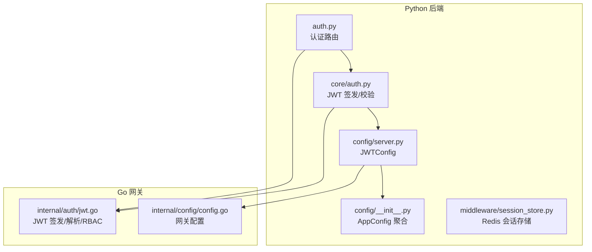
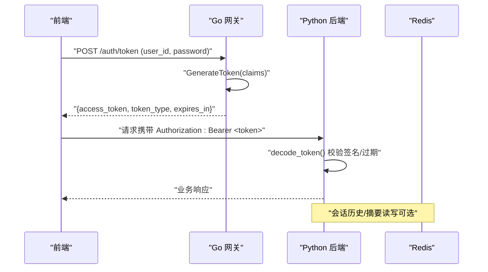
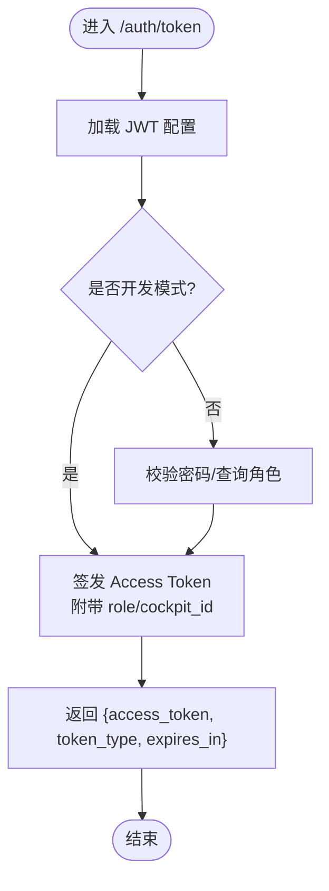
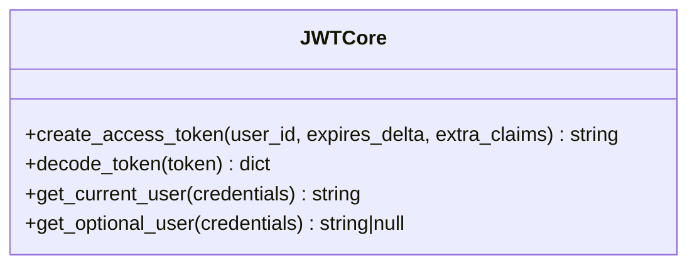
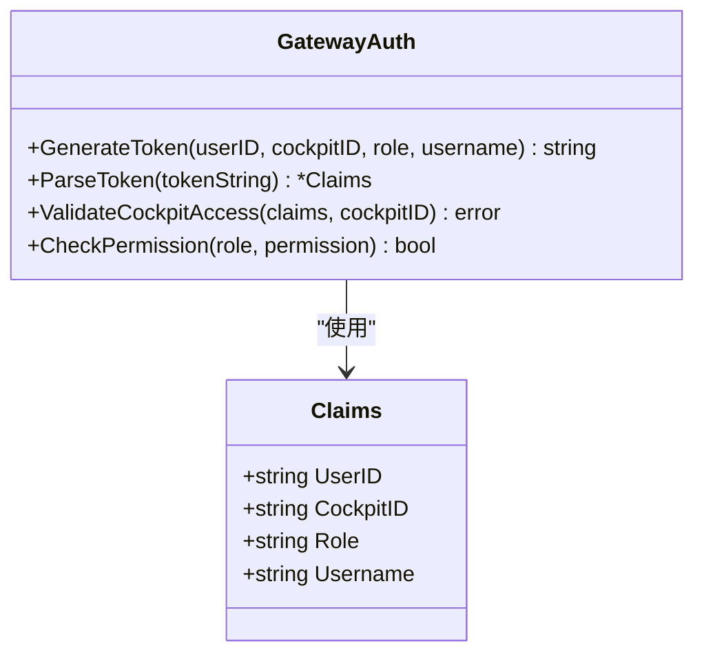
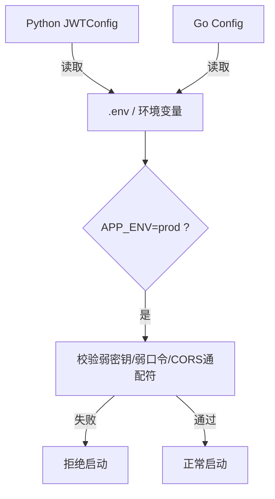
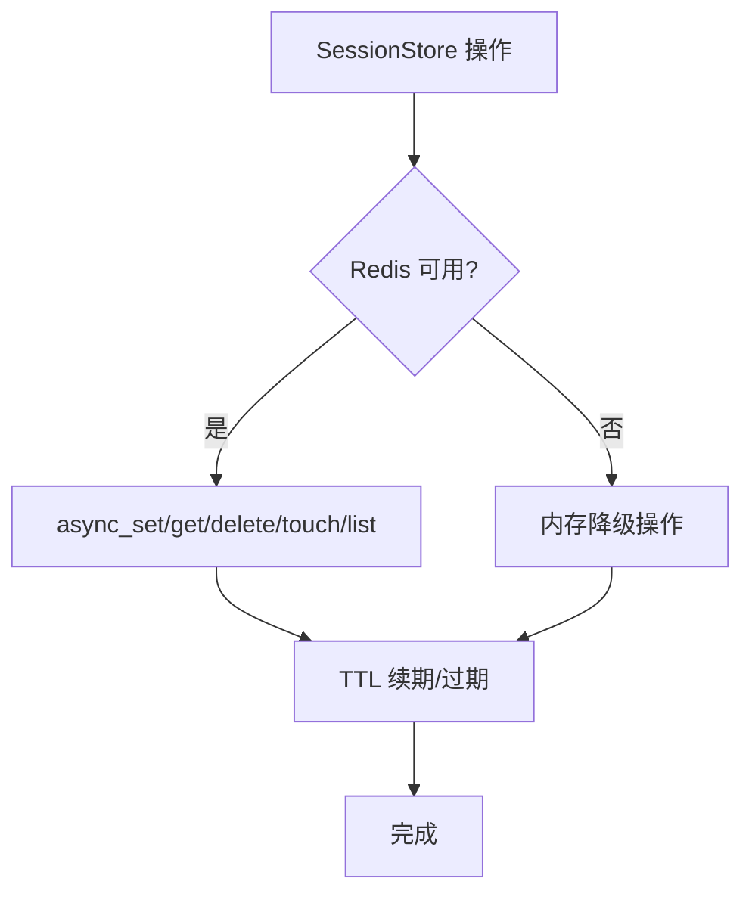
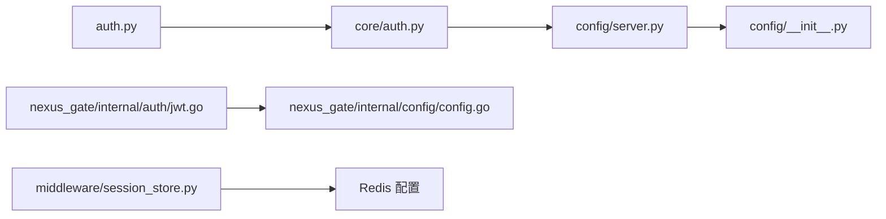
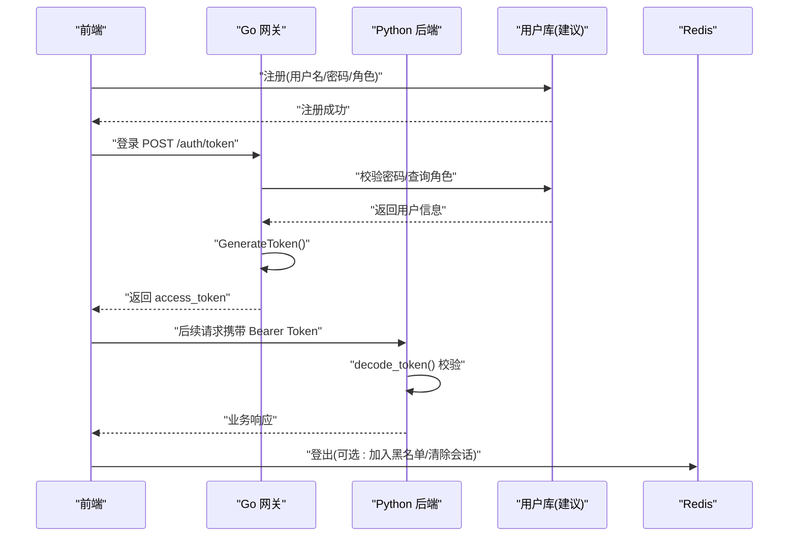
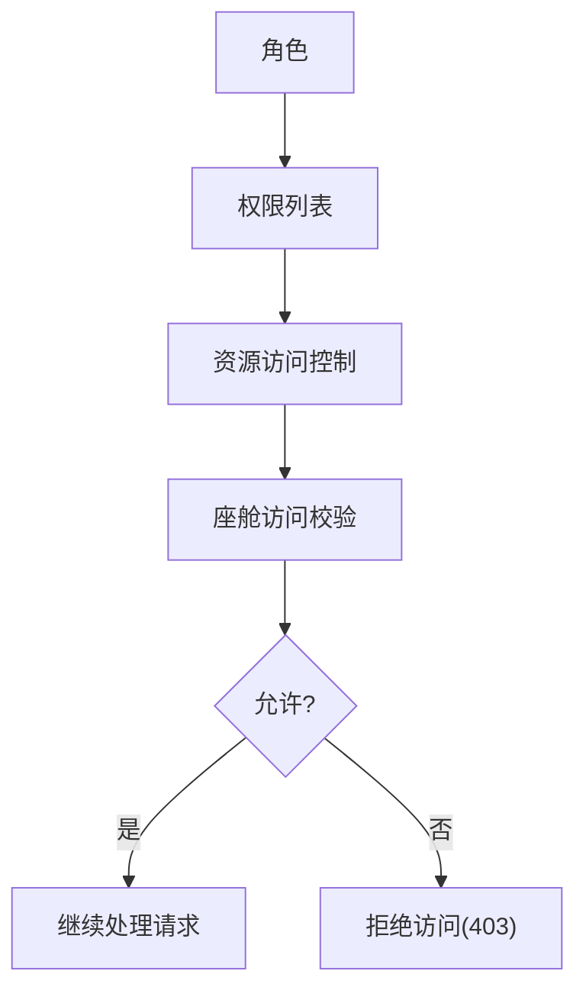

# 认证授权API

<cite>
**本文引用的文件**   
- [backend_design/nexus/api/routes/auth.py](file://backend_design/nexus/api/routes/auth.py)
- [backend_design/nexus/core/auth.py](file://backend_design/nexus/core/auth.py)
- [backend_design/nexus/config/server.py](file://backend_design/nexus/config/server.py)
- [backend_design/nexus/config/__init__.py](file://backend_design/nexus/config/__init__.py)
- [backend_design/nexus/core/exceptions.py](file://backend_design/nexus/core/exceptions.py)
- [backend_design/nexus/middleware/session_store.py](file://backend_design/nexus/middleware/session_store.py)
- [backend_design/nexus_gate/internal/auth/jwt.go](file://backend_design/nexus_gate/internal/auth/jwt.go)
- [backend_design/nexus_gate/internal/config/config.go](file://backend_design/nexus_gate/internal/config/config.go)
</cite>

## 目录
1. [简介](#简介)
2. [项目结构](#项目结构)
3. [核心组件](#核心组件)
4. [架构总览](#架构总览)
5. [详细组件分析](#详细组件分析)
6. [依赖关系分析](#依赖关系分析)
7. [性能考虑](#性能考虑)
8. [故障排查指南](#故障排查指南)
9. [结论](#结论)
10. [附录](#附录)

## 简介
本文件为 NexusCockpit 的认证与授权 API 提供全面文档，覆盖 JWT 令牌认证机制、用户注册/登录/登出流程、RBAC 权限模型、密码安全策略、令牌刷新与会话管理、错误码与异常处理、前端集成示例、令牌存储最佳实践与安全配置，以及多租户（座舱）身份隔离与数据安全措施。

## 项目结构
认证授权相关代码主要分布在以下位置：
- Python FastAPI 服务：认证路由与 JWT 签发/校验逻辑
- Go 网关：JWT 签发、解析与 RBAC 权限校验
- 配置中心：JWT 参数、服务器与 CORS 等配置
- 会话存储：基于 Redis 的会话历史持久化与降级策略

**图示来源** 
- [backend_design/nexus/api/routes/auth.py:1-194](file://backend_design/nexus/api/routes/auth.py#L1-L194)
- [backend_design/nexus/core/auth.py:1-140](file://backend_design/nexus/core/auth.py#L1-L140)
- [backend_design/nexus/config/server.py:1-61](file://backend_design/nexus/config/server.py#L1-L61)
- [backend_design/nexus/config/__init__.py:1-167](file://backend_design/nexus/config/__init__.py#L1-L167)
- [backend_design/nexus/middleware/session_store.py:1-294](file://backend_design/nexus/middleware/session_store.py#L1-L294)
- [backend_design/nexus_gate/internal/auth/jwt.go:1-128](file://backend_design/nexus_gate/internal/auth/jwt.go#L1-L128)
- [backend_design/nexus_gate/internal/config/config.go:1-218](file://backend_design/nexus_gate/internal/config/config.go#L1-L218)

**章节来源**
- [backend_design/nexus/api/routes/auth.py:1-194](file://backend_design/nexus/api/routes/auth.py#L1-L194)
- [backend_design/nexus/core/auth.py:1-140](file://backend_design/nexus/core/auth.py#L1-L140)
- [backend_design/nexus/config/server.py:1-61](file://backend_design/nexus/config/server.py#L1-L61)
- [backend_design/nexus/config/__init__.py:1-167](file://backend_design/nexus/config/__init__.py#L1-L167)
- [backend_design/nexus/middleware/session_store.py:1-294](file://backend_design/nexus/middleware/session_store.py#L1-L294)
- [backend_design/nexus_gate/internal/auth/jwt.go:1-128](file://backend_design/nexus_gate/internal/auth/jwt.go#L1-L128)
- [backend_design/nexus_gate/internal/config/config.go:1-218](file://backend_design/nexus_gate/internal/config/config.go#L1-L218)

## 核心组件
- 认证路由（FastAPI）：提供 /auth/token、/auth/me、密码修改与验证码重置等接口
- JWT 核心模块：create_access_token、decode_token、get_current_user、get_optional_user
- 网关 JWT 模块：GenerateToken、ParseToken、ValidateCockpitAccess、CheckPermission
- 配置模块：JWTConfig（算法、密钥、过期时间、默认角色）、网关配置（JWT 密钥、过期小时、CORS、限流等）
- 会话存储：Redis 优先，内存降级，支持会话历史与滚动摘要持久化

**章节来源**
- [backend_design/nexus/api/routes/auth.py:1-194](file://backend_design/nexus/api/routes/auth.py#L1-L194)
- [backend_design/nexus/core/auth.py:1-140](file://backend_design/nexus/core/auth.py#L1-L140)
- [backend_design/nexus_gate/internal/auth/jwt.go:1-128](file://backend_design/nexus_gate/internal/auth/jwt.go#L1-L128)
- [backend_design/nexus/config/server.py:1-61](file://backend_design/nexus/config/server.py#L1-L61)
- [backend_design/nexus_gate/internal/config/config.go:1-218](file://backend_design/nexus_gate/internal/config/config.go#L1-L218)
- [backend_design/nexus/middleware/session_store.py:1-294](file://backend_design/nexus/middleware/session_store.py#L1-L294)

## 架构总览
NexusCockpit 采用“网关 + 后端”的双端 JWT 方案：
- 网关（Go）负责统一入口、鉴权、限流、跨域与转发；可签发 Token 并执行 RBAC 校验
- 后端（Python）使用相同的密钥与算法验证 Token，并通过 FastAPI 依赖注入实现细粒度权限控制
- 会话与短期记忆通过 Redis 持久化，支持多实例部署与自动续期

**图示来源** 
- [backend_design/nexus_gate/internal/auth/jwt.go:28-50](file://backend_design/nexus_gate/internal/auth/jwt.go#L28-L50)
- [backend_design/nexus/core/auth.py:35-61](file://backend_design/nexus/core/auth.py#L35-L61)
- [backend_design/nexus/middleware/session_store.py:152-177](file://backend_design/nexus/middleware/session_store.py#L152-L177)

## 详细组件分析

### 认证路由（FastAPI）
- POST /auth/token：开发模式直接签发 Token（默认赋予管理员角色），生产环境应接入数据库校验密码
- GET /auth/me：用于验证 Token 有效性，返回当前用户信息
- POST /auth/change-password：修改密码（开发模式不校验旧密码）
- POST /auth/send-code：发送手机验证码（开发模式返回验证码）
- POST /auth/reset-password-by-code：通过验证码重置密码

**图示来源** 
- [backend_design/nexus/api/routes/auth.py:48-77](file://backend_design/nexus/api/routes/auth.py#L48-L77)

**章节来源**
- [backend_design/nexus/api/routes/auth.py:1-194](file://backend_design/nexus/api/routes/auth.py#L1-L194)

### JWT 核心模块（Python）
- create_access_token：根据 user_id、过期时长与额外 claims 生成 JWT
- decode_token：解码并验证 JWT，抛出 AuthError（过期或无效）
- get_current_user：FastAPI 依赖，从 Authorization 头提取并校验 Token，返回 user_id
- get_optional_user：可选认证，失败时返回 None

**图示来源** 
- [backend_design/nexus/core/auth.py:35-122](file://backend_design/nexus/core/auth.py#L35-L122)

**章节来源**
- [backend_design/nexus/core/auth.py:1-140](file://backend_design/nexus/core/auth.py#L1-L140)

### 网关 JWT 模块（Go）
- GenerateToken：签发包含 user_id、cockpit_id、role、username 的 JWT
- ParseToken：解析并校验签名，要求 HS256
- ValidateCockpitAccess：super_admin 可访问所有座舱，其他角色仅能访问绑定座舱
- CheckPermission：按角色检查权限（RBAC）

**图示来源** 
- [backend_design/nexus_gate/internal/auth/jwt.go:19-127](file://backend_design/nexus_gate/internal/auth/jwt.go#L19-L127)

**章节来源**
- [backend_design/nexus_gate/internal/auth/jwt.go:1-128](file://backend_design/nexus_gate/internal/auth/jwt.go#L1-L128)

### 配置模块（Python 与 Go）
- Python JWTConfig：secret_key、algorithm、expire_minutes/hours、默认角色与管理员/普通用户口令
- Go 配置：JWTSecret、JWTExpireHours、CORS、限流、座舱数量等；生产环境安全检查拒绝弱配置启动

**图示来源** 
- [backend_design/nexus/config/server.py:44-61](file://backend_design/nexus/config/server.py#L44-L61)
- [backend_design/nexus_gate/internal/config/config.go:120-142](file://backend_design/nexus_gate/internal/config/config.go#L120-L142)

**章节来源**
- [backend_design/nexus/config/server.py:1-61](file://backend_design/nexus/config/server.py#L1-L61)
- [backend_design/nexus_gate/internal/config/config.go:1-218](file://backend_design/nexus_gate/internal/config/config.go#L1-L218)

### 会话存储（Redis）
- 异步读写会话历史与滚动摘要，支持 TTL 自动续期
- Redis 不可用时自动降级到内存字典，保证可用性
- 删除会话时同时清理短期记忆与滚动摘要

**图示来源** 
- [backend_design/nexus/middleware/session_store.py:91-177](file://backend_design/nexus/middleware/session_store.py#L91-L177)
- [backend_design/nexus/middleware/session_store.py:195-221](file://backend_design/nexus/middleware/session_store.py#L195-L221)

**章节来源**
- [backend_design/nexus/middleware/session_store.py:1-294](file://backend_design/nexus/middleware/session_store.py#L1-L294)

## 依赖关系分析
- 认证路由依赖 core/auth 进行 Token 签发与校验
- core/auth 依赖 config.server.JWTConfig 获取密钥与算法
- 网关 auth.jwt 与 Python 侧共享同一密钥与算法，确保互验
- 会话存储依赖 Redis 配置，具备内存降级能力

**图示来源** 
- [backend_design/nexus/api/routes/auth.py:1-194](file://backend_design/nexus/api/routes/auth.py#L1-L194)
- [backend_design/nexus/core/auth.py:1-140](file://backend_design/nexus/core/auth.py#L1-L140)
- [backend_design/nexus/config/server.py:1-61](file://backend_design/nexus/config/server.py#L1-L61)
- [backend_design/nexus/config/__init__.py:1-167](file://backend_design/nexus/config/__init__.py#L1-L167)
- [backend_design/nexus_gate/internal/auth/jwt.go:1-128](file://backend_design/nexus_gate/internal/auth/jwt.go#L1-L128)
- [backend_design/nexus_gate/internal/config/config.go:1-218](file://backend_design/nexus_gate/internal/config/config.go#L1-L218)
- [backend_design/nexus/middleware/session_store.py:1-294](file://backend_design/nexus/middleware/session_store.py#L1-L294)

**章节来源**
- [backend_design/nexus/api/routes/auth.py:1-194](file://backend_design/nexus/api/routes/auth.py#L1-L194)
- [backend_design/nexus/core/auth.py:1-140](file://backend_design/nexus/core/auth.py#L1-L140)
- [backend_design/nexus/config/server.py:1-61](file://backend_design/nexus/config/server.py#L1-L61)
- [backend_design/nexus/config/__init__.py:1-167](file://backend_design/nexus/config/__init__.py#L1-L167)
- [backend_design/nexus_gate/internal/auth/jwt.go:1-128](file://backend_design/nexus_gate/internal/auth/jwt.go#L1-L128)
- [backend_design/nexus_gate/internal/config/config.go:1-218](file://backend_design/nexus_gate/internal/config/config.go#L1-L218)
- [backend_design/nexus/middleware/session_store.py:1-294](file://backend_design/nexus/middleware/session_store.py#L1-L294)

## 性能考虑
- JWT 校验为无状态计算，开销极低；建议将敏感校验（如密码、角色）前置在网关层
- Redis 会话存储具备自动续期与降级，避免热点键过期抖动；合理设置 SESSION_TTL_SECONDS
- 生产环境启用限流与熔断，防止暴力破解与资源耗尽
- 使用短生命周期 Access Token 配合刷新机制（见附录）降低泄露风险

[本节为通用指导，无需引用具体文件]

## 故障排查指南
常见错误与处理：
- 未提供认证凭据：检查 Authorization 头是否携带 Bearer Token
- Token 已过期：重新登录获取新 Token
- Token 无效：检查密钥与算法一致性（Python 与 Go 需一致）
- 验证码过期或不正确：重新发送验证码并核对输入
- Redis 不可用：确认连接配置，系统会自动降级到内存存储

对应异常类型：
- AuthError：认证错误（Token 无效/过期）
- RateLimitError：限流触发
- CacheError：缓存/Redis 操作失败

**章节来源**
- [backend_design/nexus/core/auth.py:98-122](file://backend_design/nexus/core/auth.py#L98-L122)
- [backend_design/nexus/core/exceptions.py:105-117](file://backend_design/nexus/core/exceptions.py#L105-L117)
- [backend_design/nexus/api/routes/auth.py:176-193](file://backend_design/nexus/api/routes/auth.py#L176-L193)

## 结论
NexusCockpit 的认证授权体系以 JWT 为核心，结合网关 RBAC 与后端依赖注入，实现了高内聚、低耦合的安全控制。通过统一的配置管理与生产环境安全检查，保障密钥强度与合规性。Redis 会话存储提供了可靠的上下文持久化与降级策略。建议在生产环境中完善密码校验、令牌刷新与审计日志，进一步提升安全性与可观测性。

[本节为总结，无需引用具体文件]

## 附录

### 完整认证流程图（含注册/登录/登出）
说明：
- 注册：当前路由未实现用户注册接口，建议在网关或后端新增注册端点，写入用户库并分配默认角色
- 登录：POST /auth/token（开发模式直接签发；生产环境需校验密码）
- 登出：客户端主动销毁本地 Token；服务端可通过 Redis 黑名单或会话失效实现强制登出

**图示来源** 
- [backend_design/nexus/api/routes/auth.py:48-77](file://backend_design/nexus/api/routes/auth.py#L48-L77)
- [backend_design/nexus_gate/internal/auth/jwt.go:28-50](file://backend_design/nexus_gate/internal/auth/jwt.go#L28-L50)
- [backend_design/nexus/middleware/session_store.py:115-150](file://backend_design/nexus/middleware/session_store.py#L115-L150)

### 权限控制模型（RBAC）
- 角色定义：super_admin、cockpit_admin、cockpit_user、cockpit_viewer
- 权限映射：不同角色拥有不同资源访问权限（如 cockpit:chat、cockpit:vehicle、dataplatform:view 等）
- 座舱隔离：ValidateCockpitAccess 限制非 super_admin 只能访问绑定的 cockpit_id

**图示来源** 
- [backend_design/nexus_gate/internal/auth/jwt.go:90-127](file://backend_design/nexus_gate/internal/auth/jwt.go#L90-L127)

**章节来源**
- [backend_design/nexus_gate/internal/auth/jwt.go:90-127](file://backend_design/nexus_gate/internal/auth/jwt.go#L90-L127)

### 密码安全策略
- 开发模式：不校验旧密码，便于测试
- 生产环境：必须接入用户库校验旧密码，并更新哈希值（建议使用 bcrypt/argon2）
- 验证码重置：短信网关发送验证码，服务端校验有效期与次数限制

**章节来源**
- [backend_design/nexus/api/routes/auth.py:92-110](file://backend_design/nexus/api/routes/auth.py#L92-L110)
- [backend_design/nexus/api/routes/auth.py:132-154](file://backend_design/nexus/api/routes/auth.py#L132-L154)
- [backend_design/nexus/api/routes/auth.py:164-193](file://backend_design/nexus/api/routes/auth.py#L164-L193)

### 令牌刷新机制（建议）
- 使用短生命周期 Access Token（如 15 分钟）
- 引入 Refresh Token（长生命周期，如 7 天），存储在安全位置（HttpOnly Cookie）
- 刷新接口：POST /auth/refresh，校验 Refresh Token 后签发新的 Access Token
- 登出：服务端撤销 Refresh Token（加入黑名单或标记失效）

[本节为通用设计建议，无需引用具体文件]

### 会话管理
- 会话历史与滚动摘要持久化至 Redis，支持 TTL 自动续期
- 删除会话时清理短期记忆与滚动摘要
- 多实例部署下共享会话状态，避免数据丢失

**章节来源**
- [backend_design/nexus/middleware/session_store.py:91-177](file://backend_design/nexus/middleware/session_store.py#L91-L177)
- [backend_design/nexus/middleware/session_store.py:232-288](file://backend_design/nexus/middleware/session_store.py#L232-L288)

### 前端集成示例与最佳实践
- 登录成功后保存 access_token 到内存或 HttpOnly Cookie
- 每次请求在 Authorization 头添加 "Bearer <token>"
- 监听 401 响应，自动跳转登录页或调用刷新接口
- 避免在 localStorage 中明文存储敏感信息

[本节为通用集成建议，无需引用具体文件]

### 安全配置指南
- 生产环境必须设置强随机 JWT_SECRET，禁用默认弱密钥
- 明确 CORS_ORIGINS，禁止通配符 "*"
- 设置 RBAC_USER_PASSWORD，禁止空口令
- 启用限流与熔断，保护关键接口

**章节来源**
- [backend_design/nexus_gate/internal/config/config.go:120-142](file://backend_design/nexus_gate/internal/config/config.go#L120-L142)
- [backend_design/nexus/config/server.py:15-42](file://backend_design/nexus/config/server.py#L15-L42)

### 多租户（座舱）身份隔离与数据安全
- 每个 Token 携带 cockpit_id，网关层校验访问权限
- super_admin 可跨座舱访问，其他角色仅限绑定座舱
- 会话与记忆按 session_key 隔离，避免数据串扰

**章节来源**
- [backend_design/nexus_gate/internal/auth/jwt.go:78-88](file://backend_design/nexus_gate/internal/auth/jwt.go#L78-L88)
- [backend_design/nexus/middleware/session_store.py:31-40](file://backend_design/nexus/middleware/session_store.py#L31-L40)