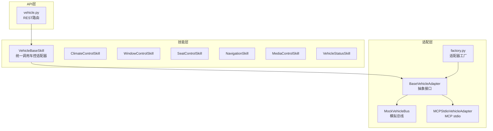
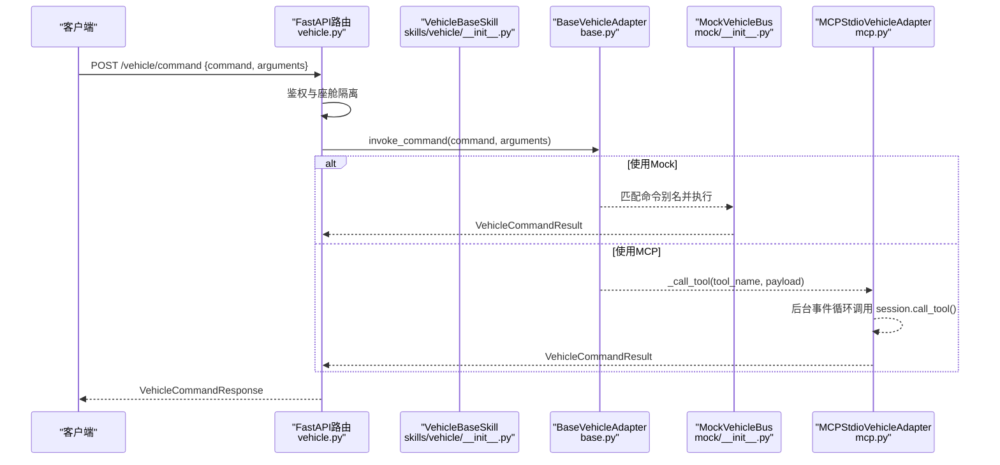
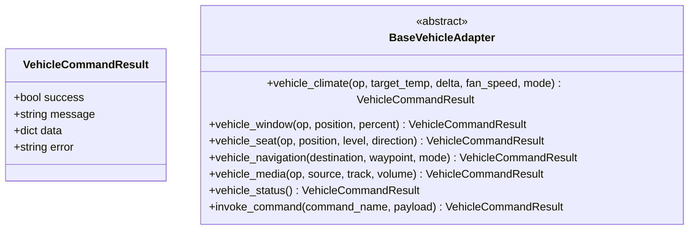
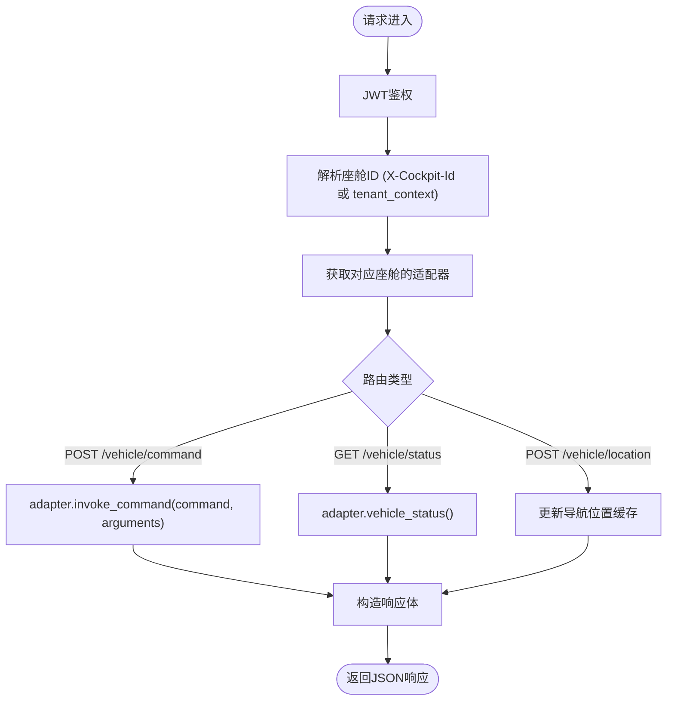
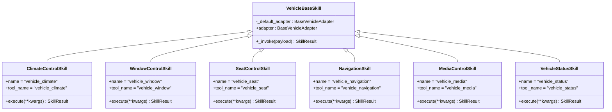
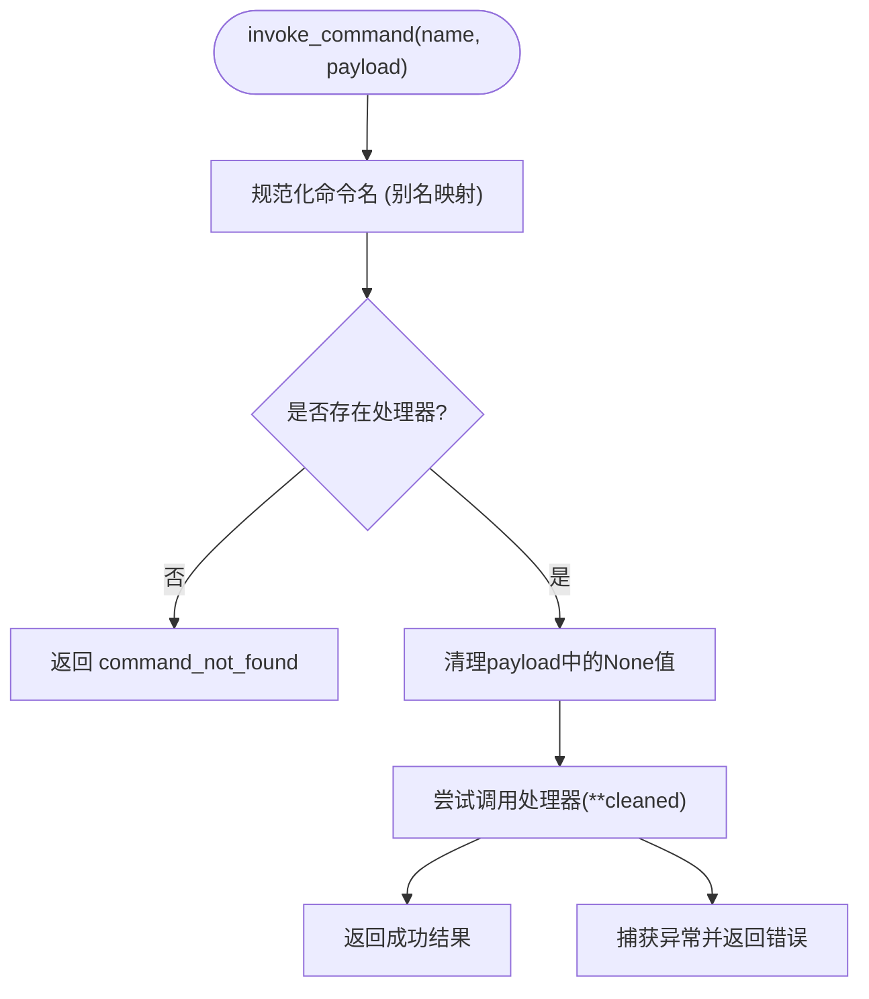
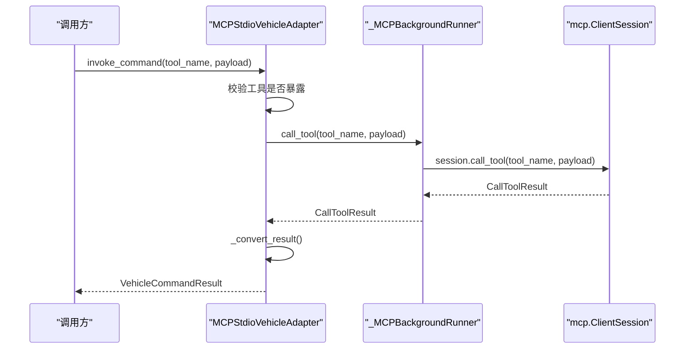
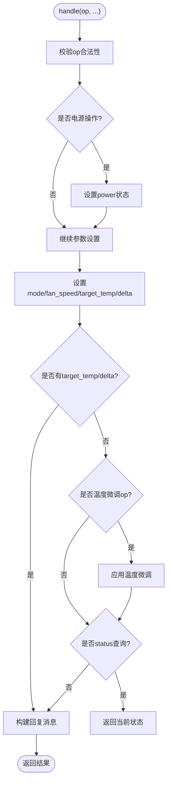
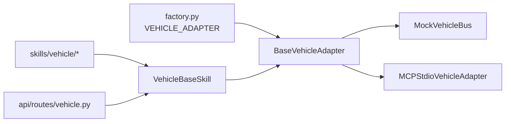

# 车辆控制API

<cite>
**本文引用的文件**   
- [backend_design/nexus/vehicle/mcp.py](file://backend_design/nexus/vehicle/mcp.py)
- [backend_design/nexus/skills/vehicle/__init__.py](file://backend_design/nexus/skills/vehicle/__init__.py)
- [backend_design/nexus/api/routes/vehicle.py](file://backend_design/nexus/api/routes/vehicle.py)
- [backend_design/nexus/skills/vehicle/climate.py](file://backend_design/nexus/skills/vehicle/climate.py)
- [backend_design/nexus/skills/vehicle/window.py](file://backend_design/nexus/skills/vehicle/window.py)
- [backend_design/nexus/skills/vehicle/seat.py](file://backend_design/nexus/skills/vehicle/seat.py)
- [backend_design/nexus/skills/vehicle/navigation.py](file://backend_design/nexus/skills/vehicle/navigation.py)
- [backend_design/nexus/skills/vehicle/media.py](file://backend_design/nexus/skills/vehicle/media.py)
- [backend_design/nexus/skills/vehicle/status.py](file://backend_design/nexus/skills/vehicle/status.py)
- [backend_design/nexus/vehicle/mock/__init__.py](file://backend_design/nexus/vehicle/mock/__init__.py)
- [backend_design/nexus/vehicle/base.py](file://backend_design/nexus/vehicle/base.py)
- [backend_design/nexus/models/schemas.py](file://backend_design/nexus/models/schemas.py)
- [backend_design/nexus/vehicle/factory.py](file://backend_design/nexus/vehicle/factory.py)
- [backend_design/nexus/core/exceptions.py](file://backend_design/nexus/core/exceptions.py)
</cite>

## 目录
1. [简介](#简介)
2. [项目结构](#项目结构)
3. [核心组件](#核心组件)
4. [架构总览](#架构总览)
5. [详细组件分析](#详细组件分析)
6. [依赖关系分析](#依赖关系分析)
7. [性能考虑](#性能考虑)
8. [故障排查指南](#故障排查指南)
9. [结论](#结论)
10. [附录](#附录)

## 简介
本文件为 NexusCockpit 车辆控制API的权威文档，聚焦于车控命令的标准化接口设计与MCP协议实现。内容覆盖空调、车窗、座椅、导航、媒体等设备的控制接口与状态查询；解释命令执行生命周期、错误处理与状态同步策略；提供完整的API调用示例、参数校验规则与性能优化建议；并给出Mock模式测试方法与真实设备集成指南。

## 项目结构
车辆控制相关代码主要分布在以下模块：
- API路由层：暴露REST接口用于直接执行车控命令与查询状态
- 技能层：将自然语言意图映射为标准化的车控命令（工具名+参数）
- 适配层：抽象统一的BaseVehicleAdapter接口，支持Mock/HTTP/MCP三种后端
- MCP适配器：通过MCP SDK以stdio方式与外部车控服务通信
- Mock总线：模拟各子系统状态，便于开发与测试
- 工厂与配置：根据环境变量选择具体适配器并管理多座舱隔离

图表来源
- [backend_design/nexus/api/routes/vehicle.py:48-108](file://backend_design/nexus/api/routes/vehicle.py#L48-L108)
- [backend_design/nexus/skills/vehicle/__init__.py:21-55](file://backend_design/nexus/skills/vehicle/__init__.py#L21-L55)
- [backend_design/nexus/vehicle/base.py:35-92](file://backend_design/nexus/vehicle/base.py#L35-L92)
- [backend_design/nexus/vehicle/mock/__init__.py:39-220](file://backend_design/nexus/vehicle/mock/__init__.py#L39-L220)
- [backend_design/nexus/vehicle/mcp.py:167-285](file://backend_design/nexus/vehicle/mcp.py#L167-L285)
- [backend_design/nexus/vehicle/factory.py:38-123](file://backend_design/nexus/vehicle/factory.py#L38-L123)

章节来源
- [backend_design/nexus/api/routes/vehicle.py:1-152](file://backend_design/nexus/api/routes/vehicle.py#L1-L152)
- [backend_design/nexus/vehicle/base.py:1-92](file://backend_design/nexus/vehicle/base.py#L1-L92)
- [backend_design/nexus/vehicle/factory.py:1-147](file://backend_design/nexus/vehicle/factory.py#L1-L147)

## 核心组件
- 车控适配器抽象接口：定义统一的空调、车窗、座椅、导航、媒体、状态查询与通用命令调用方法
- 技能基类：封装对适配器的调用，支持按座舱隔离获取适配器实例
- 各业务技能：空调、车窗、座椅、导航、媒体、状态查询的技能实现，声明工具名与参数说明
- Mock总线：门面模式聚合各子系统状态，提供命令别名映射与统一入口
- MCP适配器：通过后台事件循环桥接异步MCP SDK，暴露同步接口
- 工厂：根据配置选择Mock/HTTP/MCP适配器，并提供多座舱隔离

章节来源
- [backend_design/nexus/vehicle/base.py:19-92](file://backend_design/nexus/vehicle/base.py#L19-L92)
- [backend_design/nexus/skills/vehicle/__init__.py:21-55](file://backend_design/nexus/skills/vehicle/__init__.py#L21-L55)
- [backend_design/nexus/skills/vehicle/climate.py:15-37](file://backend_design/nexus/skills/vehicle/climate.py#L15-L37)
- [backend_design/nexus/skills/vehicle/window.py:15-34](file://backend_design/nexus/skills/vehicle/window.py#L15-L34)
- [backend_design/nexus/skills/vehicle/seat.py:15-35](file://backend_design/nexus/skills/vehicle/seat.py#L15-L35)
- [backend_design/nexus/skills/vehicle/navigation.py:15-39](file://backend_design/nexus/skills/vehicle/navigation.py#L15-L39)
- [backend_design/nexus/skills/vehicle/media.py:15-36](file://backend_design/nexus/skills/vehicle/media.py#L15-L36)
- [backend_design/nexus/skills/vehicle/status.py:15-33](file://backend_design/nexus/skills/vehicle/status.py#L15-L33)
- [backend_design/nexus/vehicle/mock/__init__.py:39-220](file://backend_design/nexus/vehicle/mock/__init__.py#L39-L220)
- [backend_design/nexus/vehicle/mcp.py:167-285](file://backend_design/nexus/vehicle/mcp.py#L167-L285)
- [backend_design/nexus/vehicle/factory.py:38-123](file://backend_design/nexus/vehicle/factory.py#L38-L123)

## 架构总览
下图展示了从REST请求到车控后端的完整调用链，包括认证、座舱隔离、适配器选择与结果返回。

图表来源
- [backend_design/nexus/api/routes/vehicle.py:48-108](file://backend_design/nexus/api/routes/vehicle.py#L48-L108)
- [backend_design/nexus/skills/vehicle/__init__.py:44-55](file://backend_design/nexus/skills/vehicle/__init__.py#L44-L55)
- [backend_design/nexus/vehicle/base.py:89-92](file://backend_design/nexus/vehicle/base.py#L89-L92)
- [backend_design/nexus/vehicle/mock/__init__.py:194-220](file://backend_design/nexus/vehicle/mock/__init__.py#L194-L220)
- [backend_design/nexus/vehicle/mcp.py:225-280](file://backend_design/nexus/vehicle/mcp.py#L225-L280)

## 详细组件分析

### 车控适配器抽象接口与结果模型
- 抽象接口定义了空调、车窗、座椅、导航、媒体、状态查询与通用命令调用方法
- 结果模型包含成功标志、消息、结构化数据与错误码，便于上层统一处理

图表来源
- [backend_design/nexus/vehicle/base.py:19-92](file://backend_design/nexus/vehicle/base.py#L19-L92)

章节来源
- [backend_design/nexus/vehicle/base.py:19-92](file://backend_design/nexus/vehicle/base.py#L19-L92)

### REST API：车控命令与状态查询
- POST /vehicle/command：直接执行车控命令（绕过Agent工作流），需要JWT认证，支持多座舱隔离
- GET /vehicle/status：获取车辆当前状态（空调、车窗、座椅、媒体、导航、车况），返回扁平结构
- POST /vehicle/location：更新浏览器GPS坐标，仅存储位置信息，不触发逆地理编码

图表来源
- [backend_design/nexus/api/routes/vehicle.py:48-108](file://backend_design/nexus/api/routes/vehicle.py#L48-L108)
- [backend_design/nexus/api/routes/vehicle.py:117-152](file://backend_design/nexus/api/routes/vehicle.py#L117-L152)

章节来源
- [backend_design/nexus/api/routes/vehicle.py:48-108](file://backend_design/nexus/api/routes/vehicle.py#L48-L108)
- [backend_design/nexus/api/routes/vehicle.py:117-152](file://backend_design/nexus/api/routes/vehicle.py#L117-L152)
- [backend_design/nexus/models/schemas.py:55-68](file://backend_design/nexus/models/schemas.py#L55-L68)

### 技能层：标准化工具与参数
- 每个技能声明工具名（tool_name）、描述、可选参数与示例输入
- 技能基类负责通过适配器调用统一入口，支持座舱隔离

图表来源
- [backend_design/nexus/skills/vehicle/__init__.py:21-55](file://backend_design/nexus/skills/vehicle/__init__.py#L21-L55)
- [backend_design/nexus/skills/vehicle/climate.py:15-37](file://backend_design/nexus/skills/vehicle/climate.py#L15-L37)
- [backend_design/nexus/skills/vehicle/window.py:15-34](file://backend_design/nexus/skills/vehicle/window.py#L15-L34)
- [backend_design/nexus/skills/vehicle/seat.py:15-35](file://backend_design/nexus/skills/vehicle/seat.py#L15-L35)
- [backend_design/nexus/skills/vehicle/navigation.py:15-39](file://backend_design/nexus/skills/vehicle/navigation.py#L15-L39)
- [backend_design/nexus/skills/vehicle/media.py:15-36](file://backend_design/nexus/skills/vehicle/media.py#L15-L36)
- [backend_design/nexus/skills/vehicle/status.py:15-33](file://backend_design/nexus/skills/vehicle/status.py#L15-L33)

章节来源
- [backend_design/nexus/skills/vehicle/__init__.py:21-55](file://backend_design/nexus/skills/vehicle/__init__.py#L21-L55)
- [backend_design/nexus/skills/vehicle/climate.py:15-37](file://backend_design/nexus/skills/vehicle/climate.py#L15-L37)
- [backend_design/nexus/skills/vehicle/window.py:15-34](file://backend_design/nexus/skills/vehicle/window.py#L15-L34)
- [backend_design/nexus/skills/vehicle/seat.py:15-35](file://backend_design/nexus/skills/vehicle/seat.py#L15-L35)
- [backend_design/nexus/skills/vehicle/navigation.py:15-39](file://backend_design/nexus/skills/vehicle/navigation.py#L15-L39)
- [backend_design/nexus/skills/vehicle/media.py:15-36](file://backend_design/nexus/skills/vehicle/media.py#L15-L36)
- [backend_design/nexus/skills/vehicle/status.py:15-33](file://backend_design/nexus/skills/vehicle/status.py#L15-L33)

### Mock总线：状态管理与命令别名
- 门面模式聚合各子系统状态（空调、车窗、座椅、导航、媒体、车况）
- COMMAND_ALIASES提供命令别名映射，统一入口invoke_command支持参数清理与异常捕获
- vehicle_status聚合所有子系统数据，location分支委托导航子模块

图表来源
- [backend_design/nexus/vehicle/mock/__init__.py:194-220](file://backend_design/nexus/vehicle/mock/__init__.py#L194-L220)

章节来源
- [backend_design/nexus/vehicle/mock/__init__.py:39-220](file://backend_design/nexus/vehicle/mock/__init__.py#L39-L220)

### MCP适配器：stdio与异步桥接
- 后台线程运行MCP SDK异步上下文，通过run_coroutine_threadsafe桥接同步调用
- 初始化时建立会话、列出可用工具，保持会话存活直到关闭
- _call_tool进行工具存在性校验与异常包装，_convert_result将MCP结果转换为统一格式

图表来源
- [backend_design/nexus/vehicle/mcp.py:167-285](file://backend_design/nexus/vehicle/mcp.py#L167-L285)

章节来源
- [backend_design/nexus/vehicle/mcp.py:25-165](file://backend_design/nexus/vehicle/mcp.py#L25-L165)
- [backend_design/nexus/vehicle/mcp.py:167-285](file://backend_design/nexus/vehicle/mcp.py#L167-L285)

### 空调控制逻辑（温度、风量、模式）
- 支持电源开关、目标温度设置、相对调节、风量档位、模式切换
- 操作符校验与范围限制（温度16-30，风量1-7）
- 复合指令顺序：电源操作→参数设置→温度微调→状态查询

图表来源
- [backend_design/nexus/vehicle/mock/climate_state.py:41-143](file://backend_design/nexus/vehicle/mock/climate_state.py#L41-L143)

章节来源
- [backend_design/nexus/vehicle/mock/climate_state.py:22-143](file://backend_design/nexus/vehicle/mock/climate_state.py#L22-L143)

### 车窗控制（开合度、防夹保护）
- 支持open/close/up/down/set_position等操作
- position支持all/front_left等位置标识，percent为0-100百分比
- 状态查询返回各车窗开合度

章节来源
- [backend_design/nexus/skills/vehicle/window.py:15-34](file://backend_design/nexus/skills/vehicle/window.py#L15-L34)
- [backend_design/nexus/vehicle/mock/__init__.py:134-137](file://backend_design/nexus/vehicle/mock/__init__.py#L134-L137)

### 座椅调节（位置、加热、通风、按摩）
- 支持heat_on/cool_on/massage_on/forward等操作
- position支持driver/passenger等座位标识，level为档位，direction为方向
- 状态查询返回各座椅状态

章节来源
- [backend_design/nexus/skills/vehicle/seat.py:15-35](file://backend_design/nexus/skills/vehicle/seat.py#L15-L35)
- [backend_design/nexus/vehicle/mock/__init__.py:139-146](file://backend_design/nexus/vehicle/mock/__init__.py#L139-L146)

### 导航控制（目的地设置、路线规划、当前位置）
- destination为目的地，waypoint为途经点，mode为导航模式
- op=location支持查询当前位置（结合IP定位）
- 状态查询返回导航状态与当前位置

章节来源
- [backend_design/nexus/skills/vehicle/navigation.py:15-39](file://backend_design/nexus/skills/vehicle/navigation.py#L15-L39)
- [backend_design/nexus/vehicle/mock/__init__.py:148-157](file://backend_design/nexus/vehicle/mock/__init__.py#L148-L157)

### 媒体播放（音量、曲目切换、来源）
- op支持play/pause/next/prev/set_volume/set_source等
- source支持local/bluetooth/radio等来源，volume为0-30音量
- 状态查询返回媒体播放状态

章节来源
- [backend_design/nexus/skills/vehicle/media.py:15-36](file://backend_design/nexus/skills/vehicle/media.py#L15-L36)
- [backend_design/nexus/vehicle/mock/__init__.py:159-167](file://backend_design/nexus/vehicle/mock/__init__.py#L159-L167)

### 状态查询接口与数据结构
- vehicle_status返回聚合后的所有子系统状态（空调、车窗、座椅、媒体、导航、车况）
- location分支返回当前位置与朝向信息
- 前端可直接匹配VehicleStatus类型

章节来源
- [backend_design/nexus/vehicle/mock/__init__.py:169-192](file://backend_design/nexus/vehicle/mock/__init__.py#L169-L192)
- [backend_design/nexus/api/routes/vehicle.py:88-108](file://backend_design/nexus/api/routes/vehicle.py#L88-L108)

## 依赖关系分析
- 适配器工厂根据VEHICLE_ADAPTER配置选择Mock/HTTP/MCP适配器
- 技能层通过VehicleBaseSkill统一调用适配器，支持座舱隔离
- API路由层通过_fastapi中间件注入用户与座舱上下文

图表来源
- [backend_design/nexus/vehicle/factory.py:38-123](file://backend_design/nexus/vehicle/factory.py#L38-L123)
- [backend_design/nexus/skills/vehicle/__init__.py:21-55](file://backend_design/nexus/skills/vehicle/__init__.py#L21-L55)
- [backend_design/nexus/api/routes/vehicle.py:35-46](file://backend_design/nexus/api/routes/vehicle.py#L35-L46)

章节来源
- [backend_design/nexus/vehicle/factory.py:38-123](file://backend_design/nexus/vehicle/factory.py#L38-L123)
- [backend_design/nexus/skills/vehicle/__init__.py:21-55](file://backend_design/nexus/skills/vehicle/__init__.py#L21-L55)
- [backend_design/nexus/api/routes/vehicle.py:35-46](file://backend_design/nexus/api/routes/vehicle.py#L35-L46)

## 性能考虑
- MCP适配器使用后台事件循环与run_coroutine_threadsafe桥接异步SDK，避免阻塞主线程
- 工具超时与初始化超时可配置，防止长时间等待导致资源占用
- Mock模式无网络开销，适合开发测试；HTTP/MCP模式需关注网络延迟与重试策略
- 多座舱隔离确保状态独立，避免跨座舱竞争

章节来源
- [backend_design/nexus/vehicle/mcp.py:25-165](file://backend_design/nexus/vehicle/mcp.py#L25-L165)
- [backend_design/nexus/vehicle/factory.py:104-118](file://backend_design/nexus/vehicle/factory.py#L104-L118)

## 故障排查指南
- 车控错误：VehicleError携带error_code与details，便于前端区分处理
- 适配器未初始化：返回503状态码，检查VEHICLE_ADAPTER配置与依赖服务
- MCP工具未暴露：返回tool_not_exposed错误，确认MCP服务已正确注册工具
- 参数校验失败：检查技能定义的parameters与required_parameters

章节来源
- [backend_design/nexus/core/exceptions.py:91-96](file://backend_design/nexus/core/exceptions.py#L91-96)
- [backend_design/nexus/api/routes/vehicle.py:66-78](file://backend_design/nexus/api/routes/vehicle.py#L66-L78)
- [backend_design/nexus/vehicle/mcp.py:225-237](file://backend_design/nexus/vehicle/mcp.py#L225-L237)

## 结论
NexusCockpit的车辆控制API通过标准化接口与多适配器架构，实现了空调、车窗、座椅、导航、媒体等设备的统一控制与状态查询。MCP协议支持与Mock模式的灵活切换，满足开发与生产环境的不同需求。建议在生产环境中启用HTTP/MCP适配器，并结合监控与熔断机制提升系统稳定性。

## 附录

### API调用示例与参数验证规则
- POST /vehicle/command
  - 请求体：{command: "vehicle_climate", arguments: {op: "set_temp", target_temp: 24}}
  - 参数验证：参考各技能的parameters定义，如op为字符串、target_temp为整数且在16-30范围内
- GET /vehicle/status
  - 返回聚合状态：{climate, windows, seats, media, navigation, status}
- POST /vehicle/location
  - 请求体：{latitude: 39.9042, longitude: 116.4074}
  - 仅存储坐标，地址在查询时获取

章节来源
- [backend_design/nexus/skills/vehicle/climate.py:27-33](file://backend_design/nexus/skills/vehicle/climate.py#L27-L33)
- [backend_design/nexus/skills/vehicle/window.py:26-30](file://backend_design/nexus/skills/vehicle/window.py#L26-L30)
- [backend_design/nexus/skills/vehicle/seat.py:26-31](file://backend_design/nexus/skills/vehicle/seat.py#L26-L31)
- [backend_design/nexus/skills/vehicle/navigation.py:30-35](file://backend_design/nexus/skills/vehicle/navigation.py#L30-L35)
- [backend_design/nexus/skills/vehicle/media.py:27-32](file://backend_design/nexus/skills/vehicle/media.py#L27-L32)
- [backend_design/nexus/api/routes/vehicle.py:117-152](file://backend_design/nexus/api/routes/vehicle.py#L117-L152)

### Mock模式测试方法
- 启动服务后，直接使用POST /vehicle/command调用MockVehicleBus
- 通过GET /vehicle/status验证状态变更
- 利用COMMAND_ALIASES测试不同命令别名

章节来源
- [backend_design/nexus/vehicle/mock/__init__.py:46-80](file://backend_design/nexus/vehicle/mock/__init__.py#L46-L80)
- [backend_design/nexus/vehicle/mock/__init__.py:194-220](file://backend_design/nexus/vehicle/mock/__init__.py#L194-L220)

### 真实设备集成指南
- 配置VEHICLE_ADAPTER为http或mcp-stdio
- HTTP模式：设置api_base_url、protocol、endpoint、timeout、auth_token
- MCP模式：设置mcp_command与mcp_args，确保MCP服务可通过stdio启动

章节来源
- [backend_design/nexus/vehicle/factory.py:94-118](file://backend_design/nexus/vehicle/factory.py#L94-L118)