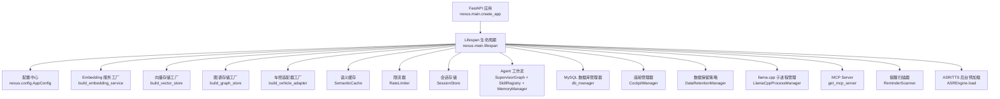
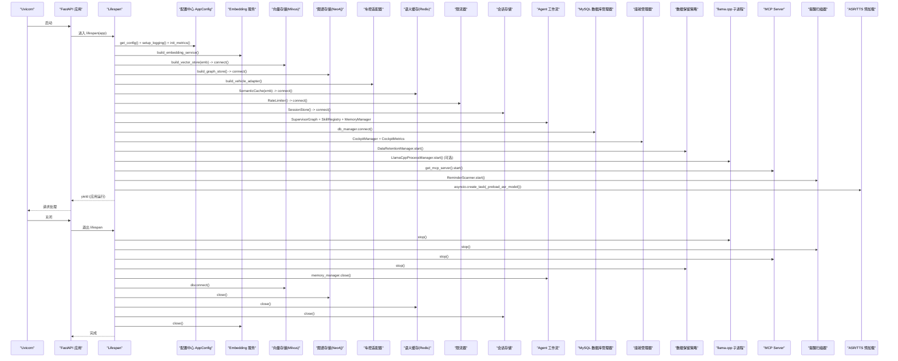
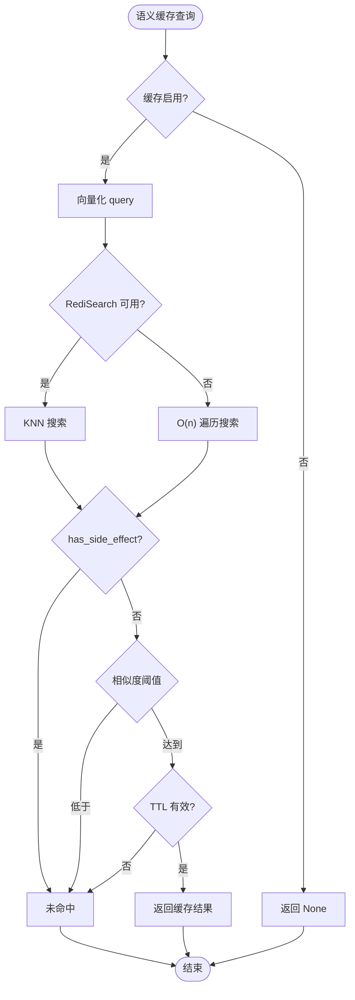
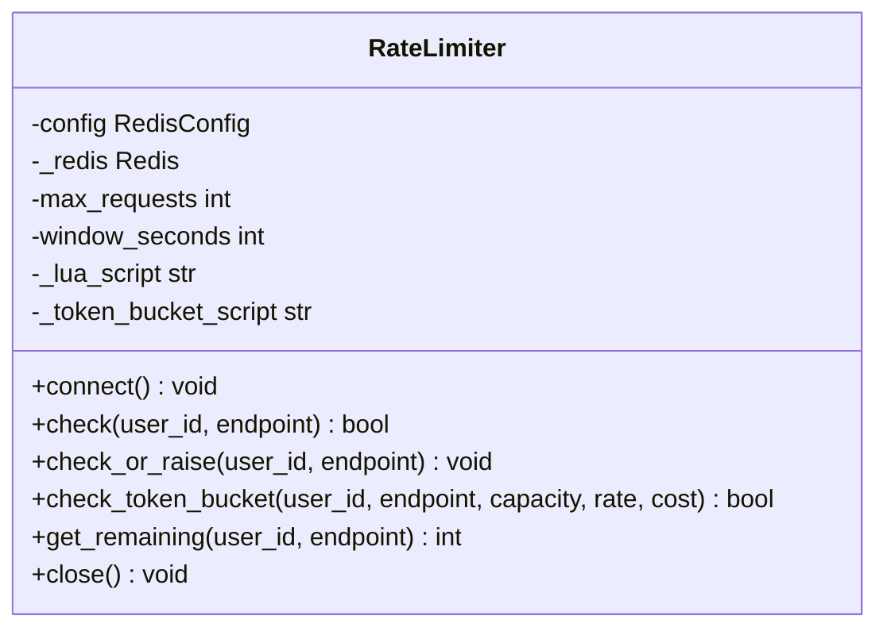
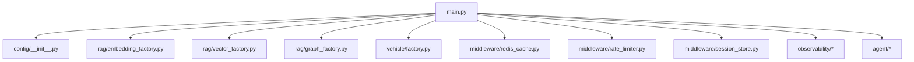

# FastAPI应用框架

<cite>
**本文引用的文件**   
- [main.py](file://backend_design/nexus/main.py)
- [rate_limiter.py](file://backend_design/nexus/middleware/rate_limiter.py)
- [redis_cache.py](file://backend_design/nexus/middleware/redis_cache.py)
- [session_store.py](file://backend_design/nexus/middleware/session_store.py)
- [embedding_factory.py](file://backend_design/nexus/rag/embedding_factory.py)
- [vector_factory.py](file://backend_design/nexus/rag/vector_factory.py)
- [graph_factory.py](file://backend_design/nexus/rag/graph_factory.py)
- [factory.py](file://backend_design/nexus/vehicle/factory.py)
- [__init__.py](file://backend_design/nexus/config/__init__.py)
- [pyproject.toml](file://backend_design/pyproject.toml)
</cite>

## 目录
1. [简介](#简介)
2. [项目结构](#项目结构)
3. [核心组件](#核心组件)
4. [架构总览](#架构总览)
5. [详细组件分析](#详细组件分析)
6. [依赖关系分析](#依赖关系分析)
7. [性能考量](#性能考量)
8. [故障排查指南](#故障排查指南)
9. [结论](#结论)
10. [附录](#附录)

## 简介
本文件为 NexusCockpit FastAPI 应用框架的权威文档，聚焦于应用生命周期管理、启动与关闭流程、核心组件初始化顺序与依赖关系、扩展中间件与异常处理器的实践方法，以及 CORS、静态文件挂载、Prometheus 指标端点等关键配置。读者可据此快速理解并扩展该框架，满足企业级车载语音智能体平台的需求。

## 项目结构
后端服务以 FastAPI 为核心，通过 lifespan 上下文管理器统一编排应用启动与关闭流程；RAG（向量存储、图谱存储）、车控适配器、语义缓存、限流器、会话存储、Agent 工作流、MCP Server、数据保留策略、ASR/TTS 模型预加载等均在启动阶段按需初始化，并在关闭时有序释放资源。

图表来源 
- [main.py:75-383](file://backend_design/nexus/main.py#L75-L383)
- [embedding_factory.py:27-38](file://backend_design/nexus/rag/embedding_factory.py#L27-L38)
- [vector_factory.py:21-34](file://backend_design/nexus/rag/vector_factory.py#L21-L34)
- [graph_factory.py:20-28](file://backend_design/nexus/rag/graph_factory.py#L20-L28)
- [factory.py:38-122](file://backend_design/nexus/vehicle/factory.py#L38-L122)
- [__init__.py:84-151](file://backend_design/nexus/config/__init__.py#L84-L151)

章节来源
- [main.py:75-383](file://backend_design/nexus/main.py#L75-L383)
- [pyproject.toml:1-135](file://backend_design/pyproject.toml#L1-L135)

## 核心组件
- 应用入口与生命周期：FastAPI 实例创建、路由注册、中间件、异常处理器、指标端点、静态文件挂载、lifespan 启动/关闭逻辑。
- 配置中心：AppConfig 聚合所有子系统配置，支持 .env 与环境变量注入，提供全局单例访问。
- Embedding 服务：本地 bge-m3 或云端 API 选择，供语义缓存与检索使用。
- 向量存储：固定本地 Milvus，负责文本向量化后的持久化与检索。
- 图谱存储：固定本地 Neo4j，用于结构化知识管理与推理。
- 车控适配器：mock/http/mcp 三种模式，支持多座舱隔离。
- 语义缓存：基于 Redis 8 RediSearch 的 KNN 向量索引，支持 TTL 分级与安全副作用过滤。
- 限流器：Redis Lua 原子滑动窗口与令牌桶算法，保证分布式安全。
- 会话存储：Redis 持久化会话历史与滚动摘要，具备内存降级能力。
- Agent 工作流：Supervisor 多智能体、技能注册、记忆管理、意图路由、SQLite checkpoint 持久化。
- 其他：MySQL 数据库管理器、座舱管理器、数据保留策略、llama.cpp 子进程、MCP Server、提醒扫描器、ASR/TTS 后台预加载。

章节来源
- [main.py:75-383](file://backend_design/nexus/main.py#L75-L383)
- [__init__.py:84-151](file://backend_design/nexus/config/__init__.py#L84-L151)
- [embedding_factory.py:27-38](file://backend_design/nexus/rag/embedding_factory.py#L27-L38)
- [vector_factory.py:21-34](file://backend_design/nexus/rag/vector_factory.py#L21-L34)
- [graph_factory.py:20-28](file://backend_design/nexus/rag/graph_factory.py#L20-L28)
- [factory.py:38-122](file://backend_design/nexus/vehicle/factory.py#L38-L122)
- [redis_cache.py:57-128](file://backend_design/nexus/middleware/redis_cache.py#L57-L128)
- [rate_limiter.py:117-202](file://backend_design/nexus/middleware/rate_limiter.py#L117-L202)
- [session_store.py:43-113](file://backend_design/nexus/middleware/session_store.py#L43-L113)

## 架构总览
下图展示 FastAPI 应用启动时的组件初始化顺序与依赖关系，以及关闭时的清理顺序。

图表来源 
- [main.py:75-383](file://backend_design/nexus/main.py#L75-L383)
- [main.py:385-433](file://backend_design/nexus/main.py#L385-L433)

## 详细组件分析

### 应用生命周期与启动流程
- 日志与指标：在 lifespan 中优先初始化结构化日志与 Prometheus 指标，确保后续模块输出一致。
- 配置重置：强制重置 LLM 客户端单例并清除配置缓存，确保热重载后使用最新配置。
- 诊断信息：打印 API Key 加载状态（脱敏），便于调试。
- 组件初始化顺序：
  1) Embedding 服务
  2) 向量存储（Milvus）
  3) 图谱存储（Neo4j）
  4) 车控适配器
  5) 语义缓存（Redis）
  6) 限流器（Redis）
  7) 会话存储（Redis）
  8) Langfuse 监控器
  9) 指标 Redis（供 CockpitMetrics）
  10) Agent 工作流（SupervisorGraph、SkillRegistry、MemoryManager、IntentRouterService）
  11) Cherry 知识库（可选）
  12) MySQL 数据库管理器
  13) 座舱管理器与指标采集器
  14) 数据保留策略
  15) llama.cpp 子进程（可选）
  16) MCP Server
  17) 提醒扫描器
  18) ASR/TTS 模型后台预加载（不阻塞启动）

章节来源
- [main.py:75-383](file://backend_design/nexus/main.py#L75-L383)

### 应用关闭与资源清理
- 停止外部进程与服务：llama.cpp 子进程、提醒扫描器、MCP Server、数据保留策略。
- 停止任务池清理循环：GenerationTaskPool。
- 关闭记忆管理器：停止定时清理任务并断开 Milvus/Neo4j。
- 关闭连接：指标 Redis、向量存储、图谱存储、语义缓存、会话存储、Embedding 服务。
- 刷新与关闭检查点：Langfuse flush、Checkpoint SQLite 连接关闭。

章节来源
- [main.py:385-433](file://backend_design/nexus/main.py#L385-L433)

### 配置中心与提供者选择
- AppConfig 聚合各子系统配置，支持 .env 与环境变量注入，提供全局单例 get_config()。
- Embedding 服务工厂根据 providers.embedding 选择本地或云端实现。
- 向量与图谱存储工厂固定本地 Milvus/Neo4j，简化部署与运维。
- 车控适配器工厂根据 VEHICLE_ADAPTER 选择 mock/http/mcp，并支持多座舱隔离。

章节来源
- [__init__.py:84-151](file://backend_design/nexus/config/__init__.py#L84-L151)
- [embedding_factory.py:27-38](file://backend_design/nexus/rag/embedding_factory.py#L27-L38)
- [vector_factory.py:21-34](file://backend_design/nexus/rag/vector_factory.py#L21-L34)
- [graph_factory.py:20-28](file://backend_design/nexus/rag/graph_factory.py#L20-L28)
- [factory.py:38-122](file://backend_design/nexus/vehicle/factory.py#L38-L122)

### 语义缓存（Redis）
- 特性：KNN 向量检索、按用户分片、TTL 分级、副作用隔离（车控指令不缓存）。
- 能力探测：自动检测 Redis 是否支持 FT.* 命令，不支持则回退到 O(n) scan 模式。
- 安全性：has_side_effect=True 的响应永不写入缓存，避免车控指令被缓存后不执行。
- 清理：支持按用户与会话删除，启动时清理旧的车控指令缓存条目。

图表来源 
- [redis_cache.py:90-128](file://backend_design/nexus/middleware/redis_cache.py#L90-L128)
- [redis_cache.py:213-301](file://backend_design/nexus/middleware/redis_cache.py#L213-L301)
- [redis_cache.py:303-365](file://backend_design/nexus/middleware/redis_cache.py#L303-L365)
- [redis_cache.py:367-436](file://backend_design/nexus/middleware/redis_cache.py#L367-L436)
- [redis_cache.py:516-561](file://backend_design/nexus/middleware/redis_cache.py#L516-L561)

章节来源
- [redis_cache.py:57-128](file://backend_design/nexus/middleware/redis_cache.py#L57-L128)
- [redis_cache.py:213-301](file://backend_design/nexus/middleware/redis_cache.py#L213-L301)
- [redis_cache.py:303-365](file://backend_design/nexus/middleware/redis_cache.py#L303-L365)
- [redis_cache.py:367-436](file://backend_design/nexus/middleware/redis_cache.py#L367-L436)
- [redis_cache.py:516-561](file://backend_design/nexus/middleware/redis_cache.py#L516-L561)

### 限流器（Redis）
- 算法：滑动窗口（ZSET）与令牌桶（HMGET/HMSET）两种 Lua 脚本，保证原子性与分布式安全。
- 行为：超限返回 False 并抛出 RateLimitError（映射为 429）；出错时放行（降级策略）。
- 使用：在中间件或端点前调用 check_or_raise(user_id, endpoint)。

图表来源 
- [rate_limiter.py:117-202](file://backend_design/nexus/middleware/rate_limiter.py#L117-L202)
- [rate_limiter.py:204-277](file://backend_design/nexus/middleware/rate_limiter.py#L204-L277)
- [rate_limiter.py:279-297](file://backend_design/nexus/middleware/rate_limiter.py#L279-L297)

章节来源
- [rate_limiter.py:117-202](file://backend_design/nexus/middleware/rate_limiter.py#L117-L202)
- [rate_limiter.py:204-277](file://backend_design/nexus/middleware/rate_limiter.py#L204-L277)
- [rate_limiter.py:279-297](file://backend_design/nexus/middleware/rate_limiter.py#L279-L297)

### 会话存储（Redis）
- 功能：异步读写会话历史与滚动摘要，支持 TTL 自动续期与内存降级。
- 降级：Redis 不可用时回退到内存 dict，保证服务可用性。
- 清理：删除会话时同时清理短期记忆与滚动摘要。

章节来源
- [session_store.py:43-113](file://backend_design/nexus/middleware/session_store.py#L43-L113)
- [session_store.py:115-150](file://backend_design/nexus/middleware/session_store.py#L115-L150)
- [session_store.py:152-194](file://backend_design/nexus/middleware/session_store.py#L152-L194)
- [session_store.py:232-289](file://backend_design/nexus/middleware/session_store.py#L232-L289)

### 车控适配器工厂
- 模式：mock/http/mcp，依据 VEHICLE_ADAPTER 与相关配置动态选择。
- 多座舱隔离：Mock 模式下每个座舱独立实例，HTTP/MCP 无状态复用单例。
- 参数解析：支持 JSON 或 shlex 解析命令行与参数列表。

章节来源
- [factory.py:38-122](file://backend_design/nexus/vehicle/factory.py#L38-L122)
- [factory.py:125-147](file://backend_design/nexus/vehicle/factory.py#L125-L147)

### 扩展中间件与异常处理器
- 中间件示例：纯 ASGI 中间件 CockpitContextMiddleware，提取 X-Cockpit-Id 并设置 contextvars，同时记录请求计时与 Prometheus 指标。
- 异常处理器：
  - RateLimitError → 429 Too Many Requests
  - AuthError → 401 Unauthorized
  - NexusError → 500 Internal Server Error
  - HTTPException → 统一错误格式
  - RequestValidationError → 422 校验失败
  - Exception → 兜底捕获，防止泄露内部堆栈

章节来源
- [main.py:598-652](file://backend_design/nexus/main.py#L598-L652)
- [main.py:503-596](file://backend_design/nexus/main.py#L503-L596)

### CORS、静态文件与指标端点
- CORS：允许前端跨域访问，支持凭据与通配方法与头。
- 静态文件：挂载 /audio 目录，供媒体播放使用。
- 指标端点：挂载 /metrics，暴露 Prometheus 指标。

章节来源
- [main.py:454-461](file://backend_design/nexus/main.py#L454-L461)
- [main.py:486-501](file://backend_design/nexus/main.py#L486-L501)

## 依赖关系分析
- 组件耦合：
  - lifespan 集中编排，降低模块间直接耦合。
  - 工厂模式解耦具体实现（Embedding/Vector/Graph/Vehicle）。
  - Redis 作为共享状态中心（缓存、限流、会话、指标）。
- 外部依赖：
  - Milvus、Neo4j、Redis、MySQL、llama.cpp、MCP Server、Langfuse、Prometheus。
- 潜在循环依赖：
  - 通过延迟导入与工厂函数避免循环引用。
- 接口契约：
  - BaseVectorStore/BaseGraphStore/BaseVehicleAdapter 抽象接口，确保替换实现一致性。

图表来源 
- [main.py:75-383](file://backend_design/nexus/main.py#L75-L383)
- [embedding_factory.py:27-38](file://backend_design/nexus/rag/embedding_factory.py#L27-L38)
- [vector_factory.py:21-34](file://backend_design/nexus/rag/vector_factory.py#L21-L34)
- [graph_factory.py:20-28](file://backend_design/nexus/rag/graph_factory.py#L20-L28)
- [factory.py:38-122](file://backend_design/nexus/vehicle/factory.py#L38-L122)

章节来源
- [main.py:75-383](file://backend_design/nexus/main.py#L75-L383)
- [pyproject.toml:1-135](file://backend_design/pyproject.toml#L1-L135)

## 性能考量
- 启动优化：ASR/TTS 模型后台预加载，避免阻塞 FastAPI 启动。
- 缓存策略：语义缓存 KNN 检索 O(log n)，TTL 分级减少热点数据压力。
- 限流策略：Lua 脚本原子操作，避免竞态条件与超限污染计数器。
- 连接复用：Redis/MySQL/向量/图谱连接在 lifespan 内保持，减少握手开销。
- 降级策略：Redis 不可用限时流与缓存降级，保障服务可用性。

[本节为通用指导，无需特定文件引用]

## 故障排查指南
- 启动失败：
  - 检查 Redis/Milvus/Neo4j/MySQL 连接与权限。
  - 查看日志中的警告与错误信息（如“connection failed”、“index creation failed”）。
- 限流触发：
  - 确认 user_id 与 endpoint 是否正确传递。
  - 检查 Redis Lua 脚本加载与 EVALSHA/EVAL 回退。
- 缓存未命中：
  - 验证 FT.* 命令可用性，必要时升级 Redis 或使用 redis-stack-server。
  - 检查 has_side_effect 标记与相似度阈值。
- 会话丢失：
  - 确认 Redis 模式与 TTL 设置，检查内存降级是否生效。
- 指标缺失：
  - 检查 /metrics 端点是否挂载，确认中间件是否排除自引用。

章节来源
- [main.py:503-596](file://backend_design/nexus/main.py#L503-L596)
- [redis_cache.py:90-128](file://backend_design/nexus/middleware/redis_cache.py#L90-L128)
- [rate_limiter.py:142-202](file://backend_design/nexus/middleware/rate_limiter.py#L142-L202)
- [session_store.py:69-113](file://backend_design/nexus/middleware/session_store.py#L69-L113)

## 结论
NexusCockpit FastAPI 应用通过 lifespan 统一管理生命周期，采用工厂模式与中间件机制实现高内聚低耦合的架构设计。启动阶段按依赖顺序初始化核心组件，关闭阶段有序释放资源，确保系统稳定可靠。开发者可基于现有扩展点快速集成新中间件与异常处理器，并通过配置中心灵活切换后端实现。

[本节为总结性内容，无需特定文件引用]

## 附录
- 最佳实践：
  - 使用工厂函数构建可替换的后端实现。
  - 在 lifespan 中集中管理外部连接与后台任务。
  - 对关键路径添加限流与缓存，提升吞吐与稳定性。
  - 统一异常格式，便于前端处理与日志追踪。
  - 利用 Prometheus 与 Langfuse 进行观测与追踪。

[本节为通用指导，无需特定文件引用]