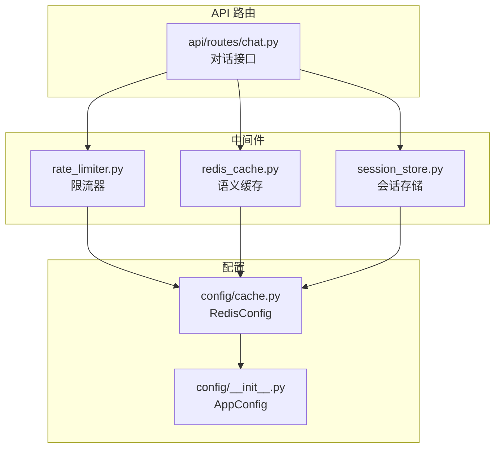
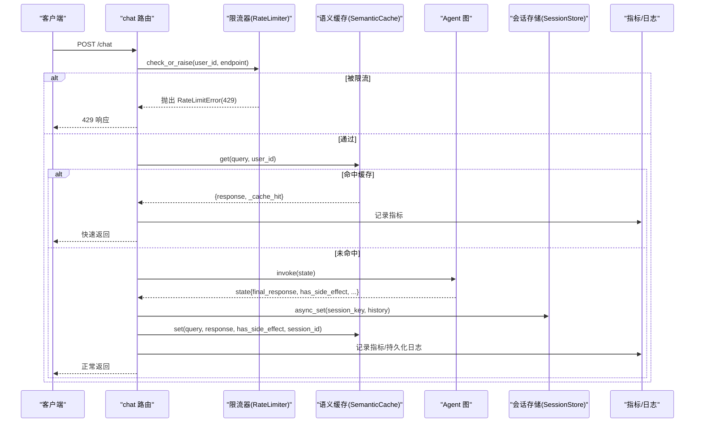
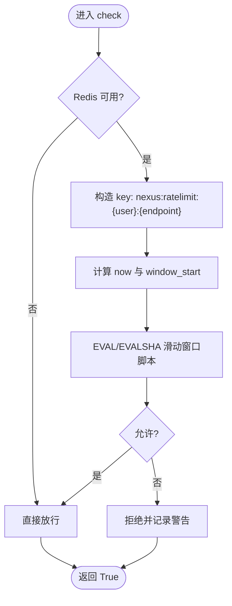
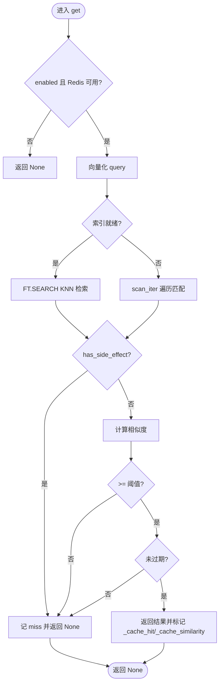
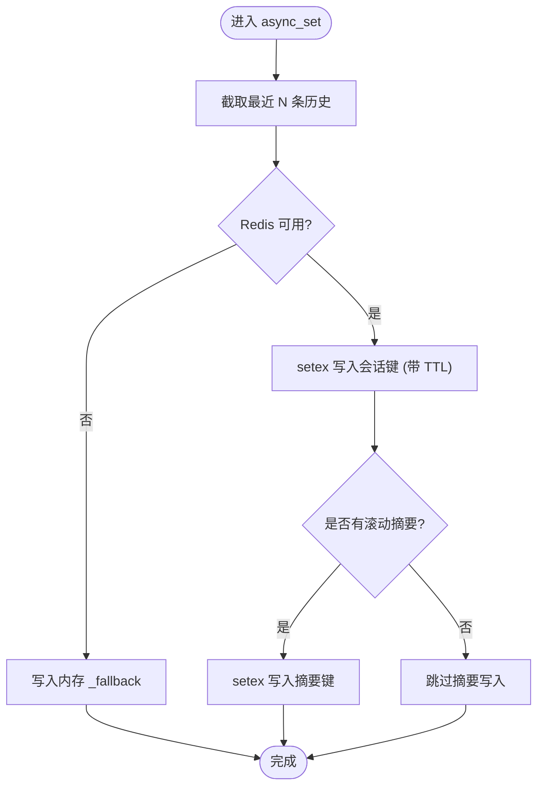
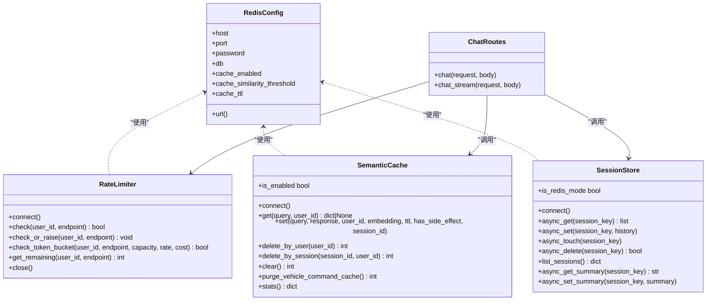

# 中间件系统

<cite>
**本文引用的文件**   
- [backend_design/nexus/middleware/rate_limiter.py](file://backend_design/nexus/middleware/rate_limiter.py)
- [backend_design/nexus/middleware/redis_cache.py](file://backend_design/nexus/middleware/redis_cache.py)
- [backend_design/nexus/middleware/session_store.py](file://backend_design/nexus/middleware/session_store.py)
- [backend_design/nexus/config/cache.py](file://backend_design/nexus/config/cache.py)
- [backend_design/nexus/config/__init__.py](file://backend_design/nexus/config/__init__.py)
- [backend_design/nexus/api/routes/chat.py](file://backend_design/nexus/api/routes/chat.py)
- [backend_design/nexus/core/exceptions.py](file://backend_design/nexus/core/exceptions.py)
</cite>

## 目录
1. [简介](#简介)
2. [项目结构](#项目结构)
3. [核心组件](#核心组件)
4. [架构总览](#架构总览)
5. [详细组件分析](#详细组件分析)
6. [依赖关系分析](#依赖关系分析)
7. [性能与监控](#性能与监控)
8. [故障排查指南](#故障排查指南)
9. [结论](#结论)
10. [附录：开发指南与最佳实践](#附录开发指南与最佳实践)

## 简介
本文件为 NexusCockpit 中间件系统的权威技术文档，聚焦以下目标：
- 解释中间件的执行顺序与请求处理管道
- 深入解析三大中间件：限流（Redis 滑动窗口/令牌桶）、语义缓存（基于向量相似度的智能缓存）、会话存储（Redis 持久化 + 内存降级）
- 说明配置项、扩展点与自定义方法
- 提供性能调优建议与监控指标
- 阐述中间件与上下文变量的交互机制
- 给出测试方法与故障排查技巧
- 为开发者提供完整的中间件开发与集成指南

## 项目结构
中间件位于 backend_design/nexus/middleware 目录下，包含三个核心模块：
- rate_limiter.py：基于 Redis 的分布式限流（滑动窗口与令牌桶）
- redis_cache.py：基于 Redis 8 RediSearch 的语义缓存（KNN 向量检索）
- session_store.py：会话历史与滚动摘要的 Redis 持久化（含内存降级）

配置集中在 nexus.config.cache.RedisConfig 中，应用级聚合在 nexus.config.AppConfig。

**图表来源** 
- [backend_design/nexus/middleware/rate_limiter.py](file://backend_design/nexus/middleware/rate_limiter.py)
- [backend_design/nexus/middleware/redis_cache.py](file://backend_design/nexus/middleware/redis_cache.py)
- [backend_design/nexus/middleware/session_store.py](file://backend_design/nexus/middleware/session_store.py)
- [backend_design/nexus/config/cache.py](file://backend_design/nexus/config/cache.py)
- [backend_design/nexus/config/__init__.py](file://backend_design/nexus/config/__init__.py)
- [backend_design/nexus/api/routes/chat.py](file://backend_design/nexus/api/routes/chat.py)

**章节来源**
- [backend_design/nexus/middleware/rate_limiter.py](file://backend_design/nexus/middleware/rate_limiter.py)
- [backend_design/nexus/middleware/redis_cache.py](file://backend_design/nexus/middleware/redis_cache.py)
- [backend_design/nexus/middleware/session_store.py](file://backend_design/nexus/middleware/session_store.py)
- [backend_design/nexus/config/cache.py](file://backend_design/nexus/config/cache.py)
- [backend_design/nexus/config/__init__.py](file://backend_design/nexus/config/__init__.py)
- [backend_design/nexus/api/routes/chat.py](file://backend_design/nexus/api/routes/chat.py)

## 核心组件
- 限流中间件（RateLimiter）
  - 算法：Redis Lua 原子性滑动窗口；可选令牌桶（突发+稳定速率）
  - 行为：超限返回 False 或抛出 RateLimitError（429），异常时降级放行
  - 关键方法：connect、check、check_or_raise、check_token_bucket、get_remaining、close

- 语义缓存中间件（SemanticCache）
  - 算法：RediSearch KNN 向量检索（COSINE 相似度），阈值过滤，TTL 控制
  - 安全：has_side_effect=True 的响应永不写入/命中（车控指令保护）
  - 兼容：FT.* 不可用时回退 O(n) scan 模式
  - 关键方法：connect、get、set、delete_by_user、delete_by_session、clear、purge_vehicle_command_cache、stats

- 会话存储中间件（SessionStore）
  - 能力：会话历史与滚动摘要持久化到 Redis，失败自动降级内存 dict
  - 特性：活跃会话 TTL 续期，按 max_history_len 截断，支持用户/会话级清理
  - 关键方法：connect、async_get、async_set、async_touch、async_delete、list_sessions、async_get_summary、async_set_summary

**章节来源**
- [backend_design/nexus/middleware/rate_limiter.py](file://backend_design/nexus/middleware/rate_limiter.py)
- [backend_design/nexus/middleware/redis_cache.py](file://backend_design/nexus/middleware/redis_cache.py)
- [backend_design/nexus/middleware/session_store.py](file://backend_design/nexus/middleware/session_store.py)

## 架构总览
NexusCockpit 的请求处理管道在 chat 路由中体现，典型顺序如下：
1. 限流检查（RateLimiter）
2. 语义缓存查询（SemanticCache）
3. Agent 图执行（SupervisorGraph）
4. 会话历史与滚动摘要读写（SessionStore）
5. 指标记录与日志持久化
6. 语义缓存写入（受 has_side_effect 与上下文敏感规则约束）

**图表来源** 
- [backend_design/nexus/api/routes/chat.py](file://backend_design/nexus/api/routes/chat.py)
- [backend_design/nexus/middleware/rate_limiter.py](file://backend_design/nexus/middleware/rate_limiter.py)
- [backend_design/nexus/middleware/redis_cache.py](file://backend_design/nexus/middleware/redis_cache.py)
- [backend_design/nexus/middleware/session_store.py](file://backend_design/nexus/middleware/session_store.py)

**章节来源**
- [backend_design/nexus/api/routes/chat.py](file://backend_design/nexus/api/routes/chat.py)

## 详细组件分析

### 限流中间件（RateLimiter）
- 设计要点
  - 使用 Redis Lua 脚本保证原子性：清理旧条目 + 计数 + 添加新条目
  - 超限不写入计数器，避免污染后续合法请求判断
  - 支持 EVALSHA 预加载脚本提升性能，失败回退 EVAL
  - 令牌桶模式适合 LLM 调用场景（突发+稳定速率）

- 关键流程

- 错误与降级
  - Redis 不可用或脚本执行异常时放行（降级策略）
  - 超限抛出 RateLimitError，由全局异常处理器映射为 429

- 配置与扩展
  - 构造函数参数：max_requests、window_seconds、redis_client
  - 可通过 check_token_bucket(capacity, rate, cost) 切换令牌桶模式

**图表来源** 
- [backend_design/nexus/middleware/rate_limiter.py](file://backend_design/nexus/middleware/rate_limiter.py)

**章节来源**
- [backend_design/nexus/middleware/rate_limiter.py](file://backend_design/nexus/middleware/rate_limiter.py)
- [backend_design/nexus/core/exceptions.py](file://backend_design/nexus/core/exceptions.py)

### 语义缓存中间件（SemanticCache）
- 设计要点
  - 使用 RediSearch VECTOR 索引实现 KNN 检索（COSINE 相似度）
  - 按 user_id 分片隔离，支持 session_id 精确清理
  - 有副作用的响应（has_side_effect=True）禁止写入与命中
  - 相似度阈值与 TTL 双重过滤
  - FT.* 不可用时回退 O(n) scan 模式

- 关键流程（查询）

- 写入与清理
  - set：根据 has_side_effect 决定是否写入；支持 session_id 与 TTL
  - delete_by_user/delete_by_session/clear：支持用户/会话/全量清理
  - purge_vehicle_command_cache：清理旧车控指令缓存条目（安全修复）

- 兼容性与降级
  - 探测 FT.* 能力（MODULE LIST + FT._LIST）
  - 索引创建失败或命令不可用时回退 scan 模式

**图表来源** 
- [backend_design/nexus/middleware/redis_cache.py](file://backend_design/nexus/middleware/redis_cache.py)

**章节来源**
- [backend_design/nexus/middleware/redis_cache.py](file://backend_design/nexus/middleware/redis_cache.py)

### 会话存储中间件（SessionStore）
- 设计要点
  - Redis 优先，失败自动降级内存 dict
  - 会话历史与滚动摘要分别持久化，共享 TTL
  - 每次读取活跃会话自动续期 TTL
  - 支持按 max_history_len 截断历史，避免无限增长

- 关键流程（读写）

- 清理与会话管理
  - async_delete：同时删除会话与摘要（Redis 与内存）
  - list_sessions：列出所有活跃会话（用于管理接口）
  - async_touch：活跃会话续期

**图表来源** 
- [backend_design/nexus/middleware/session_store.py](file://backend_design/nexus/middleware/session_store.py)

**章节来源**
- [backend_design/nexus/middleware/session_store.py](file://backend_design/nexus/middleware/session_store.py)

## 依赖关系分析
- 配置依赖
  - RedisConfig 提供连接 URL 与缓存行为参数（相似度阈值、TTL、开关）
  - AppConfig 聚合各子系统配置，供中间件统一访问

- 运行时依赖
  - chat 路由依赖 app.state 中的 rate_limiter、semantic_cache、session_store
  - 限流与缓存均依赖 Redis 异步客户端
  - 语义缓存依赖 EmbeddingService 进行文本向量化

**图表来源** 
- [backend_design/nexus/config/cache.py](file://backend_design/nexus/config/cache.py)
- [backend_design/nexus/middleware/rate_limiter.py](file://backend_design/nexus/middleware/rate_limiter.py)
- [backend_design/nexus/middleware/redis_cache.py](file://backend_design/nexus/middleware/redis_cache.py)
- [backend_design/nexus/middleware/session_store.py](file://backend_design/nexus/middleware/session_store.py)
- [backend_design/nexus/api/routes/chat.py](file://backend_design/nexus/api/routes/chat.py)

**章节来源**
- [backend_design/nexus/config/cache.py](file://backend_design/nexus/config/cache.py)
- [backend_design/nexus/config/__init__.py](file://backend_design/nexus/config/__init__.py)
- [backend_design/nexus/api/routes/chat.py](file://backend_design/nexus/api/routes/chat.py)

## 性能与监控
- 限流性能
  - 使用 EVALSHA 预加载 Lua 脚本减少网络往返
  - 滑动窗口与令牌桶均为 O(1) 单次操作（Redis 侧）
  - 异常降级策略保障高可用

- 语义缓存性能
  - RediSearch KNN 检索复杂度 O(log n)，COSINE 相似度阈值过滤
  - 索引就绪时高效；否则回退 O(n) scan
  - 统计 hit/miss 与命中率，便于评估效果

- 会话存储性能
  - Redis setex/get 操作低延迟；活跃会话自动续期
  - 内存降级确保服务可用性

- 监控指标
  - 请求计数与延迟：REQUEST_COUNT、REQUEST_LATENCY
  - 缓存命中/未命中：CACHE_HITS、CACHE_MISSES
  - Agent 调用次数：AGENT_INVOCATIONS
  - 座舱指标：cockpit_metrics.record_chat、record_vehicle_cmd

- 调优建议
  - 调整 SEMANTIC_CACHE_SIMILARITY_THRESHOLD 平衡召回率与误命中
  - 调整 SEMANTIC_CACHE_TTL_SECONDS 控制缓存生命周期
  - 合理设置限流窗口与容量（滑动窗口 max_requests/window_seconds；令牌桶 capacity/rate/cost）
  - 关注 Redis 内存与连接数，必要时扩容或优化 key 命名空间

**章节来源**
- [backend_design/nexus/middleware/rate_limiter.py](file://backend_design/nexus/middleware/rate_limiter.py)
- [backend_design/nexus/middleware/redis_cache.py](file://backend_design/nexus/middleware/redis_cache.py)
- [backend_design/nexus/middleware/session_store.py](file://backend_design/nexus/middleware/session_store.py)
- [backend_design/nexus/api/routes/chat.py](file://backend_design/nexus/api/routes/chat.py)

## 故障排查指南
- 限流相关
  - 现象：频繁 429 响应
  - 排查：检查 Redis 连通性、Lua 脚本是否加载成功、key 命名是否正确
  - 降级：Redis 不可用时放行，确认业务可接受

- 语义缓存相关
  - 现象：车控指令未执行或命中旧缓存
  - 排查：确认 has_side_effect 标记；运行 purge_vehicle_command_cache 清理旧条目
  - 兼容：若 FT.* 不可用，确认回退 scan 模式是否生效

- 会话存储相关
  - 现象：重启后会话丢失
  - 排查：确认 Redis 连接与 TTL；检查内存降级是否启用
  - 清理：使用 delete_by_user/delete_by_session 释放资源

- 指标与日志
  - 查看 REQUEST_COUNT、CACHE_HITS/MISSES、AGENT_INVOCATIONS 等指标
  - 关注 chat 路由中的日志输出，定位具体阶段问题

**章节来源**
- [backend_design/nexus/middleware/rate_limiter.py](file://backend_design/nexus/middleware/rate_limiter.py)
- [backend_design/nexus/middleware/redis_cache.py](file://backend_design/nexus/middleware/redis_cache.py)
- [backend_design/nexus/middleware/session_store.py](file://backend_design/nexus/middleware/session_store.py)
- [backend_design/nexus/api/routes/chat.py](file://backend_design/nexus/api/routes/chat.py)
- [backend_design/nexus/core/exceptions.py](file://backend_design/nexus/core/exceptions.py)

## 结论
NexusCockpit 中间件系统以 Redis 为核心，结合 Lua 脚本与 RediSearch 向量检索，实现了高可靠、高性能的限流、语义缓存与会话持久化能力。通过严格的副作用隔离、上下文敏感过滤与多级降级策略，系统在保障安全性的同时提供了良好的可扩展性与可观测性。配合完善的监控指标与故障排查手段，可有效支撑车载多智能体对话场景的稳定运行。

## 附录：开发指南与最佳实践
- 中间件初始化
  - 在应用启动时调用 connect，确保 Redis 连接与脚本/索引就绪
  - 将实例挂载至 app.state，供路由层按需访问

- 配置项说明
  - RedisConfig：host/port/password/db、cache_enabled、cache_similarity_threshold、cache_ttl
  - 环境变量前缀：REDIS_*、SEMANTIC_CACHE_*

- 自定义扩展
  - 限流：新增不同维度的 key 命名（如 IP、租户）；扩展令牌桶参数
  - 语义缓存：自定义相似度度量或阈值策略；增加更多清理维度
  - 会话存储：扩展摘要压缩策略；增加审计字段

- 测试方法
  - 单元测试：模拟 Redis 不可用场景验证降级逻辑
  - 集成测试：注入真实 Redis，验证 Lua 脚本与 KNN 检索
  - 端到端：通过 /chat 接口覆盖限流、缓存命中/未命中、车控指令保护

- 最佳实践
  - 始终对 has_side_effect=True 的响应禁用缓存
  - 对上下文敏感查询跳过缓存，避免错误命中
  - 定期清理无用缓存与旧会话，控制 Redis 内存
  - 监控指标告警：命中率过低、限流过严、Redis 连接异常

**章节来源**
- [backend_design/nexus/config/cache.py](file://backend_design/nexus/config/cache.py)
- [backend_design/nexus/middleware/rate_limiter.py](file://backend_design/nexus/middleware/rate_limiter.py)
- [backend_design/nexus/middleware/redis_cache.py](file://backend_design/nexus/middleware/redis_cache.py)
- [backend_design/nexus/middleware/session_store.py](file://backend_design/nexus/middleware/session_store.py)
- [backend_design/nexus/api/routes/chat.py](file://backend_design/nexus/api/routes/chat.py)